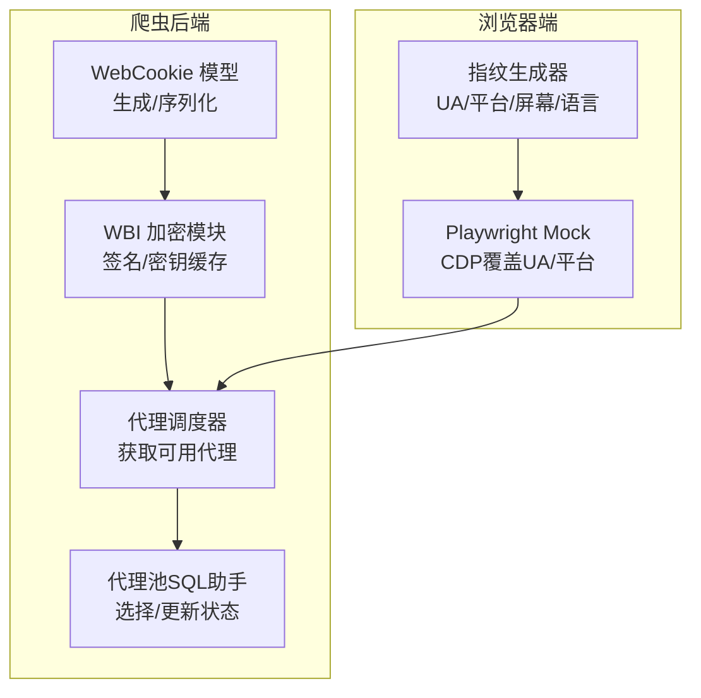
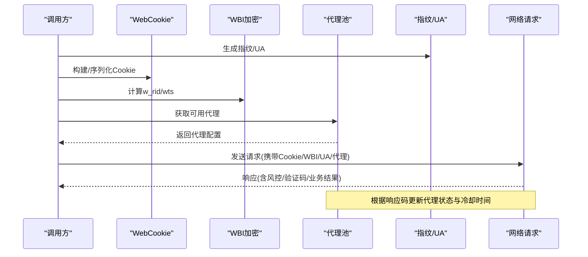
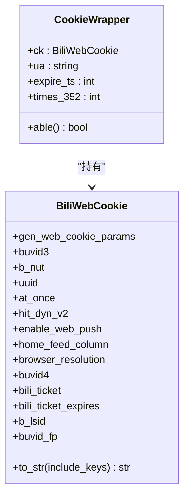
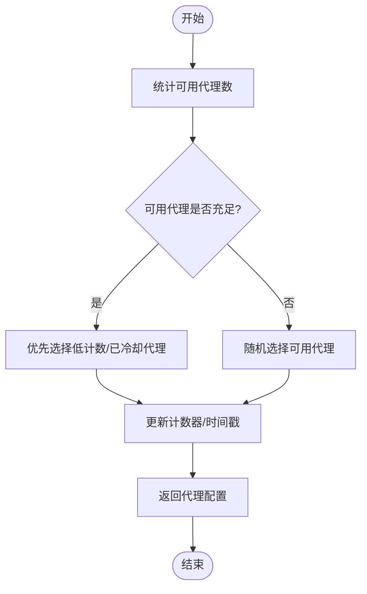
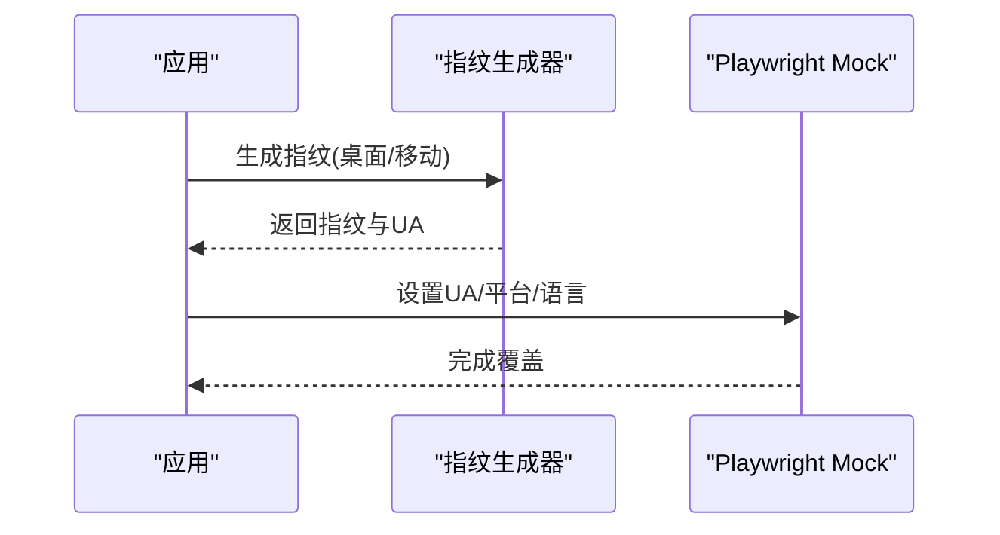
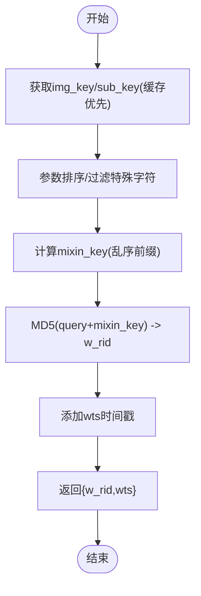
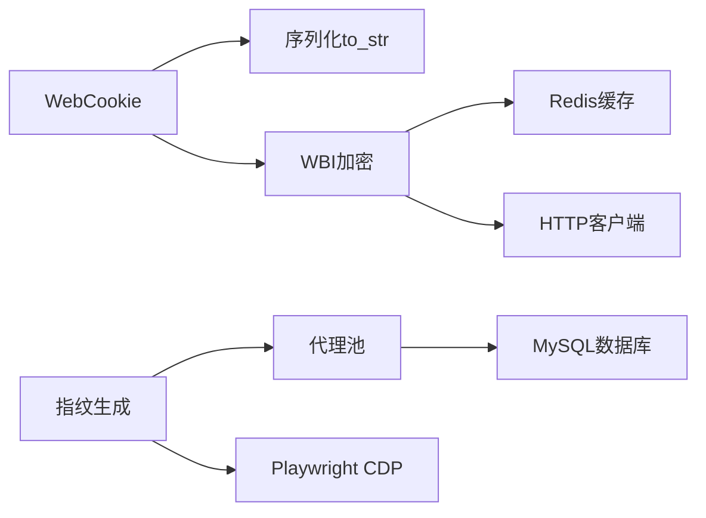

# 反检测系统

<cite>
**本文引用的文件**
- [WebCookie.py](file://be-bilibili-crawler/Models/AntiRisk/Bili/WebCookie.py)
- [wbi加密.py](file://be-bilibili-crawler/Utils/加密/wbi加密.py)
- [utils.py](file://be-bilibili-crawler/Utils/加密/utils.py)
- [available_proxy_sql_helper.py](file://be-bilibili-crawler/Utils/代理/数据库操作/available_proxy_sql_helper.py)
- [ProxyCommOp.py](file://be-bilibili-crawler/Utils/代理/数据库操作/ProxyCommOp.py)
- [fingerprint_gen.py](file://RPA-Browser/app/services/broswer_fingerprint/fingerprint_gen.py)
- [page.py](file://RPA-Browser/botright/playwright_mock/page.py)
</cite>

## 目录
1. [简介](#简介)
2. [项目结构](#项目结构)
3. [核心组件](#核心组件)
4. [架构总览](#架构总览)
5. [详细组件分析](#详细组件分析)
6. [依赖关系分析](#依赖关系分析)
7. [性能与稳定性](#性能与稳定性)
8. [故障排查指南](#故障排查指南)
9. [结论](#结论)
10. [附录：评估方法与调优建议](#附录评估方法与调优建议)

## 简介
本技术文档聚焦于反检测系统的实现，覆盖以下关键能力：
- Cookie 管理机制：WebCookie 的生成、存储、更新策略与生命周期管理。
- 代理池实现：代理IP获取、可用性校验、轮换与冷却策略。
- 请求头伪装：User-Agent 随机化、指纹混淆、浏览器环境模拟。
- WBI 加密算法：参数签名流程、密钥缓存与使用方式。
- 反检测效果评估与调优：指标体系、观测点与优化建议。
- 常见反爬措施应对：验证码、风控拦截、频率限制等。

## 项目结构
本项目在多个子服务中协作完成反检测任务：
- be-bilibili-crawler：提供 Cookie 模型、WBI 加密、代理池数据访问与调度。
- RPA-Browser：负责浏览器指纹生成与注入（UA、平台、屏幕、语言等），以及 Playwright CDP 层面的 UA 覆盖。
- 其他服务（网关、消息服务等）作为上层调用方或辅助模块。

**图表来源**
- [WebCookie.py:9-52](file://be-bilibili-crawler/Models/AntiRisk/Bili/WebCookie.py#L9-L52)
- [wbi加密.py:164-205](file://be-bilibili-crawler/Utils/加密/wbi加密.py#L164-L205)
- [available_proxy_sql_helper.py:73-138](file://be-bilibili-crawler/Utils/代理/数据库操作/available_proxy_sql_helper.py#L73-L138)
- [ProxyCommOp.py:16-79](file://be-bilibili-crawler/Utils/代理/数据库操作/ProxyCommOp.py#L16-L79)
- [fingerprint_gen.py:102-147](file://RPA-Browser/app/services/broswer_fingerprint/fingerprint_gen.py#L102-L147)
- [page.py:193-217](file://RPA-Browser/botright/playwright_mock/page.py#L193-L217)

**章节来源**
- [WebCookie.py:9-52](file://be-bilibili-crawler/Models/AntiRisk/Bili/WebCookie.py#L9-L52)
- [wbi加密.py:164-205](file://be-bilibili-crawler/Utils/加密/wbi加密.py#L164-L205)
- [available_proxy_sql_helper.py:73-138](file://be-bilibili-crawler/Utils/代理/数据库操作/available_proxy_sql_helper.py#L73-L138)
- [ProxyCommOp.py:16-79](file://be-bilibili-crawler/Utils/代理/数据库操作/ProxyCommOp.py#L16-L79)
- [fingerprint_gen.py:102-147](file://RPA-Browser/app/services/broswer_fingerprint/fingerprint_gen.py#L102-L147)
- [page.py:193-217](file://RPA-Browser/botright/playwright_mock/page.py#L193-L217)

## 核心组件
- WebCookie 模型：封装 B站 Web Cookie 字段，支持按顺序序列化为字符串，便于构造请求头中的 Cookie。
- WBI 加密：从接口获取 img_key/sub_key，计算 w_rid/wts 签名，并缓存到 Redis 以降低网络开销。
- 代理池：通过 SQL 助手选择可用代理，维护计数器、冷却时间与响应码标记；调度器负责拉取新代理并回填数据库。
- 指纹与UA：基于 BrowserForge 生成桌面/移动端指纹，应用用户设置，并通过 CDP 覆盖 UA/平台信息。

**章节来源**
- [WebCookie.py:9-52](file://be-bilibili-crawler/Models/AntiRisk/Bili/WebCookie.py#L9-L52)
- [wbi加密.py:110-205](file://be-bilibili-crawler/Utils/加密/wbi加密.py#L110-L205)
- [available_proxy_sql_helper.py:19-138](file://be-bilibili-crawler/Utils/代理/数据库操作/available_proxy_sql_helper.py#L19-L138)
- [ProxyCommOp.py:16-79](file://be-bilibili-crawler/Utils/代理/数据库操作/ProxyCommOp.py#L16-L79)
- [fingerprint_gen.py:102-147](file://RPA-Browser/app/services/broswer_fingerprint/fingerprint_gen.py#L102-L147)
- [page.py:193-217](file://RPA-Browser/botright/playwright_mock/page.py#L193-L217)

## 架构总览
反检测系统由“请求准备层”和“执行层”组成：
- 请求准备层：生成 Cookie、计算 WBI 签名、选择代理、生成指纹与 UA。
- 执行层：通过浏览器或 HTTP 客户端发起请求，根据返回码更新代理状态与 Cookie 有效性。

**图表来源**
- [WebCookie.py:38-52](file://be-bilibili-crawler/Models/AntiRisk/Bili/WebCookie.py#L38-L52)
- [wbi加密.py:164-205](file://be-bilibili-crawler/Utils/加密/wbi加密.py#L164-L205)
- [ProxyCommOp.py:16-79](file://be-bilibili-crawler/Utils/代理/数据库操作/ProxyCommOp.py#L16-L79)
- [fingerprint_gen.py:102-147](file://RPA-Browser/app/services/broswer_fingerprint/fingerprint_gen.py#L102-L147)

## 详细组件分析

### Cookie 管理机制（WebCookie）
- 生成与初始化：
  - 通过 GenWebCookieParams 传入设备指纹相关参数（如 buvid_fp、uuid、分辨率、UA 等）。
  - 在模型初始化时自动填充 buvid_fp、uuid、browser_resolution 等字段。
- 序列化策略：
  - to_str 方法按固定顺序拼接键值对，排除内部字段，确保与目标站点期望一致。
- 生命周期与更新：
  - CookieWrapper 记录 Cookie、UA、过期时间与 352 错误计数；当 352 错误次数超过阈值则判定不可用。
  - 实际更新策略通常结合服务端登录态刷新、票据（bili_ticket）续期与 Cookie 重建流程。

**图表来源**
- [WebCookie.py:9-65](file://be-bilibili-crawler/Models/AntiRisk/Bili/WebCookie.py#L9-L65)

**章节来源**
- [WebCookie.py:9-65](file://be-bilibili-crawler/Models/AntiRisk/Bili/WebCookie.py#L9-L65)

### 代理池实现原理
- 代理选择与冷却：
  - get_rand_available_proxy_sql 从 AvailableProxy 表随机选取可用代理，带锁避免并发冲突。
  - 计数器 counter 用于控制单代理使用频次；超过阈值后进入冷却（max_counter_ts），冷却期内不重用。
  - 针对特定响应码（如 -352、-412）设置专用冷却时间戳，避免频繁重试失败代理。
- 可用性统计与自适应：
  - 当可用代理数量充足（>MAX_USABLE_PROXY_NUM）时启用“好代理优先”策略；不足时降级为普通选择。
- 调度与回填：
  - ProxyCommOp.get_available_proxy 循环尝试从 AvailableProxy 或通用 ProxyTab 获取代理；若失败则触发网络抓取并回填数据库。
  - update_proxy_resp_code 与 update_available_proxy_details 根据响应码更新代理状态与冷却时间。

**图表来源**
- [available_proxy_sql_helper.py:73-138](file://be-bilibili-crawler/Utils/代理/数据库操作/available_proxy_sql_helper.py#L73-L138)
- [ProxyCommOp.py:16-79](file://be-bilibili-crawler/Utils/代理/数据库操作/ProxyCommOp.py#L16-L79)

**章节来源**
- [available_proxy_sql_helper.py:19-259](file://be-bilibili-crawler/Utils/代理/数据库操作/available_proxy_sql_helper.py#L19-L259)
- [ProxyCommOp.py:16-79](file://be-bilibili-crawler/Utils/代理/数据库操作/ProxyCommOp.py#L16-L79)

### 请求头伪装与指纹混淆
- 指纹生成：
  - 使用 BrowserForge 生成桌面或移动端指纹，包含 UA、平台、语言、屏幕尺寸、GPU 信息等。
  - 应用用户默认设置（语言、时区、视口大小、代理服务器）以贴近真实用户行为。
- UA 覆盖：
  - 通过 Playwright CDP 的 Emulation.setUserAgentOverride 与 Network.setUserAgentOverride 覆盖 UA 与平台元信息，降低被检测概率。
- 指纹一致性：
  - 将生成的指纹字典与 UA 串传递给浏览器实例，确保各维度一致，避免不一致导致的异常。

**图表来源**
- [fingerprint_gen.py:102-147](file://RPA-Browser/app/services/broswer_fingerprint/fingerprint_gen.py#L102-L147)
- [page.py:193-217](file://RPA-Browser/botright/playwright_mock/page.py#L193-L217)

**章节来源**
- [fingerprint_gen.py:102-147](file://RPA-Browser/app/services/broswer_fingerprint/fingerprint_gen.py#L102-L147)
- [page.py:193-217](file://RPA-Browser/botright/playwright_mock/page.py#L193-L217)

### WBI 加密算法的实现和使用
- 密钥获取与缓存：
  - getWbiKeys 从导航接口提取 img_url/sub_url，解析出 img_key 与 sub_key。
  - My_dm_img_Redis 将密钥缓存至 Redis，有效期一天，减少重复请求。
- 签名计算：
  - encWbi 将参数排序、过滤特殊字符、拼接 mixin_key（基于 img_key+sub_key 的乱序前缀），计算 MD5 得到 w_rid，并添加 wts 时间戳。
- 使用方式：
  - get_wbi_params 获取缓存密钥并返回签名参数，供后续 API 请求携带。

**图表来源**
- [wbi加密.py:110-205](file://be-bilibili-crawler/Utils/加密/wbi加密.py#L110-L205)

**章节来源**
- [wbi加密.py:110-205](file://be-bilibili-crawler/Utils/加密/wbi加密.py#L110-L205)

### 反检测效果评估方法与调优建议
- 评估指标：
  - 成功率：成功通过风控/验证码的比例。
  - 封禁率：因风控导致账号或IP被封的比例。
  - 延迟：请求端到端耗时分布。
  - 代理健康度：可用代理占比、冷却命中率、-352/-412 比例。
  - Cookie 有效性：352 错误次数与续期成功率。
- 观测点：
  - 代理选择策略切换阈值（MIN/MAX_USABLE_PROXY_NUM）。
  - 冷却时间（两小时窗口）与计数器阈值（20/30）。
  - WBI 密钥缓存命中率与刷新频率。
  - UA/指纹多样性与一致性。
- 调优建议：
  - 动态调整代理池规模与冷却策略，平衡成功率与成本。
  - 增加指纹多样性（多平台、多浏览器版本、多语言/时区）。
  - 合理设置请求间隔与并发，避免高频触发风控。
  - 监控并自动化处理 -352/-412 场景，及时替换代理与刷新 Cookie。

[本节为通用指导，不直接分析具体文件]

### 常见反爬措施的应对策略
- 验证码（极验等）：
  - 采用图像识别与相似度匹配（如 CLIP 嵌入+余弦相似度）进行点选验证码识别。
  - 结合旋转模板与匹配矩阵提升泛化能力。
- 风控拦截：
  - 通过 UA/指纹/代理组合降低特征暴露；遇到 -352/-412 时自动冷却与替换。
  - 使用 WBI 签名与完整 Cookie 提高请求可信度。
- 频率限制：
  - 引入随机延时与退避策略；限制单代理/单 Cookie 的请求速率。
- 会话维持：
  - 定期刷新 bili_ticket 与 Cookie，保持登录态有效。

**章节来源**
- [GeetestHandler.py:33-65](file://be-bilibili-crawler/Service/GrpcModule/Grpc/Bapi/GeetestHandler.py#L33-L65)
- [README.md:1-14](file://be-bilibili-crawler/Utils/GrpcUtils/极验/README.md#L1-L14)

## 依赖关系分析
- WebCookie 依赖 GenWebCookieParams 与序列化逻辑，确保 Cookie 字段顺序与内容正确。
- WBI 加密依赖 Redis 缓存与 HTTP 客户端获取密钥，签名过程依赖参数排序与 MD5。
- 代理池依赖 SQLAlchemy 异步会话与 MySQL 数据库，维护代理状态与冷却时间。
- 指纹生成依赖 BrowserForge 与用户设置，最终通过 CDP 注入到浏览器。

**图表来源**
- [WebCookie.py:38-52](file://be-bilibili-crawler/Models/AntiRisk/Bili/WebCookie.py#L38-L52)
- [wbi加密.py:110-205](file://be-bilibili-crawler/Utils/加密/wbi加密.py#L110-L205)
- [available_proxy_sql_helper.py:73-138](file://be-bilibili-crawler/Utils/代理/数据库操作/available_proxy_sql_helper.py#L73-L138)
- [fingerprint_gen.py:102-147](file://RPA-Browser/app/services/broswer_fingerprint/fingerprint_gen.py#L102-L147)
- [page.py:193-217](file://RPA-Browser/botright/playwright_mock/page.py#L193-L217)

**章节来源**
- [WebCookie.py:38-52](file://be-bilibili-crawler/Models/AntiRisk/Bili/WebCookie.py#L38-L52)
- [wbi加密.py:110-205](file://be-bilibili-crawler/Utils/加密/wbi加密.py#L110-L205)
- [available_proxy_sql_helper.py:73-138](file://be-bilibili-crawler/Utils/代理/数据库操作/available_proxy_sql_helper.py#L73-L138)
- [ProxyCommOp.py:16-79](file://be-bilibili-crawler/Utils/代理/数据库操作/ProxyCommOp.py#L16-L79)
- [fingerprint_gen.py:102-147](file://RPA-Browser/app/services/broswer_fingerprint/fingerprint_gen.py#L102-L147)
- [page.py:193-217](file://RPA-Browser/botright/playwright_mock/page.py#L193-L217)

## 性能与稳定性
- 代理池性能：
  - 使用 with_for_update(skip_locked=True) 避免行锁竞争，提升并发选择效率。
  - 计数器与冷却机制降低热点代理负载，提升整体可用性。
- WBI 加密性能：
  - Redis 缓存密钥减少网络请求，降低签名延迟。
- 指纹注入性能：
  - CDP 覆盖 UA/平台开销较小，适合高并发场景。
- 稳定性保障：
  - 数据库操作使用事务与重试包装，异常时回滚并记录日志。
  - 代理获取失败时自动触发网络抓取与回填，保证持续供应。

[本节为通用指导，不直接分析具体文件]

## 故障排查指南
- Cookie 失效：
  - 检查 CookieWrapper.times_352 是否超过阈值；必要时刷新登录态与票据。
  - 确认 to_str 输出顺序与目标站点期望一致。
- 代理不可用：
  - 查看 resp_code 是否为 -352/-412，确认冷却时间戳是否生效。
  - 检查 available_proxy_sql_helper 的选择逻辑与计数器更新是否正确。
- WBI 签名失败：
  - 确认 Redis 中密钥是否过期；必要时强制刷新。
  - 检查参数排序与特殊字符过滤是否符合规范。
- 指纹不一致：
  - 核对 UA、平台、语言、视口等是否与目标站点预期一致。
  - 确认 CDP 覆盖是否成功应用。

**章节来源**
- [WebCookie.py:54-65](file://be-bilibili-crawler/Models/AntiRisk/Bili/WebCookie.py#L54-L65)
- [available_proxy_sql_helper.py:196-259](file://be-bilibili-crawler/Utils/代理/数据库操作/available_proxy_sql_helper.py#L196-L259)
- [wbi加密.py:110-205](file://be-bilibili-crawler/Utils/加密/wbi加密.py#L110-L205)
- [fingerprint_gen.py:102-147](file://RPA-Browser/app/services/broswer_fingerprint/fingerprint_gen.py#L102-L147)
- [page.py:193-217](file://RPA-Browser/botright/playwright_mock/page.py#L193-L217)

## 结论
本反检测系统通过 Cookie 管理、代理池调度、指纹与 UA 伪装、WBI 签名等关键技术，构建了完整的反检测链路。系统在并发与稳定性方面具备良好表现，可通过指标监控与策略调优进一步提升成功率与鲁棒性。

[本节为总结性内容，不直接分析具体文件]

## 附录：评估方法与调优建议
- 评估方法：
  - 建立埋点与日志采集，统计成功率、封禁率、延迟、代理健康度、Cookie 有效性。
  - 使用 A/B 测试对比不同策略（如代理选择、冷却时间、指纹多样性）的效果。
- 调优建议：
  - 动态调整代理池规模与冷却策略，平衡成功率与成本。
  - 增加指纹多样性与 UA 随机化范围，降低特征暴露风险。
  - 优化 WBI 密钥缓存与刷新策略，减少网络开销。
  - 建立自动化告警与自愈机制，快速响应异常与风控。

[本节为通用指导，不直接分析具体文件]