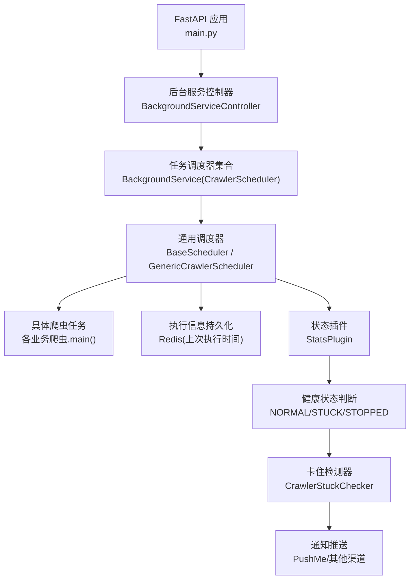
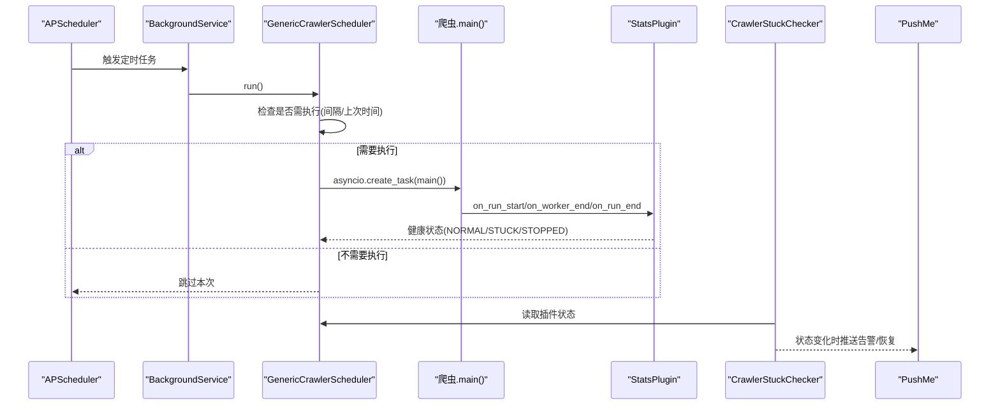
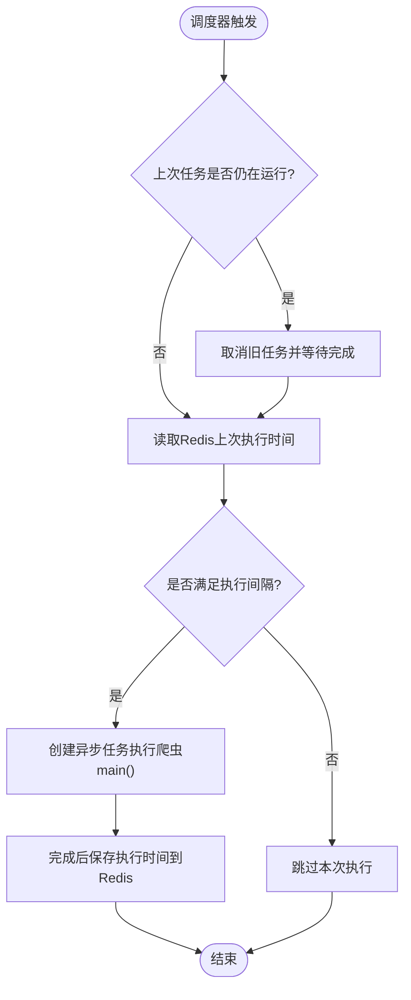
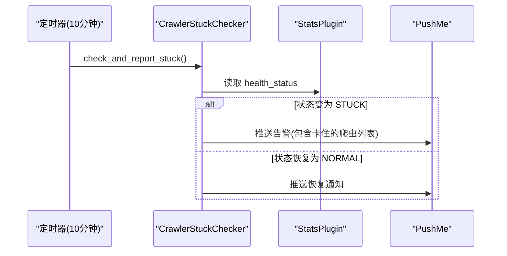
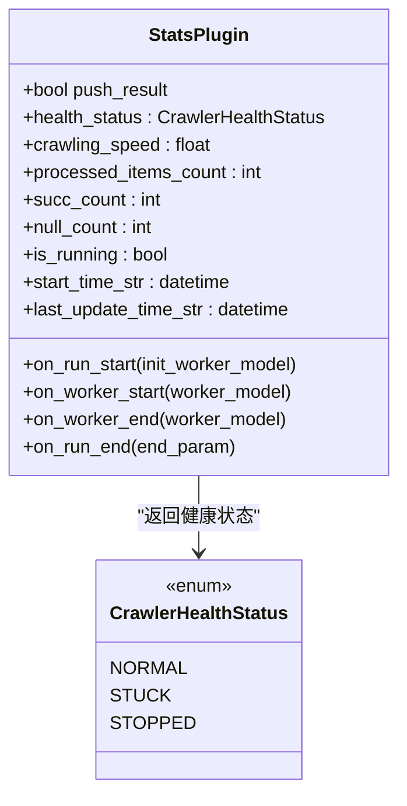
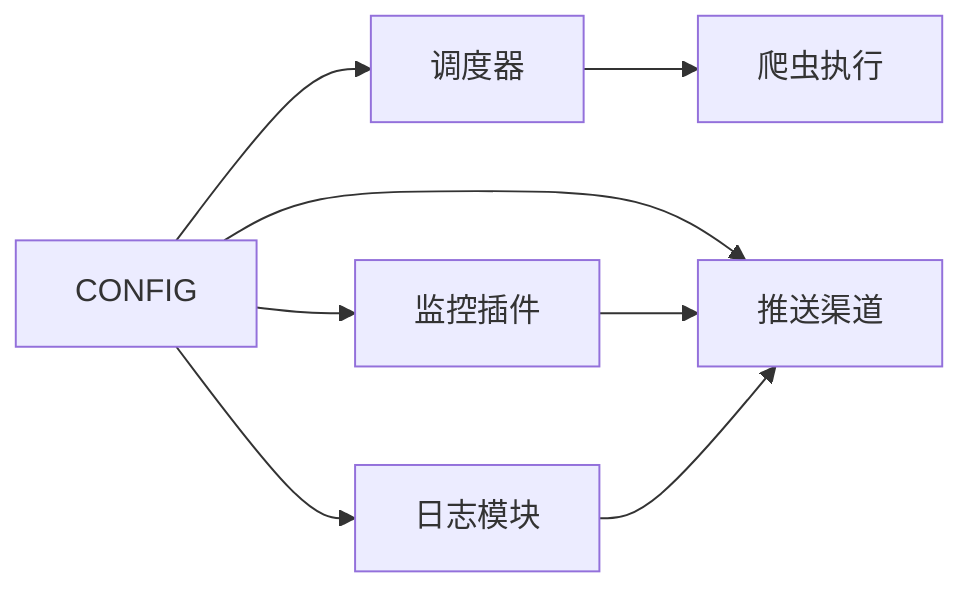

# 后台服务

<cite>
**本文引用的文件**
- [CrawlerScheduler.py](file://be-bilibili-crawler/Service/BackgroundService/CrawlerScheduler.py)
- [DailyReportCrawler.py](file://be-bilibili-crawler/Service/BackgroundService/DailyReportCrawler.py)
- [scheduler_launcher.py](file://be-bilibili-crawler/Service/BaseCrawler/launcher/scheduler_launcher.py)
- [statusPlugin.py](file://be-bilibili-crawler/Service/BaseCrawler/plugin/statusPlugin.py)
- [CONFIG.py](file://be-bilibili-crawler/CONFIG.py)
- [base_log.py](file://be-bilibili-crawler/log/base_log.py)
- [main.py](file://be-bilibili-crawler/main.py)
</cite>

## 目录
1. [简介](#简介)
2. [项目结构](#项目结构)
3. [核心组件](#核心组件)
4. [架构总览](#架构总览)
5. [详细组件分析](#详细组件分析)
6. [依赖关系分析](#依赖关系分析)
7. [性能考虑](#性能考虑)
8. [故障排查指南](#故障排查指南)
9. [结论](#结论)
10. [附录：部署与运维](#附录部署与运维)

## 简介
本文件面向后台服务的运维与研发人员，系统化说明爬虫调度器的实现原理（任务调度、并发控制、资源管理）、每日报告爬虫的数据收集与通知机制、爬虫状态监控系统的健康检测与告警策略，以及配置管理、日志记录、错误处理机制。同时提供部署与运维要点、性能调优建议与故障恢复策略，帮助在生产环境中稳定运行并快速定位问题。

## 项目结构
本项目后台服务以 be-bilibili-crawler 为核心，围绕“定时调度 + 爬虫执行 + 状态监控 + 通知推送”的闭环构建。关键目录与职责如下：
- Service/BackgroundService：后台任务编排与每日报告相关逻辑
- Service/BaseCrawler：通用爬虫框架与调度器、插件体系
- log：统一日志模块
- CONFIG：集中式配置（数据库、缓存、消息队列、推送渠道等）
- main：FastAPI 应用入口与全局异常处理

图表来源
- [main.py:48-59](file://be-bilibili-crawler/main.py#L48-L59)
- [CrawlerScheduler.py:24-117](file://be-bilibili-crawler/Service/BackgroundService/CrawlerScheduler.py#L24-L117)
- [scheduler_launcher.py:82-265](file://be-bilibili-crawler/Service/BaseCrawler/launcher/scheduler_launcher.py#L82-L265)
- [statusPlugin.py:22-288](file://be-bilibili-crawler/Service/BaseCrawler/plugin/statusPlugin.py#L22-L288)
- [DailyReportCrawler.py:25-107](file://be-bilibili-crawler/Service/BackgroundService/DailyReportCrawler.py#L25-L107)

章节来源
- [main.py:48-59](file://be-bilibili-crawler/main.py#L48-L59)
- [CrawlerScheduler.py:24-117](file://be-bilibili-crawler/Service/BackgroundService/CrawlerScheduler.py#L24-L117)

## 核心组件
- 任务调度器
  - BaseScheduler：基于 APScheduler 的定时任务封装，支持 cron 表达式、最大实例数限制、错过任务合并、首次立即执行、旧任务杀新启动等能力。
  - GenericCrawlerScheduler：面向爬虫类的通用调度器，自动绑定爬虫 main 方法作为任务函数。
- 执行信息与间隔控制
  - CrawlerExecutionInfo：维护每次任务的最后执行时间，并通过 Redis 持久化；根据默认间隔判断是否需要执行，避免过于频繁触发。
- 状态监控与告警
  - StatsPlugin：采集爬虫运行统计（开始/结束时间、处理数量、成功率、速度等），并提供健康状态判定（正常/卡住/停止）。
  - CrawlerStuckChecker：周期性检查目标爬虫的健康状态，仅在状态变化时发送通知，避免重复告警。
- 配置与日志
  - CONFIG：集中管理数据库连接池、Redis、RabbitMQ、LLM、代理、推送渠道等配置。
  - base_log：按业务域划分日志输出，支持异步写入、轮转与压缩。

章节来源
- [scheduler_launcher.py:17-265](file://be-bilibili-crawler/Service/BaseCrawler/launcher/scheduler_launcher.py#L17-L265)
- [statusPlugin.py:22-288](file://be-bilibili-crawler/Service/BaseCrawler/plugin/statusPlugin.py#L22-L288)
- [DailyReportCrawler.py:25-107](file://be-bilibili-crawler/Service/BackgroundService/DailyReportCrawler.py#L25-L107)
- [CONFIG.py:225-483](file://be-bilibili-crawler/CONFIG.py#L225-L483)
- [base_log.py:44-96](file://be-bilibili-crawler/log/base_log.py#L44-L96)

## 架构总览
后台服务采用“调度层 + 执行层 + 监控层 + 通知层”的分层架构：
- 调度层：通过 BackgroundService 注册多个定时任务，使用 APScheduler 驱动执行。
- 执行层：每个任务对应一个爬虫或脚本，遵循 BaseCrawler 规范，具备统一的参数生成、并发控制、插件扩展点。
- 监控层：StatsPlugin 实时采集指标，CrawlerStuckChecker 定期评估健康度。
- 通知层：通过 PushMe 等渠道推送告警与恢复通知。

图表来源
- [scheduler_launcher.py:138-197](file://be-bilibili-crawler/Service/BaseCrawler/launcher/scheduler_launcher.py#L138-L197)
- [statusPlugin.py:52-153](file://be-bilibili-crawler/Service/BaseCrawler/plugin/statusPlugin.py#L52-L153)
- [DailyReportCrawler.py:46-107](file://be-bilibili-crawler/Service/BackgroundService/DailyReportCrawler.py#L46-L107)

## 详细组件分析

### 任务调度器（BaseScheduler / GenericCrawlerScheduler）
- 任务注册与调度
  - 使用 CronTrigger 解析 cron 表达式，为每个任务分配唯一 job_id。
  - 首次添加任务时设置 next_run_time 为当前时间，确保立即执行一次；coalesce=True 合并错过的任务；max_instances=1 保证同一时刻仅一个实例运行。
- 并发与防重入
  - 若上一次任务仍在运行，先 cancel 旧任务再创建新任务，避免任务堆积导致永久停摆。
  - 通过 asyncio.create_task 异步执行爬虫 main，不阻塞下一次触发。
- 执行间隔控制
  - 借助 CrawlerExecutionInfo 从 Redis 读取上次执行时间，结合 default_interval_seconds 判断是否满足执行条件。
- 生命周期管理
  - 提供 start/pause/remove/terminate 等方法，便于运行时动态管理任务。

图表来源
- [scheduler_launcher.py:115-197](file://be-bilibili-crawler/Service/BaseCrawler/launcher/scheduler_launcher.py#L115-L197)
- [scheduler_launcher.py:23-80](file://be-bilibili-crawler/Service/BaseCrawler/launcher/scheduler_launcher.py#L23-L80)

章节来源
- [scheduler_launcher.py:82-265](file://be-bilibili-crawler/Service/BaseCrawler/launcher/scheduler_launcher.py#L82-L265)

### 每日报告爬虫（卡住检测与通知）
- 监控范围
  - 针对预约抽奖、动态详情、话题抽奖、刷新B站抽奖数据库、官方API爬虫、第三方爬虫等关键任务进行健康监控。
- 健康判定
  - 通过 StatsPlugin.health_status 获取健康状态：未运行返回 STOPPED；运行中且长时间无更新或任务长时间未更新则返回 STUCK；否则 NORMAL。
- 通知策略
  - 仅在状态由正常变为卡住时推送告警；由卡住恢复为正常时推送恢复通知，避免重复打扰。
- 执行频率
  - 每10分钟执行一次检查，兼顾及时性与系统开销。

图表来源
- [DailyReportCrawler.py:25-107](file://be-bilibili-crawler/Service/BackgroundService/DailyReportCrawler.py#L25-L107)
- [statusPlugin.py:248-288](file://be-bilibili-crawler/Service/BaseCrawler/plugin/statusPlugin.py#L248-L288)

章节来源
- [DailyReportCrawler.py:25-107](file://be-bilibili-crawler/Service/BackgroundService/DailyReportCrawler.py#L25-L107)

### 状态监控系统（StatsPlugin）
- 指标采集
  - 记录运行起止时间、处理项数、成功/空数据/失败计数、平均速度、运行中参数集合等。
- 健康状态算法
  - 运行中且有任务：任一任务 updated_at 超过1天视为 STUCK。
  - 运行中但无任务：last_update_time 超过10分钟未更新视为 STUCK。
  - 未运行：STOPPED。
- 可选推送
  - 运行结束时可选择推送统计摘要，便于复盘。

图表来源
- [statusPlugin.py:22-288](file://be-bilibili-crawler/Service/BaseCrawler/plugin/statusPlugin.py#L22-L288)

章节来源
- [statusPlugin.py:22-288](file://be-bilibili-crawler/Service/BaseCrawler/plugin/statusPlugin.py#L22-L288)

### 配置管理（CONFIG）
- 环境变量与模型
  - Settings 集中声明数据库、缓存、消息队列、LLM、代理等配置，支持 .env.fastapi.prod/.dev 加载。
- 推送渠道
  - PushChannelConfig 定义多通道推送字段，PushNotifyConfig 从中派生具体渠道配置。
- 数据库连接池
  - SqlAlchemyConfig 与 CrawlerSqlAlchemyConfig 分别隔离业务与爬虫连接池，避免爬虫高并发影响接口响应。
- 统一访问入口
  - _CONFIG 提供便捷属性与方法，如 get_crawler_config、随机 UA、代理地址等。

章节来源
- [CONFIG.py:225-483](file://be-bilibili-crawler/CONFIG.py#L225-L483)

### 日志记录与错误处理
- 日志
  - 按业务域创建独立 Logger，支持异步写入、轮转、压缩与保留天数过滤。
- 全局异常
  - FastAPI 全局异常处理器捕获未处理异常，记录请求上下文并推送告警，返回标准错误响应。
- 中间件
  - HTTP 中间件在调试模式下记录请求耗时、IP、路径、状态码与响应体，便于性能分析与问题定位。

章节来源
- [base_log.py:44-96](file://be-bilibili-crawler/log/base_log.py#L44-L96)
- [main.py:63-112](file://be-bilibili-crawler/main.py#L63-L112)

## 依赖关系分析
- 调度器依赖
  - APScheduler 提供定时触发；Redis 用于执行间隔持久化；asyncio 用于并发执行。
- 监控依赖
  - StatsPlugin 依赖爬虫框架的 WorkerModel 与枚举；CrawlerStuckChecker 依赖 StatsPlugin 暴露的健康状态。
- 配置依赖
  - CONFIG 被调度器、监控、日志、推送等多处引用，确保一致的环境变量与连接参数。
- 外部集成
  - PushMe 等推送渠道用于告警与恢复通知；MySQL/Redis/RabbitMQ 作为数据存储与消息传递。

图表来源
- [CONFIG.py:225-483](file://be-bilibili-crawler/CONFIG.py#L225-L483)
- [scheduler_launcher.py:82-265](file://be-bilibili-crawler/Service/BaseCrawler/launcher/scheduler_launcher.py#L82-L265)
- [statusPlugin.py:22-288](file://be-bilibili-crawler/Service/BaseCrawler/plugin/statusPlugin.py#L22-L288)
- [base_log.py:44-96](file://be-bilibili-crawler/log/base_log.py#L44-L96)

章节来源
- [CONFIG.py:225-483](file://be-bilibili-crawler/CONFIG.py#L225-L483)
- [scheduler_launcher.py:82-265](file://be-bilibili-crawler/Service/BaseCrawler/launcher/scheduler_launcher.py#L82-L265)
- [statusPlugin.py:22-288](file://be-bilibili-crawler/Service/BaseCrawler/plugin/statusPlugin.py#L22-L288)
- [base_log.py:44-96](file://be-bilibili-crawler/log/base_log.py#L44-L96)

## 性能考虑
- 调度与并发
  - max_instances=1 防止同一任务并发执行造成资源竞争；异步任务创建避免阻塞下一次触发。
  - 对长耗时任务，采用“杀旧开新”策略，确保调度器不被卡死任务拖垮。
- 执行间隔
  - 通过 Redis 持久化上次执行时间，结合 default_interval_seconds 控制最小执行间隔，降低外部压力。
- 连接池隔离
  - 爬虫与业务使用独立的 SQLAlchemy 连接池，避免爬虫高并发抢占接口资源。
- 日志与监控
  - 日志异步写入与轮转压缩，减少 IO 阻塞；StatsPlugin 提供速度与成功率指标，便于容量规划与瓶颈定位。
- 推送限流
  - 仅在状态变化时推送，避免频繁告警造成通道拥塞。

[本节为通用指导，无需特定文件来源]

## 故障排查指南
- 常见问题
  - 任务未执行：检查 cron 表达式、default_interval_seconds、Redis 中的上次执行时间是否正确。
  - 任务卡住：查看 StatsPlugin.health_status 是否为 STUCK；确认 last_update_time 与 running_params_set 的更新时间。
  - 通知未送达：核对 PushMe 等渠道配置（token/url）与网络连通性。
- 日志定位
  - 使用 base_log 提供的业务域日志，定位具体模块的错误堆栈与上下文。
  - 在调试模式下开启 HTTP 中间件日志，观察请求耗时与响应体。
- 恢复步骤
  - 暂停或移除异常任务后重新添加；必要时重启调度器。
  - 清理 Redis 中异常的执行时间键值，使任务可再次触发。

章节来源
- [scheduler_launcher.py:115-197](file://be-bilibili-crawler/Service/BaseCrawler/launcher/scheduler_launcher.py#L115-L197)
- [statusPlugin.py:248-288](file://be-bilibili-crawler/Service/BaseCrawler/plugin/statusPlugin.py#L248-L288)
- [base_log.py:44-96](file://be-bilibili-crawler/log/base_log.py#L44-L96)
- [main.py:63-112](file://be-bilibili-crawler/main.py#L63-L112)

## 结论
本后台服务通过统一的调度器、完善的监控插件与灵活的通知机制，实现了爬虫任务的可靠执行与健康保障。配置集中化与日志分域化提升了可维护性，连接池隔离与异步执行保障了性能与稳定性。配合合理的部署与运维实践，可在生产环境长期稳定运行。

[本节为总结性内容，无需特定文件来源]

## 附录：部署与运维
- 环境与配置
  - 通过 .env.fastapi.prod/.dev 注入数据库、缓存、消息队列、LLM、代理、推送渠道等配置。
  - 使用 Settings 与 _CONFIG 统一管理，避免硬编码。
- 进程管理
  - 使用 uvicorn 启动 FastAPI 应用；可通过 pm2 或 systemd 管理进程生命周期。
- 调度器启停
  - 使用 scheduler.start/pause/remove/terminate 动态管理任务；必要时重启服务以重置状态。
- 监控与告警
  - 关注 StatsPlugin 指标与 CrawlerStuckChecker 告警；合理调整阈值与推送频率。
- 备份与回滚
  - 定期备份 MySQL 与 Redis 数据；变更前做好版本管理与回滚预案。
- 性能调优
  - 根据负载调整连接池大小、超时与回收周期；优化爬虫并发与重试策略；按需关闭调试日志以减少 IO。
- 故障恢复
  - 遇到卡住任务优先终止并清理状态；检查外部依赖（API、数据库、消息队列）可用性；必要时降级或熔断。

[本节为通用指导，无需特定文件来源]