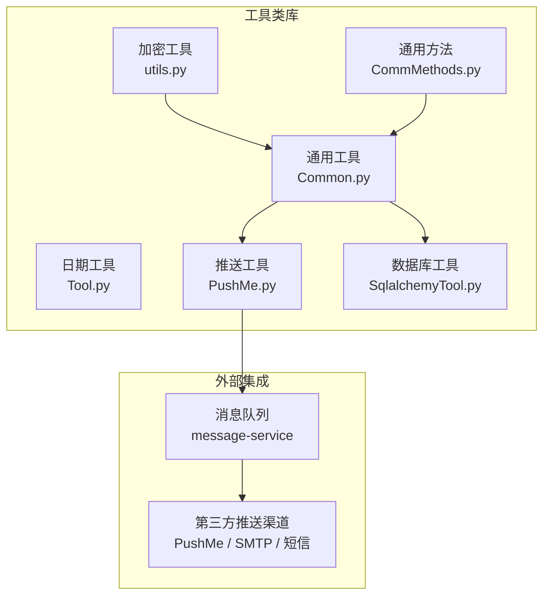
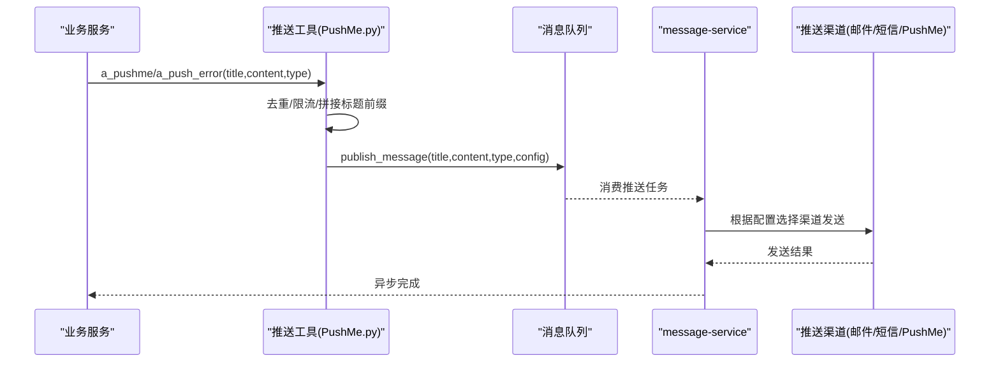
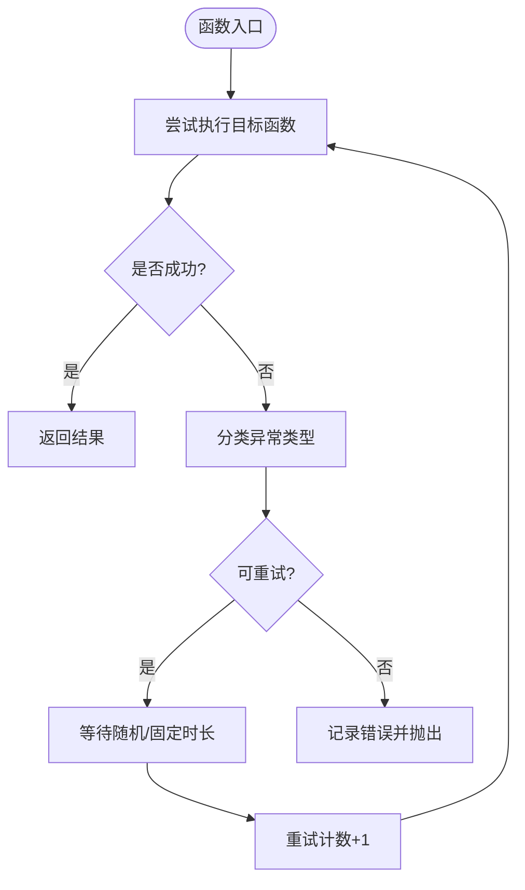
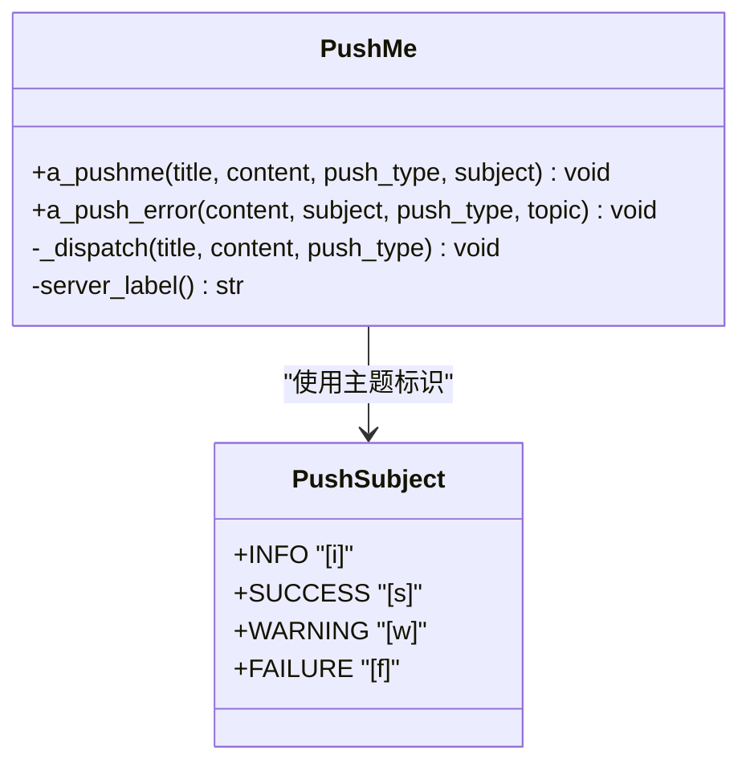
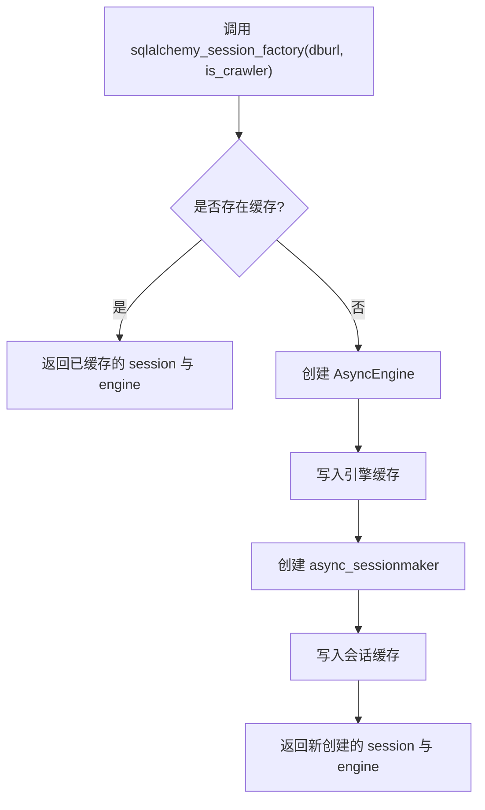
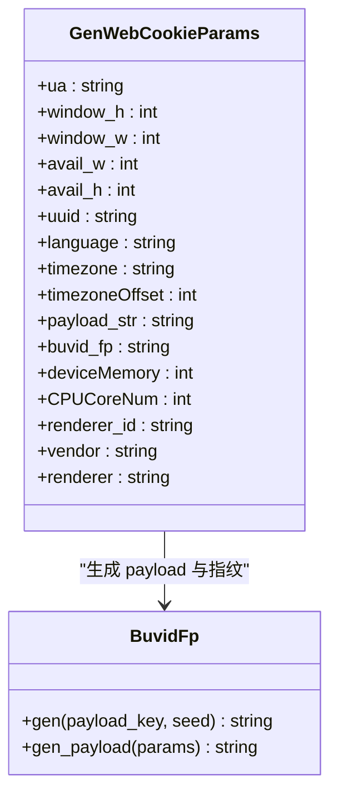
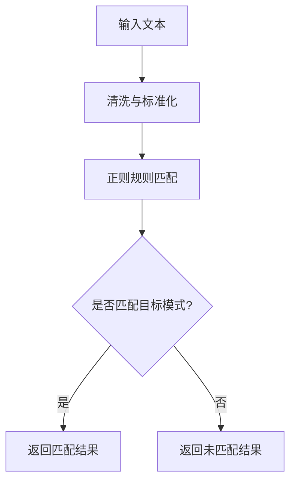
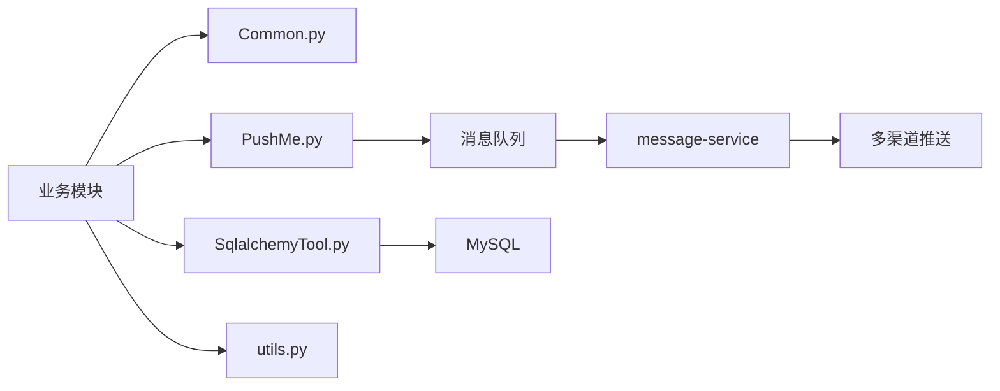

# 工具类库

<cite>
**本文引用的文件**
- [Common.py](file://be-bilibili-crawler/Utils/通用/Common.py)
- [Tool.py](file://be-bilibili-crawler/Utils/通用/Tool.py)
- [PushMe.py](file://be-bilibili-crawler/Utils/推送/PushMe.py)
- [SqlalchemyTool.py](file://be-bilibili-crawler/Utils/数据库/SqlalchemyTool.py)
- [utils.py](file://be-bilibili-crawler/Utils/加密/utils.py)
- [CommMethods.py](file://be-bilibili-crawler/Utils/通用/CommMethods.py)
- [test.js](file://be-gateway/测试/推送测试/test.js)
- [PushService.gen.ts](file://Vue3FrontEndDemoExercise/src/api/community/hey-api/services/PushService.gen.ts)
</cite>

## 目录
1. [简介](#简介)
2. [项目结构](#项目结构)
3. [核心组件](#核心组件)
4. [架构总览](#架构总览)
5. [详细组件分析](#详细组件分析)
6. [依赖关系分析](#依赖关系分析)
7. [性能考量](#性能考量)
8. [故障排查指南](#故障排查指南)
9. [结论](#结论)
10. [附录：使用示例与最佳实践](#附录使用示例与最佳实践)

## 简介
本仓库包含多个后端服务与前端工程，其中“工具类库”主要位于 be-bilibili-crawler/Utils 目录下，提供跨模块复用的通用能力，包括：
- 字符串与日期处理、并发控制、重试与限流等通用方法
- 统一的推送通道封装（通过消息队列交由 message-service 统一分发）
- SQLAlchemy 异步会话与引擎的进程内缓存与复用
- 加密与指纹生成工具（HMAC、Murmur3、设备指纹等）
- 网络请求封装与内容识别辅助方法

本文面向开发者与使用者，系统梳理这些工具类的职责、调用方式、扩展点与最佳实践。

## 项目结构
工具类库按功能域划分：
- 通用工具：并发、重试、日志、SQL 错误处理、协程聚合等
- 推送工具：统一标题前缀、去重与限流、发布到消息队列
- 数据库工具：异步 Engine/Session 工厂与进程内缓存
- 加密工具：哈希、签名、指纹、ID 生成等
- 通用方法：文本清洗、正则匹配、转发/抽奖判断、代理请求封装

图表来源
- [Common.py:1-346](file://be-bilibili-crawler/Utils/通用/Common.py#L1-L346)
- [PushMe.py:1-137](file://be-bilibili-crawler/Utils/推送/PushMe.py#L1-L137)
- [SqlalchemyTool.py:1-48](file://be-bilibili-crawler/Utils/数据库/SqlalchemyTool.py#L1-L48)
- [utils.py:1-422](file://be-bilibili-crawler/Utils/加密/utils.py#L1-L422)
- [CommMethods.py:1-541](file://be-bilibili-crawler/Utils/通用/CommMethods.py#L1-L541)

章节来源
- [Common.py:1-346](file://be-bilibili-crawler/Utils/通用/Common.py#L1-L346)
- [PushMe.py:1-137](file://be-bilibili-crawler/Utils/推送/PushMe.py#L1-L137)
- [SqlalchemyTool.py:1-48](file://be-bilibili-crawler/Utils/数据库/SqlalchemyTool.py#L1-L48)
- [utils.py:1-422](file://be-bilibili-crawler/Utils/加密/utils.py#L1-L422)
- [CommMethods.py:1-541](file://be-bilibili-crawler/Utils/通用/CommMethods.py#L1-L541)

## 核心组件
- 通用工具（Common.py）
  - 协程与线程池执行、全局锁、信号量
  - 重试装饰器（固定间隔、最大次数、带日志）
  - SQL 异常分类与自动重试（连接丢失、死锁、Too many connections 等）
  - 协程聚合执行并记录异常
- 推送工具（PushMe.py）
  - 统一标题前缀（服务名@地址 + 主题标识）
  - 内容去重与最小推送间隔限制
  - 通过消息队列将推送任务交给 message-service 统一分发
- 数据库工具（SqlalchemyTool.py）
  - 基于 (dburl, is_crawler) 的 Engine/Session 进程内缓存
  - 避免多实例重复创建连接池导致 MySQL 连接耗尽
- 加密工具（utils.py）
  - HMAC-SHA256、Murmur3 128位哈希、时间戳、UUID、浏览器指纹参数生成
- 通用方法（CommMethods.py）
  - 文本清洗、繁体转简体、正则规则集（抽奖/转发判断）
  - 代理请求封装（通过 Redis 代理）

章节来源
- [Common.py:23-112](file://be-bilibili-crawler/Utils/通用/Common.py#L23-L112)
- [Common.py:173-291](file://be-bilibili-crawler/Utils/通用/Common.py#L173-L291)
- [PushMe.py:14-137](file://be-bilibili-crawler/Utils/推送/PushMe.py#L14-L137)
- [SqlalchemyTool.py:11-48](file://be-bilibili-crawler/Utils/数据库/SqlalchemyTool.py#L11-L48)
- [utils.py:24-144](file://be-bilibili-crawler/Utils/加密/utils.py#L24-L144)
- [CommMethods.py:46-218](file://be-bilibili-crawler/Utils/通用/CommMethods.py#L46-L218)

## 架构总览
推送链路从业务侧统一入口进入，经限流与去重后投递至消息队列，由 message-service 消费者根据配置选择具体渠道（PushMe、邮件、短信等）进行发送。

图表来源
- [PushMe.py:72-137](file://be-bilibili-crawler/Utils/推送/PushMe.py#L72-L137)
- [PushService.gen.ts:8-36](file://Vue3FrontEndDemoExercise/src/api/community/hey-api/services/PushService.gen.ts#L8-L36)
- [test.js:1-22](file://be-gateway/测试/推送测试/test.js#L1-L22)

## 详细组件分析

### 通用工具（Common.py）
- 并发与调度
  - 提供信号量生成器、全局异步锁、线程池执行器，便于在异步场景下安全地执行阻塞或高并发任务。
- 重试机制
  - 通用重试装饰器支持最大重试次数与固定间隔；针对 SQL 操作提供专用重试包装，对常见 MySQL 错误码进行分类处理（如 1040 Too many connections、1213 Deadlock、2013 连接丢失等），并在必要时打印诊断信息。
- 协程聚合
  - 提供安全的 gather 封装，捕获单个协程异常并记录，不影响整体流程。

图表来源
- [Common.py:76-106](file://be-bilibili-crawler/Utils/通用/Common.py#L76-L106)
- [Common.py:173-291](file://be-bilibili-crawler/Utils/通用/Common.py#L173-L291)

章节来源
- [Common.py:23-112](file://be-bilibili-crawler/Utils/通用/Common.py#L23-L112)
- [Common.py:173-291](file://be-bilibili-crawler/Utils/通用/Common.py#L173-L291)

### 推送工具（PushMe.py）
- 标题规范
  - 统一以“[主题] + 服务@地址 + 标题”的形式输出，便于告警溯源。
- 限流与去重
  - 使用双端队列维护最近推送内容，结合最小推送间隔，避免刷屏与接口压力。
- 统一分发
  - 通过消息队列将推送任务交给 message-service，集中管理渠道配置与路由。

图表来源
- [PushMe.py:14-137](file://be-bilibili-crawler/Utils/推送/PushMe.py#L14-L137)

章节来源
- [PushMe.py:14-137](file://be-bilibili-crawler/Utils/推送/PushMe.py#L14-L137)

### 数据库工具（SqlalchemyTool.py）
- 引擎与会话缓存
  - 以 (dburl, is_crawler) 为键缓存 AsyncEngine 与 async_sessionmaker，避免重复创建连接池导致的连接数爆炸。
- 配置注入
  - 从全局配置读取 engine/session 参数，支持爬虫专用池与普通池区分。

图表来源
- [SqlalchemyTool.py:11-48](file://be-bilibili-crawler/Utils/数据库/SqlalchemyTool.py#L11-L48)

章节来源
- [SqlalchemyTool.py:11-48](file://be-bilibili-crawler/Utils/数据库/SqlalchemyTool.py#L11-L48)

### 加密工具（utils.py）
- 哈希与签名
  - 提供 HMAC-SHA256 签名、Murmur3 128位哈希，用于数据完整性校验与快速分片。
- 指纹与 ID
  - 生成浏览器指纹相关参数（UA、屏幕分辨率、WebGL 信息等），以及自定义 UUID 与时间戳。
- 用途
  - 常用于 API 签名、反爬指纹构造、唯一标识生成等。

图表来源
- [utils.py:161-422](file://be-bilibili-crawler/Utils/加密/utils.py#L161-L422)

章节来源
- [utils.py:24-144](file://be-bilibili-crawler/Utils/加密/utils.py#L24-L144)
- [utils.py:161-422](file://be-bilibili-crawler/Utils/加密/utils.py#L161-L422)

### 通用方法（CommMethods.py）
- 文本处理
  - 繁体转简体、清理无关字符、标准化表达。
- 规则匹配
  - 大量正则表达式用于识别“抽奖/转发/评论”等意图，便于自动化决策。
- 网络请求
  - 封装了基于代理的请求方法，便于在受限网络环境下稳定抓取。

图表来源
- [CommMethods.py:46-218](file://be-bilibili-crawler/Utils/通用/CommMethods.py#L46-L218)
- [CommMethods.py:408-443](file://be-bilibili-crawler/Utils/通用/CommMethods.py#L408-L443)

章节来源
- [CommMethods.py:46-218](file://be-bilibili-crawler/Utils/通用/CommMethods.py#L46-L218)
- [CommMethods.py:408-443](file://be-bilibili-crawler/Utils/通用/CommMethods.py#L408-L443)

### 日期工具（Tool.py）
- 字符串与时间戳转换
  - 提供字符串到 datetime、时间戳到 datetime 的转换，支持时区偏移。

章节来源
- [Tool.py:4-13](file://be-bilibili-crawler/Utils/通用/Tool.py#L4-L13)

## 依赖关系分析
- 推送链路依赖
  - 业务服务 -> PushMe 工具 -> 消息队列 -> message-service -> 多渠道（PushMe/邮件/短信）
- 数据库访问依赖
  - 各模块通过 SqlalchemyTool 获取共享的 Engine/Session，降低连接开销
- 通用工具依赖
  - Common.py 被多处复用，提供重试、并发、SQL 错误处理等基础能力
- 加密工具依赖
  - utils.py 为签名与指纹生成提供底层能力，被上层业务或爬虫模块使用

图表来源
- [Common.py:1-346](file://be-bilibili-crawler/Utils/通用/Common.py#L1-L346)
- [PushMe.py:1-137](file://be-bilibili-crawler/Utils/推送/PushMe.py#L1-L137)
- [SqlalchemyTool.py:1-48](file://be-bilibili-crawler/Utils/数据库/SqlalchemyTool.py#L1-L48)
- [utils.py:1-422](file://be-bilibili-crawler/Utils/加密/utils.py#L1-L422)

章节来源
- [Common.py:1-346](file://be-bilibili-crawler/Utils/通用/Common.py#L1-L346)
- [PushMe.py:1-137](file://be-bilibili-crawler/Utils/推送/PushMe.py#L1-L137)
- [SqlalchemyTool.py:1-48](file://be-bilibili-crawler/Utils/数据库/SqlalchemyTool.py#L1-L48)
- [utils.py:1-422](file://be-bilibili-crawler/Utils/加密/utils.py#L1-L422)

## 性能考量
- 连接池复用
  - 通过 SqlalchemyTool 的进程内缓存减少 Engine/Session 创建，避免连接数打满。
- 重试与退避
  - 针对 MySQL 常见错误（连接丢失、死锁、Too many connections）实施分类重试与随机退避，提升稳定性。
- 推送限流与去重
  - 推送工具内置最小推送间隔与内容去重，防止短时间内大量推送造成下游压力。
- 协程聚合
  - 使用安全的 gather 封装，避免个别协程失败影响整体流程，同时记录异常便于定位。

## 故障排查指南
- MySQL 连接问题
  - 当出现 OperationalError 时，工具会打印当前主机、端口、用户、目标库名及已配置的 URI（密码脱敏），帮助快速定位配置错误或库不存在等问题。
- 推送失败
  - 若推送失败，检查消息队列连通性与 message-service 配置；可使用前端提供的“立即发送测试推送”接口验证渠道配置。
- 重试耗尽
  - 若多次重试仍失败，查看日志中的错误堆栈与重试次数，确认是否为不可恢复错误（如配置错误）。

章节来源
- [Common.py:115-225](file://be-bilibili-crawler/Utils/通用/Common.py#L115-L225)
- [PushMe.py:51-69](file://be-bilibili-crawler/Utils/推送/PushMe.py#L51-L69)
- [PushService.gen.ts:8-36](file://Vue3FrontEndDemoExercise/src/api/community/hey-api/services/PushService.gen.ts#L8-L36)

## 结论
该工具类库围绕“通用性、稳定性、可观测性”构建，提供了跨模块复用的关键能力：
- 通用工具确保并发与重试的健壮性
- 推送工具统一入口与限流，解耦具体渠道
- 数据库工具优化连接管理，降低资源消耗
- 加密工具支撑签名与指纹生成
- 通用方法简化文本处理与规则匹配

建议在新模块中优先复用这些工具，保持行为一致与易于维护。

## 附录：使用示例与最佳实践
- 推送通知
  - 使用 a_pushme 发送常规通知，使用 a_push_error 发送错误告警；标题会自动带上服务标识与主题。
  - 参考前端测试接口进行渠道验证。
- 数据库访问
  - 通过 sqlalchemy_session_factory 获取共享的 Session/Engine，避免重复创建连接池。
- 重试与并发
  - 对易失败的 I/O 或网络调用使用 retry_wrapper 或 log_max_count_retry_wrapper；使用 asyncio.gather 并行执行互不依赖的任务。
- 加密与指纹
  - 使用 hmac_sha256 进行签名，使用 BuvidFp 生成浏览器指纹参数，提高接口安全性与反爬能力。
- 文本处理
  - 使用 CommMethods 中的清洗与匹配方法，快速实现业务规则判断。

章节来源
- [PushMe.py:72-137](file://be-bilibili-crawler/Utils/推送/PushMe.py#L72-L137)
- [SqlalchemyTool.py:18-48](file://be-bilibili-crawler/Utils/数据库/SqlalchemyTool.py#L18-L48)
- [Common.py:76-106](file://be-bilibili-crawler/Utils/通用/Common.py#L76-L106)
- [utils.py:124-144](file://be-bilibili-crawler/Utils/加密/utils.py#L124-L144)
- [CommMethods.py:46-218](file://be-bilibili-crawler/Utils/通用/CommMethods.py#L46-L218)
- [test.js:1-22](file://be-gateway/测试/推送测试/test.js#L1-L22)
- [PushService.gen.ts:8-36](file://Vue3FrontEndDemoExercise/src/api/community/hey-api/services/PushService.gen.ts#L8-L36)