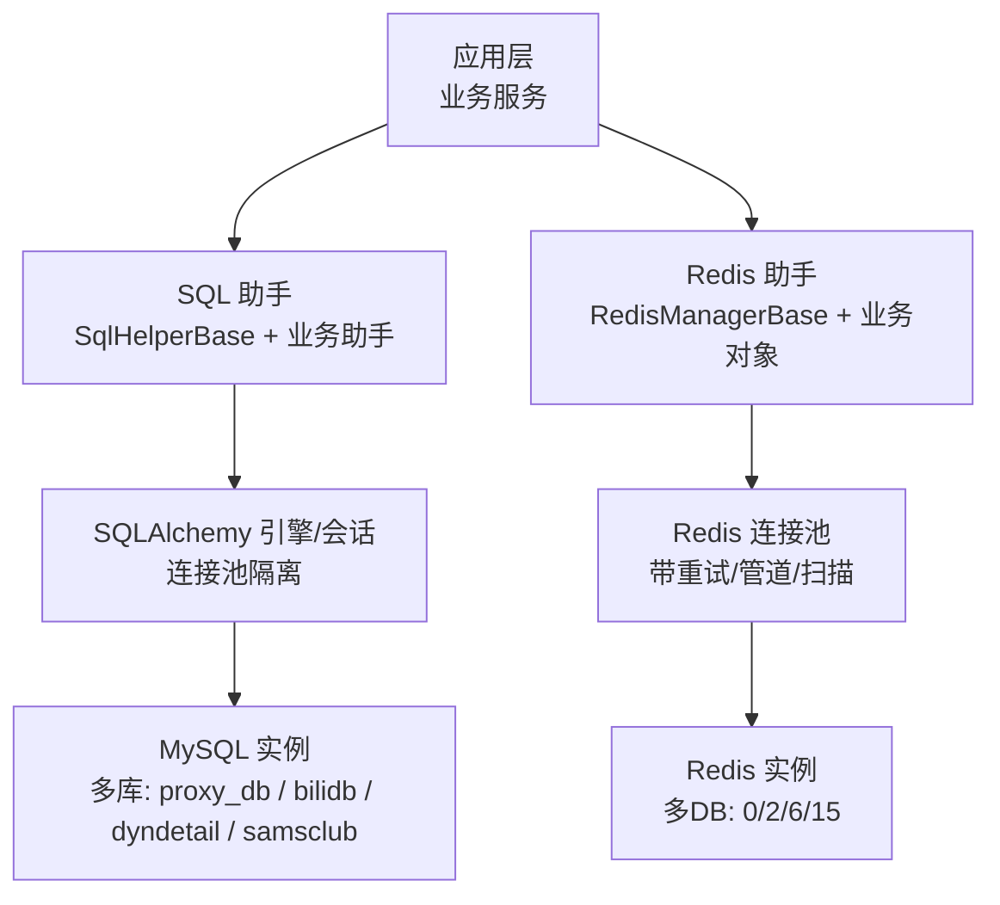
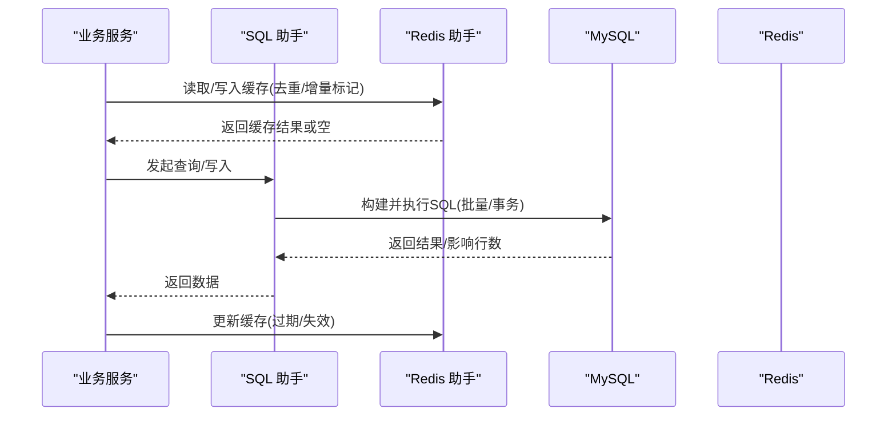
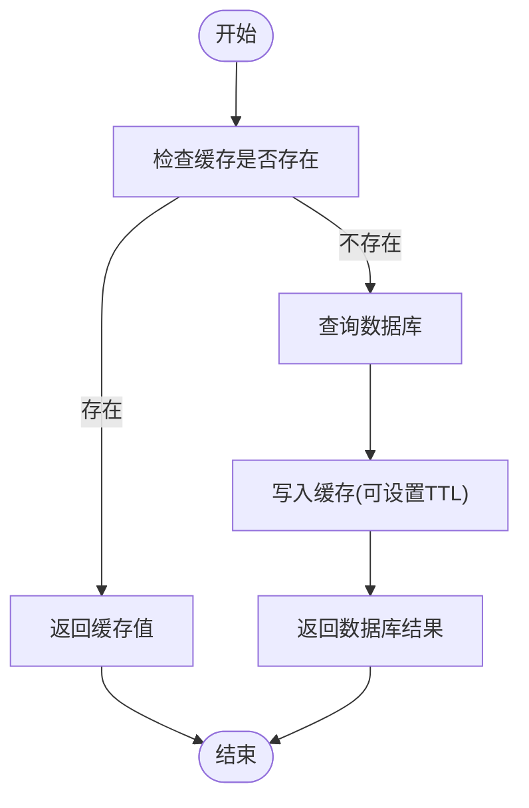
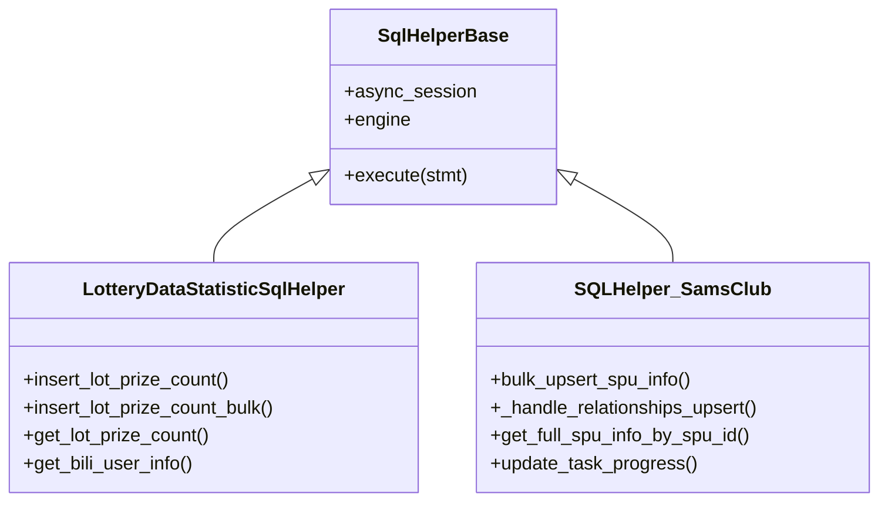
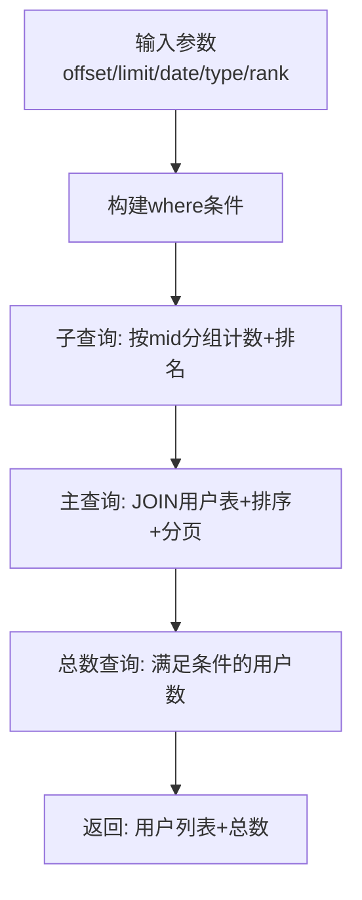
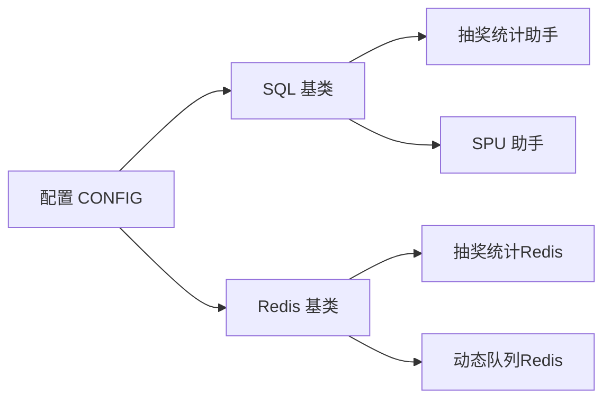

# 数据库管理

<cite>
**本文引用的文件**
- [CONFIG.py](file://be-bilibili-crawler/CONFIG.py)
- [SqlalchemyTool.py](file://be-bilibili-crawler/Utils/数据库/SqlalchemyTool.py)
- [sqlHelperBase.py](file://be-bilibili-crawler/dao/base/sqlHelperBase.py)
- [biliLotteryStatisticSqlHelper.py](file://be-bilibili-crawler/dao/biliLotteryStatisticSqlHelper.py)
- [SqlHelper.py](file://be-bilibili-crawler/Service/samsclub/Sql/SqlHelper.py)
- [RedisManager.py](file://be-bilibili-crawler/Utils/redisTool/RedisManager.py)
- [lotDataRedisObj.py](file://be-bilibili-crawler/dao/lotDataRedisObj.py)
- [biliLotteryStatisticRedisObj.py](file://be-bilibili-crawler/dao/biliLotteryStatisticRedisObj.py)
</cite>

## 目录
1. [简介](#简介)
2. [项目结构](#项目结构)
3. [核心组件](#核心组件)
4. [架构总览](#架构总览)
5. [详细组件分析](#详细组件分析)
6. [依赖关系分析](#依赖关系分析)
7. [性能考量](#性能考量)
8. [故障排查指南](#故障排查指南)
9. [结论](#结论)
10. [附录](#附录)

## 简介
本文件面向“数据库管理”主题，围绕以下目标展开：
- Redis 对象封装与缓存策略（含过期、去重、增量同步）
- SQL 助手类实现（查询构建、批量操作、事务管理）
- 彩票数据库查询模型设计（复杂查询封装与优化）
- 连接池配置、读写分离与分库分表策略建议
- 数据迁移与备份恢复指南
- 数据库性能监控与优化建议

## 项目结构
本项目在 be-bilibili-crawler 模块中实现了统一的数据库访问层与缓存层：
- 配置中心：集中管理 MySQL/Redis 连接参数与 SQLAlchemy 连接池参数
- SQL 层：基于 SQLAlchemy 异步会话与引擎，提供通用基类与业务 SQL 助手
- Redis 层：统一异步 Redis 客户端封装，支持批量、扫描、有序集合等常用能力
- 业务 DAO：针对抽奖统计、商品 SPU 等场景的专用 SQL/Redis 封装

**图表来源**
- [CONFIG.py:330-419](file://be-bilibili-crawler/CONFIG.py#L330-L419)
- [SqlalchemyTool.py:11-47](file://be-bilibili-crawler/Utils/数据库/SqlalchemyTool.py#L11-L47)
- [RedisManager.py:187-210](file://be-bilibili-crawler/Utils/redisTool/RedisManager.py#L187-L210)

**章节来源**
- [CONFIG.py:330-419](file://be-bilibili-crawler/CONFIG.py#L330-L419)
- [SqlalchemyTool.py:11-47](file://be-bilibili-crawler/Utils/数据库/SqlalchemyTool.py#L11-L47)
- [RedisManager.py:187-210](file://be-bilibili-crawler/Utils/redisTool/RedisManager.py#L187-L210)

## 核心组件
- 配置与连接池
  - 多数据库 URL 构造与连接池参数集中管理
  - 区分“业务连接池”和“爬虫连接池”，避免互相抢占资源
- SQL 助手
  - 基类封装异步会话与执行方法，统一提交与日志
  - 业务助手提供复杂查询、批量 upsert、关联关系处理
- Redis 助手
  - 统一异步客户端，内置重试、管道、SCAN、有序集合等能力
  - 业务对象定义 key 命名规范与常用操作

**章节来源**
- [CONFIG.py:330-419](file://be-bilibili-crawler/CONFIG.py#L330-L419)
- [sqlHelperBase.py:8-24](file://be-bilibili-crawler/dao/base/sqlHelperBase.py#L8-L24)
- [RedisManager.py:187-682](file://be-bilibili-crawler/Utils/redisTool/RedisManager.py#L187-L682)

## 架构总览
下图展示从业务调用到存储层的整体流程，包括 SQL 与 Redis 两条路径。

**图表来源**
- [biliLotteryStatisticSqlHelper.py:23-162](file://be-bilibili-crawler/dao/biliLotteryStatisticSqlHelper.py#L23-L162)
- [SqlHelper.py:121-158](file://be-bilibili-crawler/Service/samsclub/Sql/SqlHelper.py#L121-L158)
- [RedisManager.py:211-258](file://be-bilibili-crawler/Utils/redisTool/RedisManager.py#L211-L258)

## 详细组件分析

### Redis 对象封装与缓存策略
- 统一封装
  - 通过 RedisManagerBase 提供异步 get/set/setex、ZSet、Hash、Scan、Pipeline 等能力
  - 所有 IO 均带重试机制，对连接异常进行指数退避式重试
- 键空间与命名
  - 业务对象内以枚举维护 key 模板，如抽奖统计同步时间戳、用户信息映射、动态抽奖队列等
  - 使用格式化方法生成最终 key，便于管理与清理
- 过期与清理
  - setex 支持 TTL；ZSet 按分数区间清理过期元素
  - 提供 SCAN 前缀遍历与批量 UNLINK 删除，避免阻塞
- 典型用法
  - 去重：ZSet 记录动态 ID，检查是否已加入
  - 增量同步：记录上次同步时间戳，拉取增量数据后更新
  - 用户画像缓存：Hash 存储 uid -> name/face

**图表来源**
- [RedisManager.py:292-339](file://be-bilibili-crawler/Utils/redisTool/RedisManager.py#L292-L339)
- [lotDataRedisObj.py:19-30](file://be-bilibili-crawler/dao/lotDataRedisObj.py#L19-L30)
- [biliLotteryStatisticRedisObj.py:38-44](file://be-bilibili-crawler/dao/biliLotteryStatisticRedisObj.py#L38-L44)

**章节来源**
- [RedisManager.py:187-682](file://be-bilibili-crawler/Utils/redisTool/RedisManager.py#L187-L682)
- [lotDataRedisObj.py:1-44](file://be-bilibili-crawler/dao/lotDataRedisObj.py#L1-L44)
- [biliLotteryStatisticRedisObj.py:1-49](file://be-bilibili-crawler/dao/biliLotteryStatisticRedisObj.py#L1-L49)

### SQL 助手类实现（查询构建、批量操作、事务管理）
- 基类能力
  - 统一创建异步会话与引擎，封装 execute 方法自动提交
  - 通过工厂函数复用 Engine/Session，避免重复创建连接池导致连接耗尽
- 业务助手
  - 抽奖统计助手：upsert 用户与中奖信息、分页统计排名、用户信息查询
  - 商品 SPU 助手：主从表批量 upsert、价格变更检测、任务进度管理、复杂 JOIN 查询
- 事务管理
  - 多数写操作在 async_session 上下文内执行，必要时显式 commit
  - 批量 upsert 采用分批提交，降低单事务体积
- 错误与重试
  - 死锁重试：抽奖统计插入遇到死锁时随机退避并重试
  - 装饰器重试：SQL 辅助方法统一加重试包装，提升健壮性

**图表来源**
- [sqlHelperBase.py:8-24](file://be-bilibili-crawler/dao/base/sqlHelperBase.py#L8-L24)
- [biliLotteryStatisticSqlHelper.py:18-176](file://be-bilibili-crawler/dao/biliLotteryStatisticSqlHelper.py#L18-L176)
- [SqlHelper.py:25-438](file://be-bilibili-crawler/Service/samsclub/Sql/SqlHelper.py#L25-L438)

**章节来源**
- [sqlHelperBase.py:8-24](file://be-bilibili-crawler/dao/base/sqlHelperBase.py#L8-L24)
- [SqlalchemyTool.py:11-47](file://be-bilibili-crawler/Utils/数据库/SqlalchemyTool.py#L11-L47)
- [biliLotteryStatisticSqlHelper.py:23-162](file://be-bilibili-crawler/dao/biliLotteryStatisticSqlHelper.py#L23-L162)
- [SqlHelper.py:121-158](file://be-bilibili-crawler/Service/samsclub/Sql/SqlHelper.py#L121-L158)

### 彩票数据库查询模型设计与优化
- 复杂查询封装
  - 使用子查询聚合奖品数量，结合窗口函数计算排名
  - 主查询 JOIN 用户信息表，返回完整用户资料与统计字段
- 过滤条件
  - 支持按日期范围、抽奖类型、奖项等级筛选
- 分页与总数
  - offset/limit 分页；单独 count 查询总用户数
- 性能优化
  - 分组聚合与窗口函数由数据库完成，减少内存压力
  - 合理索引建议：mid、atari_lot_type、atari_timestamp、atari_lot_rank

**图表来源**
- [biliLotteryStatisticSqlHelper.py:82-162](file://be-bilibili-crawler/dao/biliLotteryStatisticSqlHelper.py#L82-L162)

**章节来源**
- [biliLotteryStatisticSqlHelper.py:82-162](file://be-bilibili-crawler/dao/biliLotteryStatisticSqlHelper.py#L82-L162)

### 连接池配置、读写分离与分库分表策略
- 连接池配置
  - 业务连接池与爬虫连接池独立，避免相互抢占
  - 关键参数：pool_size、max_overflow、pool_pre_ping、pool_recycle
- 多库路由
  - 不同业务域使用不同数据库（proxy_db、bilidb、dyndetail、samsclub），通过 URI 注入
- 读写分离建议
  - 当前为单写单读模式；可在上层引入读写分离代理或中间件，将只读查询路由至从库
- 分库分表建议
  - 按业务域分库；大表按时间或维度分表（如动态表按日期分区）
  - 配合唯一键与 on duplicate key update 实现幂等写入

**章节来源**
- [CONFIG.py:330-419](file://be-bilibili-crawler/CONFIG.py#L330-L419)

### 数据迁移与备份恢复指南
- 迁移工具
  - 项目包含 Alembic 迁移脚本目录，用于版本化数据库结构变更
  - 建议在测试环境先行验证迁移脚本，再在生产执行
- 迁移步骤建议
  - 备份当前数据库
  - 在低峰期执行迁移
  - 校验关键表结构与数据一致性
- 备份与恢复
  - 使用 mysqldump 或云厂商备份方案定期全量备份
  - 增量备份结合 binlog 实现时间点恢复
  - 恢复前务必在隔离环境演练

[本节为通用实践说明，不直接引用具体代码文件]

## 依赖关系分析
- 组件耦合
  - 业务 SQL 助手依赖基类与配置；Redis 对象依赖统一 Redis 管理器
  - 配置集中管理，降低硬编码耦合
- 外部依赖
  - SQLAlchemy 异步引擎与会话
  - redis-py 异步客户端
- 潜在循环依赖
  - 当前未发现明显循环导入；各模块职责清晰

**图表来源**
- [CONFIG.py:330-419](file://be-bilibili-crawler/CONFIG.py#L330-L419)
- [sqlHelperBase.py:8-24](file://be-bilibili-crawler/dao/base/sqlHelperBase.py#L8-L24)
- [RedisManager.py:187-210](file://be-bilibili-crawler/Utils/redisTool/RedisManager.py#L187-L210)
- [biliLotteryStatisticSqlHelper.py:18-22](file://be-bilibili-crawler/dao/biliLotteryStatisticSqlHelper.py#L18-L22)
- [SqlHelper.py:25-30](file://be-bilibili-crawler/Service/samsclub/Sql/SqlHelper.py#L25-L30)
- [biliLotteryStatisticRedisObj.py:13-17](file://be-bilibili-crawler/dao/biliLotteryStatisticRedisObj.py#L13-L17)
- [lotDataRedisObj.py:8-17](file://be-bilibili-crawler/dao/lotDataRedisObj.py#L8-L17)

**章节来源**
- [CONFIG.py:330-419](file://be-bilibili-crawler/CONFIG.py#L330-L419)
- [sqlHelperBase.py:8-24](file://be-bilibili-crawler/dao/base/sqlHelperBase.py#L8-L24)
- [RedisManager.py:187-210](file://be-bilibili-crawler/Utils/redisTool/RedisManager.py#L187-L210)

## 性能考量
- 连接池
  - 合理设置 pool_size 与 max_overflow，避免连接耗尽
  - 启用 pool_pre_ping 防止陈旧连接导致 2013 错误
  - pool_recycle 小于 MySQL wait_timeout，主动回收空闲连接
- 查询优化
  - 使用子查询与窗口函数减少应用层计算
  - 分页查询限制 limit，避免一次性加载大量数据
- 批量写入
  - 分批 upsert，控制单批大小，降低锁竞争与事务体积
- Redis 优化
  - 使用 Pipeline 批量命令，减少网络往返
  - 使用 SCAN 替代 KEYS，避免阻塞
  - ZSet 按分数区间清理过期数据，控制内存增长

[本节为通用指导，不直接引用具体代码文件]

## 故障排查指南
- 常见错误
  - MySQL 连接过多：检查连接池配置与复用，避免重复创建 Engine
  - 死锁：抽奖统计插入捕获死锁并退避重试
  - Redis 连接异常：统一重试机制，关注日志定位
- 日志与监控
  - 开启 sqlalchemy_logging 观察慢查询
  - 关注 Redis 与 MySQL 的错误日志
- 回滚与恢复
  - 迁移失败时回滚到上一版本
  - 数据损坏时从备份恢复

**章节来源**
- [SqlalchemyTool.py:11-47](file://be-bilibili-crawler/Utils/数据库/SqlalchemyTool.py#L11-L47)
- [biliLotteryStatisticSqlHelper.py:48-80](file://be-bilibili-crawler/dao/biliLotteryStatisticSqlHelper.py#L48-L80)
- [RedisManager.py:62-78](file://be-bilibili-crawler/Utils/redisTool/RedisManager.py#L62-L78)

## 结论
本项目通过统一的配置、SQL 助手与 Redis 助手，构建了稳定高效的数据库访问层。借助连接池隔离、批量 upsert、复杂查询封装与缓存策略，满足了高并发与大数据量场景的需求。后续可按需引入读写分离与分库分表，进一步提升扩展性与可用性。

## 附录
- 关键配置项速查
  - 数据库 URI：多库分别定义，便于隔离
  - 连接池参数：pool_size、max_overflow、pool_pre_ping、pool_recycle
  - Redis 参数：host/port/db/pwd，连接池最大连接数
- 最佳实践清单
  - 使用批量 upsert 与分页查询
  - 缓存命中优先，未命中再落库
  - 严格管理 Redis key 生命周期，及时清理
  - 迁移前备份，迁移后校验

[本节为总结性内容，不直接引用具体代码文件]