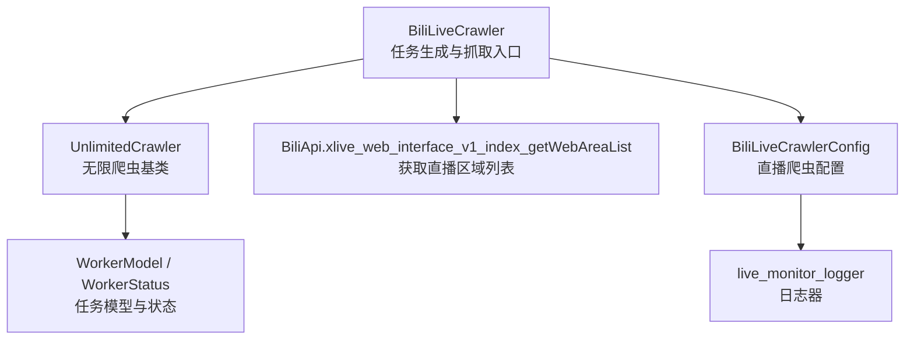
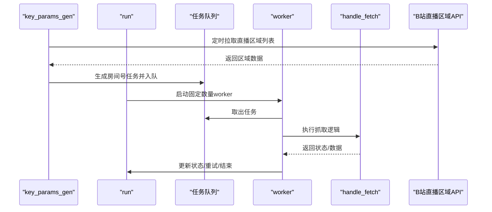
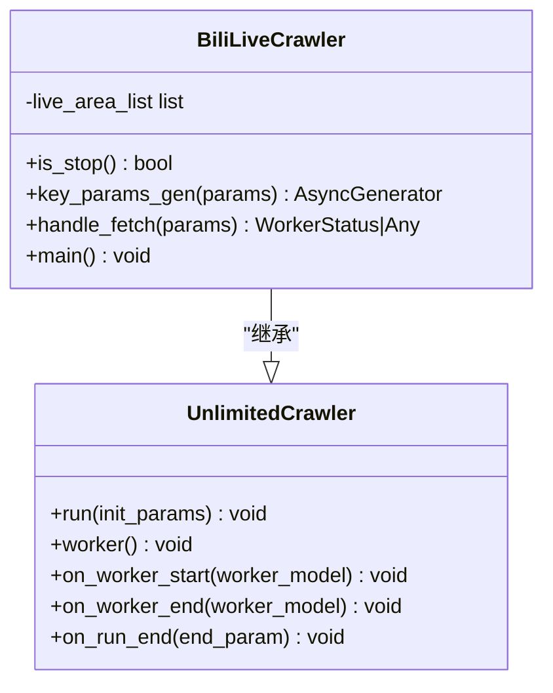
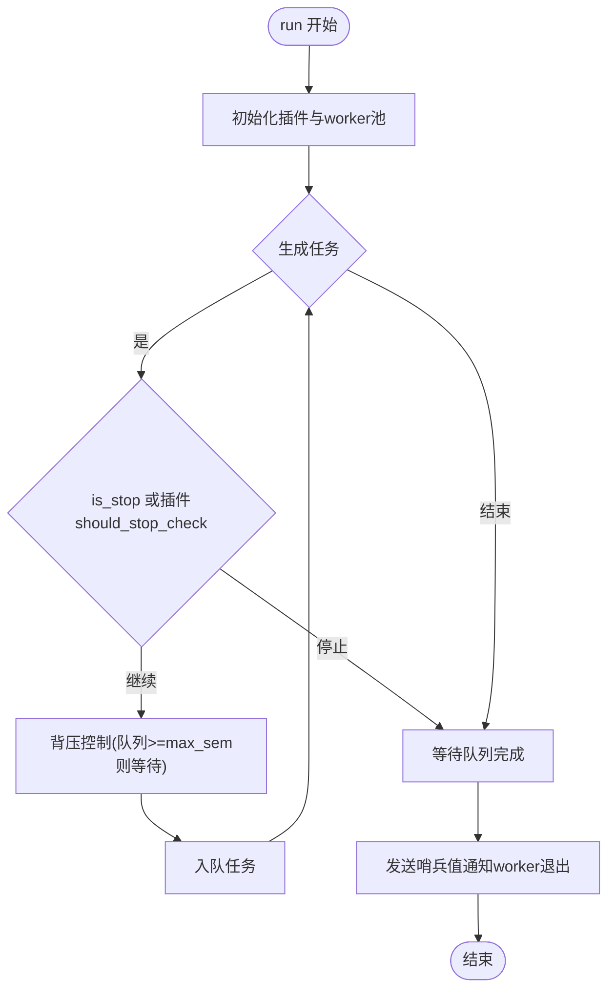
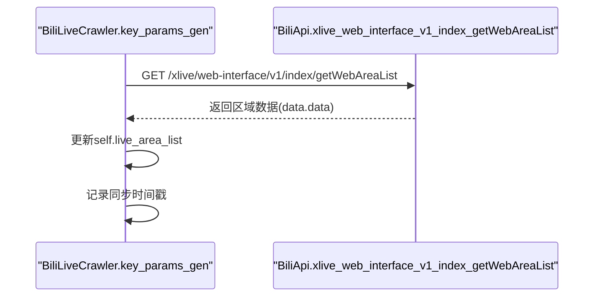
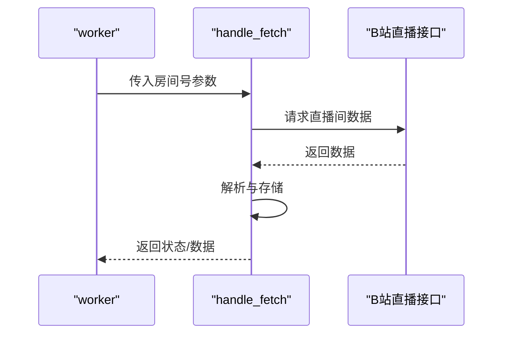
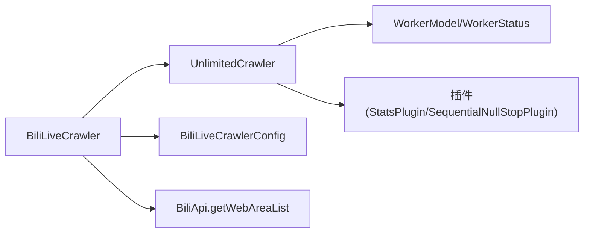
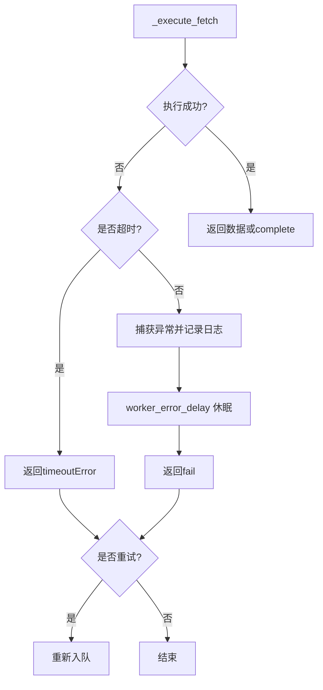

# B站直播采集器

<cite>
**本文引用的文件**
- [bili_live_crawler.py](file://be-bilibili-crawler/Service/BiliLiveScrape/live_lottery/bili_live_crawler.py)
- [CrawlerType.py](file://be-bilibili-crawler/Service/BaseCrawler/CrawlerType.py)
- [config.py](file://be-bilibili-crawler/Service/BaseCrawler/config.py)
- [BiliApi.py](file://be-bilibili-crawler/Service/GrpcModule/Grpc/Bapi/BiliApi.py)
- [Constants.py](file://be-bilibili-crawler/Service/GrpcModule/Grpc/Bapi/Constants.py)
- [base.py](file://be-bilibili-crawler/Service/BaseCrawler/model/base.py)
- [base_log.py](file://be-bilibili-crawler/log/base_log.py)
</cite>

## 目录
1. [简介](#简介)
2. [项目结构](#项目结构)
3. [核心组件](#核心组件)
4. [架构总览](#架构总览)
5. [详细组件分析](#详细组件分析)
6. [依赖关系分析](#依赖关系分析)
7. [性能与并发](#性能与并发)
8. [配置与参数](#配置与参数)
9. [错误处理与重试](#错误处理与重试)
10. [使用示例](#使用示例)
11. [监控方案](#监控方案)
12. [故障排查](#故障排查)
13. [结论](#结论)

## 简介
本仓库包含一个面向B站直播的无限爬虫采集器，核心目标是：
- 周期性同步直播区域列表，并基于此生成房间号任务流
- 提供可扩展的抓取框架（无限爬虫），支持并发控制、失败重试、超时保护、插件扩展
- 为后续直播数据采集（如弹幕、在线人数、直播状态等）预留统一接入点

当前实现聚焦于“任务生成”和“抓取调度”，直播数据的具体抓取逻辑在 handle_fetch 中待完善。

## 项目结构
围绕直播采集的关键代码位于 be-bilibili-crawler 模块下：
- Service/BiliLiveScrape/live_lottery/bili_live_crawler.py：B站直播爬虫实现类
- Service/BaseCrawler/CrawlerType.py：无限爬虫基类与调度主循环
- Service/BaseCrawler/config.py：各爬虫集中配置（含直播爬虫配置）
- Service/GrpcModule/Grpc/Bapi/BiliApi.py：B站API封装（直播区域列表接口）
- Service/GrpcModule/Grpc/Bapi/Constants.py：API URL常量
- Service/BaseCrawler/model/base.py：任务模型与状态枚举
- log/base_log.py：日志器定义（直播监控专用日志）

图表来源
- [bili_live_crawler.py:10-36](file://be-bilibili-crawler/Service/BiliLiveScrape/live_lottery/bili_live_crawler.py#L10-L36)
- [CrawlerType.py:16-551](file://be-bilibili-crawler/Service/BaseCrawler/CrawlerType.py#L16-L551)
- [BiliApi.py:466-486](file://be-bilibili-crawler/Service/GrpcModule/Grpc/Bapi/BiliApi.py#L466-L486)
- [config.py:195-199](file://be-bilibili-crawler/Service/BaseCrawler/config.py#L195-L199)
- [base.py:10-27](file://be-bilibili-crawler/Service/BaseCrawler/model/base.py#L10-L27)
- [base_log.py:15,76:15-15](file://be-bilibili-crawler/log/base_log.py#L15-L15)

章节来源
- [bili_live_crawler.py:10-36](file://be-bilibili-crawler/Service/BiliLiveScrape/live_lottery/bili_live_crawler.py#L10-L36)
- [CrawlerType.py:16-551](file://be-bilibili-crawler/Service/BaseCrawler/CrawlerType.py#L16-L551)
- [config.py:195-199](file://be-bilibili-crawler/Service/BaseCrawler/config.py#L195-L199)
- [BiliApi.py:466-486](file://be-bilibili-crawler/Service/GrpcModule/Grpc/Bapi/BiliApi.py#L466-L486)
- [Constants.py:46](file://be-bilibili-crawler/Service/GrpcModule/Grpc/Bapi/Constants.py#L46-L46)
- [base.py:10-27](file://be-bilibili-crawler/Service/BaseCrawler/model/base.py#L10-L27)
- [base_log.py:15,76:15-15](file://be-bilibili-crawler/log/base_log.py#L15-L15)

## 核心组件
- BiliLiveCrawler：继承自无限爬虫基类，负责：
  - 周期性同步直播区域列表
  - 生成房间号任务参数（key_params_gen）
  - 执行抓取流程（handle_fetch，待实现）
- UnlimitedCrawler：无限爬虫基类，提供：
  - 固定worker池与队列调度
  - 任务生成、执行、重试、超时、停止策略
  - 插件机制（统计、限流、停止条件等）
- BiliLiveCrawlerConfig：直播爬虫的配置项，包括日志、并发、重试、超时等
- BiliApi.xlive_web_interface_v1_index_getWebAreaList：调用B站直播区域列表接口
- WorkerModel/WorkerStatus：任务模型与状态枚举，贯穿调度全流程

章节来源
- [bili_live_crawler.py:10-36](file://be-bilibili-crawler/Service/BiliLiveScrape/live_lottery/bili_live_crawler.py#L10-L36)
- [CrawlerType.py:16-551](file://be-bilibili-crawler/Service/BaseCrawler/CrawlerType.py#L16-L551)
- [config.py:195-199](file://be-bilibili-crawler/Service/BaseCrawler/config.py#L195-L199)
- [BiliApi.py:466-486](file://be-bilibili-crawler/Service/GrpcModule/Grpc/Bapi/BiliApi.py#L466-L486)
- [base.py:10-27](file://be-bilibili-crawler/Service/BaseCrawler/model/base.py#L10-L27)

## 架构总览
整体采用“任务生成器 + 固定worker池”的无限爬虫架构：
- key_params_gen：持续产出任务参数（房间号或区域ID）
- run：创建固定数量worker，消费队列中的任务
- worker：从队列取任务，执行 handle_fetch，处理异常与重试
- 插件：统计、停止条件检查、结果上报等

图表来源
- [bili_live_crawler.py:15-27](file://be-bilibili-crawler/Service/BiliLiveScrape/live_lottery/bili_live_crawler.py#L15-L27)
- [CrawlerType.py:438-546](file://be-bilibili-crawler/Service/BaseCrawler/CrawlerType.py#L438-L546)
- [BiliApi.py:466-486](file://be-bilibili-crawler/Service/GrpcModule/Grpc/Bapi/BiliApi.py#L466-L486)

## 详细组件分析

### BiliLiveCrawler 类
职责：
- is_stop：当前始终返回False，表示不停止生成新任务
- key_params_gen：维护直播区域列表，按天同步一次；未来将基于时间策略输出房间号
- handle_fetch：抓取处理入口，当前为空实现，待补充具体业务逻辑
- __init__：初始化实例属性 live_area_list
- main：预留主入口方法

图表来源
- [bili_live_crawler.py:10-36](file://be-bilibili-crawler/Service/BiliLiveScrape/live_lottery/bili_live_crawler.py#L10-L36)
- [CrawlerType.py:16-551](file://be-bilibili-crawler/Service/BaseCrawler/CrawlerType.py#L16-L551)

章节来源
- [bili_live_crawler.py:10-36](file://be-bilibili-crawler/Service/BiliLiveScrape/live_lottery/bili_live_crawler.py#L10-L36)

### 无限爬虫基类 UnlimitedCrawler
职责：
- 配置加载：通过 _load_config 读取集中管理的配置实例
- 运行主循环：run 方法创建固定worker池，驱动任务生成与执行
- 工作协程：worker 从队列取任务，调用 handle_fetch，处理超时、异常、重试
- 回调钩子：on_worker_start/on_worker_end/on_run_end 触发插件生命周期
- 停止策略：is_stop 与插件 should_stop_check 共同决定停止

关键流程：
- run：初始化插件、启动worker、循环生成任务、背压控制、等待完成、发送哨兵退出
- worker：获取任务、信号量控制并发、执行fetch、判断是否重试、触发end回调
- _execute_fetch：超时保护、异常捕获、错误推送、延迟重试

图表来源
- [CrawlerType.py:438-546](file://be-bilibili-crawler/Service/BaseCrawler/CrawlerType.py#L438-L546)

章节来源
- [CrawlerType.py:16-551](file://be-bilibili-crawler/Service/BaseCrawler/CrawlerType.py#L16-L551)

### 直播区域列表同步策略
- 同步频率：每24小时同步一次直播区域列表
- 数据来源：调用 xlive_web_interface_v1_index_getWebAreaList
- 数据存储：缓存到 self.live_area_list，供后续房间号生成使用
- 接口URL：URL_GET_WEB_AREA_LIST

图表来源
- [bili_live_crawler.py:15-22](file://be-bilibili-crawler/Service/BiliLiveScrape/live_lottery/bili_live_crawler.py#L15-L22)
- [BiliApi.py:466-486](file://be-bilibili-crawler/Service/GrpcModule/Grpc/Bapi/BiliApi.py#L466-L486)
- [Constants.py:46](file://be-bilibili-crawler/Service/GrpcModule/Grpc/Bapi/Constants.py#L46-L46)

章节来源
- [bili_live_crawler.py:15-22](file://be-bilibili-crawler/Service/BiliLiveScrape/live_lottery/bili_live_crawler.py#L15-L22)
- [BiliApi.py:466-486](file://be-bilibili-crawler/Service/GrpcModule/Grpc/Bapi/BiliApi.py#L466-L486)
- [Constants.py:46](file://be-bilibili-crawler/Service/GrpcModule/Grpc/Bapi/Constants.py#L46-L46)

### 房间号生成逻辑（key_params_gen）
当前实现要点：
- 维护 sync_live_area_ts 用于控制同步频率
- 超过24小时则调用直播区域列表接口，更新 live_area_list
- 房间号生成逻辑以TODO形式存在，后续可基于时间与区域策略动态产出房间号

建议实现方向：
- 根据时间段选择热门区域
- 结合历史抓取结果与热度指标，优先产出高价值房间号
- 避免重复生成已抓取过的房间号（去重集合）

章节来源
- [bili_live_crawler.py:15-22](file://be-bilibili-crawler/Service/BiliLiveScrape/live_lottery/bili_live_crawler.py#L15-L22)

### 抓取处理流程（handle_fetch）
当前为空实现，后续应：
- 接收房间号参数
- 调用B站直播相关接口（如直播间信息、弹幕、在线人数等）
- 解析数据并持久化
- 返回 WorkerStatus.complete 或具体数据

图表来源
- [CrawlerType.py:388-409](file://be-bilibili-crawler/Service/BaseCrawler/CrawlerType.py#L388-L409)
- [bili_live_crawler.py:26-27](file://be-bilibili-crawler/Service/BiliLiveScrape/live_lottery/bili_live_crawler.py#L26-L27)

章节来源
- [CrawlerType.py:388-409](file://be-bilibili-crawler/Service/BaseCrawler/CrawlerType.py#L388-L409)
- [bili_live_crawler.py:26-27](file://be-bilibili-crawler/Service/BiliLiveScrape/live_lottery/bili_live_crawler.py#L26-L27)

## 依赖关系分析
- BiliLiveCrawler 依赖：
  - UnlimitedCrawler：调度与执行框架
  - BiliLiveCrawlerConfig：配置项
  - BiliApi.xlive_web_interface_v1_index_getWebAreaList：直播区域列表接口
- UnlimitedCrawler 依赖：
  - WorkerModel/WorkerStatus：任务模型与状态
  - 插件机制：StatsPlugin、SequentialNullStopPlugin 等
- 配置注册表：集中管理各爬虫配置实例

图表来源
- [bili_live_crawler.py:10-36](file://be-bilibili-crawler/Service/BiliLiveScrape/live_lottery/bili_live_crawler.py#L10-L36)
- [CrawlerType.py:16-551](file://be-bilibili-crawler/Service/BaseCrawler/CrawlerType.py#L16-L551)
- [config.py:195-199](file://be-bilibili-crawler/Service/BaseCrawler/config.py#L195-L199)
- [BiliApi.py:466-486](file://be-bilibili-crawler/Service/GrpcModule/Grpc/Bapi/BiliApi.py#L466-L486)
- [base.py:10-27](file://be-bilibili-crawler/Service/BaseCrawler/model/base.py#L10-L27)

章节来源
- [bili_live_crawler.py:10-36](file://be-bilibili-crawler/Service/BiliLiveScrape/live_lottery/bili_live_crawler.py#L10-L36)
- [CrawlerType.py:16-551](file://be-bilibili-crawler/Service/BaseCrawler/CrawlerType.py#L16-L551)
- [config.py:195-199](file://be-bilibili-crawler/Service/BaseCrawler/config.py#L195-L199)
- [BiliApi.py:466-486](file://be-bilibili-crawler/Service/GrpcModule/Grpc/Bapi/BiliApi.py#L466-L486)
- [base.py:10-27](file://be-bilibili-crawler/Service/BaseCrawler/model/base.py#L10-L27)

## 性能与并发
- 固定worker池：避免协程爆炸，提升稳定性
- 信号量控制：max_sem 限制同时处理的并发数
- 背压控制：当队列大小达到 max_sem 时暂停生成，防止内存溢出
- 超时保护：worker_max_timeout 防止单个任务长时间占用资源
- 重试机制：requeue_on_fetch_fail/requeue_on_timeout 控制失败与超时的重试策略
- 错误延迟：worker_error_delay 在异常后短暂休眠，降低瞬时压力

优化建议：
- 合理设置 max_sem，结合网络与目标服务承受能力
- 对高频接口增加本地缓存与去重
- 针对热点房间号进行优先级调度
- 使用插件实现更细粒度的限流与监控

章节来源
- [CrawlerType.py:344-546](file://be-bilibili-crawler/Service/BaseCrawler/CrawlerType.py#L344-L546)
- [config.py:48-84](file://be-bilibili-crawler/Service/BaseCrawler/config.py#L48-L84)

## 配置与参数
直播爬虫配置（BiliLiveCrawlerConfig）：
- logger：live_monitor_logger，用于直播监控日志
- plugins：空列表，可按需添加统计或停止插件
- 其他通用配置（继承自 CrawlerConfig）：
  - max_sem：最大并发数
  - requeue_on_fetch_fail：抓取失败是否重试
  - requeue_on_timeout：超时是否重试
  - max_retries：最大重试次数（-1 表示无限）
  - worker_max_timeout：单个任务最大超时时间
  - log_timeout_error/log_error：是否打印超时/异常日志
  - worker_error_delay：失败后的延迟时间

章节来源
- [config.py:195-199](file://be-bilibili-crawler/Service/BaseCrawler/config.py#L195-L199)
- [config.py:48-84](file://be-bilibili-crawler/Service/BaseCrawler/config.py#L48-L84)
- [base_log.py:15,76:15-15](file://be-bilibili-crawler/log/base_log.py#L15-L15)

## 错误处理与重试
- 超时处理：_execute_fetch 捕获 asyncio.TimeoutError，返回 timeoutError 状态
- 异常处理：捕获异常并记录日志，必要时推送错误通知，随后返回 fail 状态
- 重试策略：
  - 根据 fetchStatus 与配置决定是否重新入队
  - 支持最大重试次数限制，超过阈值不再重试
  - 重新入队前触发 on_task_requeue 回调，可修改任务参数或记录重试信息

图表来源
- [CrawlerType.py:388-436](file://be-bilibili-crawler/Service/BaseCrawler/CrawlerType.py#L388-L436)

章节来源
- [CrawlerType.py:388-436](file://be-bilibili-crawler/Service/BaseCrawler/CrawlerType.py#L388-L436)

## 使用示例
基础用法：
- 实例化 BiliLiveCrawler
- 调用 main 或 run 启动采集
- 在 key_params_gen 中实现房间号生成逻辑
- 在 handle_fetch 中实现具体抓取与存储逻辑

示例步骤：
1. 配置 BiliLiveCrawlerConfig（并发、重试、超时等）
2. 实现 key_params_gen：基于直播区域列表与时间策略生成房间号
3. 实现 handle_fetch：调用B站直播接口，解析并存储数据
4. 启动运行：await crawler.run(init_params=None)

注意：
- 当前 handle_fetch 为空实现，需补充业务逻辑
- 可根据需求启用插件（如 StatsPlugin）进行统计与上报

章节来源
- [bili_live_crawler.py:10-36](file://be-bilibili-crawler/Service/BiliLiveScrape/live_lottery/bili_live_crawler.py#L10-L36)
- [CrawlerType.py:438-546](file://be-bilibili-crawler/Service/BaseCrawler/CrawlerType.py#L438-L546)

## 监控方案
- 日志：使用 live_monitor_logger 记录直播监控相关日志
- 插件：可启用 StatsPlugin 进行任务统计与结果上报
- 错误推送：异常时通过 a_push_error 推送错误通知
- 指标收集：可在 on_worker_start/on_worker_end 中记录耗时、成功率等指标

建议：
- 集成外部监控系统（如Prometheus/Grafana）采集关键指标
- 对关键接口调用增加埋点与告警
- 定期输出运行报告，便于问题定位与优化

章节来源
- [config.py:195-199](file://be-bilibili-crawler/Service/BaseCrawler/config.py#L195-L199)
- [CrawlerType.py:275-342](file://be-bilibili-crawler/Service/BaseCrawler/CrawlerType.py#L275-L342)
- [base_log.py:15,76:15-15](file://be-bilibili-crawler/log/base_log.py#L15-L15)

## 故障排查
常见问题：
- 直播区域列表同步失败：检查网络与代理配置，确认接口可用
- 任务生成过快导致内存增长：调整 max_sem 与背压策略
- 抓取超时频繁：优化 handle_fetch 逻辑，增加重试与退避
- 异常未记录：检查 log_error 与日志器配置

排查步骤：
1. 查看 live_monitor_logger 日志，定位异常堆栈
2. 检查任务队列大小与worker状态
3. 验证B站接口响应与数据结构
4. 逐步缩小范围，定位具体失败环节

章节来源
- [CrawlerType.py:388-436](file://be-bilibili-crawler/Service/BaseCrawler/CrawlerType.py#L388-L436)
- [config.py:195-199](file://be-bilibili-crawler/Service/BaseCrawler/config.py#L195-L199)

## 结论
本直播采集器基于无限爬虫框架，提供了稳定的任务调度、并发控制与错误处理机制。当前已实现直播区域列表的周期性同步与房间号生成入口，后续需在 handle_fetch 中完善具体抓取逻辑。通过合理的配置与插件扩展，可实现高效、稳定、可观测的直播数据采集系统。