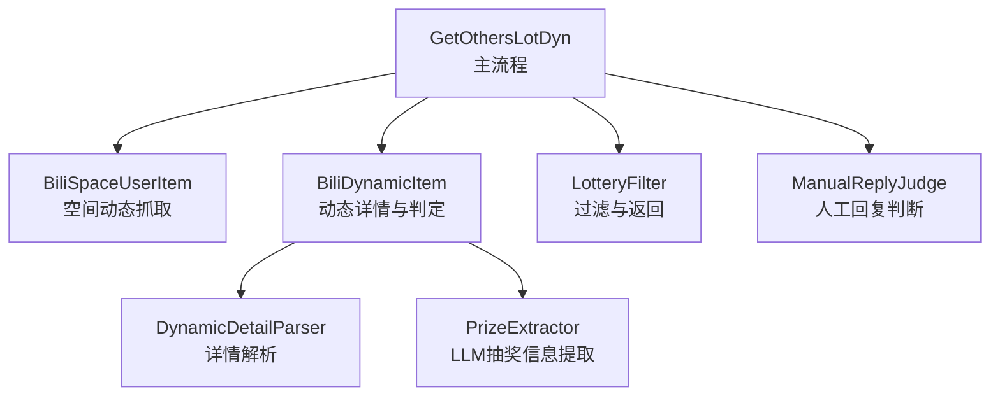
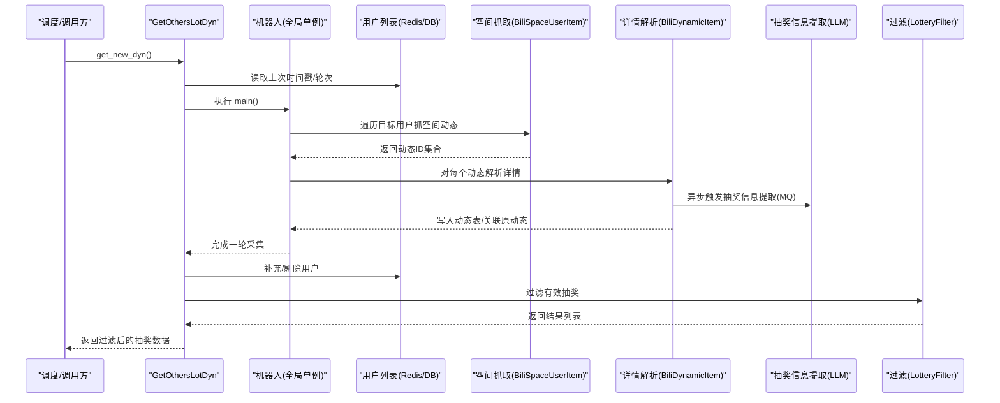
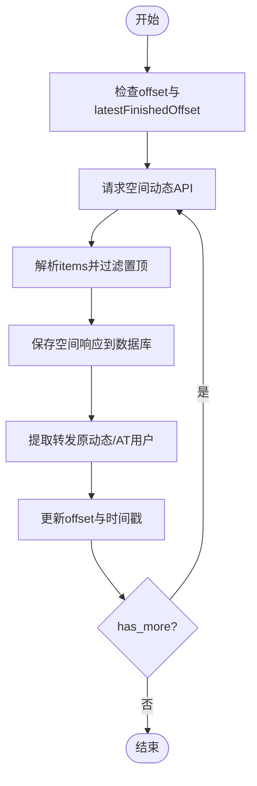
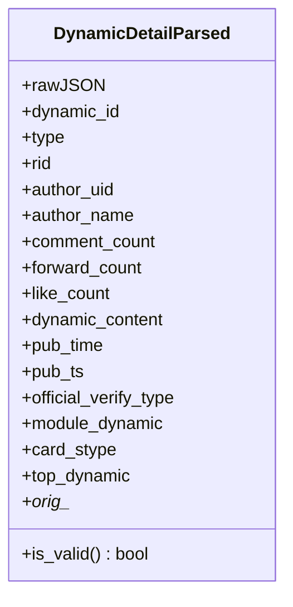
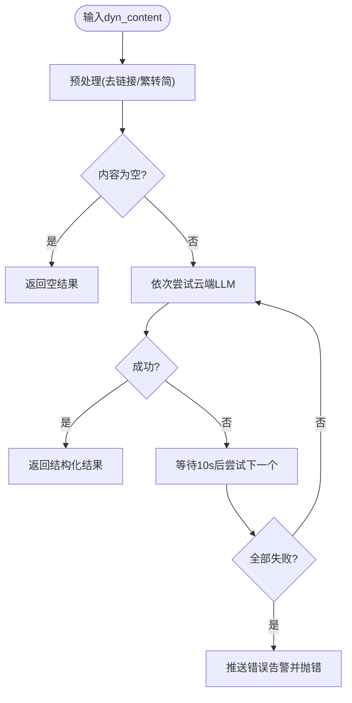
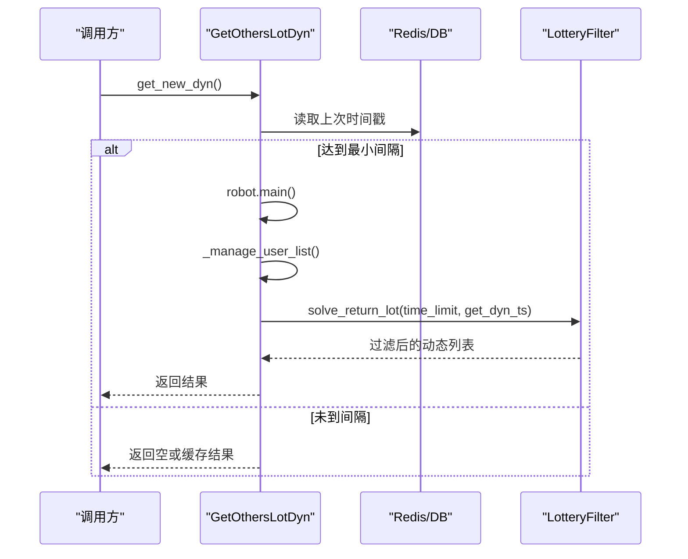
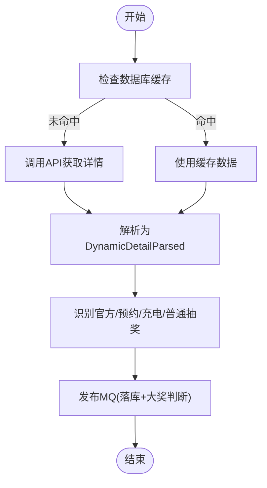
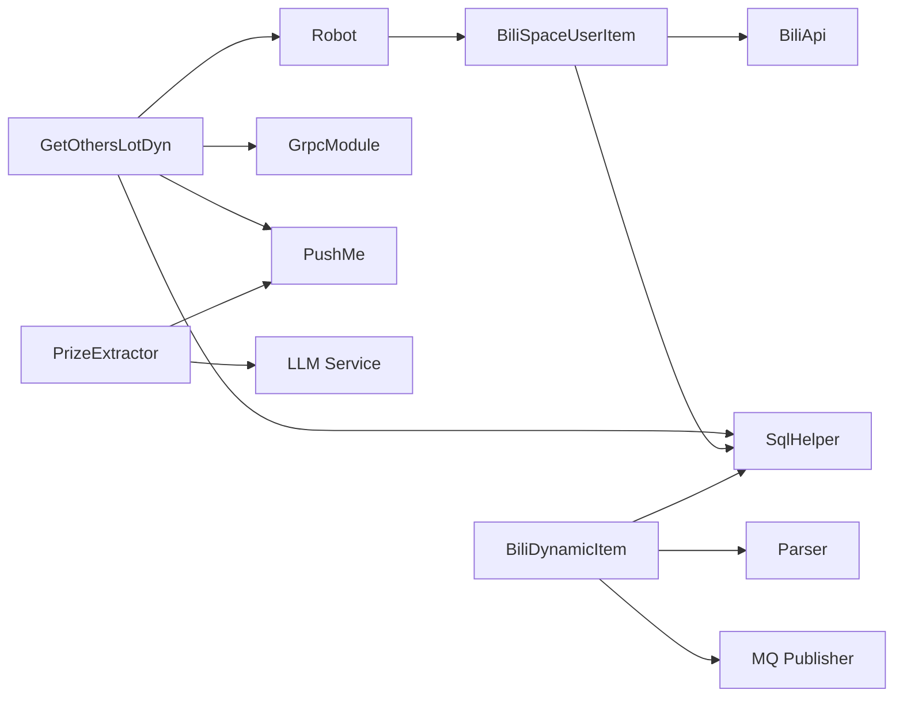

# 其他用户动态采集器

<cite>
**本文引用的文件**
- [get_others_lot_dyn.py](file://be-bilibili-crawler/Service/GetOthersLotDyn/core/get_others_lot_dyn.py)
- [space_dynamic_fetcher.py](file://be-bilibili-crawler/Service/GetOthersLotDyn/fetcher/space_dynamic_fetcher.py)
- [bili_dynamic_item.py](file://be-bilibili-crawler/Service/GetOthersLotDyn/core/bili_dynamic_item.py)
- [dynamic_detail_parser.py](file://be-bilibili-crawler/Service/GetOthersLotDyn/parser/dynamic_detail_parser.py)
- [prize_extractor.py](file://be-bilibili-crawler/Service/GetOthersLotDyn/parser/prize_extractor.py)
- [lottery_filter.py](file://be-bilibili-crawler/Service/GetOthersLotDyn/filter/lottery_filter.py)
- [manual_reply_judge.py](file://be-bilibili-crawler/Service/GetOthersLotDyn/filter/manual_reply_judge.py)
- [CONFIG.py](file://be-bilibili-crawler/CONFIG.py)
</cite>

## 目录
1. [简介](#简介)
2. [项目结构](#项目结构)
3. [核心组件](#核心组件)
4. [架构总览](#架构总览)
5. [详细组件分析](#详细组件分析)
6. [依赖关系分析](#依赖关系分析)
7. [性能考量与调优](#性能考量与调优)
8. [故障排查指南](#故障排查指南)
9. [结论](#结论)
10. [附录：调用示例与配置项](#附录调用示例与配置项)

## 简介
本模块负责“其他用户动态采集”，即从指定用户空间抓取动态，解析转发链、识别抽奖信息，并基于云端大模型进行结构化抽取（含大奖判断）。整体流程包括：
- 用户列表管理与补充/剔除策略
- 空间动态抓取（支持断点续爬、分页、反爬处理）
- 动态详情解析（统一为结构化模型）
- 抽奖判定与数据入库（普通/官方/预约/充电等类型）
- 结果过滤与推送总结

该文档面向二次开发者与维护者，提供从策略到实现、从配置到排障的完整说明。

## 项目结构
围绕 GetOthersLotDyn 服务，代码按职责分层组织：
- core：主流程编排与业务对象（GetOthersLotDyn、BiliDynamicItem）
- fetcher：空间动态抓取（BiliSpaceUserItem）
- parser：动态详情解析与抽奖信息提取（LLM 结构化输出）
- filter：过滤规则与人工回复判断
- Sql：数据库模型与辅助方法（引用外部模块）
- scripts：脚本入口（不在本文重点）

图表来源
- [get_others_lot_dyn.py:24-70](file://be-bilibili-crawler/Service/GetOthersLotDyn/core/get_others_lot_dyn.py#L24-L70)
- [space_dynamic_fetcher.py:58-108](file://be-bilibili-crawler/Service/GetOthersLotDyn/fetcher/space_dynamic_fetcher.py#L58-L108)
- [bili_dynamic_item.py:30-56](file://be-bilibili-crawler/Service/GetOthersLotDyn/core/bili_dynamic_item.py#L30-L56)
- [dynamic_detail_parser.py:165-269](file://be-bilibili-crawler/Service/GetOthersLotDyn/parser/dynamic_detail_parser.py#L165-L269)
- [prize_extractor.py:102-183](file://be-bilibili-crawler/Service/GetOthersLotDyn/parser/prize_extractor.py#L102-L183)
- [lottery_filter.py:24-73](file://be-bilibili-crawler/Service/GetOthersLotDyn/filter/lottery_filter.py#L24-L73)
- [manual_reply_judge.py:109-123](file://be-bilibili-crawler/Service/GetOthersLotDyn/filter/manual_reply_judge.py#L109-L123)

章节来源
- [get_others_lot_dyn.py:24-70](file://be-bilibili-crawler/Service/GetOthersLotDyn/core/get_others_lot_dyn.py#L24-L70)
- [CONFIG.py:141-200](file://be-bilibili-crawler/CONFIG.py#L141-L200)

## 核心组件
- GetOthersLotDyn：协调抓取、解析、过滤、用户管理、汇总推送
- BiliSpaceUserItem：用户空间动态抓取，支持断点续爬、时间窗口控制、异常重试
- BiliDynamicItem：动态详情获取与抽奖判定，封装网络重试、缓存读取、官方/预约/充电抽奖处理
- DynamicDetailParser：将原始响应解析为统一的 Pydantic 模型
- PrizeExtractor：基于云端 LLM 的结构化抽奖信息提取（含大奖判断）
- LotteryFilter：按时间与互动量等规则过滤有效抽奖
- ManualReplyJudge：通过 MiniRacer 执行 JS 正则，判断是否需要人工回复

章节来源
- [get_others_lot_dyn.py:24-70](file://be-bilibili-crawler/Service/GetOthersLotDyn/core/get_others_lot_dyn.py#L24-L70)
- [space_dynamic_fetcher.py:58-108](file://be-bilibili-crawler/Service/GetOthersLotDyn/fetcher/space_dynamic_fetcher.py#L58-L108)
- [bili_dynamic_item.py:30-56](file://be-bilibili-crawler/Service/GetOthersLotDyn/core/bili_dynamic_item.py#L30-L56)
- [dynamic_detail_parser.py:165-269](file://be-bilibili-crawler/Service/GetOthersLotDyn/parser/dynamic_detail_parser.py#L165-L269)
- [prize_extractor.py:102-183](file://be-bilibili-crawler/Service/GetOthersLotDyn/parser/prize_extractor.py#L102-L183)
- [lottery_filter.py:24-73](file://be-bilibili-crawler/Service/GetOthersLotDyn/filter/lottery_filter.py#L24-L73)
- [manual_reply_judge.py:109-123](file://be-bilibili-crawler/Service/GetOthersLotDyn/filter/manual_reply_judge.py#L109-L123)

## 架构总览
下图展示一次完整的“获取新动态”流程，包含用户列表管理、空间抓取、详情解析、抽奖判定与结果过滤。

图表来源
- [get_others_lot_dyn.py:44-70](file://be-bilibili-crawler/Service/GetOthersLotDyn/core/get_others_lot_dyn.py#L44-L70)
- [space_dynamic_fetcher.py:97-308](file://be-bilibili-crawler/Service/GetOthersLotDyn/fetcher/space_dynamic_fetcher.py#L97-L308)
- [bili_dynamic_item.py:262-482](file://be-bilibili-crawler/Service/GetOthersLotDyn/core/bili_dynamic_item.py#L262-L482)
- [dynamic_detail_parser.py:165-269](file://be-bilibili-crawler/Service/GetOthersLotDyn/parser/dynamic_detail_parser.py#L165-L269)
- [prize_extractor.py:190-237](file://be-bilibili-crawler/Service/GetOthersLotDyn/parser/prize_extractor.py#L190-L237)
- [lottery_filter.py:118-151](file://be-bilibili-crawler/Service/GetOthersLotDyn/filter/lottery_filter.py#L118-L151)

## 详细组件分析

### 空间动态抓取（space_dynamic_fetcher）
- 抓取策略
  - 支持断点续爬：记录 offset 与 latestFinishedOffset，第二轮获取时避免重复拉取
  - 时间窗口控制：超过 SpareTime（默认7天）停止抓取；最近2小时内最新动态可跳过本轮
  - 并发与代理：使用 RequestConf 启用可用代理与 Cookie，降低风控概率
  - 异常处理：针对 4101128/4101129 等错误码进行等待或终止；缺失 offset 字段时告警并中断
- 解析算法
  - 过滤置顶动态，仅保存非置顶卡片
  - 转发动态提取 orig 动态，构造 BiliDynamicItem 加入待解析集合
  - AT 用户提取：从 rich_text_nodes 中匹配 @ 节点，记录需要后续抓取的用户
- 性能优化
  - O(1) 查找 pub_lot_users 的 uid 集合，避免遍历
  - 缓存 data/items，减少多次 .get() 开销
  - 单次遍历合并过滤与入库

图表来源
- [space_dynamic_fetcher.py:97-308](file://be-bilibili-crawler/Service/GetOthersLotDyn/fetcher/space_dynamic_fetcher.py#L97-L308)
- [space_dynamic_fetcher.py:310-436](file://be-bilibili-crawler/Service/GetOthersLotDyn/fetcher/space_dynamic_fetcher.py#L310-L436)

章节来源
- [space_dynamic_fetcher.py:97-308](file://be-bilibili-crawler/Service/GetOthersLotDyn/fetcher/space_dynamic_fetcher.py#L97-L308)
- [space_dynamic_fetcher.py:310-436](file://be-bilibili-crawler/Service/GetOthersLotDyn/fetcher/space_dynamic_fetcher.py#L310-L436)

### 动态详情解析（dynamic_detail_parser）
- 输入：动态详情 API 响应 dict
- 输出：DynamicDetailParsed 模型（包含作者、内容、互动数、发布时间、是否置顶、原动态信息等）
- 关键点
  - 安全取值：_safe_get 避免深层嵌套 KeyError
  - 内容拼接：desc.text + major 下的 archive/article/opus 文本
  - 官方认证：兼容多种字段位置
  - 评论类型映射：comment_type -> 内部动态类型
  - ID 校验：图片类型需严格校验 dynamic_id 一致性，不一致则强制重新获取

图表来源
- [dynamic_detail_parsed.py:12-91](file://be-bilibili-crawler/Service/GetOthersLotDyn/parser/dynamic_detail_parsed.py#L12-L91)
- [dynamic_detail_parser.py:165-269](file://be-bilibili-crawler/Service/GetOthersLotDyn/parser/dynamic_detail_parser.py#L165-L269)

章节来源
- [dynamic_detail_parser.py:165-269](file://be-bilibili-crawler/Service/GetOthersLotDyn/parser/dynamic_detail_parser.py#L165-L269)
- [dynamic_detail_parsed.py:12-91](file://be-bilibili-crawler/Service/GetOthersLotDyn/parser/dynamic_detail_parsed.py#L12-L91)

### 抽奖信息提取机制（prize_extractor）
- 设计要点
  - 仅使用云端 LLM（get_all_free_llms），无本地回退；全部失败时抛错并推送告警
  - 结构化输出：with_structured_output 直接返回 Pydantic 模型
  - 双入口：
    - extract_prize_info_for_biliopusdb：普通/预约抽奖，返回完整字段（含 is_lot、need_repost、required_topic_text、is_grand_prize）
    - extract_prize_info_for_lotdata：官方/充电抽奖，仅返回 is_grand_prize
- 预处理
  - 去除链接、繁转简
  - 可选附加发布时间作为上下文
- 容错
  - 依次尝试所有已配置的免费 LLM，失败间隔重试
  - 全部失败时推送错误通知，由调用方跳过保存并等待手动回填

图表来源
- [prize_extractor.py:102-183](file://be-bilibili-crawler/Service/GetOthersLotDyn/parser/prize_extractor.py#L102-L183)
- [prize_extractor.py:190-237](file://be-bilibili-crawler/Service/GetOthersLotDyn/parser/prize_extractor.py#L190-L237)

章节来源
- [prize_extractor.py:102-183](file://be-bilibili-crawler/Service/GetOthersLotDyn/parser/prize_extractor.py#L102-L183)
- [prize_extractor.py:190-237](file://be-bilibili-crawler/Service/GetOthersLotDyn/parser/prize_extractor.py#L190-L237)

### get_others_lot_dyn 业务流程
- 主流程 get_new_dyn
  - 锁保护：防止并发重复采集
  - 时间间隔控制：根据配置的最小间隔决定是否执行
  - 复用全局机器人实例，执行 main()
  - 数据采集完成后管理用户列表（补充/剔除）并推送总结
- 用户列表管理
  - 补充阶段：从高互动动态评论区挖掘新用户，兜底使用默认用户列表
  - 剔除阶段：按 N 天内有效抽奖数阈值剔除低活跃用户
- 结果返回 solve_return_lot
  - 直接从数据库读取插入时间范围内的动态，应用过滤规则并排序返回

图表来源
- [get_others_lot_dyn.py:44-70](file://be-bilibili-crawler/Service/GetOthersLotDyn/core/get_others_lot_dyn.py#L44-L70)
- [get_others_lot_dyn.py:165-328](file://be-bilibili-crawler/Service/GetOthersLotDyn/core/get_others_lot_dyn.py#L165-L328)
- [lottery_filter.py:118-151](file://be-bilibili-crawler/Service/GetOthersLotDyn/filter/lottery_filter.py#L118-L151)

章节来源
- [get_others_lot_dyn.py:44-70](file://be-bilibili-crawler/Service/GetOthersLotDyn/core/get_others_lot_dyn.py#L44-L70)
- [get_others_lot_dyn.py:165-328](file://be-bilibili-crawler/Service/GetOthersLotDyn/core/get_others_lot_dyn.py#L165-L328)
- [lottery_filter.py:118-151](file://be-bilibili-crawler/Service/GetOthersLotDyn/filter/lottery_filter.py#L118-L151)

### 动态详情与抽奖判定（bili_dynamic_item）
- 详情获取
  - 优先从数据库缓存（动态表/空间表）读取，缺失或不完整则强制 API 获取
  - 网络异常与风控（如 412）自动重试
- 抽奖判定
  - 官方/预约/充电抽奖：通过 module_dynamic.additional/major 识别
  - 普通抽奖：is_lot 由 MQ 消费者异步处理后更新（此处不立即计算）
  - 原动态与附加视频（UGC）递归判定
- 数据入库
  - 写入 TLotdyninfo，并标记 need_comment（人工回复判断）
  - 官方/预约/充电抽奖数据通过 MQ 发布（解耦落库与大模型判断）

图表来源
- [bili_dynamic_item.py:118-198](file://be-bilibili-crawler/Service/GetOthersLotDyn/core/bili_dynamic_item.py#L118-L198)
- [bili_dynamic_item.py:262-482](file://be-bilibili-crawler/Service/GetOthersLotDyn/core/bili_dynamic_item.py#L262-L482)

章节来源
- [bili_dynamic_item.py:118-198](file://be-bilibili-crawler/Service/GetOthersLotDyn/core/bili_dynamic_item.py#L118-L198)
- [bili_dynamic_item.py:262-482](file://be-bilibili-crawler/Service/GetOthersLotDyn/core/bili_dynamic_item.py#L262-L482)

### 过滤与人工回复判断
- 过滤规则（LotteryFilter）
  - 源动态放宽至20天
  - 官方/预约/充电类型直接过滤
  - 近2小时内的动态不过滤互动量
  - 评论/转发均低于阈值且超期则过滤
  - 非官方号超10天、官方号超15天过滤
- 人工回复判断（ManualReplyJudge）
  - 使用 MiniRacer 执行 JS 正则，匹配复杂交互模式
  - 返回 true 表示需要人工介入

章节来源
- [lottery_filter.py:24-73](file://be-bilibili-crawler/Service/GetOthersLotDyn/filter/lottery_filter.py#L24-L73)
- [manual_reply_judge.py:109-123](file://be-bilibili-crawler/Service/GetOthersLotDyn/filter/manual_reply_judge.py#L109-L123)

## 依赖关系分析
- 模块耦合
  - GetOthersLotDyn 依赖 Robot、SqlHelper、GrpcModule、PushMe、Filter
  - BiliSpaceUserItem 依赖 BiliApi、SqlHelper、Common、dynamic_id_caculate
  - BiliDynamicItem 依赖 Parser、Filter、MQ Publisher、SqlHelper
  - PrizeExtractor 依赖 LLM Service、OpenCC、PushMe
- 外部集成点
  - B站 API：空间动态、聚合动态详情、抽奖通知
  - 数据库：MySQL（动态表、用户表、空间响应表）、Redis（用户列表、时间戳）
  - 消息队列：RabbitMQ（落库与大模型判断解耦）
  - 推送：PushMe（总结与错误告警）

图表来源
- [get_others_lot_dyn.py:6-22](file://be-bilibili-crawler/Service/GetOthersLotDyn/core/get_others_lot_dyn.py#L6-L22)
- [space_dynamic_fetcher.py:20-30](file://be-bilibili-crawler/Service/GetOthersLotDyn/fetcher/space_dynamic_fetcher.py#L20-L30)
- [bili_dynamic_item.py:9-20](file://be-bilibili-crawler/Service/GetOthersLotDyn/core/bili_dynamic_item.py#L9-L20)
- [prize_extractor.py:18-31](file://be-bilibili-crawler/Service/GetOthersLotDyn/parser/prize_extractor.py#L18-L31)

## 性能考量与调优
- 抓取阶段
  - 合理设置 space_dyn_concurrency（默认2），避免过多并发触发风控
  - 利用断点续爬与时间窗口，减少无效请求
  - 启用可用代理与 Cookie，提升成功率
- 解析阶段
  - 优先使用数据库缓存，减少 API 调用
  - 结构化解析降低重复 .get() 开销
- 抽奖信息提取
  - 仅使用云端 LLM，确保配置多个免费 LLM 以增强可用性
  - 对空内容快速返回，避免无效调用
- 过滤阶段
  - 使用 filter + sort 链式操作，提高可读性与性能
- 建议
  - 根据服务器资源调整 judge_dyn_concurrency（默认2）
  - 监控 Redis 用户列表大小，避免过大导致内存压力
  - 定期清理过期空间响应与动态缓存

[本节为通用指导，无需特定文件来源]

## 故障排查指南
- 常见错误码
  - 4101128：动态被屏蔽或不可见，记录并跳过
  - 4101129：请求被拒绝，停止获取
  - 4101131：动态不存在，直接返回空结果
  - -412：触发风控，等待后重试
- 日志与告警
  - 关键路径均记录日志，异常时通过 PushMe 推送错误
  - 云端 LLM 全部不可用时推送告警，等待手动回填
- 排查步骤
  - 检查网络与代理配置
  - 确认数据库缓存是否完整
  - 查看 LLM 配置与可用性
  - 核对过滤规则是否符合预期

章节来源
- [space_dynamic_fetcher.py:188-205](file://be-bilibili-crawler/Service/GetOthersLotDyn/fetcher/space_dynamic_fetcher.py#L188-L205)
- [bili_dynamic_item.py:75-109](file://be-bilibili-crawler/Service/GetOthersLotDyn/core/bili_dynamic_item.py#L75-L109)
- [prize_extractor.py:85-100](file://be-bilibili-crawler/Service/GetOthersLotDyn/parser/prize_extractor.py#L85-L100)

## 结论
本模块实现了从用户空间抓取动态、解析详情、识别抽奖、提取结构化信息到过滤推送的完整链路。通过断点续爬、缓存优先、LLM 结构化输出与 MQ 解耦，兼顾了稳定性与可扩展性。建议在生产环境中合理配置并发、代理与 LLM，并持续监控日志与告警，确保系统稳定运行。

[本节为总结，无需特定文件来源]

## 附录：调用示例与配置项
- 调用示例
  - 获取新动态：调用 get_new_dyn()，返回过滤后的抽奖动态列表
  - 获取官方必抽：调用 get_official_lot_dyn()，返回官方抽奖链接列表
  - 获取必抽大奖：调用 get_unignore_Big_lot_dyn()，返回大奖动态链接列表
  - 获取必抽预约：调用 get_unignore_reserve_lot_space()，返回预约抽奖信息
- 配置项（部分）
  - space_dyn_concurrency：空间动态并发数（默认2）
  - judge_dyn_concurrency：抽奖判定并发数（默认2）
  - spare_time：不再获取的动态时间阈值（默认7天）
  - get_dyn_interval：两次完整采集的最小间隔（默认2天）
  - dyn_time_limit：返回数据的时间范围（默认20天）
  - max_user_list_size：用户列表最大长度（默认20）
  - remove_check_days：剔除用户时检查的天数（默认14）
  - min_valid_lot_threshold：剔除阈值（默认10）
  - hot_lot_dyn_count：高互动动态数量（默认5）
  - hot_lot_dyn_days：高互动动态时间范围（默认7天）
  - default_user_uids：默认用户列表（当无法从评论区补充时使用）

章节来源
- [get_others_lot_dyn.py:44-70](file://be-bilibili-crawler/Service/GetOthersLotDyn/core/get_others_lot_dyn.py#L44-L70)
- [get_others_lot_dyn.py:348-417](file://be-bilibili-crawler/Service/GetOthersLotDyn/core/get_others_lot_dyn.py#L348-L417)
- [CONFIG.py:141-200](file://be-bilibili-crawler/CONFIG.py#L141-L200)