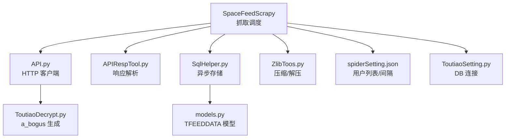
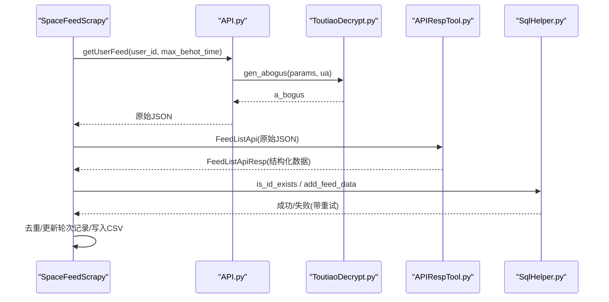
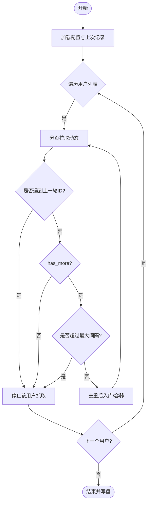
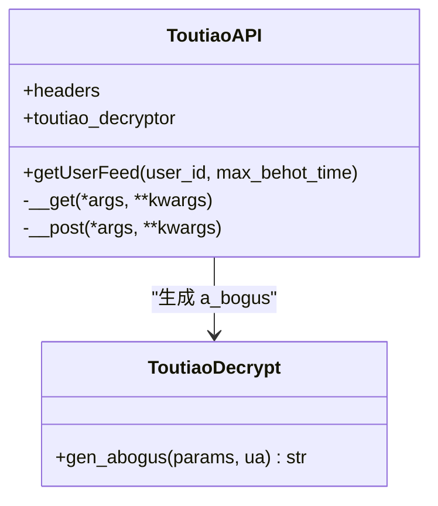
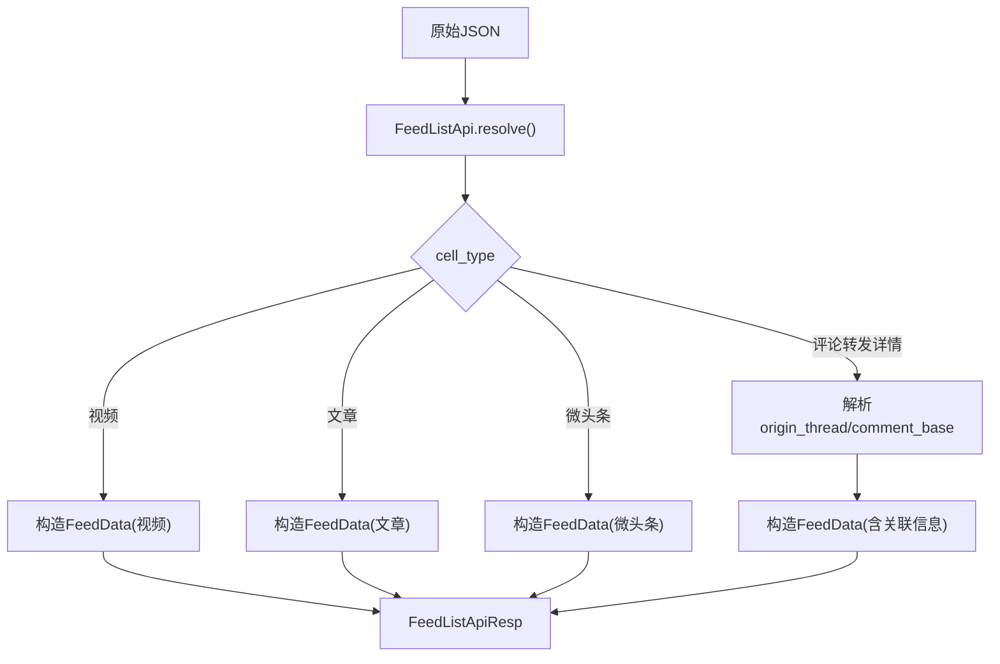
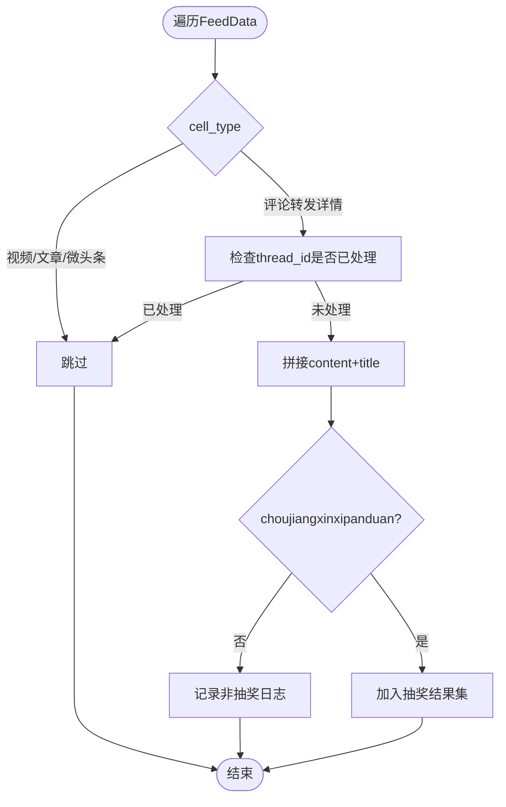
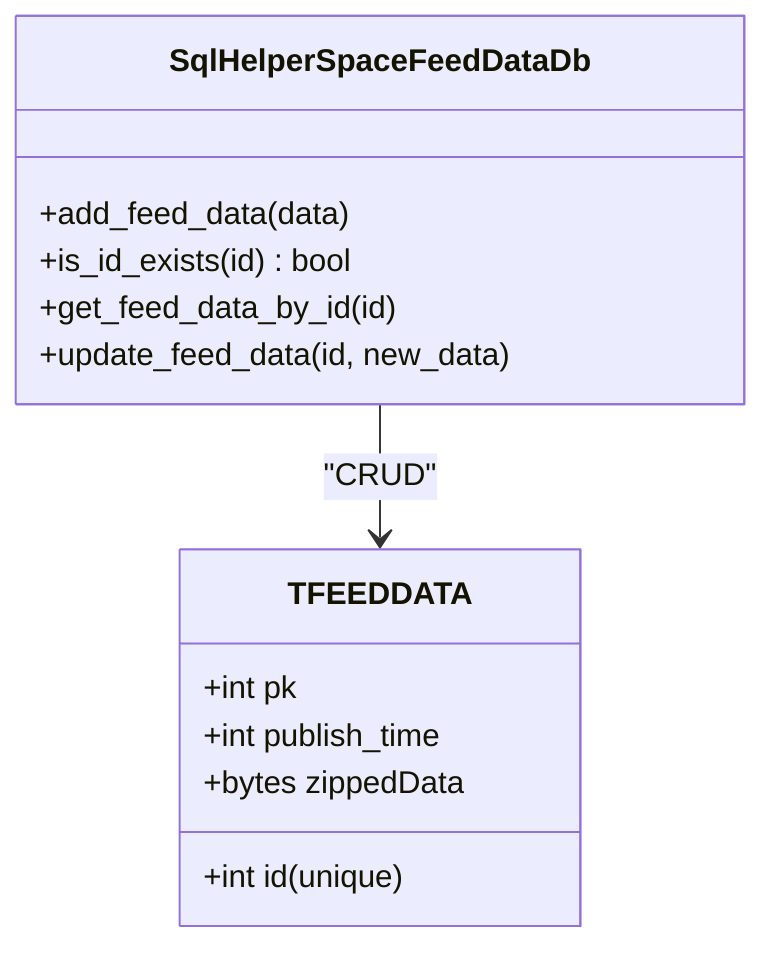
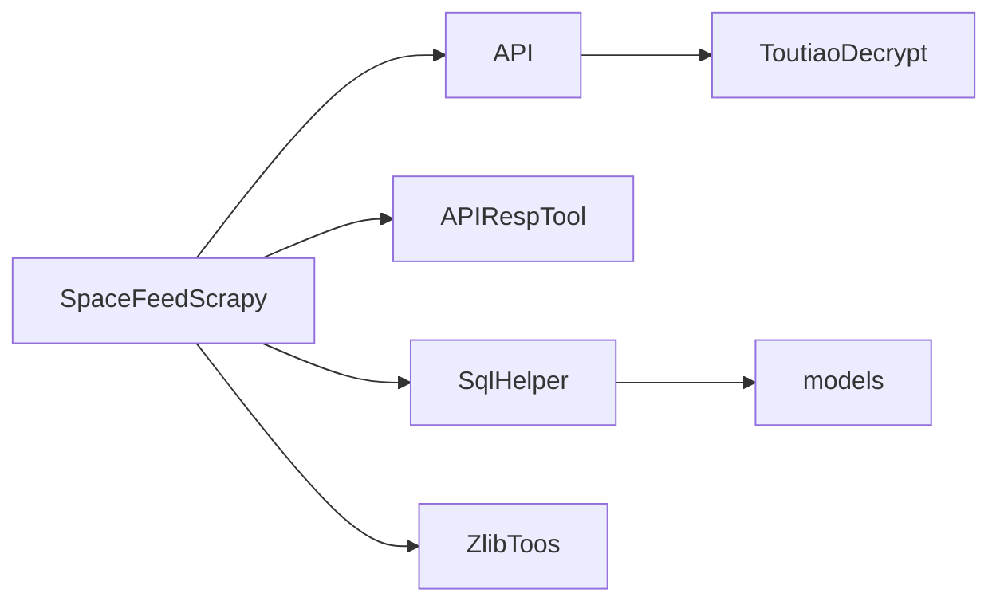

# 头条内容采集器

<cite>
**本文引用的文件**
- [SpaceFeedScrapy.py](file://be-bilibili-crawler/Service/toutiao/src/spider/SpaceFeed/SpaceFeedScrapy.py)
- [API.py](file://be-bilibili-crawler/Service/toutiao/src/Tools/ApiTools/API.py)
- [APIRespTool.py](file://be-bilibili-crawler/Service/toutiao/src/Tools/ApiTools/APIRespTool.py)
- [ToutiaoDecrypt.py](file://be-bilibili-crawler/Service/toutiao/src/Tools/Enc/ToutiaoDecrypt.py)
- [ZlibToos.py](file://be-bilibili-crawler/Service/toutiao/src/Tools/Common/ZlibToos.py)
- [SqlHelper.py](file://be-bilibili-crawler/Service/toutiao/src/db/SqlHelper.py)
- [models.py](file://be-bilibili-crawler/Service/toutiao/src/db/models.py)
- [ToutiaoSetting.py](file://be-bilibili-crawler/Service/toutiao/src/ToutiaoSetting.py)
- [spiderSetting.json](file://be-bilibili-crawler/Service/toutiao/src/spider/spiderSetting.json)
</cite>

## 目录
1. [简介](#简介)
2. [项目结构](#项目结构)
3. [核心组件](#核心组件)
4. [架构总览](#架构总览)
5. [详细组件分析](#详细组件分析)
6. [依赖关系分析](#依赖关系分析)
7. [性能考虑](#性能考虑)
8. [故障排查指南](#故障排查指南)
9. [结论](#结论)
10. [附录：使用示例与监控告警配置](#附录使用示例与监控告警配置)

## 简介
本文件为“头条内容采集器”的综合技术文档，聚焦于头条空间动态抓取的核心架构与实现细节。内容涵盖：
- SpaceFeedScrapy 的抓取策略、反检测机制、数据解析流程
- ToutiaoSetting.py 的配置管理（数据库连接等）
- 请求头生成与参数签名（a_bogus）
- 内容过滤算法（抽奖信息识别）
- 数据存储方案（SQLite + 异步 ORM）
- 错误重试机制（网络层与数据库层）
- 使用示例与监控告警建议

## 项目结构
头条爬虫位于 be-bilibili-crawler/Service/toutiao 下，主要模块如下：
- spider/SpaceFeed：空间动态抓取主逻辑（并发调度、去重、结果落盘）
- Tools/ApiTools：HTTP 客户端封装、响应模型解析
- Tools/Enc：反检测参数生成（a_bogus）
- Tools/Common：通用工具（如压缩/解压）
- db：ORM 模型与异步 SQL 助手
- 顶层配置：数据库连接与根路径配置

图表来源
- [SpaceFeedScrapy.py:83-316](file://be-bilibili-crawler/Service/toutiao/src/spider/SpaceFeed/SpaceFeedScrapy.py#L83-L316)
- [API.py:59-104](file://be-bilibili-crawler/Service/toutiao/src/Tools/ApiTools/API.py#L59-L104)
- [ToutiaoDecrypt.py:6-18](file://be-bilibili-crawler/Service/toutiao/src/Tools/Enc/ToutiaoDecrypt.py#L6-L18)
- [APIRespTool.py:84-203](file://be-bilibili-crawler/Service/toutiao/src/Tools/ApiTools/APIRespTool.py#L84-L203)
- [SqlHelper.py:33-64](file://be-bilibili-crawler/Service/toutiao/src/db/SqlHelper.py#L33-L64)
- [models.py:8-15](file://be-bilibili-crawler/Service/toutiao/src/db/models.py#L8-L15)
- [ZlibToos.py:3-7](file://be-bilibili-crawler/Service/toutiao/src/Tools/Common/ZlibToos.py#L3-L7)
- [spiderSetting.json:1-8](file://be-bilibili-crawler/Service/toutiao/src/spider/spiderSetting.json#L1-L8)
- [ToutiaoSetting.py:1-9](file://be-bilibili-crawler/Service/toutiao/src/ToutiaoSetting.py#L1-L9)

章节来源
- [SpaceFeedScrapy.py:83-316](file://be-bilibili-crawler/Service/toutiao/src/spider/SpaceFeed/SpaceFeedScrapy.py#L83-L316)
- [API.py:59-104](file://be-bilibili-crawler/Service/toutiao/src/Tools/ApiTools/API.py#L59-L104)
- [APIRespTool.py:84-203](file://be-bilibili-crawler/Service/toutiao/src/Tools/ApiTools/APIRespTool.py#L84-L203)
- [SqlHelper.py:33-64](file://be-bilibili-crawler/Service/toutiao/src/db/SqlHelper.py#L33-L64)
- [models.py:8-15](file://be-bilibili-crawler/Service/toutiao/src/db/models.py#L8-L15)
- [ZlibToos.py:3-7](file://be-bilibili-crawler/Service/toutiao/src/Tools/Common/ZlibToos.py#L3-L7)
- [spiderSetting.json:1-8](file://be-bilibili-crawler/Service/toutiao/src/spider/spiderSetting.json#L1-L8)
- [ToutiaoSetting.py:1-9](file://be-bilibili-crawler/Service/toutiao/src/ToutiaoSetting.py#L1-L9)

## 核心组件
- 抓取调度器：单例类负责并发抓取多个用户空间动态，维护去重集合与轮次记录，控制终止条件（重复、无更多、时间间隔）。
- HTTP 客户端：封装异步 GET/POST，自动注入 msToken 与 a_bogus 参数，统一重试装饰器。
- 响应解析器：将原始 JSON 映射为结构化对象（FeedData、OriginThread、User 等），并暴露 has_more、max_behot_time 等分页字段。
- 数据库助手：基于 SQLAlchemy 异步会话，提供增删改查与存在性检查，内置重试装饰器。
- 配置管理：集中定义 SQLite 连接串与根目录；用户列表与最大间隔由外部 JSON 配置。
- 工具库：zlib 压缩/解压用于原始数据落库；JS 引擎执行 a_bogus 生成以通过反爬校验。

章节来源
- [SpaceFeedScrapy.py:83-316](file://be-bilibili-crawler/Service/toutiao/src/spider/SpaceFeed/SpaceFeedScrapy.py#L83-L316)
- [API.py:59-104](file://be-bilibili-crawler/Service/toutiao/src/Tools/ApiTools/API.py#L59-L104)
- [APIRespTool.py:84-203](file://be-bilibili-crawler/Service/toutiao/src/Tools/ApiTools/APIRespTool.py#L84-L203)
- [SqlHelper.py:33-64](file://be-bilibili-crawler/Service/toutiao/src/db/SqlHelper.py#L33-L64)
- [ToutiaoSetting.py:1-9](file://be-bilibili-crawler/Service/toutiao/src/ToutiaoSetting.py#L1-L9)
- [ZlibToos.py:3-7](file://be-bilibili-crawler/Service/toutiao/src/Tools/Common/ZlibToos.py#L3-L7)

## 架构总览
整体采用“调度器 + 客户端 + 解析器 + 存储”的分层设计。调度器负责并发与业务流控；客户端负责网络与反检测；解析器负责数据结构化；存储负责持久化与幂等。

图表来源
- [SpaceFeedScrapy.py:192-225](file://be-bilibili-crawler/Service/toutiao/src/spider/SpaceFeed/SpaceFeedScrapy.py#L192-L225)
- [API.py:69-104](file://be-bilibili-crawler/Service/toutiao/src/Tools/ApiTools/API.py#L69-L104)
- [ToutiaoDecrypt.py:16-18](file://be-bilibili-crawler/Service/toutiao/src/Tools/Enc/ToutiaoDecrypt.py#L16-L18)
- [APIRespTool.py:84-203](file://be-bilibili-crawler/Service/toutiao/src/Tools/ApiTools/APIRespTool.py#L84-L203)
- [SqlHelper.py:38-64](file://be-bilibili-crawler/Service/toutiao/src/db/SqlHelper.py#L38-L64)

## 详细组件分析

### SpaceFeedScrapy 抓取策略与流程
- 并发抓取：对配置的用户列表创建协程任务，统一聚合等待完成。
- 分页拉取：循环调用接口，依据 has_more 与 max_behot_time 推进。
- 终止条件：
  - 遇到上一轮已获取的 ID（防抖）
  - 接口返回 no more
  - 最新动态发布时间超过最大间隔（默认 7 天，可配置）
- 去重与增量：维护 AllIdList、AllLotIdList 与 last_spider_user_id_recorder，避免重复入库与重复处理。
- 结果输出：每轮结束后导出最新结果 CSV 与全量日志 CSV，并持久化最近一次抓取状态。

图表来源
- [SpaceFeedScrapy.py:95-148](file://be-bilibili-crawler/Service/toutiao/src/spider/SpaceFeed/SpaceFeedScrapy.py#L95-L148)
- [SpaceFeedScrapy.py:192-225](file://be-bilibili-crawler/Service/toutiao/src/spider/SpaceFeed/SpaceFeedScrapy.py#L192-L225)
- [SpaceFeedScrapy.py:228-249](file://be-bilibili-crawler/Service/toutiao/src/spider/SpaceFeed/SpaceFeedScrapy.py#L228-L249)

章节来源
- [SpaceFeedScrapy.py:83-316](file://be-bilibili-crawler/Service/toutiao/src/spider/SpaceFeed/SpaceFeedScrapy.py#L83-L316)
- [spiderSetting.json:1-8](file://be-bilibili-crawler/Service/toutiao/src/spider/spiderSetting.json#L1-L8)

### 反检测机制与请求头生成
- 请求头：固定 UA 头，便于伪装浏览器环境。
- 参数签名：
  - 每次请求注入随机 msToken
  - 使用 JS 引擎执行 a_bogus 生成，参数包含 URL 编码后的查询串与 UA
- 重试：网络层使用装饰器进行有限次重试，捕获异常并记录日志

图表来源
- [API.py:59-104](file://be-bilibili-crawler/Service/toutiao/src/Tools/ApiTools/API.py#L59-L104)
- [ToutiaoDecrypt.py:6-18](file://be-bilibili-crawler/Service/toutiao/src/Tools/Enc/ToutiaoDecrypt.py#L6-L18)

章节来源
- [API.py:59-104](file://be-bilibili-crawler/Service/toutiao/src/Tools/ApiTools/API.py#L59-L104)
- [ToutiaoDecrypt.py:6-18](file://be-bilibili-crawler/Service/toutiao/src/Tools/Enc/ToutiaoDecrypt.py#L6-L18)

### 数据解析流程
- 原始 JSON 经 FeedListApi 解析为 FeedListApiResp，其中 data 为 FeedData 列表
- 针对 cell_type 分支解析：视频、文章、微头条、评论转发详情
- 评论转发详情会进一步解析 origin_thread 与 comment_base，提取发布者信息与跳转链接
- 异常条目记录日志，保证整体解析鲁棒性

图表来源
- [APIRespTool.py:10-203](file://be-bilibili-crawler/Service/toutiao/src/Tools/ApiTools/APIRespTool.py#L10-L203)

章节来源
- [APIRespTool.py:84-203](file://be-bilibili-crawler/Service/toutiao/src/Tools/ApiTools/APIRespTool.py#L84-L203)

### 内容过滤算法（抽奖信息识别）
- 过滤范围：跳过视频、文章、微头条类型
- 重点处理：评论转发详情（cell_type=56）
- 去重：若 thread_id 已在 AllLotIdList 中则跳过
- 识别规则：调用通用判断函数 choujiangxinxipanduan 对 content+title 进行识别
- 输出：非抽奖记录调试日志，抽奖记录进入最终结果集

图表来源
- [SpaceFeedScrapy.py:251-306](file://be-bilibili-crawler/Service/toutiao/src/spider/SpaceFeed/SpaceFeedScrapy.py#L251-L306)

章节来源
- [SpaceFeedScrapy.py:251-306](file://be-bilibili-crawler/Service/toutiao/src/spider/SpaceFeed/SpaceFeedScrapy.py#L251-L306)

### 数据存储方案
- 模型：TFEEDDATA 表包含 id（唯一）、publish_time、zippedData（二进制）
- 存储过程：
  - 先检查 id 是否存在，避免重复插入
  - 将原始数据 JSON 经 zlib 压缩后存入 zippedData
  - 使用异步会话批量提交
- 读取与转换：提供 BlobToStr 将二进制还原为字符串以便后续处理或验证

图表来源
- [models.py:8-15](file://be-bilibili-crawler/Service/toutiao/src/db/models.py#L8-L15)
- [SqlHelper.py:33-64](file://be-bilibili-crawler/Service/toutiao/src/db/SqlHelper.py#L33-L64)
- [ZlibToos.py:3-7](file://be-bilibili-crawler/Service/toutiao/src/Tools/Common/ZlibToos.py#L3-L7)

章节来源
- [models.py:8-15](file://be-bilibili-crawler/Service/toutiao/src/db/models.py#L8-L15)
- [SqlHelper.py:33-64](file://be-bilibili-crawler/Service/toutiao/src/db/SqlHelper.py#L33-L64)
- [ZlibToos.py:3-7](file://be-bilibili-crawler/Service/toutiao/src/Tools/Common/ZlibToos.py#L3-L7)

### 配置管理（ToutiaoSetting.py）
- 数据库连接：定义同步与异步 SQLite 连接串，指向独立数据库文件
- 根目录：预留 root_dir 配置项（当前未使用）
- 扩展点：可在 CONFIG 下增加更多全局配置项供爬虫使用

章节来源
- [ToutiaoSetting.py:1-9](file://be-bilibili-crawler/Service/toutiao/src/ToutiaoSetting.py#L1-L9)

### 代理池集成与请求头生成
- 当前实现：未直接集成代理池；请求通过 httpx 异步客户端发起
- 可扩展点：在 __get/__post 中注入代理参数（proxies）以实现代理池轮换
- 请求头：固定 UA；可通过外部配置动态注入多 UA 以提升抗封能力

章节来源
- [API.py:59-104](file://be-bilibili-crawler/Service/toutiao/src/Tools/ApiTools/API.py#L59-L104)

### 错误重试机制
- 网络层：retry 装饰器对异常进行有限次重试，记录异常与路径
- 数据库层：retry_on_error 装饰器对数据库操作进行无限重试（适合瞬时 IO 错误）
- 建议：结合指标上报与告警，统计重试次数与失败率

章节来源
- [API.py:13-40](file://be-bilibili-crawler/Service/toutiao/src/Tools/ApiTools/API.py#L13-L40)
- [SqlHelper.py:15-30](file://be-bilibili-crawler/Service/toutiao/src/db/SqlHelper.py#L15-L30)

## 依赖关系分析
- 模块耦合：
  - SpaceFeedScrapy 依赖 API、解析器、数据库助手与工具库
  - API 依赖解密器与 httpx
  - 解析器依赖枚举与数据类
  - 数据库助手依赖模型与配置
- 外部依赖：
  - httpx 异步 HTTP 客户端
  - execjs 执行 JS 生成 a_bogus
  - SQLAlchemy 异步 ORM
  - zlib 压缩

图表来源
- [SpaceFeedScrapy.py:83-316](file://be-bilibili-crawler/Service/toutiao/src/spider/SpaceFeed/SpaceFeedScrapy.py#L83-L316)
- [API.py:59-104](file://be-bilibili-crawler/Service/toutiao/src/Tools/ApiTools/API.py#L59-L104)
- [APIRespTool.py:84-203](file://be-bilibili-crawler/Service/toutiao/src/Tools/ApiTools/APIRespTool.py#L84-L203)
- [SqlHelper.py:33-64](file://be-bilibili-crawler/Service/toutiao/src/db/SqlHelper.py#L33-L64)
- [models.py:8-15](file://be-bilibili-crawler/Service/toutiao/src/db/models.py#L8-L15)
- [ZlibToos.py:3-7](file://be-bilibili-crawler/Service/toutiao/src/Tools/Common/ZlibToos.py#L3-L7)

章节来源
- [SpaceFeedScrapy.py:83-316](file://be-bilibili-crawler/Service/toutiao/src/spider/SpaceFeed/SpaceFeedScrapy.py#L83-L316)
- [API.py:59-104](file://be-bilibili-crawler/Service/toutiao/src/Tools/ApiTools/API.py#L59-L104)
- [APIRespTool.py:84-203](file://be-bilibili-crawler/Service/toutiao/src/Tools/ApiTools/APIRespTool.py#L84-L203)
- [SqlHelper.py:33-64](file://be-bilibili-crawler/Service/toutiao/src/db/SqlHelper.py#L33-L64)
- [models.py:8-15](file://be-bilibili-crawler/Service/toutiao/src/db/models.py#L8-L15)
- [ZlibToos.py:3-7](file://be-bilibili-crawler/Service/toutiao/src/Tools/Common/ZlibToos.py#L3-L7)

## 性能考虑
- 并发抓取：按用户维度并行，降低总体耗时
- 内存优化：ScrapedDataContainer 限制内存占用，仅保留必要字段与去重集合
- 去重策略：内存集合 + 文件持久化（AllIdList/AllLotIdList）双重保障
- 数据库写入：异步会话 + 事务提交，减少锁竞争
- 压缩存储：原始 JSON 经 zlib 压缩，节省磁盘空间
- 建议：
  - 根据机器资源调整并发度
  - 定期清理历史 CSV 与临时文件
  - 监控 SQLite 文件大小与写入延迟

## 故障排查指南
- 网络异常：
  - 检查 retry 装饰器的重试次数与间隔
  - 查看日志中的 URL 路径与异常堆栈
- 反检测失败：
  - 确认 a_bogus 生成是否成功（execjs 环境是否正常）
  - 检查 UA 与参数组合是否符合服务端预期
- 解析异常：
  - 关注未知 cell_type 的日志输出
  - 核对接口返回结构变化
- 数据库异常：
  - 观察 retry_on_error 的重试日志
  - 检查 SQLite 文件权限与路径
- 建议：
  - 启用结构化日志（包含 user_id、url、error）
  - 设置关键指标（成功率、重试率、QPS、延迟）
  - 接入告警通道（邮件/IM）

章节来源
- [API.py:13-40](file://be-bilibili-crawler/Service/toutiao/src/Tools/ApiTools/API.py#L13-L40)
- [ToutiaoDecrypt.py:6-18](file://be-bilibili-crawler/Service/toutiao/src/Tools/Enc/ToutiaoDecrypt.py#L6-L18)
- [APIRespTool.py:172-195](file://be-bilibili-crawler/Service/toutiao/src/Tools/ApiTools/APIRespTool.py#L172-L195)
- [SqlHelper.py:15-30](file://be-bilibili-crawler/Service/toutiao/src/db/SqlHelper.py#L15-L30)

## 结论
本采集器以清晰的模块化设计与完善的反检测、重试与去重机制，实现了稳定的头条空间动态抓取。通过配置化管理与可扩展的存储方案，能够适应不同规模与场景的需求。建议在现有基础上引入代理池、更细粒度的指标与告警，进一步提升稳定性与可观测性。

## 附录：使用示例与监控告警配置

### 运行示例
- 修改用户列表与间隔：编辑 spiderSetting.json 中的 user_id_list 与 max_sep_time
- 启动抓取：运行 SpaceFeedScrapy 的主入口，将并发抓取配置的用户空间动态
- 查看结果：轮次结束后会在 result/latest.csv 与 log/all.csv 输出结果与日志

章节来源
- [spiderSetting.json:1-8](file://be-bilibili-crawler/Service/toutiao/src/spider/spiderSetting.json#L1-L8)
- [SpaceFeedScrapy.py:308-316](file://be-bilibili-crawler/Service/toutiao/src/spider/SpaceFeed/SpaceFeedScrapy.py#L308-L316)

### 监控告警建议
- 指标采集：
  - 抓取成功率、重试次数、失败率
  - QPS、平均延迟、P95/P99 延迟
  - 去重命中率、新增动态数
- 告警阈值：
  - 连续失败次数 > N 触发告警
  - 重试率 > X% 触发告警
  - 延迟 P95 > Yms 触发告警
- 告警渠道：
  - 邮件、企业微信/钉钉机器人、短信
- 可视化：
  - 使用 Grafana/Prometheus 展示趋势与分布
  - 建立看板：成功率、重试、延迟、吞吐

[本节为概念性指导，不直接分析具体文件]