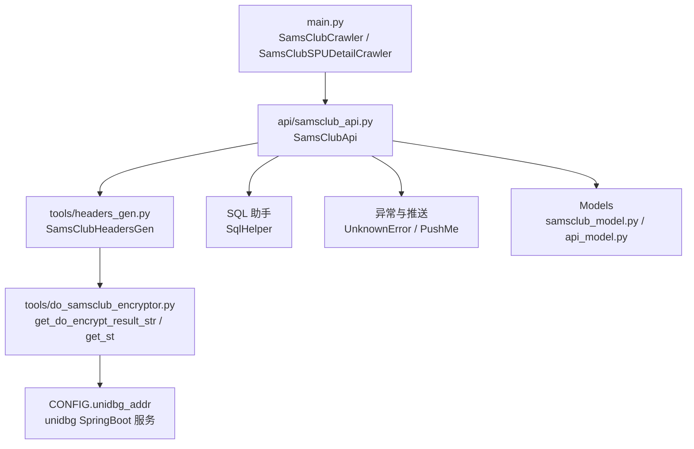
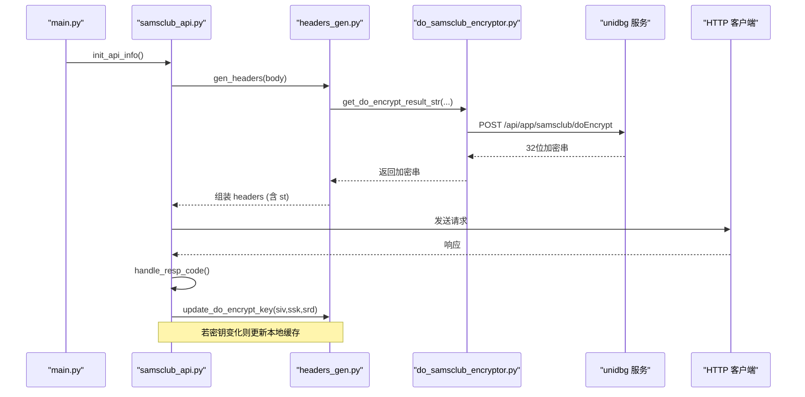
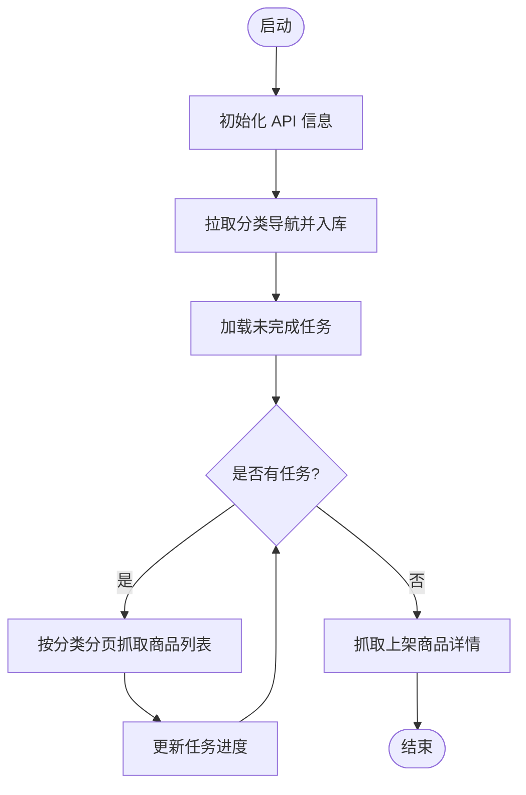
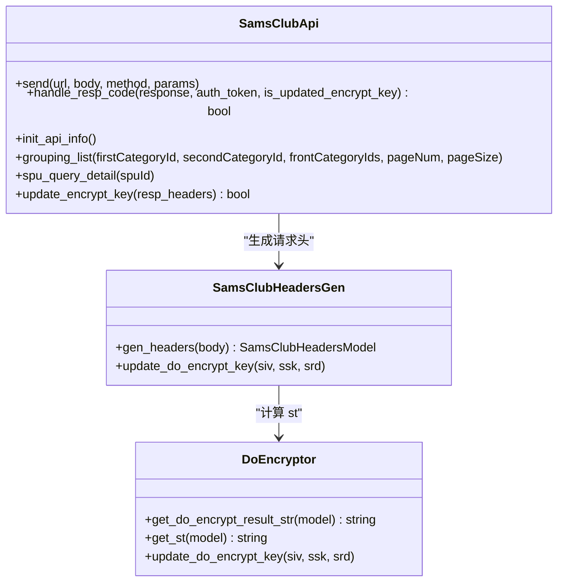
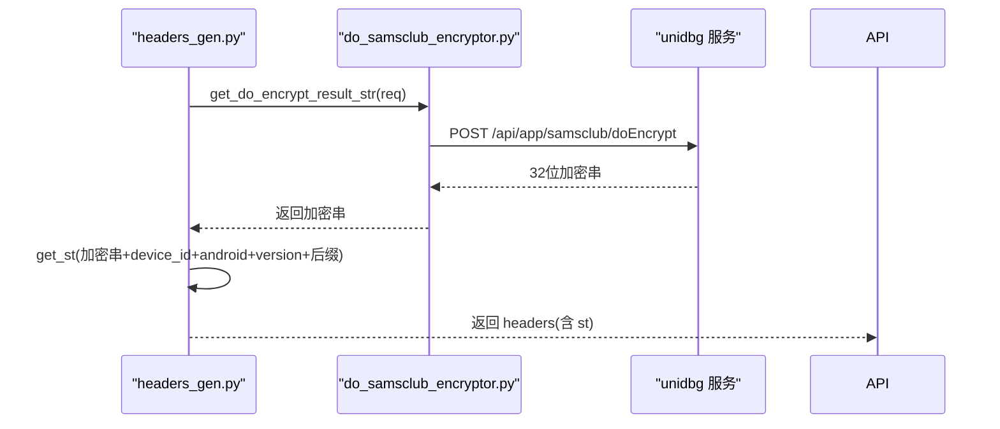
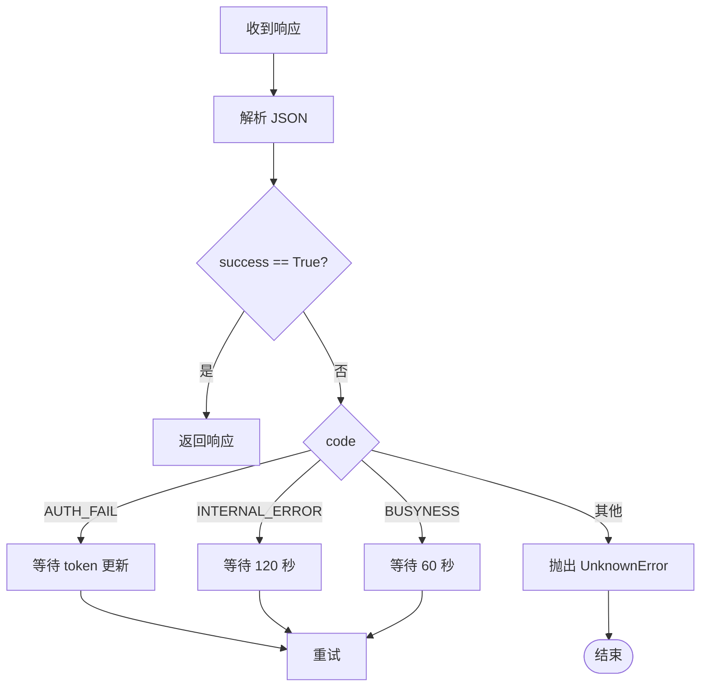
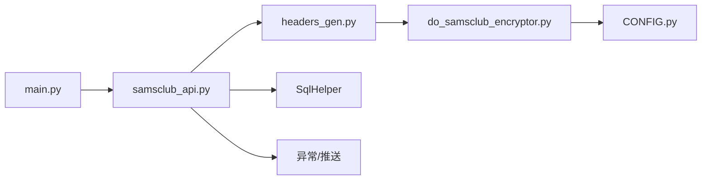

# 山姆会员店采集器

<cite>
**本文引用的文件**
- [Service/samsclub/main.py](file://be-bilibili-crawler/Service/samsclub/main.py)
- [Service/samsclub/api/samsclub_api.py](file://be-bilibili-crawler/Service/samsclub/api/samsclub_api.py)
- [Service/samsclub/tools/headers_gen.py](file://be-bilibili-crawler/Service/samsclub/tools/headers_gen.py)
- [Service/samsclub/tools/do_samsclub_encryptor.py](file://be-bilibili-crawler/Service/samsclub/tools/do_samsclub_encryptor.py)
- [Service/samsclub/tools/samsclub_string_decryptor.py](file://be-bilibili-crawler/Service/samsclub/tools/samsclub_string_decryptor.py)
- [Models/v1/samsclub/samsclub_model.py](file://be-bilibili-crawler/Models/v1/samsclub/samsclub_model.py)
- [Models/v1/samsclub/api_model.py](file://be-bilibili-crawler/Models/v1/samsclub/api_model.py)
- [CONFIG.py](file://be-bilibili-crawler/CONFIG.py)
</cite>

## 目录
1. [简介](#简介)
2. [项目结构](#项目结构)
3. [核心组件](#核心组件)
4. [架构总览](#架构总览)
5. [详细组件分析](#详细组件分析)
6. [依赖关系分析](#依赖关系分析)
7. [性能考虑](#性能考虑)
8. [故障排查指南](#故障排查指南)
9. [结论](#结论)
10. [附录](#附录)

## 简介
本仓库包含“山姆会员店采集器”的完整后端实现，负责：
- 调用山姆会员商店 API（分类、商品列表、详情等）
- 生成请求头与签名（st），通过外部 unidbg 服务完成加密参数计算
- 处理响应码、自动更新加密密钥、重试与容错
- 持久化采集进度、分类树与商品数据
- 提供字符串解密工具以解析响应中的加密字段

该实现采用异步爬虫框架，封装了统一的 HTTP 发送、错误处理、灰度策略上报、版本信息同步等能力。

## 项目结构
围绕山姆会员店采集的核心代码位于 be-bilibili-crawler/Service/samsclub 目录，主要模块如下：
- main.py：启动与调度逻辑，定义两类爬虫（分类列表爬虫、SPU详情爬虫）
- api/samsclub_api.py：API 封装层，统一发送请求、处理响应、初始化账号与地址、维护灰度策略
- tools/headers_gen.py：请求头生成器，构造 treq-id、t、n、st 等关键头部
- tools/do_samsclub_encryptor.py：与 unidbg 服务交互，计算 doEncrypt 结果并生成 st
- tools/samsclub_string_decryptor.py：本地 AES-CBC 解密工具，用于解码响应中的加密字符串
- Models/v1/samsclub/*：Pydantic 模型，描述请求/响应结构与配置项
- CONFIG.py：全局配置，含 unidbg 地址、数据库连接、代理等

图表来源
- [Service/samsclub/main.py:30-175](file://be-bilibili-crawler/Service/samsclub/main.py#L30-L175)
- [Service/samsclub/api/samsclub_api.py:38-190](file://be-bilibili-crawler/Service/samsclub/api/samsclub_api.py#L38-L190)
- [Service/samsclub/tools/headers_gen.py:54-145](file://be-bilibili-crawler/Service/samsclub/tools/headers_gen.py#L54-L145)
- [Service/samsclub/tools/do_samsclub_encryptor.py:11-55](file://be-bilibili-crawler/Service/samsclub/tools/do_samsclub_encryptor.py#L11-L55)
- [CONFIG.py:438-483](file://be-bilibili-crawler/CONFIG.py#L438-L483)

章节来源
- [Service/samsclub/main.py:22-175](file://be-bilibili-crawler/Service/samsclub/main.py#L22-L175)
- [Service/samsclub/api/samsclub_api.py:38-190](file://be-bilibili-crawler/Service/samsclub/api/samsclub_api.py#L38-L190)
- [Service/samsclub/tools/headers_gen.py:54-145](file://be-bilibili-crawler/Service/samsclub/tools/headers_gen.py#L54-L145)
- [Service/samsclub/tools/do_samsclub_encryptor.py:11-55](file://be-bilibili-crawler/Service/samsclub/tools/do_samsclub_encryptor.py#L11-L55)
- [CONFIG.py:438-483](file://be-bilibili-crawler/CONFIG.py#L438-L483)

## 核心组件
- SamsClubCrawler：按二级分类批量抓取商品列表，维护任务进度、分页、CSV 落盘
- SamsClubSPUDetailCrawler：针对上架商品抓取详情，写入数据库
- SamsClubApi：统一 HTTP 客户端，封装 send、handle_resp_code、init_api_info、各类业务接口
- SamsClubHeadersGen：生成 headers，包括时间戳、随机数、treq-id、st 签名
- do_samsclub_encryptor：调用 unidbg 服务进行 doEncrypt，并计算 st
- samsclub_string_decryptor：本地解密响应中的加密字符串（AES-CBC）
- Pydantic 模型：ApiResponse、UserProfile、SamsClubHeadersModel、SamsClubGrayConfigStrategy 等

章节来源
- [Service/samsclub/main.py:22-249](file://be-bilibili-crawler/Service/samsclub/main.py#L22-L249)
- [Service/samsclub/api/samsclub_api.py:38-800](file://be-bilibili-crawler/Service/samsclub/api/samsclub_api.py#L38-L800)
- [Service/samsclub/tools/headers_gen.py:54-145](file://be-bilibili-crawler/Service/samsclub/tools/headers_gen.py#L54-L145)
- [Service/samsclub/tools/do_samsclub_encryptor.py:11-74](file://be-bilibili-crawler/Service/samsclub/tools/do_samsclub_encryptor.py#L11-L74)
- [Service/samsclub/tools/samsclub_string_decryptor.py:1-35](file://be-bilibili-crawler/Service/samsclub/tools/samsclub_string_decryptor.py#L1-L35)
- [Models/v1/samsclub/api_model.py:1-48](file://be-bilibili-crawler/Models/v1/samsclub/api_model.py#L1-L48)
- [Models/v1/samsclub/samsclub_model.py:7-185](file://be-bilibili-crawler/Models/v1/samsclub/samsclub_model.py#L7-L185)

## 架构总览
整体流程：
- 启动后先初始化 API 信息（用户、地址、灰度策略、版本号）
- 拉取分类树并持久化，再按二级分类分页抓取商品列表
- 对已上架商品单独抓取详情
- 每次请求前生成 headers 和 st；若服务端返回新的 siv/ssk/srd，则更新加密密钥
- 响应处理中根据 code/msg 做差异化重试或告警

图表来源
- [Service/samsclub/main.py:162-175](file://be-bilibili-crawler/Service/samsclub/main.py#L162-L175)
- [Service/samsclub/api/samsclub_api.py:143-190](file://be-bilibili-crawler/Service/samsclub/api/samsclub_api.py#L143-L190)
- [Service/samsclub/tools/headers_gen.py:97-145](file://be-bilibili-crawler/Service/samsclub/tools/headers_gen.py#L97-L145)
- [Service/samsclub/tools/do_samsclub_encryptor.py:25-55](file://be-bilibili-crawler/Service/samsclub/tools/do_samsclub_encryptor.py#L25-L55)

## 详细组件分析

### main.py 启动流程与调度
- 定义两类爬虫：
  - SamsClubCrawler：按二级分类抓取商品列表，支持断点续爬、分页、CSV 落盘
  - SamsClubSPUDetailCrawler：抓取上架商品的详情
- 启动流程：
  - 初始化 API（用户、地址、灰度策略、版本）
  - 拉取分类树并入库
  - 读取未完成的任务继续抓取
  - 获取二级分类作为任务源，运行采集

图表来源
- [Service/samsclub/main.py:162-175](file://be-bilibili-crawler/Service/samsclub/main.py#L162-L175)
- [Service/samsclub/main.py:115-160](file://be-bilibili-crawler/Service/samsclub/main.py#L115-L160)
- [Service/samsclub/main.py:196-241](file://be-bilibili-crawler/Service/samsclub/main.py#L196-L241)

章节来源
- [Service/samsclub/main.py:22-249](file://be-bilibili-crawler/Service/samsclub/main.py#L22-L249)

### samsclub_api.py 接口封装与响应处理
- 统一发送方法 send：
  - 生成 headers（含 st）
  - 添加高德地图相关定位头
  - 使用 httpx 发送请求
  - 处理网络异常与未知异常
  - 更新加密密钥（从响应头 siv/ssk/srd）
  - 统一响应码处理（AUTH_FAIL、INTERNAL_ERROR、BUSYNESS 等）
- 初始化流程 init_api_info：
  - 重新实例化 HeadersGen
  - 初始化用户信息与门店地址
  - 拉取灰度策略并上报实验
  - 同步最新版本号
- 业务接口：
  - grouping_query_navigation/queryChildren/list
  - spu_query_detail
  - 用户、消息、广告、装饰等辅助接口

图表来源
- [Service/samsclub/api/samsclub_api.py:38-190](file://be-bilibili-crawler/Service/samsclub/api/samsclub_api.py#L38-L190)
- [Service/samsclub/api/samsclub_api.py:279-375](file://be-bilibili-crawler/Service/samsclub/api/samsclub_api.py#L279-L375)
- [Service/samsclub/tools/headers_gen.py:54-145](file://be-bilibili-crawler/Service/samsclub/tools/headers_gen.py#L54-L145)
- [Service/samsclub/tools/do_samsclub_encryptor.py:11-55](file://be-bilibili-crawler/Service/samsclub/tools/do_samsclub_encryptor.py#L11-L55)

章节来源
- [Service/samsclub/api/samsclub_api.py:38-800](file://be-bilibili-crawler/Service/samsclub/api/samsclub_api.py#L38-L800)

### 请求签名生成与加密机制
- 请求头关键字段：
  - treq-id：固定 UUID + 计数器 + 时间戳组合
  - t：毫秒级时间戳
  - n：随机 UUID
  - st：签名，由 doEncrypt 结果 + device_id + android + version + 固定后缀 MD5 得到
- 签名流程：
  - 构造 SamsClubGetDoEncryptReqModel（timestampStr、bodyStr、uuidStr、tokenStr）
  - 调用 unidbg 服务 /api/app/samsclub/doEncrypt 获取 32 位加密串
  - 使用 get_st 将加密串与设备信息拼接后 MD5 生成 st
- 密钥更新：
  - 从响应头读取 siv/ssk/srd，若变化则调用 update_do_encrypt_key 通知 unidbg 更新密钥

图表来源
- [Service/samsclub/tools/headers_gen.py:97-145](file://be-bilibili-crawler/Service/samsclub/tools/headers_gen.py#L97-L145)
- [Service/samsclub/tools/do_samsclub_encryptor.py:11-38](file://be-bilibili-crawler/Service/samsclub/tools/do_samsclub_encryptor.py#L11-L38)

章节来源
- [Service/samsclub/tools/headers_gen.py:54-145](file://be-bilibili-crawler/Service/samsclub/tools/headers_gen.py#L54-L145)
- [Service/samsclub/tools/do_samsclub_encryptor.py:11-74](file://be-bilibili-crawler/Service/samsclub/tools/do_samsclub_encryptor.py#L11-L74)

### 响应数据处理与错误处理
- 响应码处理：
  - success 为 True 视为成功
  - AUTH_FAIL：可能因密钥过期，等待 token 更新后重试
  - INTERNAL_ERROR：记录日志并等待一段时间重试
  - BUSYNESS：服务器繁忙，等待后重试
  - 其他未知错误抛出 UnknownError
- 网络异常：
  - RequestException/HTTPError：记录异常并等待 30 秒后重试
  - JSON 序列化失败：推送告警，等待 1800 秒后重新初始化 API
- 加密密钥更新：
  - 从响应头提取 siv/ssk/srd，若变化则更新本地缓存并返回 False 触发重试

图表来源
- [Service/samsclub/api/samsclub_api.py:201-246](file://be-bilibili-crawler/Service/samsclub/api/samsclub_api.py#L201-L246)

章节来源
- [Service/samsclub/api/samsclub_api.py:143-246](file://be-bilibili-crawler/Service/samsclub/api/samsclub_api.py#L143-L246)

### 字符串解密器实现原理
- 算法：AES-CBC，固定 KEY 与 IV（均为 16 字节）
- 步骤：
  - Base64 解码密文
  - 使用 AES.new(KEY, MODE_CBC, IV) 解密
  - 去除填充并 UTF-8 解码
- 用途：解析响应体中某些加密字段

章节来源
- [Service/samsclub/tools/samsclub_string_decryptor.py:1-35](file://be-bilibili-crawler/Service/samsclub/tools/samsclub_string_decryptor.py#L1-L35)

### 数据格式转换与模型
- ApiResponse[UserProfile]：统一响应结构，包含 code、data、msg、requestId、rt、success、traceId
- SamsClubHeadersModel：请求头模型，包含语言、设备、位置、签名等字段
- SamsClubGrayConfigStrategy：灰度策略集合，用于 AB 测试上报
- SamsClubAppStorage：应用存储，包含 uid、mobile、storeList、version_str 等

章节来源
- [Models/v1/samsclub/api_model.py:1-48](file://be-bilibili-crawler/Models/v1/samsclub/api_model.py#L1-L48)
- [Models/v1/samsclub/samsclub_model.py:7-185](file://be-bilibili-crawler/Models/v1/samsclub/samsclub_model.py#L7-L185)

## 依赖关系分析
- main.py 依赖：
  - SamsClubApi：所有 API 调用
  - SqlHelper：数据库操作（分类、商品、任务进度）
  - SleepTimeGenerator：随机延迟控制
- samsclub_api.py 依赖：
  - headers_gen：请求头生成
  - do_samsclub_encryptor：加密签名
  - CONFIG：unidbg 地址、代理等
  - 异常与推送：UnknownError、PushMe
- headers_gen.py 依赖：
  - do_samsclub_encryptor：计算 st
  - java_rand_gen：随机数生成
- do_samsclub_encryptor.py 依赖：
  - CONFIG：unidbg 地址
  - Pydantic 模型：请求体结构

图表来源
- [Service/samsclub/main.py:17-69](file://be-bilibili-crawler/Service/samsclub/main.py#L17-L69)
- [Service/samsclub/api/samsclub_api.py:14-22](file://be-bilibili-crawler/Service/samsclub/api/samsclub_api.py#L14-L22)
- [Service/samsclub/tools/headers_gen.py:6-12](file://be-bilibili-crawler/Service/samsclub/tools/headers_gen.py#L6-L12)
- [Service/samsclub/tools/do_samsclub_encryptor.py:6-8](file://be-bilibili-crawler/Service/samsclub/tools/do_samsclub_encryptor.py#L6-L8)
- [CONFIG.py:438-483](file://be-bilibili-crawler/CONFIG.py#L438-L483)

章节来源
- [Service/samsclub/main.py:17-69](file://be-bilibili-crawler/Service/samsclub/main.py#L17-L69)
- [Service/samsclub/api/samsclub_api.py:14-22](file://be-bilibili-crawler/Service/samsclub/api/samsclub_api.py#L14-L22)
- [Service/samsclub/tools/headers_gen.py:6-12](file://be-bilibili-crawler/Service/samsclub/tools/headers_gen.py#L6-L12)
- [Service/samsclub/tools/do_samsclub_encryptor.py:6-8](file://be-bilibili-crawler/Service/samsclub/tools/do_samsclub_encryptor.py#L6-L8)
- [CONFIG.py:438-483](file://be-bilibili-crawler/CONFIG.py#L438-L483)

## 性能考虑
- 并发与限流：
  - 爬虫并发数设置为 1，避免对服务端造成压力
  - 使用 SleepTimeGenerator 生成短/中/长随机延迟，降低被风控概率
- 重试与退避：
  - 网络异常等待 30 秒重试
  - 内部错误等待 120 秒
  - 繁忙状态等待 60 秒
  - JSON 解析失败等待 1800 秒并重新初始化
- 密钥更新：
  - 动态检测 siv/ssk/srd 变化，避免频繁无效请求
- 数据落盘：
  - 分类与商品数据分目录按日期保存 CSV，便于离线分析与调试
- 连接池与超时：
  - 数据库连接池配置合理大小与回收周期，防止连接泄漏
  - HTTP 客户端使用 httpx，具备较好的异步性能

[本节为通用性能建议，不直接分析具体文件]

## 故障排查指南
- 常见错误与处理：
  - AUTH_FAIL：检查 auth-token 是否有效，等待 token 更新后重试
  - INTERNAL_ERROR：记录请求 URL、Headers、Body 与响应，等待后重试
  - BUSYNESS：服务器繁忙，等待 60 秒后重试
  - JSON 解析失败：可能被风控，推送告警并等待 1800 秒后重新初始化
- 加密失败：
  - 检查 unidbg 服务是否可达，确认 siv/ssk/srd 是否正确更新
  - 验证 doEncrypt 返回是否为 32 位字符串
- 分类与商品为空：
  - 检查前端分类 ID 是否正确
  - 查看分页参数与 hasNextPage 标志
- 日志与告警：
  - 使用 sams_club_logger 记录关键步骤
  - 通过 PushMe 推送错误信息，便于及时发现问题

章节来源
- [Service/samsclub/api/samsclub_api.py:175-246](file://be-bilibili-crawler/Service/samsclub/api/samsclub_api.py#L175-L246)
- [Service/samsclub/tools/do_samsclub_encryptor.py:25-38](file://be-bilibili-crawler/Service/samsclub/tools/do_samsclub_encryptor.py#L25-L38)
- [Service/samsclub/main.py:130-160](file://be-bilibili-crawler/Service/samsclub/main.py#L130-L160)

## 结论
本实现提供了完整的山姆会员店数据采集方案，涵盖：
- 稳定的 API 封装与错误处理
- 动态签名生成与密钥更新
- 分类与商品数据的持久化与断点续爬
- 本地字符串解密工具
- 合理的性能优化与故障恢复机制

建议在生产环境中：
- 确保 unidbg 服务稳定可用
- 定期备份 auth_token 与 app_storage
- 监控日志与告警，及时处理异常
- 根据实际流量调整延迟与并发策略

[本节为总结性内容，不直接分析具体文件]

## 附录

### 配置示例
- 环境变量（部分）：
  - UNIDBG_HOST、UNIDBG_PORT：unidbg 服务地址
  - MYSQL_*：数据库连接信息
  - REDIS_*：Redis 连接信息
  - RABBITMQ_*：消息队列配置
  - PROXY_SERVER：代理地址
- 配置文件路径：
  - .env.fastapi.prod、.env.fastapi.dev
- 关键配置项：
  - CONFIG.unidbg_addr：unidbg 服务地址
  - CONFIG.custom_proxy：代理设置
  - database.sams_club_URI：山姆会员店数据库连接

章节来源
- [CONFIG.py:225-277](file://be-bilibili-crawler/CONFIG.py#L225-L277)
- [CONFIG.py:438-483](file://be-bilibili-crawler/CONFIG.py#L438-L483)

### 接口调用示例（路径参考）
- 分类导航：
  - [Service/samsclub/api/samsclub_api.py:442-453](file://be-bilibili-crawler/Service/samsclub/api/samsclub_api.py#L442-L453)
- 分类子节点：
  - [Service/samsclub/api/samsclub_api.py:455-470](file://be-bilibili-crawler/Service/samsclub/api/samsclub_api.py#L455-L470)
- 商品列表：
  - [Service/samsclub/api/samsclub_api.py:472-507](file://be-bilibili-crawler/Service/samsclub/api/samsclub_api.py#L472-L507)
- 商品详情：
  - [Service/samsclub/api/samsclub_api.py:390-440](file://be-bilibili-crawler/Service/samsclub/api/samsclub_api.py#L390-L440)
- 用户信息：
  - [Service/samsclub/api/samsclub_api.py:509-521](file://be-bilibili-crawler/Service/samsclub/api/samsclub_api.py#L509-L521)

[本节为接口路径参考，不直接展示代码内容]