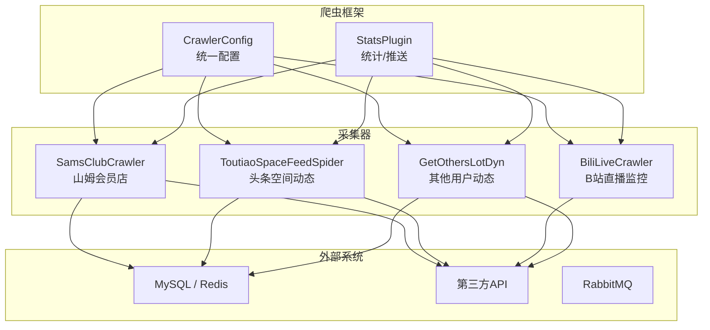
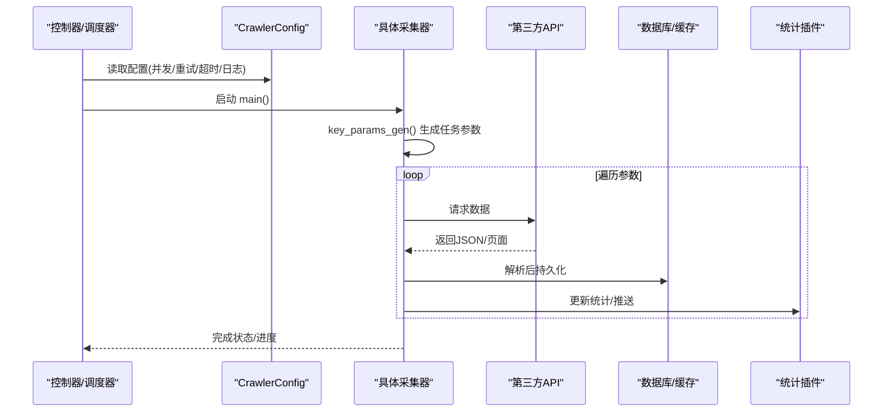
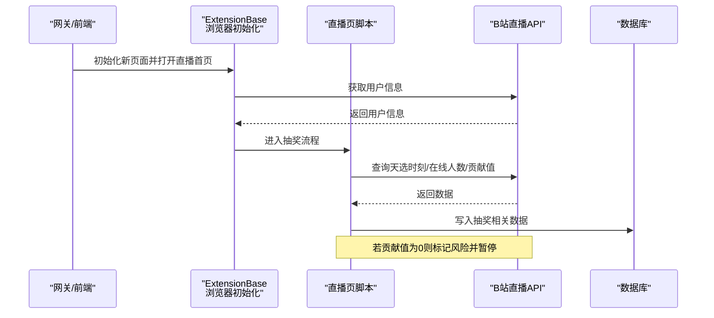
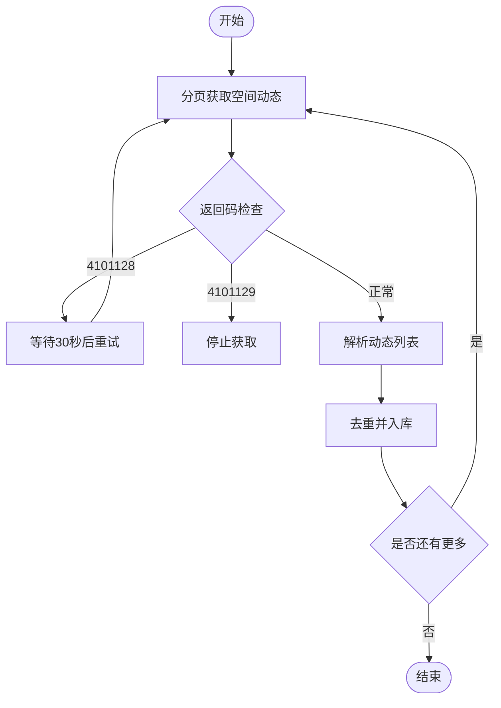
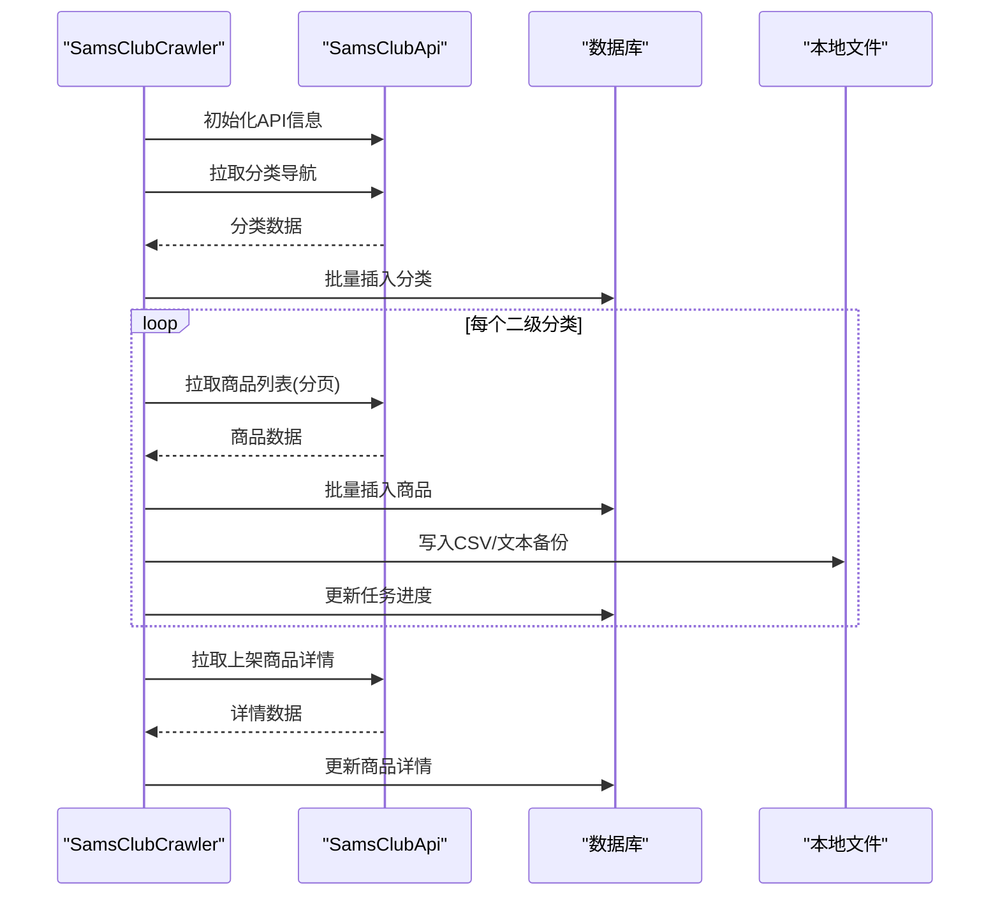
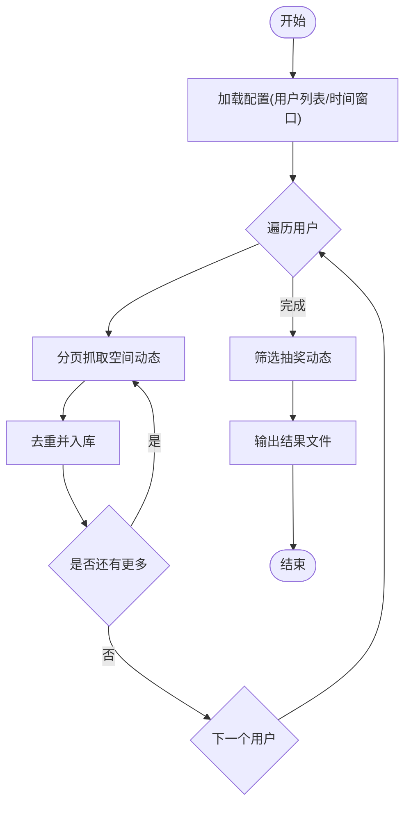
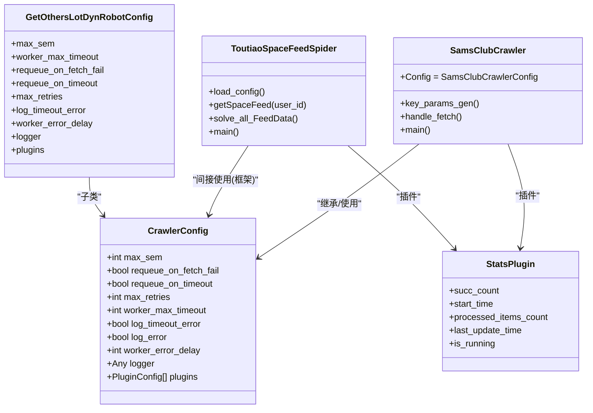

# 数据采集模块

<cite>
**本文引用的文件**
- [be-bilibili-crawler/Service/BaseCrawler/config.py](file://be-bilibili-crawler/Service/BaseCrawler/config.py)
- [be-bilibili-crawler/CONFIG.py](file://be-bilibili-crawler/CONFIG.py)
- [be-bilibili-crawler/Service/samsclub/main.py](file://be-bilibili-crawler/Service/samsclub/main.py)
- [be-bilibili-crawler/Service/samsclub/api/samsclub_api.py](file://be-bilibili-crawler/Service/samsclub/api/samsclub_api.py)
- [be-bilibili-crawler/Service/toutiao/src/spider/SpaceFeed/SpaceFeedScrapy.py](file://be-bilibili-crawler/Service/toutiao/src/spider/SpaceFeed/SpaceFeedScrapy.py)
- [be-bilibili-crawler/controller/common/CommonRouter.py](file://be-bilibili-crawler/controller/common/CommonRouter.py)
- [be-bilibili-crawler/Service/BiliLiveScrape/live_lottery/bili_live_crawler.py](file://be-bilibili-crawler/Service/BiliLiveScrape/live_lottery/bili_live_crawler.py)
- [be-gateway/功能扩展基类/ExtensionBase.js](file://be-gateway/功能扩展基类/ExtensionBase.js)
- [be-gateway/ExpressServerEnd/BiliPPTR/pages/live_anchor_redpack_page/index.js](file://be-gateway/ExpressServerEnd/BiliPPTR/pages/live_anchor_redpack_page/index.js)
- [be-bilibili-crawler/Service/GetOthersLotDyn/fetcher/space_dynamic_fetcher.py](file://be-bilibili-crawler/Service/GetOthersLotDyn/fetcher/space_dynamic_fetcher.py)
</cite>

## 目录
1. [简介](#简介)
2. [项目结构](#项目结构)
3. [核心组件](#核心组件)
4. [架构总览](#架构总览)
5. [详细组件分析](#详细组件分析)
6. [依赖关系分析](#依赖关系分析)
7. [性能考虑](#性能考虑)
8. [故障排查指南](#故障排查指南)
9. [结论](#结论)
10. [附录](#附录)

## 简介
本模块面向多平台数据采集，覆盖以下核心能力：
- B站直播抽奖抓取与监控（含直播间入口、天选时刻等）
- 其他用户动态获取（B站空间动态翻页、去重与异常重试）
- 山姆会员店数据抓取（分类导航、商品列表与详情）
- 头条内容采集（用户空间动态抓取、抽奖信息识别与落库）

文档将逐一解析各采集器的目标网站结构、反爬策略、数据解析逻辑，并给出配置参数、执行频率、错误重试机制、使用示例与性能优化建议，同时提供监控与日志记录方案。

## 项目结构
本项目采用“服务化+插件化”的爬虫架构：
- 通用爬虫框架位于 Service/BaseCrawler，统一提供并发控制、重试、超时、统计插件等能力
- 各业务采集器以独立类实现，通过统一的 CrawlerConfig 管理运行参数
- 外部系统交互（数据库、缓存、消息队列、API）通过专用模块封装
- 前端与网关层负责触发任务、展示结果与浏览器自动化辅助

图表来源
- [be-bilibili-crawler/Service/BaseCrawler/config.py:48-84](file://be-bilibili-crawler/Service/BaseCrawler/config.py#L48-L84)
- [be-bilibili-crawler/Service/BaseCrawler/config.py:177-218](file://be-bilibili-crawler/Service/BaseCrawler/config.py#L177-L218)

章节来源
- [be-bilibili-crawler/Service/BaseCrawler/config.py:48-84](file://be-bilibili-crawler/Service/BaseCrawler/config.py#L48-L84)
- [be-bilibili-crawler/CONFIG.py:225-277](file://be-bilibili-crawler/CONFIG.py#L225-L277)

## 核心组件
- 统一配置中心：集中管理各爬虫的并发、重试、超时、日志与插件
- 统计与推送插件：统一采集运行指标并支持多渠道推送告警
- 各业务采集器：按领域拆分，职责单一，便于维护与扩展
- 外部接口封装：对第三方API、数据库、缓存进行统一封装与复用

章节来源
- [be-bilibili-crawler/Service/BaseCrawler/config.py:48-84](file://be-bilibili-crawler/Service/BaseCrawler/config.py#L48-L84)
- [be-bilibili-crawler/Service/BaseCrawler/config.py:177-218](file://be-bilibili-crawler/Service/BaseCrawler/config.py#L177-L218)

## 架构总览
整体流程：
- 控制器或调度器触发采集任务
- 对应采集器根据配置生成任务参数（如分类ID、用户ID）
- 调用第三方API或浏览器自动化抓取数据
- 解析响应并写入数据库/缓存
- 统计插件上报进度与结果，必要时推送告警

图表来源
- [be-bilibili-crawler/Service/BaseCrawler/config.py:48-84](file://be-bilibili-crawler/Service/BaseCrawler/config.py#L48-L84)
- [be-bilibili-crawler/Service/samsclub/main.py:30-49](file://be-bilibili-crawler/Service/samsclub/main.py#L30-L49)
- [be-bilibili-crawler/Service/toutiao/src/spider/SpaceFeed/SpaceFeedScrapy.py:192-225](file://be-bilibili-crawler/Service/toutiao/src/spider/SpaceFeed/SpaceFeedScrapy.py#L192-L225)

## 详细组件分析

### B站直播抽奖抓取
- 目标与范围
  - 监控B站直播分区与房间，参与“天选时刻”等抽奖活动
  - 通过浏览器自动化（Puppeteer/Playwright）模拟登录与操作
- 关键实现
  - 直播区列表同步：定时拉取直播分区列表，减少无效请求
  - 浏览器初始化：新建页面并加载直播首页，获取用户信息
  - 风控处理：当贡献值为0时标记风险并暂停一段时间
- 反爬策略
  - 使用浏览器会话保持登录态
  - 随机延迟与限流，避免高频触发风控
  - 代理与UA轮换（由上层配置与工具链提供）
- 数据解析与存储
  - 从直播间接口提取在线人数、贡献值、排名等信息
  - 结果写入数据库或缓存，供后续查询与展示
- 配置与执行
  - 并发数、超时、重试策略由 CrawlerConfig 统一管理
  - 执行频率：按任务调度或手动触发；分区列表每日同步一次
- 监控与日志
  - 统计插件上报运行指标
  - 日志记录风控事件与异常

图表来源
- [be-gateway/功能扩展基类/ExtensionBase.js:77-108](file://be-gateway/功能扩展基类/ExtensionBase.js#L77-L108)
- [be-gateway/ExpressServerEnd/BiliPPTR/pages/live_anchor_redpack_page/index.js:693-711](file://be-gateway/ExpressServerEnd/BiliPPTR/pages/live_anchor_redpack_page/index.js#L693-L711)
- [be-bilibili-crawler/Service/BiliLiveScrape/live_lottery/bili_live_crawler.py:10-36](file://be-bilibili-crawler/Service/BiliLiveScrape/live_lottery/bili_live_crawler.py#L10-L36)

章节来源
- [be-bilibili-crawler/Service/BiliLiveScrape/live_lottery/bili_live_crawler.py:10-36](file://be-bilibili-crawler/Service/BiliLiveScrape/live_lottery/bili_live_crawler.py#L10-L36)
- [be-gateway/功能扩展基类/ExtensionBase.js:77-108](file://be-gateway/功能扩展基类/ExtensionBase.js#L77-L108)
- [be-gateway/ExpressServerEnd/BiliPPTR/pages/live_anchor_redpack_page/index.js:693-711](file://be-gateway/ExpressServerEnd/BiliPPTR/pages/live_anchor_redpack_page/index.js#L693-L711)

### 其他用户动态获取（B站空间动态）
- 目标与范围
  - 抓取指定用户的空间动态，识别抽奖相关内容
  - 支持分页抓取、去重、异常重试与停止条件判断
- 关键实现
  - 分页循环：基于 offset 或时间戳翻页
  - 异常处理：针对特定错误码（如账号被封禁、隐私设置）进行等待或终止
  - 去重与入库：已存在的动态ID跳过，新增动态写入数据库
- 反爬策略
  - 控制请求频率，遇到风控时延时重试
  - 使用合适的UA与代理（由上层工具链提供）
- 配置与执行
  - 并发数、重试次数、超时策略由 CrawlerConfig 管理
  - 执行频率：可按任务调度周期性执行
- 监控与日志
  - 统计插件上报进度与结果
  - 日志记录异常与重试情况

图表来源
- [be-bilibili-crawler/Service/GetOthersLotDyn/fetcher/space_dynamic_fetcher.py:193-213](file://be-bilibili-crawler/Service/GetOthersLotDyn/fetcher/space_dynamic_fetcher.py#L193-L213)

章节来源
- [be-bilibili-crawler/Service/GetOthersLotDyn/fetcher/space_dynamic_fetcher.py:193-213](file://be-bilibili-crawler/Service/GetOthersLotDyn/fetcher/space_dynamic_fetcher.py#L193-L213)

### 山姆会员店数据抓取
- 目标与范围
  - 抓取山姆会员店分类导航与商品列表/详情
  - 支持断点续抓与进度跟踪
- 关键实现
  - 分类导航：拉取一级、二级、三级分类并持久化
  - 商品列表：按二级分类分页抓取，写入数据库与本地文件备份
  - 商品详情：对上架商品单独抓取详情并更新
- 反爬策略
  - 控制并发与请求间隔，避免触发风控
  - 版本头与签名（由API封装处理）
- 配置与执行
  - 并发数为1，确保稳定性
  - 执行频率：按任务调度或手动触发
- 监控与日志
  - 统计插件上报进度
  - 日志记录异常与数据量

图表来源
- [be-bilibili-crawler/Service/samsclub/main.py:30-175](file://be-bilibili-crawler/Service/samsclub/main.py#L30-L175)
- [be-bilibili-crawler/Service/samsclub/api/samsclub_api.py:968-1029](file://be-bilibili-crawler/Service/samsclub/api/samsclub_api.py#L968-L1029)

章节来源
- [be-bilibili-crawler/Service/samsclub/main.py:30-175](file://be-bilibili-crawler/Service/samsclub/main.py#L30-L175)
- [be-bilibili-crawler/Service/samsclub/api/samsclub_api.py:968-1029](file://be-bilibili-crawler/Service/samsclub/api/samsclub_api.py#L968-L1029)

### 头条内容采集
- 目标与范围
  - 抓取指定头条用户空间动态，识别抽奖相关内容
  - 支持增量抓取、去重与结果输出
- 关键实现
  - 用户列表与时间窗口：从配置文件加载用户ID列表与最大时间间隔
  - 分页抓取：基于 max_behot_time 翻页，直到无更多或达到时间阈值
  - 去重与入库：已存在ID跳过，新增动态压缩后入库
  - 抽奖识别：根据类型与内容规则筛选抽奖动态
- 反爬策略
  - 控制请求频率，避免触发风控
  - 使用合适UA与代理（由上层工具链提供）
- 配置与执行
  - 并发数：按用户并行抓取
  - 执行频率：按任务调度或手动触发
- 监控与日志
  - 日志记录抓取过程与结果统计
  - 结果输出到文件，便于后续分析

图表来源
- [be-bilibili-crawler/Service/toutiao/src/spider/SpaceFeed/SpaceFeedScrapy.py:95-148](file://be-bilibili-crawler/Service/toutiao/src/spider/SpaceFeed/SpaceFeedScrapy.py#L95-L148)
- [be-bilibili-crawler/Service/toutiao/src/spider/SpaceFeed/SpaceFeedScrapy.py:192-225](file://be-bilibili-crawler/Service/toutiao/src/spider/SpaceFeed/SpaceFeedScrapy.py#L192-L225)
- [be-bilibili-crawler/Service/toutiao/src/spider/SpaceFeed/SpaceFeedScrapy.py:251-306](file://be-bilibili-crawler/Service/toutiao/src/spider/SpaceFeed/SpaceFeedScrapy.py#L251-L306)

章节来源
- [be-bilibili-crawler/Service/toutiao/src/spider/SpaceFeed/SpaceFeedScrapy.py:95-148](file://be-bilibili-crawler/Service/toutiao/src/spider/SpaceFeed/SpaceFeedScrapy.py#L95-L148)
- [be-bilibili-crawler/Service/toutiao/src/spider/SpaceFeed/SpaceFeedScrapy.py:192-225](file://be-bilibili-crawler/Service/toutiao/src/spider/SpaceFeed/SpaceFeedScrapy.py#L192-L225)
- [be-bilibili-crawler/Service/toutiao/src/spider/SpaceFeed/SpaceFeedScrapy.py:251-306](file://be-bilibili-crawler/Service/toutiao/src/spider/SpaceFeed/SpaceFeedScrapy.py#L251-L306)

## 依赖关系分析
- 配置依赖
  - 各爬虫通过 CrawlerConfig 子类声明运行参数，集中管理并发、重试、超时、日志与插件
  - Settings 提供全局部署配置（数据库、缓存、消息队列、LLM等）
- 运行时依赖
  - 统计插件自动绑定到爬虫实例，用于进度与结果上报
  - 数据库与缓存通过专用连接池与工具类访问
  - 第三方API通过各自封装模块调用

图表来源
- [be-bilibili-crawler/Service/BaseCrawler/config.py:48-84](file://be-bilibili-crawler/Service/BaseCrawler/config.py#L48-L84)
- [be-bilibili-crawler/Service/BaseCrawler/config.py:177-218](file://be-bilibili-crawler/Service/BaseCrawler/config.py#L177-L218)
- [be-bilibili-crawler/Service/samsclub/main.py:30-49](file://be-bilibili-crawler/Service/samsclub/main.py#L30-L49)
- [be-bilibili-crawler/Service/toutiao/src/spider/SpaceFeed/SpaceFeedScrapy.py:82-93](file://be-bilibili-crawler/Service/toutiao/src/spider/SpaceFeed/SpaceFeedScrapy.py#L82-L93)

章节来源
- [be-bilibili-crawler/Service/BaseCrawler/config.py:48-84](file://be-bilibili-crawler/Service/BaseCrawler/config.py#L48-L84)
- [be-bilibili-crawler/Service/BaseCrawler/config.py:177-218](file://be-bilibili-crawler/Service/BaseCrawler/config.py#L177-L218)

## 性能考虑
- 并发控制
  - 合理设置 max_sem，避免过载与资源争用
  - 对I/O密集型任务（网络请求、数据库写入）可适当提高并发
- 重试与超时
  - 针对不稳定接口启用 requeue_on_timeout，提升鲁棒性
  - 限制 max_retries，防止无限重试导致积压
- 延迟与限流
  - 使用 SleepTimeGenerator 控制请求间隔，降低风控风险
  - 对高频接口实施分级延迟（短/中/长）
- 缓存与去重
  - 利用Redis缓存热点数据，减少重复请求
  - 对动态ID进行去重，避免重复入库
- 连接池优化
  - 数据库连接池大小与回收周期需匹配负载与超时设置
  - 爬虫专用连接池与业务池隔离，避免相互影响

[本节为通用指导，不直接分析具体文件]

## 故障排查指南
- 常见错误与处理
  - B站空间动态异常码：4101128（账号受限/隐私设置）→ 等待后重试；4101129（请求被拒绝）→ 停止获取
  - 直播贡献值为0 → 标记风险并暂停一段时间，避免继续触发风控
  - 山姆API返回空数据 → 记录日志并检查分类参数与分页状态
- 日志与监控
  - 统计插件上报进度与结果，便于定位瓶颈
  - 日志记录异常堆栈与上下文，便于快速定位问题
- 调试建议
  - 降低并发与频率，逐步排查问题
  - 开启详细日志，观察请求与响应细节
  - 使用本地测试数据验证解析逻辑

章节来源
- [be-bilibili-crawler/Service/GetOthersLotDyn/fetcher/space_dynamic_fetcher.py:193-213](file://be-bilibili-crawler/Service/GetOthersLotDyn/fetcher/space_dynamic_fetcher.py#L193-L213)
- [be-gateway/ExpressServerEnd/BiliPPTR/pages/live_anchor_redpack_page/index.js:693-711](file://be-gateway/ExpressServerEnd/BiliPPTR/pages/live_anchor_redpack_page/index.js#L693-L711)
- [be-bilibili-crawler/Service/samsclub/main.py:135-154](file://be-bilibili-crawler/Service/samsclub/main.py#L135-L154)

## 结论
本数据采集模块通过统一配置与插件化架构，实现了多平台、多任务的稳定采集。各采集器职责清晰、反爬策略完善、错误处理健全，配合监控与日志体系，能够有效支撑业务需求。建议在后续迭代中持续优化并发与重试策略，加强监控告警与性能调优。

[本节为总结，不直接分析具体文件]

## 附录
- 使用示例
  - 山姆分类抓取：调用 main() 启动，自动拉取分类与商品列表
  - 头条用户动态：通过控制器接口触发，抓取并输出结果
  - B站直播监控：通过网关初始化浏览器页面，进入抽奖流程
- 配置参考
  - 并发数、重试、超时、日志级别在 CrawlerConfig 中配置
  - 全局部署配置在 Settings 中管理（数据库、缓存、消息队列等）

章节来源
- [be-bilibili-crawler/Service/samsclub/main.py:162-175](file://be-bilibili-crawler/Service/samsclub/main.py#L162-L175)
- [be-bilibili-crawler/controller/common/CommonRouter.py:165-172](file://be-bilibili-crawler/controller/common/CommonRouter.py#L165-L172)
- [be-bilibili-crawler/Service/BaseCrawler/config.py:48-84](file://be-bilibili-crawler/Service/BaseCrawler/config.py#L48-L84)
- [be-bilibili-crawler/CONFIG.py:225-277](file://be-bilibili-crawler/CONFIG.py#L225-L277)