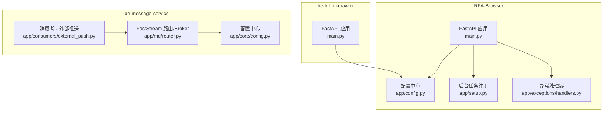
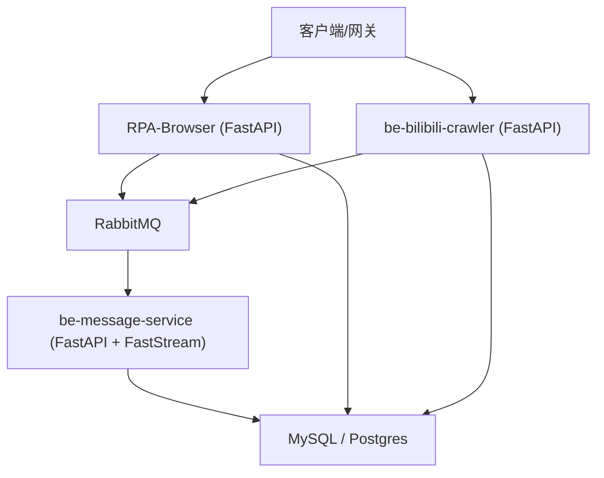
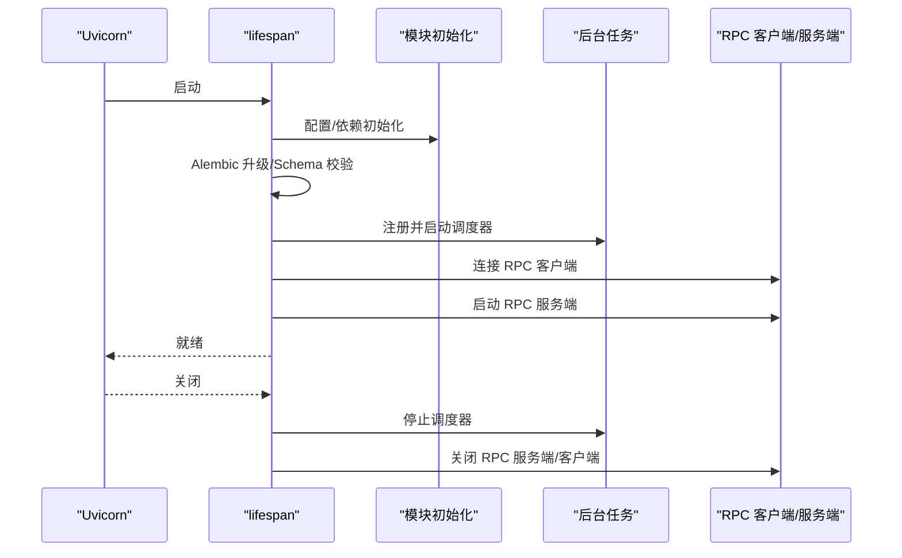
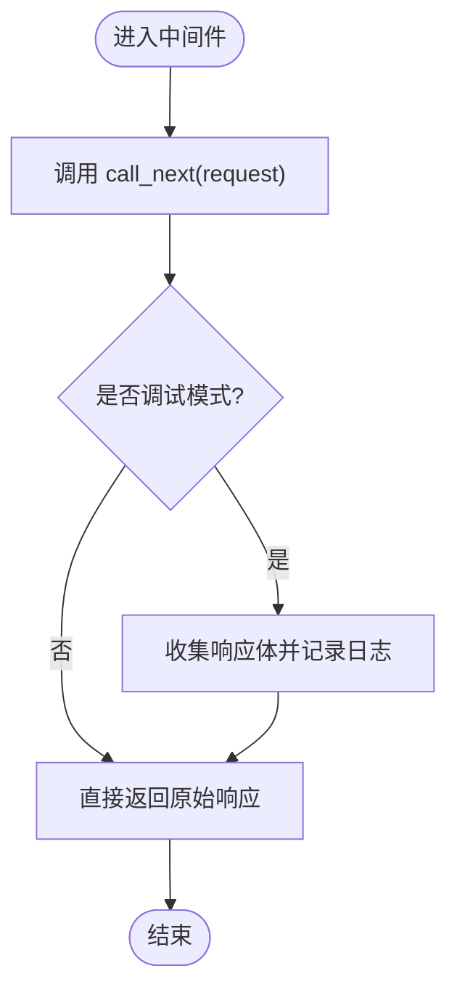
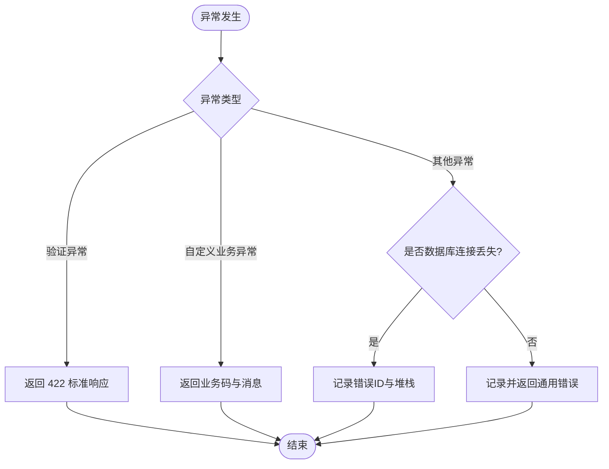
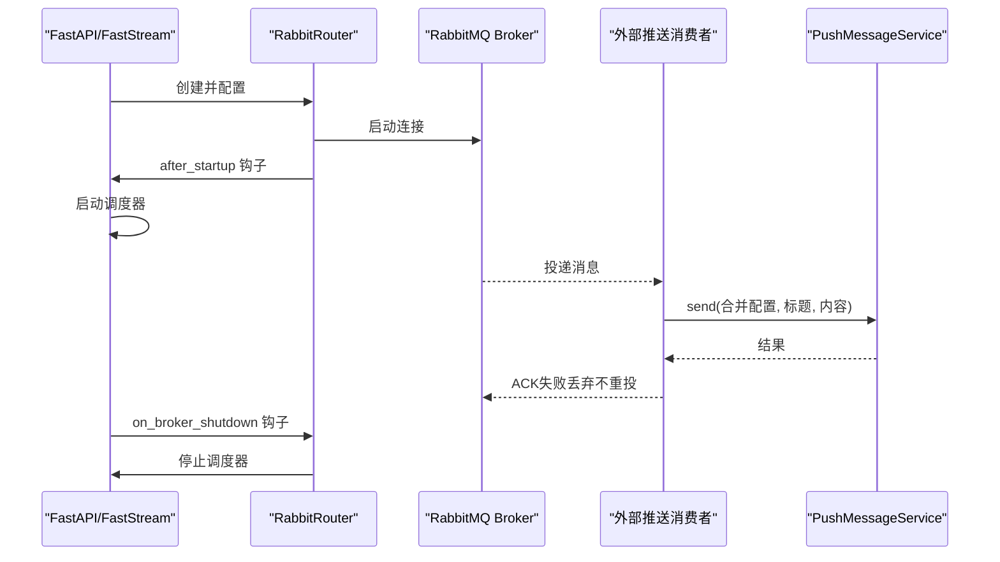
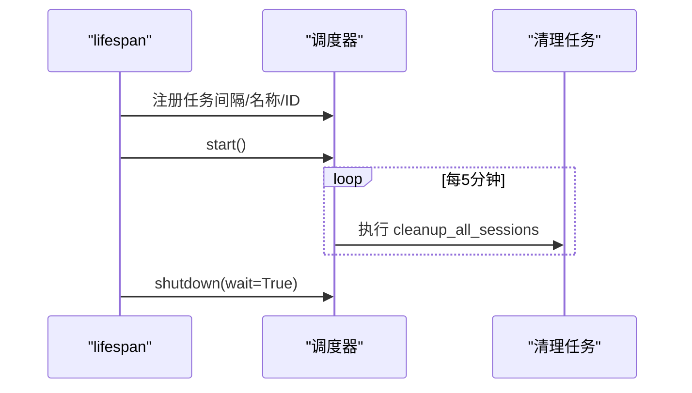
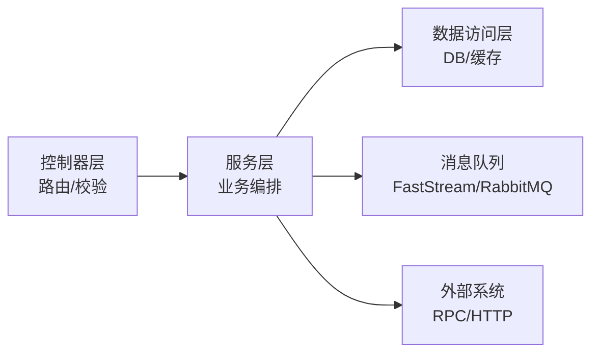
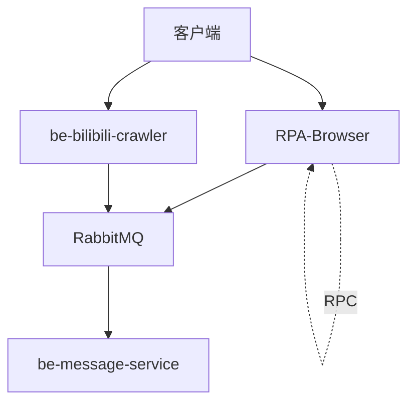
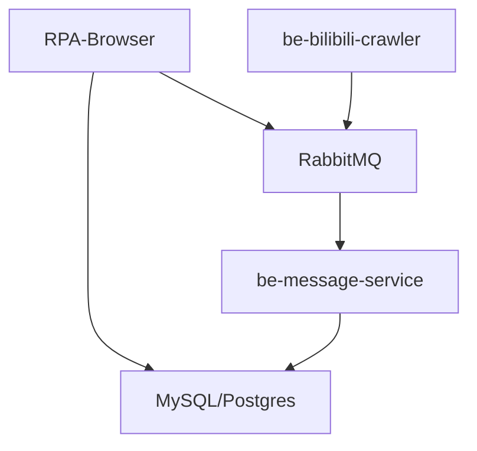

# 服务架构设计

<cite>
**本文引用的文件**
- [RPA-Browser/main.py](file://RPA-Browser/main.py)
- [RPA-Browser/app/config.py](file://RPA-Browser/app/config.py)
- [RPA-Browser/app/setup.py](file://RPA-Browser/app/setup.py)
- [be-bilibili-crawler/main.py](file://be-bilibili-crawler/main.py)
- [be-message-service/app/core/config.py](file://be-message-service/app/core/config.py)
- [be-message-service/app/mq/router.py](file://be-message-service/app/mq/router.py)
- [be-message-service/app/consumers/external_push.py](file://be-message-service/app/consumers/external_push.py)
- [RPA-Browser/app/exceptions/handlers.py](file://RPA-Browser/app/exceptions/handlers.py)
</cite>

## 目录
1. [简介](#简介)
2. [项目结构](#项目结构)
3. [核心组件](#核心组件)
4. [架构总览](#架构总览)
5. [详细组件分析](#详细组件分析)
6. [依赖关系分析](#依赖关系分析)
7. [性能考量](#性能考量)
8. [故障排查指南](#故障排查指南)
9. [结论](#结论)
10. [附录：配置与环境变量](#附录：配置与环境变量)

## 简介
本文件面向爬虫与消息服务的后端架构，聚焦以下目标：
- 解析 FastAPI 应用启动流程、中间件与异常处理机制
- 说明控制器层、服务层、数据访问层的职责划分
- 解释基于 FastStream（RabbitMQ）的消息队列集成与使用模式
- 文档化异步任务处理与后台任务调度
- 提供关键配置选项与环境变量管理说明
- 给出服务间通信协议与依赖关系图

## 项目结构
仓库包含多个子系统，与本主题相关的核心服务包括：
- RPA-Browser：浏览器自动化与执行引擎的 FastAPI 服务
- be-bilibili-crawler：B站相关爬虫 API 服务
- be-message-service：消息推送与通知服务（FastStream + RabbitMQ）
- bili-common：共享模型与工具库

图表来源
- [RPA-Browser/main.py:36-74](file://RPA-Browser/main.py#L36-L74)
- [RPA-Browser/app/config.py:140-216](file://RPA-Browser/app/config.py#L140-L216)
- [RPA-Browser/app/setup.py:8-46](file://RPA-Browser/app/setup.py#L8-L46)
- [be-bilibili-crawler/main.py:48-60](file://be-bilibili-crawler/main.py#L48-L60)
- [be-message-service/app/mq/router.py:22-56](file://be-message-service/app/mq/router.py#L22-L56)
- [be-message-service/app/consumers/external_push.py:1-34](file://be-message-service/app/consumers/external_push.py#L1-L34)
- [be-message-service/app/core/config.py:5-37](file://be-message-service/app/core/config.py#L5-L37)

章节来源
- [RPA-Browser/main.py:36-74](file://RPA-Browser/main.py#L36-L74)
- [be-bilibili-crawler/main.py:48-60](file://be-bilibili-crawler/main.py#L48-L60)
- [be-message-service/app/mq/router.py:22-56](file://be-message-service/app/mq/router.py#L22-L56)

## 核心组件
- FastAPI 应用实例与生命周期管理
  - RPA-Browser：通过 lifespan 完成数据库迁移、依赖初始化、RPC 客户端连接、RPC 服务端启动、后台任务启动与关闭。
  - be-bilibili-crawler：通过 lifespan 统一接入缓存、路由注册、全局中间件与异常处理器。
- 配置中心
  - RPA-Browser：集中式 Settings，支持 .env 多环境加载、RabbitMQ RPC 地址、浏览器会话策略、Alembic 迁移开关等。
  - be-message-service：Settings 覆盖 RabbitMQ、日志级别、HTTP 健康检查端口、MySQL/Postgres 连接池、Alembic、ID 生成器、EdgeRank、私信/评论策略、JWT/Casdoor、推送渠道等。
- 消息队列（FastStream + RabbitMQ）
  - be-message-service：RabbitRouter 创建并管理 broker；after_startup/on_broker_shutdown 钩子用于调度器启停；消费者按 routing_key 消费并调用服务层。
- 后台任务与调度
  - RPA-Browser：统一注册清理类任务（如会话清理），通过调度器周期性执行，并在应用生命周期中启停。
- 异常处理与中间件
  - be-bilibili-crawler：全局 HTTP 中间件记录请求耗时与响应体（调试模式），全局异常处理器统一捕获并推送告警。
  - RPA-Browser：针对验证异常、自定义业务异常、未捕获异常（含数据库连接丢失）进行标准化响应与告警。

章节来源
- [RPA-Browser/main.py:36-74](file://RPA-Browser/main.py#L36-L74)
- [RPA-Browser/app/config.py:140-216](file://RPA-Browser/app/config.py#L140-L216)
- [be-message-service/app/core/config.py:5-37](file://be-message-service/app/core/config.py#L5-L37)
- [be-message-service/app/mq/router.py:22-56](file://be-message-service/app/mq/router.py#L22-L56)
- [RPA-Browser/app/setup.py:8-46](file://RPA-Browser/app/setup.py#L8-L46)
- [be-bilibili-crawler/main.py:63-112](file://be-bilibili-crawler/main.py#L63-L112)
- [RPA-Browser/app/exceptions/handlers.py:38-81](file://RPA-Browser/app/exceptions/handlers.py#L38-L81)

## 架构总览
下图展示三个服务的协作关系：RPA-Browser 暴露浏览器自动化 API，be-bilibili-crawler 提供爬虫数据接口，be-message-service 负责消息推送与通知。三者通过 RabbitMQ（FastStream）进行异步解耦，并通过共享配置与模型保持一致性。

图表来源
- [RPA-Browser/main.py:36-74](file://RPA-Browser/main.py#L36-L74)
- [be-bilibili-crawler/main.py:48-60](file://be-bilibili-crawler/main.py#L48-L60)
- [be-message-service/app/mq/router.py:22-56](file://be-message-service/app/mq/router.py#L22-L56)
- [be-message-service/app/core/config.py:41-79](file://be-message-service/app/core/config.py#L41-L79)

## 详细组件分析

### FastAPI 应用启动流程（RPA-Browser）
- 生命周期（lifespan）
  - Windows 事件循环适配
  - Alembic 自动升级与 Schema 一致性校验
  - 依赖初始化（init_dependencies）
  - 启动后台任务（scheduler）
  - 连接 RabbitMQ RPC 客户端
  - 启动 RPA 资源 RPC 服务端
  - 优雅关闭：停止后台任务、RPC 服务端、关闭 RPC 客户端
- 应用创建
  - 标题、CDN 文档补丁、路由注册

图表来源
- [RPA-Browser/main.py:36-74](file://RPA-Browser/main.py#L36-L74)

章节来源
- [RPA-Browser/main.py:36-74](file://RPA-Browser/main.py#L36-L74)

### 中间件与异常处理（be-bilibili-crawler）
- 全局 HTTP 中间件
  - 记录请求 IP、方法、路径、状态码、耗时与响应体（调试模式）
- 全局异常处理器
  - 捕获所有未处理异常，记录错误详情并推送告警，返回统一错误响应

图表来源
- [be-bilibili-crawler/main.py:63-91](file://be-bilibili-crawler/main.py#L63-L91)

章节来源
- [be-bilibili-crawler/main.py:63-112](file://be-bilibili-crawler/main.py#L63-L112)

### 异常处理（RPA-Browser）
- 验证异常：参数校验失败时返回标准响应
- 自定义业务异常：按业务码与消息返回
- 全局异常：特别优化数据库连接丢失场景，生成错误 ID 并记录

图表来源
- [RPA-Browser/app/exceptions/handlers.py:38-81](file://RPA-Browser/app/exceptions/handlers.py#L38-L81)

章节来源
- [RPA-Browser/app/exceptions/handlers.py:38-81](file://RPA-Browser/app/exceptions/handlers.py#L38-L81)

### 消息队列集成（FastStream + RabbitMQ）
- Broker 与路由
  - 通过 RabbitRouter 创建并管理 broker，设置日志级别
  - after_startup 钩子在 broker 启动后启动调度器
  - on_broker_shutdown 在 broker 关闭前停止调度器
- 消费者
  - 外部推送消费者：接收 PushMessagePayload，合并配置，调用服务层发送；失败不重投，避免死信风暴

图表来源
- [be-message-service/app/mq/router.py:22-56](file://be-message-service/app/mq/router.py#L22-L56)
- [be-message-service/app/consumers/external_push.py:1-34](file://be-message-service/app/consumers/external_push.py#L1-L34)

章节来源
- [be-message-service/app/mq/router.py:22-56](file://be-message-service/app/mq/router.py#L22-L56)
- [be-message-service/app/consumers/external_push.py:1-34](file://be-message-service/app/consumers/external_push.py#L1-L34)

### 异步任务与后台调度
- RPA-Browser 后台任务
  - 统一注册清理任务（每 5 分钟），在 lifespan 中启动/停止调度器
- be-message-service 定时任务
  - 通过 FastStream 钩子在 broker 启动后启动调度器，确保消息通道就绪后再投递

图表来源
- [RPA-Browser/app/setup.py:8-46](file://RPA-Browser/app/setup.py#L8-L46)

章节来源
- [RPA-Browser/app/setup.py:8-46](file://RPA-Browser/app/setup.py#L8-L46)

### 服务分层架构（控制器/服务/数据访问）
- 控制器层（Controller/Router）
  - 负责路由定义、参数校验、调用服务层、返回统一响应
  - 示例：RPA-Browser 的 admin/browser 路由、be-bilibili-crawler 的 v1 路由
- 服务层（Service）
  - 封装业务逻辑，协调数据访问与外部系统（如 RPC、消息队列）
  - 示例：RPA-Browser 的 RPA_browser 服务、be-message-service 的 PushMessageService
- 数据访问层（DAO/Repository）
  - 封装数据库操作（SQLAlchemy/Redis），提供原子化查询与写入
  - 示例：be-bilibili-crawler 的 dao 模块

[此图为概念性分层示意，不直接映射具体文件]

### 服务间通信协议与依赖关系
- 同步 HTTP：客户端到各 FastAPI 服务
- 异步消息：RabbitMQ（FastStream）作为解耦通道，按 routing_key 区分业务域
- RPC：RPA-Browser 通过 RabbitMQ RPC 客户端调用内部方法，供定时任务或跨进程调用

图表来源
- [RPA-Browser/main.py:53-57](file://RPA-Browser/main.py#L53-L57)
- [be-message-service/app/mq/router.py:22-56](file://be-message-service/app/mq/router.py#L22-L56)

## 依赖关系分析
- 组件耦合
  - RPA-Browser 与 be-message-service 通过 RabbitMQ 松耦合；消息模型由共享配置与 Pydantic 模型约束
  - be-bilibili-crawler 与 be-message-service 同样通过消息队列交互
- 外部依赖
  - RabbitMQ：消息总线
  - MySQL/Postgres：持久化存储
  - Alembic：数据库迁移
- 潜在循环依赖
  - 通过消息队列与 RPC 解耦，避免直接服务间强耦合

图表来源
- [RPA-Browser/main.py:53-57](file://RPA-Browser/main.py#L53-L57)
- [be-message-service/app/core/config.py:41-79](file://be-message-service/app/core/config.py#L41-L79)

章节来源
- [RPA-Browser/main.py:53-57](file://RPA-Browser/main.py#L53-L57)
- [be-message-service/app/core/config.py:41-79](file://be-message-service/app/core/config.py#L41-L79)

## 性能考量
- 事件循环与并发
  - be-bilibili-crawler 启用 uvloop 提升异步性能；Windows 下使用 Proactor 事件循环
- 连接池与超时
  - message-service 对 MySQL/Postgres 设置合理的 pool_size、max_overflow、recycle，防止连接耗尽
  - RabbitMQ heartbeat 设置为 180，避免长耗时处理导致连接断开
- 日志级别与压测
  - message-service 生产默认 WARNING，开发可设为 DEBUG；FastStream 框架日志级别独立控制
- 缓存
  - be-bilibili-crawler 使用 InMemoryBackend 做轻量缓存，注意多实例下的不一致问题

[本节为通用指导，不直接分析具体文件]

## 故障排查指南
- 数据库连接丢失
  - RPA-Browser 的全局异常处理器识别 DisconnectionError/OperationalError，生成错误 ID 并记录，便于追踪
- 消息推送失败
  - message-service 的消费者捕获异常后记录错误并丢弃消息，避免 NACK 重投造成死信风暴
- 启动失败
  - RPA-Browser 的 lifespan 在 Alembic 升级失败或 Schema 不一致时抛出 RuntimeError，需检查数据库连接与迁移脚本
- 请求异常
  - be-bilibili-crawler 的全局异常处理器会记录请求 URL、方法与堆栈，并推送告警

章节来源
- [RPA-Browser/app/exceptions/handlers.py:38-81](file://RPA-Browser/app/exceptions/handlers.py#L38-L81)
- [be-message-service/app/consumers/external_push.py:16-34](file://be-message-service/app/consumers/external_push.py#L16-L34)
- [RPA-Browser/main.py:41-46](file://RPA-Browser/main.py#L41-L46)
- [be-bilibili-crawler/main.py:94-112](file://be-bilibili-crawler/main.py#L94-L112)

## 结论
本架构以 FastAPI 为核心，结合 FastStream 与 RabbitMQ 实现异步解耦，配合统一的配置中心与异常处理机制，形成高内聚、低耦合的服务体系。RPA-Browser 负责浏览器自动化与执行，be-bilibili-crawler 提供爬虫数据能力，be-message-service 承担消息推送与通知。通过生命周期管理、后台调度与严格的配置管理，系统在可扩展性与稳定性方面具备良好基础。

## 附录：配置与环境变量
- RPA-Browser 配置要点
  - 环境变量文件：优先读取 ../.env.prod，其次 ../.env.dev
  - 关键字段：rabbitmq_url、controller_base_path、browser_session_*、alembic_auto_migrate、message_config（JSON）
- be-message-service 配置要点
  - 环境变量文件：app/.env
  - 关键字段：rabbitmq_url、faststream_log_level、log_level、app_env、mysql_message_url、postgres_pptr_url、alembic_auto_migrate、msgkey/uid/moment_id/topic_id 生成器、edgerank_*、dm/comment/report 策略、jwt/casdoor、pushme/pushplus、message_config（JSON）
- 共享推送渠道配置
  - 通过 MESSAGE_CONFIG 或各自 settings.message_config 注入，字段与 PushChannelConfig 一致，支持多渠道兜底

章节来源
- [RPA-Browser/app/config.py:140-216](file://RPA-Browser/app/config.py#L140-L216)
- [be-message-service/app/core/config.py:5-37](file://be-message-service/app/core/config.py#L5-L37)
- [be-message-service/app/core/config.py:19-37](file://be-message-service/app/core/config.py#L19-L37)
- [be-message-service/app/core/config.py:41-79](file://be-message-service/app/core/config.py#L41-L79)
- [be-message-service/app/core/config.py:81-115](file://be-message-service/app/core/config.py#L81-L115)
- [be-message-service/app/core/config.py:117-131](file://be-message-service/app/core/config.py#L117-L131)
- [be-message-service/app/core/config.py:133-231](file://be-message-service/app/core/config.py#L133-L231)
- [be-message-service/app/core/config.py:232-271](file://be-message-service/app/core/config.py#L232-L271)
- [be-message-service/app/core/config.py:273-336](file://be-message-service/app/core/config.py#L273-L336)
- [be-message-service/app/core/config.py:338-375](file://be-message-service/app/core/config.py#L338-L375)