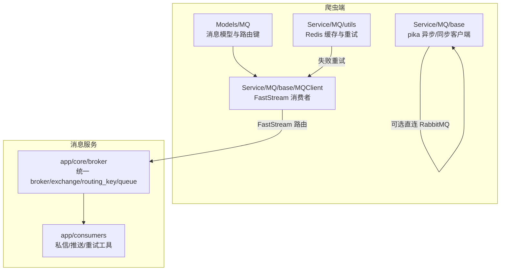
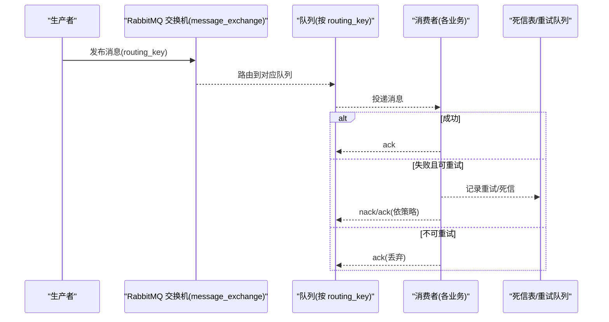
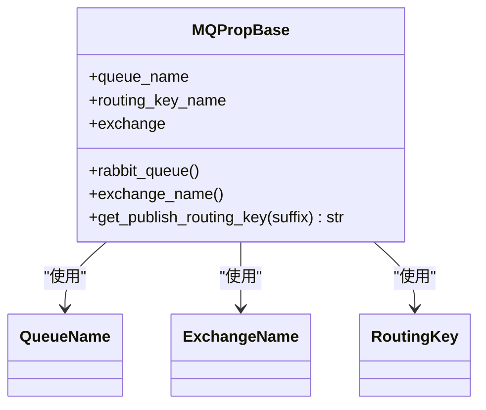
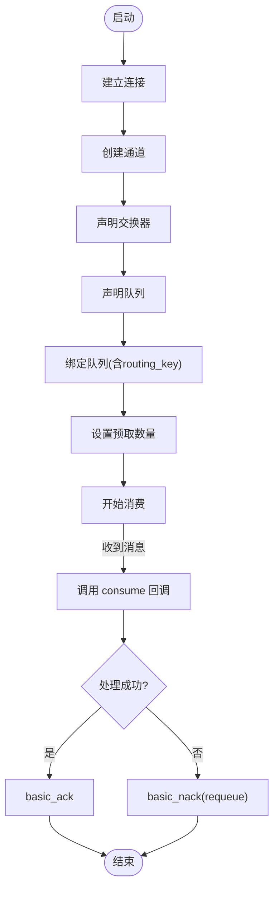
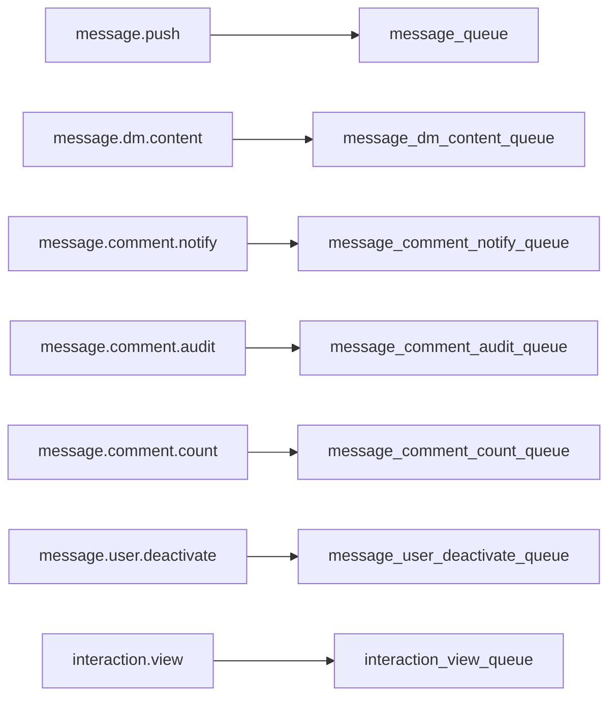
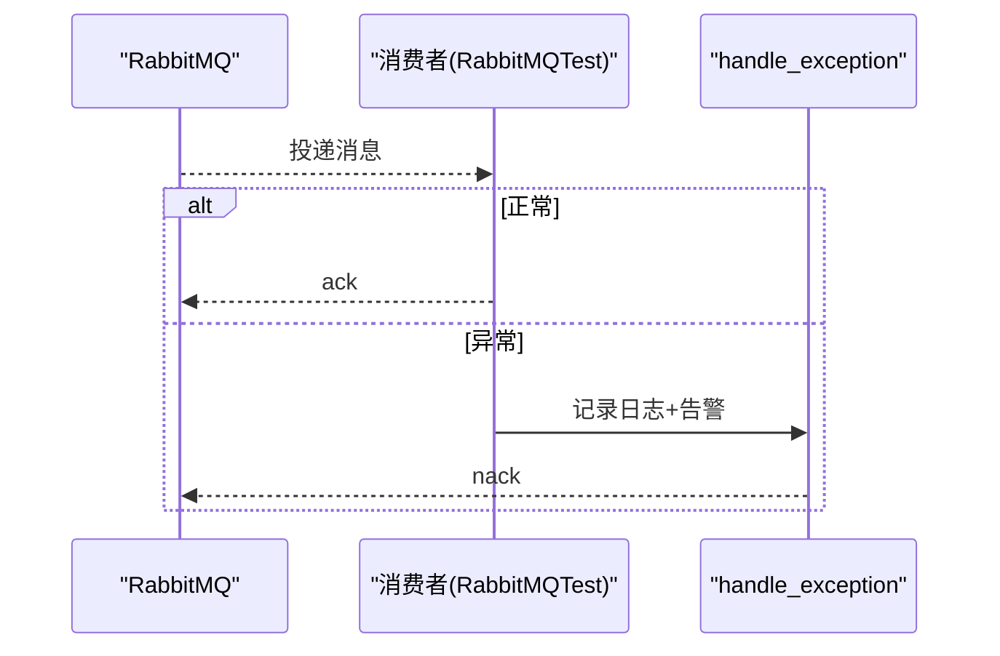
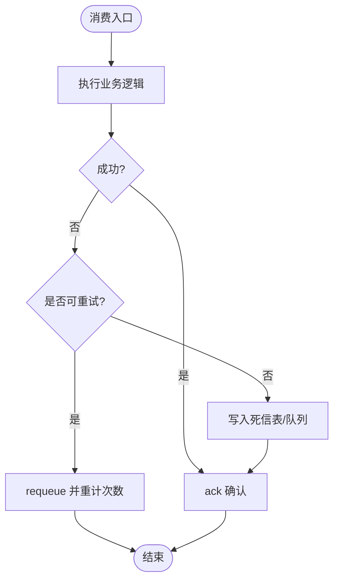
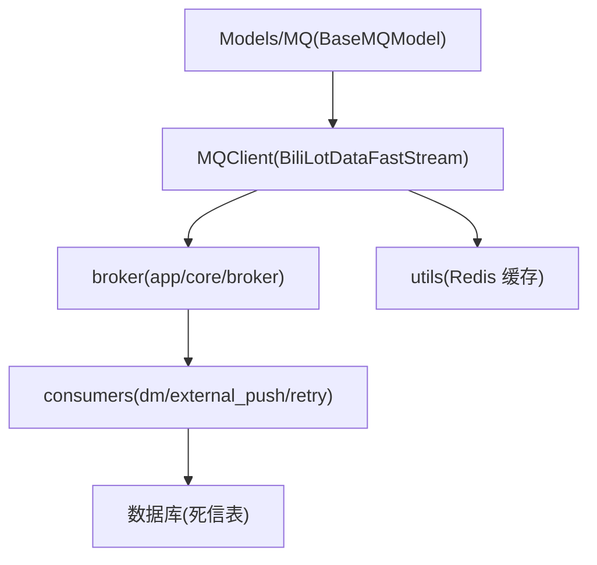

# 消息队列集成

<cite>
**本文引用的文件**
- [BaseMQModel.py](file://be-bilibili-crawler/Models/MQ/BaseMQModel.py)
- [MQRouterModels.py](file://be-bilibili-crawler/Models/MQ/MQRouterModels.py)
- [BasicAsyncClient.py](file://be-bilibili-crawler/Service/MQ/base/BasicAsyncClient.py)
- [BasicMQ.py](file://be-bilibili-crawler/Service/MQ/base/BasicMQ.py)
- [BiliLotDataFastStream.py](file://be-bilibili-crawler/Service/MQ/base/MQClient/BiliLotDataFastStream.py)
- [RabbitmqPubCacheRedis.py](file://be-bilibili-crawler/Service/MQ/utils/RabbitmqPubCacheRedis.py)
- [broker.py](file://be-message-service/app/core/broker.py)
- [dm.py](file://be-message-service/app/consumers/dm.py)
- [external_push.py](file://be-message-service/app/consumers/external_push.py)
- [retry.py](file://be-message-service/app/consumers/retry.py)
- [test_mq.py](file://be-bilibili-crawler/test/test_mq.py)
</cite>

## 目录
1. [简介](#简介)
2. [项目结构](#项目结构)
3. [核心组件](#核心组件)
4. [架构总览](#架构总览)
5. [详细组件分析](#详细组件分析)
6. [依赖关系分析](#依赖关系分析)
7. [性能与可靠性](#性能与可靠性)
8. [故障排查指南](#故障排查指南)
9. [结论](#结论)
10. [附录：生产与消费示例路径](#附录生产与消费示例路径)

## 简介
本文件面向消息队列（RabbitMQ）在系统中的集成使用，覆盖连接管理、消息发布与消费、消息模型定义、路由机制、持久化、重试与死信处理，并提供监控与故障排查建议。系统包含两套实现：
- be-bilibili-crawler：基于 pika 的异步客户端与 FastStream 消费者，提供通用基础类、消息模型与路由配置、测试与缓存重发能力。
- be-message-service：基于 FastStream 的消息服务，统一 broker/exchange/queue 定义，按 routing_key 分流到独立队列，承载站内信、私信落库、评论异步任务、用户注销、浏览统计等场景。

## 项目结构
围绕消息队列的关键目录与职责：
- be-bilibili-crawler/Models/MQ：消息模型与路由键枚举、消息属性基类。
- be-bilibili-crawler/Service/MQ/base：pika 异步收发基础实现、同步基础实现、FastStream 消费者基类与具体消费者。
- be-bilibili-crawler/Service/MQ/utils：发布前 Redis 缓存与失败重试。
- be-message-service/app/core/broker：统一的 broker、exchange、routing key 与 queue 定义。
- be-message-service/app/consumers：各业务消费者（私信、外部推送、重试计数工具）。

图表来源
- [BaseMQModel.py:1-74](file://be-bilibili-crawler/Models/MQ/BaseMQModel.py#L1-L74)
- [BasicAsyncClient.py:70-200](file://be-bilibili-crawler/Service/MQ/base/BasicAsyncClient.py#L70-L200)
- [BiliLotDataFastStream.py:66-332](file://be-bilibili-crawler/Service/MQ/base/MQClient/BiliLotDataFastStream.py#L66-L332)
- [broker.py:25-125](file://be-message-service/app/core/broker.py#L25-L125)

章节来源
- [BaseMQModel.py:1-74](file://be-bilibili-crawler/Models/MQ/BaseMQModel.py#L1-L74)
- [broker.py:25-125](file://be-message-service/app/core/broker.py#L25-L125)

## 核心组件
- 消息模型与路由键
  - QueueName、ExchangeName、RoutingKey 集中定义，便于类型安全与文档化。
  - MQPropBase 封装队列与交换机的绑定信息，并暴露 get_publish_routing_key 以支持动态拼接路由键。
- 连接与通道管理
  - BasicMessageReceiver/BasicMessageSender：基于 pika 的异步/阻塞连接、通道声明、队列绑定、QoS、消费循环与自动重连。
  - BasicMQServer：同步阻塞模式的基础服务器，用于简单场景。
- FastStream 消费者与路由
  - BiliLotDataFastStream 中多个消费者继承 BaseFastStreamMQ，按各自队列名与路由键注册到 router。
  - 统一异常处理 handle_exception：记录日志、告警、nack。
- 消息服务统一基础设施
  - broker.py 定义 message_exchange（TOPIC）、多组 routing_key 常量与各业务队列，保证发布者/消费者一致。
- 重试与死信
  - retry.py 提供基于 x-death 头的重试次数读取，配合消费者策略避免无限重投。
  - dm.py 写入失败时不落回队列，而是写入死信表，由定时任务补偿。
- 发布前缓存与失败重试
  - RabbitmqPubCacheRedis 将待发送消息持久化到 Redis，支持失败后批量重试。

章节来源
- [BaseMQModel.py:1-74](file://be-bilibili-crawler/Models/MQ/BaseMQModel.py#L1-L74)
- [BasicAsyncClient.py:70-361](file://be-bilibili-crawler/Service/MQ/base/BasicAsyncClient.py#L70-L361)
- [BasicMQ.py:1-53](file://be-bilibili-crawler/Service/MQ/base/BasicMQ.py#L1-L53)
- [BiliLotDataFastStream.py:66-332](file://be-bilibili-crawler/Service/MQ/base/MQClient/BiliLotDataFastStream.py#L66-L332)
- [broker.py:25-125](file://be-message-service/app/core/broker.py#L25-L125)
- [retry.py:1-30](file://be-message-service/app/consumers/retry.py#L1-L30)
- [dm.py:1-54](file://be-message-service/app/consumers/dm.py#L1-L54)
- [RabbitmqPubCacheRedis.py:1-40](file://be-bilibili-crawler/Service/MQ/utils/RabbitmqPubCacheRedis.py#L1-L40)

## 架构总览
系统采用“生产者-交换机-队列-消费者”的经典解耦模式：
- 生产者通过 exchange + routing_key 投递消息；
- 消息服务统一维护 exchange 与队列绑定，确保路由规则稳定；
- 消费者按队列消费，失败时根据业务策略选择 requeue、丢弃或转入死信。

图表来源
- [broker.py:34-103](file://be-message-service/app/core/broker.py#L34-L103)
- [dm.py:24-50](file://be-message-service/app/consumers/dm.py#L24-L50)
- [external_push.py:16-35](file://be-message-service/app/consumers/external_push.py#L16-L35)
- [retry.py:19-27](file://be-message-service/app/consumers/retry.py#L19-L27)

## 详细组件分析

### 消息模型与路由键（BaseMQModel）
- 设计思想
  - 将队列名、交换器名、路由键集中为枚举，避免硬编码字符串带来的不一致。
  - MQPropBase 在初始化时创建 RabbitQueue，并设置 routing_key 通配后缀（如 base.#），同时暴露 get_publish_routing_key 供发布者动态追加业务后缀。
- 扩展方法
  - get_publish_routing_key(suffix)：当需要更细粒度路由时，可在基础路由键后追加业务标识，例如 “BiliData.xxx.topicA”。

图表来源
- [BaseMQModel.py:7-74](file://be-bilibili-crawler/Models/MQ/BaseMQModel.py#L7-L74)

章节来源
- [BaseMQModel.py:7-74](file://be-bilibili-crawler/Models/MQ/BaseMQModel.py#L7-L74)

### 连接管理与基础客户端（BasicAsyncClient / BasicMQ）
- 异步客户端（BasicMessageReceiver/Sender）
  - 连接生命周期：建立连接→创建通道→声明交换器→声明队列→绑定队列→设置 QoS→开始消费。
  - Topic 模式下自动追加通配符后缀，简化消费者订阅。
  - 提供 ack/nack、取消消费、关闭通道与连接、异常重连等能力。
- 同步服务器（BasicMQServer）
  - 适用于简单同步场景，确认投递、逐条消费。

图表来源
- [BasicAsyncClient.py:109-233](file://be-bilibili-crawler/Service/MQ/base/BasicAsyncClient.py#L109-L233)
- [BasicMQ.py:15-53](file://be-bilibili-crawler/Service/MQ/base/BasicMQ.py#L15-L53)

章节来源
- [BasicAsyncClient.py:70-361](file://be-bilibili-crawler/Service/MQ/base/BasicAsyncClient.py#L70-L361)
- [BasicMQ.py:1-53](file://be-bilibili-crawler/Service/MQ/base/BasicMQ.py#L1-L53)

### 消息路由机制（MQRouterModels 与 broker）
- 爬虫端路由
  - MQRouterModels 聚合多种消息体类型，作为发布/消费的联合类型约束。
  - 结合 MQPropBase 的动态路由键生成，实现“基础路由键 + 业务后缀”的分发策略。
- 消息服务路由
  - broker.py 统一定义 message_exchange（TOPIC）与各业务 routing_key，以及对应的持久化队列。
  - 通过不同 routing_key 将消息分发到独立队列，避免相互干扰。

图表来源
- [broker.py:41-103](file://be-message-service/app/core/broker.py#L41-L103)

章节来源
- [MQRouterModels.py:1-37](file://be-bilibili-crawler/Models/MQ/MQRouterModels.py#L1-L37)
- [broker.py:41-103](file://be-message-service/app/core/broker.py#L41-L103)

### 消费者与处理逻辑（FastStream 消费者）
- 测试消费者（RabbitMQTest）
  - 接收消息后直接 ack，用于端到端连通性验证。
- 官方抽奖相关消费者
  - OfficialReserveChargeLot：获取数据后继续触发后续链路（落库、大奖判断等）。
  - UpsertOfficialReserveChargeLot：落库并触发向量入库与周边流程。
  - UpsertLotDataByDynamicId：按 dynamic_id 抓取详情并落库。
  - UpsertTopicLot：话题抽奖流水线。
  - UpsertMilvusBiliLotData：向 Milvus 写入向量。
  - UpsertBiliAtari：同步结果到用户信息。
  - BiliVoucher：验证码票据校验。
- 统一异常处理
  - handle_exception：记录错误、推送告警、nack 消息，防止静默失败。

图表来源
- [BiliLotDataFastStream.py:29-81](file://be-bilibili-crawler/Service/MQ/base/MQClient/BiliLotDataFastStream.py#L29-L81)

章节来源
- [BiliLotDataFastStream.py:66-332](file://be-bilibili-crawler/Service/MQ/base/MQClient/BiliLotDataFastStream.py#L66-L332)

### 消息持久化、重试与死信
- 发布前缓存与重试
  - 使用 Redis 缓存待发送消息，失败时可通过定时任务重试 pending_messages。
- 消费重试计数
  - 通过 x-death 头统计重投次数，超过阈值则 ack 丢弃，避免死循环。
- 死信处理
  - 私信内容写入失败时，不 requeue，而是写入死信表，由定时任务补偿，保证不丢消息且不阻塞队列。

图表来源
- [retry.py:19-27](file://be-message-service/app/consumers/retry.py#L19-L27)
- [dm.py:24-50](file://be-message-service/app/consumers/dm.py#L24-L50)
- [RabbitmqPubCacheRedis.py:21-40](file://be-bilibili-crawler/Service/MQ/utils/RabbitmqPubCacheRedis.py#L21-L40)

章节来源
- [retry.py:1-30](file://be-message-service/app/consumers/retry.py#L1-L30)
- [dm.py:1-54](file://be-message-service/app/consumers/dm.py#L1-L54)
- [RabbitmqPubCacheRedis.py:1-40](file://be-bilibili-crawler/Service/MQ/utils/RabbitmqPubCacheRedis.py#L1-L40)

### 监控与告警
- 日志与告警
  - 消费者异常统一走 handle_exception，记录详细上下文并推送告警。
  - 基础客户端在连接/通道/消费过程中输出关键日志，便于定位问题。
- 健康检查
  - 测试消费者在启动后主动发布一条消息，用于验证端到端链路。

章节来源
- [BiliLotDataFastStream.py:29-64](file://be-bilibili-crawler/Service/MQ/base/MQClient/BiliLotDataFastStream.py#L29-L64)
- [BasicAsyncClient.py:109-233](file://be-bilibili-crawler/Service/MQ/base/BasicAsyncClient.py#L109-L233)

## 依赖关系分析
- 模块耦合
  - 爬虫端消费者依赖 MQPropBase 提供的队列与路由键，并通过 router 注册到 FastStream。
  - 消息服务通过 broker 统一声明 exchange/queue，消费者仅关注业务逻辑。
- 外部依赖
  - pika：底层 RabbitMQ 客户端。
  - FastStream：高层消息框架，负责路由、生命周期管理。
  - Redis：发布前缓存与失败重试。
  - 数据库：私信死信表存储。

图表来源
- [BaseMQModel.py:1-74](file://be-bilibili-crawler/Models/MQ/BaseMQModel.py#L1-L74)
- [BiliLotDataFastStream.py:66-332](file://be-bilibili-crawler/Service/MQ/base/MQClient/BiliLotDataFastStream.py#L66-L332)
- [broker.py:25-125](file://be-message-service/app/core/broker.py#L25-L125)
- [dm.py:1-54](file://be-message-service/app/consumers/dm.py#L1-L54)

章节来源
- [BaseMQModel.py:1-74](file://be-bilibili-crawler/Models/MQ/BaseMQModel.py#L1-L74)
- [broker.py:25-125](file://be-message-service/app/core/broker.py#L25-L125)

## 性能与可靠性
- 连接复用与生命周期
  - 消息服务通过统一 broker 实例，避免重复连接，降低资源消耗。
- QoS 与吞吐
  - 基础客户端设置 prefetch_count 控制并发消费，避免内存与 FD 溢出。
- 幂等与去重
  - 对高频率低优先级消息（如浏览统计）采用独立队列与去重累计策略。
- 失败隔离
  - 外部推送失败不重投，避免污染队列；私信写入失败入死信表，保证最终一致性。

[本节为通用指导，不直接分析具体文件]

## 故障排查指南
- 常见问题定位
  - 连接/通道异常：查看基础客户端日志，确认连接参数、网络与权限。
  - 路由不匹配：核对 routing_key 与队列绑定，确保发布方与消费方一致。
  - 消息堆积：检查消费者处理耗时、QoS 设置与下游依赖（DB/第三方接口）。
  - 无限重试：确认是否正确使用 x-death 计数与最大重试次数，避免脏数据导致死循环。
  - 死信积压：检查死信表与补偿任务，必要时人工介入修复数据。
- 验证手段
  - 使用测试消费者进行端到端验证，观察消息是否能被消费与 ack。
  - 通过 Redis 缓存中的 pending_messages 观察发布失败情况。

章节来源
- [BasicAsyncClient.py:109-233](file://be-bilibili-crawler/Service/MQ/base/BasicAsyncClient.py#L109-L233)
- [test_mq.py:172-207](file://be-bilibili-crawler/test/test_mq.py#L172-L207)
- [RabbitmqPubCacheRedis.py:21-40](file://be-bilibili-crawler/Service/MQ/utils/RabbitmqPubCacheRedis.py#L21-L40)

## 结论
本项目通过分层设计与统一基础设施，实现了消息队列的稳定集成：
- 模型与路由集中管理，降低耦合与出错概率；
- 基础客户端提供健壮的连接与消费能力；
- 消息服务按业务划分队列，保障隔离与可扩展性；
- 重试与死信机制兼顾可用性与一致性；
- 监控与测试手段完善，便于快速定位与恢复。

[本节为总结，不直接分析具体文件]

## 附录：生产与消费示例路径
- 生产者示例
  - 爬虫端：通过 publisher_producer 与 mq_props 发布消息，支持 extra_routing_key 动态路由。
  - 消息服务：通过 broker 定义的 exchange 与 routing_key 发布到对应队列。
- 消费者示例
  - 爬虫端：RabbitMQTest、OfficialReserveChargeLot、UpsertOfficialReserveChargeLot 等。
  - 消息服务：handle_message（外部推送）、handle_dm_content（私信落库）。
- 重试与死信
  - 重试计数：retry.py 中的 retry_count。
  - 死信处理：dm.py 写入失败入死信表，定时任务补偿。

章节来源
- [BiliLotDataFastStream.py:66-332](file://be-bilibili-crawler/Service/MQ/base/MQClient/BiliLotDataFastStream.py#L66-L332)
- [external_push.py:16-35](file://be-message-service/app/consumers/external_push.py#L16-L35)
- [dm.py:24-50](file://be-message-service/app/consumers/dm.py#L24-L50)
- [retry.py:19-27](file://be-message-service/app/consumers/retry.py#L19-L27)