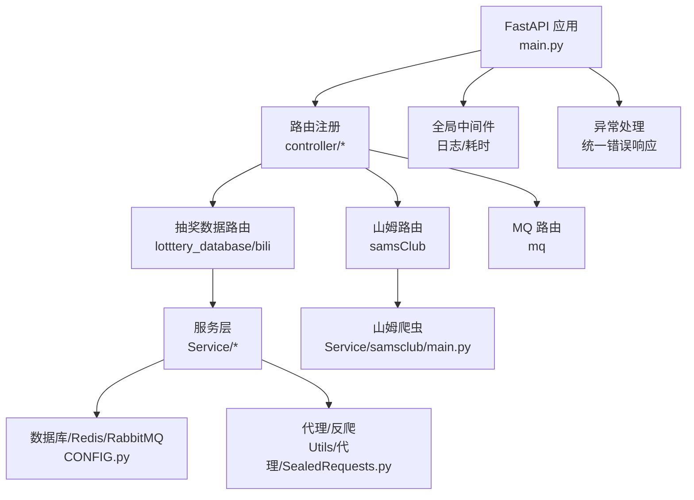
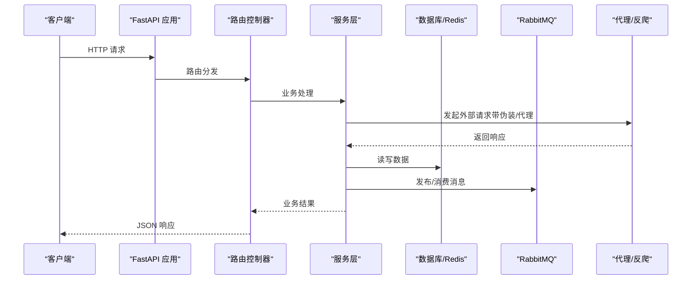
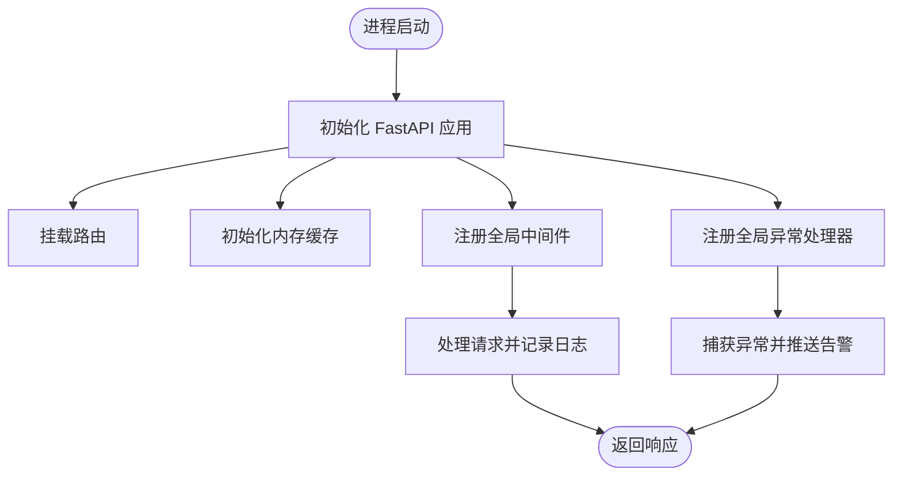
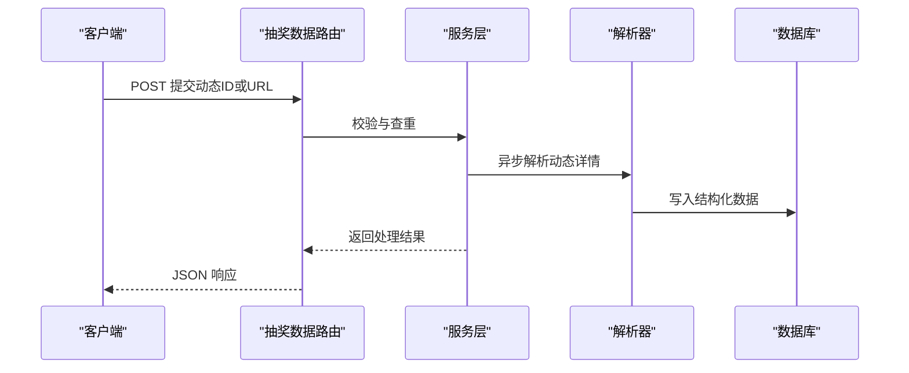
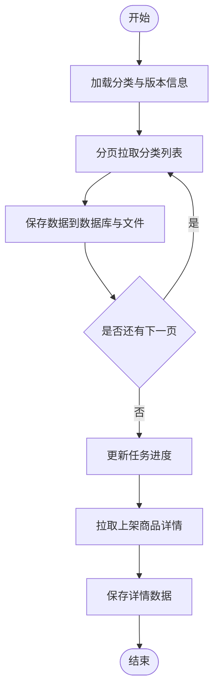
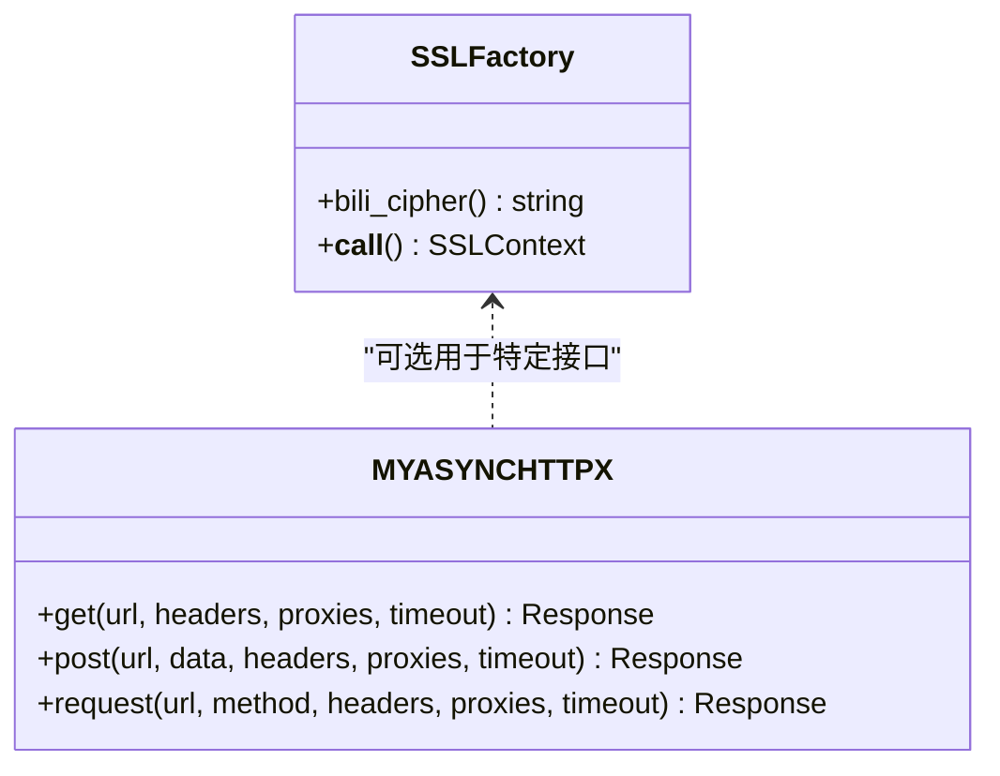
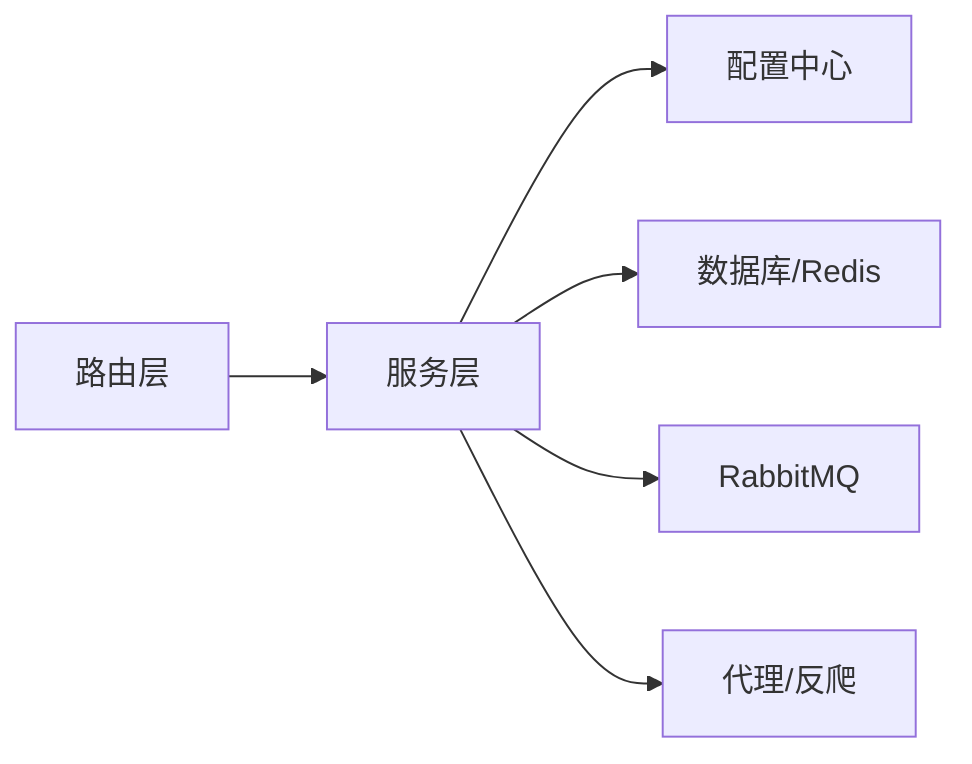

# 爬虫服务 (be-bilibili-crawler)

<cite>
**本文引用的文件**
- [main.py](file://be-bilibili-crawler/main.py)
- [CONFIG.py](file://be-bilibili-crawler/CONFIG.py)
- [faststream_app.py](file://be-bilibili-crawler/faststream_app.py)
- [LotteryData.py](file://be-bilibili-crawler/controller/v1/lotttery_database/bili/LotteryData.py)
- [samsClubController.py](file://be-bilibili-crawler/controller/v1/samsClub/samsClubController.py)
- [main.py（山姆）](file://be-bilibili-crawler/Service/samsclub/main.py)
- [config.py（爬虫配置）](file://be-bilibili-crawler/Service/BaseCrawler/config.py)
- [SealedRequests.py](file://be-bilibili-crawler/Utils/代理/SealedRequests.py)
- [__init__.py（第三方动态）](file://be-bilibili-crawler/Service/GetOthersLotDyn/__init__.py)
</cite>

## 目录
1. [简介](#简介)
2. [项目结构](#项目结构)
3. [核心组件](#核心组件)
4. [架构总览](#架构总览)
5. [详细组件分析](#详细组件分析)
6. [依赖关系分析](#依赖关系分析)
7. [性能考量](#性能考量)
8. [故障排查指南](#故障排查指南)
9. [结论](#结论)
10. [附录：API 接口文档](#附录api-接口文档)

## 简介
本技术文档面向 be-bilibili-crawler 爬虫服务，系统性地解析其 FastAPI 应用启动流程、中间件与异常处理机制、数据采集策略（B 站动态抓取、官方抽奖数据处理、山姆会员店数据抓取等）、反爬机制（代理池管理、请求头伪装、频率控制），并完整文档化所有对外 API 接口的请求参数、响应格式与错误处理。同时提供使用示例与配置选项说明，帮助开发者快速理解与集成。

## 项目结构
be-bilibili-crawler 采用分层模块化组织：
- 入口与生命周期：FastAPI 应用初始化、路由挂载、缓存与全局中间件、异常处理器
- 控制器层：按业务域划分的路由模块（抽奖数据、山姆会员店、MQ、验证码、IP 信息等）
- 服务层：具体采集逻辑、数据库访问、消息队列交互、LLM/向量检索、调度器
- 工具层：代理封装、加密、推送、数据库连接、通用方法
- 配置中心：统一的环境变量与运行时配置（数据库、Redis、RabbitMQ、LLM、爬虫专用配置）

图表来源
- [main.py:48-60](file://be-bilibili-crawler/main.py#L48-L60)
- [CONFIG.py:225-277](file://be-bilibili-crawler/CONFIG.py#L225-L277)
- [SealedRequests.py:218-382](file://be-bilibili-crawler/Utils/代理/SealedRequests.py#L218-L382)

章节来源
- [main.py:48-60](file://be-bilibili-crawler/main.py#L48-L60)
- [CONFIG.py:225-277](file://be-bilibili-crawler/CONFIG.py#L225-L277)

## 核心组件
- FastAPI 应用与生命周期：创建 app、挂载路由、初始化内存缓存、安装 uvloop（非 Windows）
- 全局中间件：记录请求耗时、IP、方法、路径、状态码与响应体（调试模式）
- 全局异常处理：捕获未处理异常，记录日志并通过推送渠道告警，返回标准错误响应
- 配置中心：集中管理数据库、Redis、RabbitMQ、LLM、爬虫专用配置；提供随机 UA、代理、V2Ray 代理等便捷属性
- 爬虫框架：基于无限并发爬虫基类，支持插件化统计、停止策略、超时重试等
- 代理与反爬：封装异步 HTTP 客户端，支持浏览器指纹伪装、TLS 套件定制、代理注入、HTTP/2

章节来源
- [main.py:1-119](file://be-bilibili-crawler/main.py#L1-L119)
- [CONFIG.py:225-487](file://be-bilibili-crawler/CONFIG.py#L225-L487)
- [config.py（爬虫配置）:48-244](file://be-bilibili-crawler/Service/BaseCrawler/config.py#L48-L244)
- [SealedRequests.py:218-382](file://be-bilibili-crawler/Utils/代理/SealedRequests.py#L218-L382)

## 架构总览
整体架构围绕 FastAPI 暴露 REST 接口，内部通过 Service 层调用各爬虫与数据源，结合 Redis/MQ/DB 进行状态与数据持久化，并使用代理与反爬手段保障稳定性。

图表来源
- [main.py:48-60](file://be-bilibili-crawler/main.py#L48-L60)
- [CONFIG.py:422-433](file://be-bilibili-crawler/CONFIG.py#L422-L433)
- [SealedRequests.py:218-382](file://be-bilibili-crawler/Utils/代理/SealedRequests.py#L218-L382)

## 详细组件分析

### FastAPI 启动流程与中间件
- 事件循环优化：在非 Windows 平台启用 uvloop 提升异步性能
- 应用初始化：创建 FastAPI 实例，挂载各路由，初始化内存缓存
- 全局中间件：在调试模式下收集请求与响应信息并写入日志
- 全局异常处理：统一捕获异常，记录堆栈，推送告警，返回标准错误模型

图表来源
- [main.py:1-119](file://be-bilibili-crawler/main.py#L1-L119)

章节来源
- [main.py:48-112](file://be-bilibili-crawler/main.py#L48-L112)

### 配置体系
- Settings：集中管理 MySQL、Redis、RabbitMQ、LLM、消息推送等环境配置
- 数据库连接：为不同业务库构造独立 URI，支持自动提交与连接池调优
- 爬虫配置：每个爬虫拥有独立配置子类，集中注册于配置表，便于扩展与维护
- 便捷属性：随机 UA、代理、V2Ray 代理、推送配置转换等

章节来源
- [CONFIG.py:225-487](file://be-bilibili-crawler/CONFIG.py#L225-L487)
- [config.py（爬虫配置）:48-244](file://be-bilibili-crawler/Service/BaseCrawler/config.py#L48-L244)

### 数据采集策略

#### B 站动态抓取与官方抽奖数据处理
- 路由入口：提供获取预约/官方/充电/直播/话题抽奖的查询接口，以及新增动态/话题/第三方动态的接口
- 高级筛选：支持时间范围、关键词、参与者数量、排序等过滤条件
- 后台任务：对第三方动态提交后，通过后台任务异步解析详情并入库
- 搜索能力：基于文本嵌入与向量检索实现关键词搜索

图表来源
- [LotteryData.py:309-402](file://be-bilibili-crawler/controller/v1/lotttery_database/bili/LotteryData.py#L309-L402)
- [__init__.py（第三方动态）:1-28](file://be-bilibili-crawler/Service/GetOthersLotDyn/__init__.py#L1-L28)

章节来源
- [LotteryData.py:96-626](file://be-bilibili-crawler/controller/v1/lotttery_database/bili/LotteryData.py#L96-L626)
- [__init__.py（第三方动态）:1-28](file://be-bilibili-crawler/Service/GetOthersLotDyn/__init__.py#L1-L28)

#### 山姆会员店数据抓取
- 分类抓取：按一级/二级分类分页拉取 SPU 列表，持久化至数据库并落盘备份
- 详情抓取：针对上架商品拉取详情并更新数据库
- 进度管理：维护任务进度，支持断点续爬
- 速率控制：使用延迟生成器控制请求间隔，避免触发风控

图表来源
- [main.py（山姆）:30-186](file://be-bilibili-crawler/Service/samsclub/main.py#L30-L186)

章节来源
- [main.py（山姆）:30-249](file://be-bilibili-crawler/Service/samsclub/main.py#L30-L249)

### 反爬机制实现
- 代理池管理：通过配置项与数据库操作模块获取可用代理，并在请求时注入
- 请求头伪装：使用浏览器指纹模拟（impersonate=chrome），随机选择浏览器类型，设置 HTTP/2
- TLS 套件定制：为特定接口定制 TLS 套件与 ALPN，提高兼容性
- 频率控制：基于延迟生成器与爬虫配置的 worker_max_timeout、max_retries 等参数控制请求节奏

图表来源
- [SealedRequests.py:22-85](file://be-bilibili-crawler/Utils/代理/SealedRequests.py#L22-L85)
- [SealedRequests.py:218-382](file://be-bilibili-crawler/Utils/代理/SealedRequests.py#L218-L382)

章节来源
- [SealedRequests.py:22-382](file://be-bilibili-crawler/Utils/代理/SealedRequests.py#L22-L382)

### 消息队列与后台任务
- FastStream 应用：独立的 FastAPI 实例用于 MQ 相关路由，启用内存缓存
- 后台任务：在路由中通过 BackgroundTasks 异步执行耗时任务（如解析第三方动态）
- 状态查询：提供查询单个/全部爬虫状态的接口

章节来源
- [faststream_app.py:1-47](file://be-bilibili-crawler/faststream_app.py#L1-L47)
- [LotteryData.py:375-433](file://be-bilibili-crawler/controller/v1/lotttery_database/bili/LotteryData.py#L375-L433)

## 依赖关系分析
- 路由与服务：路由层仅负责参数校验与调用服务层，服务层聚合数据库、消息队列、爬虫逻辑
- 配置依赖：所有外部资源（DB、Redis、MQ、LLM、代理）均通过 CONFIG 统一管理
- 反爬依赖：代理服务封装底层 HTTP 客户端，屏蔽差异并提供统一接口

图表来源
- [CONFIG.py:225-487](file://be-bilibili-crawler/CONFIG.py#L225-L487)
- [SealedRequests.py:218-382](file://be-bilibili-crawler/Utils/代理/SealedRequests.py#L218-L382)

章节来源
- [CONFIG.py:225-487](file://be-bilibili-crawler/CONFIG.py#L225-L487)

## 性能考量
- 事件循环优化：启用 uvloop 提升异步性能
- 连接池调优：SQLAlchemy 连接池大小、溢出、预检查与回收周期配置
- 缓存策略：FastAPICache 对热点查询进行短时缓存
- 并发控制：爬虫最大并发、超时、重试策略与延迟生成器
- 网络优化：HTTP/2、浏览器指纹伪装、TLS 套件定制

[本节为通用指导，不直接分析具体文件]

## 故障排查指南
- 全局异常：查看统一异常处理中的日志与推送告警，定位 URL、方法与错误堆栈
- 中间件日志：在调试模式下查看请求耗时、IP、方法与响应体，辅助定位慢请求
- 数据库连接：关注连接池配置与 pre_ping，避免陈旧连接导致错误
- 代理问题：检查代理注入与格式，确认代理可用性
- 爬虫状态：通过状态查询接口了解各爬虫运行状况

章节来源
- [main.py:63-112](file://be-bilibili-crawler/main.py#L63-L112)
- [CONFIG.py:381-419](file://be-bilibili-crawler/CONFIG.py#L381-L419)

## 结论
be-bilibili-crawler 以 FastAPI 为核心，结合模块化路由、服务层抽象、统一配置与反爬封装，实现了稳定高效的 B 站动态与官方抽奖数据采集，以及山姆会员店商品数据的系统化抓取。通过中间件与异常处理保障可观测性，借助缓存与连接池优化性能，适合在生产环境中持续运行。

[本节为总结，不直接分析具体文件]

## 附录：API 接口文档

### 抽奖数据接口（lotttery_database/bili）
- 获取预约抽奖数据
  - 方法：POST
  - 路径：/api/v1/reserve-lottery（依据路由定义）
  - 请求体：分页与高级筛选参数（时间范围、关键词、参与者数量、排序等）
  - 响应：标准响应模型，包含分页数据与总数
  - 错误：统一异常处理返回标准错误模型

- 获取官方抽奖数据
  - 方法：POST
  - 路径：/api/v1/official-lottery
  - 请求体：同上
  - 响应：同上

- 获取充电抽奖数据
  - 方法：POST
  - 路径：/api/v1/charge-lottery
  - 请求体：同上
  - 响应：同上

- 获取直播抽奖数据
  - 方法：POST
  - 路径：/api/v1/live-lottery
  - 请求体：分页参数
  - 响应：分页数据

- 获取话题抽奖数据
  - 方法：POST
  - 路径：/api/v1/topic-lottery
  - 请求体：分页与关键词
  - 响应：分页数据

- 获取所有抽奖信息
  - 方法：GET
  - 路径：/api/v1/all-lottery
  - 查询参数：收录时间与发布时间快捷筛选、起止时间、页码与每页数量
  - 响应：聚合数据

- 提交抽奖动态（官抽、预约、充电）
  - 方法：POST
  - 路径：/api/v1/add-dynamic-lottery
  - 请求体：dynamic_id_or_url
  - 响应：处理结果

- 批量提交抽奖动态
  - 方法：POST
  - 路径：/api/v1/bulk-add-dynamic-lottery
  - 请求体：dynamic_id_or_urls 列表
  - 响应：处理结果列表

- 提交话题抽奖
  - 方法：POST
  - 路径：/api/v1/add-topic-lottery
  - 请求体：topic_id
  - 响应：处理结果

- 批量提交话题抽奖
  - 方法：POST
  - 路径：/api/v1/bulk-add-topic-lottery
  - 请求体：topic_ids 列表
  - 响应：处理结果列表

- 提交第三方抽奖动态
  - 方法：POST
  - 路径：/api/v1/add-others-lot-dyn
  - 请求体：dynamic_id_or_url
  - 鉴权：需要登录态（网关注入 x-bili-* 头）
  - 响应：处理结果，后台任务异步解析

- 批量提交第三方抽奖动态
  - 方法：POST
  - 路径：/api/v1/bulk-add-others-lot-dyn
  - 请求体：dynamic_id_or_urls 列表
  - 鉴权：需要登录态
  - 响应：处理结果列表

- 关键词搜索抽奖信息
  - 方法：POST
  - 路径：/api/v1/search-lottery-by-keyword
  - 请求体：分页与关键词
  - 响应：分页数据

- 获取单个爬虫状态
  - 方法：POST
  - 路径：/api/v1/get-single-scrapy-status
  - 查询参数：scrapy_name（爬虫类型）
  - 响应：状态信息

- 获取所有爬虫状态
  - 方法：GET
  - 路径：/api/v1/get-all-lot-scrapy-status
  - 响应：各爬虫状态集合

- 获取第三方抽奖动态列表
  - 方法：POST
  - 路径：/api/v1/get-others-lot-dyn-list
  - 查询参数：分页、排序、时间筛选
  - 鉴权：需要登录态
  - 响应：分页数据，附带 extra_info

- 获取筛选参数元数据
  - 方法：GET
  - 路径：/api/v1/get-lottery-filter-params
  - 响应：各接口筛选参数元数据

章节来源
- [LotteryData.py:96-626](file://be-bilibili-crawler/controller/v1/lotttery_database/bili/LotteryData.py#L96-L626)

### 山姆会员店接口（samsClub）
- 更新认证令牌
  - 方法：POST
  - 路径：/api/v1/samsclub/set-new-auth-token
  - 请求体：auth_token
  - 响应：成功提示

- GraphQL 子路由
  - 路径前缀：/graphql
  - 用途：GraphQL 查询/变更

- 山姆 API 状态
  - 方法：GET
  - 路径：/api/v1/samsclub/api-status
  - 响应：SamsClubApiStatus

章节来源
- [samsClubController.py:1-28](file://be-bilibili-crawler/controller/v1/samsClub/samsClubController.py#L1-L28)

### 使用示例与配置选项
- 环境变量与配置文件
  - 数据库：MYSQL_HOST、MYSQL_PORT、MYSQL_USER、MYSQL_PASSWORD
  - 缓存：REDIS_HOST、REDIS_PORT、REDIS_PWD
  - 消息队列：RABBITMQ_HOST、RABBITMQ_PORT、RABBITMQ_USER、RABBITMQ_PASSWORD
  - LLM：LLAMA_HOST、LLAMA_PORT、llm_apis（列表）
  - 推送：message_config（多通道配置）
  - 爬虫：通过 Service.BaseCrawler.config 中的配置子类集中管理

- 启动方式
  - 主应用：uvicorn.run(app, host="0.0.0.0", port=23333)
  - MQ 应用：uvicorn.run(app, host="0.0.0.0", port=23334, loop="uvloop")

- 反爬与频率控制
  - 代理注入：通过代理字典传入请求
  - 浏览器伪装：impersonate 随机选择浏览器类型
  - TLS 定制：为特定接口设置 TLS 套件与 ALPN
  - 延迟控制：SleepTimeGenerator 与爬虫配置中的超时与重试策略

章节来源
- [CONFIG.py:225-487](file://be-bilibili-crawler/CONFIG.py#L225-L487)
- [main.py:115-119](file://be-bilibili-crawler/main.py#L115-L119)
- [faststream_app.py:43-47](file://be-bilibili-crawler/faststream_app.py#L43-L47)
- [SealedRequests.py:218-382](file://be-bilibili-crawler/Utils/代理/SealedRequests.py#L218-L382)