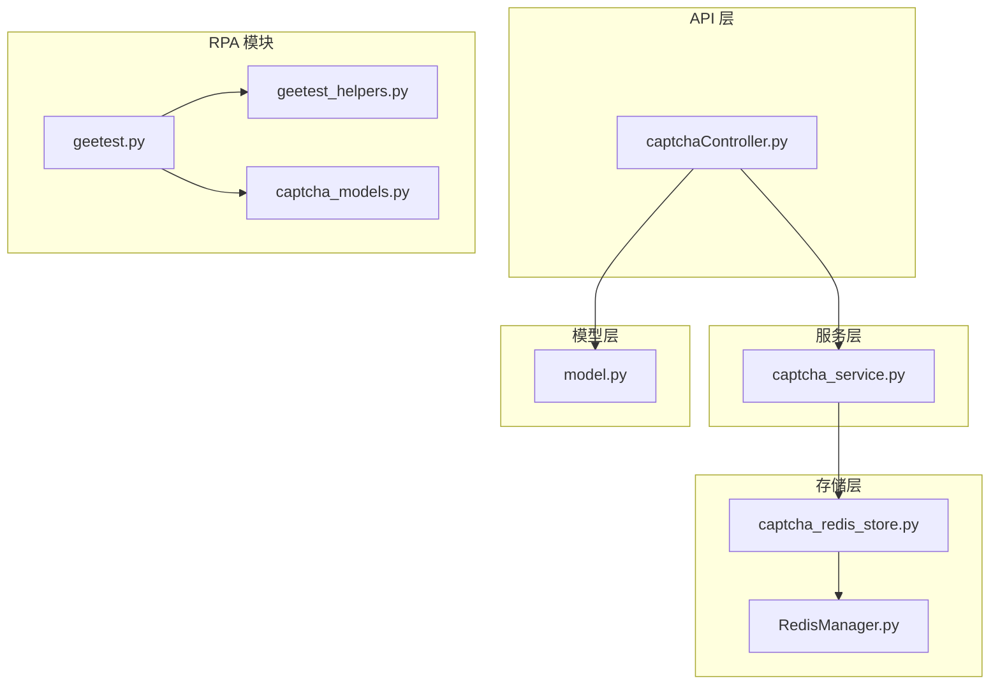
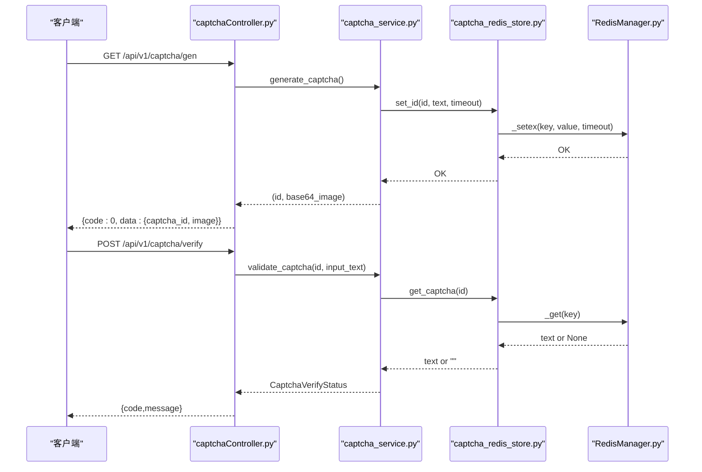
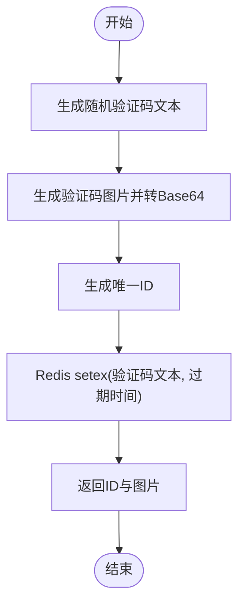
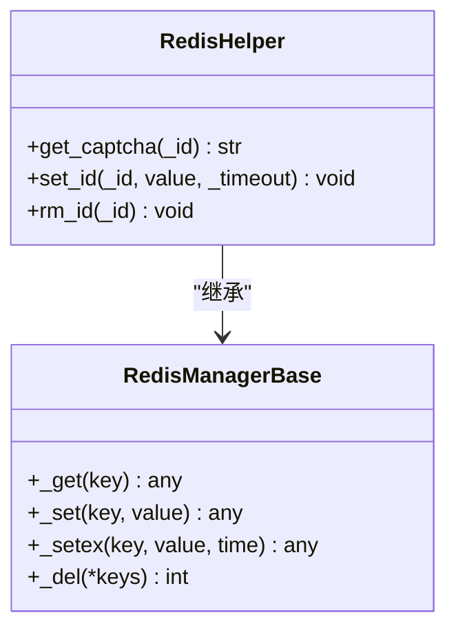
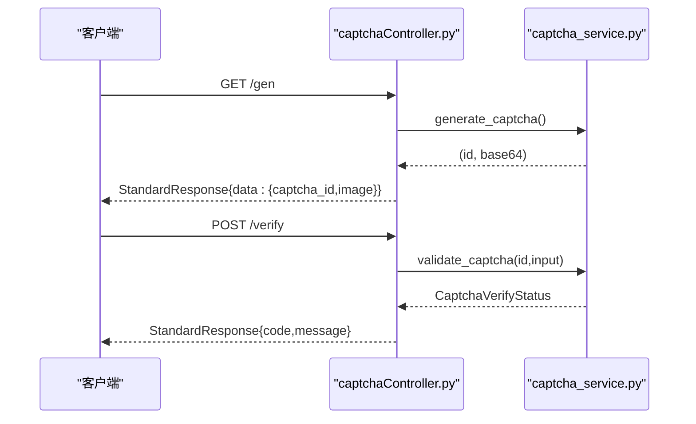
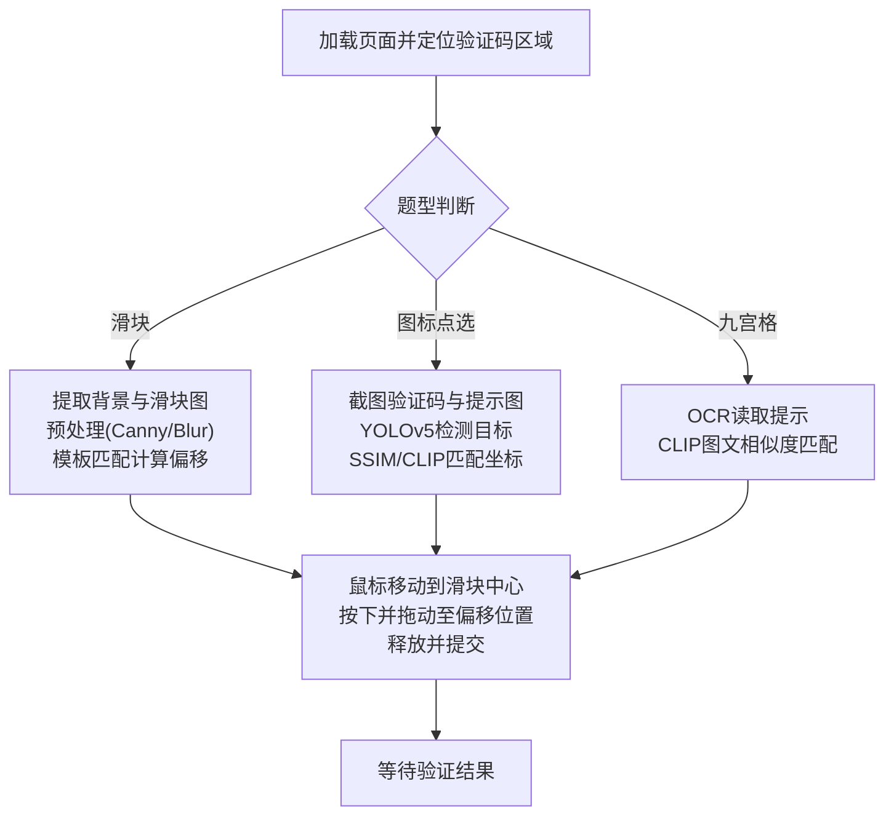
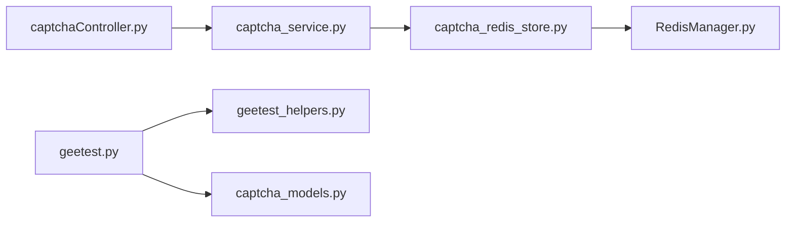

# 验证码服务

<cite>
**本文引用的文件**
- [captcha_service.py](file://be-bilibili-crawler/Service/CaptchaGen/captcha_service.py)
- [captcha_redis_store.py](file://be-bilibili-crawler/Service/CaptchaGen/captcha_redis_store.py)
- [RedisManager.py](file://be-bilibili-crawler/Utils/redisTool/RedisManager.py)
- [captchaController.py](file://be-bilibili-crawler/controller/v1/captcha/captchaController.py)
- [model.py](file://be-bilibili-crawler/Models/v1/CaptchaGen/model.py)
- [geetest.py](file://RPA-Browser/botright/modules/geetest.py)
- [geetest_helpers.py](file://RPA-Browser/botright/modules/geetest_helpers.py)
- [captcha_models.py](file://be-bilibili-crawler/Utils/GrpcUtils/极验/models/captcha_models.py)
- [test_captcha.py](file://be-bilibili-crawler/test/test_captcha.py)
</cite>

## 目录
1. [简介](#简介)
2. [项目结构](#项目结构)
3. [核心组件](#核心组件)
4. [架构总览](#架构总览)
5. [详细组件分析](#详细组件分析)
6. [依赖关系分析](#依赖关系分析)
7. [性能与并发](#性能与并发)
8. [部署与配置](#部署与配置)
9. [故障排查](#故障排查)
10. [结论](#结论)
11. [附录：API 参考](#附录api-参考)

## 简介
本仓库包含一个验证码服务，提供图形验证码的生成与校验能力，并通过 Redis 进行验证码存储、过期管理与并发控制。同时，RPA 模块中包含对极验（Geetest）等第三方验证码的自动化识别与交互逻辑，涵盖滑块、图标点选、九宫格等多种题型。本文档从系统架构、数据流、算法实现、API 接口、部署配置与调优、常见问题等方面进行全面说明。

## 项目结构
验证码相关代码主要分布在以下位置：
- 服务层：验证码生成与校验的核心逻辑
- 存储层：基于 Redis 的验证码键值存储与过期管理
- 控制器层：FastAPI 路由对外暴露 API
- 模型层：请求/响应结构与状态枚举
- RPA 模块：极验等验证码的图像识别与自动交互
- gRPC 模型：极验相关数据结构定义

图表来源
- [captchaController.py:1-33](file://be-bilibili-crawler/controller/v1/captcha/captchaController.py#L1-L33)
- [captcha_service.py:1-57](file://be-bilibili-crawler/Service/CaptchaGen/captcha_service.py#L1-L57)
- [captcha_redis_store.py:1-23](file://be-bilibili-crawler/Service/CaptchaGen/captcha_redis_store.py#L1-L23)
- [RedisManager.py:187-340](file://be-bilibili-crawler/Utils/redisTool/RedisManager.py#L187-L340)
- [model.py:1-60](file://be-bilibili-crawler/Models/v1/CaptchaGen/model.py#L1-L60)
- [geetest.py:1-369](file://RPA-Browser/botright/modules/geetest.py#L1-L369)
- [geetest_helpers.py:1-456](file://RPA-Browser/botright/modules/geetest_helpers.py#L1-L456)
- [captcha_models.py:1-40](file://be-bilibili-crawler/Utils/GrpcUtils/极验/models/captcha_models.py#L1-L40)

章节来源
- [captchaController.py:1-33](file://be-bilibili-crawler/controller/v1/captcha/captchaController.py#L1-L33)
- [captcha_service.py:1-57](file://be-bilibili-crawler/Service/CaptchaGen/captcha_service.py#L1-L57)
- [captcha_redis_store.py:1-23](file://be-bilibili-crawler/Service/CaptchaGen/captcha_redis_store.py#L1-L23)
- [RedisManager.py:187-340](file://be-bilibili-crawler/Utils/redisTool/RedisManager.py#L187-L340)
- [model.py:1-60](file://be-bilibili-crawler/Models/v1/CaptchaGen/model.py#L1-L60)
- [geetest.py:1-369](file://RPA-Browser/botright/modules/geetest.py#L1-L369)
- [geetest_helpers.py:1-456](file://RPA-Browser/botright/modules/geetest_helpers.py#L1-L456)
- [captcha_models.py:1-40](file://be-bilibili-crawler/Utils/GrpcUtils/极验/models/captcha_models.py#L1-L40)

## 核心组件
- 验证码服务：负责生成随机验证码图片、Base64 编码、ID 生成与存储；提供校验接口，支持忽略空格的大小写比较。
- Redis 存储：封装异步 Redis 操作，提供 setex 设置过期时间、get 读取、delete 删除等方法，并内置重试与连接池管理。
- API 控制器：暴露生成与验证两个 HTTP 端点，统一返回标准响应格式。
- 数据模型：定义生成响应、验证请求、验证状态枚举与状态对象（含 code/message/success）。
- RPA 极验模块：实现 Geetest v3/v4 的多种题型识别与交互，包括滑块、图标点选、九宫格、五子棋、图标粉碎等。
- gRPC 模型：定义极验相关的信息结构体，便于跨进程或微服务间传递。

章节来源
- [captcha_service.py:14-52](file://be-bilibili-crawler/Service/CaptchaGen/captcha_service.py#L14-L52)
- [captcha_redis_store.py:4-23](file://be-bilibili-crawler/Service/CaptchaGen/captcha_redis_store.py#L4-L23)
- [captchaController.py:11-33](file://be-bilibili-crawler/controller/v1/captcha/captchaController.py#L11-L33)
- [model.py:6-53](file://be-bilibili-crawler/Models/v1/CaptchaGen/model.py#L6-L53)
- [geetest.py:10-369](file://RPA-Browser/botright/modules/geetest.py#L10-L369)
- [geetest_helpers.py:26-456](file://RPA-Browser/botright/modules/geetest_helpers.py#L26-L456)
- [captcha_models.py:7-40](file://be-bilibili-crawler/Utils/GrpcUtils/极验/models/captcha_models.py#L7-L40)

## 架构总览
验证码服务采用分层架构：
- API 层通过 FastAPI 路由接收请求，调用服务层方法。
- 服务层负责业务逻辑：生成图片、存储到 Redis、校验输入。
- 存储层使用 Redis 作为临时存储，利用 TTL 实现过期管理，并通过连接池和重试机制保证高可用。
- RPA 模块独立于 API 服务，用于浏览器自动化场景下的极验验证码识别与交互。

图表来源
- [captchaController.py:15-33](file://be-bilibili-crawler/controller/v1/captcha/captchaController.py#L15-L33)
- [captcha_service.py:23-52](file://be-bilibili-crawler/Service/CaptchaGen/captcha_service.py#L23-L52)
- [captcha_redis_store.py:8-23](file://be-bilibili-crawler/Service/CaptchaGen/captcha_redis_store.py#L8-L23)
- [RedisManager.py:303-340](file://be-bilibili-crawler/Utils/redisTool/RedisManager.py#L303-L340)

## 详细组件分析

### 验证码服务（CaptchaService）
- 生成流程：
  - 生成 4 位随机字符（数字+字母）。
  - 使用 ImageCaptcha 生成图片字节流，转换为 Base64。
  - 生成唯一 ID，将验证码文本存入 Redis，设置过期时间。
  - 返回 ID 与 Base64 图片。
- 校验流程：
  - 根据 ID 从 Redis 获取验证码文本。
  - 若不存在则返回过期状态。
  - 去除输入文本中的空格并进行大小写不敏感比较，匹配成功返回有效，否则无效。

图表来源
- [captcha_service.py:23-39](file://be-bilibili-crawler/Service/CaptchaGen/captcha_service.py#L23-L39)

章节来源
- [captcha_service.py:14-52](file://be-bilibili-crawler/Service/CaptchaGen/captcha_service.py#L14-L52)

### Redis 存储（RedisHelper）
- Key 设计：captcha:id:{id}
- 写入：使用 setex 设置过期时间，默认 600 秒。
- 读取：根据 key 获取验证码文本，不存在返回空字符串。
- 删除：提供 rm_id 方法用于主动清理。

图表来源
- [captcha_redis_store.py:4-23](file://be-bilibili-crawler/Service/CaptchaGen/captcha_redis_store.py#L4-L23)
- [RedisManager.py:187-340](file://be-bilibili-crawler/Utils/redisTool/RedisManager.py#L187-L340)

章节来源
- [captcha_redis_store.py:4-23](file://be-bilibili-crawler/Service/CaptchaGen/captcha_redis_store.py#L4-L23)
- [RedisManager.py:187-340](file://be-bilibili-crawler/Utils/redisTool/RedisManager.py#L187-L340)

### API 控制器（captchaController）
- 生成接口：GET /api/v1/captcha/gen
  - 调用服务层生成验证码，返回标准响应。
- 验证接口：POST /api/v1/captcha/verify
  - 接收 captcha_id 与 input_text，调用服务层校验，返回状态码与消息。

图表来源
- [captchaController.py:15-33](file://be-bilibili-crawler/controller/v1/captcha/captchaController.py#L15-L33)
- [captcha_service.py:23-52](file://be-bilibili-crawler/Service/CaptchaGen/captcha_service.py#L23-L52)

章节来源
- [captchaController.py:11-33](file://be-bilibili-crawler/controller/v1/captcha/captchaController.py#L11-L33)

### 数据模型（Model）
- 生成响应：包含验证码 ID 与 Base64 图片。
- 验证请求：包含验证码 ID 与用户输入文本。
- 验证状态：
  - VALID：验证通过，code=0。
  - INVALID：验证失败，code=400。
  - EXPIRED：验证码已过期，code=2。

章节来源
- [model.py:6-53](file://be-bilibili-crawler/Models/v1/CaptchaGen/model.py#L6-L53)

### 极验验证码识别（Geetest）
- 题型支持：
  - 滑块验证码：提取背景图与滑块图，计算偏移量并拖动滑块。
  - 图标点选：截取验证码区域与提示图，识别目标图标坐标并点击。
  - 九宫格：OCR 读取提示文字，结合 CLIP 模型进行图文相似度匹配。
  - 五子棋/图标粉碎：网格布局识别与匹配。
- 识别算法要点：
  - 图像预处理：灰度化、高斯模糊、Canny 边缘检测。
  - 特征提取：YOLOv5 目标检测、CLIP 图文嵌入、SSIM 结构相似性。
  - 结果匹配：模板匹配、旋转角度搜索、相似度排序。
- 交互流程：
  - 定位元素边界框，计算中心点。
  - 模拟鼠标移动、按下、拖拽、释放。
  - 提交验证并等待结果。

图表来源
- [geetest.py:72-148](file://RPA-Browser/botright/modules/geetest.py#L72-L148)
- [geetest_helpers.py:26-229](file://RPA-Browser/botright/modules/geetest_helpers.py#L26-L229)
- [geetest_helpers.py:232-320](file://RPA-Browser/botright/modules/geetest_helpers.py#L232-L320)

章节来源
- [geetest.py:10-369](file://RPA-Browser/botright/modules/geetest.py#L10-L369)
- [geetest_helpers.py:26-456](file://RPA-Browser/botright/modules/geetest_helpers.py#L26-L456)
- [captcha_models.py:7-40](file://be-bilibili-crawler/Utils/GrpcUtils/极验/models/captcha_models.py#L7-L40)

## 依赖关系分析
- 验证码服务依赖 Redis 存储，通过 RedisManagerBase 提供的异步方法进行读写。
- API 控制器依赖服务层与模型层，统一封装响应格式。
- RPA 模块依赖图像处理库（OpenCV、PIL）、机器学习模型（YOLOv5、CLIP）与浏览器自动化（Playwright/Puppeteer）。
- gRPC 模型用于跨服务传递极验相关信息。

图表来源
- [captchaController.py:1-33](file://be-bilibili-crawler/controller/v1/captcha/captchaController.py#L1-L33)
- [captcha_service.py:1-57](file://be-bilibili-crawler/Service/CaptchaGen/captcha_service.py#L1-L57)
- [captcha_redis_store.py:1-23](file://be-bilibili-crawler/Service/CaptchaGen/captcha_redis_store.py#L1-L23)
- [RedisManager.py:187-340](file://be-bilibili-crawler/Utils/redisTool/RedisManager.py#L187-L340)
- [geetest.py:10-369](file://RPA-Browser/botright/modules/geetest.py#L10-L369)
- [geetest_helpers.py:26-456](file://RPA-Browser/botright/modules/geetest_helpers.py#L26-L456)
- [captcha_models.py:7-40](file://be-bilibili-crawler/Utils/GrpcUtils/极验/models/captcha_models.py#L7-L40)

章节来源
- [captchaController.py:1-33](file://be-bilibili-crawler/controller/v1/captcha/captchaController.py#L1-L33)
- [captcha_service.py:1-57](file://be-bilibili-crawler/Service/CaptchaGen/captcha_service.py#L1-L57)
- [captcha_redis_store.py:1-23](file://be-bilibili-crawler/Service/CaptchaGen/captcha_redis_store.py#L1-L23)
- [RedisManager.py:187-340](file://be-bilibili-crawler/Utils/redisTool/RedisManager.py#L187-L340)
- [geetest.py:10-369](file://RPA-Browser/botright/modules/geetest.py#L10-L369)
- [geetest_helpers.py:26-456](file://RPA-Browser/botright/modules/geetest_helpers.py#L26-L456)
- [captcha_models.py:7-40](file://be-bilibili-crawler/Utils/GrpcUtils/极验/models/captcha_models.py#L7-L40)

## 性能与并发
- Redis 连接池：通过 ConnectionPool 管理连接，最大连接数可配置，避免频繁创建销毁连接。
- 重试机制：对连接错误与 BusyLoadingError 进行重试，提升稳定性。
- 批量操作：支持 pipeline 批量读写，减少网络往返。
- 扫描与删除：使用 SCAN 迭代器逐批处理 keys，避免一次性加载导致内存峰值。
- 超时与锁：设置 socket_timeout 与 lock 超时，防止阻塞。

优化建议：
- 调整 max_connections 以适应并发量。
- 合理设置验证码过期时间，平衡安全性与用户体验。
- 对热点 key 使用本地缓存（如 LRU）降低 Redis 压力。
- 监控 Redis 延迟与错误率，及时扩容或优化。

章节来源
- [RedisManager.py:16-79](file://be-bilibili-crawler/Utils/redisTool/RedisManager.py#L16-L79)
- [RedisManager.py:211-259](file://be-bilibili-crawler/Utils/redisTool/RedisManager.py#L211-L259)
- [RedisManager.py:303-340](file://be-bilibili-crawler/Utils/redisTool/RedisManager.py#L303-L340)

## 部署与配置
- 环境要求：
  - Python 环境，安装依赖（FastAPI、redis、opencv-python、pillow、yolov5、sentence-transformers 等）。
  - Redis 服务可用，配置 host/port/db/pwd。
- 启动方式：
  - 运行 FastAPI 应用，挂载路由。
  - 确保 Redis 连接参数正确。
- 配置项：
  - 验证码超时时间：默认 600 秒，可通过构造函数或接口参数调整。
  - Redis 连接池大小：根据服务器资源调整。
  - 日志与监控：启用 redis_logger 与业务日志。

注意事项：
- 确保 Redis 网络可达且权限正确。
- 生产环境建议使用专用 Redis 实例。
- 合理设置超时与重试策略，避免雪崩。

章节来源
- [captcha_service.py:15-22](file://be-bilibili-crawler/Service/CaptchaGen/captcha_service.py#L15-L22)
- [RedisManager.py:195-210](file://be-bilibili-crawler/Utils/redisTool/RedisManager.py#L195-L210)

## 故障排查
- 验证码无法生成：
  - 检查 Redis 连接是否正常。
  - 确认 ImageCaptcha 依赖是否安装。
- 验证码校验失败：
  - 检查输入文本是否包含空格或大小写不一致。
  - 确认验证码未过期。
- Redis 连接错误：
  - 查看日志中的重试记录。
  - 检查 Redis 服务状态与网络连通性。
- 极验识别失败：
  - 确认页面元素选择器是否正确。
  - 检查图像预处理参数与模型加载。
  - 增加重试与回退逻辑。

章节来源
- [captcha_service.py:41-52](file://be-bilibili-crawler/Service/CaptchaGen/captcha_service.py#L41-L52)
- [RedisManager.py:62-79](file://be-bilibili-crawler/Utils/redisTool/RedisManager.py#L62-L79)
- [geetest.py:72-148](file://RPA-Browser/botright/modules/geetest.py#L72-L148)

## 结论
该验证码服务提供了稳定高效的图形验证码生成与校验能力，结合 Redis 实现了过期管理与并发控制。RPA 模块对极验等复杂验证码具备较强的识别与交互能力，适用于自动化测试与爬虫场景。通过合理的部署配置与性能调优，可在高并发环境下保持良好稳定性与响应速度。

## 附录：API 参考
- 生成验证码
  - 方法：GET
  - 路径：/api/v1/captcha/gen
  - 响应：包含验证码 ID 与 Base64 图片
- 验证验证码
  - 方法：POST
  - 路径：/api/v1/captcha/verify
  - 请求体：captcha_id、input_text
  - 响应：code、message

章节来源
- [captchaController.py:15-33](file://be-bilibili-crawler/controller/v1/captcha/captchaController.py#L15-L33)
- [test_captcha.py:24-88](file://be-bilibili-crawler/test/test_captcha.py#L24-L88)