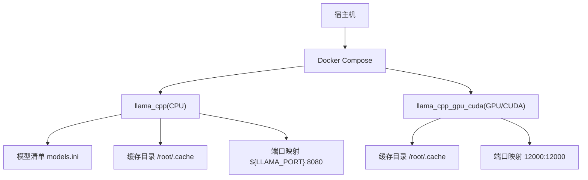
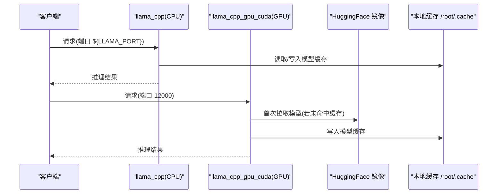
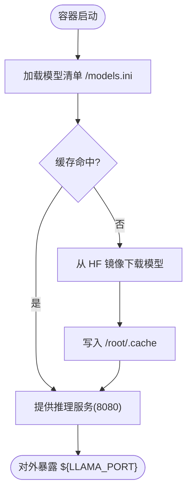
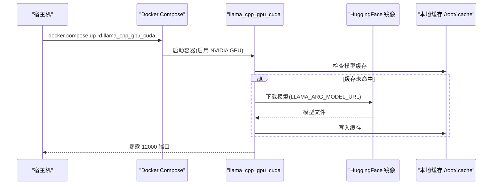
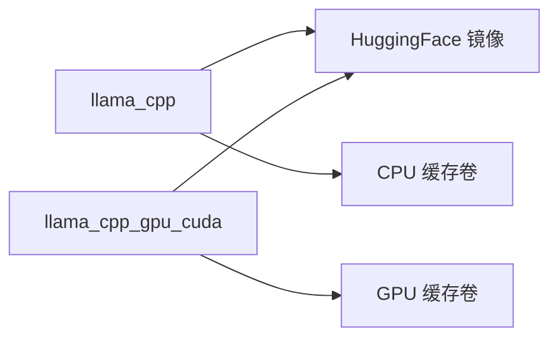

# AI/ML 服务配置

<cite>
**本文引用的文件**
- [docker-compose.yml](file://docker-compose.yml)
- [.env](file://.env)
- [.env.example](file://.env.example)
- [models.ini](file://docker_vol/llama/models.ini)
- [README.md](file://README.md)
</cite>

## 目录
1. [简介](#简介)
2. [项目结构](#项目结构)
3. [核心组件](#核心组件)
4. [架构总览](#架构总览)
5. [详细组件分析](#详细组件分析)
6. [依赖关系分析](#依赖关系分析)
7. [性能与资源优化](#性能与资源优化)
8. [故障排查指南](#故障排查指南)
9. [结论](#结论)
10. [附录](#附录)

## 简介
本文件聚焦于本项目中 AI/ML 推理服务的 Docker Compose 配置，重点解析 llama_cpp（CPU）与 llama_cpp_gpu_cuda（GPU/CUDA）两种运行方式的差异、模型挂载方式、缓存目录、端口与环境变量配置，并给出不同硬件环境下的优化建议与常见问题排查方法。

## 项目结构
AI/ML 相关服务由 docker-compose.yml 统一编排，包含：
- CPU 版推理服务：llama_cpp
- GPU（CUDA）版推理服务：llama_cpp_gpu_cuda
- 模型清单与缓存目录：docker_vol/llama/models.ini 及对应缓存卷
- 环境变量：.env/.env.example 中的 LLAMA_PORT 等

图表来源
- [docker-compose.yml:323-356](file://docker-compose.yml#L323-L356)
- [docker-compose.yml:326-329](file://docker-compose.yml#L326-L329)
- [docker-compose.yml:348-356](file://docker-compose.yml#L348-L356)
- [models.ini:1-11](file://docker_vol/llama/models.ini#L1-L11)

章节来源
- [docker-compose.yml:323-356](file://docker-compose.yml#L323-L356)
- [.env:11](file://.env#L11)
- [models.ini:1-11](file://docker_vol/llama/models.ini#L1-L11)

## 核心组件
- llama_cpp（CPU 推理）
  - 镜像：ghcr.nju.edu.cn/ggml-org/llama.cpp:server
  - 模型清单：通过 LLAMA_ARG_MODELS_PRESET 指向 /models.ini
  - 缓存：挂载 ./docker_vol/llama_model/cache 到 /root/.cache
  - 端口：${LLAMA_PORT} 映射至容器 8080
  - 环境变量：HF_ENDPOINT 指定模型下载镜像源
- llama_cpp_gpu_cuda（GPU/CUDA 推理）
  - 镜像：ghcr.nju.edu.cn/ggml-org/llama.cpp:server-cuda13
  - GPU 设备：通过 deploy.resources.reservations.devices 声明 nvidia 驱动与 gpu 能力
  - 缓存：挂载 ./docker_vol/llama_gpu_model/cache 到 /root/.cache
  - 端口：12000 映射至容器 12000
  - 环境变量：直接指定模型名与模型 URL，监听地址与端口

章节来源
- [docker-compose.yml:323-337](file://docker-compose.yml#L323-L337)
- [docker-compose.yml:338-356](file://docker-compose.yml#L338-L356)
- [models.ini:1-11](file://docker_vol/llama/models.ini#L1-L11)

## 架构总览
CPU 与 GPU 两个推理服务并行存在，分别暴露不同端口供上层调用。CPU 版本通过模型清单加载多个模型；GPU 版本通过环境变量直接指定单一模型，适合高性能推理场景。

图表来源
- [docker-compose.yml:323-356](file://docker-compose.yml#L323-L356)
- [models.ini:1-11](file://docker_vol/llama/models.ini#L1-L11)

## 详细组件分析

### CPU 推理服务：llama_cpp
- 镜像与启动
  - 使用官方 server 镜像，无需 GPU 支持
- 模型管理
  - 通过 LLAMA_ARG_MODELS_PRESET 指向 /models.ini，支持多模型定义
  - 模型清单位于 docker_vol/llama/models.ini，可配置 embedding、batch-size、cache-type 等参数
- 缓存与持久化
  - 将宿主目录 ./docker_vol/llama_model/cache 挂载为 /root/.cache，避免重复下载
- 网络与访问
  - 端口映射：宿主机 ${LLAMA_PORT} -> 容器 8080
  - 可通过 .env 调整 LLAMA_PORT
- 环境变量要点
  - LLAMA_ARG_MODELS_PRESET=/models.ini
  - LLAMA_ARG_MODELS_MAX=1
  - HF_ENDPOINT=https://hf-mirror.com（加速模型下载）

图表来源
- [docker-compose.yml:323-337](file://docker-compose.yml#L323-L337)
- [models.ini:1-11](file://docker_vol/llama/models.ini#L1-L11)

章节来源
- [docker-compose.yml:323-337](file://docker-compose.yml#L323-L337)
- [models.ini:1-11](file://docker_vol/llama/models.ini#L1-L11)
- [.env:11](file://.env#L11)

### GPU 推理服务：llama_cpp_gpu_cuda
- 镜像与启动
  - 使用 CUDA13 专用镜像 ghcr.nju.edu.cn/ggml-org/llama.cpp:server-cuda13
- GPU 设备分配
  - 通过 deploy.resources.reservations.devices 声明 nvidia 驱动与 gpu 能力，count=all 表示使用全部可用 GPU
- 模型管理
  - 通过 LLAMA_ARG_MODEL 指定模型名称，LLAMA_ARG_MODEL_URL 指定模型下载地址
  - 首次启动会从 HF 镜像拉取模型并缓存到 /root/.cache
- 缓存与持久化
  - 将宿主目录 ./docker_vol/llama_gpu_model/cache 挂载为 /root/.cache，实现跨重启复用
- 网络与访问
  - 端口映射：宿主机 12000 -> 容器 12000
  - 监听地址 LLAMA_ARG_HOST=0.0.0.0，允许外部访问

图表来源
- [docker-compose.yml:338-356](file://docker-compose.yml#L338-L356)

章节来源
- [docker-compose.yml:338-356](file://docker-compose.yml#L338-L356)

### 模型清单与缓存目录
- 模型清单 models.ini
  - 支持多模型条目，可配置 hf、model-url、embedding、batch-size、ubatch-size、cache-type-k/v 等
  - 适用于 CPU 服务通过 LLAMA_ARG_MODELS_PRESET 加载
- 缓存目录
  - CPU：./docker_vol/llama_model/cache -> /root/.cache
  - GPU：./docker_vol/llama_gpu_model/cache -> /root/.cache
  - 作用：避免重复下载，提升冷启动速度

章节来源
- [models.ini:1-11](file://docker_vol/llama/models.ini#L1-L11)
- [docker-compose.yml:326-329](file://docker-compose.yml#L326-L329)
- [docker-compose.yml:348-349](file://docker-compose.yml#L348-L349)

### 环境变量与端口
- .env 中的 LLAMA_PORT 用于 CPU 服务端口映射
- GPU 服务固定使用 12000 端口
- HF_ENDPOINT 指定模型下载镜像源，加速下载

章节来源
- [.env:11](file://.env#L11)
- [docker-compose.yml:323-356](file://docker-compose.yml#L323-L356)

## 依赖关系分析
- 服务间无强依赖：CPU 与 GPU 推理服务相互独立
- 外部依赖：
  - HuggingFace 镜像（通过 HF_ENDPOINT）
  - NVIDIA 驱动与 Docker 运行时（仅 GPU 服务需要）
- 数据持久化：
  - 模型缓存通过卷挂载到宿主机，确保重启后不丢失

图表来源
- [docker-compose.yml:323-356](file://docker-compose.yml#L323-L356)

章节来源
- [docker-compose.yml:323-356](file://docker-compose.yml#L323-L356)

## 性能与资源优化
- CPU 环境
  - 使用 models.ini 批量定义模型，按需选择较小量化模型以节省内存
  - 合理设置 batch-size、ubatch-size 与 cache-type 以提升吞吐
  - 利用缓存目录减少重复下载
- GPU 环境
  - 确保宿主机已安装 NVIDIA 驱动与 nvidia-container-toolkit
  - 使用 server-cuda13 镜像以获得最佳兼容性
  - 根据显存大小选择合适的模型量化格式（如 Q4_K_M）
  - 如需限制 GPU 数量，可将 count 从 all 改为具体数值
- 通用优化
  - 使用国内 HF 镜像加速模型下载
  - 将缓存目录置于高速磁盘（如 NVMe）
  - 监控容器日志与系统资源占用，必要时调整并发或批大小

[本节为通用指导，不直接分析具体文件]

## 故障排查指南
- GPU 无法识别
  - 确认宿主机已安装 NVIDIA 驱动与 nvidia-container-toolkit
  - 检查 docker-compose.yml 中 deploy.resources.reservations.devices 是否配置了 nvidia 驱动与 gpu 能力
- 模型下载失败
  - 检查 HF_ENDPOINT 是否正确指向可用的镜像源
  - 确认网络连通性与代理设置
- 端口冲突
  - 修改 .env 中的 LLAMA_PORT 或 GPU 服务端口，避免与宿主机其他服务冲突
- 权限问题
  - WSL2 环境下可能出现 docker_vol 下文件权限问题，可在启动前执行 chmod 赋予读写权限
- 健康检查
  - CPU 服务可通过 curl 访问 ${LLAMA_PORT}/health 验证状态（若服务提供该端点）

章节来源
- [docker-compose.yml:338-356](file://docker-compose.yml#L338-L356)
- [.env:11](file://.env#L11)
- [dev_init_chmod.bash:1-3](file://dev_init_chmod.bash#L1-L3)

## 结论
本项目通过 Docker Compose 同时提供了 CPU 与 GPU（CUDA）两种 llama.cpp 推理服务。CPU 版本适合轻量级或无 GPU 环境，通过模型清单灵活管理多个模型；GPU 版本面向高性能推理，具备完整的 GPU 设备分配与缓存机制。结合合理的模型量化、批处理与缓存策略，可在不同硬件条件下获得稳定高效的推理体验。

[本节为总结性内容，不直接分析具体文件]

## 附录
- 快速启动
  - CPU：docker compose up -d llama_cpp
  - GPU：docker compose up -d llama_cpp_gpu_cuda
- 参考命令与说明见 README 中的部署指引

章节来源
- [README.md:87-95](file://README.md#L87-L95)