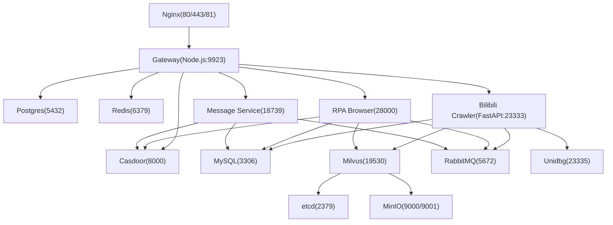
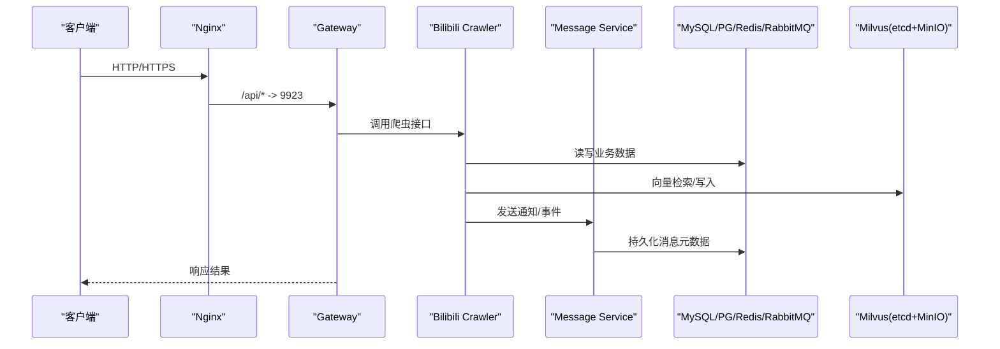
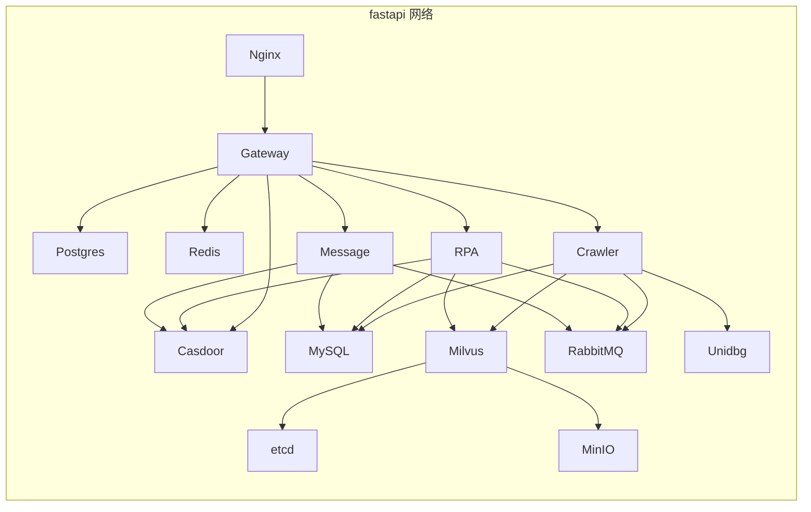

# Docker Compose 配置详解

<cite>
**本文引用的文件**
- [docker-compose.yml](file://docker-compose.yml)
- [dc-dev.yml](file://dc-dev.yml)
- [.env.example](file://.env.example)
- [.env](file://.env)
- [Makefile](file://Makefile)
- [nginx.conf](file://docker_vol/nginx/conf/nginx.conf)
- [models.ini](file://docker_vol/llama/models.ini)
</cite>

## 目录
1. [简介](#简介)
2. [项目结构](#项目结构)
3. [核心组件](#核心组件)
4. [架构总览](#架构总览)
5. [详细组件分析](#详细组件分析)
6. [依赖关系与网络](#依赖关系与网络)
7. [性能与资源限制](#性能与资源限制)
8. [健康检查与重启策略](#健康检查与重启策略)
9. [开发环境与生产环境差异](#开发环境与生产环境差异)
10. [故障排查指南](#故障排查指南)
11. [结论](#结论)

## 简介
本文件对项目的 Docker Compose 编排进行系统化说明，覆盖 etcd、minio、milvus、mysql、redis、rabbitmq、unidbg、be-bilibili-crawler、postgres、gateway、casdoor、rpa-browser、be-message-service、llama_cpp、nginx 等服务的配置项、环境变量、端口映射、数据卷挂载、服务依赖和网络设置。同时提供开发与生产环境的差异化建议（资源限制、健康检查、重启策略），并给出常见问题的定位方法。

## 项目结构
- 统一编排入口：docker-compose.yml
- 开发精简编排：dc-dev.yml（仅包含常用中间件与关键服务）
- 环境变量模板与实例：.env.example、.env
- 运维辅助：Makefile（一键启动/停止/日志/清理）
- 反向代理与静态资源：docker_vol/nginx/conf/nginx.conf
- LLM 模型预设：docker_vol/llama/models.ini

图表来源
- [docker-compose.yml:1-380](file://docker-compose.yml#L1-L380)
- [nginx.conf:1-71](file://docker_vol/nginx/conf/nginx.conf#L1-L71)

章节来源
- [docker-compose.yml:1-380](file://docker-compose.yml#L1-L380)
- [dc-dev.yml:1-213](file://dc-dev.yml#L1-L213)
- [.env.example:1-65](file://.env.example#L1-L65)
- [.env:1-59](file://.env#L1-L59)
- [Makefile:1-71](file://Makefile#L1-L71)

## 核心组件
- 存储与缓存
  - MySQL：业务主库（爬虫、消息服务）
  - PostgreSQL：PPTR/网关相关数据
  - Redis：缓存与会话
  - MinIO + etcd：Milvus 向量数据库的元数据与对象存储
- 消息与任务
  - RabbitMQ：异步消息与 RPC
- 认证与授权
  - Casdoor：OAuth2/OIDC 身份管理
- 应用服务
  - be-bilibili-crawler：核心爬虫后端（FastAPI）
  - RPA-Browser：浏览器自动化（Playwright）
  - be-message-service：统一消息推送（FastStream）
  - Gateway：Node.js 网关（Express）
  - Unidbg：签名计算服务
- AI 推理
  - llama.cpp：CPU/GPU 两种镜像，支持本地模型推理
- 反向代理
  - Nginx：对外暴露 80/443/81，转发到各内部服务

章节来源
- [docker-compose.yml:1-380](file://docker-compose.yml#L1-L380)
- [.env.example:1-65](file://.env.example#L1-L65)

## 架构总览
系统通过 Nginx 作为统一入口，将前端请求、API 请求和第三方回调分别路由至对应服务；业务服务之间通过 MySQL、Redis、RabbitMQ、PostgreSQL、Milvus 等基础设施协作；Casdoor 提供统一的认证能力；llama.cpp 提供本地大模型推理能力。

图表来源
- [docker-compose.yml:1-380](file://docker-compose.yml#L1-L380)
- [nginx.conf:1-71](file://docker_vol/nginx/conf/nginx.conf#L1-L71)

## 详细组件分析

### etcd
- 作用：Milvus 的元数据存储
- 关键配置
  - 自动压缩模式与保留条数、配额、快照计数
  - 数据目录挂载至 docker_vol/milvus/etcd
  - 健康检查使用 etcdctl endpoint health
- 端口：2379（容器内）
- 依赖：无
- 重启策略：unless-stopped

章节来源
- [docker-compose.yml:2-20](file://docker-compose.yml#L2-L20)

### minio
- 作用：Milvus 的对象存储
- 关键配置
  - 访问密钥与密钥
  - 控制台地址 9001，数据目录挂载至 docker_vol/milvus/minio
  - 健康检查访问 /minio/health/live
- 端口：9000（API）、9001（控制台）
- 依赖：无
- 重启策略：unless-stopped

章节来源
- [docker-compose.yml:21-40](file://docker-compose.yml#L21-L40)

### milvus (standalone)
- 作用：向量数据库
- 关键配置
  - 连接 etcd 与 minio
  - MQ 类型 woodpecker
  - 安全选项 seccomp:unconfined
  - 数据目录挂载至 docker_vol/milvus/data
  - 健康检查 /healthz
- 端口：19530（gRPC）、9091（HTTP）
- 依赖：etcd、minio
- 重启策略：unless-stopped

章节来源
- [docker-compose.yml:41-67](file://docker-compose.yml#L41-L67)

### mysql
- 作用：业务主库（爬虫、消息服务）
- 关键配置
  - 根密码与环境时区
  - 配置文件与数据目录挂载
- 端口：3306（由 .env 变量映射）
- 依赖：无
- 重启策略：unless-stopped

章节来源
- [docker-compose.yml:68-81](file://docker-compose.yml#L68-L81)
- [.env.example:1-65](file://.env.example#L1-L65)

### redis
- 作用：缓存与会话
- 关键配置
  - 时区
  - 数据目录挂载
- 端口：6379（由 .env 变量映射）
- 依赖：无
- 重启策略：unless-stopped

章节来源
- [docker-compose.yml:82-93](file://docker-compose.yml#L82-L93)
- [.env.example:1-65](file://.env.example#L1-L65)

### rabbitmq
- 作用：消息队列与 RPC
- 关键配置
  - 默认用户与密码、时区
  - 数据与日志目录挂载
- 端口：5672（AMQP）、15672（管理界面）
- 依赖：无
- 重启策略：unless-stopped

章节来源
- [docker-compose.yml:94-109](file://docker-compose.yml#L94-L109)
- [.env.example:1-65](file://.env.example#L1-L65)

### unidbg
- 作用：签名计算服务
- 关键配置
  - 时区
- 端口：23335（由 .env 变量映射）
- 依赖：无
- 重启策略：unless-stopped

章节来源
- [docker-compose.yml:110-119](file://docker-compose.yml#L110-L119)
- [.env.example:1-65](file://.env.example#L1-L65)

### be-bilibili-crawler
- 作用：核心爬虫后端（FastAPI）
- 关键配置
  - 依赖：mysql、redis、rabbitmq、unidbg、milvus、message-service
  - 环境变量：数据库、缓存、消息、向量库、消息服务地址、LLM API 列表、代理、开发标志、日志开关等
  - 构建：多阶段目标 crawler
  - 卷：源码热更新、node_modules 保护、日志目录
  - 端口：23333（由 .env 变量映射）
  - 资源限制：内存上限 5G
- 重启策略：unless-stopped

章节来源
- [docker-compose.yml:120-164](file://docker-compose.yml#L120-L164)
- [.env.example:1-65](file://.env.example#L1-L65)
- [.env:1-59](file://.env#L1-L59)

### postgres
- 作用：PPTR/网关相关数据
- 关键配置
  - 用户、密码、时区
  - 数据目录挂载
- 端口：5432（由 .env 变量映射）
- 依赖：无
- 重启策略：unless-stopped

章节来源
- [docker-compose.yml:165-178](file://docker-compose.yml#L165-L178)
- [.env.example:1-65](file://.env.example#L1-L65)

### gateway
- 作用：Node.js 网关（Express）
- 关键配置
  - 依赖：postgres、redis、casdoor
  - 构建：多阶段目标 prod
  - 卷：命名卷保存 node_modules、源码热更新
  - 端口：9923（由 .env 变量映射）
  - 环境变量：数据库连接、Redis、上游服务 URI、Casdoor 配置、时区
- 重启策略：unless-stopped

章节来源
- [docker-compose.yml:179-212](file://docker-compose.yml#L179-L212)
- [.env.example:1-65](file://.env.example#L1-L65)
- [.env:1-59](file://.env#L1-L59)

### casdoor
- 作用：统一身份认证（OAuth2/OIDC）
- 关键配置
  - 镜像版本 latest
  - 配置文件挂载
  - 依赖：postgres
  - 端口：8000（由 .env 变量映射）
- 重启策略：unless-stopped

章节来源
- [docker-compose.yml:213-226](file://docker-compose.yml#L213-L226)
- [.env.example:1-65](file://.env.example#L1-L65)

### rpa-browser
- 作用：浏览器自动化（Playwright）
- 关键配置
  - 依赖：postgres、redis、rabbitmq、casdoor
  - 卷：源码子目录、迁移脚本、Chromium 运行期缓存
  - 端口：28000（由 .env 变量映射）
  - 环境变量：MySQL 连接、控制器路径、代理、Gemini Key、RabbitMQ URL、消息配置、服务器标识、时区
- 重启策略：unless-stopped

章节来源
- [docker-compose.yml:227-260](file://docker-compose.yml#L227-L260)
- [.env.example:1-65](file://.env.example#L1-L65)
- [.env:1-59](file://.env#L1-L59)

### be-message-service
- 作用：统一消息推送（FastStream）
- 关键配置
  - 依赖：rabbitmq、mysql、casdoor
  - 卷：源码、迁移脚本、GeoIP mmdb
  - 端口：18739（由 .env 变量映射）
  - 环境变量：RabbitMQ URL、日志等级、消息主库、PPTR Postgres 直连、消息配置、Casdoor 配置、管理员账号、GeoIP 目录、时区
  - 健康检查：/health 校验 broker 连通性
- 重启策略：unless-stopped

章节来源
- [docker-compose.yml:261-322](file://docker-compose.yml#L261-L322)
- [.env.example:1-65](file://.env.example#L1-L65)
- [.env:1-59](file://.env#L1-L59)

### llama_cpp
- 作用：本地大模型推理（CPU）
- 关键配置
  - 镜像：ggml-org/llama.cpp:server
  - 卷：模型预设 models.ini、HuggingFace 缓存
  - 端口：8080（由 .env 变量映射）
  - 环境变量：模型预设路径、最大并发、HF 镜像端点
- 重启策略：unless-stopped

章节来源
- [docker-compose.yml:323-337](file://docker-compose.yml#L323-L337)
- [models.ini:1-11](file://docker_vol/llama/models.ini#L1-L11)
- [.env.example:1-65](file://.env.example#L1-L65)

### llama_cpp_gpu_cuda
- 作用：本地大模型推理（CUDA GPU）
- 关键配置
  - 镜像：ggml-org/llama.cpp:server-cuda13
  - 资源预留：所有 NVIDIA GPU
  - 卷：GPU 模型缓存
  - 环境变量：主机与端口、模型名称与下载链接
  - 端口：12000
- 重启策略：unless-stopped

章节来源
- [docker-compose.yml:338-356](file://docker-compose.yml#L338-L356)

### nginx
- 作用：反向代理与静态资源
- 关键配置
  - 镜像：nginx:stable-alpine
  - 端口：80、443、81
  - 卷：配置文件、证书、静态页面、日志
  - 路由：/casdoor/*、/api/*、/、81 端口全部转发
- 重启策略：unless-stopped

章节来源
- [docker-compose.yml:357-371](file://docker-compose.yml#L357-L371)
- [nginx.conf:1-71](file://docker_vol/nginx/conf/nginx.conf#L1-L71)

## 依赖关系与网络
- 服务间通信基于 Docker 自定义网络 fastapi（bridge），启用 IPv6
- 服务通过容器名互相发现（如 mysql、redis、rabbitmq、postgres、casdoor、standalone）
- 外部访问通过 Nginx 暴露 80/443/81，内部服务端口通过 .env 变量映射到宿主机
- extra_hosts 注入 host.docker.internal 以允许容器访问宿主网络（用于调试或代理）

图表来源
- [docker-compose.yml:372-380](file://docker-compose.yml#L372-L380)

章节来源
- [docker-compose.yml:372-380](file://docker-compose.yml#L372-L380)

## 性能与资源限制
- 资源限制
  - be-bilibili-crawler：内存限制 5G（deploy.resources.limits.memory）
  - llama_cpp_gpu_cuda：预留所有 NVIDIA GPU（devices.reservations.devices）
- 建议
  - 为高负载服务（crawler、rpa-browser、message-service）增加 CPU 与内存限制
  - 为 Milvus 与 MinIO 分配足够磁盘空间与 IOPS
  - 为 MySQL/PostgreSQL 调整缓冲池与连接数（通过挂载 conf.d 或环境变量）
  - 为 RabbitMQ 开启持久化与内存水位线调优
  - 为 Redis 设置 maxmemory 与淘汰策略

[本节为通用指导，不直接分析具体文件]

## 健康检查与重启策略
- 健康检查
  - etcd：etcdctl endpoint health
  - minio：curl /minio/health/live
  - milvus：curl /healthz
  - message-service：/health 校验 broker 连通性
- 重启策略
  - 所有服务均使用 unless-stopped，保证异常退出后自动恢复
- 建议
  - 为更多服务添加健康检查（如 mysql、redis、rabbitmq、postgres、gateway、rpa-browser）
  - 合理设置 start_period、interval、timeout、retries，避免误判
  - 结合 depends_on 与 healthcheck 确保依赖就绪后再启动

章节来源
- [docker-compose.yml:14-18](file://docker-compose.yml#L14-L18)
- [docker-compose.yml:34-38](file://docker-compose.yml#L34-L38)
- [docker-compose.yml:54-59](file://docker-compose.yml#L54-L59)
- [docker-compose.yml:310-322](file://docker-compose.yml#L310-L322)

## 开发环境与生产环境差异
- 开发环境（dc-dev.yml）
  - 仅包含常用中间件与关键服务（etcd、minio、standalone、mysql、redis、rabbitmq、postgres、gateway、casdoor、message-service、llama_cpp）
  - 简化了部分服务（如未包含 crawler、rpa-browser、nginx、llama_cpp_gpu_cuda）
  - 便于快速启动与调试
- 生产环境（docker-compose.yml）
  - 完整服务集，包含 crawler、rpa-browser、nginx、llama_cpp_gpu_cuda
  - 更严格的资源限制与健康检查
  - 建议使用独立的环境变量文件与密钥管理
- 差异要点
  - 端口映射：生产环境需固定端口并避免冲突
  - 数据卷：生产环境需备份与监控
  - 日志：生产环境建议集中收集与轮转
  - 安全：最小权限、只读卷、网络隔离

章节来源
- [dc-dev.yml:1-213](file://dc-dev.yml#L1-L213)
- [docker-compose.yml:1-380](file://docker-compose.yml#L1-L380)

## 故障排查指南
- 常见问题
  - Milvus 无法读写：检查 docker_vol/milvus/data 权限（UID/GID 999）
  - WSL2 网络问题：重启 winnat
  - Nginx 无法转发：检查 host.docker.internal 可达性与端口映射
  - Casdoor 回调失败：确认 CASDOOR_REDIRECT_URI 与域名一致
  - RabbitMQ 连接失败：检查用户名、密码与端口
  - Message Service 健康检查失败：检查 /health 返回码与 broker 连通性
- 定位步骤
  - 使用 make logs [SERVICE] 查看服务日志
  - 使用 make ps 检查容器状态
  - 使用 docker exec 进入容器验证端口与服务
  - 检查 .env 中的端口与地址是否与 nginx 路由一致

章节来源
- [README.md:116-121](file://README.md#L116-L121)
- [Makefile:42-48](file://Makefile#L42-L48)
- [docker-compose.yml:310-322](file://docker-compose.yml#L310-L322)

## 结论
本项目通过 Docker Compose 实现了微服务化编排，涵盖数据采集、RPA、消息推送、认证、向量检索与本地推理等关键能力。合理的健康检查、资源限制与重启策略是保障稳定运行的基础。建议在生产环境中完善健康检查、日志收集、备份策略与安全加固，并根据实际负载调整资源与参数。