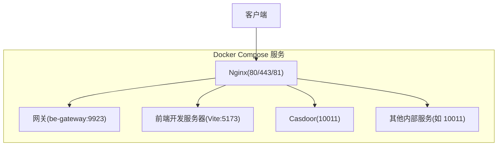
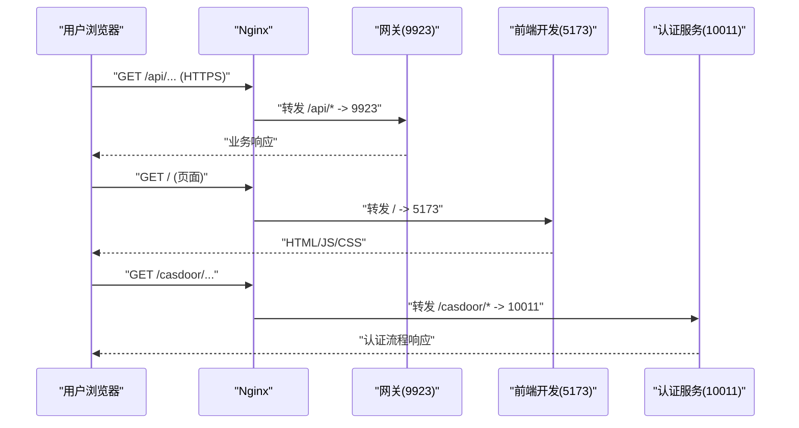
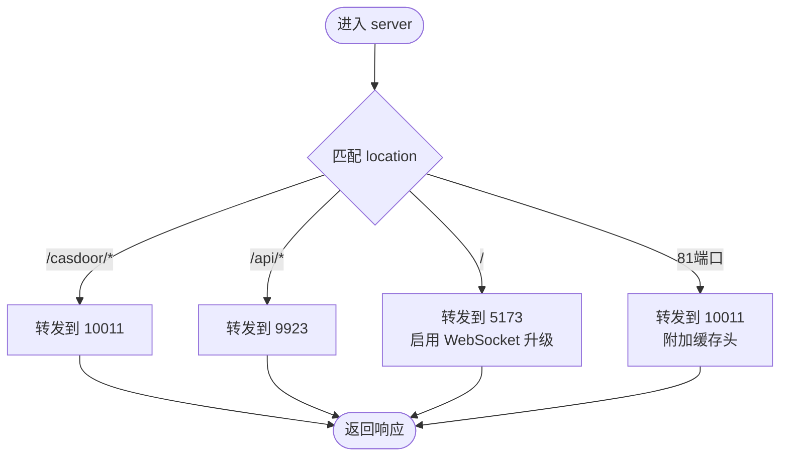
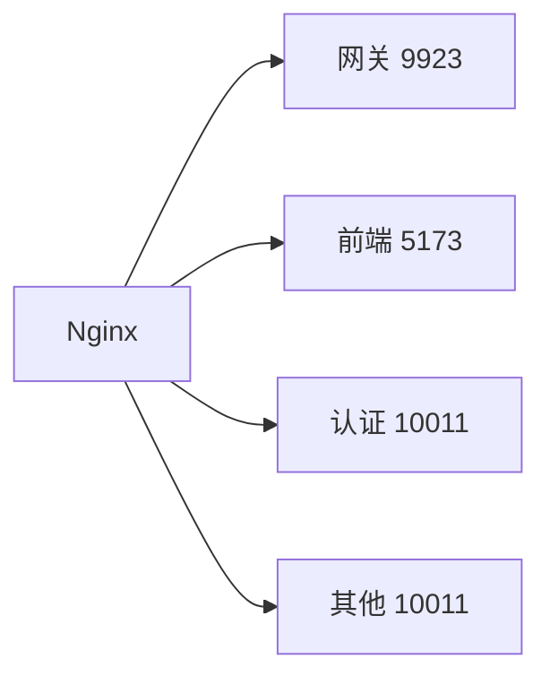

# Nginx 反向代理配置

<cite>
**本文引用的文件**
- [docker-compose.yml](file://docker-compose.yml)
- [nginx.conf](file://docker_vol/nginx/conf/nginx.conf)
- [goaccess.conf](file://docker_vol/goaccess/goaccess.conf)
</cite>

## 目录
1. [简介](#简介)
2. [项目结构](#项目结构)
3. [核心组件](#核心组件)
4. [架构总览](#架构总览)
5. [详细组件分析](#详细组件分析)
6. [依赖关系分析](#依赖关系分析)
7. [性能与优化](#性能与优化)
8. [故障排查指南](#故障排查指南)
9. [结论](#结论)
10. [附录](#附录)

## 简介
本文件围绕 Nginx 反向代理在容器化环境中的部署与配置进行系统化说明，重点解析 Docker Compose 中 Nginx 容器的编排方式以及 nginx.conf 的反向代理规则。文档涵盖域名绑定、请求转发、静态资源托管、日志与报表、HTTPS/TLS 证书挂载、安全头设置、访问控制与性能优化等主题，并提供可操作的实践建议与排错指引。

## 项目结构
Nginx 在本项目中以独立服务形式运行，通过 Docker Compose 编排，配置文件与证书、静态资源、日志均通过卷挂载到宿主机，便于热更新与持久化。

图表来源
- [docker-compose.yml:357-371](file://docker-compose.yml#L357-L371)
- [nginx.conf:9-48](file://docker_vol/nginx/conf/nginx.conf#L9-L48)

章节来源
- [docker-compose.yml:357-371](file://docker-compose.yml#L357-L371)
- [nginx.conf:9-48](file://docker_vol/nginx/conf/nginx.conf#L9-L48)

## 核心组件
- Nginx 容器：对外暴露 80、443、81 端口；挂载配置、证书、静态资源与日志目录。
- 反向代理规则：按路径将请求转发至网关、前端开发服务器、认证服务等后端。
- 日志与报表：通过 GoAccess 对 Nginx 访问日志进行分析并生成报告。

章节来源
- [docker-compose.yml:357-371](file://docker-compose.yml#L357-L371)
- [nginx.conf:9-68](file://docker_vol/nginx/conf/nginx.conf#L9-L68)
- [goaccess.conf:1-17](file://docker_vol/goaccess/goaccess.conf#L1-L17)

## 架构总览
Nginx 作为统一入口，承担以下职责：
- 域名绑定与协议处理（HTTP/HTTPS）
- 基于 location 的请求路由（API、前端、认证）
- 透传关键请求头（Host、X-Forwarded-*、自定义 x-bili-*）
- 可选的缓存与静态资源托管
- 日志采集与可视化报表

图表来源
- [nginx.conf:22-48](file://docker_vol/nginx/conf/nginx.conf#L22-L48)
- [docker-compose.yml:357-371](file://docker-compose.yml#L357-L371)

## 详细组件分析

### Nginx 容器编排（Docker Compose）
- 镜像与端口：使用稳定版 Alpine 镜像，映射 80、443、81 端口。
- 卷挂载：
  - 配置：./docker_vol/nginx/conf/nginx.conf:/etc/nginx/nginx.conf:ro
  - 证书：./docker_vol/nginx/cert:/etc/nginx/cert:ro
  - 静态资源：./docker_vol/nginx/html:/usr/share/nginx/html
  - 日志：./docker_vol/nginx/logs:/var/log/nginx
- 网络与重启策略：默认桥接网络，自动重启。

章节来源
- [docker-compose.yml:357-371](file://docker-compose.yml#L357-L371)

### 反向代理规则与域名绑定
- 监听与域名：
  - 同时监听 IPv4/IPv6 的 80、443 端口，server_name 设置为动态域名。
  - 额外提供 81 端口用于特定场景的内部转发。
- 请求头透传：
  - Host、X-Forwarded-Proto、X-Real-IP、X-Forwarded-For 等标准头。
  - 自定义 x-bili-ip、x-bili-forward、x-bili-protocol 供后端识别来源与协议。
- 路由规则：
  - /casdoor/*：转发至 host.docker.internal:10011，用于认证流程。
  - /api/*：转发至 host.docker.internal:9923（网关）。
  - /：默认转发至 host.docker.internal:5173（前端开发服务器），并开启 WebSocket 升级支持以适配 Vite HMR。
  - 81 端口：将所有请求转发至 host.docker.internal:10011，并附加 X-Cache 响应头以便观察缓存命中状态。

图表来源
- [nginx.conf:9-68](file://docker_vol/nginx/conf/nginx.conf#L9-L68)

章节来源
- [nginx.conf:9-68](file://docker_vol/nginx/conf/nginx.conf#L9-L68)

### SSL/TLS 证书配置
- 证书目录挂载：cert 目录已挂载至容器内 /etc/nginx/cert，但当前 nginx.conf 未启用 ssl_certificate/ssl_certificate_key。
- 建议做法：
  - 在对应 server 块中添加 listen 443 ssl 与证书路径配置。
  - 强制 HTTPS 跳转：在 80 端口 server 块中对所有请求 301 重定向到 https。
  - 推荐启用 TLS 1.2/1.3、合适的密码套件与会话复用参数。
- 注意事项：
  - 若后端为 HTTP，需确保 proxy_pass 目标地址与协议一致。
  - 如需后端也走 HTTPS，请根据实际服务调整 proxy_ssl_* 相关参数。

章节来源
- [docker-compose.yml:365-368](file://docker-compose.yml#L365-L368)
- [nginx.conf:13-15](file://docker_vol/nginx/conf/nginx.conf#L13-L15)

### 静态资源托管
- 静态目录挂载：html 目录已挂载至 /usr/share/nginx/html，可用于放置静态资源或报告页面。
- 建议：
  - 对静态资源启用 gzip/brotli 压缩与长缓存头（Cache-Control）。
  - 针对图片、字体等资源设置合理的 expires 与 etag。
  - 结合 CDN 时注意缓存失效与回源策略。

章节来源
- [docker-compose.yml:366-368](file://docker-compose.yml#L366-L368)

### 日志与报表
- Nginx 访问日志：默认输出至容器内 /var/log/nginx，并通过卷挂载到宿主机的 docker_vol/nginx/logs。
- GoAccess 报表：
  - 日志格式：COMBINED
  - 输入：/srv/logs/access.log
  - 输出：/srv/report/report.html（实时 HTML 报表）
  - 地理信息：加载 ASN、城市、国家库以提升报表可读性
- 建议：
  - 定期轮转与归档访问日志，避免磁盘占用过大。
  - 在生产环境关闭实时刷新或限制访问权限，防止敏感信息泄露。

章节来源
- [docker-compose.yml:369](file://docker-compose.yml#L369-L369)
- [goaccess.conf:1-17](file://docker_vol/goaccess/goaccess.conf#L1-L17)

### 安全头与访问控制最佳实践
- 安全头建议：
  - Strict-Transport-Security（HSTS）：强制 HTTPS。
  - Content-Security-Policy（CSP）：限制资源加载来源。
  - X-Frame-Options/X-Content-Type-Options：防点击劫持与 MIME 嗅探。
  - Referrer-Policy：控制 Referer 信息。
- 访问控制：
  - 对管理接口或敏感路径使用 IP 白名单或基础认证。
  - 对 WebSocket 连接限制来源与频率，防止滥用。
- 限流与防护：
  - 使用 limit_req/limit_conn 限制请求与连接数。
  - 结合 WAF 或上游网关实现更细粒度的安全防护。

章节来源
- [nginx.conf:16-20](file://docker_vol/nginx/conf/nginx.conf#L16-L20)
- [nginx.conf:54-68](file://docker_vol/nginx/conf/nginx.conf#L54-L68)

### 负载均衡与高可用
- 当前配置未定义 upstream 与负载均衡策略。
- 建议：
  - 对网关或 API 服务定义 upstream，并配置健康检查与权重。
  - 多实例部署时启用 keepalive 减少握手开销。
  - 结合 DNS 或外部负载均衡器实现跨节点高可用。

章节来源
- [nginx.conf:30-35](file://docker_vol/nginx/conf/nginx.conf#L30-L35)

## 依赖关系分析
Nginx 依赖的后端服务及其端口如下：
- 网关（be-gateway）：9923
- 前端开发服务器（Vite）：5173
- 认证服务（Casdoor）：10011
- 其他内部服务：10011（81 端口场景）

图表来源
- [nginx.conf:22-48](file://docker_vol/nginx/conf/nginx.conf#L22-L48)
- [nginx.conf:50-68](file://docker_vol/nginx/conf/nginx.conf#L50-L68)

章节来源
- [nginx.conf:22-48](file://docker_vol/nginx/conf/nginx.conf#L22-L48)
- [nginx.conf:50-68](file://docker_vol/nginx/conf/nginx.conf#L50-L68)

## 性能与优化
- 工作进程与连接：
  - worker_processes auto；worker_connections 1024；accept_mutex on。
  - 可根据 CPU 核数与负载调优 worker_processes 与 worker_connections。
- 传输与缓存：
  - 对静态资源启用 gzip/brotli 压缩与长缓存。
  - 合理设置 proxy_cache 与缓存键，避免频繁回源。
- 连接复用：
  - 启用 keepalive 以减少与后端的 TCP 握手成本。
- 日志与监控：
  - 使用 GoAccess 实时监控访问趋势与错误率。
  - 结合系统监控（CPU、内存、磁盘 I/O）评估瓶颈。

章节来源
- [nginx.conf:1-8](file://docker_vol/nginx/conf/nginx.conf#L1-L8)
- [nginx.conf:54-68](file://docker_vol/nginx/conf/nginx.conf#L54-L68)
- [goaccess.conf:1-17](file://docker_vol/goaccess/goaccess.conf#L1-L17)

## 故障排查指南
- 无法访问 443 端口：
  - 确认已正确挂载证书并在 server 块中启用 ssl。
  - 检查防火墙与安全组是否放行 443。
- 前端 HMR 不生效：
  - 确认已启用 WebSocket 升级（Upgrade/Connection 头）。
  - 检查浏览器控制台是否有跨域或连接失败错误。
- 认证回调异常：
  - 核对 /casdoor/* 转发目标端口与路径是否正确。
  - 检查 Casdoor 服务可达性与回调地址配置。
- 日志为空或报表无数据：
  - 确认 Nginx 访问日志路径与 GoAccess 输入路径一致。
  - 检查日志轮转与权限设置。

章节来源
- [nginx.conf:44-48](file://docker_vol/nginx/conf/nginx.conf#L44-L48)
- [nginx.conf:22-28](file://docker_vol/nginx/conf/nginx.conf#L22-L28)
- [goaccess.conf:1-17](file://docker_vol/goaccess/goaccess.conf#L1-L17)

## 结论
本项目通过 Nginx 实现了统一的反向代理入口，按路径将请求分发至网关、前端与认证服务，并提供了日志与报表能力。当前配置侧重于开发与调试场景，生产环境建议完善 HTTPS、安全头、缓存与限流策略，并结合上游服务的负载均衡与健康检查提升整体稳定性与安全性。

## 附录
- 环境变量与端口映射参考：
  - 网关端口：9923
  - 前端开发端口：5173
  - 认证服务端口：10011
  - Nginx 对外端口：80、443、81
- 常用命令：
  - 验证 Nginx 配置语法：nginx -t
  - 重载配置：nginx -s reload
  - 查看访问日志：tail -f /var/log/nginx/access.log

章节来源
- [docker-compose.yml:357-371](file://docker-compose.yml#L357-L371)
- [nginx.conf:9-68](file://docker_vol/nginx/conf/nginx.conf#L9-L68)