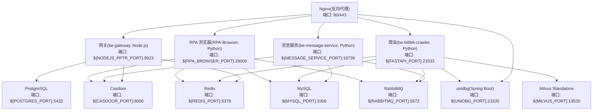
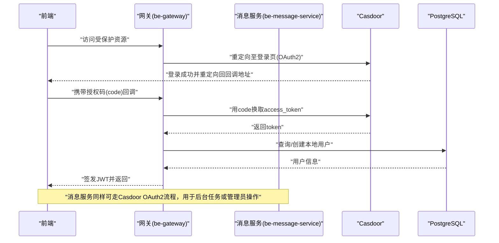
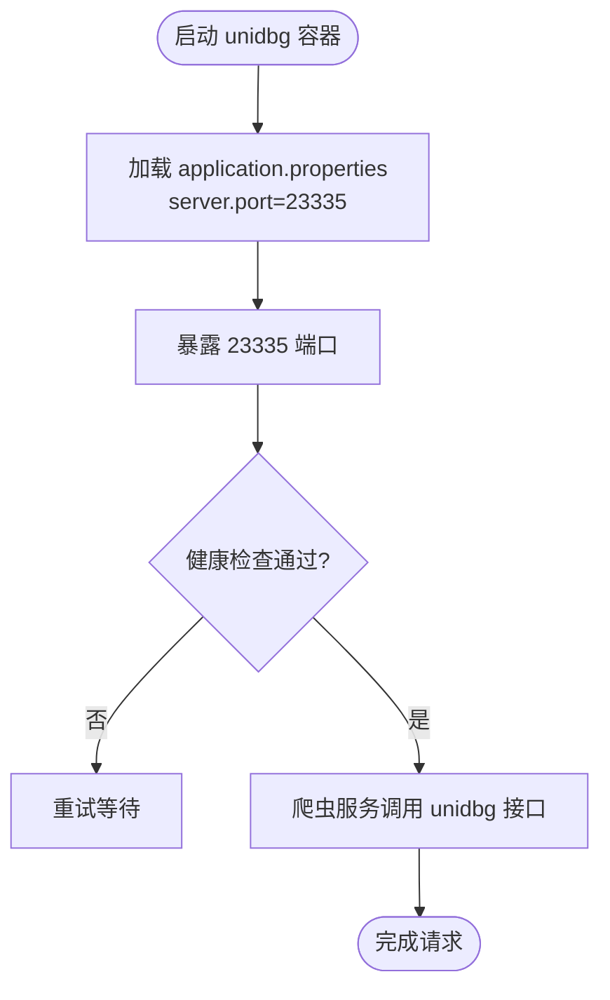
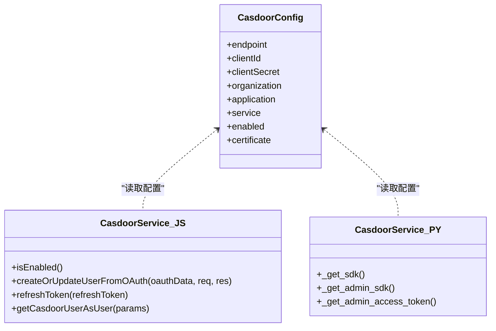
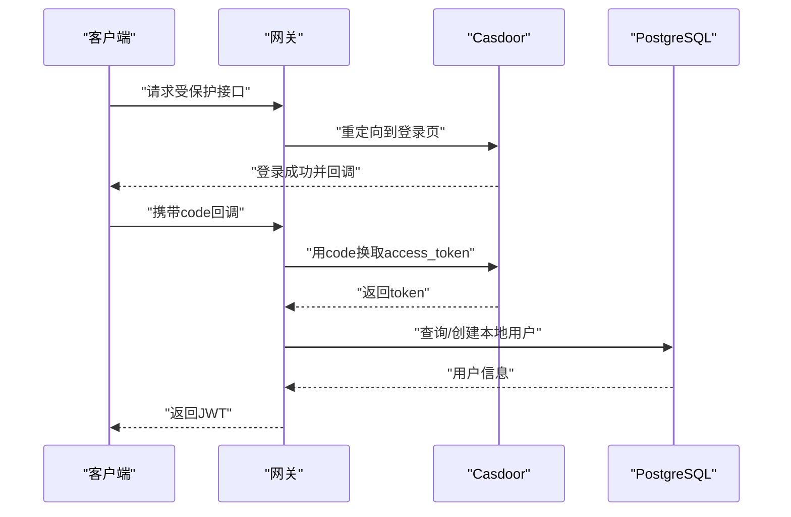
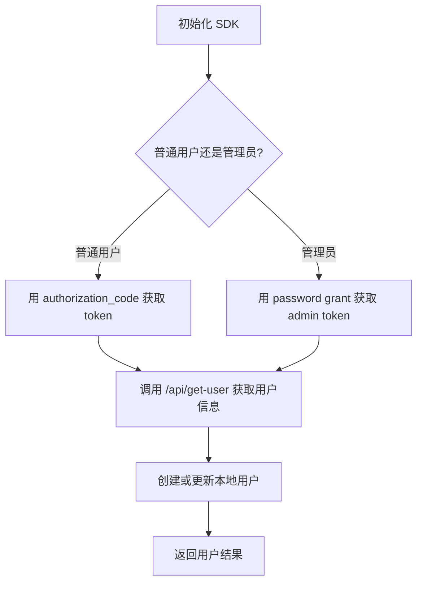
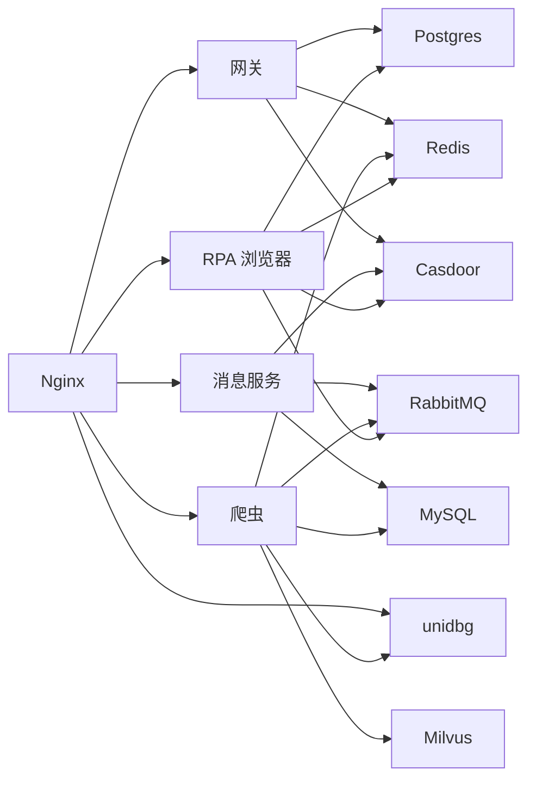

# 代理认证服务配置

<cite>
**本文引用的文件**
- [docker-compose.yml](file://docker-compose.yml)
- [dc-dev.yml](file://dc-dev.yml)
- [unidbgSpringBoot/docker-compose.yml](file://unidbgSpringBoot/docker-compose.yml)
- [unidbgSpringBoot/src/main/resources/application.properties](file://unidbgSpringBoot/src/main/resources/application.properties)
- [unidbgSpringBoot/pom.xml](file://unidbgSpringBoot/pom.xml)
- [Dockerfile.mono](file://Dockerfile.mono)
- [be-gateway/ExpressServerEnd/config/casdoor_config.js](file://be-gateway/ExpressServerEnd/config/casdoor_config.js)
- [be-gateway/ExpressServerEnd/Service/casdoor_module/CasdoorService.js](file://be-gateway/ExpressServerEnd/Service/casdoor_module/CasdoorService.js)
- [be-message-service/app/services/user/casdoor_service.py](file://be-message-service/app/services/user/casdoor_service.py)
- [be-message-service/app/models/casdoor.py](file://be-message-service/app/models/casdoor.py)
- [Vue3FrontEndDemoExercise/src/api/community/hey-api/services/PptrUserGatewayService.gen.ts](file://Vue3FrontEndDemoExercise/src/api/community/hey-api/services/PptrUserGatewayService.gen.ts)
</cite>

## 目录
1. [简介](#简介)
2. [项目结构](#项目结构)
3. [核心组件](#核心组件)
4. [架构总览](#架构总览)
5. [详细组件分析](#详细组件分析)
6. [依赖关系分析](#依赖关系分析)
7. [性能考虑](#性能考虑)
8. [故障排查指南](#故障排查指南)
9. [结论](#结论)
10. [附录](#附录)

## 简介
本文件聚焦“代理认证服务”的容器化与集成配置，围绕以下目标展开：
- 解析 unidbg（Java Spring Boot）与 Casdoor（身份认证）在 Docker Compose 中的部署与依赖关系。
- 说明 Java Spring Boot 应用的容器化方式、端口映射、配置文件挂载及与其他服务的依赖。
- 详细说明 Casdoor 的身份认证配置、OAuth2 集成、数据库连接与用户管理流程。
- 提供安全配置、证书管理与访问控制的实践建议。

## 项目结构
整体编排通过 docker-compose.yml 统一拉起多个服务：Casdoor、Postgres、Redis、RabbitMQ、MySQL、Milvus、Nginx、网关（Node.js）、消息服务（Python）、爬虫服务（Python）、RPA 浏览器服务（Python）、unidbg（Java Spring Boot）等。开发环境使用 dc-dev.yml 精简部分组件。

图表来源
- [docker-compose.yml:110-126](file://docker-compose.yml#L110-L126)
- [docker-compose.yml:165-226](file://docker-compose.yml#L165-L226)
- [docker-compose.yml:227-309](file://docker-compose.yml#L227-L309)
- [docker-compose.yml:357-371](file://docker-compose.yml#L357-L371)

章节来源
- [docker-compose.yml:1-380](file://docker-compose.yml#L1-L380)
- [dc-dev.yml:1-213](file://dc-dev.yml#L1-L213)

## 核心组件
- unidbg（Spring Boot）：提供逆向接口能力，容器暴露 23335 端口，由爬虫服务调用。
- Casdoor：统一的 OAuth2 身份认证服务，存储于 Postgres，被网关、消息服务、RPA 浏览器等服务集成。
- 网关（be-gateway）：Node.js 应用，负责路由、鉴权、与后端各服务交互，并集成 Casdoor。
- 消息服务（be-message-service）：Python FastAPI 服务，集成 Casdoor 进行用户信息获取与管理。
- 其他基础设施：MySQL、Redis、RabbitMQ、Postgres、Milvus、Nginx。

章节来源
- [docker-compose.yml:110-126](file://docker-compose.yml#L110-L126)
- [docker-compose.yml:179-226](file://docker-compose.yml#L179-L226)
- [docker-compose.yml:261-309](file://docker-compose.yml#L261-L309)

## 架构总览
下图展示认证相关的关键交互：前端通过网关或消息服务发起登录，网关重定向到 Casdoor；登录成功后回调处理，换取 token，校验 JWT，创建或更新本地用户，返回会话令牌给前端。

图表来源
- [be-gateway/ExpressServerEnd/Service/casdoor_module/CasdoorService.js:349-379](file://be-gateway/ExpressServerEnd/Service/casdoor_module/CasdoorService.js#L349-L379)
- [be-message-service/app/services/user/casdoor_service.py:50-111](file://be-message-service/app/services/user/casdoor_service.py#L50-L111)
- [docker-compose.yml:179-226](file://docker-compose.yml#L179-L226)

## 详细组件分析

### unidbg（Spring Boot）容器化与配置
- 镜像构建：通过 Maven 插件将 Spring Boot 应用打包为镜像，镜像名为 unidbg-springboot-samsclub。
- 运行端口：application.properties 中 server.port=23335；Compose 中将宿主机端口映射为 ${UNIDBG_PORT}:23335。
- 依赖关系：爬虫服务 be-bilibili-crawler 通过环境变量 UNIDBG_HOST 指向 unidbg 容器，并在启动时依赖其就绪。
- 独立 Compose：unidbgSpringBoot/docker-compose.yml 仅暴露端口与镜像名，便于单独调试。

图表来源
- [unidbgSpringBoot/src/main/resources/application.properties:1-4](file://unidbgSpringBoot/src/main/resources/application.properties#L1-L4)
- [unidbgSpringBoot/pom.xml:69-80](file://unidbgSpringBoot/pom.xml#L69-L80)
- [docker-compose.yml:110-119](file://docker-compose.yml#L110-L119)
- [unidbgSpringBoot/docker-compose.yml:1-6](file://unidbgSpringBoot/docker-compose.yml#L1-L6)

章节来源
- [unidbgSpringBoot/src/main/resources/application.properties:1-4](file://unidbgSpringBoot/src/main/resources/application.properties#L1-L4)
- [unidbgSpringBoot/pom.xml:69-80](file://unidbgSpringBoot/pom.xml#L69-L80)
- [docker-compose.yml:110-119](file://docker-compose.yml#L110-L119)
- [unidbgSpringBoot/docker-compose.yml:1-6](file://unidbgSpringBoot/docker-compose.yml#L1-L6)

### Casdoor 身份认证服务配置
- 容器与依赖：casdoor 容器基于 casbin/casdoor:latest，端口映射 ${CASDOOR_PORT}:8000，数据持久化通过挂载 app.conf；依赖 Postgres 作为数据存储。
- 环境变量：网关与消息服务通过 CASDOOR_ENDPOINT、CASDOOR_CLIENT_ID、CASDOOR_CLIENT_SECRET、CASDOOR_ORGANIZATION、CASDOOR_APPLICATION、CASDOOR_REDIRECT_URI、CASDOOR_CERTIFICATE 等变量接入。
- 证书管理：支持从环境变量注入证书内容（换行符转义处理），用于验证 Casdoor 签发的 JWT。
- 用户管理：消息服务使用 SDK 获取 access_token，并通过 /api/get-user 拉取用户信息；管理员模式使用内置 application「app-built-in」与独立 clientId/clientSecret。

图表来源
- [be-gateway/ExpressServerEnd/config/casdoor_config.js:1-19](file://be-gateway/ExpressServerEnd/config/casdoor_config.js#L1-L19)
- [be-gateway/ExpressServerEnd/Service/casdoor_module/CasdoorService.js:349-379](file://be-gateway/ExpressServerEnd/Service/casdoor_module/CasdoorService.js#L349-L379)
- [be-message-service/app/services/user/casdoor_service.py:50-111](file://be-message-service/app/services/user/casdoor_service.py#L50-L111)
- [docker-compose.yml:213-226](file://docker-compose.yml#L213-L226)

章节来源
- [docker-compose.yml:213-226](file://docker-compose.yml#L213-L226)
- [be-gateway/ExpressServerEnd/config/casdoor_config.js:1-19](file://be-gateway/ExpressServerEnd/config/casdoor_config.js#L1-L19)
- [be-gateway/ExpressServerEnd/Service/casdoor_module/CasdoorService.js:349-379](file://be-gateway/ExpressServerEnd/Service/casdoor_module/CasdoorService.js#L349-L379)
- [be-message-service/app/services/user/casdoor_service.py:50-111](file://be-message-service/app/services/user/casdoor_service.py#L50-L111)

### 网关（be-gateway）与 Casdoor 集成
- 配置来源：通过环境变量注入 Casdoor 端点、客户端 ID/密钥、组织与应用名、重定向 URI、证书等。
- 认证流程：网关在需要鉴权时将用户重定向到 Casdoor；登录成功后回调，交换 code 获取 access_token，刷新本地 token，并以 Bearer token 调用 Casdoor 的 /get-user 获取用户信息。
- 错误处理：若用户未绑定凭证或服务端调用失败，抛出明确错误提示重新登录。

图表来源
- [docker-compose.yml:179-212](file://docker-compose.yml#L179-L212)
- [be-gateway/ExpressServerEnd/Service/casdoor_module/CasdoorService.js:349-379](file://be-gateway/ExpressServerEnd/Service/casdoor_module/CasdoorService.js#L349-L379)

章节来源
- [docker-compose.yml:179-212](file://docker-compose.yml#L179-L212)
- [be-gateway/ExpressServerEnd/Service/casdoor_module/CasdoorService.js:349-379](file://be-gateway/ExpressServerEnd/Service/casdoor_module/CasdoorService.js#L349-L379)

### 消息服务（be-message-service）与 Casdoor 集成
- SDK 初始化：根据环境变量创建 AsyncCasdoorSDK，支持普通应用与管理员应用两种模式。
- 管理员 Token：使用 password grant 获取管理员 access_token，进程内缓存并按过期时间刷新。
- 用户模型：定义 OAuth token、JWT 用户信息、API 用户信息等 Pydantic/SQLModel 模型，便于类型标注与 API 交互。

图表来源
- [be-message-service/app/services/user/casdoor_service.py:50-111](file://be-message-service/app/services/user/casdoor_service.py#L50-L111)
- [be-message-service/app/models/casdoor.py:10-49](file://be-message-service/app/models/casdoor.py#L10-L49)

章节来源
- [be-message-service/app/services/user/casdoor_service.py:50-111](file://be-message-service/app/services/user/casdoor_service.py#L50-L111)
- [be-message-service/app/models/casdoor.py:10-49](file://be-message-service/app/models/casdoor.py#L10-L49)

### 前端回调与 OAuth2 集成
- 回调端点：前端通过 /api/v1/user/casdoor/callback 接收 Casdoor 登录成功的授权码，后端处理 code → token → 用户信息 → JWT 的流程。
- 重定向地址：前端回调地址包含 token、uid、user_name 等参数，便于登录后直接跳转业务页面。

章节来源
- [Vue3FrontEndDemoExercise/src/api/community/hey-api/services/PptrUserGatewayService.gen.ts:327-349](file://Vue3FrontEndDemoExercise/src/api/community/hey-api/services/PptrUserGatewayService.gen.ts#L327-L349)

## 依赖关系分析
- 服务间依赖：
  - 网关依赖 Postgres、Redis、Casdoor。
  - 消息服务依赖 RabbitMQ、MySQL、Casdoor。
  - 爬虫服务依赖 MySQL、Redis、RabbitMQ、unidbg、Milvus。
  - RPA 浏览器服务依赖 Postgres、Redis、RabbitMQ、Casdoor。
- 网络与端口：
  - Nginx 对外暴露 80/443/81，内部转发到各服务。
  - 各服务通过环境变量与容器名互通，避免硬编码 IP。

图表来源
- [docker-compose.yml:110-126](file://docker-compose.yml#L110-L126)
- [docker-compose.yml:165-226](file://docker-compose.yml#L165-L226)
- [docker-compose.yml:227-309](file://docker-compose.yml#L227-L309)
- [docker-compose.yml:357-371](file://docker-compose.yml#L357-L371)

章节来源
- [docker-compose.yml:110-126](file://docker-compose.yml#L110-L126)
- [docker-compose.yml:165-226](file://docker-compose.yml#L165-L226)
- [docker-compose.yml:227-309](file://docker-compose.yml#L227-L309)
- [docker-compose.yml:357-371](file://docker-compose.yml#L357-L371)

## 性能考虑
- 资源限制：爬虫服务设置内存上限，避免占用过多宿主资源。
- 健康检查：etcd、MinIO、Milvus、消息服务等均配置健康检查，提升编排稳定性。
- 缓存策略：消息服务对管理员 token 进行进程级缓存，减少频繁登录开销。
- 构建优化：多阶段构建与缓存挂载（uv cache）加速 Python 服务构建与运行。

章节来源
- [docker-compose.yml:120-126](file://docker-compose.yml#L120-L126)
- [docker-compose.yml:14-19](file://docker-compose.yml#L14-L19)
- [docker-compose.yml:34-38](file://docker-compose.yml#L34-L38)
- [docker-compose.yml:54-59](file://docker-compose.yml#L54-L59)
- [docker-compose.yml:310-322](file://docker-compose.yml#L310-L322)
- [Dockerfile.mono:56-72](file://Dockerfile.mono#L56-L72)
- [Dockerfile.mono:87-100](file://Dockerfile.mono#L87-L100)
- [Dockerfile.mono:115-128](file://Dockerfile.mono#L115-L128)

## 故障排查指南
- Casdoor 连接失败：
  - 检查 CASDOOR_ENDPOINT、CASDOOR_CLIENT_ID、CASDOOR_CLIENT_SECRET、CASDOOR_ORGANIZATION、CASDOOR_APPLICATION 是否正确。
  - 确认 Postgres 已启动且 Casdoor 能连接。
- JWT 校验失败：
  - 检查 CASDOOR_CERTIFICATE 是否包含正确的公钥，注意换行符转义。
- 用户未绑定凭证：
  - 网关会抛出明确错误提示重新登录；确保用户已通过 Casdoor 登录并绑定凭证。
- 管理员 token 刷新失败：
  - 检查管理员应用配置（app-built-in）与 CASDOOR_ADMIN_* 环境变量。
- 健康检查不通过：
  - 查看对应服务的日志与健康检查命令，确认端口与依赖就绪。

章节来源
- [docker-compose.yml:213-226](file://docker-compose.yml#L213-L226)
- [be-gateway/ExpressServerEnd/Service/casdoor_module/CasdoorService.js:349-379](file://be-gateway/ExpressServerEnd/Service/casdoor_module/CasdoorService.js#L349-L379)
- [be-message-service/app/services/user/casdoor_service.py:50-111](file://be-message-service/app/services/user/casdoor_service.py#L50-L111)
- [docker-compose.yml:310-322](file://docker-compose.yml#L310-L322)

## 结论
本仓库通过 Docker Compose 统一管理了认证与代理服务的基础设施与业务组件。unidbg 以 Spring Boot 形式提供逆向能力，Casdoor 作为统一认证中心支撑网关与消息服务的 OAuth2 流程。通过环境变量注入敏感配置、证书与连接信息，结合健康检查与资源限制，提升了系统的可维护性与稳定性。生产环境中建议严格管理证书与密钥，合理配置访问控制与审计策略。

## 附录
- 环境变量清单（节选）：
  - CASDOOR_ENDPOINT、CASDOOR_CLIENT_ID、CASDOOR_CLIENT_SECRET、CASDOOR_ORGANIZATION、CASDOOR_APPLICATION、CASDOOR_REDIRECT_URI、CASDOOR_CERTIFICATE
  - POSTGRES_USER、POSTGRES_PASSWORD、MYSQL_PASSWORD、REDIS_PORT、RABBITMQ_USER、RABBITMQ_PASSWORD
  - UNIDBG_HOST、MILVUS_HOST、MESSAGE_SERVICE_HOST、MESSAGE_SERVICE_PORT
- 端口映射（节选）：
  - Nginx: 80/443/81
  - Casdoor: ${CASDOOR_PORT}:8000
  - 网关: ${NODEJS_PPTR_PORT}:9923
  - 消息服务: ${MESSAGE_SERVICE_PORT}:18739
  - 爬虫: ${FASTAPI_PORT}:23333
  - unidbg: ${UNIDBG_PORT}:23335
  - 数据库: MySQL ${MYSQL_PORT}:3306、Postgres ${POSTGRES_PORT}:5432、Redis ${REDIS_PORT}:6379、RabbitMQ ${RABBITMQ_PORT}:5672、Milvus ${MILVUS_PORT}:19530