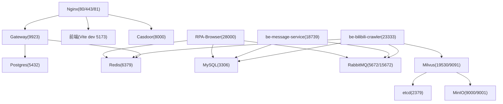
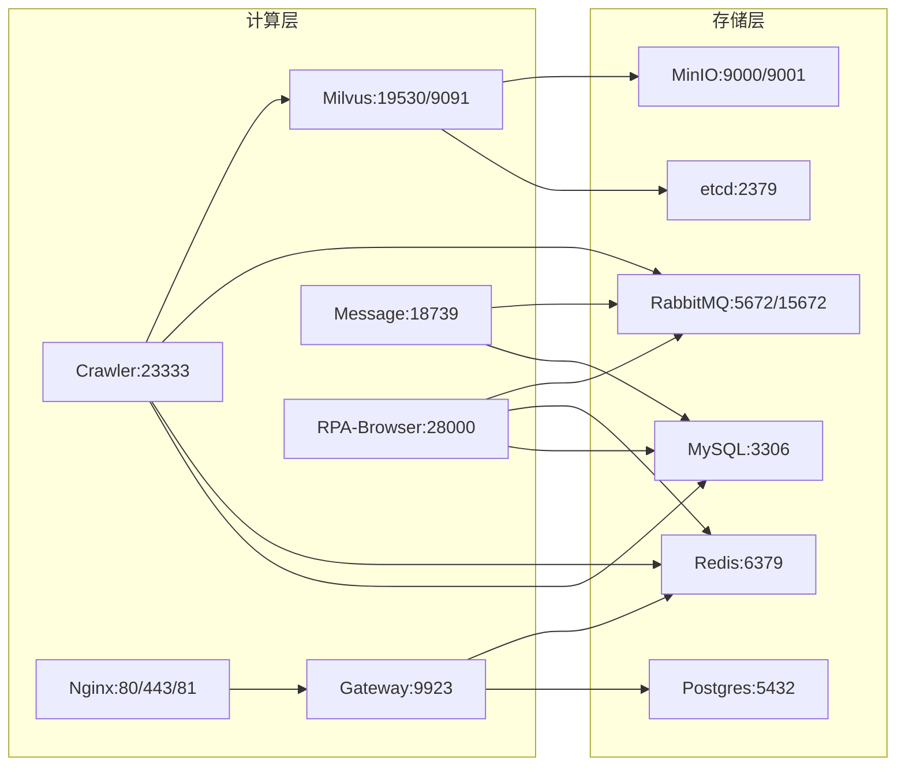
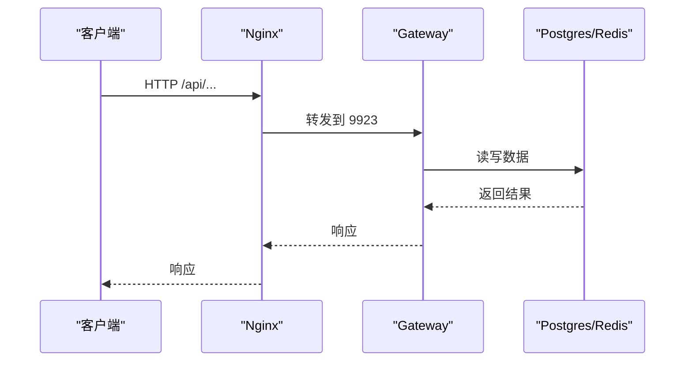

# 基础设施服务配置

<cite>
**本文引用的文件**
- [docker-compose.yml](file://docker-compose.yml)
- [dc-dev.yml](file://dc-dev.yml)
- [custom_mysql.cnf](file://docker_vol/mysql_data/conf.d/custom_mysql.cnf)
- [nginx.conf](file://docker_vol/nginx/conf/nginx.conf)
- [config.yml](file://be-gateway/ExpressServerEnd/config/config.yml)
- [Dockerfile.mono](file://Dockerfile.mono)
</cite>

## 目录
1. [简介](#简介)
2. [项目结构](#项目结构)
3. [核心组件](#核心组件)
4. [架构总览](#架构总览)
5. [详细组件分析](#详细组件分析)
6. [依赖关系分析](#依赖关系分析)
7. [性能与优化](#性能与优化)
8. [故障排查指南](#故障排查指南)
9. [结论](#结论)
10. [附录](#附录)

## 简介
本文件聚焦于本项目中基础设施中间件的 Docker Compose 配置，系统性解析 etcd、MinIO、MySQL、Redis、RabbitMQ、Postgres 等服务的镜像版本、环境变量、数据持久化卷挂载、端口映射策略、健康检查、重启策略、网络与安全配置。同时给出开发环境与生产环境的差异化建议（资源限制、备份策略、安全加固），并提供可操作的排障指引。

## 项目结构
- 基础编排：docker-compose.yml 定义了完整的生产级服务栈；dc-dev.yml 提供精简的开发环境。
- 数据持久化：所有关键数据通过 docker_vol 下的目录进行持久化挂载。
- 反向代理：Nginx 作为统一入口，转发 API、前端与认证相关流量。
- 应用服务：爬虫、网关、消息服务、RPA 浏览器等应用通过 Compose 编排并依赖上述中间件。

图表来源
- [docker-compose.yml:1-380](file://docker-compose.yml#L1-L380)
- [nginx.conf:1-71](file://docker_vol/nginx/conf/nginx.conf#L1-L71)

章节来源
- [docker-compose.yml:1-380](file://docker-compose.yml#L1-L380)
- [dc-dev.yml:1-213](file://dc-dev.yml#L1-L213)

## 核心组件
- etcd：用于 Milvus 的元数据存储，启用自动压缩与配额控制，具备健康检查。
- MinIO：对象存储，暴露控制台端口，数据持久化到宿主机目录。
- MySQL：业务主库之一，使用 LTS 镜像，自定义参数优化连接与内存占用。
- Redis：缓存与会话存储，默认 latest 镜像，数据持久化。
- RabbitMQ：消息队列与管理界面，用户凭据通过环境变量注入。
- Postgres：PPTR 与部分服务读取的数据源，Alpine 轻量镜像。
- Milvus：向量检索服务，依赖 etcd 与 MinIO，暴露 gRPC 与健康端点。
- Nginx：统一入口，反向代理 API、前端与认证服务。

章节来源
- [docker-compose.yml:1-380](file://docker-compose.yml#L1-L380)
- [dc-dev.yml:1-213](file://dc-dev.yml#L1-L213)

## 架构总览
下图展示了各中间件与应用之间的依赖与通信路径，以及数据持久化位置。

图表来源
- [docker-compose.yml:1-380](file://docker-compose.yml#L1-L380)

## 详细组件分析

### etcd
- 镜像版本：quay.io/coreos/etcd:v3.5.25
- 环境变量：自动压缩模式与保留条数、后端配额、快照计数
- 数据卷：/etcd 持久化
- 端口：2379（客户端）
- 健康检查：etcdctl endpoint health
- 重启策略：unless-stopped
- 网络：extra_hosts 指向 host.docker.internal

章节来源
- [docker-compose.yml:2-20](file://docker-compose.yml#L2-L20)

### MinIO
- 镜像版本：minio/minio:RELEASE.2024-12-18T13-15-44Z
- 环境变量：访问密钥与密钥
- 数据卷：/minio_data 持久化
- 端口：9000（API）、9001（控制台）
- 健康检查：HTTP /minio/health/live
- 重启策略：unless-stopped

章节来源
- [docker-compose.yml:21-40](file://docker-compose.yml#L21-L40)

### Milvus（standalone）
- 镜像版本：milvusdb/milvus:v3.0-beta
- 环境变量：ETCD_ENDPOINTS、MINIO_ADDRESS、MQ_TYPE
- 数据卷：/var/lib/milvus 持久化
- 端口：19530（gRPC）、9091（健康）
- 健康检查：HTTP /healthz
- 依赖：etcd、minio
- 安全：seccomp:unconfined（兼容某些内核调用）

章节来源
- [docker-compose.yml:41-67](file://docker-compose.yml#L41-L67)

### MySQL
- 镜像版本：mysql:lts
- 环境变量：ROOT 密码、时区
- 数据卷：/etc/mysql/conf.d（配置）、/var/lib/mysql（数据）
- 端口：3306
- 重启策略：unless-stopped
- 自定义参数：关闭 Binlog/慢查询日志、调小连接缓冲、InnoDB 缓冲池、线程与 IO 线程、表缓存等

章节来源
- [docker-compose.yml:68-81](file://docker-compose.yml#L68-L81)
- [custom_mysql.cnf:1-67](file://docker_vol/mysql_data/conf.d/custom_mysql.cnf#L1-L67)

### Redis
- 镜像版本：redis:latest
- 环境变量：时区
- 数据卷：/data 持久化
- 端口：6379
- 重启策略：unless-stopped

章节来源
- [docker-compose.yml:82-93](file://docker-compose.yml#L82-L93)

### RabbitMQ
- 镜像版本：rabbitmq:management
- 环境变量：默认用户与密码、时区
- 数据卷：/var/lib/rabbitmq、/var/log/rabbitmq
- 端口：5672（AMQP）、15672（管理界面）
- 重启策略：unless-stopped

章节来源
- [docker-compose.yml:94-109](file://docker-compose.yml#L94-L109)

### Postgres
- 镜像版本：postgres:alpine3.22
- 环境变量：用户名、密码、时区
- 数据卷：/var/lib/postgresql 持久化
- 端口：5432
- 重启策略：unless-stopped

章节来源
- [docker-compose.yml:165-178](file://docker-compose.yml#L165-L178)

### Nginx
- 镜像版本：nginx:stable-alpine
- 端口：80、443、81
- 卷：配置文件、证书、静态资源、日志
- 路由：/api 转发至网关、/casdoor 转发至认证服务、/ 转发至前端开发服务器

章节来源
- [docker-compose.yml:357-371](file://docker-compose.yml#L357-L371)
- [nginx.conf:1-71](file://docker_vol/nginx/conf/nginx.conf#L1-L71)

### 应用服务与依赖
- be-bilibili-crawler：依赖 MySQL、Redis、RabbitMQ、Unidbg、Milvus、消息服务；设置超时与日志等级；资源限制为 5G 内存。
- gateway：依赖 Postgres、Redis、Casdoor；通过环境变量接入数据库与认证。
- rpa-browser：依赖 Postgres、Redis、RabbitMQ、Casdoor；挂载源码与运行期 Chromium 数据。
- be-message-service：依赖 RabbitMQ、MySQL、Casdoor；提供 /health 健康检查；挂载 GeoIP 库。

章节来源
- [docker-compose.yml:120-322](file://docker-compose.yml#L120-L322)

## 依赖关系分析
- 启动顺序：Milvus 依赖 etcd 与 MinIO；应用服务通过 depends_on 声明依赖。
- 网络：默认 bridge 网络，名称 fastapi，启用 IPv6；容器间通过服务名互通。
- 外部可达：Nginx 将外部请求转发到内部服务；extra_hosts 允许访问宿主网络。

图表来源
- [docker-compose.yml:179-212](file://docker-compose.yml#L179-L212)
- [nginx.conf:30-35](file://docker_vol/nginx/conf/nginx.conf#L30-L35)

章节来源
- [docker-compose.yml:1-380](file://docker-compose.yml#L1-L380)

## 性能与优化
- etcd
  - 自动压缩：revision 模式，保留最近 1000 条，降低空间占用
  - 配额：4GB 后端配额，防止无限增长
  - 快照：50000 次写入触发一次快照，平衡性能与恢复成本
- MinIO
  - 健康检查确保可用性
  - 控制台端口 9001 便于运维
- MySQL
  - 关闭 Binlog 与通用/慢查询日志，减少 I/O 与内存
  - 连接与超时：max_connections=500，合理超时避免资源耗尽
  - InnoDB：缓冲池 256M、redo log 1G、IO 线程 4，适合中等负载
  - 缓冲参数：每个连接独立缓冲控制在 128K-4M，避免 OOM
- Redis
  - 默认配置即可满足缓存场景；如需持久化与内存策略可在 conf 中扩展
- RabbitMQ
  - management 镜像便于监控；日志与数据持久化
- Postgres
  - Alpine 镜像减小体积；按需调整共享缓冲与连接数
- Milvus
  - 健康检查 + 长启动等待（start_period 90s）
  - seccomp:unconfined 提升兼容性
- Nginx
  - worker_processes auto，事件 accept_mutex on
  - 仅对 /api 与 /casdoor 做代理，减少误匹配
- 应用
  - 爬虫限制内存 5G，避免影响其他服务
  - 消息服务 /health 校验 broker 连通性

章节来源
- [docker-compose.yml:1-380](file://docker-compose.yml#L1-L380)
- [custom_mysql.cnf:1-67](file://docker_vol/mysql_data/conf.d/custom_mysql.cnf#L1-L67)
- [nginx.conf:1-71](file://docker_vol/nginx/conf/nginx.conf#L1-L71)

## 故障排查指南
- etcd 不可用
  - 检查健康检查命令是否成功；查看 /etcd 卷权限与磁盘空间
  - 确认 ETCD_* 环境变量与端口 2379 可达
- MinIO 控制台无法访问
  - 验证 9000/9001 端口映射；检查 /minio_data 卷权限
  - 使用 curl 探测 /minio/health/live
- MySQL 连接失败或 OOM
  - 核对 MYSQL_ROOT_PASSWORD 与时区
  - 检查 custom_mysql.cnf 中的缓冲参数与连接数
  - 关注慢查询与错误日志
- Redis 无数据或断连
  - 确认 /data 卷存在且可写
  - 检查 6379 端口与防火墙
- RabbitMQ 登录失败
  - 核对 RABBITMQ_DEFAULT_USER/PASS
  - 通过 15672 管理界面检查队列与用户
- Postgres 无法连接
  - 核对 POSTGRES_USER/PASSWORD
  - 检查 5432 端口与 pg_hba.conf（如自定义）
- 应用健康检查失败
  - 消息服务 /health 需能访问；确认 RabbitMQ URL 与心跳
  - 爬虫与网关的环境变量需与 Compose 一致
- Nginx 代理异常
  - 检查 location 规则与上游地址
  - 确认证书与域名配置

章节来源
- [docker-compose.yml:1-380](file://docker-compose.yml#L1-L380)
- [custom_mysql.cnf:1-67](file://docker_vol/mysql_data/conf.d/custom_mysql.cnf#L1-L67)
- [nginx.conf:1-71](file://docker_vol/nginx/conf/nginx.conf#L1-L71)

## 结论
本项目通过 Docker Compose 将 etcd、MinIO、MySQL、Redis、RabbitMQ、Postgres 等中间件与应用服务一体化编排，具备明确的健康检查、重启策略与数据持久化方案。MySQL 与 Nginx 提供了针对开发与生产的优化基线。建议在生产环境中进一步引入资源限制、备份策略与安全加固措施，以提升稳定性与安全性。

## 附录

### 开发环境与生产环境差异建议
- 镜像版本
  - 开发：可使用 latest 或 beta 镜像以快速迭代
  - 生产：固定具体版本（如 etcd v3.5.25、MinIO RELEASE.2024-12-18、mysql:lts、postgres:alpine3.22）
- 资源限制
  - 为 CPU 与内存设置 limits（例如爬虫已设置 memory: 5G）
  - 根据负载调整 InnoDB 缓冲池、连接数与线程数
- 备份策略
  - MySQL：定期逻辑/物理备份，开启 binlog 用于时间点恢复（生产建议开启）
  - MinIO：跨地域复制与版本控制
  - Postgres：pg_basebackup 与 WAL 归档
  - Redis：AOF/RDB 持久化策略
  - RabbitMQ：队列与交换器配置导出
  - etcd：定期快照与恢复演练
- 安全加固
  - 最小权限原则：为各服务创建专用账号与数据库
  - 网络隔离：仅暴露必要端口，内网服务不对外
  - 敏感信息：使用 .env 或密钥管理服务，避免硬编码
  - TLS：Nginx 启用 HTTPS，内部服务尽量走加密通道
  - 审计：开启数据库与消息队列审计日志

章节来源
- [docker-compose.yml:1-380](file://docker-compose.yml#L1-L380)
- [dc-dev.yml:1-213](file://dc-dev.yml#L1-L213)

### 端口与环境变量速查
- 端口映射
  - etcd: 2379
  - MinIO: 9000(API)/9001(Console)
  - MySQL: 3306
  - Redis: 6379
  - RabbitMQ: 5672/15672
  - Postgres: 5432
  - Milvus: 19530/9091
  - Nginx: 80/443/81
  - Gateway: 9923
  - Crawler: 23333
  - Message: 18739
  - RPA: 28000
- 关键环境变量
  - 数据库：MYSQL_*、POSTGRES_*
  - 缓存：REDIS_*
  - 消息：RABBITMQ_*
  - 认证：CASDOOR_*
  - 推送：MESSAGE_CONFIG
  - 时区：TZ
  - 调试：LOG_LEVEL、SHOW_LOG、IS_DEV

章节来源
- [docker-compose.yml:1-380](file://docker-compose.yml#L1-L380)
- [config.yml:1-29](file://be-gateway/ExpressServerEnd/config/config.yml#L1-L29)