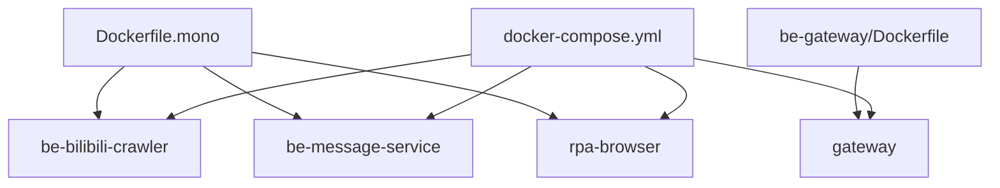
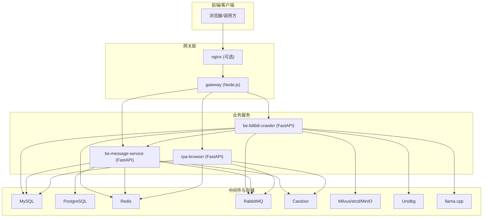
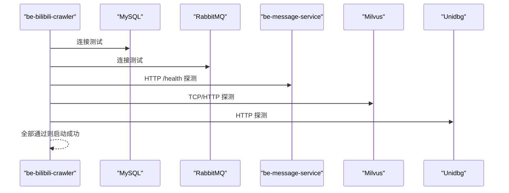
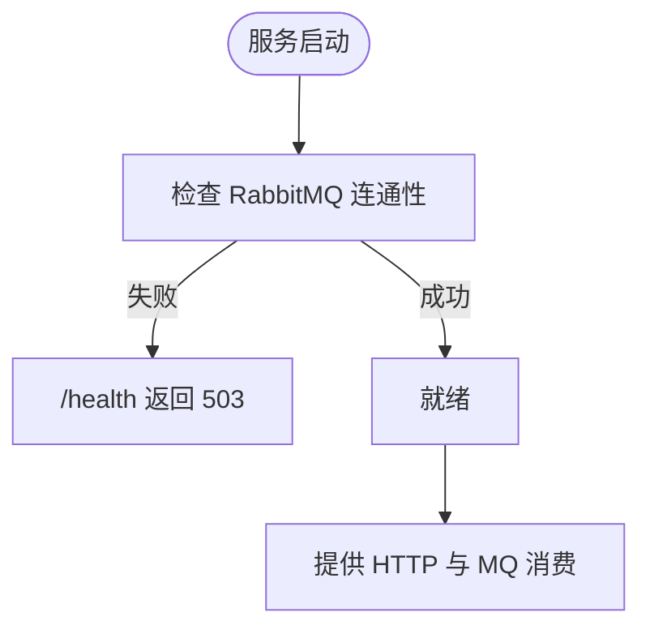
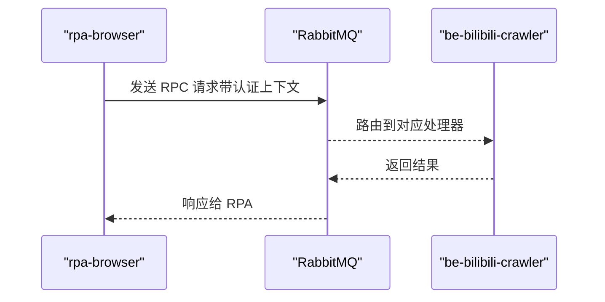
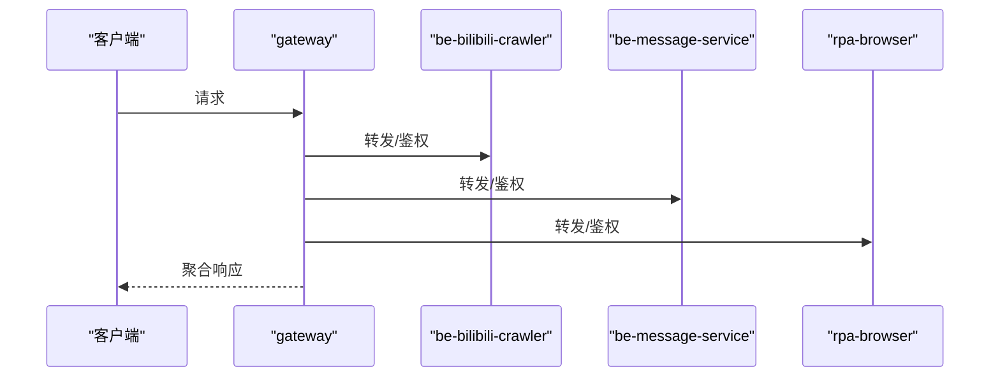
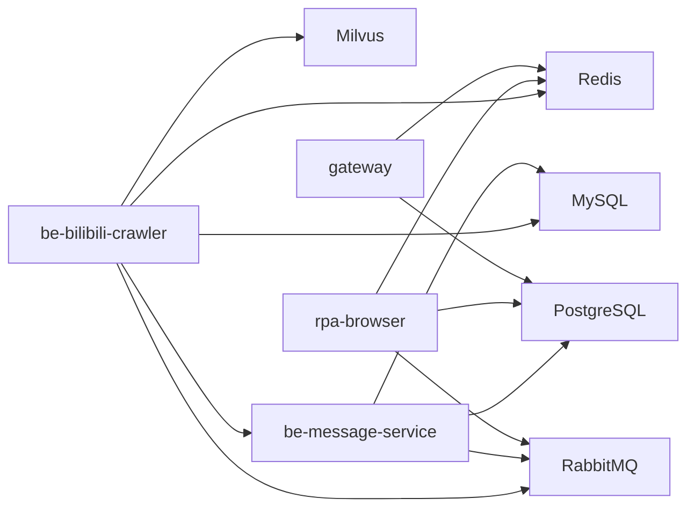

# 应用服务配置

<cite>
**本文引用的文件**
- [docker-compose.yml](file://docker-compose.yml)
- [dc-dev.yml](file://dc-dev.yml)
- [Dockerfile.mono](file://Dockerfile.mono)
- [be-gateway/Dockerfile](file://be-gateway/Dockerfile)
- [.env.example](file://.env.example)
- [be-bilibili-crawler/CONFIG.py](file://be-bilibili-crawler/CONFIG.py)
- [RPA-Browser/app/config.py](file://RPA-Browser/app/config.py)
- [be-message-service/app/core/config.py](file://be-message-service/app/core/config.py)
- [be-bilibili-crawler/Utils/FastAPI/FastapiLifespan.py](file://be-bilibili-crawler/Utils/FastAPI/FastapiLifespan.py)
- [be-gateway/ExpressServerEnd/Service/upstream_health_module/upstream_health_service.js](file://be-gateway/ExpressServerEnd/Service/upstream_health_module/upstream_health_service.js)
- [be-gateway/nodejs_backend.config.js](file://be-gateway/nodejs_backend.config.js)
</cite>

## 目录
1. [简介](#简介)
2. [项目结构](#项目结构)
3. [核心组件](#核心组件)
4. [架构总览](#架构总览)
5. [详细组件分析](#详细组件分析)
6. [依赖关系分析](#依赖关系分析)
7. [性能与资源](#性能与资源)
8. [故障排查指南](#故障排查指南)
9. [结论](#结论)
10. [附录：环境变量与端口速查](#附录环境变量与端口速查)

## 简介
本文件聚焦于 be-bilibili-crawler、be-message-service、rpa-browser、gateway 四个业务服务的 Docker Compose 配置，系统性说明服务间依赖、环境变量、数据卷挂载、端口映射与网络通信；并给出构建策略（多阶段构建、开发热重载 vs 生产部署）、监控与健康检查、日志收集、错误处理与性能优化建议。

## 项目结构
- 统一编排入口：docker-compose.yml（生产/通用）与 dc-dev.yml（开发精简版）。
- Python 三服务共享镜像构建：Dockerfile.mono（base + crawler/rpa/message 三个 target）。
- Node.js 网关：be-gateway/Dockerfile（dev/prod 双 target）。
- 环境变量模板：.env.example。
- 各服务运行时配置：
  - be-bilibili-crawler: CONFIG.py（Pydantic Settings 集中管理）
  - rpa-browser: app/config.py
  - be-message-service: app/core/config.py

图表来源
- [docker-compose.yml:120-309](file://docker-compose.yml#L120-L309)
- [Dockerfile.mono:44-134](file://Dockerfile.mono#L44-L134)
- [be-gateway/Dockerfile:1-26](file://be-gateway/Dockerfile#L1-L26)

章节来源
- [docker-compose.yml:1-380](file://docker-compose.yml#L1-L380)
- [dc-dev.yml:1-213](file://dc-dev.yml#L1-L213)
- [Dockerfile.mono:1-146](file://Dockerfile.mono#L1-L146)
- [be-gateway/Dockerfile:1-26](file://be-gateway/Dockerfile#L1-L26)

## 核心组件
- 数据库与缓存
  - MySQL：爬虫与消息服务主库（含分库分表策略由消息服务侧管理）
  - PostgreSQL：网关与消息服务对 pptr 库的只读/接管读写
  - Redis：会话/缓存/队列辅助
  - RabbitMQ：异步消息与 RPC（crawler 与 rpa 通过 MQ 交互）
  - Milvus/etcd/MinIO：向量检索与对象存储（crawler 使用）
- 认证与网关
  - Casdoor：统一身份认证（gateway、message-service、rpa 均接入）
  - Gateway：Node.js 网关，聚合上游服务（crawler、rpa、message）
- 外部能力
  - Unidbg：反混淆/签名计算
  - Llama.cpp：本地大模型推理（可选）
  - Nginx：静态资源与反向代理（可选）

章节来源
- [docker-compose.yml:1-380](file://docker-compose.yml#L1-L380)
- [.env.example:1-65](file://.env.example#L1-L65)

## 架构总览

图表来源
- [docker-compose.yml:120-309](file://docker-compose.yml#L120-L309)
- [be-gateway/nodejs_backend.config.js:1-27](file://be-gateway/nodejs_backend.config.js#L1-L27)

## 详细组件分析

### be-bilibili-crawler（爬虫服务）
- 构建与运行
  - 基于 Dockerfile.mono 的 crawler target，暴露 23333，启动 uvicorn main:app。
  - 源码以只读方式挂载到 /app，node_modules 保护容器内目录。
- 依赖与服务发现
  - depends_on：mysql、redis、rabbitmq、unidbg、milvus（standalone）
  - 通过环境变量解析 host/port，如 MYSQL_HOST、REDIS_HOST、RABBITMQ_HOST、UNIDBG_HOST、MILVUS_HOST、MESSAGE_SERVICE_HOST/PORT
- 关键配置
  - Pydantic Settings 集中管理数据库连接池、RabbitMQ URL、推送渠道（MESSAGE_CONFIG）、LLM API、代理等。
  - 启动时进行端口/HTTP 连通性检测，关键服务失败将阻断启动。
- 数据卷与端口
  - 日志输出至 docker_vol/fastapi/log（脚本日志）
  - 端口映射：${FASTAPI_PORT}:23333
- 健康检查
  - 通过 FastapiLifespan 在启动阶段探测 MySQL/Redis/RabbitMQ/Milvus/Unidbg/V2Ray/Llama/Message Service 等。

图表来源
- [be-bilibili-crawler/Utils/FastAPI/FastapiLifespan.py:183-240](file://be-bilibili-crawler/Utils/FastAPI/FastapiLifespan.py#L183-L240)
- [docker-compose.yml:120-164](file://docker-compose.yml#L120-L164)

章节来源
- [docker-compose.yml:120-164](file://docker-compose.yml#L120-L164)
- [Dockerfile.mono:44-78](file://Dockerfile.mono#L44-L78)
- [be-bilibili-crawler/CONFIG.py:225-277](file://be-bilibili-crawler/CONFIG.py#L225-L277)
- [be-bilibili-crawler/Utils/FastAPI/FastapiLifespan.py:183-240](file://be-bilibili-crawler/Utils/FastAPI/FastapiLifespan.py#L183-L240)

### be-message-service（消息服务）
- 构建与运行
  - 基于 Dockerfile.mono 的 message target，暴露 18739，启动 uvicorn main:app。
  - 源码与 alembic 迁移脚本随源码挂载，启动自动执行升级。
- 依赖与服务发现
  - depends_on：rabbitmq、mysql、casdoor
  - 直连 Postgres（pptr 库），用于用户展示信息与 @ 搜索（现被消息服务接管）
- 关键配置
  - 消息系统主库（元数据库）+ 私信内容按月分库分表（前缀与数量可配）
  - 全局推送渠道 MESSAGE_CONFIG（JSON），与 crawler/rpa 共用同一份配置模型
  - Casdoor 集成（普通登录与应用管理员账号两套 clientId/secret）
  - GeoIP mmdb 目录挂载到 /app/mmdb
- 数据卷与端口
  - 日志默认输出 stderr（容器日志收集），开发环境可写文件
  - 端口映射：${MESSAGE_SERVICE_PORT}:18739
- 健康检查
  - Compose healthcheck 调用 /health，内部校验 broker 连通性，未连通返回 503

图表来源
- [docker-compose.yml:261-322](file://docker-compose.yml#L261-L322)
- [be-message-service/app/core/config.py:19-40](file://be-message-service/app/core/config.py#L19-L40)

章节来源
- [docker-compose.yml:261-322](file://docker-compose.yml#L261-L322)
- [Dockerfile.mono:108-134](file://Dockerfile.mono#L108-L134)
- [be-message-service/app/core/config.py:1-375](file://be-message-service/app/core/config.py#L1-L375)

### rpa-browser（浏览器自动化服务）
- 构建与运行
  - 基于 Dockerfile.mono 的 rpa target，暴露 28000，启动 uvicorn main:app。
  - 源码子目录挂载（app、alembic），Chromium 下载产物走命名卷避免覆盖。
- 依赖与服务发现
  - depends_on：postgres、redis、rabbitmq、casdoor
  - 通过 RabbitMQ RPC 调用 be-bilibili-crawler（auto_attach_auth 模式依赖）
- 关键配置
  - mysql_browser_info_url、controller_base_path、proxy_server_url、GEMINI_API_KEY
  - RabbitMQ URL（心跳 180s 适配长任务）
  - 全局推送渠道 MESSAGE_CONFIG（JSON）
- 数据卷与端口
  - Chromium 持久化：./docker_vol/rpa/chrome_app:/app/app/chrome
  - 端口映射：${RPA_BROWSER_PORT}:28000

图表来源
- [docker-compose.yml:227-260](file://docker-compose.yml#L227-L260)
- [RPA-Browser/app/config.py:140-184](file://RPA-Browser/app/config.py#L140-L184)

章节来源
- [docker-compose.yml:227-260](file://docker-compose.yml#L227-L260)
- [Dockerfile.mono:80-106](file://Dockerfile.mono#L80-L106)
- [RPA-Browser/app/config.py:140-215](file://RPA-Browser/app/config.py#L140-L215)

### gateway（Node.js 网关）
- 构建与运行
  - be-gateway/Dockerfile 提供 dev（9926）与 prod（9923）两个 target
  - 通过 npm scripts 启动（prod/dev），pm2 配置文件定义进程名与参数
- 依赖与服务发现
  - depends_on：postgres、redis、casdoor
  - 环境变量配置上游 URI：BILI_CRAWLER_URI、RPA_SERVICE_URI、MESSAGE_SERVICE_URI
- 数据卷与端口
  - node_modules 使用命名卷缓存，源码挂载便于开发
  - 端口映射：${NODEJS_PPTR_PORT}:9923
- 健康检查
  - 内置上游健康检查模块，周期性探测上游服务可用性

图表来源
- [docker-compose.yml:179-212](file://docker-compose.yml#L179-L212)
- [be-gateway/ExpressServerEnd/Service/upstream_health_module/upstream_health_service.js:93-124](file://be-gateway/ExpressServerEnd/Service/upstream_health_module/upstream_health_service.js#L93-L124)
- [be-gateway/nodejs_backend.config.js:1-27](file://be-gateway/nodejs_backend.config.js#L1-L27)

章节来源
- [docker-compose.yml:179-212](file://docker-compose.yml#L179-L212)
- [be-gateway/Dockerfile:1-26](file://be-gateway/Dockerfile#L1-L26)
- [be-gateway/nodejs_backend.config.js:1-27](file://be-gateway/nodejs_backend.config.js#L1-L27)

## 依赖关系分析
- 服务间依赖
  - crawler → mysql、redis、rabbitmq、unidbg、milvus、message-service
  - message-service → rabbitmq、mysql、casdoor、postgres(pptr)
  - rpa-browser → postgres、redis、rabbitmq、casdoor
  - gateway → postgres、redis、casdoor
- 网络与端口
  - 所有服务在同一 bridge 网络（fastapi），容器间通过服务名访问
  - 宿主机端口通过 ${VAR} 映射，避免冲突
- 数据卷
  - 数据库数据持久化到 docker_vol/*
  - 日志统一落盘（Nginx、RabbitMQ、FastAPI 脚本日志）
  - Chrome 二进制与缓存走命名卷避免源码挂载覆盖

图表来源
- [docker-compose.yml:120-309](file://docker-compose.yml#L120-L309)

章节来源
- [docker-compose.yml:1-380](file://docker-compose.yml#L1-L380)

## 性能与资源
- 资源限制
  - crawler 设置内存上限 5G，适合高并发抓取与向量检索
- 连接池与超时
  - crawler 与 message-service 分别配置独立连接池与回收周期，避免连接泄漏
  - RabbitMQ heartbeat=180 适配长耗时任务（rpa/crawler）
- 构建优化
  - Dockerfile.mono 使用 BuildKit cache mount 缓存 uv 包与依赖，减少重复构建
  - 仅安装必要系统依赖，base 层共享
- 日志与监控
  - message-service 默认 WARNING 级别，生产压日志量；开发可调 DEBUG
  - gateway 内置上游健康检查，快速定位不可用服务
  - 可通过 Nginx 日志与 GoAccess 报表做流量分析（已提供 goaccess.conf）

章节来源
- [docker-compose.yml:120-164](file://docker-compose.yml#L120-L164)
- [be-bilibili-crawler/CONFIG.py:381-419](file://be-bilibili-crawler/CONFIG.py#L381-L419)
- [be-message-service/app/core/config.py:41-79](file://be-message-service/app/core/config.py#L41-L79)
- [be-gateway/ExpressServerEnd/Service/upstream_health_module/upstream_health_service.js:93-124](file://be-gateway/ExpressServerEnd/Service/upstream_health_module/upstream_health_service.js#L93-L124)

## 故障排查指南
- 启动失败
  - 检查依赖服务是否就绪（depends_on 不保证健康，需结合 healthcheck）
  - 查看 crawler 启动时的端口/HTTP 探测日志，确认关键服务连通性
- 连接问题
  - 核对 .env 中端口与密码是否与 docker-compose 一致
  - 检查 extra_hosts 与 host.docker.internal 是否正确映射
- 消息投递失败
  - 检查 RabbitMQ 用户名/密码与 URL 格式
  - 确认 message-service 的 /health 返回 204（否则为 503）
- 网关无法转发
  - 使用网关内置健康检查模块查看上游状态
  - 检查 BILI_CRAWLER_URI、RPA_SERVICE_URI、MESSAGE_SERVICE_URI 是否可达

章节来源
- [be-bilibili-crawler/Utils/FastAPI/FastapiLifespan.py:183-240](file://be-bilibili-crawler/Utils/FastAPI/FastapiLifespan.py#L183-L240)
- [docker-compose.yml:261-322](file://docker-compose.yml#L261-L322)
- [be-gateway/ExpressServerEnd/Service/upstream_health_module/upstream_health_service.js:93-124](file://be-gateway/ExpressServerEnd/Service/upstream_health_module/upstream_health_service.js#L93-L124)

## 结论
本项目通过统一的 Dockerfile.mono 实现 Python 三服务的多阶段构建与共享基础镜像，配合 docker-compose.yml 完成服务编排、依赖管理与数据持久化。各服务通过环境变量与 Pydantic Settings 集中配置，具备完善的健康检查与日志策略。生产部署建议严格区分开发与生产的环境变量，启用健康检查与资源限制，并结合 Nginx 与日志工具实现可观测性。

## 附录：环境变量与端口速查
- 端口映射（宿主机:容器）
  - MySQL: ${MYSQL_PORT}:3306
  - Redis: ${REDIS_PORT}:6379
  - RabbitMQ: ${RABBITMQ_PORT}:5672, WebUI: ${RABBITMQ_WEBUI_PORT}:15672
  - PostgreSQL: ${POSTGRES_PORT}:5432
  - be-bilibili-crawler: ${FASTAPI_PORT}:23333
  - be-message-service: ${MESSAGE_SERVICE_PORT}:18739
  - rpa-browser: ${RPA_BROWSER_PORT}:28000
  - gateway: ${NODEJS_PPTR_PORT}:9923
  - Milvus: ${MILVUS_PORT}:19530
  - llama.cpp: ${LLAMA_PORT}:8080
- 关键环境变量
  - 数据库与缓存：MYSQL_*、REDIS_*、POSTGRES_*、RABBITMQ_*
  - 第三方服务：UNIDBG_*、MILVUS_*、LLAMA_*、PROXY_SERVER、V2RAY_*
  - 认证：CASDOOR_*（endpoint、client_id/secret、organization/application/certificate）
  - 推送渠道：MESSAGE_CONFIG（JSON）
  - 服务标识：SERVER_NAME、SERVER_ADDRESS
  - 日志等级：LOG_LEVEL（message-service）、FASTSTREAM_LOG_LEVEL（框架日志）

章节来源
- [.env.example:1-65](file://.env.example#L1-L65)
- [docker-compose.yml:1-380](file://docker-compose.yml#L1-L380)