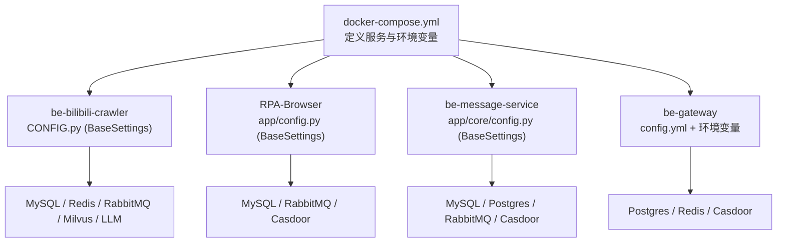
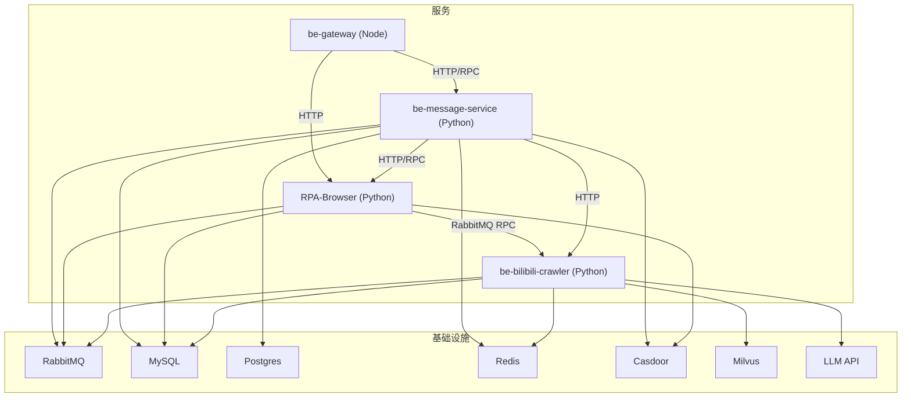
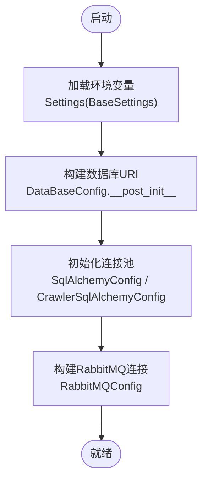
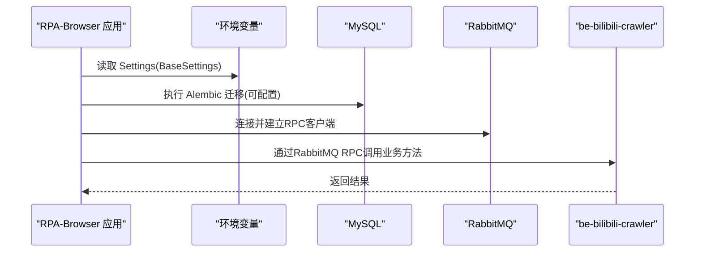
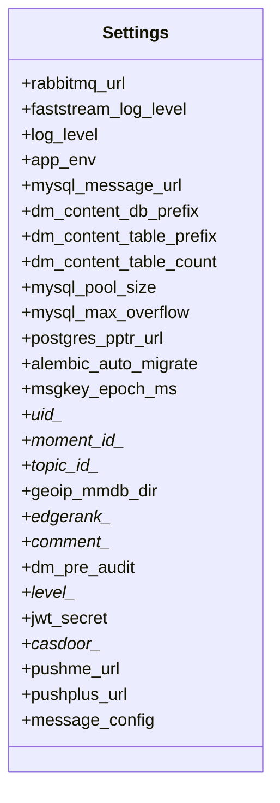
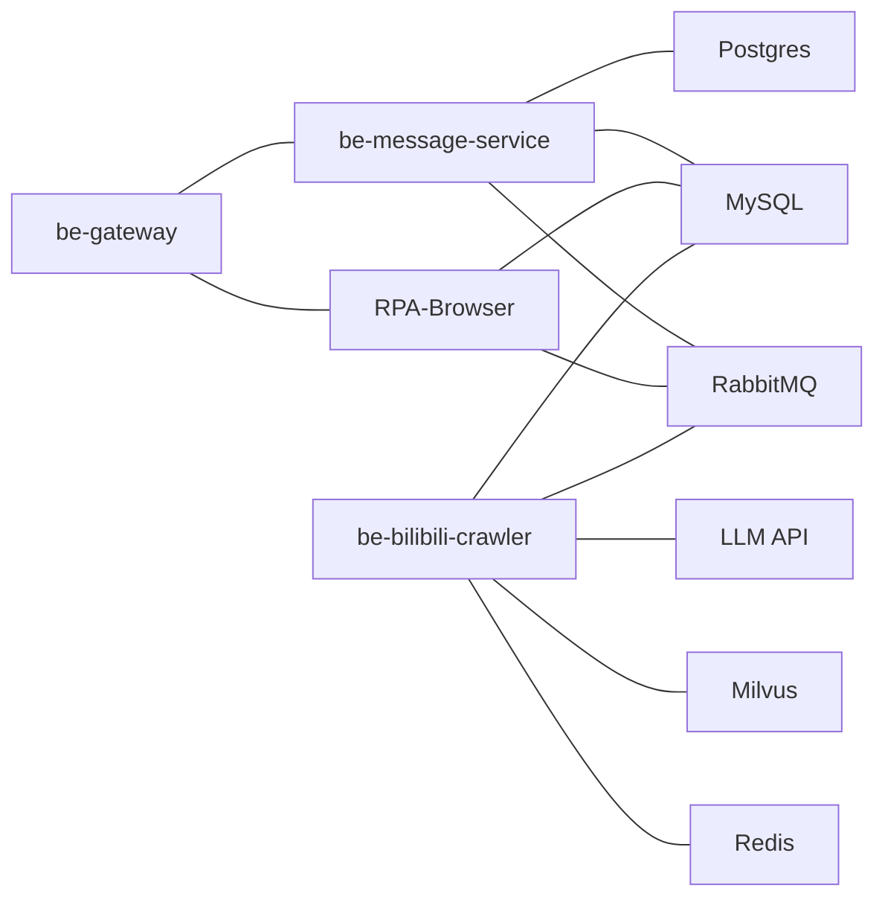

# 环境变量配置

<cite>
**本文引用的文件**
- [RPA-Browser/app/config.py](file://RPA-Browser/app/config.py)
- [be-bilibili-crawler/CONFIG.py](file://be-bilibili-crawler/CONFIG.py)
- [be-message-service/app/core/config.py](file://be-message-service/app/core/config.py)
- [docker-compose.yml](file://docker-compose.yml)
- [be-gateway/ExpressServerEnd/config/config.yml](file://be-gateway/ExpressServerEnd/config/config.yml)
- [RPA-Browser/main.py](file://RPA-Browser/main.py)
- [be-bilibili-crawler/main.py](file://be-bilibili-crawler/main.py)
</cite>

## 目录
1. [简介](#简介)
2. [项目结构与环境变量加载机制](#项目结构与环境变量加载机制)
3. [核心组件与配置分类](#核心组件与配置分类)
4. [架构总览](#架构总览)
5. [详细组件分析](#详细组件分析)
6. [依赖关系分析](#依赖关系分析)
7. [性能与安全注意事项](#性能与安全注意事项)
8. [故障排查指南](#故障排查指南)
9. [结论](#结论)
10. [附录：环境示例与最佳实践](#附录：环境示例与最佳实践)

## 简介
本文件面向多服务（Python/Node）项目的运行时配置，聚焦环境变量在以下方面的作用与用法：
- 数据库连接配置
- 服务间通信配置（RabbitMQ、RPC、HTTP）
- 第三方服务集成配置（Casdoor、LLM、向量库等）
- 安全配置（JWT、密码盐、推送密钥等）
- 调试与日志配置（日志级别、迁移开关、开发/生产模式）

同时提供不同部署环境（开发、测试、生产）的配置建议、敏感信息管理策略、配置验证与环境切换策略。

## 项目结构与环境变量加载机制
本项目采用“按服务拆分 + 集中编排”的方式组织配置：
- Python 服务通过 pydantic-settings 的 BaseSettings 读取环境变量，并支持从 .env 文件加载（不同服务指定不同路径）。
- Node.js 网关使用 YAML 配置文件承载部分静态配置，并通过环境变量注入敏感信息。
- Docker Compose 负责将宿主机或 CI/CD 提供的变量注入到各容器服务中。

图表来源
- [docker-compose.yml:120-164](file://docker-compose.yml#L120-L164)
- [docker-compose.yml:227-260](file://docker-compose.yml#L227-L260)
- [docker-compose.yml:261-309](file://docker-compose.yml#L261-L309)
- [be-bilibili-crawler/CONFIG.py:225-277](file://be-bilibili-crawler/CONFIG.py#L225-L277)
- [RPA-Browser/app/config.py:140-174](file://RPA-Browser/app/config.py#L140-L174)
- [be-message-service/app/core/config.py:5-342](file://be-message-service/app/core/config.py#L5-L342)
- [be-gateway/ExpressServerEnd/config/config.yml:1-29](file://be-gateway/ExpressServerEnd/config/config.yml#L1-L29)

章节来源
- [docker-compose.yml:120-164](file://docker-compose.yml#L120-L164)
- [docker-compose.yml:227-260](file://docker-compose.yml#L227-L260)
- [docker-compose.yml:261-309](file://docker-compose.yml#L261-L309)
- [be-bilibili-crawler/CONFIG.py:225-277](file://be-bilibili-crawler/CONFIG.py#L225-L277)
- [RPA-Browser/app/config.py:140-174](file://RPA-Browser/app/config.py#L140-L174)
- [be-message-service/app/core/config.py:5-342](file://be-message-service/app/core/config.py#L5-L342)
- [be-gateway/ExpressServerEnd/config/config.yml:1-29](file://be-gateway/ExpressServerEnd/config/config.yml#L1-L29)

## 核心组件与配置分类
- 数据库连接配置
  - be-bilibili-crawler：MySQL 主库、多个业务库、Redis、Milvus
  - RPA-Browser：MySQL（浏览器信息库）
  - be-message-service：MySQL（消息元数据）、Postgres（pptr 用户表）
- 服务间通信配置
  - RabbitMQ 连接串、心跳、队列名称
  - HTTP/RPC 端点（message-service、rpa-browser、bilibili-crawler）
- 第三方服务集成配置
  - Casdoor（OAuth2/OIDC）
  - LLM API（OpenAI 兼容）
  - 向量数据库（Milvus）
  - 代理/网络（V2Ray、IPv6 代理）
- 安全配置
  - JWT 密钥、算法、过期时间
  - 密码盐、AES 盐
  - 推送渠道密钥（PushMe、PushPlus 等）
- 调试与日志配置
  - 日志级别（FastStream 内部日志 vs 业务日志）
  - 自动迁移开关、迁移目标版本
  - 开发/生产模式、是否输出日志

章节来源
- [be-bilibili-crawler/CONFIG.py:225-277](file://be-bilibili-crawler/CONFIG.py#L225-L277)
- [RPA-Browser/app/config.py:140-215](file://RPA-Browser/app/config.py#L140-L215)
- [be-message-service/app/core/config.py:5-342](file://be-message-service/app/core/config.py#L5-L342)
- [be-gateway/ExpressServerEnd/config/config.yml:1-29](file://be-gateway/ExpressServerEnd/config/config.yml#L1-L29)

## 架构总览
下图展示服务间通过 RabbitMQ 和 HTTP/RPC 进行通信，以及各服务对数据库、缓存、认证与外部服务的依赖关系。

图表来源
- [docker-compose.yml:120-164](file://docker-compose.yml#L120-L164)
- [docker-compose.yml:227-260](file://docker-compose.yml#L227-L260)
- [docker-compose.yml:261-309](file://docker-compose.yml#L261-L309)
- [be-bilibili-crawler/CONFIG.py:422-433](file://be-bilibili-crawler/CONFIG.py#L422-L433)
- [RPA-Browser/app/config.py:156-159](file://RPA-Browser/app/config.py#L156-L159)
- [be-message-service/app/core/config.py:19-24](file://be-message-service/app/core/config.py#L19-L24)

## 详细组件分析

### be-bilibili-crawler 配置
- 关键环境变量
  - MySQL：MYSQL_HOST、MYSQL_PORT、MYSQL_USER、MYSQL_PASSWORD
  - Redis：REDIS_HOST、REDIS_PORT、REDIS_PWD
  - RabbitMQ：RABBITMQ_HOST、RABBITMQ_PORT、RABBITMQ_USER、RABBITMQ_PASSWORD
  - 外部服务：UNIDBG_HOST、UNIDBG_PORT、V2RAY_HOST、V2RAY_PORT、LLAMA_HOST、LLAMA_PORT、PROXY_SERVER、MILVUS_HOST、MILVUS_PORT
  - 服务发现：MESSAGE_SERVICE_HOST、MESSAGE_SERVICE_PORT
  - 运行控制：SHOW_LOG、IS_DEV、FASTSTREAM_LOG_LEVEL
  - 全局推送：MESSAGE_CONFIG（JSON）
- 配置加载
  - 通过 Settings(BaseSettings) 从 .env.fastapi.prod/.dev 加载
  - DataBaseConfig 动态拼装各业务库 URI
  - SqlAlchemyConfig/CrawlerSqlAlchemyConfig 隔离业务与爬虫的连接池
- 典型用途
  - 抓取任务、数据处理、向量化存储、LLM 调用、消息队列消费/发布

图表来源
- [be-bilibili-crawler/CONFIG.py:225-277](file://be-bilibili-crawler/CONFIG.py#L225-L277)
- [be-bilibili-crawler/CONFIG.py:330-379](file://be-bilibili-crawler/CONFIG.py#L330-L379)
- [be-bilibili-crawler/CONFIG.py:381-419](file://be-bilibili-crawler/CONFIG.py#L381-L419)
- [be-bilibili-crawler/CONFIG.py:422-433](file://be-bilibili-crawler/CONFIG.py#L422-L433)

章节来源
- [be-bilibili-crawler/CONFIG.py:225-277](file://be-bilibili-crawler/CONFIG.py#L225-L277)
- [be-bilibili-crawler/CONFIG.py:330-433](file://be-bilibili-crawler/CONFIG.py#L330-L433)

### RPA-Browser 配置
- 关键环境变量
  - mysql_browser_info_url：浏览器信息库连接串
  - controller_base_path：API 前缀
  - proxy_server_url：外网代理地址
  - GEMINI_API_KEY：可选 AI 能力密钥
  - RABBITMQ_URL：RabbitMQ 连接串（用于 RPC）
  - MESSAGE_CONFIG：全局推送渠道配置（JSON）
  - SERVER_NAME/SERVER_ADDRESS：服务标识
- 配置加载
  - Settings(BaseSettings) 从 ../.env.prod/.dev 加载
  - Alembic 自动迁移开关 alembic_auto_migrate
- 典型用途
  - 浏览器自动化、工作流执行、通过 RabbitMQ RPC 调用后端服务

图表来源
- [RPA-Browser/app/config.py:140-174](file://RPA-Browser/app/config.py#L140-L174)
- [RPA-Browser/app/config.py:156-159](file://RPA-Browser/app/config.py#L156-L159)
- [RPA-Browser/main.py:36-63](file://RPA-Browser/main.py#L36-L63)

章节来源
- [RPA-Browser/app/config.py:140-215](file://RPA-Browser/app/config.py#L140-L215)
- [RPA-Browser/main.py:36-63](file://RPA-Browser/main.py#L36-L63)

### be-message-service 配置
- 关键环境变量
  - RabbitMQ：rabbitmq_url、faststream_log_level
  - 日志：log_level、APP_ENV、LOG_FILE_DIR
  - HTTP：http_host、http_port
  - MySQL：mysql_message_url、分库分表相关参数、连接池参数
  - Postgres：postgres_pptr_url、schema、连接池参数
  - ID生成：msgkey_epoch_ms、uid_*、moment_id_*、topic_id_*
  - GeoIP：geoip_mmdb_dir
  - EdgeRank：推荐排序权重、半衰期、召回路开关
  - 评论/私信策略：审核开关、阈值、页大小
  - 用户等级：level_* 配置
  - JWT：jwt_secret、jwt_algorithm、jwt_expires_seconds
  - Casdoor：endpoint、client_id/secret、organization/application/service/certificate、admin_*
  - 推送：pushme_url、pushplus_url、message_config(JSON)
- 配置加载
  - Settings(BaseSettings) 从 app/.env 加载
  - model_post_init 处理证书换行与连接池上限保护
- 典型用途
  - 消息系统、通知、评论、私信、推荐排序、用户成长

图表来源
- [be-message-service/app/core/config.py:5-342](file://be-message-service/app/core/config.py#L5-L342)

章节来源
- [be-message-service/app/core/config.py:5-342](file://be-message-service/app/core/config.py#L5-L342)

### be-gateway 配置
- 关键配置项
  - common_config.salt：password_salt、jwt_secret、password_aes_salt
  - snow_flake_worker_id：雪花机器ID
  - keys.system_pushplus_key：系统消息推送Key
  - level_config：等级与经验要求
  - cron_config.daily_task：定时任务时间
  - mq_config.rabbitmq_url：RabbitMQ 连接串（需与 message-service 一致）
  - mq_config.rpc_timeout_ms：RPC 超时毫秒数
- 说明
  - 该服务以 YAML 为主，敏感信息可通过环境变量覆盖（如 DB、Redis、Casdoor）

章节来源
- [be-gateway/ExpressServerEnd/config/config.yml:1-29](file://be-gateway/ExpressServerEnd/config/config.yml#L1-L29)

## 依赖关系分析
- 服务耦合
  - RPA-Browser 依赖 be-bilibili-crawler（RabbitMQ RPC）
  - be-gateway 依赖 be-message-service（RPC/HTTP）
  - 所有服务共享 RabbitMQ 与数据库集群
- 配置一致性
  - RabbitMQ 连接串在各服务中保持一致（用户名/密码/端口）
  - Casdoor 配置在 gateway 与 message-service 共用同一应用
  - 推送渠道通过统一的 MESSAGE_CONFIG（JSON）在多服务间共享

图表来源
- [docker-compose.yml:120-164](file://docker-compose.yml#L120-L164)
- [docker-compose.yml:227-260](file://docker-compose.yml#L227-L260)
- [docker-compose.yml:261-309](file://docker-compose.yml#L261-L309)
- [be-bilibili-crawler/CONFIG.py:422-433](file://be-bilibili-crawler/CONFIG.py#L422-L433)
- [RPA-Browser/app/config.py:156-159](file://RPA-Browser/app/config.py#L156-L159)
- [be-message-service/app/core/config.py:19-24](file://be-message-service/app/core/config.py#L19-L24)

章节来源
- [docker-compose.yml:120-164](file://docker-compose.yml#L120-L164)
- [docker-compose.yml:227-260](file://docker-compose.yml#L227-L260)
- [docker-compose.yml:261-309](file://docker-compose.yml#L261-L309)
- [be-bilibili-crawler/CONFIG.py:422-433](file://be-bilibili-crawler/CONFIG.py#L422-L433)
- [RPA-Browser/app/config.py:156-159](file://RPA-Browser/app/config.py#L156-L159)
- [be-message-service/app/core/config.py:19-24](file://be-message-service/app/core/config.py#L19-L24)

## 性能与安全注意事项
- 性能
  - 连接池上限保护：message-service 在 model_post_init 中限制 pool_size + max_overflow ≤ 100，避免打满数据库连接
  - 爬虫与业务连接池隔离：be-bilibili-crawler 为爬虫单独维护连接池，避免高并发抓取影响业务请求
  - RabbitMQ 心跳：统一设置 heartbeat=180，避免长耗时任务导致连接关闭
- 安全
  - 敏感信息一律通过环境变量注入，不写入代码仓库
  - JWT、密码盐、AES 盐等密钥应严格保密，生产环境使用强随机值
  - 推送渠道密钥（PushMe/PushPlus 等）通过 MESSAGE_CONFIG 统一管理
  - Casdoor 管理员凭据与普通应用凭据分离，注意 application 差异

章节来源
- [be-message-service/app/core/config.py:351-360](file://be-message-service/app/core/config.py#L351-L360)
- [be-bilibili-crawler/CONFIG.py:381-419](file://be-bilibili-crawler/CONFIG.py#L381-L419)
- [be-bilibili-crawler/CONFIG.py:422-433](file://be-bilibili-crawler/CONFIG.py#L422-L433)
- [be-gateway/ExpressServerEnd/config/config.yml:1-29](file://be-gateway/ExpressServerEnd/config/config.yml#L1-L29)

## 故障排查指南
- 常见问题定位
  - 数据库连接失败：检查 MYSQL_*、POSTGRES_* 环境变量与 docker-compose 映射
  - RabbitMQ 连接异常：核对 RABBITMQ_* 与 rabbitmq_url 的一致性
  - 迁移失败：确认 alembic_auto_migrate 与 alembic_upgrade_target；查看服务启动日志
  - 推送失败：检查 MESSAGE_CONFIG JSON 格式与各渠道密钥
  - 日志过多/过少：调整 LOG_LEVEL、FASTSTREAM_LOG_LEVEL、SHOW_LOG
- 快速恢复
  - 临时降低连接池大小，避免 Too many connections
  - 关闭自动迁移，手动执行迁移脚本后重启
  - 切换至降级模式（如关闭推荐、关闭预审核）

章节来源
- [RPA-Browser/main.py:36-63](file://RPA-Browser/main.py#L36-L63)
- [be-bilibili-crawler/main.py:41-45](file://be-bilibili-crawler/main.py#L41-L45)
- [be-message-service/app/core/config.py:351-360](file://be-message-service/app/core/config.py#L351-L360)

## 结论
本项目通过 pydantic-settings 与 docker-compose 实现了清晰的环境变量管理：
- 每个服务独立维护配置模型，职责清晰
- 通过统一的 MESSAGE_CONFIG 实现跨服务推送配置共享
- 敏感信息通过环境变量注入，结合连接池保护与迁移开关提升稳定性
- 建议在 CI/CD 中集中管理环境变量，确保开发/测试/生产环境一致性与安全性

## 附录：环境示例与最佳实践

### 环境变量分类与含义
- 数据库连接
  - MySQL：MYSQL_HOST、MYSQL_PORT、MYSQL_USER、MYSQL_PASSWORD
  - Postgres：POSTGRES_HOST、POSTGRES_USER、POSTGRES_PASSWORD、POSTGRES_PORT
  - Redis：REDIS_HOST、REDIS_PORT、REDIS_PWD
- 服务间通信
  - RabbitMQ：RABBITMQ_HOST、RABBITMQ_PORT、RABBITMQ_USER、RABBITMQ_PASSWORD、RABBITMQ_URL
  - HTTP/RPC：MESSAGE_SERVICE_HOST、MESSAGE_SERVICE_PORT、BILI_CRAWLER_URI、RPA_SERVICE_URI、MESSAGE_SERVICE_URI
- 第三方服务集成
  - Casdoor：CASDOOR_ENDPOINT、CASDOOR_CLIENT_ID、CASDOOR_CLIENT_SECRET、CASDOOR_ORGANIZATION、CASDOOR_APPLICATION、CASDOOR_REDIRECT_URI、CASDOOR_CERTIFICATE、CASDOOR_ADMIN_*
  - LLM：llm_apis（JSON 列表）、LLAMA_HOST、LLAMA_PORT
  - 向量库：MILVUS_HOST、MILVUS_PORT
  - 代理：PROXY_SERVER、V2RAY_HOST、V2RAY_PORT
- 安全配置
  - JWT：jwt_secret、jwt_algorithm、jwt_expires_seconds（message-service），gateway 中 jwt_secret
  - 密码盐：password_salt、password_aes_salt（gateway）
  - 推送：MESSAGE_CONFIG（JSON），包含 pushme_key/push_plus_token 等
- 调试与日志
  - LOG_LEVEL、FASTSTREAM_LOG_LEVEL、SHOW_LOG、APP_ENV、LOG_FILE_DIR
  - alembic_auto_migrate、alembic_upgrade_target

章节来源
- [docker-compose.yml:120-164](file://docker-compose.yml#L120-L164)
- [docker-compose.yml:227-260](file://docker-compose.yml#L227-L260)
- [docker-compose.yml:261-309](file://docker-compose.yml#L261-L309)
- [be-bilibili-crawler/CONFIG.py:225-277](file://be-bilibili-crawler/CONFIG.py#L225-L277)
- [RPA-Browser/app/config.py:140-215](file://RPA-Browser/app/config.py#L140-L215)
- [be-message-service/app/core/config.py:5-342](file://be-message-service/app/core/config.py#L5-L342)
- [be-gateway/ExpressServerEnd/config/config.yml:1-29](file://be-gateway/ExpressServerEnd/config/config.yml#L1-L29)

### 不同环境的配置示例（示意）
- 开发环境
  - 日志级别：DEBUG/INFO
  - 自动迁移：开启
  - 推送：仅启用必要渠道（如 PushMe）
  - 代理：本地代理或内网代理
- 测试环境
  - 日志级别：WARNING/INFO
  - 自动迁移：开启（或使用独立测试库）
  - 推送：关闭或仅告警
  - 资源限制：适当降低连接池与并发
- 生产环境
  - 日志级别：WARNING
  - 自动迁移：谨慎开启（建议CI/CD执行迁移）
  - 推送：全量配置，严格密钥管理
  - 资源限制：合理调优连接池、队列、内存

### 敏感信息安全管理
- 一律通过环境变量注入，禁止提交到代码库
- 使用 CI/CD 密钥管理服务（如 Vault、Secrets Manager）
- 定期轮换密钥（JWT、推送密钥、数据库密码）
- 最小权限原则：各服务仅配置所需的最小权限

### 配置验证与环境切换策略
- 配置验证
  - 使用 pydantic 类型校验与默认值
  - 启动时检查关键依赖（数据库、MQ、Casdoor）连通性
  - 连接池上限保护（message-service）
- 环境切换
  - 通过 APP_ENV、IS_DEV、SHOW_LOG 等开关切换行为
  - 使用不同的 .env 文件（prod/dev）与 docker-compose 注入
  - 统一 MESSAGE_CONFIG 实现跨服务推送配置同步

章节来源
- [be-message-service/app/core/config.py:351-360](file://be-message-service/app/core/config.py#L351-L360)
- [RPA-Browser/app/config.py:166-174](file://RPA-Browser/app/config.py#L166-L174)
- [be-bilibili-crawler/CONFIG.py:269-274](file://be-bilibili-crawler/CONFIG.py#L269-L274)
- [docker-compose.yml:120-164](file://docker-compose.yml#L120-L164)
- [docker-compose.yml:227-260](file://docker-compose.yml#L227-L260)
- [docker-compose.yml:261-309](file://docker-compose.yml#L261-L309)