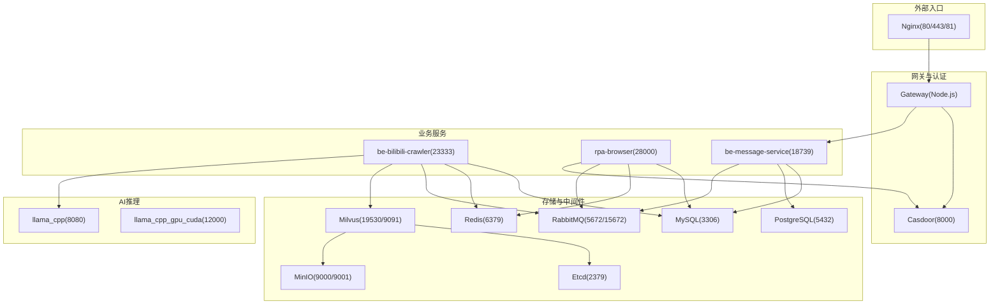
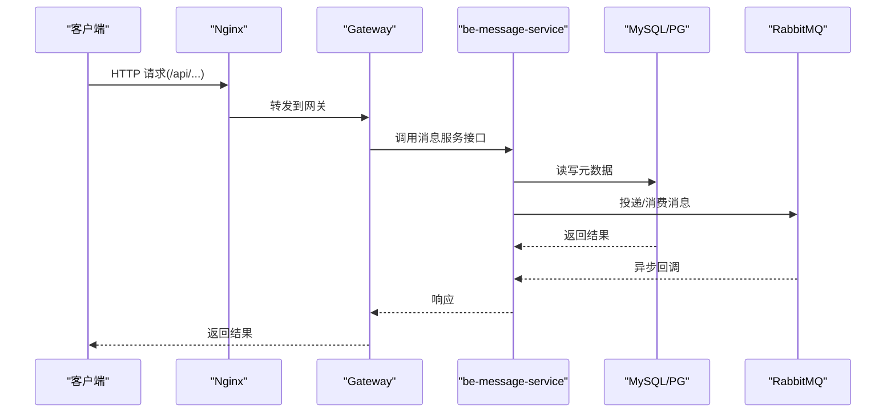
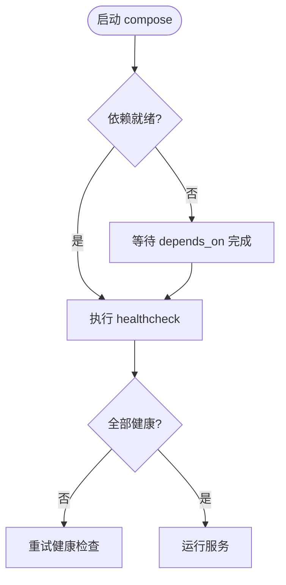

# Docker 容器化部署

<cite>
**本文引用的文件**
- [docker-compose.yml](file://docker-compose.yml)
- [dc-dev.yml](file://dc-dev.yml)
- [Dockerfile.mono](file://Dockerfile.mono)
- [be-gateway/Dockerfile](file://be-gateway/Dockerfile)
- [Makefile](file://Makefile)
- [docker_vol/mysql_data/conf.d/custom_mysql.cnf](file://docker_vol/mysql_data/conf.d/custom_mysql.cnf)
- [docker_vol/nginx/conf/nginx.conf](file://docker_vol/nginx/conf/nginx.conf)
- [be-bilibili-crawler/CONFIG.py](file://be-bilibili-crawler/CONFIG.py)
- [RPA-Browser/app/config.py](file://RPA-Browser/app/config.py)
- [be-message-service/app/core/config.py](file://be-message-service/app/core/config.py)
</cite>

## 目录
1. [简介](#简介)
2. [项目结构](#项目结构)
3. [核心组件](#核心组件)
4. [架构总览](#架构总览)
5. [详细组件分析](#详细组件分析)
6. [依赖关系与网络](#依赖关系与网络)
7. [性能与资源优化](#性能与资源优化)
8. [故障排查指南](#故障排查指南)
9. [结论](#结论)
10. [附录：环境变量与端口清单](#附录环境变量与端口清单)

## 简介
本指南面向使用 Docker Compose 编排该项目的开发与生产部署，覆盖多服务编排、容器间通信、中间件（MySQL、Redis、RabbitMQ、Milvus、PostgreSQL）配置与优化、数据卷挂载策略、健康检查与重启策略，以及开发/生产差异化配置。文档同时提供常见网络冲突、端口冲突与数据持久化问题的解决方案。

## 项目结构
本项目通过 docker-compose.yml 统一编排所有服务，包含：
- 向量数据库：etcd、minio、milvus standalone
- 关系型数据库：mysql、postgres
- 缓存与消息：redis、rabbitmq
- 业务服务：be-bilibili-crawler、rpa-browser、be-message-service、gateway、casdoor
- AI推理：llama_cpp、llama_cpp_gpu_cuda
- 反向代理：nginx

图表来源
- [docker-compose.yml:1-380](file://docker-compose.yml#L1-L380)
- [docker_vol/nginx/conf/nginx.conf:1-71](file://docker_vol/nginx/conf/nginx.conf#L1-L71)

章节来源
- [docker-compose.yml:1-380](file://docker-compose.yml#L1-L380)
- [Makefile:1-71](file://Makefile#L1-L71)

## 核心组件
- 应用镜像构建
  - Python 三服务共用 base，分别产出 crawler、rpa、message 三个 target，共享 uv 缓存与系统依赖，减少构建时间。
  - Node.js 网关使用独立 Dockerfile，区分 dev/prod 目标。
- 服务编排
  - 通过 docker-compose.yml 定义服务、环境变量、端口映射、数据卷、健康检查、重启策略与依赖顺序。
  - dc-dev.yml 提供精简的开发环境编排（仅保留必要服务）。
- 反向代理
  - Nginx 将 /api 请求转发至 gateway，静态前端与 HMR 走 Vite dev server；另提供 casdoor 代理与 81 端口管理面板。

章节来源
- [Dockerfile.mono:1-146](file://Dockerfile.mono#L1-L146)
- [be-gateway/Dockerfile:1-26](file://be-gateway/Dockerfile#L1-L26)
- [docker-compose.yml:1-380](file://docker-compose.yml#L1-L380)
- [dc-dev.yml:1-213](file://dc-dev.yml#L1-L213)
- [docker_vol/nginx/conf/nginx.conf:1-71](file://docker_vol/nginx/conf/nginx.conf#L1-L71)

## 架构总览
- 入口层：Nginx 暴露 80/443/81，按路径路由到后端或前端。
- 网关层：Node.js 网关负责鉴权、路由、限流等，依赖 Postgres、Redis、Casdoor。
- 业务层：
  - be-bilibili-crawler：爬虫与数据处理，依赖 MySQL、Redis、RabbitMQ、Milvus、LLM。
  - rpa-browser：浏览器自动化与流程编排，依赖 MySQL、Redis、RabbitMQ、Casdoor。
  - be-message-service：消息推送与通知，依赖 MySQL、Postgres、RabbitMQ。
- 数据层：MySQL、PostgreSQL、Redis、RabbitMQ、Milvus（etcd+minio）。
- AI 推理：CPU/GPU 两种 llama.cpp 服务，供上层调用。

图表来源
- [docker_vol/nginx/conf/nginx.conf:1-71](file://docker_vol/nginx/conf/nginx.conf#L1-L71)
- [docker-compose.yml:179-212](file://docker-compose.yml#L179-L212)
- [docker-compose.yml:261-322](file://docker-compose.yml#L261-L322)

## 详细组件分析

### 中间件与服务编排
- etcd/minio/milvus
  - etcd 作为元数据存储，开启自动压缩与配额限制，数据卷持久化。
  - minio 提供对象存储，控制台 9001，API 9000。
  - milvus standalone 依赖 etcd 与 minio，暴露 19530 与 9091，启用 seccomp 放宽以兼容某些内核特性。
- MySQL
  - 通过 custom_mysql.cnf 关闭 binlog/慢查询日志，调小 per-connection buffer，设置 InnoDB 缓冲池与线程并发，控制连接超时与包大小，避免 OOM。
- Redis
  - 默认 latest 镜像，数据卷持久化，时区统一。
- RabbitMQ
  - management 镜像，暴露 5672 与 15672，用户名密码通过环境变量注入，数据与日志持久化。
- PostgreSQL
  - alpine 镜像，数据卷持久化，用户密码通过环境变量注入。
- Nginx
  - 将 /api 转发到 gateway，/ 转发到 Vite 开发服务器，支持 WebSocket 升级；提供 casdoor 代理与 81 端口管理面板。

章节来源
- [docker-compose.yml:1-178](file://docker-compose.yml#L1-L178)
- [docker_vol/mysql_data/conf.d/custom_mysql.cnf:1-67](file://docker_vol/mysql_data/conf.d/custom_mysql.cnf#L1-L67)
- [docker_vol/nginx/conf/nginx.conf:1-71](file://docker_vol/nginx/conf/nginx.conf#L1-L71)

### 应用服务与环境变量
- be-bilibili-crawler
  - 依赖 MySQL、Redis、RabbitMQ、Milvus、unidbg、llama。
  - 关键环境变量：MYSQL_HOST/PORT/USER/PASSWORD、REDIS_*、RABBITMQ_*、MILVUS_*、UNIDBG_*、LLAMA_*、MESSAGE_SERVICE_*、PROXY_SERVER、IS_DEV、SHOW_LOG、MESSAGE_CONFIG 等。
  - 连接池与回收：SQLAlchemy 连接池启用 pre_ping 与 recycle，避免陈旧连接导致断开。
- rpa-browser
  - 依赖 MySQL、Redis、RabbitMQ、Casdoor。
  - 关键环境变量：mysql_browser_info_url、controller_base_path、proxy_server_url、GEMINI_API_KEY、RABBITMQ_URL、MESSAGE_CONFIG、SERVER_NAME/SERVER_ADDRESS 等。
  - 浏览器运行期数据通过命名卷持久化，避免源码挂载覆盖。
- be-message-service
  - 依赖 MySQL、PostgreSQL、RabbitMQ、Casdoor。
  - 关键环境变量：RABBITMQ_URL、MYSQL_MESSAGE_URL、POSTGRES_PPTR_URL、MESSAGE_CONFIG、CASDOOR_*、LOG_LEVEL、GEOIP_MMDB_DIR 等。
  - 健康检查：/health 校验 broker 连通性，返回 204 表示正常。

章节来源
- [docker-compose.yml:120-164](file://docker-compose.yml#L120-L164)
- [docker-compose.yml:227-260](file://docker-compose.yml#L227-L260)
- [docker-compose.yml:261-322](file://docker-compose.yml#L261-L322)
- [be-bilibili-crawler/CONFIG.py:225-277](file://be-bilibili-crawler/CONFIG.py#L225-L277)
- [be-bilibili-crawler/CONFIG.py:381-415](file://be-bilibili-crawler/CONFIG.py#L381-L415)
- [RPA-Browser/app/config.py:140-180](file://RPA-Browser/app/config.py#L140-L180)
- [be-message-service/app/core/config.py:5-80](file://be-message-service/app/core/config.py#L5-L80)
- [be-message-service/app/core/config.py:338-375](file://be-message-service/app/core/config.py#L338-L375)

### 构建与镜像
- Python 三服务共用 base，使用 uv 进行依赖安装与缓存加速，PYTHONPATH 统一指向 /app，便于 uvicorn 启动。
- crawler 额外安装 Playwright chromium；rpa 生成 lock 并安装依赖；message 直接基于 lock 安装。
- Node.js 网关使用 node:24-alpine，dev/prod 目标分别暴露不同端口与启动命令。

章节来源
- [Dockerfile.mono:1-146](file://Dockerfile.mono#L1-L146)
- [be-gateway/Dockerfile:1-26](file://be-gateway/Dockerfile#L1-L26)

### 数据卷与持久化
- MySQL：/etc/mysql/conf.d 与 /var/lib/mysql 持久化。
- Redis：/data 持久化。
- RabbitMQ：/var/lib/rabbitmq 与 /var/log/rabbitmq 持久化。
- PostgreSQL：/var/lib/postgresql 持久化。
- Milvus：etcd、minio、milvus data 均持久化。
- Nginx：conf/cert/html/logs 持久化。
- RPA：chrome 应用数据通过命名卷隔离源码挂载。
- Gateway：node_modules 使用命名卷提升构建与热更新效率。

章节来源
- [docker-compose.yml:1-380](file://docker-compose.yml#L1-L380)

## 依赖关系与网络
- 服务依赖
  - gateway 依赖 postgres、redis、casdoor。
  - be-bilibili-crawler 依赖 mysql、redis、rabbitmq、unidbg、milvus、message-service。
  - rpa-browser 依赖 postgres、redis、rabbitmq、casdoor。
  - be-message-service 依赖 rabbitmq、mysql、casdoor。
  - milvus 依赖 etcd、minio。
- 网络
  - 默认 bridge 网络，名称 fastapi，启用 IPv6。
  - 各服务通过容器名互相访问（如 mysql、redis、rabbitmq）。
  - Nginx 通过 host.docker.internal 访问宿主机上的开发服务（如 Vite 5173、casdoor 10011）。

图表来源
- [docker-compose.yml:1-380](file://docker-compose.yml#L1-L380)

章节来源
- [docker-compose.yml:1-380](file://docker-compose.yml#L1-L380)

## 性能与资源优化
- MySQL
  - 关闭不必要的日志与监控，降低内存占用。
  - 调小 per-connection buffer，避免 OOM。
  - InnoDB 缓冲池与 IO 线程合理配置，提高吞吐。
- Redis/RabbitMQ
  - 使用管理镜像便于运维；生产建议根据负载调整 maxmemory、持久化策略与队列策略。
- Milvus
  - etcd 开启自动压缩与配额限制；minio 用于对象存储；standalone 模式适合中小规模。
- 应用服务
  - be-bilibili-crawler 设置内存上限 5G，避免 OOM。
  - SQLAlchemy 连接池启用 pre_ping 与 recycle，避免连接泄漏与陈旧连接。
  - message-service 对连接池做安全保护，防止误配导致打满数据库。
- 反向代理
  - Nginx worker_connections 与 keepalive 可根据并发调优；HMR 需支持 WebSocket 升级。

章节来源
- [docker-compose.yml:120-164](file://docker-compose.yml#L120-L164)
- [docker-compose.yml:261-322](file://docker-compose.yml#L261-L322)
- [docker_vol/mysql_data/conf.d/custom_mysql.cnf:1-67](file://docker_vol/mysql_data/conf.d/custom_mysql.cnf#L1-L67)
- [be-bilibili-crawler/CONFIG.py:381-415](file://be-bilibili-crawler/CONFIG.py#L381-L415)
- [be-message-service/app/core/config.py:351-375](file://be-message-service/app/core/config.py#L351-L375)

## 故障排查指南
- 容器无法互相解析
  - 确认服务在同一 network 下，且通过容器名访问（非 localhost）。
  - 若 Nginx 需要访问宿主机服务，使用 host.docker.internal。
- 端口冲突
  - 通过环境变量映射宿主机端口（如 MYSQL_PORT、REDIS_PORT、RABBITMQ_PORT、POSTGRES_PORT、MILVUS_PORT、NODEJS_PPTR_PORT、CASDOOR_PORT、MESSAGE_SERVICE_PORT、LLAMA_PORT），避免与宿主机端口冲突。
- 数据未持久化
  - 检查 volumes 是否挂载正确，确保宿主目录存在且有写权限。
  - 注意 RPA 的 chrome_app 使用命名卷，避免被源码挂载覆盖。
- 健康检查失败
  - 查看对应服务的 healthcheck 配置与日志；message-service 的 /health 会校验 broker 连通性。
- 连接池耗尽
  - 检查 MySQL 连接数与超时配置；应用侧连接池 pool_size/max_overflow/recycle 需与数据库 wait_timeout 匹配。
- 网络问题
  - 使用 docker-compose ps/logs 查看服务状态；必要时进入容器 ping 其他服务名验证 DNS。

章节来源
- [docker-compose.yml:1-380](file://docker-compose.yml#L1-L380)
- [docker_vol/nginx/conf/nginx.conf:1-71](file://docker_vol/nginx/conf/nginx.conf#L1-L71)

## 结论
本项目通过统一的 docker-compose 编排，实现了多服务解耦与可观测性（健康检查、日志、数据卷持久化）。中间件与业务服务的环境变量清晰，便于在开发与生产环境之间切换。结合合理的资源限制、连接池与网络配置，可在不同规模下稳定运行。

## 附录：环境变量与端口清单
- 环境变量（部分）
  - 通用：ENV_TZ、IS_DEV、SHOW_LOG、MESSAGE_CONFIG、SERVER_NAME、SERVER_ADDRESS、PROXY_SERVER、LLAMA_*、V2RAY_*
  - MySQL：MYSQL_PASSWORD、MYSQL_PORT、MYSQL_HOST（服务内为 mysql）
  - Redis：REDIS_PORT、REDIS_HOST（服务内为 redis）
  - RabbitMQ：RABBITMQ_USER、RABBITMQ_PASSWORD、RABBITMQ_PORT、RABBITMQ_WEBUI_PORT
  - PostgreSQL：POSTGRES_USER、POSTGRES_PASSWORD、POSTGRES_PORT、POSTGRES_HOST
  - Milvus：MILVUS_PORT
  - Gateway：NODEJS_PPTR_PORT、BILI_CRAWLER_URI、RPA_SERVICE_URI、MESSAGE_SERVICE_URI、CASDOOR_*
  - Message Service：MESSAGE_SERVICE_PORT、MYSQL_MESSAGE_URL、POSTGRES_PPTR_URL、LOG_LEVEL、GEOIP_MMDB_DIR
  - RPA Browser：RPA_BROWSER_PORT、mysql_browser_info_url、RABBITMQ_URL、GEMINI_API_KEY
- 端口映射（宿主机:容器）
  - Nginx: 80:80, 443:443, 81:81
  - MySQL: ${MYSQL_PORT}:3306
  - Redis: ${REDIS_PORT}:6379
  - RabbitMQ: ${RABBITMQ_PORT}:5672, ${RABBITMQ_WEBUI_PORT}:15672
  - PostgreSQL: ${POSTGRES_PORT}:5432
  - Milvus: ${MILVUS_PORT}:19530, 9091:9091
  - Gateway: ${NODEJS_PPTR_PORT}:9923
  - RPA Browser: ${RPA_BROWSER_PORT}:28000
  - Message Service: ${MESSAGE_SERVICE_PORT}:18739
  - LLM CPU: ${LLAMA_PORT}:8080
  - LLM GPU: 12000:12000
  - Casdoor: ${CASDOOR_PORT}:8000

章节来源
- [docker-compose.yml:1-380](file://docker-compose.yml#L1-L380)