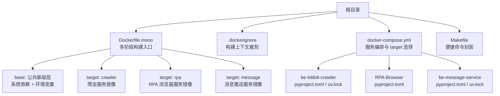
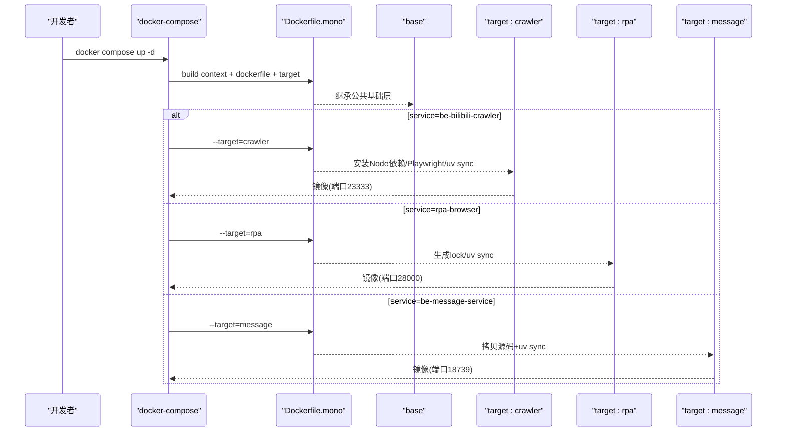
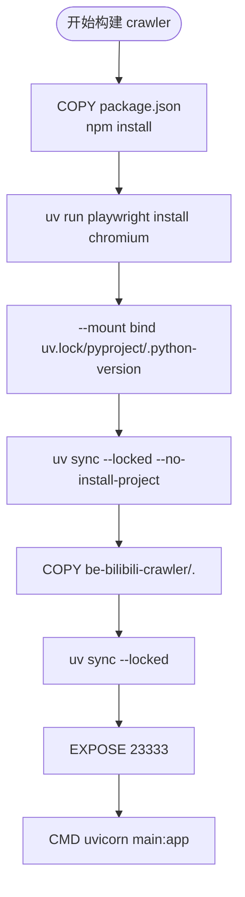
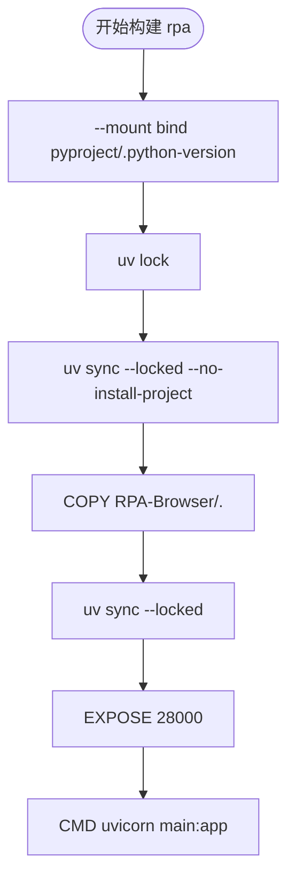
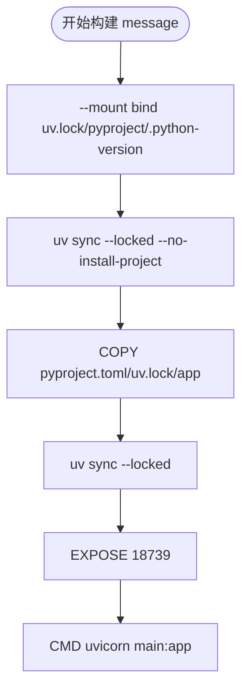
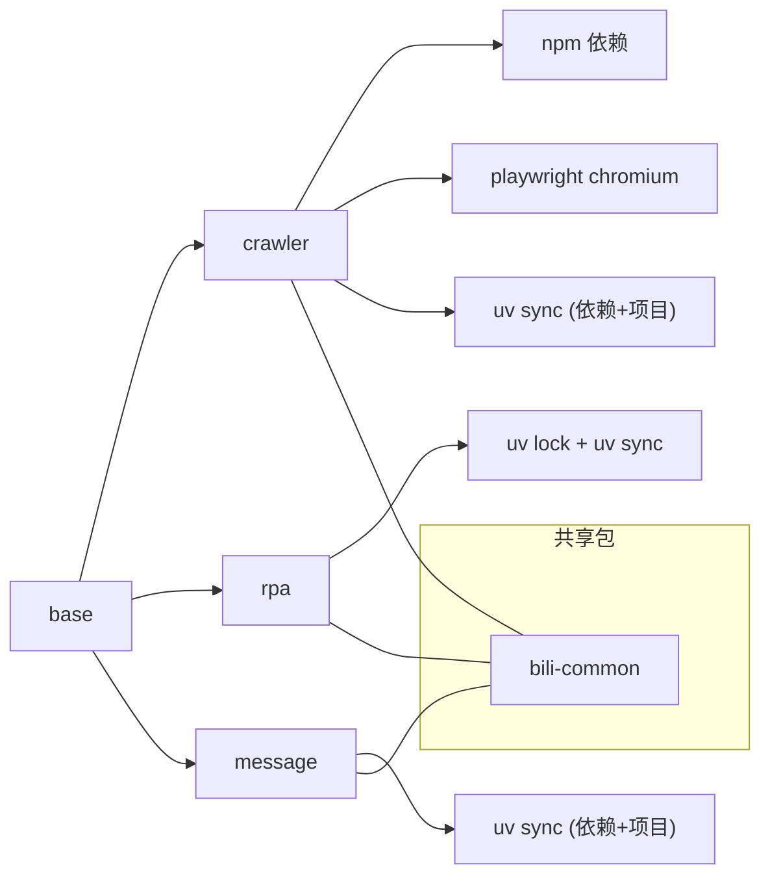

# 多阶段构建配置

<cite>
**本文引用的文件**
- [Dockerfile.mono](file://Dockerfile.mono)
- [Makefile](file://Makefile)
- [docker-compose.yml](file://docker-compose.yml)
- [.dockerignore](file://.dockerignore)
- [be-bilibili-crawler/.dockerignore](file://be-bilibili-crawler/.dockerignore)
- [RPA-Browser/.dockerignore](file://RPA-Browser/.dockerignore)
- [be-message-service/.dockerignore](file://be-message-service/.dockerignore)
- [be-bilibili-crawler/pyproject.toml](file://be-bilibili-crawler/pyproject.toml)
- [RPA-Browser/pyproject.toml](file://RPA-Browser/pyproject.toml)
- [be-message-service/pyproject.toml](file://be-message-service/pyproject.toml)
</cite>

## 目录
1. [简介](#简介)
2. [项目结构](#项目结构)
3. [核心组件](#核心组件)
4. [架构总览](#架构总览)
5. [详细组件分析](#详细组件分析)
6. [依赖关系分析](#依赖关系分析)
7. [性能与优化](#性能与优化)
8. [故障排查指南](#故障排查指南)
9. [结论](#结论)
10. [附录：构建与部署命令](#附录构建与部署命令)

## 简介
本文件聚焦于仓库中的多阶段 Docker 构建配置，围绕 Dockerfile.mono 中为三个 Python 服务（crawler、rpa、message）设计的多阶段构建策略展开。文档将解释各目标的构建流程、依赖安装、代码复制、运行时环境配置，以及缓存与镜像体积优化技巧；同时说明 Makefile 提供的构建与部署自动化脚本使用方法，并给出安全扫描与最佳实践建议。

## 项目结构
该仓库采用 monorepo 组织多个微服务，并通过单一多阶段 Dockerfile 统一产出不同服务的镜像。根级 .dockerignore 会排除无关大目录与本地缓存，减少构建上下文体积。各子服务通过各自的 pyproject.toml 声明依赖，并使用 uv 进行依赖管理与虚拟环境同步。

**图表来源**
- [Dockerfile.mono:1-146](file://Dockerfile.mono#L1-L146)
- [docker-compose.yml:120-309](file://docker-compose.yml#L120-L309)
- [.dockerignore:1-19](file://.dockerignore#L1-L19)

**章节来源**
- [Dockerfile.mono:1-146](file://Dockerfile.mono#L1-L146)
- [docker-compose.yml:120-309](file://docker-compose.yml#L120-L309)
- [.dockerignore:1-19](file://.dockerignore#L1-L19)

## 核心组件
- 共享基础镜像 base：基于轻量 Python 镜像，设置 uv 环境变量、阿里云镜像源、公共系统依赖（g++/gcc/make/nodejs/npm/curl/pkg-config/libssl-dev/git 及 OpenCV/GUI 相关库），并统一 PYTHONPATH 指向 /app，便于 uvicorn 直接以包名启动服务。
- 目标 crawler：安装 Node.js 依赖、安装 Playwright chromium、使用 uv sync --locked 分步安装依赖与项目本体，暴露端口 23333，运行 uvicorn main:app。
- 目标 rpa：生成并锁定依赖、安装项目本体、暴露端口 28000，运行 uvicorn main:app。
- 目标 message：仅拷贝必要源码与清单文件，使用 uv sync --locked 安装依赖与项目本体，暴露端口 18739，运行 uvicorn main:app。
- 默认 meta-target default：用于消除 unreachable stage 警告，不实际被 compose 使用。

**章节来源**
- [Dockerfile.mono:1-146](file://Dockerfile.mono#L1-L146)

## 架构总览
下图展示了 docker-compose 如何通过指定 target 调用 Dockerfile.mono 的对应阶段，从而为每个服务构建最小化镜像。

**图表来源**
- [docker-compose.yml:120-309](file://docker-compose.yml#L120-L309)
- [Dockerfile.mono:44-146](file://Dockerfile.mono#L44-L146)

## 详细组件分析

### 共享基础层 base
- 使用 uv 官方推荐镜像，设置编译字节码、链接模式、缓存目录、禁用开发依赖等环境变量，提升构建一致性与速度。
- 配置 Debian 阿里云镜像源，加速 apt 安装。
- 一次性安装公共系统依赖，避免各 target 重复安装，提高缓存命中率。
- 统一 PYTHONPATH=/app，使 uvicorn 可直接以包名启动服务。

**章节来源**
- [Dockerfile.mono:1-43](file://Dockerfile.mono#L1-L43)

### 目标 crawler（爬虫服务）
- Node 依赖：仅 crawler 需要，先安装 npm 依赖，再安装 Playwright chromium 到共享路径。
- Python 依赖：通过 --mount=type=bind 将 uv.lock 与 pyproject.toml 挂载进构建过程，先执行 uv sync --no-install-project 安装依赖，再 COPY 源码后执行 uv sync 安装项目本体。
- 运行：暴露 23333，CMD 使用 uvicorn main:app。

**图表来源**
- [Dockerfile.mono:44-79](file://Dockerfile.mono#L44-L79)

**章节来源**
- [Dockerfile.mono:44-79](file://Dockerfile.mono#L44-L79)
- [be-bilibili-crawler/pyproject.toml:1-129](file://be-bilibili-crawler/pyproject.toml#L1-L129)

### 目标 rpa（RPA 浏览器服务）
- 依赖管理：当前未提交 uv.lock，先执行 uv lock 生成锁文件，再 uv sync --locked --no-install-project 安装依赖。
- 源码复制：COPY RPA-Browser/ 包含生成的 uv.lock，最终 uv sync --locked 安装项目本体。
- 运行：暴露 28000，CMD 使用 uvicorn main:app。

**图表来源**
- [Dockerfile.mono:80-107](file://Dockerfile.mono#L80-L107)

**章节来源**
- [Dockerfile.mono:80-107](file://Dockerfile.mono#L80-L107)
- [RPA-Browser/pyproject.toml:1-75](file://RPA-Browser/pyproject.toml#L1-L75)

### 目标 message（消息推送服务）
- 依赖管理：通过 --mount bind 挂载 uv.lock 与 pyproject.toml，先 uv sync --locked --no-install-project 安装依赖。
- 源码复制：仅拷贝 app 目录与清单文件，减小上下文与镜像体积。
- 运行：暴露 18739，CMD 使用 uvicorn main:app。

**图表来源**
- [Dockerfile.mono:108-135](file://Dockerfile.mono#L108-L135)

**章节来源**
- [Dockerfile.mono:108-135](file://Dockerfile.mono#L108-L135)
- [be-message-service/pyproject.toml:1-85](file://be-message-service/pyproject.toml#L1-L85)

### 默认 meta-target default
- 目的：建立构建依赖图，消除 “unreachable stage” 警告。
- 行为：从各 target 复制 uv 可执行文件到临时位置并清理，提供提示性 CMD。

**章节来源**
- [Dockerfile.mono:136-146](file://Dockerfile.mono#L136-L146)

## 依赖关系分析
- 公共依赖：base 层集中安装系统依赖，避免重复下载与层失效。
- Python 依赖：各服务通过各自 pyproject.toml 声明，使用 uv 的 --mount bind 机制将 lock 与清单挂载进构建过程，实现“依赖变更才重建依赖层”的缓存优化。
- Node 依赖：仅 crawler 需要，单独在 crawler 阶段安装，避免其他目标引入额外体积。
- bili-common：作为路径依赖，在构建时复制到 /bili-common，配合 UV_NO_EDITABLE=1 在非 editable 模式下安装，确保静态工具解析与镜像内可移植性。

**图表来源**
- [Dockerfile.mono:1-146](file://Dockerfile.mono#L1-L146)
- [be-bilibili-crawler/pyproject.toml:116-129](file://be-bilibili-crawler/pyproject.toml#L116-L129)
- [RPA-Browser/pyproject.toml:58-75](file://RPA-Browser/pyproject.toml#L58-L75)
- [be-message-service/pyproject.toml:59-85](file://be-message-service/pyproject.toml#L59-L85)

**章节来源**
- [Dockerfile.mono:1-146](file://Dockerfile.mono#L1-L146)
- [be-bilibili-crawler/pyproject.toml:1-129](file://be-bilibili-crawler/pyproject.toml#L1-L129)
- [RPA-Browser/pyproject.toml:1-75](file://RPA-Browser/pyproject.toml#L1-L75)
- [be-message-service/pyproject.toml:1-85](file://be-message-service/pyproject.toml#L1-L85)

## 性能与优化
- 构建缓存优化
  - 使用 --mount=type=cache,id=uv-cache,target=/cache/uv 持久化 uv 缓存，显著减少重复下载时间。
  - 使用 --mount=type=bind 将 uv.lock 与 pyproject.toml 挂载进构建过程，使依赖安装层仅在清单变化时失效，最大化利用 Docker 层缓存。
  - 将 Node 依赖安装与源码 COPY 分离，避免源码变动导致 npm 重新安装。
- 镜像大小优化
  - 仅 crawler 安装 Node 依赖与 Playwright chromium，其他目标不包含无关二进制。
  - message 仅拷贝 app 与清单文件，减少镜像体积。
  - 使用 slim 基础镜像与精简 apt 安装（--no-install-recommends）。
  - 根级 .dockerignore 排除大型目录与缓存，降低构建上下文体积。
- 安全扫描最佳实践
  - 在 CI 中使用多阶段构建产物进行镜像扫描（例如 Trivy），优先扫描最终运行镜像。
  - 定期更新基础镜像与系统依赖，修复已知漏洞。
  - 对 Python 依赖使用锁定版本（uv.lock），避免上游变更引入风险。
  - 限制容器运行权限，避免以 root 运行应用（可在后续阶段添加非 root 用户）。
  - 使用签名与校验（如 cosign）确保镜像完整性。

[本节为通用指导，不直接分析具体文件]

## 故障排查指南
- 构建上下文过大
  - 检查根级 .dockerignore 是否生效，确认未将 node_modules、__pycache__、.venv 等纳入上下文。
  - 若新增大目录，请补充忽略规则。
- 依赖安装缓慢或失败
  - 确认 uv 缓存目录已正确挂载（/cache/uv），并检查网络镜像源配置。
  - 对于 crawler，确认 npm registry 与 playwright chromium 下载可用。
- 服务无法启动
  - 确认 EXPOSE 端口与 docker-compose 映射一致。
  - 检查 PYTHONPATH 与 uvicorn 启动命令是否正确。
  - 检查环境变量（数据库、消息队列、Casdoor 等）是否注入。
- 日志与调试
  - 使用 make logs [SERVICE] 查看指定服务日志。
  - 使用 docker-compose ps 查看容器状态。
  - 针对 message 服务，健康检查端点 /health 可用于快速判断 broker 连通性。

**章节来源**
- [.dockerignore:1-19](file://.dockerignore#L1-L19)
- [docker-compose.yml:310-322](file://docker-compose.yml#L310-L322)
- [Makefile:42-48](file://Makefile#L42-L48)

## 结论
本项目通过单一多阶段 Dockerfile 统一管理三个 Python 服务的构建，结合 uv 的缓存与绑定挂载机制，实现了高效的依赖安装与稳定的构建结果。通过精细化的分层与裁剪，镜像体积得到控制，构建速度显著提升。配合 docker-compose 的 target 选择与 Makefile 的便捷命令，开发与运维效率进一步提高。建议在 CI 中集成镜像安全扫描与签名流程，持续保障镜像质量与安全。

[本节为总结性内容，不直接分析具体文件]

## 附录：构建与部署命令
- 使用 Makefile 快速操作
  - make help：显示帮助信息
  - make all / make start：启动所有服务
  - make stop：停止所有服务
  - make restart：重启所有服务
  - make logs [SERVICE]：查看日志（可指定服务名）
  - make ps：查看所有容器状态
  - make down：停止并删除所有容器
  - make clean：清理所有容器、网络和卷
  - make submodule-init：初始化子模块
  - make update：拉取根仓库并同步子模块到最新
- 直接使用 docker-compose
  - docker compose up -d：按 docker-compose.yml 启动全部服务（自动根据服务定义选择 target）
  - docker compose logs -f <service>：查看指定服务日志
  - docker compose ps：查看容器状态
  - docker compose down：停止并删除容器

**章节来源**
- [Makefile:1-71](file://Makefile#L1-L71)
- [docker-compose.yml:120-309](file://docker-compose.yml#L120-L309)