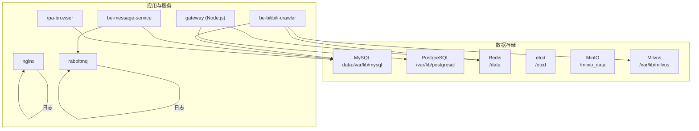
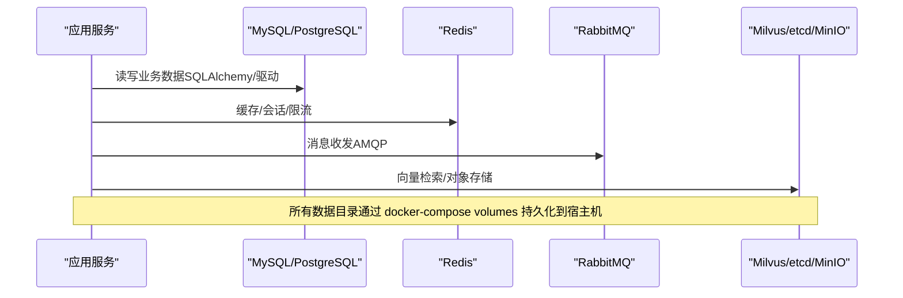
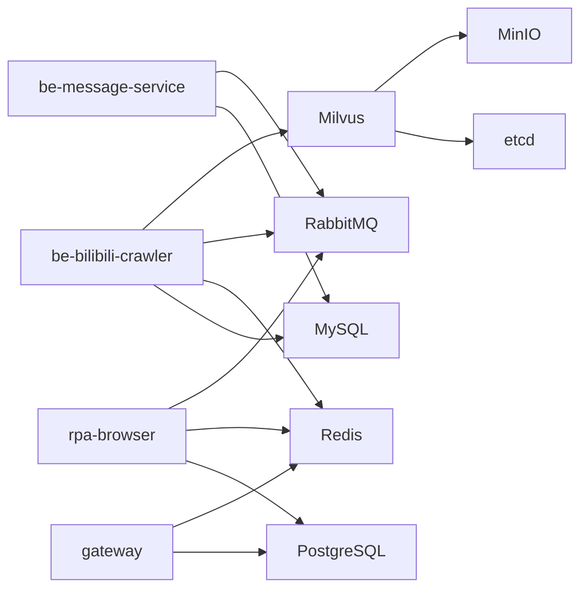

# 数据持久化策略

<cite>
**本文引用的文件**
- [docker-compose.yml](file://docker-compose.yml)
- [dc-dev.yml](file://dc-dev.yml)
- [CONFIG.py](file://be-bilibili-crawler/CONFIG.py)
- [config.py](file://RPA-Browser/app/config.py)
- [action_log_crud.py](file://RPA-Browser/app/services/execution/crud_service/action_log_crud.py)
- [getLotDynSortByDate.py](file://be-bilibili-crawler/Service/GrpcModule/Models/getLotDynSortByDate.py)
- [.gitignore](file://.gitignore)
- [dev_init_chmod.bash](file://dev_init_chmod.bash)
</cite>

## 目录
1. [简介](#简介)
2. [项目结构](#项目结构)
3. [核心组件](#核心组件)
4. [架构总览](#架构总览)
5. [详细组件分析](#详细组件分析)
6. [依赖关系分析](#依赖关系分析)
7. [性能考虑](#性能考虑)
8. [故障排查指南](#故障排查指南)
9. [结论](#结论)
10. [附录](#附录)

## 简介
本文件面向生产与运维，系统性说明本项目中 MySQL、PostgreSQL、Redis、Milvus 的数据卷挂载配置与备份策略，日志文件的持久化与管理方法，以及数据迁移、备份恢复、灾难恢复的最佳实践。同时给出存储容量监控、清理策略、性能优化建议，并说明容器重启后的数据一致性与完整性检查方法。

## 项目结构
本项目通过 Docker Compose 编排多服务与多数据库，关键数据持久化点如下：
- MySQL：配置文件与数据文件分别挂载到宿主机目录，便于备份与调优。
- PostgreSQL：数据目录挂载至宿主机，支持增量与逻辑备份。
- Redis：数据目录挂载，启用 AOF/RDB 以保障崩溃恢复。
- Milvus（含 etcd、MinIO）：etcd 状态、MinIO 对象存储、Milvus 索引与向量数据均持久化。
- 应用日志：Nginx 日志、RabbitMQ 日志、业务服务日志按需要挂载或输出到标准输出。

图表来源
- [docker-compose.yml:68-92](file://docker-compose.yml#L68-L92)
- [docker-compose.yml:165-178](file://docker-compose.yml#L165-L178)
- [docker-compose.yml:21-67](file://docker-compose.yml#L21-L67)
- [docker-compose.yml:94-109](file://docker-compose.yml#L94-L109)
- [docker-compose.yml:357-371](file://docker-compose.yml#L357-L371)

章节来源
- [docker-compose.yml:1-380](file://docker-compose.yml#L1-L380)
- [dc-dev.yml:1-213](file://dc-dev.yml#L1-L213)

## 核心组件
- 数据库连接与池化
  - be-bilibili-crawler 使用 SQLAlchemy 异步引擎与连接池，包含 pre-ping、recycle 等参数，避免陈旧连接导致错误。
  - 多库 URI 由配置集中生成，便于统一管理与切换。
- 日志持久化
  - Nginx 访问与错误日志挂载到宿主机目录。
  - RabbitMQ 日志与数据目录挂载。
  - 浏览器操作日志写入 MySQL 表，支持按保留天数自动清理。
- 向量与对象存储
  - Milvus 依赖 etcd 元数据与 MinIO 对象存储，三者数据均持久化。

章节来源
- [CONFIG.py:330-419](file://be-bilibili-crawler/CONFIG.py#L330-L419)
- [docker-compose.yml:94-109](file://docker-compose.yml#L94-L109)
- [docker-compose.yml:357-371](file://docker-compose.yml#L357-L371)
- [action_log_crud.py:212-226](file://RPA-Browser/app/services/execution/crud_service/action_log_crud.py#L212-L226)

## 架构总览
下图展示各服务与持久化组件的交互关系，以及数据落盘路径。

图表来源
- [docker-compose.yml:68-92](file://docker-compose.yml#L68-L92)
- [docker-compose.yml:165-178](file://docker-compose.yml#L165-L178)
- [docker-compose.yml:21-67](file://docker-compose.yml#L21-L67)
- [docker-compose.yml:94-109](file://docker-compose.yml#L94-L109)

## 详细组件分析

### MySQL 数据卷与备份
- 数据卷挂载
  - 配置文件目录：./docker_vol/mysql_data/conf.d -> /etc/mysql/conf.d
  - 数据目录：./docker_vol/mysql_data/data -> /var/lib/mysql
- 备份策略建议
  - 全量：mysqldump 定时导出，归档至远端对象存储。
  - 增量：开启 binlog，基于时间点恢复；定期校验 binlog 可用性。
  - 一致性：对热库可采用 xtrabackup 物理备份，或使用 mysqldump --single-transaction 保证一致性快照。
- 恢复流程
  - 停写或只读 -> 导入全量 -> 回放 binlog -> 验证数据一致性。
- 注意事项
  - 确保宿主机目录权限正确（WSL 环境可能需要 chmod）。
  - 调整 innodb_flush_log_at_trx_commit、sync_binlog 等参数平衡性能与可靠性。

章节来源
- [docker-compose.yml:68-81](file://docker-compose.yml#L68-L81)
- [dev_init_chmod.bash:1-3](file://dev_init_chmod.bash#L1-L3)

### PostgreSQL 数据卷与备份
- 数据卷挂载
  - 数据目录：./docker_vol/postgres/data -> /var/lib/postgresql
- 备份策略建议
  - 逻辑备份：pg_dump 定时导出，配合 pg_restore 恢复。
  - 物理备份：pg_basebackup + WAL 归档，实现 PITR（时间点恢复）。
  - 跨节点复制：利用流复制搭建从库，提升可用性与容灾能力。
- 恢复流程
  - 停止实例 -> 还原基础备份 -> 回放 WAL -> 启动并校验。
- 注意事项
  - 控制 wal_keep_size、max_wal_senders 等参数以满足恢复需求。
  - 定期校验备份可恢复性。

章节来源
- [docker-compose.yml:165-178](file://docker-compose.yml#L165-L178)

### Redis 数据卷与备份
- 数据卷挂载
  - 数据目录：./docker_vol/redis/data -> /data
- 持久化策略建议
  - 启用 AOF（appendonly=yes）与 RDB（save 规则），兼顾性能与恢复速度。
  - 合理设置 appendfsync（everysec 推荐）与 maxmemory-policy。
- 备份与恢复
  - 定期拷贝 AOF/RDB 文件至远端存储。
  - 恢复时替换数据目录并重启。
- 注意事项
  - 关注内存使用与淘汰策略，避免 OOM。
  - 大键扫描与慢查询需监控。

章节来源
- [docker-compose.yml:82-92](file://docker-compose.yml#L82-L92)

### Milvus、etcd、MinIO 数据卷与备份
- 数据卷挂载
  - etcd：./docker_vol/milvus/etcd -> /etcd
  - MinIO：./docker_vol/milvus/minio -> /minio_data
  - Milvus：./docker_vol/milvus/data -> /var/lib/milvus
- 备份策略建议
  - etcd：定期快照（etcdctl snapshot save），并校验恢复。
  - MinIO：对象级备份（mc mirror/snapshot），或云厂商快照。
  - Milvus：结合 etcd 快照与 MinIO 对象备份，必要时重建索引。
- 恢复流程
  - 先恢复 etcd 快照 -> 再恢复 MinIO 对象 -> 启动 Milvus 并校验集合与索引。
- 注意事项
  - 控制 etcd 后端配额与压缩策略，避免空间耗尽。
  - 向量数据增长快，需规划磁盘与分片策略。

章节来源
- [docker-compose.yml:21-67](file://docker-compose.yml#L21-L67)

### 日志持久化与管理
- Nginx 日志
  - 访问与错误日志挂载到 ./docker_vol/nginx/logs，便于集中收集与分析。
- RabbitMQ 日志
  - 日志目录挂载到 ./docker_vol/rabbitmq/logs，便于问题定位。
- 业务日志
  - be-message-service 默认将业务日志输出到 stderr（可通过环境变量控制级别），便于容器日志系统收集。
  - 浏览器操作日志写入 MySQL，支持按保留天数自动清理。
- 清理策略
  - 日志轮转：使用 logrotate 或外部日志系统（如 ELK/Loki）进行轮转与归档。
  - 过期清理：按业务策略删除过期日志记录，释放存储空间。

章节来源
- [docker-compose.yml:94-109](file://docker-compose.yml#L94-L109)
- [docker-compose.yml:357-371](file://docker-compose.yml#L357-L371)
- [action_log_crud.py:212-226](file://RPA-Browser/app/services/execution/crud_service/action_log_crud.py#L212-L226)

### 数据迁移（Alembic）
- 服务内嵌 Alembic 迁移脚本随源码挂载，容器启动时执行升级，确保数据库结构与代码一致。
- 建议
  - 迁移前备份数据库。
  - 在预发环境先行验证迁移脚本。
  - 回滚方案：准备反向迁移脚本或基于备份恢复。

章节来源
- [docker-compose.yml:227-260](file://docker-compose.yml#L227-L260)
- [docker-compose.yml:261-309](file://docker-compose.yml#L261-L309)

### 备份恢复与灾难恢复最佳实践
- 备份频率
  - 关键业务库：每日全量 + 实时/近实时增量（binlog/WAL）。
  - 缓存与队列：根据数据重要性选择是否备份（通常不持久化或仅备份必要状态）。
- 恢复演练
  - 定期在隔离环境演练恢复流程，验证 RTO/RPO 目标。
- 异地容灾
  - 将备份同步至异地对象存储或备份中心。
  - 建立多活或主从架构，缩短故障恢复时间。

章节来源
- [docker-compose.yml:68-92](file://docker-compose.yml#L68-L92)
- [docker-compose.yml:165-178](file://docker-compose.yml#L165-L178)
- [docker-compose.yml:21-67](file://docker-compose.yml#L21-L67)

### 存储容量监控与清理策略
- 监控指标
  - 磁盘使用率、Inode 使用率、数据库文件大小、对象存储桶大小。
  - 关键服务健康检查（etcd、MinIO、Milvus、MySQL、PostgreSQL、Redis）。
- 清理策略
  - 日志：按天/周轮转，保留固定周期后归档或删除。
  - 数据库：历史数据归档、分区表清理、索引重建。
  - 向量数据：定期评估集合大小与向量维度，必要时拆分或降维。
  - 临时文件：清理爬虫生成的中间结果与压缩包。

章节来源
- [docker-compose.yml:14-19](file://docker-compose.yml#L14-L19)
- [docker-compose.yml:34-38](file://docker-compose.yml#L34-L38)
- [docker-compose.yml:54-59](file://docker-compose.yml#L54-L59)
- [getLotDynSortByDate.py:8-16](file://be-bilibili-crawler/Service/GrpcModule/Models/getLotDynSortByDate.py#L8-L16)

### 容器重启后的数据一致性与完整性检查
- 启动顺序与依赖
  - 确保 etcd、MinIO 先于 Milvus 启动；MySQL/PostgreSQL/Redis 先于应用服务启动。
- 健康检查
  - 使用 healthcheck 探测关键服务端口与 API，失败则重试或告警。
- 一致性校验
  - 数据库：启动后执行关键表计数或校验和比对。
  - 向量库：校验集合存在性与索引状态。
  - 缓存：预热热点数据，避免雪崩。
- 幂等与补偿
  - 迁移脚本幂等设计；失败可重试。
  - 任务消费端具备去重与补偿机制。

章节来源
- [docker-compose.yml:14-19](file://docker-compose.yml#L14-L19)
- [docker-compose.yml:34-38](file://docker-compose.yml#L34-L38)
- [docker-compose.yml:54-59](file://docker-compose.yml#L54-L59)
- [docker-compose.yml:120-164](file://docker-compose.yml#L120-L164)

## 依赖关系分析
- 服务间依赖
  - be-bilibili-crawler 依赖 MySQL、Redis、RabbitMQ、Milvus。
  - be-message-service 依赖 MySQL、RabbitMQ。
  - gateway 依赖 PostgreSQL、Redis、Casdoor。
  - rpa-browser 依赖 PostgreSQL、Redis、RabbitMQ、Casdoor。
- 数据层依赖
  - Milvus 依赖 etcd（元数据）与 MinIO（对象存储）。
  - 各服务通过环境变量与连接串访问对应数据源。

图表来源
- [docker-compose.yml:120-164](file://docker-compose.yml#L120-L164)
- [docker-compose.yml:165-178](file://docker-compose.yml#L165-L178)
- [docker-compose.yml:227-260](file://docker-compose.yml#L227-L260)
- [docker-compose.yml:261-309](file://docker-compose.yml#L261-L309)
- [docker-compose.yml:21-67](file://docker-compose.yml#L21-L67)

章节来源
- [docker-compose.yml:120-164](file://docker-compose.yml#L120-L164)
- [docker-compose.yml:165-178](file://docker-compose.yml#L165-L178)
- [docker-compose.yml:227-260](file://docker-compose.yml#L227-L260)
- [docker-compose.yml:261-309](file://docker-compose.yml#L261-L309)
- [docker-compose.yml:21-67](file://docker-compose.yml#L21-L67)

## 性能考虑
- 数据库连接池
  - 使用 pool_pre_ping 与 pool_recycle 避免陈旧连接与空闲超时。
  - 分离业务与爬虫连接池，避免相互影响。
- 日志与 I/O
  - 日志输出到 stdout 由容器日志系统收集，减少磁盘 I/O 压力。
  - 对高频写入场景，评估 WAL/AOF 策略与刷盘频率。
- 向量与对象存储
  - 合理设置 etcd 配额与压缩，避免元数据膨胀。
  - MinIO 对象分片与生命周期策略，降低存储成本。
- 缓存与限流
  - Redis 作为缓存与会话存储，注意内存上限与淘汰策略。
  - 对高并发接口增加限流与降级策略。

章节来源
- [CONFIG.py:381-419](file://be-bilibili-crawler/CONFIG.py#L381-L419)
- [docker-compose.yml:94-109](file://docker-compose.yml#L94-L109)
- [docker-compose.yml:21-67](file://docker-compose.yml#L21-L67)

## 故障排查指南
- 常见问题
  - 权限问题：WSL 环境下数据库目录权限可能导致无法加载库，需在启动前修正权限。
  - 连接失败：检查环境变量与网络连通性，确认服务健康检查通过。
  - 备份不可用：校验备份文件完整性与恢复演练。
- 排查步骤
  - 查看容器日志与挂载目录日志。
  - 检查健康检查端点返回状态。
  - 核对数据库连接串与凭据。
  - 对关键表执行计数或校验和比对。

章节来源
- [dev_init_chmod.bash:1-3](file://dev_init_chmod.bash#L1-L3)
- [docker-compose.yml:14-19](file://docker-compose.yml#L14-L19)
- [docker-compose.yml:34-38](file://docker-compose.yml#L34-L38)
- [docker-compose.yml:54-59](file://docker-compose.yml#L54-L59)

## 结论
本项目通过 Docker Compose 实现了多数据库与多服务的统一编排，关键数据均通过卷挂载持久化到宿主机。结合合理的备份策略、健康检查与清理机制，可有效保障数据的安全性与可用性。建议在生产环境完善自动化备份与恢复演练，持续监控存储容量与性能指标，确保系统在扩容与变更过程中保持稳定。

## 附录
- 版本控制与忽略
  - .gitignore 中排除了大部分 docker_vol 内容，但保留了部分初始化与配置目录，便于协作与部署。
- 开发环境初始化
  - 提供权限修正脚本，解决 WSL 下数据库目录权限问题。

章节来源
- [.gitignore:27-42](file://.gitignore#L27-L42)
- [dev_init_chmod.bash:1-3](file://dev_init_chmod.bash#L1-L3)