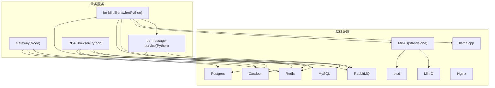
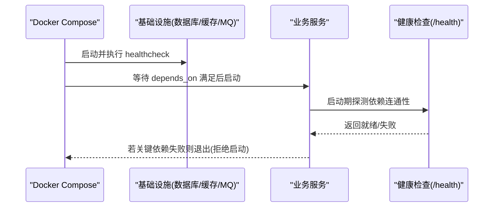
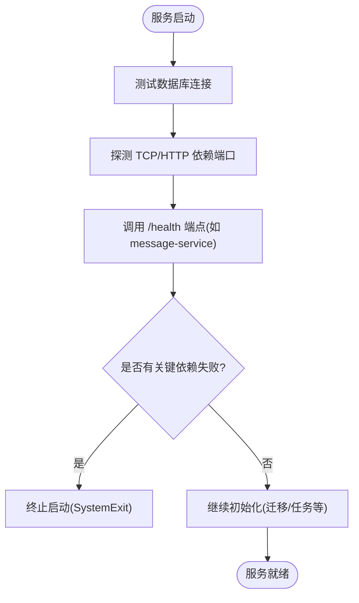
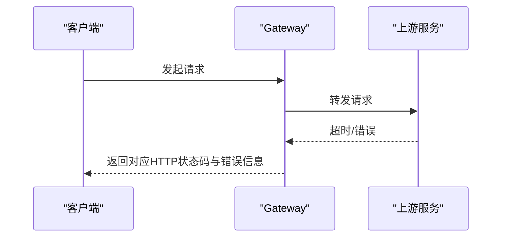
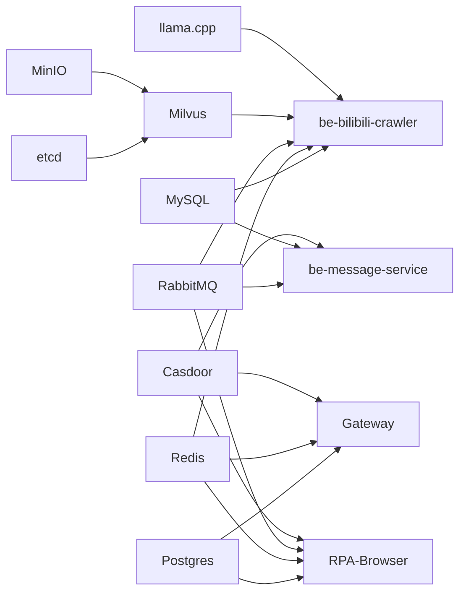

# 服务依赖管理

<cite>
**本文引用的文件**
- [docker-compose.yml](file://docker-compose.yml)
- [dc-dev.yml](file://dc-dev.yml)
- [Dockerfile.mono](file://Dockerfile.mono)
- [FastapiLifespan.py](file://be-bilibili-crawler/Utils/FastAPI/FastapiLifespan.py)
- [config.py（消息服务）](file://be-message-service/app/core/config.py)
- [config.py（RPA-Browser）](file://RPA-Browser/app/config.py)
- [app.js（网关）](file://be-gateway/ExpressServerEnd/app.js)
</cite>

## 目录
1. [简介](#简介)
2. [项目结构](#项目结构)
3. [核心组件](#核心组件)
4. [架构总览](#架构总览)
5. [详细组件分析](#详细组件分析)
6. [依赖关系分析](#依赖关系分析)
7. [性能与资源竞争优化](#性能与资源竞争优化)
8. [故障恢复与降级策略](#故障恢复与降级策略)
9. [结论](#结论)
10. [附录：健康检查清单](#附录：健康检查清单)

## 简介
本指南聚焦于多服务环境下的“服务依赖管理”，围绕 Docker Compose 的 depends_on、健康检查与就绪检测展开，结合仓库中实际配置与代码实现，说明如何：
- 通过 depends_on 控制服务启动顺序
- 使用 healthcheck 与服务端 /health 端点实现“依赖就绪”检测
- 处理复杂依赖链路与级联失败
- 优化启停顺序并缓解资源竞争
- 在依赖失败时提供降级与容错机制

## 项目结构
本项目采用容器化部署，核心编排文件为 docker-compose.yml（生产/通用）与 dc-dev.yml（开发精简）。关键服务包括：
- 基础设施：MySQL、Redis、Postgres、RabbitMQ、etcd、MinIO、Milvus、Nginx、Casdoor、llama.cpp
- 业务服务：be-bilibili-crawler、be-message-service、RPA-Browser、Gateway（Node.js）
- 构建镜像：Dockerfile.mono 提供 crawler/rpa/message 三个 Python 服务的统一构建目标

图表来源
- [docker-compose.yml:1-380](file://docker-compose.yml#L1-L380)
- [dc-dev.yml:1-213](file://dc-dev.yml#L1-L213)
- [Dockerfile.mono:1-146](file://Dockerfile.mono#L1-L146)

章节来源
- [docker-compose.yml:1-380](file://docker-compose.yml#L1-L380)
- [dc-dev.yml:1-213](file://dc-dev.yml#L1-L213)
- [Dockerfile.mono:1-146](file://Dockerfile.mono#L1-L146)

## 核心组件
- 启动顺序控制：通过 depends_on 声明服务间的启动先后关系。
- 健康检查：对基础设施服务定义 healthcheck；对应用服务暴露 /health 端点，由编排层或上游服务探测。
- 启动期依赖校验：应用侧在生命周期内主动探测依赖连通性，必要时拒绝启动或降级运行。
- 资源限制：对高负载服务设置内存等限制，避免争抢资源导致雪崩。

章节来源
- [docker-compose.yml:1-380](file://docker-compose.yml#L1-L380)
- [dc-dev.yml:1-213](file://dc-dev.yml#L1-L213)
- [FastapiLifespan.py:1-258](file://be-bilibili-crawler/Utils/FastAPI/FastapiLifespan.py#L1-L258)
- [config.py（消息服务）:1-375](file://be-message-service/app/core/config.py#L1-L375)
- [config.py（RPA-Browser）:1-235](file://RPA-Browser/app/config.py#L1-L235)

## 架构总览
下图展示了依赖关系、健康检查与启动期探测的组合方式：编排层负责“先启动谁”，应用层负责“是否真正就绪”。

图表来源
- [docker-compose.yml:14-67](file://docker-compose.yml#L14-L67)
- [docker-compose.yml:310-322](file://docker-compose.yml#L310-L322)
- [FastapiLifespan.py:183-251](file://be-bilibili-crawler/Utils/FastAPI/FastapiLifespan.py#L183-L251)

## 详细组件分析

### 1) Docker Compose 中的 depends_on 与启动顺序
- 基础依赖：
  - Milvus(standalone) 依赖 etcd 与 MinIO，确保元数据与对象存储可用后再启动。
- 业务依赖：
  - be-bilibili-crawler 依赖 MySQL、Redis、RabbitMQ、Unidbg，并通过环境变量注入各依赖地址。
  - Gateway 依赖 Postgres、Redis、Casdoor。
  - RPA-Browser 依赖 Postgres、Redis、RabbitMQ、Casdoor。
  - be-message-service 依赖 RabbitMQ、MySQL、Casdoor。
- 开发环境：dc-dev.yml 仅包含最小必要服务，便于快速调试。

建议与注意事项
- 对于冷启动较慢的服务（如 Milvus），配合 healthcheck 与 start_period，避免“端口可达但服务未就绪”导致的启动失败。
- 将强依赖写入 depends_on，弱依赖（如外部代理、可选 LLM）可在应用层做降级。

章节来源
- [docker-compose.yml:41-67](file://docker-compose.yml#L41-L67)
- [docker-compose.yml:120-164](file://docker-compose.yml#L120-L164)
- [docker-compose.yml:179-212](file://docker-compose.yml#L179-L212)
- [docker-compose.yml:227-260](file://docker-compose.yml#L227-L260)
- [docker-compose.yml:261-309](file://docker-compose.yml#L261-L309)
- [dc-dev.yml:122-169](file://dc-dev.yml#L122-L169)

### 2) 健康检查与依赖就绪检测
- 编排层 healthcheck：
  - etcd：etcdctl endpoint health
  - MinIO：HTTP /minio/health/live
  - Milvus：HTTP /healthz
  - be-message-service：自定义 /health（内部会校验 broker 连通性）
- 应用层就绪检测（以 be-bilibili-crawler 为例）：
  - 启动期依次测试数据库连接、TCP/HTTP 端口连通性、关键服务 /health 端点。
  - 对关键依赖（critical=True）失败直接终止启动；非关键依赖仅记录告警。
  - 额外支持通过 HTTP 代理进行外网出口验证（不阻断启动）。

图表来源
- [docker-compose.yml:14-67](file://docker-compose.yml#L14-L67)
- [docker-compose.yml:310-322](file://docker-compose.yml#L310-L322)
- [FastapiLifespan.py:64-115](file://be-bilibili-crawler/Utils/FastAPI/FastapiLifespan.py#L64-L115)
- [FastapiLifespan.py:118-134](file://be-bilibili-crawler/Utils/FastAPI/FastapiLifespan.py#L118-L134)
- [FastapiLifespan.py:183-251](file://be-bilibili-crawler/Utils/FastAPI/FastapiLifespan.py#L183-L251)

章节来源
- [docker-compose.yml:14-67](file://docker-compose.yml#L14-L67)
- [docker-compose.yml:310-322](file://docker-compose.yml#L310-L322)
- [FastapiLifespan.py:183-251](file://be-bilibili-crawler/Utils/FastAPI/FastapiLifespan.py#L183-L251)

### 3) 复杂依赖关系的处理
- 分层依赖：
  - 第一层：etcd、MinIO、MySQL、Redis、Postgres、RabbitMQ、Casdoor
  - 第二层：Milvus（依赖 etcd/MinIO）、be-message-service（依赖 MQ/DB/Casdoor）
  - 第三层：be-bilibili-crawler、RPA-Browser、Gateway（依赖上层服务）
- 启动顺序优化：
  - 将最底层的基础设施优先启动，再按依赖层级逐步拉起业务服务。
  - 对慢启动服务（如 Milvus）增加 start_period，避免误判。
- 资源隔离：
  - 对高内存服务（如 be-bilibili-crawler）设置 memory limit，防止抢占其他服务资源。

章节来源
- [docker-compose.yml:41-67](file://docker-compose.yml#L41-L67)
- [docker-compose.yml:120-164](file://docker-compose.yml#L120-L164)
- [docker-compose.yml:261-309](file://docker-compose.yml#L261-L309)

### 4) 服务启停顺序与资源竞争解决方案
- 启停顺序
  - 启动：先基础设施 → 中间件（MQ/缓存/DB）→ 业务服务（按依赖图）
  - 停止：反向顺序，先业务服务 → 中间件 → 基础设施
- 资源竞争
  - 为 CPU/内存敏感服务设置 limits（例如 be-bilibili-crawler 的 memory 限制）
  - 合理设置 healthcheck interval/timeout/retries/start_period，避免频繁重试造成抖动
  - 数据库连接池参数需根据实例规模调优（见消息服务配置）

章节来源
- [docker-compose.yml:120-164](file://docker-compose.yml#L120-L164)
- [config.py（消息服务）:41-74](file://be-message-service/app/core/config.py#L41-L74)

### 5) 依赖失败时的降级与容错
- 关键依赖失败：
  - be-bilibili-crawler 在启动期检测到关键依赖不可用，直接终止启动，避免进入不稳定状态。
- 非关键依赖失败：
  - 记录告警并继续启动，后续功能按需降级（例如可选 LLM、代理出口不可用时回退逻辑）。
- 网关层容错：
  - Gateway 对上游请求错误映射为合适的 HTTP 状态码，并返回统一错误结构，便于前端降级展示。

图表来源
- [app.js（网关）:163-184](file://be-gateway/ExpressServerEnd/app.js#L163-L184)

章节来源
- [FastapiLifespan.py:242-251](file://be-bilibili-crawler/Utils/FastAPI/FastapiLifespan.py#L242-L251)
- [app.js（网关）:163-184](file://be-gateway/ExpressServerEnd/app.js#L163-L184)

## 依赖关系分析
- 服务耦合度
  - 业务服务与基础设施解耦良好，通过环境变量注入连接串与地址
  - 应用间通信主要基于 HTTP/RPC 与消息队列，降低紧耦合风险
- 直接/间接依赖
  - be-bilibili-crawler 间接依赖 Milvus → etcd/MinIO
  - Gateway 间接依赖 Casdoor → Postgres
- 外部依赖
  - LLM（llama.cpp）作为可选能力，可通过应用层开关与降级策略控制

图表来源
- [docker-compose.yml:1-380](file://docker-compose.yml#L1-L380)

章节来源
- [docker-compose.yml:1-380](file://docker-compose.yml#L1-L380)

## 性能与资源竞争优化
- 健康检查间隔与超时
  - 对慢启动服务（如 Milvus）设置较大的 start_period，减少误报
  - 合理设置 interval/timeout/retries，避免频繁探测引发抖动
- 连接池与并发
  - 数据库连接池大小与溢出上限需匹配实例规格（参考消息服务配置项）
- 资源限制
  - 对高内存服务设置 memory limit，避免 OOM 影响其他服务
- 网络与 I/O
  - 合理分配端口与挂载卷，避免宿主机端口冲突与磁盘 IO 瓶颈

章节来源
- [docker-compose.yml:54-67](file://docker-compose.yml#L54-L67)
- [docker-compose.yml:120-164](file://docker-compose.yml#L120-L164)
- [config.py（消息服务）:41-74](file://be-message-service/app/core/config.py#L41-L74)

## 故障恢复与降级策略
- 启动期失败
  - 关键依赖不可用：立即终止启动，避免半可用状态
  - 非关键依赖不可用：记录告警，功能降级
- 运行时失败
  - 网关层对上游错误进行状态码映射与统一响应
  - 消息推送链路具备限流与去重保护，避免风暴
- 恢复策略
  - 依赖恢复后，服务可自动重新建立连接（MQ/DB/缓存）
  - 对慢启动服务，利用 healthcheck 与 start_period 提升稳定性

章节来源
- [FastapiLifespan.py:183-251](file://be-bilibili-crawler/Utils/FastAPI/FastapiLifespan.py#L183-L251)
- [app.js（网关）:163-184](file://be-gateway/ExpressServerEnd/app.js#L163-L184)

## 结论
通过“编排层 depends_on + healthcheck”与“应用层启动期依赖探测”的双保险机制，本项目实现了稳健的服务依赖管理与就绪检测。针对复杂依赖链路与资源竞争，提供了分层启动、资源限制与健康检查调优等实践。在依赖失败场景下，通过关键/非关键依赖分级与网关层容错，实现了良好的降级与恢复能力。

## 附录：健康检查清单
- 基础设施
  - etcd：etcdctl endpoint health
  - MinIO：/minio/health/live
  - Milvus：/healthz
  - MySQL/Redis/Postgres/RabbitMQ：端口可达性
- 业务服务
  - be-message-service：/health（内置 broker 连通性校验）
  - be-bilibili-crawler：启动期探测所有关键依赖
  - Gateway：上游错误映射与统一错误响应

章节来源
- [docker-compose.yml:14-67](file://docker-compose.yml#L14-L67)
- [docker-compose.yml:310-322](file://docker-compose.yml#L310-L322)
- [FastapiLifespan.py:183-251](file://be-bilibili-crawler/Utils/FastAPI/FastapiLifespan.py#L183-L251)
- [app.js（网关）:163-184](file://be-gateway/ExpressServerEnd/app.js#L163-L184)