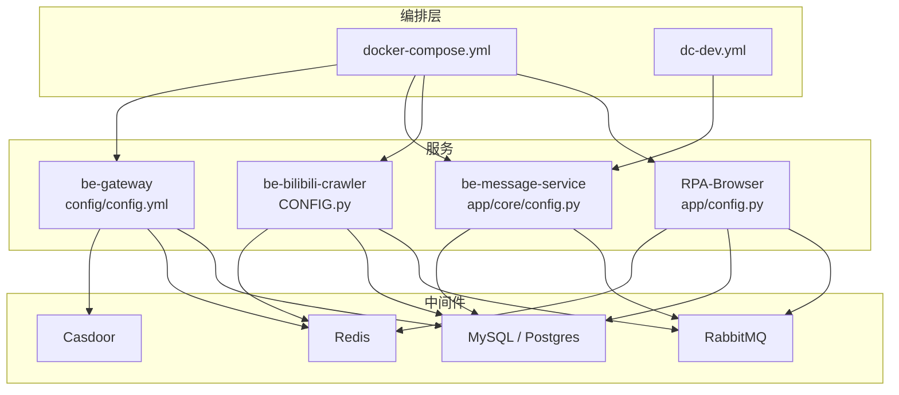
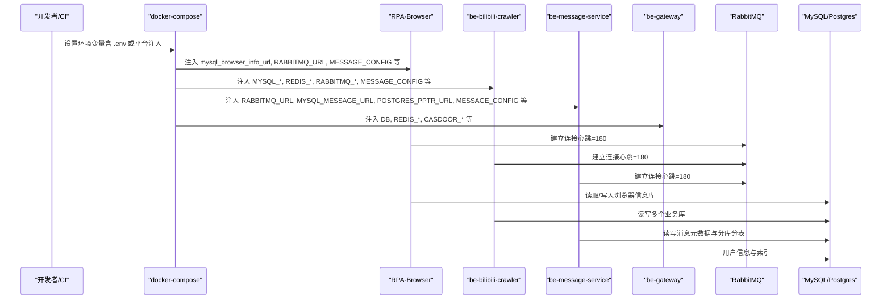
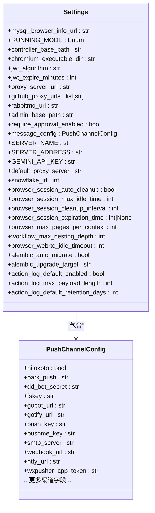
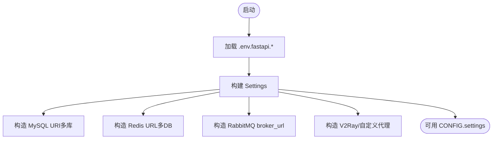
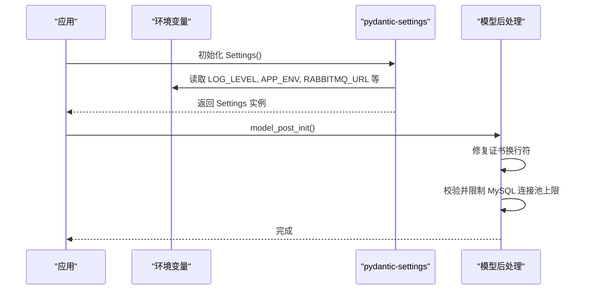
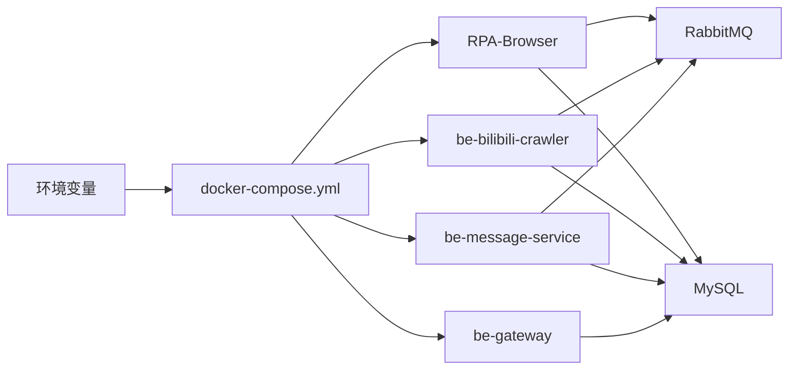

# 环境变量配置管理

<cite>
**本文引用的文件**
- [RPA-Browser/app/config.py](file://RPA-Browser/app/config.py)
- [be-bilibili-crawler/CONFIG.py](file://be-bilibili-crawler/CONFIG.py)
- [be-message-service/app/core/config.py](file://be-message-service/app/core/config.py)
- [docker-compose.yml](file://docker-compose.yml)
- [dc-dev.yml](file://dc-dev.yml)
- [be-gateway/ExpressServerEnd/config/config.yml](file://be-gateway/ExpressServerEnd/config/config.yml)
- [be-bilibili-crawler/Service/BaseCrawler/config.py](file://be-bilibili-crawler/Service/BaseCrawler/config.py)
</cite>

## 目录
1. [简介](#简介)
2. [项目结构](#项目结构)
3. [核心组件](#核心组件)
4. [架构总览](#架构总览)
5. [详细组件分析](#详细组件分析)
6. [依赖关系分析](#依赖关系分析)
7. [性能与容量规划](#性能与容量规划)
8. [故障排查指南](#故障排查指南)
9. [结论](#结论)
10. [附录：环境差异与最佳实践](#附录：环境差异与最佳实践)

## 简介
本指南围绕仓库中的多服务（RPA-Browser、be-bilibili-crawler、be-message-service、be-gateway）的环境变量配置管理，系统化说明：
- 各服务的运行时配置来源（pydantic-settings 的 .env 文件与环境变量）、默认值与作用域
- 跨服务共享的配置项（如消息推送渠道、RabbitMQ、数据库连接等）
- 开发/测试/生产环境的差异与切换方式
- 敏感信息管理、配置校验与环境切换的最佳实践
- 容器间传递配置的方式与“热更新”策略建议
- 常见问题定位与解决方案

## 项目结构
本项目采用多服务架构，关键配置集中在各服务的 Settings 类中，并通过 docker-compose 将环境变量注入到对应容器中。

图表来源
- [docker-compose.yml:120-164](file://docker-compose.yml#L120-L164)
- [docker-compose.yml:227-260](file://docker-compose.yml#L227-L260)
- [docker-compose.yml:261-309](file://docker-compose.yml#L261-L309)
- [docker-compose.yml:179-212](file://docker-compose.yml#L179-L212)

章节来源
- [docker-compose.yml:1-380](file://docker-compose.yml#L1-L380)
- [dc-dev.yml:1-213](file://dc-dev.yml#L1-L213)

## 核心组件
- RPA-Browser 配置
  - 使用 pydantic-settings 加载 .env.prod/.env.dev（按顺序），并暴露 settings 实例
  - 关键配置包括：运行模式、JWT、代理、RabbitMQ RPC、浏览器会话控制、工作流限制、WebRTC 超时、Alembic 迁移开关、操作日志采集等
  - 全局推送渠道通过 message_config（PushChannelConfig）统一承载，支持多种通知渠道

- be-bilibili-crawler 配置
  - 使用 pydantic-settings 加载 .env.fastapi.prod/.env.fastapi.dev
  - 关键配置包括：MySQL/Redis/RabbitMQ、UNIDBG/V2RAY/LLAMA、Milvus、消息服务地址、日志级别、是否开发环境、第三方动态获取配置、外部 LLM API 列表等
  - 提供爬虫专用连接池与独立配置注册表，隔离业务与爬虫资源

- be-message-service 配置
  - 使用 pydantic-settings 加载 app/.env
  - 关键配置包括：RabbitMQ、日志级别、HTTP 健康检查端口、MySQL/Postgres 连接串与连接池、Alembic 自动迁移、ID 生成器（msgkey/uid/moment_id/topic_id）、GeoIP、EdgeRank 推荐参数、私信/评论审核策略、JWT/Casdoor、推送渠道等
  - 内置安全保护：对 MySQL 连接池上限进行防御性修正

- be-gateway 配置
  - 使用 YAML 配置文件集中管理 salt、JWT secret、等级配置、定时任务、RabbitMQ 连接与 RPC 超时等

章节来源
- [RPA-Browser/app/config.py:140-216](file://RPA-Browser/app/config.py#L140-L216)
- [be-bilibili-crawler/CONFIG.py:225-277](file://be-bilibili-crawler/CONFIG.py#L225-L277)
- [be-message-service/app/core/config.py:5-375](file://be-message-service/app/core/config.py#L5-L375)
- [be-gateway/ExpressServerEnd/config/config.yml:1-29](file://be-gateway/ExpressServerEnd/config/config.yml#L1-L29)

## 架构总览
下图展示环境变量在各服务间的传递与生效路径：

图表来源
- [docker-compose.yml:120-164](file://docker-compose.yml#L120-L164)
- [docker-compose.yml:227-260](file://docker-compose.yml#L227-L260)
- [docker-compose.yml:261-309](file://docker-compose.yml#L261-L309)
- [docker-compose.yml:179-212](file://docker-compose.yml#L179-L212)

## 详细组件分析

### RPA-Browser 配置模型
- 配置加载
  - 通过 pydantic-settings 指定 env_file 优先级为 .env.prod -> .env.dev
  - 大小写不敏感，忽略多余字段
- 关键字段与作用
  - 运行模式、控制器基础路径、Chromium 可执行目录
  - JWT 算法与过期时间
  - 代理地址、GitHub 镜像代理列表
  - RabbitMQ URL（心跳=180，适配长耗时 RPC）
  - 审批强制开关、服务器标识、Gemini API Key、默认代理
  - 浏览器会话清理策略、页面数量限制、工作流嵌套深度限制
  - WebRTC 空闲超时、Alembic 自动迁移、操作日志采集策略
  - 全局推送渠道 message_config（PushChannelConfig）

图表来源
- [RPA-Browser/app/config.py:13-139](file://RPA-Browser/app/config.py#L13-L139)
- [RPA-Browser/app/config.py:140-216](file://RPA-Browser/app/config.py#L140-L216)

章节来源
- [RPA-Browser/app/config.py:1-235](file://RPA-Browser/app/config.py#L1-L235)

### be-bilibili-crawler 配置模型
- 配置加载
  - 通过 pydantic-settings 指定 .env.fastapi.prod/.env.fastapi.dev
- 关键字段与作用
  - 数据库（MySQL）、缓存（Redis）、消息队列（RabbitMQ）
  - UNIDBG、V2RAY、LLAMA、Milvus 等外部依赖地址
  - 消息服务地址、日志级别、是否开发环境
  - 第三方动态获取并发与时间窗口、外部 LLM API 列表
  - 爬虫专用连接池与业务连接池隔离
  - 推送渠道 message_config（与 RPA-Browser/message-service 共用同一模型）

图表来源
- [be-bilibili-crawler/CONFIG.py:225-277](file://be-bilibili-crawler/CONFIG.py#L225-L277)
- [be-bilibili-crawler/CONFIG.py:330-433](file://be-bilibili-crawler/CONFIG.py#L330-L433)

章节来源
- [be-bilibili-crawler/CONFIG.py:1-487](file://be-bilibili-crawler/CONFIG.py#L1-L487)
- [be-bilibili-crawler/Service/BaseCrawler/config.py:48-244](file://be-bilibili-crawler/Service/BaseCrawler/config.py#L48-L244)

### be-message-service 配置模型
- 配置加载
  - 通过 pydantic-settings 加载 app/.env
- 关键字段与作用
  - RabbitMQ、日志级别、HTTP 健康检查端口
  - MySQL/Postgres 连接串与连接池、Alembic 自动迁移
  - ID 生成器（msgkey/uid/moment_id/topic_id）及其 epoch/worker/位宽
  - GeoIP 目录、活跃度与调度间隔
  - EdgeRank 推荐权重、候选集召回开关与阈值
  - 私信/评论审核策略、举报阈值
  - JWT 与 Casdoor 集成
  - 推送渠道 message_config（JSON 环境变量）

图表来源
- [be-message-service/app/core/config.py:5-375](file://be-message-service/app/core/config.py#L5-L375)

章节来源
- [be-message-service/app/core/config.py:1-375](file://be-message-service/app/core/config.py#L1-L375)

### be-gateway 配置
- 使用 YAML 集中管理密码盐、JWT secret、等级经验要求、定时任务、RabbitMQ 连接与 RPC 超时等
- 注意：该配置与 Python 侧的 JWT secret 需保持一致，避免鉴权失败

章节来源
- [be-gateway/ExpressServerEnd/config/config.yml:1-29](file://be-gateway/ExpressServerEnd/config/config.yml#L1-L29)

## 依赖关系分析
- 环境变量注入点
  - docker-compose.yml 在多个服务中显式注入数据库、缓存、消息队列、Casdoor、消息推送等环境变量
  - dc-dev.yml 用于开发环境精简部署，仅包含必要服务与最小化环境变量
- 共享配置
  - MESSAGE_CONFIG 作为 JSON 字符串在 RPA-Browser、be-bilibili-crawler、be-message-service 之间共享，统一推送渠道配置
  - RabbitMQ 心跳=180 在多服务中保持一致，避免长耗时任务导致连接断开
- 配置验证与安全
  - be-message-service 在 model_post_init 中对 MySQL 连接池上限做防御性修正，防止误配导致连接风暴
  - JWT/Casdoor 相关密钥通过环境变量注入，避免硬编码

图表来源
- [docker-compose.yml:120-164](file://docker-compose.yml#L120-L164)
- [docker-compose.yml:227-260](file://docker-compose.yml#L227-L260)
- [docker-compose.yml:261-309](file://docker-compose.yml#L261-L309)
- [docker-compose.yml:179-212](file://docker-compose.yml#L179-L212)

章节来源
- [docker-compose.yml:1-380](file://docker-compose.yml#L1-L380)
- [dc-dev.yml:1-213](file://dc-dev.yml#L1-L213)

## 性能与容量规划
- 连接池与超时
  - be-bilibili-crawler 为业务与爬虫分别配置独立的 SQLAlchemy 连接池，避免爬虫高并发抢占业务连接
  - RabbitMQ heartbeat=180 在多服务中保持一致，降低长耗时任务断连风险
  - be-message-service 对 MySQL 连接池上限进行防御性修正，防止误配导致 Too many connections
- 日志与监控
  - be-message-service 支持 FastStream 内部日志级别与业务日志级别分离，生产默认 WARNING 压日志量
  - RPA-Browser 支持 Alembic 自动迁移开关，便于在 CI/CD 中控制迁移时机
- 推荐算法参数
  - be-message-service 提供丰富的 EdgeRank 权重与召回开关，可按场景调优内容排序与冷启动策略

章节来源
- [be-bilibili-crawler/CONFIG.py:381-419](file://be-bilibili-crawler/CONFIG.py#L381-L419)
- [be-message-service/app/core/config.py:20-375](file://be-message-service/app/core/config.py#L20-L375)

## 故障排查指南
- 无法连接数据库
  - 检查 docker-compose 中对应的 *_HOST/*_PORT/*_PASSWORD 是否正确注入
  - 确认服务依赖已就绪（depends_on）
- RabbitMQ 连接频繁断开
  - 确认 heartbeat=180 一致；检查网络与防火墙
- 推送通知未生效
  - 检查 MESSAGE_CONFIG JSON 是否合法，字段名是否与 PushChannelConfig 一致
  - 确认目标渠道凭据正确（如 pushme_key、push_plus_token、smtp_* 等）
- 登录/鉴权失败
  - 核对 be-gateway 与 be-message-service 的 JWT secret 是否一致
  - 检查 Casdoor 相关环境变量（endpoint、client_id、client_secret、organization、application、certificate）
- 连接池过大导致崩溃
  - 参考 be-message-service 的连接池保护逻辑，调整 mysql_pool_size 与 mysql_max_overflow

章节来源
- [be-message-service/app/core/config.py:351-360](file://be-message-service/app/core/config.py#L351-L360)
- [docker-compose.yml:120-164](file://docker-compose.yml#L120-L164)
- [docker-compose.yml:227-260](file://docker-compose.yml#L227-L260)
- [docker-compose.yml:261-309](file://docker-compose.yml#L261-L309)
- [be-gateway/ExpressServerEnd/config/config.yml:1-29](file://be-gateway/ExpressServerEnd/config/config.yml#L1-L29)

## 结论
- 本项目通过 pydantic-settings 统一管理各服务的运行时配置，结合 docker-compose 实现环境变量的集中注入
- 跨服务共享的关键配置（MESSAGE_CONFIG、RabbitMQ、数据库连接等）通过环境变量与模型约束保证一致性
- 建议在部署时严格区分开发/测试/生产环境，使用不同的 .env 文件与环境变量注入策略
- 敏感信息应通过环境变量或密钥管理服务注入，避免写入代码仓库
- 对于“热更新”，当前配置以进程启动时加载为主；如需运行时热更新，可在服务内暴露配置重载接口并结合配置中心或文件监听机制实现

## 附录：环境差异与最佳实践

### 环境差异概览
- 开发环境
  - 使用 dc-dev.yml 精简部署，减少非必要服务
  - 日志级别可设为 DEBUG，便于问题定位
- 测试环境
  - 可复用生产配置模板，但替换为测试数据库与测试凭据
  - 开启必要的功能开关（如审批强制、审核策略）以覆盖测试用例
- 生产环境
  - 关闭调试日志，仅输出 WARNING 及以上
  - 严格限制连接池上限，启用健康检查与告警
  - 使用独立的 .env 文件或平台密钥管理服务注入敏感信息

### 敏感信息安全管理
- 所有密钥（数据库密码、JWT secret、Casdoor 凭据、推送渠道 token）均通过环境变量注入
- 禁止将 .env 文件提交至版本库；使用 .gitignore 排除
- 建议使用平台级密钥管理（如 Docker secrets、Kubernetes Secrets、云厂商密钥服务）

### 配置验证与环境切换
- 利用 pydantic 类型校验确保配置合法性（如枚举、数值范围）
- 在模型后处理中进行防御性修正（如连接池上限保护）
- 通过不同 .env 文件与环境变量组合实现环境切换

### 容器间传递配置与热更新
- 容器间传递
  - 通过 docker-compose environment 注入共享配置（如 MESSAGE_CONFIG、RABBITMQ_URL）
  - 使用服务名作为主机名访问同网络下的其他服务（如 rabbitmq、mysql、postgres）
- 热更新建议
  - 当前配置在进程启动时加载；如需热更新，可在服务内暴露重载接口，配合文件监听或配置中心推送
  - 对不可热更新的配置（如数据库连接串），建议通过滚动重启实现

章节来源
- [docker-compose.yml:120-164](file://docker-compose.yml#L120-L164)
- [docker-compose.yml:227-260](file://docker-compose.yml#L227-L260)
- [docker-compose.yml:261-309](file://docker-compose.yml#L261-L309)
- [dc-dev.yml:1-213](file://dc-dev.yml#L1-L213)
- [be-message-service/app/core/config.py:351-360](file://be-message-service/app/core/config.py#L351-L360)