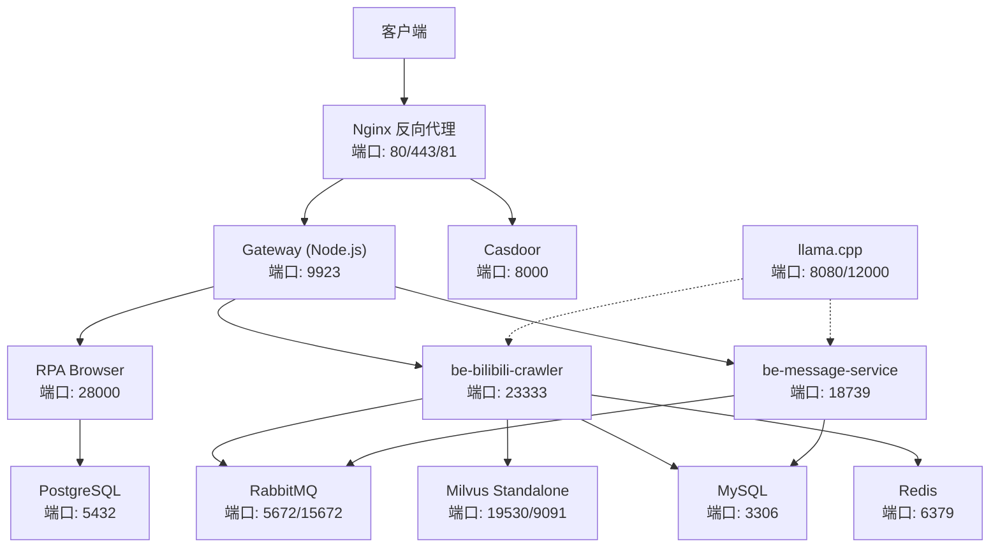
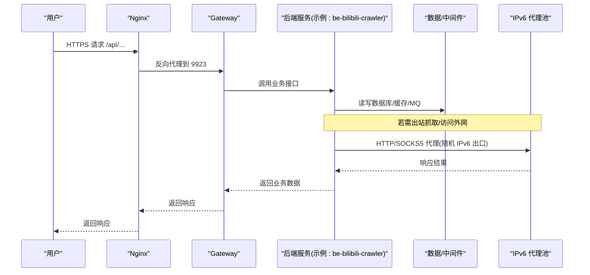
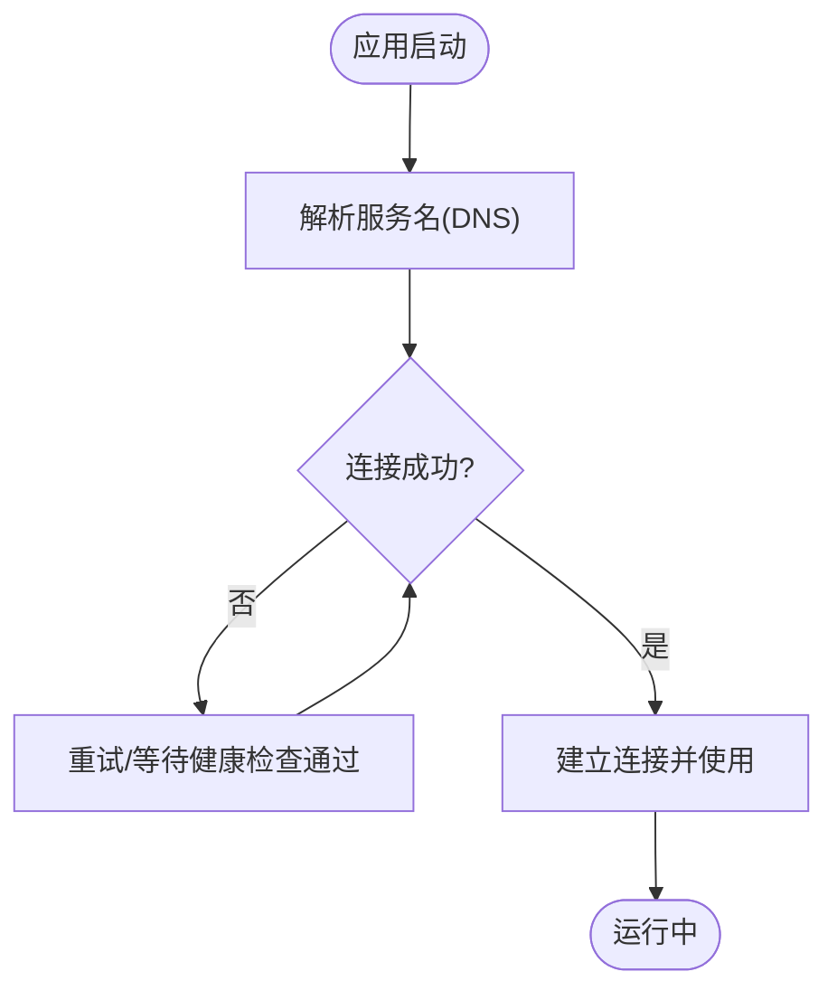
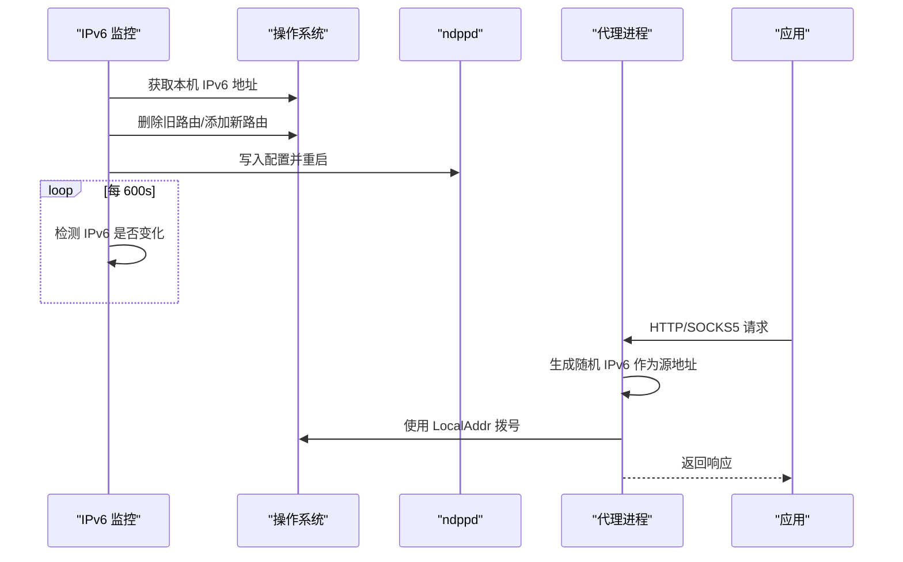
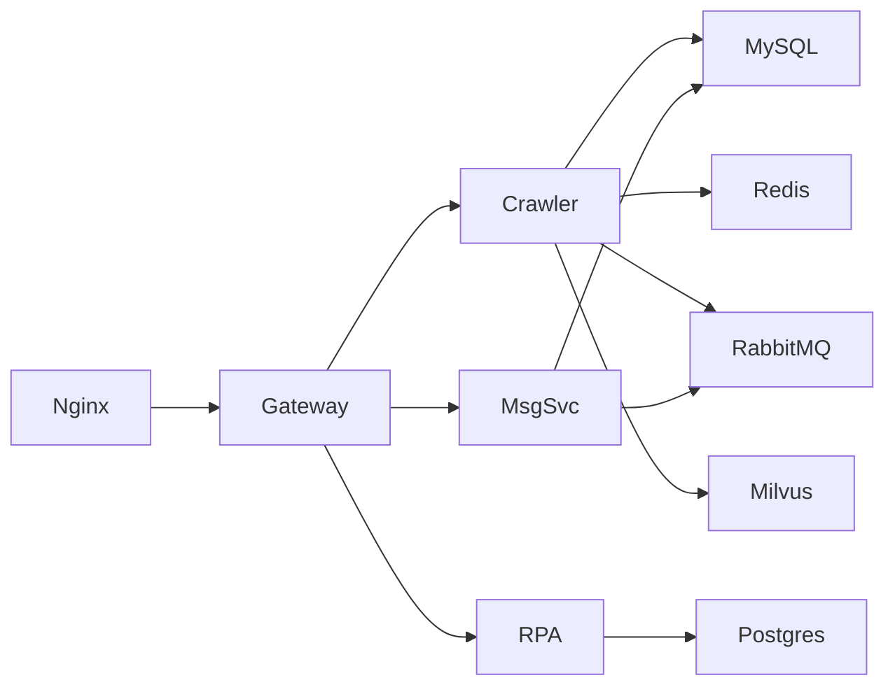

# 网络配置与通信

<cite>
**本文引用的文件**
- [docker-compose.yml](file://docker-compose.yml)
- [dc-dev.yml](file://dc-dev.yml)
- [nginx.conf](file://docker_vol/nginx/conf/nginx.conf)
- [go-proxy-ipv6-pool 主程序](file://go-proxy-ipv6-pool-auto/go-proxy-ipv6-pool/main.go)
- [IPv6 监控与 ndppd 管理](file://go-proxy-ipv6-pool-auto/go-proxy-ipv6-pool/ipv6_monitor.go)
- [HTTP/SOCKS5 代理实现](file://go-proxy-ipv6-pool-auto/go-proxy-ipv6-pool/http.go)
- [IPv6 池 docker-compose](file://go-proxy-ipv6-pool-auto/docker-compose.yml)
- [RPA 浏览器导航安全校验](file://RPA-Browser/app/services/execution/actions/navigation.py)
</cite>

## 目录
1. [简介](#简介)
2. [项目结构](#项目结构)
3. [核心组件](#核心组件)
4. [架构总览](#架构总览)
5. [详细组件分析](#详细组件分析)
6. [依赖关系分析](#依赖关系分析)
7. [性能考量](#性能考量)
8. [故障排查指南](#故障排查指南)
9. [结论](#结论)
10. [附录](#附录)

## 简介
本文件聚焦于本项目在容器化环境中的网络配置与通信机制，涵盖：
- 容器间服务发现与健康检查
- IPv6 网络的启用与动态出口 IP 轮换
- 跨主机通信、防火墙策略与网络隔离最佳实践
- 反向代理与负载均衡（Nginx）
- 常见网络连接问题定位与解决
- 网络故障排查工具与方法

## 项目结构
本项目通过 Docker Compose 编排多类服务（数据库、缓存、消息队列、向量检索、网关、前端、AI 推理等），并通过 Nginx 作为统一入口进行反向代理。同时提供独立的 IPv6 代理池服务，用于为出站请求动态分配 IPv6 地址并支持 HTTP/SOCKS5 代理。

图表来源
- [docker-compose.yml:120-164](file://docker-compose.yml#L120-L164)
- [docker-compose.yml:179-212](file://docker-compose.yml#L179-L212)
- [docker-compose.yml:227-260](file://docker-compose.yml#L227-L260)
- [docker-compose.yml:261-322](file://docker-compose.yml#L261-L322)
- [docker-compose.yml:323-356](file://docker-compose.yml#L323-L356)
- [docker-compose.yml:357-371](file://docker-compose.yml#L357-L371)

章节来源
- [docker-compose.yml:1-380](file://docker-compose.yml#L1-L380)
- [dc-dev.yml:1-213](file://dc-dev.yml#L1-L213)

## 核心组件
- 容器网络与服务发现
  - 所有服务默认加入同一桥接网络，使用容器名进行服务发现（如 mysql、redis、rabbitmq、standalone 等）。
  - 通过 depends_on 控制启动顺序；关键服务配置 healthcheck 以保障就绪后再被依赖。
- 健康检查
  - etcd、minio、milvus、message-service 等定义了健康检查命令与间隔，便于编排层自动探测。
- 端口映射与访问边界
  - 仅对外暴露必要端口（如 Nginx 80/443/81、各服务开发端口），内部服务通过容器名互通。
- IPv6 支持
  - 默认网络启用了 enable_ipv6；另提供独立 IPv6 代理池网络 my-network，可自定义子网。
- 反向代理
  - Nginx 监听 80/443/81，将 /api 转发至 Gateway，静态资源与 Vite HMR 透传，Casdoor 单独路径转发。

章节来源
- [docker-compose.yml:14-67](file://docker-compose.yml#L14-L67)
- [docker-compose.yml:310-322](file://docker-compose.yml#L310-L322)
- [docker-compose.yml:357-371](file://docker-compose.yml#L357-L371)
- [docker-compose.yml:375-380](file://docker-compose.yml#L375-L380)
- [dc-dev.yml:208-213](file://dc-dev.yml#L208-L213)
- [nginx.conf:9-48](file://docker_vol/nginx/conf/nginx.conf#L9-L48)

## 架构总览
下图展示了从外部到内部服务的典型请求路径，以及 IPv6 代理池的出站流量走向。

图表来源
- [nginx.conf:30-48](file://docker_vol/nginx/conf/nginx.conf#L30-L48)
- [docker-compose.yml:179-212](file://docker-compose.yml#L179-L212)
- [docker-compose.yml:120-164](file://docker-compose.yml#L120-L164)
- [go-proxy-ipv6-pool-auto/docker-compose.yml:1-19](file://go-proxy-ipv6-pool-auto/docker-compose.yml#L1-L19)
- [go-proxy-ipv6-pool-auto/go-proxy-ipv6-pool/http.go:21-78](file://go-proxy-ipv6-pool-auto/go-proxy-ipv6-pool/http.go#L21-L78)

## 详细组件分析

### 容器间通信与服务发现
- 服务发现方式
  - 通过 Docker 内置 DNS，容器内以“服务名”访问其他容器（例如 mysql、redis、rabbitmq、standalone）。
  - 环境变量集中注入连接信息（如 MYSQL_HOST、REDIS_HOST、RABBITMQ_HOST 等）。
- 启动顺序与依赖
  - 使用 depends_on 声明依赖；对关键服务增加 healthcheck，确保上游服务就绪。
- 端口暴露策略
  - 仅对外暴露必要端口；内部服务之间不直接映射宿主机端口，降低攻击面。

图表来源
- [docker-compose.yml:120-164](file://docker-compose.yml#L120-L164)
- [docker-compose.yml:179-212](file://docker-compose.yml#L179-L212)
- [docker-compose.yml:261-322](file://docker-compose.yml#L261-L322)

章节来源
- [docker-compose.yml:120-164](file://docker-compose.yml#L120-L164)
- [docker-compose.yml:179-212](file://docker-compose.yml#L179-L212)
- [docker-compose.yml:261-322](file://docker-compose.yml#L261-L322)

### 健康检查配置
- 已定义健康检查的服务
  - etcd：etcdctl endpoint health
  - minio：curl 健康端点
  - milvus：/healthz
  - message-service：/health（同时校验 broker 连通性）
- 建议
  - 为所有对外暴露的服务添加健康检查
  - 合理设置 start_period、interval、timeout、retries，避免误判

章节来源
- [docker-compose.yml:14-18](file://docker-compose.yml#L14-L18)
- [docker-compose.yml:34-38](file://docker-compose.yml#L34-L38)
- [docker-compose.yml:54-59](file://docker-compose.yml#L54-L59)
- [docker-compose.yml:310-322](file://docker-compose.yml#L310-L322)

### IPv6 网络启用与动态出口 IP 轮换
- 启用 IPv6
  - 默认网络 fastapi 启用 enable_ipv6；也可创建独立网络 my-network 并指定 IPv6 子网。
- 动态出口 IPv6
  - IPv6 代理池服务会周期性获取本机公网 IPv6（或从外部服务获取），更新本地路由与 ndppd 配置，使新地址生效。
  - 每次出站 HTTP/SOCKS5 请求时，从 CIDR 范围内随机生成一个 IPv6 地址作为源地址拨号。
- 相关能力
  - 开启 net.ipv6.ip_nonlocal_bind，允许绑定非本地地址
  - 支持 CONNECT 隧道与常规 HTTP 代理

图表来源
- [go-proxy-ipv6-pool-auto/go-proxy-ipv6-pool/ipv6_monitor.go:13-39](file://go-proxy-ipv6-pool-auto/go-proxy-ipv6-pool/ipv6_monitor.go#L13-L39)
- [go-proxy-ipv6-pool-auto/go-proxy-ipv6-pool/ipv6_monitor.go:41-93](file://go-proxy-ipv6-pool-auto/go-proxy-ipv6-pool/ipv6_monitor.go#L41-L93)
- [go-proxy-ipv6-pool-auto/go-proxy-ipv6-pool/main.go:45-64](file://go-proxy-ipv6-pool-auto/go-proxy-ipv6-pool/main.go#L45-L64)
- [go-proxy-ipv6-pool-auto/go-proxy-ipv6-pool/http.go:21-78](file://go-proxy-ipv6-pool-auto/go-proxy-ipv6-pool/http.go#L21-L78)
- [go-proxy-ipv6-pool-auto/docker-compose.yml:12-19](file://go-proxy-ipv6-pool-auto/docker-compose.yml#L12-L19)

章节来源
- [go-proxy-ipv6-pool-auto/go-proxy-ipv6-pool/main.go:25-64](file://go-proxy-ipv6-pool-auto/go-proxy-ipv6-pool/main.go#L25-L64)
- [go-proxy-ipv6-pool-auto/go-proxy-ipv6-pool/ipv6_monitor.go:73-93](file://go-proxy-ipv6-pool-auto/go-proxy-ipv6-pool/ipv6_monitor.go#L73-L93)
- [go-proxy-ipv6-pool-auto/go-proxy-ipv6-pool/http.go:21-78](file://go-proxy-ipv6-pool-auto/go-proxy-ipv6-pool/http.go#L21-L78)
- [go-proxy-ipv6-pool-auto/docker-compose.yml:1-19](file://go-proxy-ipv6-pool-auto/docker-compose.yml#L1-L19)

### 反向代理与负载均衡（Nginx）
- 入口监听
  - 同时监听 IPv4 与 IPv6 的 80/443/81 端口
- 路由规则
  - /casdoor/* 转发到 Casdoor
  - /api/* 转发到 Gateway（Node.js）
  - / 静态资源与 Vite 开发服务器，支持 WebSocket 升级
- 头部透传
  - 透传 Host、X-Forwarded-Proto、X-Real-IP、X-Forwarded-For 等
- 扩展建议
  - 结合 upstream 与 keepalive 提升性能
  - 根据域名拆分 server 块，实现多站点隔离
  - 开启 gzip、缓存、限流等模块

章节来源
- [nginx.conf:9-48](file://docker_vol/nginx/conf/nginx.conf#L9-L48)
- [nginx.conf:50-69](file://docker_vol/nginx/conf/nginx.conf#L50-L69)

### 跨主机通信、防火墙与网络隔离
- 跨主机通信
  - 单机部署：通过 bridge 网络 + 端口映射即可
  - 多主机：建议使用 overlay 网络（Swarm/Kubernetes）或第三方网络插件（Calico/Cilium）
- 防火墙策略
  - 仅放行必要端口（如 80/443/81），其余端口保持内网可达
  - 对敏感服务（数据库、缓存、MQ）禁止直接暴露到公网
- 网络隔离
  - 按环境划分网络（dev/prod），或使用不同 compose project
  - 对外服务统一经 Nginx 暴露，内部服务仅容器名互通

[本节为通用指导，不直接分析具体文件]

### 安全与访问控制（RPA 浏览器）
- 导航安全校验
  - 禁止访问回环地址、私有地址、链路本地地址、多播地址等
  - 对 IPv6 也做了相应限制（如 ::1）
- 建议
  - 对所有出站 URL 进行白名单校验
  - 结合代理池与 egress 网关统一管控出口流量

章节来源
- [RPA-Browser/app/services/execution/actions/navigation.py:42-69](file://RPA-Browser/app/services/execution/actions/navigation.py#L42-L69)

## 依赖关系分析
- 服务间依赖
  - gateway 依赖 postgres、redis、casdoor
  - be-bilibili-crawler 依赖 mysql、redis、rabbitmq、unidbg、milvus
  - be-message-service 依赖 rabbitmq、mysql、casdoor
- 外部依赖
  - Nginx 作为统一入口，反向代理到 gateway/casdoor
  - IPv6 代理池独立网络，供需要出站流量的服务使用

图表来源
- [docker-compose.yml:120-164](file://docker-compose.yml#L120-L164)
- [docker-compose.yml:179-212](file://docker-compose.yml#L179-L212)
- [docker-compose.yml:227-260](file://docker-compose.yml#L227-L260)
- [docker-compose.yml:261-322](file://docker-compose.yml#L261-L322)

章节来源
- [docker-compose.yml:120-164](file://docker-compose.yml#L120-L164)
- [docker-compose.yml:179-212](file://docker-compose.yml#L179-L212)
- [docker-compose.yml:227-260](file://docker-compose.yml#L227-L260)
- [docker-compose.yml:261-322](file://docker-compose.yml#L261-L322)

## 性能考量
- 连接复用
  - Nginx 与上游服务之间启用 keepalive，减少握手开销
- 并发与缓冲
  - 调整 worker_processes、worker_connections 与上游超时参数
- 缓存
  - 静态资源缓存、API 响应缓存（谨慎使用）
- 资源限制
  - 对 CPU/内存密集型服务（如爬虫、AI 推理）设置 limits/reservations
- 日志与可观测性
  - 集中日志、指标采集（Prometheus/Grafana）、链路追踪

[本节为通用指导，不直接分析具体文件]

## 故障排查指南
- 常见问题与定位
  - 容器无法解析服务名：检查是否在同一个网络、DNS 是否正常
  - 端口冲突：检查宿主机端口占用与服务端口映射
  - 健康检查失败：查看对应服务的日志与健康检查命令输出
  - IPv6 出站失败：确认系统已启用 IPv6、ndppd 配置正确、路由存在
- 常用工具
  - 容器内：curl、wget、nslookup、dig、ping、ss/netstat、ip addr/route
  - 宿主机：iptables/nftables、firewalld/ufw、tcpdump、wireshark
- 建议流程
  - 先验证网络连通（ping/telnet/curl）
  - 再检查服务健康状态（healthcheck）
  - 最后查看应用日志与代理日志

章节来源
- [docker-compose.yml:14-18](file://docker-compose.yml#L14-L18)
- [docker-compose.yml:34-38](file://docker-compose.yml#L34-L38)
- [docker-compose.yml:54-59](file://docker-compose.yml#L54-L59)
- [docker-compose.yml:310-322](file://docker-compose.yml#L310-L322)

## 结论
本项目通过 Docker Compose 实现了清晰的服务分层与网络隔离，借助 Nginx 统一入口与 IPv6 代理池完成内外网通信与出口 IP 轮换。配合健康检查与合理的端口暴露策略，既保证了可用性又降低了安全风险。建议在生产环境中进一步引入更完善的网络插件、可观测性与安全加固措施。

## 附录
- 环境变量参考（节选）
  - 数据库与缓存：MYSQL_*、POSTGRES_*、REDIS_*
  - 消息队列：RABBITMQ_*
  - 服务发现：*_HOST、*_PORT
  - 代理与出口：PROXY_SERVER、V2RAY_HOST
  - 时区与环境：TZ、ENV_TZ、IS_DEV、SHOW_LOG
- 网络相关命令速查
  - 查看容器网络：docker network ls / inspect
  - 测试连通：docker exec <container> curl/telnet/dig
  - 抓包分析：tcpdump -i any port <port>
  - IPv6 路由：ip -6 route / ip -6 addr

[本节为通用指导，不直接分析具体文件]