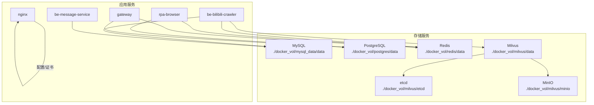
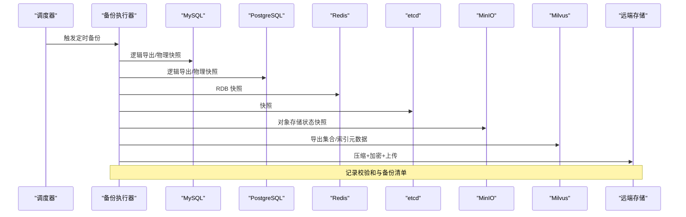
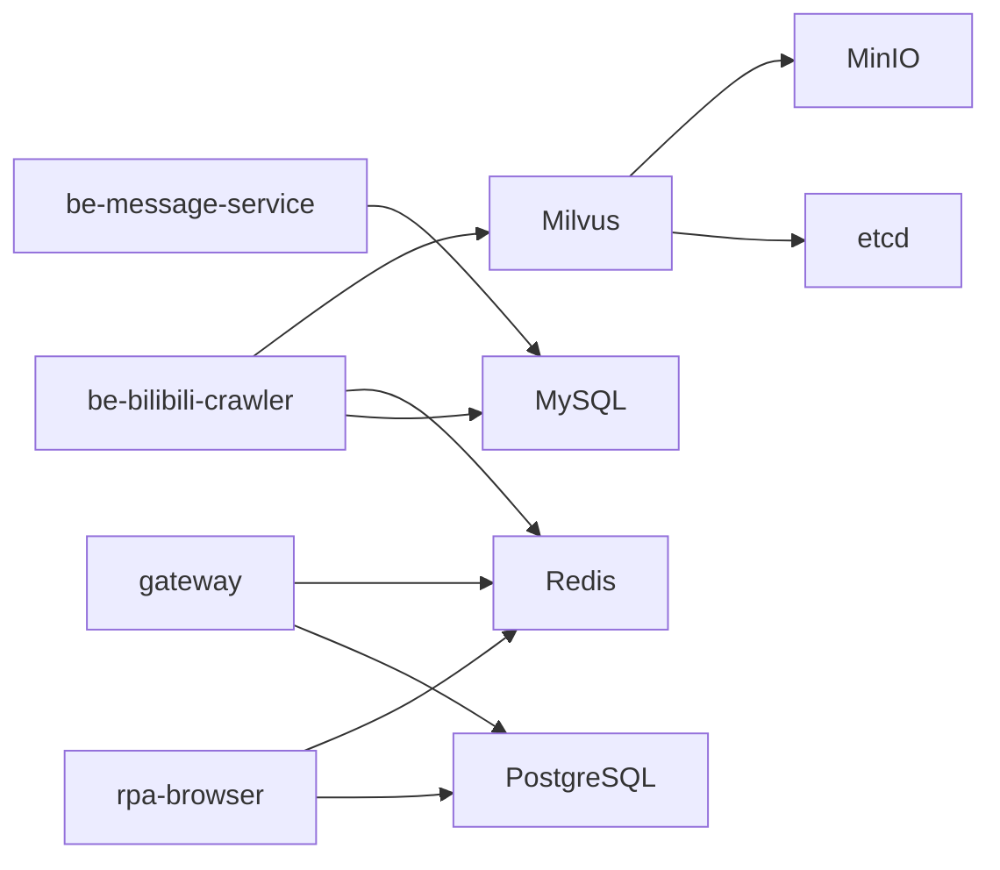

# 备份恢复策略

<cite>
**本文引用的文件**
- [docker-compose.yml](file://docker-compose.yml)
- [dc-dev.yml](file://dc-dev.yml)
- [custom_mysql.cnf](file://docker_vol/mysql_data/conf.d/custom_mysql.cnf)
- [CONFIG.py](file://be-bilibili-crawler/CONFIG.py)
- [config.py](file://RPA-Browser/app/config.py)
- [RedisManager.js](file://be-gateway/ExpressServerEnd/DAO/Redis/RedisManager.js)
</cite>

## 目录
1. [引言](#引言)
2. [项目结构](#项目结构)
3. [核心组件](#核心组件)
4. [架构总览](#架构总览)
5. [详细组件分析](#详细组件分析)
6. [依赖关系分析](#依赖关系分析)
7. [性能与容量规划](#性能与容量规划)
8. [故障排查指南](#故障排查指南)
9. [结论](#结论)
10. [附录：操作清单与脚本模板](#附录操作清单与脚本模板)

## 引言
本策略面向当前容器化部署的多存储系统，覆盖 MySQL、PostgreSQL、Redis、Milvus（含 etcd、MinIO）以及应用配置与持久化文件的备份与恢复。目标包括：
- 明确全量与增量备份策略及定时任务
- 提供灾难恢复预案、数据一致性保证与备份验证方法
- 解决备份空间管理、加密传输与跨机房同步问题
- 给出可落地的操作步骤与检查清单

## 项目结构
从部署编排可见，关键数据存储及其持久化卷如下：
- MySQL：数据目录挂载至 ./docker_vol/mysql_data/data
- PostgreSQL：数据目录挂载至 ./docker_vol/postgres/data
- Redis：数据目录挂载至 ./docker_vol/redis/data
- Milvus：数据目录挂载至 ./docker_vol/milvus/data；元数据由 etcd 与对象存储 MinIO 共同承载
- 应用配置与证书等：Nginx 配置与证书挂载于 ./docker_vol/nginx/*

**图表来源**
- [docker-compose.yml:1-380](file://docker-compose.yml#L1-L380)
- [dc-dev.yml:1-213](file://dc-dev.yml#L1-L213)

**章节来源**
- [docker-compose.yml:1-380](file://docker-compose.yml#L1-L380)
- [dc-dev.yml:1-213](file://dc-dev.yml#L1-L213)

## 核心组件
- 数据库层
  - MySQL：多业务库（如 bilidb、bili_reserve、dyndetail、samsclub 等），连接池与超时参数在应用侧配置，MySQL 实例通过自定义配置优化内存与日志开关
  - PostgreSQL：网关与部分服务使用，数据目录独立挂载
  - Redis：缓存与会话等临时数据，数据目录独立挂载
  - Milvus：向量检索，依赖 etcd（元数据）与 MinIO（对象存储）
- 配置与持久化
  - Nginx 配置与证书位于 docker_vol/nginx
  - 各服务的 Alembic 迁移脚本随源码挂载，便于版本控制与回滚

**章节来源**
- [custom_mysql.cnf:1-67](file://docker_vol/mysql_data/conf.d/custom_mysql.cnf#L1-L67)
- [CONFIG.py:330-419](file://be-bilibili-crawler/CONFIG.py#L330-L419)
- [config.py:140-215](file://RPA-Browser/app/config.py#L140-L215)
- [docker-compose.yml:68-178](file://docker-compose.yml#L68-L178)

## 架构总览
下图展示备份与恢复的端到端流程：调度器触发备份任务，分别对 MySQL、PostgreSQL、Redis、Milvus（含 etcd/MinIO）执行快照或逻辑导出，生成带时间戳的归档并上传到远端存储（建议对象存储或异地磁盘），同时记录校验和与元数据。恢复时按顺序先恢复基础存储（MySQL/PG），再恢复缓存（Redis），最后恢复向量索引（Milvus）。

**图表来源**
- [docker-compose.yml:1-178](file://docker-compose.yml#L1-L178)

## 详细组件分析

### MySQL 备份与恢复
- 备份策略
  - 全量：定期执行逻辑导出（mysqldump）或物理快照（Percona XtraBackup），建议每日一次
  - 增量：由于当前 MySQL 配置关闭了 binlog，无法基于事务日志做增量；如需增量需开启 binlog 并配置 GTID/位置点
  - 频率：生产环境建议每小时增量（若启用 binlog）、每日全量
- 一致性
  - 逻辑导出可使用 --single-transaction 保证一致性
  - 物理快照需配合 InnoDB 一致快照机制
- 恢复流程
  - 停止写入或进入只读模式
  - 恢复全量后按顺序回放增量
  - 校验表结构与数据行数
- 注意事项
  - 当前配置关闭了 binlog、慢查询与通用日志，减少开销但失去增量能力
  - 连接池与超时参数在应用侧配置，恢复期间注意避免长事务阻塞

**章节来源**
- [custom_mysql.cnf:1-67](file://docker_vol/mysql_data/conf.d/custom_mysql.cnf#L1-L67)
- [CONFIG.py:330-419](file://be-bilibili-crawler/CONFIG.py#L330-L419)

### PostgreSQL 备份与恢复
- 备份策略
  - 全量：pg_basebackup 物理快照 + WAL 归档
  - 增量：WAL 流式归档（archive_mode=on, archive_command）
- 一致性
  - 物理快照保证一致性；WAL 用于恢复到任意时间点
- 恢复流程
  - 恢复基础镜像与数据目录
  - 回放 WAL 至目标时间点
  - 校验主键与外键完整性
- 注意事项
  - 数据目录挂载于 ./docker_vol/postgres/data，确保备份该目录与 WAL 归档路径

**章节来源**
- [docker-compose.yml:165-178](file://docker-compose.yml#L165-L178)
- [dc-dev.yml:108-121](file://dc-dev.yml#L108-L121)

### Redis 备份与恢复
- 备份策略
  - AOF/RDB：建议开启 AOF（每秒同步）并定期 RDB 快照
  - 全量：RDB 文件拷贝
  - 增量：AOF 追加日志
- 一致性
  - 使用 redis-cli BGSAVE 触发快照，或使用 AOF 自动持久化
- 恢复流程
  - 停止 Redis
  - 替换 dump.rdb 或重写 AOF
  - 启动并校验 key 数量与热点 key 命中率
- 注意事项
  - 数据目录挂载于 ./docker_vol/redis/data，备份该目录下的 rdb/aof 文件

**章节来源**
- [docker-compose.yml:82-93](file://docker-compose.yml#L82-L93)
- [dc-dev.yml:80-91](file://dc-dev.yml#L80-L91)

### Milvus（含 etcd、MinIO）备份与恢复
- 备份策略
  - etcd：定期快照（etcdctl snapshot save），保留最近若干份
  - MinIO：对象存储桶级备份（mc mirror 或云厂商快照）
  - Milvus：导出集合元数据与索引信息；数据块由 MinIO 承载
- 一致性
  - 先冻结写入或创建只读视图（如支持），再对 etcd 与 MinIO 做快照
- 恢复流程
  - 恢复 etcd 快照
  - 恢复 MinIO 对象
  - 重建 Milvus 集合与索引（必要时重新导入向量数据）
- 注意事项
  - 依赖 etcd 与 MinIO 的版本兼容性；升级前务必备份

**章节来源**
- [docker-compose.yml:1-67](file://docker-compose.yml#L1-L67)
- [dc-dev.yml:1-65](file://dc-dev.yml#L1-L65)

### 应用配置与文件备份
- 备份范围
  - Nginx 配置与证书：./docker_vol/nginx
  - 各服务 Alembic 迁移脚本：随源码仓库管理，无需额外备份
  - 其他配置文件：根据环境变量与挂载点纳入备份
- 恢复流程
  - 停止相关服务
  - 替换配置文件与证书
  - 重启服务并验证路由与健康检查

**章节来源**
- [docker-compose.yml:357-371](file://docker-compose.yml#L357-L371)

### 定时备份任务与调度
- 调度方式
  - 可在宿主机 crontab 或容器内 APScheduler 中定义任务
  - 建议将备份任务封装为独立脚本，统一输出日志与告警
- 任务设计
  - 全量：每日低峰期执行
  - 增量：每小时执行（需启用 binlog/WAL）
  - 清理：保留策略（如保留 7 天增量、30 天全量）

**章节来源**
- [CONFIG.py:225-277](file://be-bilibili-crawler/CONFIG.py#L225-L277)
- [config.py:140-215](file://RPA-Browser/app/config.py#L140-L215)

## 依赖关系分析
- 服务间依赖
  - be-bilibili-crawler 依赖 MySQL、Redis、Milvus、RabbitMQ
  - be-message-service 依赖 MySQL、RabbitMQ
  - rpa-browser 依赖 PostgreSQL、Redis、RabbitMQ
  - gateway 依赖 PostgreSQL、Redis、Casdoor
- 备份依赖
  - 恢复顺序：MySQL/PostgreSQL → Redis → Milvus（etcd/MinIO）→ 应用配置
  - 网络与权限：备份脚本需具备读取各数据目录与调用客户端工具（mysqldump、pg_basebackup、redis-cli、etcdctl、mc）的权限

**图表来源**
- [docker-compose.yml:120-309](file://docker-compose.yml#L120-L309)

**章节来源**
- [docker-compose.yml:120-309](file://docker-compose.yml#L120-L309)

## 性能与容量规划
- 备份窗口
  - 全量备份建议在业务低峰期执行，避免影响在线读写
  - 增量备份频率根据 RPO（恢复点目标）设定
- 存储容量
  - 估算各存储增长速率，预留至少 2 倍冗余
  - 对象存储用于长期归档与跨机房同步
- I/O 影响
  - 物理快照对磁盘 I/O 影响较小；逻辑导出在高并发下可能增加负载
- 网络带宽
  - 跨机房同步建议使用增量传输与压缩加密

[本节为通用指导，不直接分析具体文件]

## 故障排查指南
- 常见问题
  - 备份失败：检查客户端工具版本、权限、网络连通性
  - 恢复不一致：核对校验和、版本号、迁移脚本一致性
  - 存储空间不足：实施保留策略与清理任务
- 诊断步骤
  - 查看备份日志与告警
  - 校验备份文件完整性（md5/sha256）
  - 在隔离环境进行恢复演练

[本节为通用指导，不直接分析具体文件]

## 结论
本策略基于当前容器化部署的数据存储与配置，提供了覆盖 MySQL、PostgreSQL、Redis、Milvus 的全量/增量备份方案与恢复流程。通过统一的调度、校验与归档机制，结合保留策略与跨机房同步，可实现高可用的数据保护。建议在生产环境落地前完成演练与监控接入。

[本节为总结，不直接分析具体文件]

## 附录：操作清单与脚本模板
- 全量备份清单
  - MySQL：mysqldump 或物理快照
  - PostgreSQL：pg_basebackup + WAL 归档
  - Redis：BGSAVE 或 AOF 文件
  - etcd：snapshot save
  - MinIO：bucket 镜像或快照
  - Milvus：集合与索引元数据导出
- 恢复清单
  - 按顺序恢复 MySQL/PostgreSQL → Redis → etcd/MinIO → Milvus
  - 校验数据一致性与应用健康检查
- 加密与传输
  - 使用 GPG 或 openssl 对备份文件加密
  - 通过 HTTPS/SFTP 上传至远端存储
- 跨机房同步
  - 使用 mc mirror 或云厂商复制规则
  - 设置生命周期策略自动清理过期副本

[本节为通用指导，不直接分析具体文件]