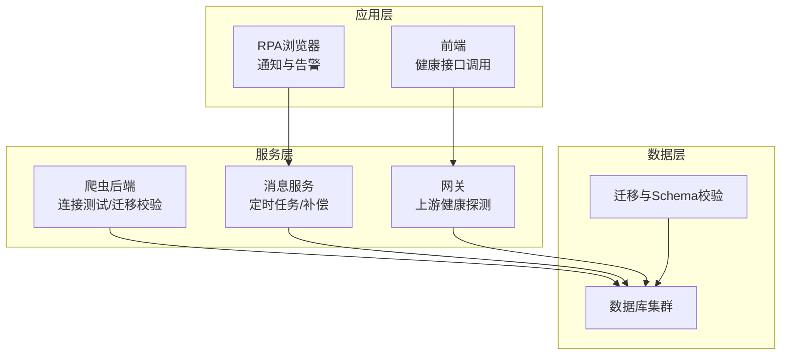
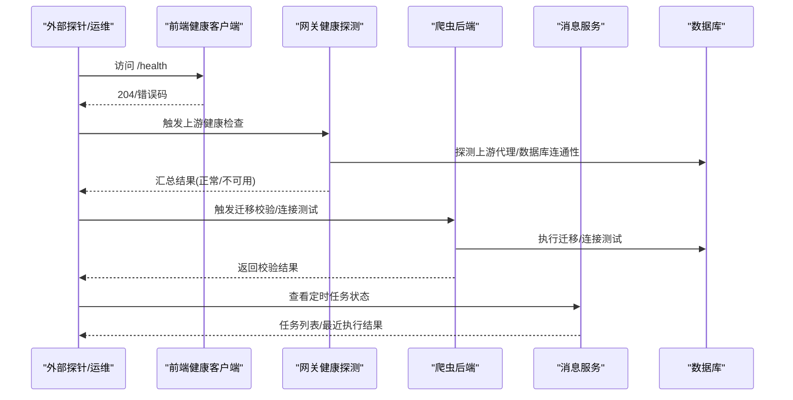
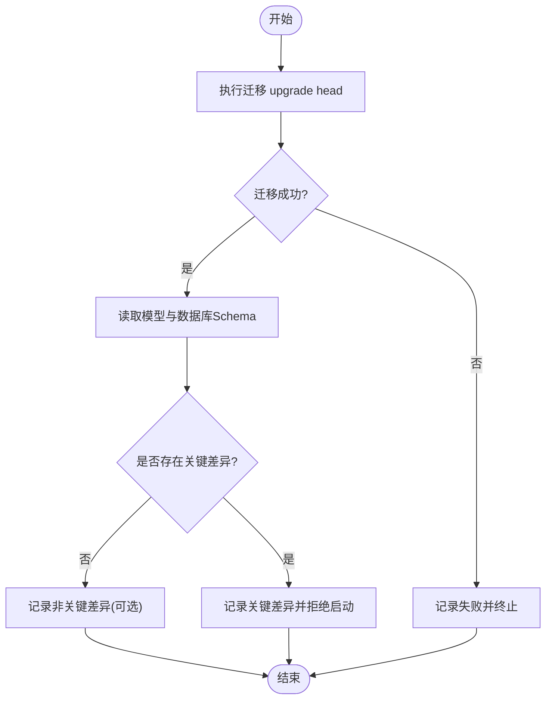
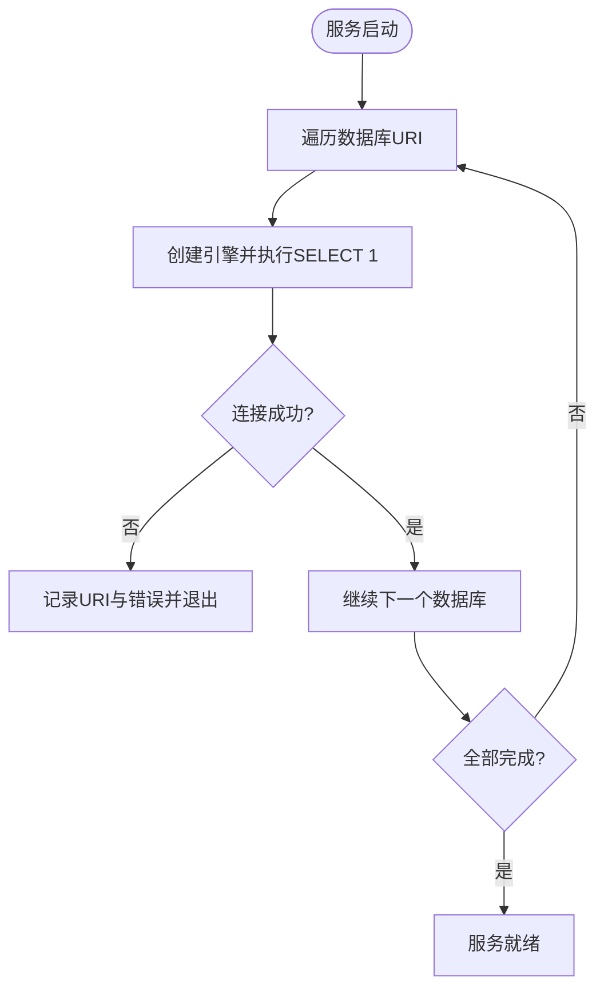
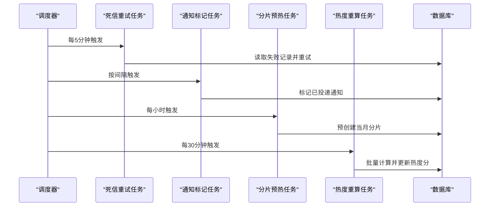
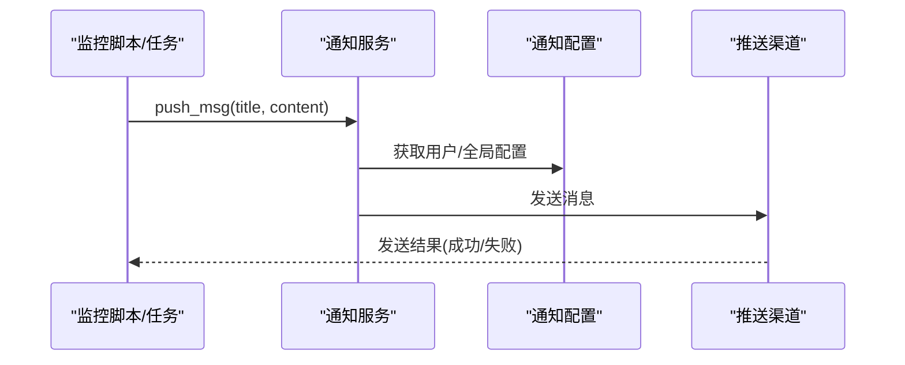
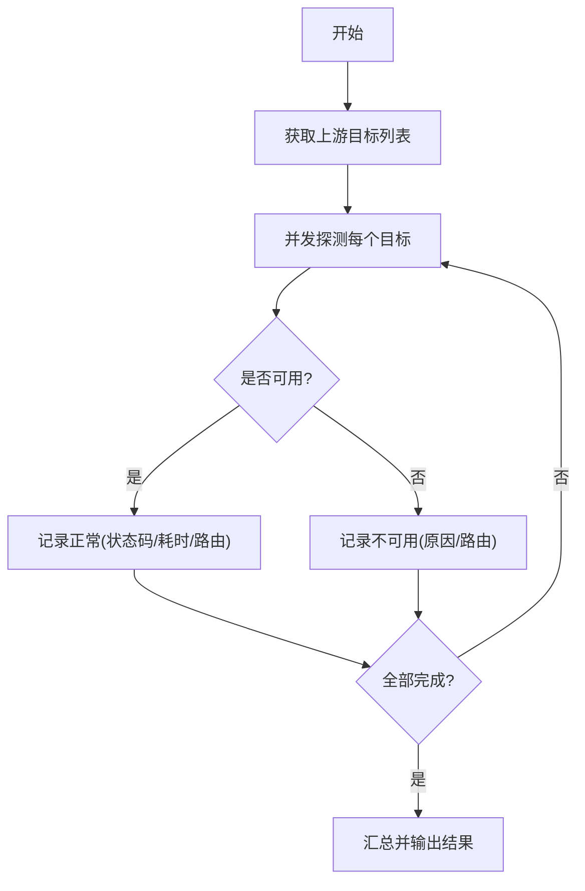
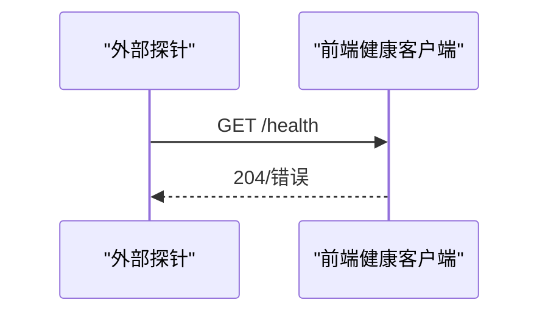
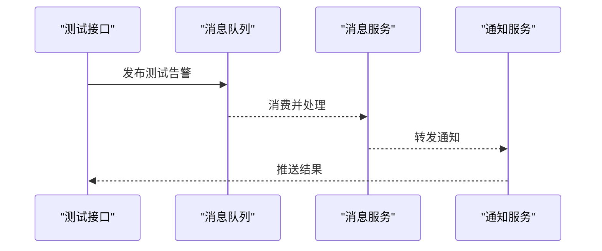
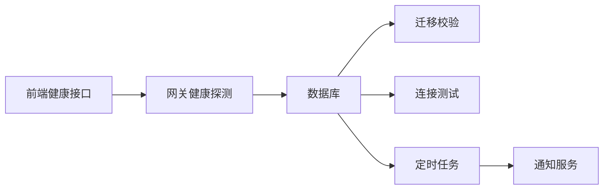

# 备份验证与监控

<cite>
**本文引用的文件**
- [alembic_manager.py](file://be-bilibili-crawler/Utils/FastAPI/alembic_manager.py)
- [FastapiLifespan.py](file://be-bilibili-crawler/Utils/FastAPI/FastapiLifespan.py)
- [scheduler.py](file://be-message-service/app/tasks/scheduler.py)
- [notification_service.py](file://RPA-Browser/app/services/RPA_browser/browser/notification_service.py)
- [models.py](file://RPA-Browser/app/models/notify/models.py)
- [upstream_health_service.js](file://be-gateway/ExpressServerEnd/Service/upstream_health_module/upstream_health_service.js)
- [DefaultService.gen.ts](file://Vue3FrontEndDemoExercise/src/api/community/hey-api/services/DefaultService.gen.ts)
- [CommonRouter.py](file://be-bilibili-crawler/controller/common/CommonRouter.py)
</cite>

## 目录
1. [简介](#简介)
2. [项目结构](#项目结构)
3. [核心组件](#核心组件)
4. [架构总览](#架构总览)
5. [详细组件分析](#详细组件分析)
6. [依赖关系分析](#依赖关系分析)
7. [性能考量](#性能考量)
8. [故障排查指南](#故障排查指南)
9. [结论](#结论)
10. [附录](#附录)

## 简介
本文件围绕“备份验证与监控”的质量保证目标，结合仓库中已有的数据库迁移校验、连接健康检查、定时任务调度、通知告警与上游服务健康探测等能力，给出可落地的方案：自动化备份完整性检查、恢复演练、成功率监控、存储空间管理、失败重试机制、指标收集与报告生成，以及系统健康检查与故障诊断。

## 项目结构
本项目为多语言微服务集合，包含爬虫后端、消息服务、网关、前端与通用库。与备份验证与监控相关的关键位置如下：
- 数据库迁移与一致性校验：be-bilibili-crawler 的 alembic 管理器
- 启动期数据库连通性测试：be-bilibili-crawler 的 FastAPI 生命周期
- 后台定时任务（补偿、预热、重算）：be-message-service 的任务调度器
- 通知与告警通道：RPA-Browser 的通知服务与配置模型
- 上游代理健康检查：be-gateway 的健康探测模块
- 前端健康接口调用：Vue3FrontEndDemoExercise 生成的健康查询客户端

图表来源
- [FastapiLifespan.py:64-90](file://be-bilibili-crawler/Utils/FastAPI/FastapiLifespan.py#L64-L90)
- [alembic_manager.py:29-53](file://be-bilibili-crawler/Utils/FastAPI/alembic_manager.py#L29-L53)
- [scheduler.py:251-302](file://be-message-service/app/tasks/scheduler.py#L251-L302)
- [upstream_health_service.js:93-124](file://be-gateway/ExpressServerEnd/Service/upstream_health_module/upstream_health_service.js#L93-L124)
- [DefaultService.gen.ts:8-21](file://Vue3FrontEndDemoExercise/src/api/community/hey-api/services/DefaultService.gen.ts#L8-L21)

章节来源
- [FastapiLifespan.py:64-90](file://be-bilibili-crawler/Utils/FastAPI/FastapiLifespan.py#L64-L90)
- [alembic_manager.py:29-53](file://be-bilibili-crawler/Utils/FastAPI/alembic_manager.py#L29-L53)
- [scheduler.py:251-302](file://be-message-service/app/tasks/scheduler.py#L251-L302)
- [upstream_health_service.js:93-124](file://be-gateway/ExpressServerEnd/Service/upstream_health_module/upstream_health_service.js#L93-L124)
- [DefaultService.gen.ts:8-21](file://Vue3FrontEndDemoExercise/src/api/community/hey-api/services/DefaultService.gen.ts#L8-L21)

## 核心组件
- 数据库迁移与一致性校验：在启动前执行迁移并比对模型与真实 Schema，发现关键差异时拒绝启动，保障数据结构的正确性与可恢复性。
- 启动期数据库连通性检测：对所有数据库进行连接测试，失败即中止启动，避免服务以不可用状态运行。
- 定时任务与补偿机制：通过调度器周期性执行通知投递标记、死信重试、分片预热、评论热度重算等维护任务，提升系统韧性与数据一致性。
- 通知与告警：支持多种推送渠道配置，可在异常或关键事件发生时及时告警。
- 上游健康探测：对代理服务进行并发健康检查，快速定位不可用节点。
- 前端健康接口：提供 /health 端点用于存活与依赖连通性探测。

章节来源
- [alembic_manager.py:29-53](file://be-bilibili-crawler/Utils/FastAPI/alembic_manager.py#L29-L53)
- [FastapiLifespan.py:64-90](file://be-bilibili-crawler/Utils/FastAPI/FastapiLifespan.py#L64-L90)
- [scheduler.py:57-134](file://be-message-service/app/tasks/scheduler.py#L57-L134)
- [notification_service.py:162-191](file://RPA-Browser/app/services/RPA_browser/browser/notification_service.py#L162-L191)
- [models.py:59-106](file://RPA-Browser/app/models/notify/models.py#L59-L106)
- [upstream_health_service.js:93-124](file://be-gateway/ExpressServerEnd/Service/upstream_health_module/upstream_health_service.js#L93-L124)
- [DefaultService.gen.ts:8-21](file://Vue3FrontEndDemoExercise/src/api/community/hey-api/services/DefaultService.gen.ts#L8-L21)

## 架构总览
下图展示备份验证与监控在系统中的职责划分与交互：迁移校验与连接测试确保数据层可用；定时任务负责补偿与预热；通知系统承载告警；网关健康探测保障上游可用性；前端健康接口便于外部探针接入。

图表来源
- [DefaultService.gen.ts:8-21](file://Vue3FrontEndDemoExercise/src/api/community/hey-api/services/DefaultService.gen.ts#L8-L21)
- [upstream_health_service.js:93-124](file://be-gateway/ExpressServerEnd/Service/upstream_health_module/upstream_health_service.js#L93-L124)
- [FastapiLifespan.py:64-90](file://be-bilibili-crawler/Utils/FastAPI/FastapiLifespan.py#L64-L90)
- [alembic_manager.py:29-53](file://be-bilibili-crawler/Utils/FastAPI/alembic_manager.py#L29-L53)
- [scheduler.py:251-302](file://be-message-service/app/tasks/scheduler.py#L251-L302)

## 详细组件分析

### 组件A：数据库迁移与一致性校验（备份完整性检查）
- 功能要点
  - 启动前执行增量迁移，确保数据库结构与代码模型一致。
  - 对比模型与真实 Schema，识别缺失表/列、类型不匹配等关键问题，阻止不一致的服务启动。
  - 将非关键差异记录为警告，便于后续治理。
- 适用场景
  - 作为备份恢复后的“完整性检查”步骤，确保恢复后的数据库可被服务正确使用。
  - 发布流水线中的门禁环节，防止回滚到不兼容版本。
- 流程示意

图表来源
- [alembic_manager.py:29-53](file://be-bilibili-crawler/Utils/FastAPI/alembic_manager.py#L29-L53)
- [alembic_manager.py:91-191](file://be-bilibili-crawler/Utils/FastAPI/alembic_manager.py#L91-L191)

章节来源
- [alembic_manager.py:29-53](file://be-bilibili-crawler/Utils/FastAPI/alembic_manager.py#L29-L53)
- [alembic_manager.py:91-191](file://be-bilibili-crawler/Utils/FastAPI/alembic_manager.py#L91-L191)

### 组件B：启动期数据库连通性检测（恢复后可用性验证）
- 功能要点
  - 启动阶段对所有数据库进行连接测试，任一失败则中止启动。
  - 输出详细的 URI 与错误信息，便于快速定位网络、权限、实例问题。
- 适用场景
  - 备份恢复完成后，立即验证各数据库是否可达且可执行基础查询。
  - 容器编排中的就绪探针，确保服务仅在数据库可用时对外提供服务。
- 流程示意

图表来源
- [FastapiLifespan.py:64-90](file://be-bilibili-crawler/Utils/FastAPI/FastapiLifespan.py#L64-L90)

章节来源
- [FastapiLifespan.py:64-90](file://be-bilibili-crawler/Utils/FastAPI/FastapiLifespan.py#L64-L90)

### 组件C：定时任务与补偿机制（失败重试与恢复保障）
- 功能要点
  - 系统通知投递标记：避免重复扫描与重复投递。
  - 死信重试：私信正文写入失败的补偿，保证最终一致。
  - 分片预热：跨月提前创建内容分片，降低冷启动延迟。
  - 评论热度重算：按时间衰减批量重算，保持排序稳定性。
- 适用场景
  - 作为“恢复测试”的一部分，验证补偿任务能自动修复部分失败路径。
  - 作为“备份成功率监控”的数据源之一，统计任务执行成功率与耗时。
- 时序示意

图表来源
- [scheduler.py:57-134](file://be-message-service/app/tasks/scheduler.py#L57-L134)
- [scheduler.py:251-302](file://be-message-service/app/tasks/scheduler.py#L251-L302)

章节来源
- [scheduler.py:57-134](file://be-message-service/app/tasks/scheduler.py#L57-L134)
- [scheduler.py:251-302](file://be-message-service/app/tasks/scheduler.py#L251-L302)

### 组件D：通知与告警（备份状态监控告警）
- 功能要点
  - 支持多种推送渠道配置（如 PushMe、Webhook、邮件等），可按用户或全局兜底发送。
  - 在异常或关键事件（如迁移失败、连接失败、任务失败）时触发告警。
- 适用场景
  - 备份失败、恢复失败、迁移校验失败、上游健康检查失败等事件的即时告警。
  - 定期生成备份报告并通过通知渠道分发。
- 调用流程示意

图表来源
- [notification_service.py:162-191](file://RPA-Browser/app/services/RPA_browser/browser/notification_service.py#L162-L191)
- [models.py:59-106](file://RPA-Browser/app/models/notify/models.py#L59-L106)

章节来源
- [notification_service.py:162-191](file://RPA-Browser/app/services/RPA_browser/browser/notification_service.py#L162-L191)
- [models.py:59-106](file://RPA-Browser/app/models/notify/models.py#L59-L106)

### 组件E：上游健康探测（备份链路可用性监控）
- 功能要点
  - 对多个上游代理服务进行并发健康检查，输出每个目标的可用性、耗时与路由信息。
  - 汇总不可用数量，便于快速定位故障面。
- 适用场景
  - 备份数据拉取/推送所依赖的上游代理服务可用性监控。
  - 作为“健康检查”的一部分，纳入整体备份链路质量评估。
- 流程示意

图表来源
- [upstream_health_service.js:93-124](file://be-gateway/ExpressServerEnd/Service/upstream_health_module/upstream_health_service.js#L93-L124)

章节来源
- [upstream_health_service.js:93-124](file://be-gateway/ExpressServerEnd/Service/upstream_health_module/upstream_health_service.js#L93-L124)

### 组件F：前端健康接口（外部探针接入）
- 功能要点
  - 提供 /health 端点，访问返回 204 表示服务存活且依赖（如消息队列）连接正常。
- 适用场景
  - 外部监控系统（如 Prometheus、K8s Liveness/Readiness）轮询服务健康。
  - 作为备份链路健康检查的前置条件。
- 调用示意

图表来源
- [DefaultService.gen.ts:8-21](file://Vue3FrontEndDemoExercise/src/api/community/hey-api/services/DefaultService.gen.ts#L8-L21)

章节来源
- [DefaultService.gen.ts:8-21](file://Vue3FrontEndDemoExercise/src/api/community/hey-api/services/DefaultService.gen.ts#L8-L21)

### 组件G：测试与告警联动（模拟异常触发告警）
- 功能要点
  - 通过故意抛错并直接发布消息到 message 队列，绕过限流，确保每次调用都能可靠触发消息服务，用于验证推送链路。
- 适用场景
  - 验证备份失败告警链路是否畅通。
  - 演练告警接收与处理流程。
- 调用示意

图表来源
- [CommonRouter.py:67-94](file://be-bilibili-crawler/controller/common/CommonRouter.py#L67-L94)

章节来源
- [CommonRouter.py:67-94](file://be-bilibili-crawler/controller/common/CommonRouter.py#L67-L94)

## 依赖关系分析
- 数据层依赖：所有组件均依赖数据库连通性与 Schema 一致性。
- 服务间依赖：通知服务依赖消息服务；网关健康探测依赖上游代理；前端健康接口依赖后端健康端点。
- 调度依赖：定时任务依赖数据库与业务模型，确保幂等与资源占用可控。

图表来源
- [alembic_manager.py:29-53](file://be-bilibili-crawler/Utils/FastAPI/alembic_manager.py#L29-L53)
- [FastapiLifespan.py:64-90](file://be-bilibili-crawler/Utils/FastAPI/FastapiLifespan.py#L64-L90)
- [scheduler.py:251-302](file://be-message-service/app/tasks/scheduler.py#L251-L302)
- [upstream_health_service.js:93-124](file://be-gateway/ExpressServerEnd/Service/upstream_health_module/upstream_health_service.js#L93-L124)
- [DefaultService.gen.ts:8-21](file://Vue3FrontEndDemoExercise/src/api/community/hey-api/services/DefaultService.gen.ts#L8-L21)

章节来源
- [alembic_manager.py:29-53](file://be-bilibili-crawler/Utils/FastAPI/alembic_manager.py#L29-L53)
- [FastapiLifespan.py:64-90](file://be-bilibili-crawler/Utils/FastAPI/FastapiLifespan.py#L64-L90)
- [scheduler.py:251-302](file://be-message-service/app/tasks/scheduler.py#L251-L302)
- [upstream_health_service.js:93-124](file://be-gateway/ExpressServerEnd/Service/upstream_health_module/upstream_health_service.js#L93-L124)
- [DefaultService.gen.ts:8-21](file://Vue3FrontEndDemoExercise/src/api/community/hey-api/services/DefaultService.gen.ts#L8-L21)

## 性能考量
- 迁移校验与连接测试应在启动阶段串行执行，避免并发导致资源争用。
- 定时任务采用 max_instances=1 与 coalesce=True，防止堆积与并发爆炸。
- 批量操作（如热度重算）采用分批提交，减少锁持有时间与连接占用。
- 健康探测使用并发方式提升效率，但需设置超时与熔断策略，避免雪崩。

[本节为通用指导，无需特定文件引用]

## 故障排查指南
- 迁移失败
  - 现象：启动时报 Schema 不一致，拒绝启动。
  - 处理：执行迁移升级，核对模型与数据库字段类型，必要时回滚或修正模型。
  - 参考实现：迁移执行与 Schema 比对逻辑。
- 数据库连接失败
  - 现象：启动阶段连接测试失败，服务无法就绪。
  - 处理：检查网络、账号权限、实例状态与防火墙策略。
  - 参考实现：启动期连接测试。
- 定时任务失败
  - 现象：补偿任务未执行或执行报错。
  - 处理：查看任务日志，确认调度器状态与数据库连接，调整间隔与批大小。
  - 参考实现：任务注册与执行逻辑。
- 告警未送达
  - 现象：通知未到达预期渠道。
  - 处理：检查通知配置、渠道密钥与网络连通性，使用测试接口验证链路。
  - 参考实现：通知服务与配置模型。
- 上游不可用
  - 现象：健康探测显示部分上游不可用。
  - 处理：检查代理配置、端口与路由，临时降级或切换备用上游。
  - 参考实现：上游健康探测模块。

章节来源
- [alembic_manager.py:29-53](file://be-bilibili-crawler/Utils/FastAPI/alembic_manager.py#L29-L53)
- [FastapiLifespan.py:64-90](file://be-bilibili-crawler/Utils/FastAPI/FastapiLifespan.py#L64-L90)
- [scheduler.py:251-302](file://be-message-service/app/tasks/scheduler.py#L251-L302)
- [notification_service.py:162-191](file://RPA-Browser/app/services/RPA_browser/browser/notification_service.py#L162-L191)
- [models.py:59-106](file://RPA-Browser/app/models/notify/models.py#L59-L106)
- [upstream_health_service.js:93-124](file://be-gateway/ExpressServerEnd/Service/upstream_health_module/upstream_health_service.js#L93-L124)

## 结论
通过迁移校验、连接测试、定时补偿、通知告警与上游健康探测的组合，可构建覆盖“备份完整性检查—恢复测试—成功率监控—存储空间管理—失败重试—指标收集—报告生成—健康检查—故障诊断”的全链路质量保证体系。建议将上述能力集成至 CI/CD 与运维平台，形成自动化闭环，持续保障备份系统的可靠性与可观测性。

[本节为总结性内容，无需特定文件引用]

## 附录
- 自动化备份验证脚本建议
  - 启动前：执行迁移校验与连接测试，失败即阻断部署。
  - 备份后：执行 Schema 比对与抽样数据校验，记录结果并告警。
  - 恢复演练：定期执行恢复流程，验证数据可恢复性与服务可用性。
- 备份成功率监控
  - 采集指标：备份时长、成功率、失败原因分类、存储使用率。
  - 告警阈值：连续失败、成功率低于阈值、存储使用率超过阈值。
- 存储空间管理
  - 清理策略：过期备份自动删除、冷热分层、压缩归档。
  - 容量预警：基于历史增长趋势预测，提前扩容或清理。
- 备份报告生成
  - 内容：周期内备份摘要、失败明细、恢复演练结果、存储用量趋势。
  - 分发：通过通知渠道定期推送，并归档至文档系统。

[本节为通用指导，无需特定文件引用]