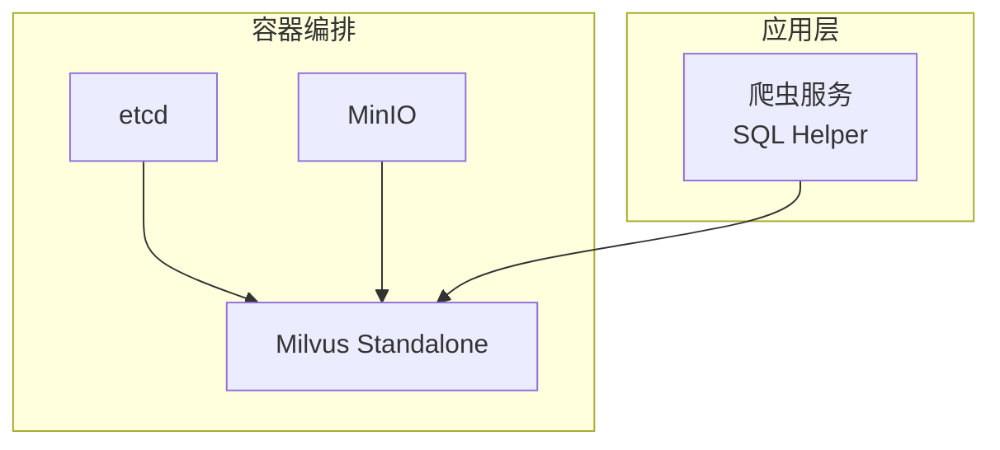
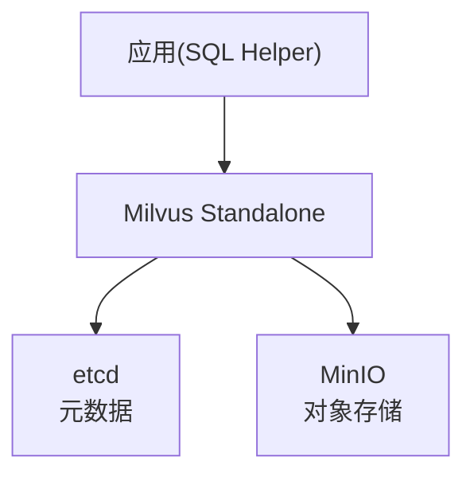
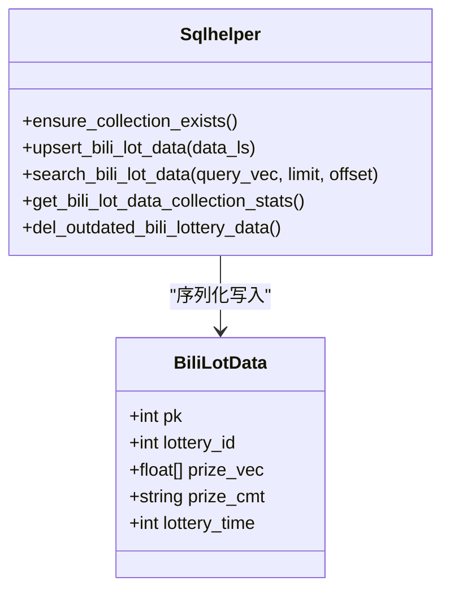
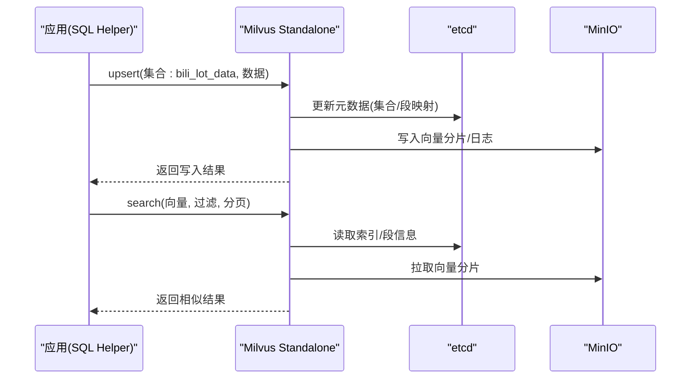
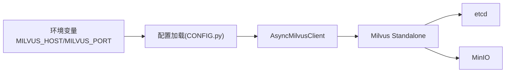

# Milvus 向量数据库备份

<cite>
**本文引用的文件**
- [docker-compose.yml](file://docker-compose.yml)
- [dc-dev.yml](file://dc-dev.yml)
- [CONFIG.py](file://be-bilibili-crawler/CONFIG.py)
- [sql_helper.py](file://be-bilibili-crawler/Service/LangChainCompo/lottery_data_vec_sql/sql_helper.py)
- [biliMilvusModel.py](file://be-bilibili-crawler/Models/lottery_database/milvusModel/biliMilvusModel.py)
</cite>

## 目录
1. [简介](#简介)
2. [项目结构](#项目结构)
3. [核心组件](#核心组件)
4. [架构总览](#架构总览)
5. [详细组件分析](#详细组件分析)
6. [依赖关系分析](#依赖关系分析)
7. [性能与容量规划](#性能与容量规划)
8. [故障排查指南](#故障排查指南)
9. [结论](#结论)
10. [附录：操作清单与命令参考](#附录操作清单与命令参考)

## 简介
本文件面向当前仓库中基于 Milvus（v3.0-beta）的向量数据服务，提供一套可落地的备份策略与恢复流程。内容覆盖：
- Milvus 架构组件（etcd、MinIO）与数据存储结构的说明
- 向量数据与元数据的分离备份策略
- 大规模向量数据的增量备份方案
- 基于 MinIO 的对象存储备份方案
- etcd 配置数据的备份与恢复流程
- 向量索引重建与数据一致性验证方法

## 项目结构
本项目通过 docker-compose 编排了 Milvus 运行所需的 etcd、MinIO 与 Milvus Standalone 三个核心服务；应用侧通过 Python SDK（pymilvus）访问 Milvus，定义集合 schema、创建索引并执行 upsert/search/delete 等操作。

**图表来源**
- [docker-compose.yml:1-67](file://docker-compose.yml#L1-L67)
- [dc-dev.yml:1-65](file://dc-dev.yml#L1-L65)

**章节来源**
- [docker-compose.yml:1-67](file://docker-compose.yml#L1-L67)
- [dc-dev.yml:1-65](file://dc-dev.yml#L1-L65)

## 核心组件
- etcd：存储 Milvus 的元数据（集合、分区、索引、对象映射等），数据目录挂载至宿主机路径，便于快照备份。
- MinIO：作为对象存储后端，持久化 Milvus 的向量数据分片与日志，数据目录挂载至宿主机路径，便于整体复制备份。
- Milvus Standalone：向量检索服务，连接 etcd 与 MinIO，对外暴露 gRPC/HTTP 接口。
- 应用侧 SQL Helper：封装集合生命周期管理、upsert、search、delete、统计查询等能力。

**章节来源**
- [docker-compose.yml:1-67](file://docker-compose.yml#L1-L67)
- [dc-dev.yml:1-65](file://dc-dev.yml#L1-L65)
- [sql_helper.py:23-173](file://be-bilibili-crawler/Service/LangChainCompo/lottery_data_vec_sql/sql_helper.py#L23-L173)

## 架构总览
Milvus 采用“元数据与向量数据分离”的架构：
- 元数据（集合、字段、索引、segment 映射等）保存在 etcd
- 向量数据与日志保存在 MinIO
- Milvus 进程负责读写协调、索引构建与检索

**图表来源**
- [docker-compose.yml:1-67](file://docker-compose.yml#L1-L67)
- [dc-dev.yml:1-65](file://dc-dev.yml#L1-L65)

## 详细组件分析

### 集合与模型
- 集合名：bili_lot_data
- 字段：pk（主键）、lottery_id、prize_vec（768维浮点向量）、prize_cmt（文本）、lottery_time（时间戳）
- 索引：对 prize_vec 建立 FLAT + COSINE 相似度索引
- 写入：批量 upsert
- 查询：按向量相似度搜索，支持过滤与分页
- 清理：删除过期数据（依据 lottery_time）

**图表来源**
- [biliMilvusModel.py:1-10](file://be-bilibili-crawler/Models/lottery_database/milvusModel/biliMilvusModel.py#L1-L10)
- [sql_helper.py:23-173](file://be-bilibili-crawler/Service/LangChainCompo/lottery_data_vec_sql/sql_helper.py#L23-L173)

**章节来源**
- [biliMilvusModel.py:1-10](file://be-bilibili-crawler/Models/lottery_database/milvusModel/biliMilvusModel.py#L1-L10)
- [sql_helper.py:23-173](file://be-bilibili-crawler/Service/LangChainCompo/lottery_data_vec_sql/sql_helper.py#L23-L173)

### 写入与检索流程（序列图）

**图表来源**
- [sql_helper.py:92-173](file://be-bilibili-crawler/Service/LangChainCompo/lottery_data_vec_sql/sql_helper.py#L92-L173)
- [docker-compose.yml:1-67](file://docker-compose.yml#L1-L67)

### 备份策略设计

#### 1) 全量备份（推荐定期执行）
- 目标：保证在极端情况下可完整恢复
- 步骤：
  - 停止 Milvus 服务（可选但更稳妥），或确保无写入窗口
  - 备份 etcd 数据目录（容器卷映射到宿主机）
  - 备份 MinIO 数据目录（容器卷映射到宿主机）
  - 记录备份时间点与版本信息（Milvus、etcd、MinIO 镜像版本）
- 注意：
  - 若不停止服务，需确保 etcd 快照一致性与 MinIO 对象一致性（建议停机窗口或使用支持快照的工具）

#### 2) 增量备份（适合大规模向量数据）
- 思路：以时间为粒度，仅备份新增/变更的数据
- 实现要点：
  - 利用集合中的 lottery_time 字段进行范围筛选
  - 定时任务扫描新增时间段内的数据，导出为离线文件（如 JSON/Parquet）
  - 将增量文件上传至对象存储（MinIO 或其他兼容 S3 的存储）
  - 保留增量文件的元数据（时间区间、条数、校验和）
- 恢复时：先恢复基线全量，再按时间顺序合并增量

#### 3) 元数据与向量数据分离备份
- 元数据（etcd）：存放集合、字段、索引、segment 映射等，体积小但关键
- 向量数据（MinIO）：存放实际向量分片与日志，体量大
- 备份策略：
  - etcd 每日快照 + 变更日志归档
  - MinIO 定期全量 + 增量（基于对象修改时间或版本）

#### 4) 基于 MinIO 的对象存储备份
- 使用 MinIO 客户端或兼容工具（如 mc）对桶内对象进行复制/同步
- 结合生命周期策略与版本控制，保留多版本副本
- 跨地域/跨账号复制用于异地容灾

#### 5) etcd 配置数据备份与恢复
- 备份：使用 etcdctl snapshot save 保存快照
- 恢复：使用 etcdctl snapshot restore 恢复数据目录后重启 etcd
- 注意事项：
  - 恢复前确保 etcd 版本一致
  - 恢复后检查集群健康状态

#### 6) 向量索引重建与数据一致性验证
- 索引重建：
  - 当索引损坏或需要升级算法时，重建集合索引
  - 重建期间建议限制写入或走只读模式
- 一致性验证：
  - 对比源库与目标库的集合统计信息（行数、维度、索引类型）
  - 抽样检索比对结果相似度与命中条目
  - 校验对象存储中 segment 文件数量与大小是否匹配

**章节来源**
- [sql_helper.py:40-173](file://be-bilibili-crawler/Service/LangChainCompo/lottery_data_vec_sql/sql_helper.py#L40-L173)
- [docker-compose.yml:1-67](file://docker-compose.yml#L1-L67)
- [dc-dev.yml:1-65](file://dc-dev.yml#L1-L65)

## 依赖关系分析
- 应用通过环境变量配置 Milvus 地址（MILVUS_HOST、MILVUS_PORT）
- SQL Helper 使用 AsyncMilvusClient 连接 Milvus，执行集合管理与数据操作
- docker-compose 编排 etcd、MinIO、Milvus，并通过卷挂载持久化数据

**图表来源**
- [CONFIG.py:249-250](file://be-bilibili-crawler/CONFIG.py#L249-L250)
- [sql_helper.py:32-38](file://be-bilibili-crawler/Service/LangChainCompo/lottery_data_vec_sql/sql_helper.py#L32-L38)
- [docker-compose.yml:1-67](file://docker-compose.yml#L1-L67)

**章节来源**
- [CONFIG.py:249-250](file://be-bilibili-crawler/CONFIG.py#L249-L250)
- [sql_helper.py:32-38](file://be-bilibili-crawler/Service/LangChainCompo/lottery_data_vec_sql/sql_helper.py#L32-L38)
- [docker-compose.yml:1-67](file://docker-compose.yml#L1-L67)

## 性能与容量规划
- 向量维度：768 维（prize_vec），影响内存占用与检索延迟
- 索引类型：FLAT + COSINE，适用于小规模或精确检索场景；大规模可考虑 HNSW/IVF 等
- 写入吞吐：批量 upsert 提升效率，注意并发与锁（代码中使用异步锁保护）
- 存储增长：MinIO 对象随向量数据线性增长，需规划磁盘与生命周期策略
- 备份窗口：全量备份建议在低峰期执行；增量备份可按小时/天频率

[本节为通用指导，不直接分析具体文件]

## 故障排查指南
- 权限问题：Milvus 数据目录权限需正确（常见错误码提示）
- 健康检查：etcd、MinIO、Milvus 均提供健康检查端点，可通过 curl 或 etcdctl 检测
- 连接失败：检查 MILVUS_HOST/MILVUS_PORT 环境变量与服务端口映射
- 索引异常：重建索引并验证集合统计信息
- 对象存储不可用：检查 MinIO 服务状态与网络连通性

**章节来源**
- [docker-compose.yml:14-18](file://docker-compose.yml#L14-L18)
- [docker-compose.yml:34-38](file://docker-compose.yml#L34-L38)
- [docker-compose.yml:54-59](file://docker-compose.yml#L54-L59)

## 结论
本策略围绕“元数据与向量数据分离”的核心思想，结合 etcd 快照与 MinIO 对象备份，形成可落地的全量与增量备份体系。配合索引重建与一致性校验，可在保障可用性的同时降低恢复复杂度与风险。建议在生产环境固化备份任务、完善监控告警与演练恢复流程。

[本节为总结性内容，不直接分析具体文件]

## 附录：操作清单与命令参考
- 全量备份
  - 备份 etcd 快照：etcdctl snapshot save <snapshot-file>
  - 备份 MinIO 数据：复制 ./docker_vol/milvus/minio 目录
  - 记录版本与时间戳
- 增量备份
  - 基于 lottery_time 范围导出新增数据
  - 上传至对象存储并记录元数据
- 恢复流程
  - 恢复 etcd 快照并启动
  - 恢复 MinIO 数据并启动
  - 启动 Milvus 并验证集合与索引
  - 执行一致性校验（统计信息与抽样检索）

[本节为操作指引，不直接分析具体文件]