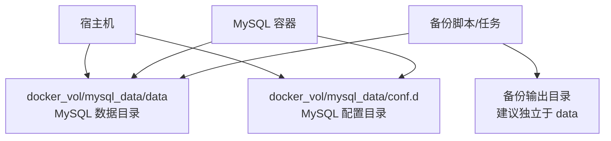
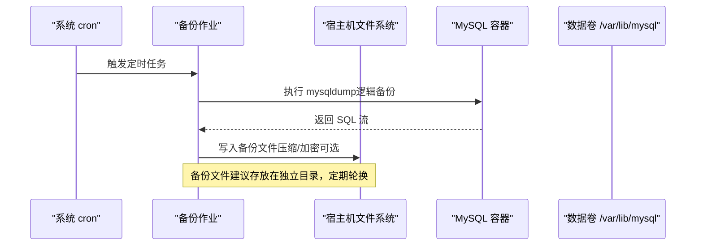
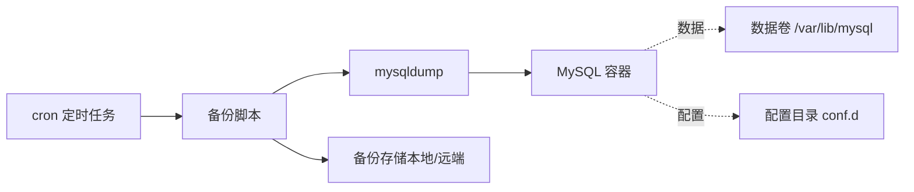

# MySQL 数据库备份

<cite>
**本文引用的文件**
- [docker-compose.yml](file://docker-compose.yml)
- [custom_mysql.cnf](file://docker_vol/mysql_data/conf.d/custom_mysql.cnf)
- [dev_init_chmod.bash](file://dev_init_chmod.bash)
- [.gitignore](file://.gitignore)
</cite>

## 目录
1. [简介](#简介)
2. [项目结构](#项目结构)
3. [核心组件](#核心组件)
4. [架构总览](#架构总览)
5. [详细组件分析](#详细组件分析)
6. [依赖关系分析](#依赖关系分析)
7. [性能考虑](#性能考虑)
8. [故障排查指南](#故障排查指南)
9. [结论](#结论)
10. [附录](#附录)

## 简介
本文件面向当前仓库中的 MySQL 服务，提供一套可落地的备份策略与操作指南。内容涵盖：MySQL 容器配置与数据卷挂载、mysqldump 工具使用要点（全量/单库/多库/指定表）、定时备份任务（cron）编排、备份文件的存储与生命周期管理、数据恢复流程（单表/多库/跨版本）、以及压缩、加密与传输安全建议。由于本项目未内置自动备份脚本，本文给出可直接在宿主机或独立备份容器中执行的方案，并与现有 docker-compose 环境无缝集成。

## 项目结构
- MySQL 服务通过 docker-compose 启动，数据持久化到宿主机的 docker_vol/mysql_data/data，配置文件挂载到 docker_vol/mysql_data/conf.d。
- 当前 MySQL 配置关闭了 binlog 与通用日志，因此增量备份需基于业务侧的增量导出或外部增量采集方案；全量备份可通过 mysqldump 实现。
- 开发环境存在权限初始化脚本，用于避免 WSL 下数据目录权限问题。

图表来源
- [docker-compose.yml:68-81](file://docker-compose.yml#L68-L81)
- [custom_mysql.cnf:1-67](file://docker_vol/mysql_data/conf.d/custom_mysql.cnf#L1-L67)

章节来源
- [docker-compose.yml:68-81](file://docker-compose.yml#L68-L81)
- [custom_mysql.cnf:1-67](file://docker_vol/mysql_data/conf.d/custom_mysql.cnf#L1-L67)
- [dev_init_chmod.bash:1-4](file://dev_init_chmod.bash#L1-L4)

## 核心组件
- MySQL 容器与服务暴露端口由环境变量映射，数据与配置通过 volumes 挂载至宿主机目录。
- 当前 MySQL 配置中关闭了二进制日志，这意味着无法直接使用基于 binlog 的增量恢复；如需增量能力，建议结合业务侧增量导出或引入外部增量采集。
- 备份产物应存放于独立目录，避免与 MySQL 数据目录混放，便于归档与清理。

章节来源
- [docker-compose.yml:68-81](file://docker-compose.yml#L68-L81)
- [custom_mysql.cnf:1-67](file://docker_vol/mysql_data/conf.d/custom_mysql.cnf#L1-L67)

## 架构总览
下图展示了“备份任务”与“MySQL 容器/数据卷”的关系，以及备份产物落盘路径。

图表来源
- [docker-compose.yml:68-81](file://docker-compose.yml#L68-L81)

## 详细组件分析

### MySQL 容器配置与数据卷挂载
- 容器镜像为 mysql:lts，通过环境变量注入密码与时区。
- 数据目录 /var/lib/mysql 映射到 ./docker_vol/mysql_data/data。
- 配置目录 /etc/mysql/conf.d 映射到 ./docker_vol/mysql_data/conf.d，当前包含 custom_mysql.cnf。
- 端口映射由 MYSQL_PORT 控制，默认 3306。

章节来源
- [docker-compose.yml:68-81](file://docker-compose.yml#L68-L81)
- [custom_mysql.cnf:1-67](file://docker_vol/mysql_data/conf.d/custom_mysql.cnf#L1-L67)

### 备份策略总览
- 全量备份：使用 mysqldump 对全部库或指定库进行逻辑备份，适合定期冷备与灾难恢复基线。
- 增量备份：当前 MySQL 关闭了 binlog，无法直接基于 binlog 增量恢复。推荐方案：
  - 业务侧增量导出：按时间窗口导出变更数据（如动态、事件等），并归档到对象存储或本地磁盘。
  - 外部增量采集：通过 CDC/消息队列将变更同步到备份目标。
- 备份频率建议：
  - 全量：每日一次（低峰期）。
  - 增量：每小时或更短周期（依据业务变更频率）。

章节来源
- [custom_mysql.cnf:1-67](file://docker_vol/mysql_data/conf.d/custom_mysql.cnf#L1-L67)

### mysqldump 使用要点（全量）
- 全库备份：适用于整体迁移或灾难恢复基线。
- 单库备份：适用于按业务域隔离的备份与恢复。
- 指定表备份：适用于局部修复或数据回滚。
- 常用参数说明（概念性）：
  - 一致性快照：在事务型引擎上保证备份期间数据一致。
  - 锁策略：根据负载选择是否加锁或采用热备模式。
  - 字符集与注释：确保导入时字符集一致，保留必要注释以便审计。
  - 并发导出：合理设置并行度以缩短备份窗口。
- 注意：若需要在线热备且最小化锁表，请评估 InnoDB 选项与业务影响。

章节来源
- [docker-compose.yml:68-81](file://docker-compose.yml#L68-L81)

### 增量备份方案（无 binlog）
- 现状：当前 MySQL 配置关闭了二进制日志，无法直接使用 binlog 增量恢复。
- 可行方案：
  - 业务侧增量导出：按时间范围导出新增/变更数据，生成结构化文件（SQL/CSV/JSON），并纳入统一备份体系。
  - 外部增量采集：通过消息队列或 CDC 将变更实时/近实时同步到备份存储。
- 恢复策略：先恢复到最近一次全量基线，再顺序回放增量数据。

章节来源
- [custom_mysql.cnf:1-67](file://docker_vol/mysql_data/conf.d/custom_mysql.cnf#L1-L67)

### 定时备份任务（cron）
- 建议在宿主机或独立备份容器中配置 cron，周期性执行备份脚本。
- 调度建议：
  - 全量：每日凌晨低峰期执行。
  - 增量：每 1~6 小时执行一次，视业务变更频率而定。
- 任务要素：
  - 记录开始/结束时间与耗时。
  - 失败重试与告警通知。
  - 备份文件命名包含时间戳与类型标识。
  - 校验备份完整性（如 md5sum/sha256sum）。

章节来源
- [docker-compose.yml:68-81](file://docker-compose.yml#L68-L81)

### 备份文件存储与管理
- 存储位置：建议独立于 MySQL 数据目录，例如 ./docker_vol/backups/mysql。
- 保留策略：
  - 全量：保留最近 N 天（如 7~30 天）。
  - 增量：保留最近 M 个周期（如 7~14 天）。
- 归档与异地容灾：将关键备份复制到对象存储或异地磁盘，降低单点风险。
- 访问控制：限制备份目录读写权限，仅允许备份进程与管理员访问。

章节来源
- [docker-compose.yml:68-81](file://docker-compose.yml#L68-L81)

### 数据恢复流程与验证
- 单表恢复：
  - 从全量或增量包中提取对应表的 SQL，导入到目标库。
  - 恢复后核对行数、主键唯一性与关键指标。
- 多库恢复：
  - 按依赖顺序恢复元数据与业务库。
  - 恢复后检查连接、视图、存储过程与索引状态。
- 跨版本恢复：
  - 优先恢复到相近版本，必要时按官方升级路径逐步升级。
  - 升级前后分别做一致性校验与功能回归测试。
- 验证方法：
  - 抽样比对：随机抽取若干记录对比源与目标。
  - 统计校验：汇总计数、金额、时间范围等关键指标。
  - 应用连通性：用只读账号连接目标库执行查询验证。

章节来源
- [docker-compose.yml:68-81](file://docker-compose.yml#L68-L81)

### 压缩、加密与传输安全
- 压缩：
  - 使用 gzip/zstd 压缩备份文件，减少存储空间与传输带宽。
  - 大库建议分片压缩，便于并行处理与断点续传。
- 加密：
  - 静态加密：对备份文件进行对称加密（如 AES），密钥集中管理。
  - 传输加密：通过 SFTP/HTTPS/S3 TLS 通道上传备份，避免明文传输。
- 访问与审计：
  - 严格限制备份目录与对象的访问权限。
  - 记录备份与恢复操作的审计日志。

章节来源
- [docker-compose.yml:68-81](file://docker-compose.yml#L68-L81)

## 依赖关系分析
- MySQL 容器依赖宿主机的数据卷与配置目录。
- 备份任务依赖网络连通性（如需远程存储）与外部工具（mysqldump、压缩/加密工具）。
- 当前配置关闭了 binlog，限制了基于日志的增量恢复能力。

图表来源
- [docker-compose.yml:68-81](file://docker-compose.yml#L68-L81)
- [custom_mysql.cnf:1-67](file://docker_vol/mysql_data/conf.d/custom_mysql.cnf#L1-L67)

章节来源
- [docker-compose.yml:68-81](file://docker-compose.yml#L68-L81)
- [custom_mysql.cnf:1-67](file://docker_vol/mysql_data/conf.d/custom_mysql.cnf#L1-L67)

## 性能考虑
- 备份窗口：选择低峰期执行全量备份，避免影响线上查询。
- 并发与锁：根据负载调整 mysqldump 的并发与锁策略，必要时采用只读副本备份。
- I/O 优化：将备份输出写到独立磁盘或 SSD，避免与数据目录争抢 I/O。
- 资源限制：为备份进程设置 CPU/内存上限，防止挤占生产资源。
- 监控与告警：记录备份时长、大小、错误率，异常及时告警。

[本节为通用指导，不直接分析具体文件]

## 故障排查指南
- 权限问题：WSL 环境下可能出现数据目录权限异常，可在启动前执行权限初始化脚本。
- 备份失败：检查 mysqldump 命令参数、网络连通性、磁盘空间与权限。
- 恢复失败：确认字符集、版本兼容性与依赖对象（视图、函数、存储过程）是否存在。
- 日志定位：查看 MySQL 错误日志与备份脚本日志，定位具体错误阶段。

章节来源
- [dev_init_chmod.bash:1-4](file://dev_init_chmod.bash#L1-L4)

## 结论
本项目已具备稳定的 MySQL 容器与数据卷挂载基础。由于当前关闭了 binlog，增量恢复需依赖业务侧增量导出或外部增量采集。建议尽快落地定时全量备份与增量导出机制，完善压缩、加密与异地容灾，建立完善的恢复演练与验证流程，确保数据安全与可恢复性。

[本节为总结性内容，不直接分析具体文件]

## 附录
- 环境变量参考：MYSQL_PASSWORD、MYSQL_PORT、ENV_TZ 等由 docker-compose 注入。
- 忽略规则：.gitignore 排除了大部分 docker_vol 内容，但保留了 mysql_data 相关目录，便于开发与调试。

章节来源
- [docker-compose.yml:68-81](file://docker-compose.yml#L68-L81)
- [.gitignore:25-35](file://.gitignore#L25-L35)