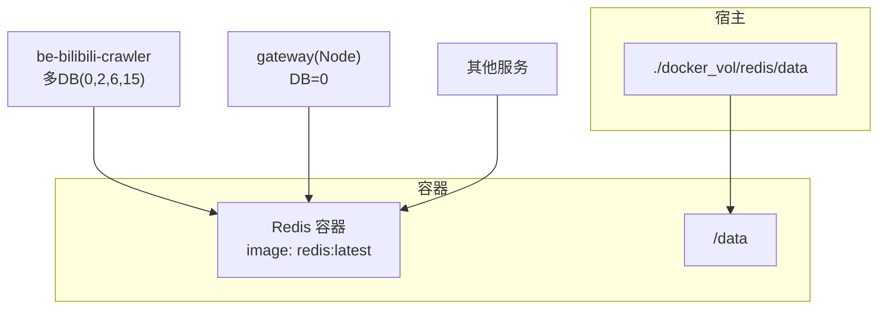
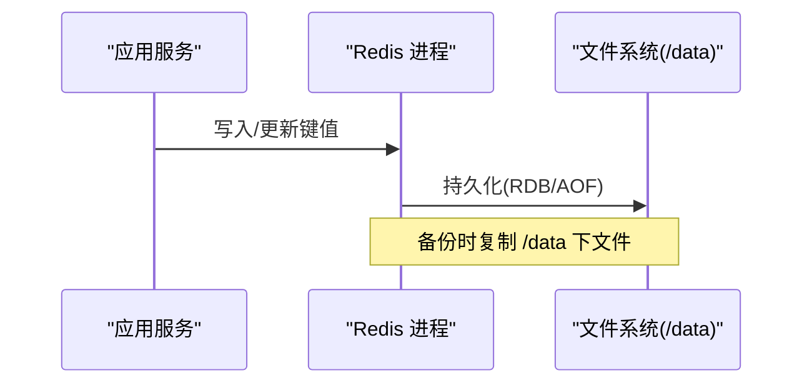
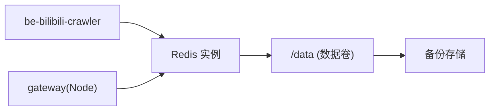

# Redis 缓存备份

<cite>
**本文引用的文件**
- [docker-compose.yml](file://docker-compose.yml)
- [dc-dev.yml](file://dc-dev.yml)
- [RedisManager.py](file://be-bilibili-crawler/Utils/redisTool/RedisManager.py)
- [CONFIG.py](file://be-bilibili-crawler/CONFIG.py)
- [RedisManager.js](file://be-gateway/ExpressServerEnd/DAO/Redis/RedisManager.js)
</cite>

## 目录
1. [简介](#简介)
2. [项目结构](#项目结构)
3. [核心组件](#核心组件)
4. [架构总览](#架构总览)
5. [详细组件分析](#详细组件分析)
6. [依赖关系分析](#依赖关系分析)
7. [性能考虑](#性能考虑)
8. [故障排查指南](#故障排查指南)
9. [结论](#结论)
10. [附录](#附录)

## 简介
本文件面向当前仓库中的 Redis 使用现状，给出“可落地的缓存数据备份策略”。内容覆盖：
- Redis 持久化机制（RDB、AOF）在本项目的容器化部署中如何启用与配置
- 数据卷挂载位置与备份目标路径
- RDB 快照备份的配置方法与触发时机
- AOF 日志备份策略与恢复流程
- 单实例与集群模式的备份差异与方案
- 缓存数据恢复的最佳实践：一致性检查与性能优化建议

## 项目结构
当前仓库通过 docker-compose 启动 Redis 服务，并将数据目录挂载到宿主机目录，便于备份。关键要点：
- Redis 容器镜像为 redis:latest，默认数据目录 /data
- 数据卷映射至 ./docker_vol/redis/data:/data
- 应用侧通过环境变量连接 Redis（host/port/pwd/db），不同服务使用不同 DB 编号进行逻辑隔离

图表来源
- [docker-compose.yml:82-93](file://docker-compose.yml#L82-L93)
- [dc-dev.yml:80-91](file://dc-dev.yml#L80-L91)
- [CONFIG.py:360-378](file://be-bilibili-crawler/CONFIG.py#L360-L378)
- [RedisManager.js:5-12](file://be-gateway/ExpressServerEnd/DAO/Redis/RedisManager.js#L5-L12)

章节来源
- [docker-compose.yml:82-93](file://docker-compose.yml#L82-L93)
- [dc-dev.yml:80-91](file://dc-dev.yml#L80-L91)
- [CONFIG.py:360-378](file://be-bilibili-crawler/CONFIG.py#L360-L378)
- [RedisManager.js:5-12](file://be-gateway/ExpressServerEnd/DAO/Redis/RedisManager.js#L5-L12)

## 核心组件
- Redis 容器与数据卷：通过 compose 定义，数据持久化在宿主机目录，便于统一备份
- 应用连接层：Python 端使用连接池与重试封装；Node 端通过 ioredis 直连
- 配置管理：Python 端集中声明多个 DB 编号用于业务隔离；Node 端从环境变量读取 host/port/pwd/db

章节来源
- [docker-compose.yml:82-93](file://docker-compose.yml#L82-L93)
- [RedisManager.py:195-209](file://be-bilibili-crawler/Utils/redisTool/RedisManager.py#L195-L209)
- [CONFIG.py:360-378](file://be-bilibili-crawler/CONFIG.py#L360-L378)
- [RedisManager.js:5-12](file://be-gateway/ExpressServerEnd/DAO/Redis/RedisManager.js#L5-L12)

## 架构总览
下图展示应用与 Redis 的连接方式及数据落盘路径，突出备份关注点：
- 所有写操作最终写入 /data（RDB/AOF）
- 备份对象为 /data 下的 dump.rdb 与 appendonly.aof（若启用）

图表来源
- [docker-compose.yml:82-93](file://docker-compose.yml#L82-L93)

## 详细组件分析

### 容器化部署与数据卷
- 数据目录：容器内 /data 映射到宿主机 ./docker_vol/redis/data
- 端口：6379（可通过变量映射）
- 重启策略：unless-stopped
- 环境变量：仅设置时区 TZ，未显式开启 AOF/RDB 参数，因此采用 Redis 默认行为

建议：
- 生产环境建议在 compose 或外部配置文件（如 redis.conf）中显式开启 AOF，并调整 RDB 触发策略
- 将 /data 所在磁盘设置为高可靠存储（SSD/RAID），并定期校验空间与 I/O 健康

章节来源
- [docker-compose.yml:82-93](file://docker-compose.yml#L82-L93)
- [dc-dev.yml:80-91](file://dc-dev.yml#L80-L91)

### Python 客户端连接与多 DB 使用
- 连接池：基于 redis-py 的 ConnectionPool，带超时与健康检查
- 多 DB 隔离：通过 CONFIG 定义多个 _REDISINFO 实例，分别指向不同 DB（0、2、6、15）
- 重试与健壮性：封装了异步重试装饰器，对 BusyLoadingError、ConnectionError 等异常进行等待重试

影响备份策略：
- 由于多 DB 共用同一物理实例与 /data，备份需保证全量一致性（整库备份）
- 恢复时需确保所有 DB 同时可用，避免部分数据缺失导致业务不一致

章节来源
- [RedisManager.py:195-209](file://be-bilibili-crawler/Utils/redisTool/RedisManager.py#L195-L209)
- [CONFIG.py:360-378](file://be-bilibili-crawler/CONFIG.py#L360-L378)

### Node 客户端连接
- 通过 ioredis 以 URL 形式连接，支持密码与 DB 选择
- 适用于 gateway 等 Node 服务

对备份的影响：
- 与 Python 端共享同一 Redis 实例，备份策略一致

章节来源
- [RedisManager.js:5-12](file://be-gateway/ExpressServerEnd/DAO/Redis/RedisManager.js#L5-L12)

### RDB 快照备份
- 触发时机（默认）：满足 save 规则时自动触发；也可通过命令手动触发 BGSAVE
- 文件位置：/data/dump.rdb
- 备份方法：
  - 停机冷备：停止 Redis 后复制 /data 目录
  - 在线热备：执行 BGSAVE，待完成后再复制 dump.rdb（或使用 COPY 命令复制到安全位置）
- 注意事项：
  - 大 key 或大数据集场景下，BGSAVE 可能带来瞬时 IO 峰值
  - 建议结合监控观察 rdb_last_save_time、rdb_changes_since_last_save 等指标

章节来源
- [docker-compose.yml:82-93](file://docker-compose.yml#L82-L93)

### AOF 日志备份
- 作用：记录写命令，崩溃恢复时重放，提供更细粒度的数据保护
- 文件位置：/data/appendonly.aof（以及 .aof_tmp、.aof_rewrite_in_progress 等辅助文件）
- 推荐策略：
  - 开启 AOF 并设置合适的 fsync 策略（如每秒同步）
  - 定期重写（auto-aof-rewrite）控制体积
- 备份方法：
  - 停机冷备：复制整个 /data
  - 在线热备：配合 BGREWRITEAOF 完成后复制最新 aof 文件
- 恢复流程：
  - 停止 Redis
  - 替换 /data 下的 aof/rdb 文件
  - 启动 Redis，自动加载并恢复

章节来源
- [docker-compose.yml:82-93](file://docker-compose.yml#L82-L93)

### 单实例与集群模式备份差异
- 单实例（当前仓库）：
  - 备份 /data 即可实现全库一致性
  - 恢复简单：替换 /data 并重启
- 集群模式：
  - 每个节点有独立 /data，需逐个节点备份
  - 建议使用官方工具或脚本协调各节点快照，保证跨节点一致性窗口
  - 恢复时需按顺序恢复节点并重建集群拓扑

章节来源
- [docker-compose.yml:82-93](file://docker-compose.yml#L82-L93)

### 数据恢复最佳实践
- 一致性检查：
  - 恢复后核对 key 数量、热点 key 的值、过期时间分布
  - 对比业务侧统计指标（如计数、排行榜 TopN）是否合理
- 性能优化：
  - 恢复期间限制写放大，避免频繁 BGREWRITEAOF
  - 预热常用 key，降低冷启动时的回源压力
  - 恢复后逐步放开流量，观察内存与 IO 水位

[本节为通用实践说明，不直接分析具体文件]

## 依赖关系分析
- 应用依赖 Redis 提供缓存能力，数据落盘由 Redis 自身负责
- 备份依赖数据卷映射到宿主机目录，确保备份介质与容器解耦
- 多服务共享同一 Redis 实例，备份需覆盖全部 DB

图表来源
- [docker-compose.yml:82-93](file://docker-compose.yml#L82-L93)
- [CONFIG.py:360-378](file://be-bilibili-crawler/CONFIG.py#L360-L378)
- [RedisManager.js:5-12](file://be-gateway/ExpressServerEnd/DAO/Redis/RedisManager.js#L5-L12)

章节来源
- [docker-compose.yml:82-93](file://docker-compose.yml#L82-L93)
- [CONFIG.py:360-378](file://be-bilibili-crawler/CONFIG.py#L360-L378)
- [RedisManager.js:5-12](file://be-gateway/ExpressServerEnd/DAO/Redis/RedisManager.js#L5-L12)

## 性能考虑
- 备份窗口：避开业务高峰，或在低峰期执行 BGSAVE/BGREWRITEAOF
- 存储介质：使用高性能磁盘，减少备份 I/O 对主库的影响
- 监控告警：对持久化失败、RDB/AOF 文件大小异常增长、IO 延迟升高设置告警
- 容量规划：根据写入速率估算 AOF 增长，预留足够空间并制定清理策略

[本节为通用指导，不直接分析具体文件]

## 故障排查指南
- 无法连接 Redis：
  - 检查环境变量（host/port/pwd/db）是否正确
  - 查看网络连通性与防火墙策略
- 持久化失败：
  - 检查 /data 目录权限与磁盘空间
  - 查看 Redis 日志中的错误信息
- 恢复后数据不一致：
  - 确认备份时间点与恢复时间点
  - 对比关键业务指标，必要时重新触发一次完整备份与恢复

章节来源
- [RedisManager.py:20-78](file://be-bilibili-crawler/Utils/redisTool/RedisManager.py#L20-L78)

## 结论
- 当前仓库使用单实例 Redis，数据通过数据卷持久化到宿主机，适合统一备份
- 建议在生产环境显式开启 AOF，并结合 RDB 策略，形成“快照 + 增量”的双重保障
- 备份与恢复应纳入自动化流程，配合监控与演练，确保 RTO/RPO 达标

[本节为总结性内容，不直接分析具体文件]

## 附录
- 常见备份命令参考（概念性说明）：
  - 触发快照：BGSAVE
  - 触发 AOF 重写：BGREWRITEAOF
  - 复制数据：cp -r /data /backup/redis_$(date +%F)
- 恢复步骤（概念性说明）：
  - 停止 Redis
  - 替换 /data 为备份文件
  - 启动 Redis，验证数据与服务可用性

[本节为通用操作指引，不直接分析具体文件]