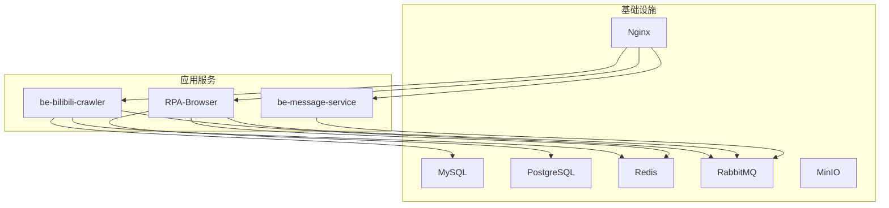
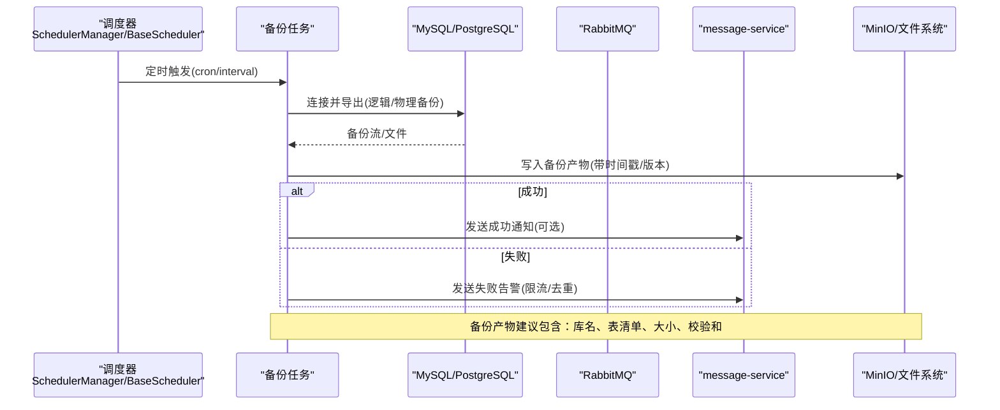
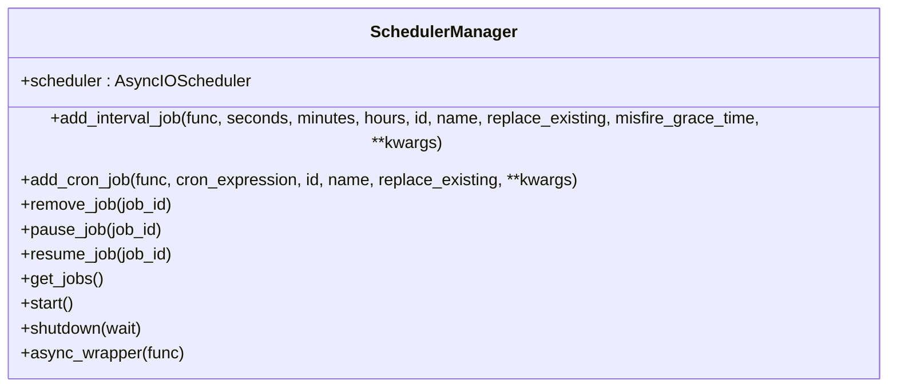
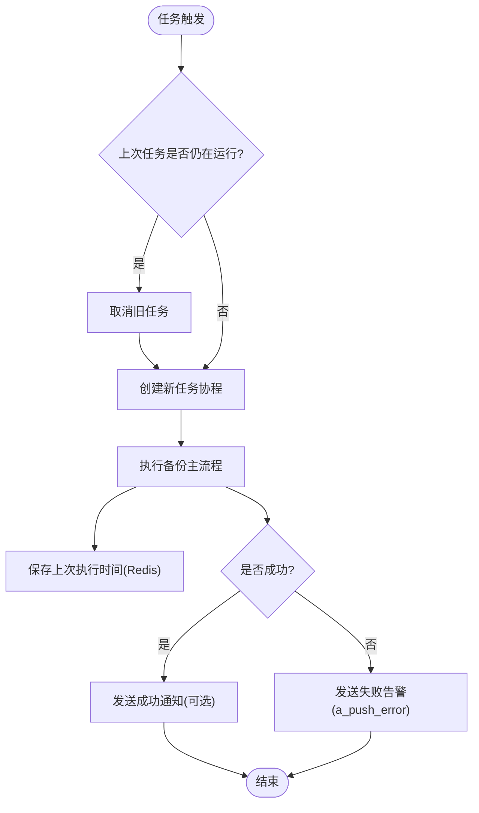
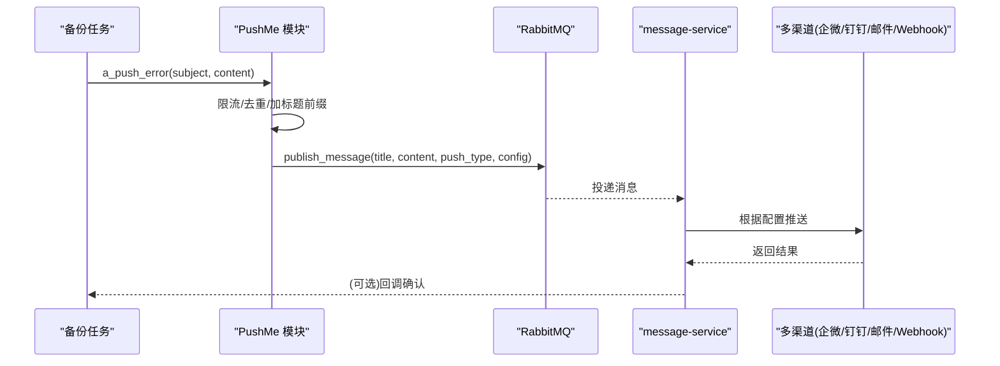
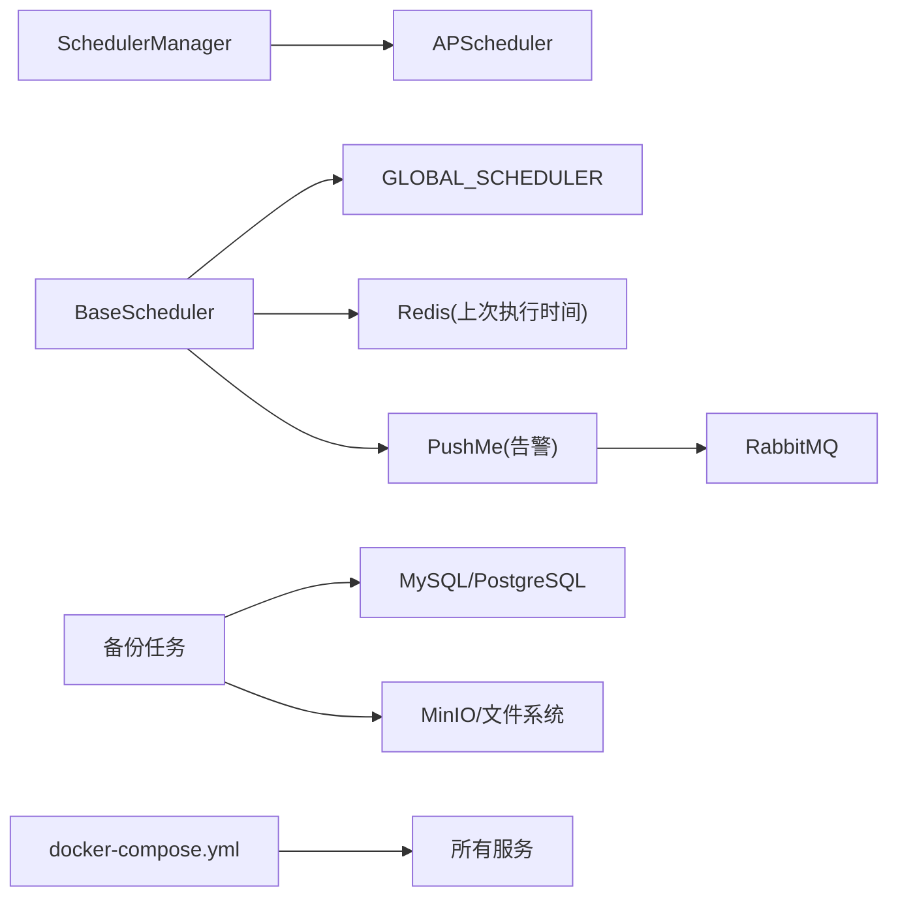

# 备份任务调度

<cite>
**本文引用的文件**
- [docker-compose.yml](file://docker-compose.yml)
- [scheduler_manager.py](file://RPA-Browser/app/scheduler_manager.py)
- [scheduler_launcher.py](file://be-bilibili-crawler/Service/BaseCrawler/launcher/scheduler_launcher.py)
- [PushMe.py](file://be-bilibili-crawler/Utils/推送/PushMe.py)
- [CONFIG.py](file://be-bilibili-crawler/CONFIG.py)
- [CommonRouter.py](file://be-bilibili-crawler/controller/common/CommonRouter.py)
- [message_router.py](file://RPA-Browser/app/controller/v1/browser/message_router.py)
</cite>

## 目录
1. [简介](#简介)
2. [项目结构](#项目结构)
3. [核心组件](#核心组件)
4. [架构总览](#架构总览)
5. [详细组件分析](#详细组件分析)
6. [依赖关系分析](#依赖关系分析)
7. [性能考量](#性能考量)
8. [故障排查指南](#故障排查指南)
9. [结论](#结论)
10. [附录](#附录)

## 简介
本方案为统一备份任务调度系统提供基于 Docker Compose 的编排与执行框架，结合应用内 APScheduler（cron/interval）实现自动化备份。通过消息队列将告警集中到 message-service，统一推送至多种渠道；同时利用容器健康检查、失败重试与日志收集，确保备份过程可靠、可观测、可追溯。针对不同数据库制定差异化备份频率：核心业务数据高频备份（如每小时），非关键数据低频备份（如每日）。

## 项目结构
- 基础设施层：MySQL、PostgreSQL、Redis、RabbitMQ、MinIO、Milvus、Nginx 等由 docker-compose.yml 统一管理，持久化数据挂载于 docker_vol。
- 服务层：
  - be-bilibili-crawler：爬虫与后台任务，内置调度器与告警通道。
  - RPA-Browser：浏览器自动化服务，提供统一的 SchedulerManager 管理 cron/interval 任务。
  - be-message-service：统一消息推送微服务，接收 RabbitMQ 消息并分发到各渠道。
- 运维层：Nginx 反向代理与健康检查；日志输出到 docker_vol/nginx/logs 与各服务的标准输出。

**图表来源**
- [docker-compose.yml:68-178](file://docker-compose.yml#L68-L178)
- [docker-compose.yml:120-164](file://docker-compose.yml#L120-L164)
- [docker-compose.yml:179-226](file://docker-compose.yml#L179-L226)
- [docker-compose.yml:227-309](file://docker-compose.yml#L227-L309)
- [docker-compose.yml:357-371](file://docker-compose.yml#L357-L371)

**章节来源**
- [docker-compose.yml:1-380](file://docker-compose.yml#L1-L380)

## 核心组件
- 调度器
  - RPA-Browser 的 SchedulerManager：封装 APScheduler，支持 interval/cron 任务注册、启停、暂停/恢复、任务列表查询。
  - be-bilibili-crawler 的 BaseScheduler：面向爬虫任务的调度基类，具备“杀旧开新”、执行间隔控制、异常告警与任务生命周期管理。
- 告警与通知
  - PushMe 模块：统一限流、去重、主题前缀与服务标识，发布消息到 RabbitMQ，交由 message-service 推送。
  - message-service：消费消息队列，按配置推送到多渠道（企业微信、钉钉、飞书、邮件、Webhook 等）。
- 存储与持久化
  - MySQL/PostgreSQL：业务与元数据存储。
  - MinIO：对象存储，可用于存放备份产物（如 SQL dump、压缩归档）。
  - Redis：缓存与状态（如上次执行时间）。
  - 日志：Nginx 访问/错误日志与应用标准输出，便于集中采集。

**章节来源**
- [scheduler_manager.py:13-192](file://RPA-Browser/app/scheduler_manager.py#L13-L192)
- [scheduler_launcher.py:17-244](file://be-bilibili-crawler/Service/BaseCrawler/launcher/scheduler_launcher.py#L17-L244)
- [PushMe.py:14-137](file://be-bilibili-crawler/Utils/推送/PushMe.py#L14-L137)
- [CONFIG.py:225-277](file://be-bilibili-crawler/CONFIG.py#L225-L277)
- [docker-compose.yml:21-67](file://docker-compose.yml#L21-L67)

## 架构总览
下图展示备份任务从触发到执行、告警与落盘的完整链路：

**图表来源**
- [scheduler_manager.py:38-125](file://RPA-Browser/app/scheduler_manager.py#L38-L125)
- [scheduler_launcher.py:115-197](file://be-bilibili-crawler/Service/BaseCrawler/launcher/scheduler_launcher.py#L115-L197)
- [PushMe.py:72-137](file://be-bilibili-crawler/Utils/推送/PushMe.py#L72-L137)
- [docker-compose.yml:21-67](file://docker-compose.yml#L21-L67)

## 详细组件分析

### 组件A：RPA-Browser 调度器（SchedulerManager）
- 职责
  - 提供单例 AsyncIOScheduler，支持 interval/cron 两种触发方式。
  - 提供装饰器 @interval_job/@cron_job 快速注册任务。
  - 提供任务增删改查、暂停/恢复、启动/关闭能力。
- 关键点
  - misfire_grace_time 用于处理错过执行的宽限时间。
  - replace_existing 避免重复注册导致多实例。
  - 异步包装 async_wrapper 兼容同步函数。

**图表来源**
- [scheduler_manager.py:13-192](file://RPA-Browser/app/scheduler_manager.py#L13-L192)

**章节来源**
- [scheduler_manager.py:13-192](file://RPA-Browser/app/scheduler_manager.py#L13-L192)

### 组件B：be-bilibili-crawler 调度器（BaseScheduler）
- 职责
  - 基于全局调度器 GLOBAL_SCHEDULER 注册任务，支持 cron 表达式。
  - 执行前判断是否满足最小间隔（基于 Redis 记录上次执行时间）。
  - “杀旧开新”：若上一次任务仍在运行，先取消再创建新任务，避免任务永久阻塞。
  - 异常捕获并通过 a_push_error 发送告警。
- 关键点
  - max_instances=1 保证同一任务串行执行。
  - misfire_grace_time 允许延迟执行窗口。
  - coalesce=True 合并错过的触发。

**图表来源**
- [scheduler_launcher.py:115-197](file://be-bilibili-crawler/Service/BaseCrawler/launcher/scheduler_launcher.py#L115-L197)

**章节来源**
- [scheduler_launcher.py:17-244](file://be-bilibili-crawler/Service/BaseCrawler/launcher/scheduler_launcher.py#L17-L244)

### 组件C：告警与通知（PushMe + message-service）
- 职责
  - 统一限流（默认60秒）、内容去重、主题前缀与服务标识。
  - 将告警消息发布到 RabbitMQ，由 message-service 统一分发到多渠道。
  - 提供测试接口验证推送链路。
- 关键点
  - server_label 自动注入服务名与地址，便于定位问题。
  - a_push_error 仅写笼统 subject，具体错误放入 content。
  - 可通过环境变量 MESSAGE_CONFIG 注入多渠道配置。

**图表来源**
- [PushMe.py:14-137](file://be-bilibili-crawler/Utils/推送/PushMe.py#L14-L137)
- [CONFIG.py:225-277](file://be-bilibili-crawler/CONFIG.py#L225-L277)
- [CommonRouter.py:67-94](file://be-bilibili-crawler/controller/common/CommonRouter.py#L67-L94)
- [message_router.py:284-301](file://RPA-Browser/app/controller/v1/browser/message_router.py#L284-L301)

**章节来源**
- [PushMe.py:14-137](file://be-bilibili-crawler/Utils/推送/PushMe.py#L14-L137)
- [CONFIG.py:225-277](file://be-bilibili-crawler/CONFIG.py#L225-L277)
- [CommonRouter.py:67-94](file://be-bilibili-crawler/controller/common/CommonRouter.py#L67-L94)
- [message_router.py:284-301](file://RPA-Browser/app/controller/v1/browser/message_router.py#L284-L301)

### 组件D：备份策略与频率
- 核心业务数据（如 MySQL 主库）：高频备份（例如每小时一次），使用 cron 表达式或短间隔 interval。
- 非关键数据（如日志库、临时库）：低频备份（例如每日一次）。
- 建议
  - 使用不同 job_id 区分不同库的备份任务。
  - 对大库采用增量/差异备份策略，减少 IO 压力。
  - 备份产物命名包含时间戳、库名、类型（全量/增量）、校验和。

[本节为概念性说明，不直接分析具体文件]

### 组件E：健康检查与失败重试
- 健康检查
  - 容器级 healthcheck：etcd、minio、milvus、message-service 等均定义健康检查命令与超时重试。
  - 建议在备份任务中增加“前置检查”（数据库连通性、磁盘空间、MinIO 可用性）。
- 失败重试
  - 调度器层面：misfire_grace_time 允许延迟执行；max_instances=1 防止并发冲突。
  - 任务层面：对网络/IO 异常进行指数退避重试，记录重试次数与原因。
  - 告警层面：失败立即推送，避免刷屏（限流+去重）。

**章节来源**
- [docker-compose.yml:14-18](file://docker-compose.yml#L14-L18)
- [docker-compose.yml:34-38](file://docker-compose.yml#L34-L38)
- [docker-compose.yml:54-59](file://docker-compose.yml#L54-L59)
- [docker-compose.yml:310-322](file://docker-compose.yml#L310-L322)
- [scheduler_launcher.py:115-133](file://be-bilibili-crawler/Service/BaseCrawler/launcher/scheduler_launcher.py#L115-L133)
- [PushMe.py:122-137](file://be-bilibili-crawler/Utils/推送/PushMe.py#L122-L137)

### 组件F：监控指标与日志收集
- 指标建议
  - 备份成功率、平均耗时、最大耗时、失败次数、重试次数。
  - 备份产物大小、存储空间使用率、最近一次备份时间。
  - 调度器任务计数、活跃任务数、错过执行次数。
- 日志收集
  - 应用日志：loguru 输出到标准输出，配合容器日志驱动收集。
  - Nginx 日志：access/error 日志挂载到 docker_vol/nginx/logs。
  - 数据库日志：MySQL/PostgreSQL 日志卷挂载，定期轮转。
  - 告警日志：message-service 推送记录与渠道回执。

[本节为通用指导，不直接分析具体文件]

## 依赖关系分析
- 调度器依赖
  - RPA-Browser 的 SchedulerManager 依赖 APScheduler 与 loguru。
  - be-bilibili-crawler 的 BaseScheduler 依赖全局调度器、Redis（上次执行时间）、PushMe（告警）。
- 告警依赖
  - PushMe 依赖 CONFIG.message_config（多渠道配置）与 RabbitMQ 发布能力。
- 存储依赖
  - 备份任务依赖 MySQL/PostgreSQL 客户端、MinIO/文件系统写入。
- 编排依赖
  - docker-compose.yml 定义服务间依赖、端口映射、健康检查与卷挂载。

**图表来源**
- [scheduler_manager.py:13-192](file://RPA-Browser/app/scheduler_manager.py#L13-L192)
- [scheduler_launcher.py:17-244](file://be-bilibili-crawler/Service/BaseCrawler/launcher/scheduler_launcher.py#L17-L244)
- [PushMe.py:72-137](file://be-bilibili-crawler/Utils/推送/PushMe.py#L72-L137)
- [docker-compose.yml:68-178](file://docker-compose.yml#L68-L178)

**章节来源**
- [scheduler_manager.py:13-192](file://RPA-Browser/app/scheduler_manager.py#L13-L192)
- [scheduler_launcher.py:17-244](file://be-bilibili-crawler/Service/BaseCrawler/launcher/scheduler_launcher.py#L17-L244)
- [PushMe.py:72-137](file://be-bilibili-crawler/Utils/推送/PushMe.py#L72-L137)
- [docker-compose.yml:68-178](file://docker-compose.yml#L68-L178)

## 性能考量
- 调度器
  - 合理设置 misfire_grace_time 与 max_instances，避免任务堆积或长时间阻塞。
  - 对长耗时任务使用独立进程/容器隔离资源。
- 数据库
  - 备份期间限制并发连接与锁粒度，避免影响在线业务。
  - 对大库采用分库分表备份或增量备份。
- 存储
  - MinIO 分桶策略：按日期/库名组织，保留周期与生命周期规则。
  - 本地磁盘容量监控与清理策略。
- 告警
  - 限流与去重避免告警风暴。
  - 分级告警：警告/失败分别推送不同渠道。

[本节为通用指导，不直接分析具体文件]

## 故障排查指南
- 常见问题
  - 调度器未启动：检查 GLOBAL_SCHEDULER.running 与 scheduler.start。
  - 任务未执行：核对 cron 表达式与 misfire_grace_time；查看 Redis 中上次执行时间。
  - 告警未送达：检查 RabbitMQ 连接、message-service 健康端点、MESSAGE_CONFIG 配置。
  - 备份失败：检查数据库连接、权限、磁盘空间、MinIO 可用性与网络连通性。
- 诊断步骤
  - 查看容器健康检查状态与日志。
  - 使用测试接口验证推送链路（如 CommonRouter 中的测试抛错接口）。
  - 在备份任务前后打印关键指标（开始/结束时间、行数、大小、错误堆栈）。

**章节来源**
- [scheduler_launcher.py:138-197](file://be-bilibili-crawler/Service/BaseCrawler/launcher/scheduler_launcher.py#L138-L197)
- [PushMe.py:122-137](file://be-bilibili-crawler/Utils/推送/PushMe.py#L122-L137)
- [CommonRouter.py:67-94](file://be-bilibili-crawler/controller/common/CommonRouter.py#L67-L94)
- [message_router.py:284-301](file://RPA-Browser/app/controller/v1/browser/message_router.py#L284-L301)

## 结论
本方案以 Docker Compose 为基础，结合应用内 APScheduler 实现灵活的备份任务编排；通过 RabbitMQ 与 message-service 构建统一告警通道；借助健康检查、失败重试与日志收集保障可靠性与可观测性。针对核心与非核心数据制定差异化备份频率，确保业务连续性与资源利用率平衡。

## 附录
- 备份产物命名建议：{库名}_{类型}_{时间戳}.sql(.gz)，附带 checksum 与元信息 JSON。
- 保留策略：按天/周/月分层保留，过期自动清理。
- 安全建议：备份文件加密传输与存储，敏感信息脱敏。
- 演练建议：定期恢复演练，验证备份有效性。

[本节为通用指导，不直接分析具体文件]