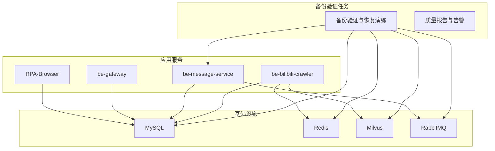
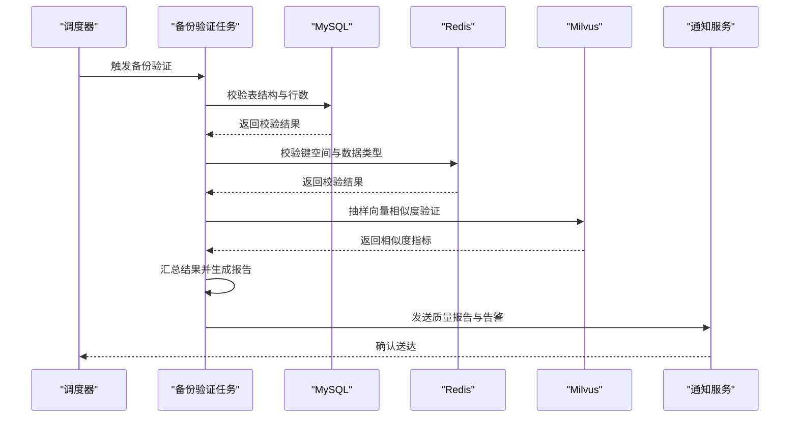
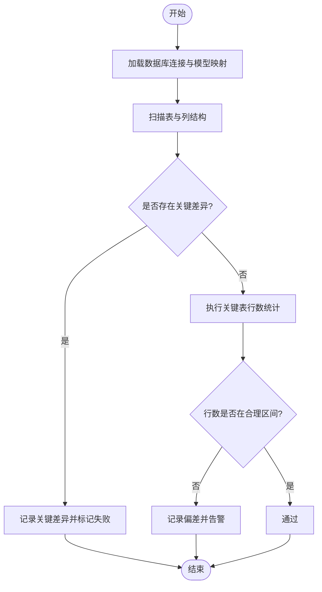
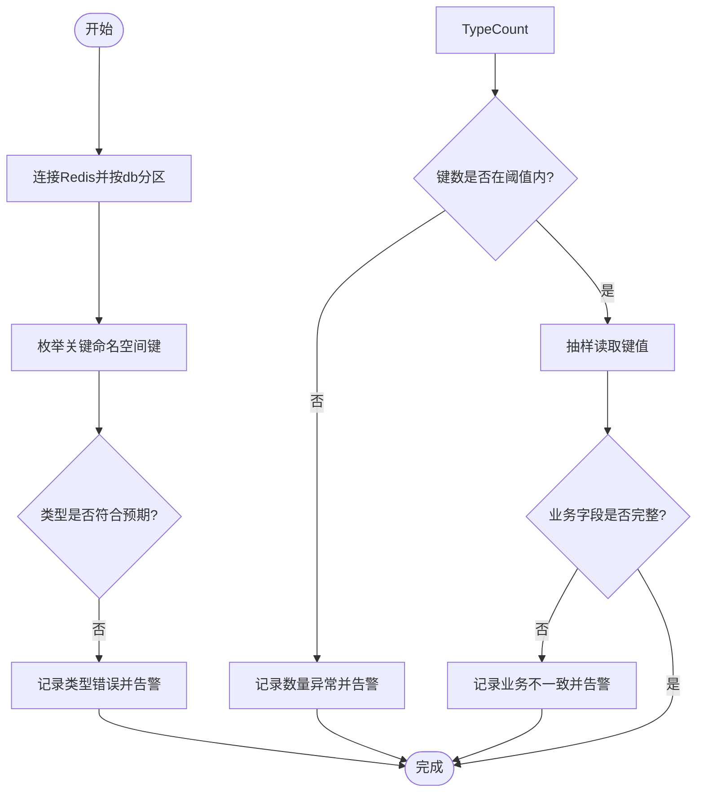
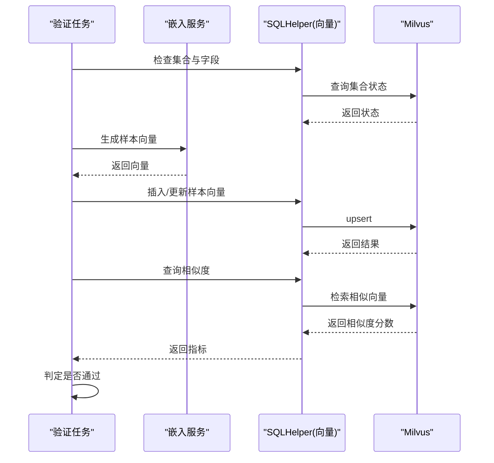
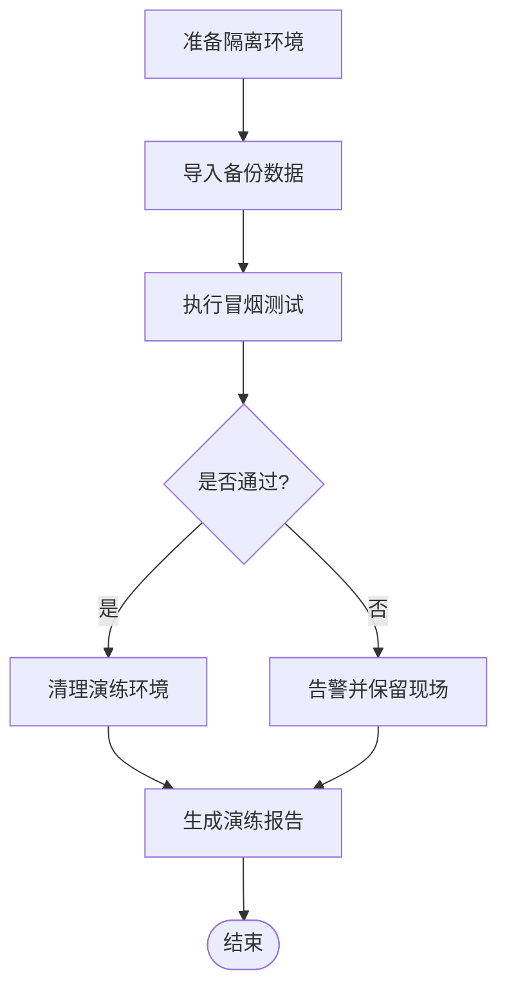
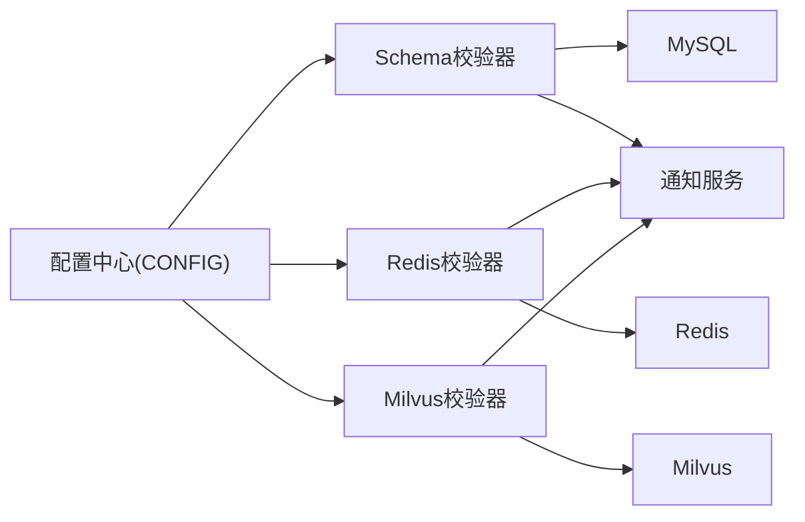

# 备份验证与完整性检查

<cite>
**本文引用的文件**
- [docker-compose.yml](file://docker-compose.yml)
- [CONFIG.py](file://be-bilibili-crawler/CONFIG.py)
- [alembic_manager.py](file://be-bilibili-crawler/Utils/FastAPI/alembic_manager.py)
- [sql_helper.py](file://be-bilibili-crawler/Service/LangChainCompo/lottery_data_vec_sql/sql_helper.py)
- [text_embed.py](file://be-bilibili-crawler/Service/LangChainCompo/text_embed.py)
- [aliRedisModel.py](file://be-bilibili-crawler/Models/lottery_database/redisModel/biliRedisModel.py)
- [alembic_migration.py](file://RPA-Browser/app/utils/alembic_migration.py)
- [config.py](file://RPA-Browser/app/config.py)
</cite>

## 目录
1. [引言](#引言)
2. [项目结构](#项目结构)
3. [核心组件](#核心组件)
4. [架构总览](#架构总览)
5. [详细组件分析](#详细组件分析)
6. [依赖关系分析](#依赖关系分析)
7. [性能考虑](#性能考虑)
8. [故障排查指南](#故障排查指南)
9. [结论](#结论)
10. [附录](#附录)

## 引言
本文件面向本仓库中涉及 MySQL、Redis、Milvus 等数据持久化组件的“备份数据验证与完整性检查”策略，目标是：
- 设计自动化的备份验证流程，覆盖文件大小检查、数据格式校验、业务一致性校验。
- 针对各数据库提供差异化验证方法：MySQL 表结构与行数比对、Redis 键值对完整性检查、Milvus 向量相似度验证。
- 提供恢复演练自动化测试方案，定期执行恢复测试确保备份有效性。
- 生成备份质量报告并建立异常告警机制。

本策略充分利用现有工程中的配置、迁移校验、向量存储与消息推送能力，形成可落地、可观测、可回滚的闭环。

## 项目结构
本项目采用多服务容器编排（Docker Compose），包含 MySQL、Redis、Milvus、RabbitMQ、爬虫服务、消息服务、网关与浏览器服务等。备份验证系统将以独立任务或定时作业形式运行，复用既有连接配置与日志/告警通道。

图表来源
- [docker-compose.yml:1-380](file://docker-compose.yml#L1-L380)

章节来源
- [docker-compose.yml:1-380](file://docker-compose.yml#L1-L380)

## 核心组件
- 配置中心与连接信息
  - 爬虫服务的数据库、Redis、Milvus、RabbitMQ 等连接通过集中配置管理，便于统一接入备份验证任务。
- Schema 一致性校验
  - 启动时进行模型与数据库结构的差异检测，区分关键与非关键差异，必要时阻塞启动。
- 向量数据写入与清理
  - 向量嵌入生成与入库、过期数据清理，为向量相似度验证提供基础。
- 通知与告警
  - 统一的推送渠道配置，支持多种通知方式，用于备份质量报告与异常告警。

章节来源
- [CONFIG.py:225-487](file://be-bilibili-crawler/CONFIG.py#L225-L487)
- [alembic_manager.py:1-213](file://be-bilibili-crawler/Utils/FastAPI/alembic_manager.py#L1-L213)
- [sql_helper.py:162-177](file://be-bilibili-crawler/Service/LangChainCompo/lottery_data_vec_sql/sql_helper.py#L162-L177)
- [text_embed.py:1-39](file://be-bilibili-crawler/Service/LangChainCompo/text_embed.py#L1-L39)
- [aliRedisModel.py:1-49](file://be-bilibili-crawler/Models/lottery_database/redisModel/biliRedisModel.py#L1-L49)
- [config.py:140-235](file://RPA-Browser/app/config.py#L140-L235)

## 架构总览
备份验证与恢复演练的整体流程如下：
- 触发：定时任务或手动触发。
- 采集：收集各组件备份元数据（大小、时间戳、版本）。
- 校验：执行分库分层的验证（MySQL/Redis/Milvus）。
- 恢复：在隔离环境执行恢复演练，验证可用性。
- 报告：汇总结果生成质量报告，并通过推送渠道发送告警。
- 反馈：将校验结果写回监控或审计系统，供后续分析。

图表来源
- [CONFIG.py:225-487](file://be-bilibili-crawler/CONFIG.py#L225-L487)
- [alembic_manager.py:1-213](file://be-bilibili-crawler/Utils/FastAPI/alembic_manager.py#L1-L213)
- [sql_helper.py:162-177](file://be-bilibili-crawler/Service/LangChainCompo/lottery_data_vec_sql/sql_helper.py#L162-L177)
- [text_embed.py:1-39](file://be-bilibili-crawler/Service/LangChainCompo/text_embed.py#L1-L39)
- [aliRedisModel.py:1-49](file://be-bilibili-crawler/Models/lottery_database/redisModel/biliRedisModel.py#L1-L49)

## 详细组件分析

### MySQL 备份验证：表结构与数据行数比对
- 目标
  - 确保备份后的表结构与 ORM 模型一致，且数据量级符合预期。
- 方法
  - 使用 Schema 一致性校验工具，对比模型与数据库的表、列、类型差异；关键差异拒绝启动或标记失败。
  - 对关键业务表执行行数统计与阈值比较，结合业务基线判断是否异常。
- 实现要点
  - 利用现有 alembic 管理器进行多库 Schema 校验，支持异步引擎与类型归一化比较。
  - 行数比对可通过 SQL 聚合查询完成，建议按库/表维度输出明细。
- 风险与对策
  - 大表行数统计可能耗时，需设置超时与分页采样策略。
  - 类型兼容规则需与 ORM 映射保持一致，避免误报。

图表来源
- [alembic_manager.py:91-191](file://be-bilibili-crawler/Utils/FastAPI/alembic_manager.py#L91-L191)
- [alembic_migration.py:98-156](file://RPA-Browser/app/utils/alembic_migration.py#L98-L156)

章节来源
- [alembic_manager.py:1-213](file://be-bilibili-crawler/Utils/FastAPI/alembic_manager.py#L1-L213)
- [alembic_migration.py:98-156](file://RPA-Browser/app/utils/alembic_migration.py#L98-L156)

### Redis 备份验证：键值对完整性检查
- 目标
  - 确保缓存/会话/临时数据的键空间完整、类型正确、TTL 合理。
- 方法
  - 遍历关键命名空间，校验键数量范围、数据类型（字符串、哈希、列表、集合、有序集合）与字段完整性。
  - 抽样读取键值并进行业务语义校验（如必填字段存在性、取值范围）。
- 实现要点
  - 复用 Redis 连接配置，按 db 索引划分不同用途的数据空间。
  - 对热点键与过期键分别处理，避免误判。
- 风险与对策
  - 全量扫描可能影响性能，建议分批与限流。
  - 动态键名需通过模式匹配与白名单控制。

图表来源
- [CONFIG.py:360-379](file://be-bilibili-crawler/CONFIG.py#L360-L379)
- [aliRedisModel.py:1-49](file://be-bilibili-crawler/Models/lottery_database/redisModel/biliRedisModel.py#L1-L49)

章节来源
- [CONFIG.py:360-379](file://be-bilibili-crawler/CONFIG.py#L360-L379)
- [aliRedisModel.py:1-49](file://be-bilibili-crawler/Models/lottery_database/redisModel/biliRedisModel.py#L1-L49)

### Milvus 备份验证：向量相似度验证
- 目标
  - 确保向量集合可用、向量维度与元数据一致，检索相似度符合预期。
- 方法
  - 检查集合是否存在、字段定义与维度是否与模型一致。
  - 抽取样本向量，计算相似度得分分布，验证阈值是否稳定。
  - 清理过期向量，保证集合健康度。
- 实现要点
  - 复用向量插入与删除接口，结合嵌入生成模块进行端到端验证。
  - 相似度阈值需基于历史基线设定，允许波动范围。
- 风险与对策
  - 大规模向量检索可能耗时，需限制样本规模与超时。
  - 外部嵌入服务不可用时应降级为仅结构校验。

图表来源
- [sql_helper.py:162-177](file://be-bilibili-crawler/Service/LangChainCompo/lottery_data_vec_sql/sql_helper.py#L162-L177)
- [text_embed.py:1-39](file://be-bilibili-crawler/Service/LangChainCompo/text_embed.py#L1-L39)

章节来源
- [sql_helper.py:162-177](file://be-bilibili-crawler/Service/LangChainCompo/lottery_data_vec_sql/sql_helper.py#L162-L177)
- [text_embed.py:1-39](file://be-bilibili-crawler/Service/LangChainCompo/text_embed.py#L1-L39)

### 备份恢复演练自动化测试方案
- 目标
  - 定期在隔离环境中执行恢复演练，验证备份可恢复性与业务可用性。
- 步骤
  - 准备隔离环境（独立库/命名空间/集合）。
  - 导入备份数据（MySQL dump、Redis RDB/AOF、Milvus 集合快照）。
  - 执行最小可用测试（登录、查询、检索、写入）。
  - 清理演练环境，记录结果。
- 集成点
  - 复用现有连接配置与迁移工具，确保演练环境与生产一致。
  - 通过消息队列或任务调度触发演练，减少人工干预。

[此图为概念流程图，不直接对应具体源码文件]

### 备份质量报告与异常告警机制
- 目标
  - 汇总各组件验证结果，生成可读的质量报告，并在异常时及时告警。
- 方法
  - 将校验结果结构化（通过/失败/警告），附带指标与明细。
  - 通过统一推送渠道配置发送告警，支持多渠道（邮件、IM、Webhook 等）。
- 实现要点
  - 复用现有推送渠道模型，确保跨服务一致的通知体验。
  - 报告可落盘或投递至消息服务，便于归档与回溯。

章节来源
- [CONFIG.py:14-139](file://be-bilibili-crawler/CONFIG.py#L14-L139)
- [config.py:13-180](file://RPA-Browser/app/config.py#L13-L180)

## 依赖关系分析
- 配置依赖
  - 所有验证任务依赖集中配置（数据库、缓存、向量、消息队列），确保连接一致性与可维护性。
- 工具依赖
  - Schema 校验依赖 Alembic 与 SQLAlchemy 反射能力。
  - 向量验证依赖嵌入服务与 Milvus 客户端。
- 外部依赖
  - 通知渠道依赖外部服务（邮件、IM、Webhook），需具备容错与重试机制。

图表来源
- [CONFIG.py:225-487](file://be-bilibili-crawler/CONFIG.py#L225-L487)
- [alembic_manager.py:1-213](file://be-bilibili-crawler/Utils/FastAPI/alembic_manager.py#L1-L213)

章节来源
- [CONFIG.py:225-487](file://be-bilibili-crawler/CONFIG.py#L225-L487)
- [alembic_manager.py:1-213](file://be-bilibili-crawler/Utils/FastAPI/alembic_manager.py#L1-L213)

## 性能考虑
- 大表行数统计与全量键扫描应设置超时与分页，避免阻塞主流程。
- 向量相似度验证采用抽样策略，降低检索压力。
- 连接池与回收策略需与数据库参数匹配，防止空闲连接失效。
- 通知与告警应具备去重与节流，避免风暴。

[本节为通用指导，无需特定源码引用]

## 故障排查指南
- Schema 不一致
  - 现象：启动被阻塞或校验失败。
  - 处理：执行迁移升级，核对模型与数据库差异，关注关键差异项。
- Redis 键异常
  - 现象：键缺失、类型不符、数量异常。
  - 处理：定位命名空间，检查写入路径与 TTL 策略，必要时重建键空间。
- Milvus 向量异常
  - 现象：集合不存在、维度不匹配、相似度异常。
  - 处理：检查集合定义与嵌入服务，清理过期数据，重新入库样本。
- 通知失败
  - 现象：告警未送达。
  - 处理：检查推送渠道配置与网络连通性，启用重试与降级。

章节来源
- [alembic_manager.py:152-191](file://be-bilibili-crawler/Utils/FastAPI/alembic_manager.py#L152-L191)
- [alembic_migration.py:98-156](file://RPA-Browser/app/utils/alembic_migration.py#L98-L156)
- [sql_helper.py:162-177](file://be-bilibili-crawler/Service/LangChainCompo/lottery_data_vec_sql/sql_helper.py#L162-L177)
- [CONFIG.py:14-139](file://be-bilibili-crawler/CONFIG.py#L14-L139)

## 结论
通过在本仓库现有配置与工具基础上构建备份验证与恢复演练体系，可实现：
- 多层级、多组件的自动化校验（MySQL/Redis/Milvus）。
- 可观测的报告与告警机制，保障备份质量。
- 定期恢复演练，提升灾难恢复能力与信心。
建议将本策略纳入 CI/CD 与运维流程，持续优化阈值与覆盖范围。

[本节为总结性内容，无需特定源码引用]

## 附录
- 环境变量与配置
  - 数据库、缓存、向量、消息队列的连接信息均通过环境变量注入，便于多环境管理。
- 容器编排
  - 使用 Docker Compose 统一管理基础设施与服务，便于本地与生产环境一致性。

章节来源
- [docker-compose.yml:1-380](file://docker-compose.yml#L1-L380)
- [CONFIG.py:225-487](file://be-bilibili-crawler/CONFIG.py#L225-L487)
- [config.py:140-235](file://RPA-Browser/app/config.py#L140-L235)