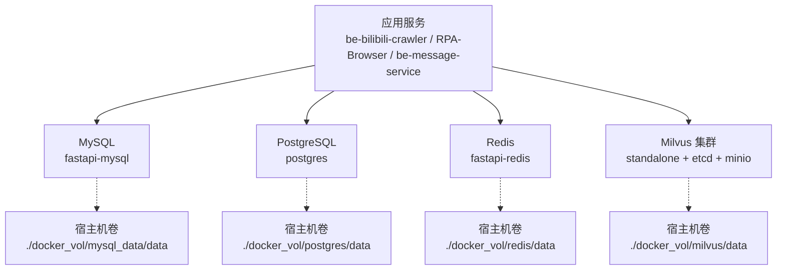
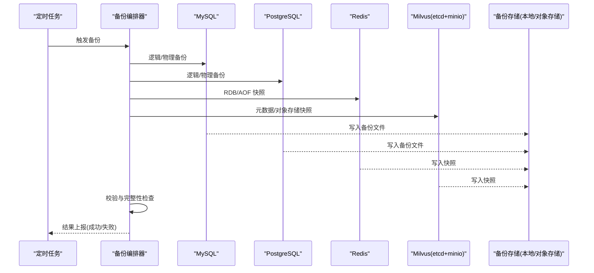
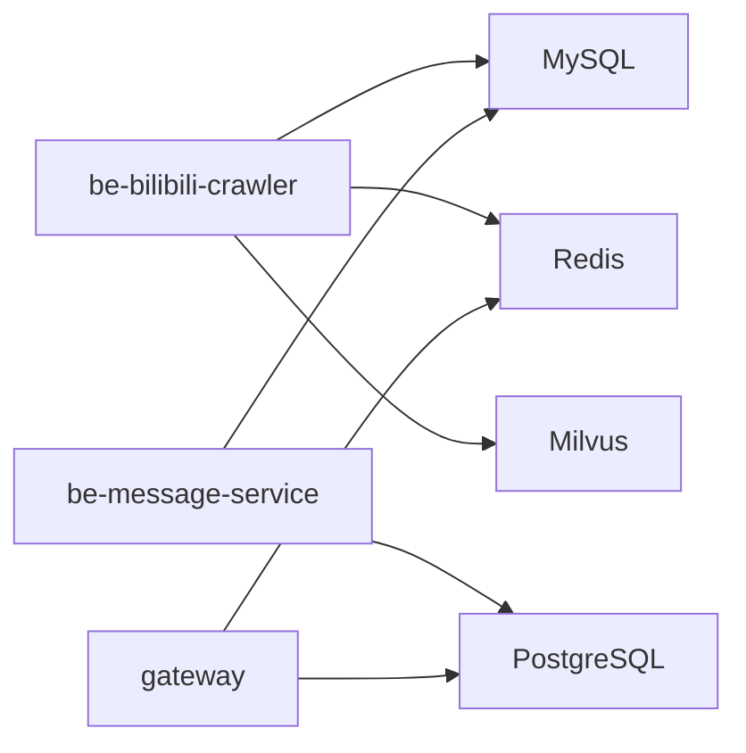

# 数据库备份策略

<cite>
**本文引用的文件**
- [docker-compose.yml](file://docker-compose.yml)
- [dc-dev.yml](file://dc-dev.yml)
- [CONFIG.py](file://be-bilibili-crawler/CONFIG.py)
- [config.py](file://RPA-Browser/app/config.py)
- [config.py](file://be-message-service/app/core/config.py)
- [scheduler_launcher.py](file://be-bilibili-crawler/Service/BaseCrawler/launcher/scheduler_launcher.py)
</cite>

## 目录
1. [简介](#简介)
2. [项目结构](#项目结构)
3. [核心组件](#核心组件)
4. [架构总览](#架构总览)
5. [详细组件分析](#详细组件分析)
6. [依赖关系分析](#依赖关系分析)
7. [性能考虑](#性能考虑)
8. [故障排查指南](#故障排查指南)
9. [结论](#结论)
10. [附录](#附录)

## 简介
本文件面向当前仓库中的数据存储（MySQL、PostgreSQL、Redis、Milvus）制定统一的备份与恢复策略，覆盖全量与增量备份、定时任务、数据校验与完整性检查，并给出针对不同业务场景的差异化建议。文档基于仓库中容器编排与服务配置的实际信息，确保可落地执行。

## 项目结构
- 所有持久化数据通过 Docker Compose 以卷形式挂载到宿主机：
  - MySQL 数据目录：./docker_vol/mysql_data/data
  - PostgreSQL 数据目录：./docker_vol/postgres/data
  - Redis 数据目录：./docker_vol/redis/data
  - Milvus 数据目录：./docker_vol/milvus/data（含 etcd/minio 子目录）
- 服务间通过环境变量连接各存储，便于在备份脚本中复用同一份连接信息。

图表来源
- [docker-compose.yml:68-92](file://docker-compose.yml#L68-L92)
- [docker-compose.yml:165-178](file://docker-compose.yml#L165-L178)
- [docker-compose.yml:41-67](file://docker-compose.yml#L41-L67)

章节来源
- [docker-compose.yml:1-380](file://docker-compose.yml#L1-L380)
- [dc-dev.yml:1-213](file://dc-dev.yml#L1-L213)

## 核心组件
- MySQL：用于多业务库（如 bilidb、bili_reserve、dyndetail、samsclub 等），连接串由爬虫服务动态拼装。
- PostgreSQL：被网关和消息服务使用，消息服务接管其读写。
- Redis：作为缓存与临时数据，数据落盘至 ./docker_vol/redis/data。
- Milvus：向量检索服务，依赖 etcd 与 MinIO，数据落盘至 ./docker_vol/milvus/data。

章节来源
- [CONFIG.py:330-379](file://be-bilibili-crawler/CONFIG.py#L330-L379)
- [config.py:41-74](file://be-message-service/app/core/config.py#L41-L74)
- [docker-compose.yml:68-92](file://docker-compose.yml#L68-L92)
- [docker-compose.yml:165-178](file://docker-compose.yml#L165-L178)
- [docker-compose.yml:41-67](file://docker-compose.yml#L41-L67)

## 架构总览
下图展示备份流程：定时任务触发后，按存储类型调用对应工具或命令进行快照/导出，完成后进行校验与归档，失败时告警。

[此图为概念性流程图，不直接映射具体源码文件]

## 详细组件分析

### MySQL 备份与恢复
- 备份方法
  - 逻辑备份：mysqldump 按库/表导出 SQL，适合小体量与跨版本迁移。
  - 物理备份：XtraBackup 对 InnoDB 做热备，适合大体量与在线环境。
  - 增量备份：开启 binlog，结合 XtraBackup 实现基于时间点的增量恢复。
- 恢复流程
  - 逻辑恢复：mysql 导入 SQL；注意字符集与事务一致性。
  - 物理恢复：停止实例，替换数据目录，启动并回放 binlog 至目标时间点。
- 关键配置与位置
  - 数据目录：./docker_vol/mysql_data/data
  - 配置文件目录：./docker_vol/mysql_data/conf.d
- 建议
  - 核心业务库（如 bilidb、bili_reserve、dyndetail、samsclub）采用“每日全量 + 每小时增量”策略。
  - 非关键库可降低频率（如每周全量 + 每日增量）。
  - 备份前执行一致性检查（checksum 或 count），恢复后进行抽样比对。

章节来源
- [CONFIG.py:330-379](file://be-bilibili-crawler/CONFIG.py#L330-L379)
- [docker-compose.yml:68-81](file://docker-compose.yml#L68-L81)

### PostgreSQL 备份与恢复
- 备份方法
  - 逻辑备份：pg_dump/pg_dumpall 导出 SQL/自定义格式。
  - 物理备份：pg_basebackup 配合 WAL 归档实现 PITR（时间点恢复）。
- 恢复流程
  - 逻辑恢复：psql 导入；注意 schema 顺序与外键约束。
  - 物理恢复：停库，还原基础备份，回放 WAL 至目标时间点。
- 关键配置与位置
  - 数据目录：./docker_vol/postgres/data
- 建议
  - 网关与消息服务使用的 PPTR_Bili_Lot 库建议“每日全量 + 每小时增量”。
  - 恢复后验证索引与统计信息，必要时 ANALYZE。

章节来源
- [docker-compose.yml:165-178](file://docker-compose.yml#L165-L178)

### Redis 备份与恢复
- 备份方法
  - RDB 快照：触发 SAVE/BGSAVE，复制 dump.rdb。
  - AOF：启用 appendonly，定期重写，复制 aof 文件。
- 恢复流程
  - 停库，替换 dump.rdb 或 aof 文件，重启服务。
- 关键配置与位置
  - 数据目录：./docker_vol/redis/data
- 建议
  - 高频写入场景建议同时启用 AOF 与 RDB，AOF 策略选择每秒同步。
  - 备份前检查内存与持久化状态，避免大 key 导致阻塞。

章节来源
- [docker-compose.yml:82-92](file://docker-compose.yml#L82-L92)

### Milvus 备份与恢复
- 备份方法
  - 元数据：etcd 快照（etcdctl snapshot save）。
  - 对象存储：MinIO 桶内对象（Milvus 将实体数据存于对象存储）。
  - 运行时：可通过 milvus 提供的管理接口导出集合元数据（视版本能力）。
- 恢复流程
  - 恢复 etcd 快照，恢复 MinIO 对象，重启 Milvus 节点。
- 关键配置与位置
  - 数据目录：./docker_vol/milvus/data
  - etcd 数据目录：./docker_vol/milvus/etcd
  - MinIO 数据目录：./docker_vol/milvus/minio
- 建议
  - 先备份 etcd，再备份 MinIO，保证元数据与数据一致。
  - 恢复后校验集合列表与向量维度，必要时重建索引。

章节来源
- [docker-compose.yml:41-67](file://docker-compose.yml#L41-L67)
- [dc-dev.yml:1-65](file://dc-dev.yml#L1-L65)

### 定时备份任务
- 调度机制
  - 项目已内置通用调度器（基于 APScheduler），支持 cron 表达式与任务合并执行，可用于编排备份任务。
- 建议方案
  - 将 MySQL/PG/Redis/Milvus 的备份命令封装为独立脚本，由调度器按 cron 触发。
  - 首次运行立即执行，后续按周期执行，失败重试与告警。
- 注意事项
  - 控制并发，避免多个备份任务同时占用 IO 影响业务。
  - 记录每次任务的开始/结束时间与耗时，便于容量规划。

章节来源
- [scheduler_launcher.py:82-136](file://be-bilibili-crawler/Service/BaseCrawler/launcher/scheduler_launcher.py#L82-L136)

### 备份数据验证与完整性检查
- 一致性校验
  - MySQL/PG：使用 checksum、count、抽样比对等方式验证数据一致性。
  - Redis：校验 key 数量、热点 key 值、RDB/AOF 完整性。
  - Milvus：校验集合元数据、向量维度、样本查询返回。
- 自动化
  - 在备份成功后自动执行校验脚本，失败则标记备份无效并告警。
- 保留策略
  - 按天/周/月分级保留，过期清理释放空间。

[本节为通用实践说明，不直接引用具体源码]

### 不同业务场景的备份策略建议
- 核心业务数据（高价值、高变更）
  - MySQL/PG：每日全量 + 每小时增量；开启 binlog/WAL；恢复演练至少每月一次。
  - Redis：AOF 每秒同步 + 周期性 RDB；重要会话/队列数据额外冷备。
  - Milvus：etcd + MinIO 双备份；集合级元数据导出。
- 非关键数据（低价值、低变更）
  - 降低频率：每周全量 + 每日增量；或仅全量。
  - 可接受更长恢复时间目标（RTO）与数据丢失窗口（RPO）。

[本节为通用实践说明，不直接引用具体源码]

## 依赖关系分析
- 服务与存储的连接通过环境变量注入，便于统一管理与复用：
  - 爬虫服务读取 MySQL/Redis/Milvus 配置，构建连接串。
  - 消息服务读取 MySQL/PostgreSQL 配置，管理私信与用户相关数据。
  - 网关服务连接 Postgres 与 Redis。
- 备份脚本应复用这些环境变量，避免硬编码。

图表来源
- [CONFIG.py:330-379](file://be-bilibili-crawler/CONFIG.py#L330-L379)
- [config.py:41-74](file://be-message-service/app/core/config.py#L41-L74)
- [docker-compose.yml:120-212](file://docker-compose.yml#L120-L212)

章节来源
- [CONFIG.py:330-379](file://be-bilibili-crawler/CONFIG.py#L330-L379)
- [config.py:41-74](file://be-message-service/app/core/config.py#L41-L74)
- [docker-compose.yml:120-212](file://docker-compose.yml#L120-L212)

## 性能考虑
- 备份窗口
  - 避开业务高峰，利用夜间低峰期执行全量备份。
  - 增量备份频率根据 RPO 要求调整。
- IO 与 CPU
  - 物理备份可能占用较高 IO，建议使用独立磁盘或限速。
  - 逻辑备份在高并发下可能增加数据库负载，需评估。
- 网络与存储
  - 远程备份（对象存储）需考虑带宽与延迟，建议压缩与分片上传。
  - 本地备份建议 RAID 或异地副本。

[本节为通用实践说明，不直接引用具体源码]

## 故障排查指南
- 常见问题
  - 备份失败：检查存储空间、权限、网络连通性与数据库健康状态。
  - 恢复失败：确认备份版本与数据库版本兼容，检查日志与错误码。
  - 数据不一致：对比源与目标的数据量与校验和，定位差异点。
- 监控与告警
  - 对备份任务设置成功/失败告警，记录关键指标（时长、大小、错误信息）。
  - 对存储容量设置阈值告警，防止写满。
- 回滚策略
  - 恢复前先创建快照或副本，确保可回滚。
  - 分阶段恢复，逐步验证后再切换流量。

[本节为通用实践说明，不直接引用具体源码]

## 结论
本策略基于仓库实际部署结构，明确了 MySQL、PostgreSQL、Redis、Milvus 的备份方法与恢复流程，提供了全量与增量配置思路、定时任务编排建议以及数据校验与完整性检查方法。建议按业务重要性差异化设定备份频率与保留策略，并定期演练恢复流程，确保在真实故障时能快速、可靠地恢复数据。

## 附录
- 环境变量参考
  - MySQL：MYSQL_HOST、MYSQL_PORT、MYSQL_USER、MYSQL_PASSWORD
  - Redis：REDIS_HOST、REDIS_PORT、REDIS_PWD
  - PostgreSQL：POSTGRES_USER、POSTGRES_PASSWORD、POSTGRES_HOST
  - Milvus：MILVUS_HOST、MILVUS_PORT
- 数据目录参考
  - MySQL：./docker_vol/mysql_data/data
  - PostgreSQL：./docker_vol/postgres/data
  - Redis：./docker_vol/redis/data
  - Milvus：./docker_vol/milvus/data（含 etcd/minio）

章节来源
- [CONFIG.py:225-253](file://be-bilibili-crawler/CONFIG.py#L225-L253)
- [config.py:140-174](file://RPA-Browser/app/config.py#L140-L174)
- [config.py:41-74](file://be-message-service/app/core/config.py#L41-L74)
- [docker-compose.yml:68-92](file://docker-compose.yml#L68-L92)
- [docker-compose.yml:165-178](file://docker-compose.yml#L165-L178)
- [docker-compose.yml:41-67](file://docker-compose.yml#L41-L67)