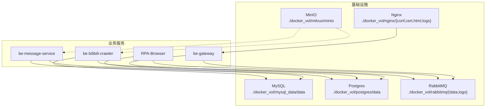
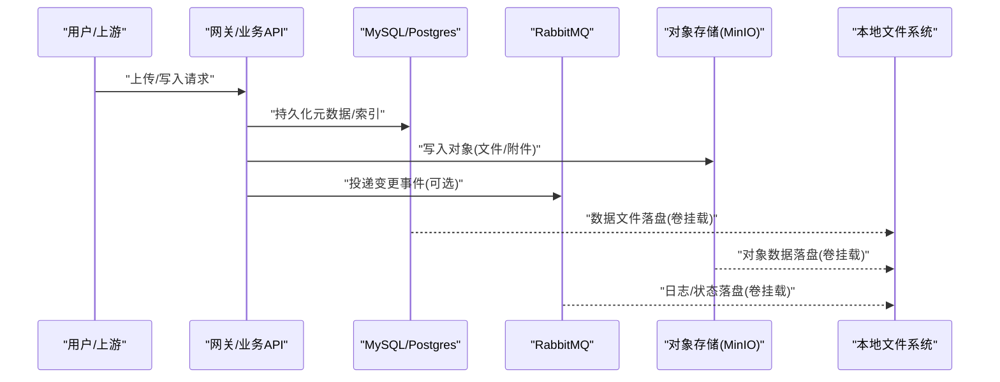
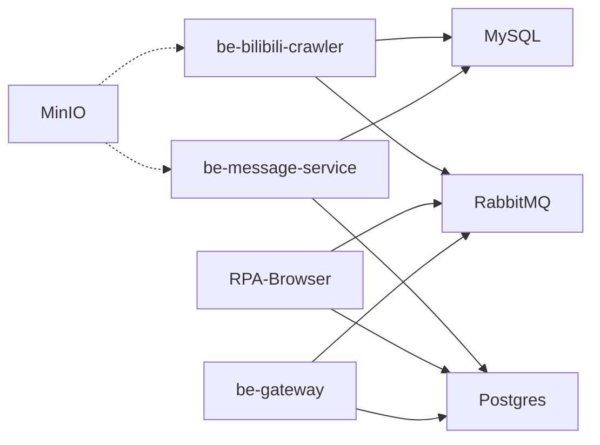

# 文件数据备份

<cite>
**本文引用的文件**
- [docker-compose.yml](file://docker-compose.yml)
- [RPA-Browser/app/config.py](file://RPA-Browser/app/config.py)
- [be-message-service/app/core/config.py](file://be-message-service/app/core/config.py)
- [be-bilibili-crawler/Service/BaseCrawler/config.py](file://be-bilibili-crawler/Service/BaseCrawler/config.py)
- [be-bilibili-crawler/Service/GrpcModule/Models/getLotDynSortByDate.py](file://be-bilibili-crawler/Service/GrpcModule/Models/getLotDynSortByDate.py)
- [RPA-Browser/app/services/execution/action_logger.py](file://RPA-Browser/app/services/execution/action_logger.py)
- [RPA-Browser/app/models/workflow/models.py](file://RPA-Browser/app/models/workflow/models.py)
- [RPA-Browser/app/services/execution/crud_service/action_log_crud.py](file://RPA-Browser/app/services/execution/crud_service/action_log_crud.py)
</cite>

## 目录
1. [简介](#简介)
2. [项目结构](#项目结构)
3. [核心组件](#核心组件)
4. [架构总览](#架构总览)
5. [详细组件分析](#详细组件分析)
6. [依赖关系分析](#依赖关系分析)
7. [性能考虑](#性能考虑)
8. [故障排查指南](#故障排查指南)
9. [结论](#结论)
10. [附录](#附录)

## 简介
本文件数据备份策略文档面向本仓库中的用户上传文件、日志文件、配置文件等关键数据的备份与恢复。结合当前代码库中已存在的 MinIO 对象存储、MySQL/Postgres 数据库持久化卷、RabbitMQ 消息队列、以及 RPA 浏览器运行态数据，给出：
- MinIO 对象存储的数据备份方案（含跨机房复制建议）
- 本地文件系统的数据同步策略（增量同步、大文件优化）
- 配置文件版本管理（环境变量与模板）
- 一致性保证与损坏修复流程
- 日志采集与保留策略的落地实践

## 项目结构
从部署编排可见，系统通过 docker-compose 统一编排了 MinIO、Milvus、MySQL、Postgres、RabbitMQ、Nginx 及多个业务服务；各服务的运行时数据通过 volumes 挂载到宿主机目录，便于集中备份。

图表来源
- [docker-compose.yml:21-40](file://docker-compose.yml#L21-L40)
- [docker-compose.yml:68-109](file://docker-compose.yml#L68-L109)
- [docker-compose.yml:120-164](file://docker-compose.yml#L120-L164)
- [docker-compose.yml:165-226](file://docker-compose.yml#L165-L226)
- [docker-compose.yml:227-309](file://docker-compose.yml#L227-L309)
- [docker-compose.yml:357-371](file://docker-compose.yml#L357-L371)

章节来源
- [docker-compose.yml:21-40](file://docker-compose.yml#L21-L40)
- [docker-compose.yml:68-109](file://docker-compose.yml#L68-L109)
- [docker-compose.yml:120-164](file://docker-compose.yml#L120-L164)
- [docker-compose.yml:165-226](file://docker-compose.yml#L165-L226)
- [docker-compose.yml:227-309](file://docker-compose.yml#L227-L309)
- [docker-compose.yml:357-371](file://docker-compose.yml#L357-L371)

## 核心组件
- 对象存储：MinIO（容器镜像与端口映射明确，数据目录为 ./docker_vol/milvus/minio）
- 数据库：MySQL（BiliMessageDB、BiliRPADB）、Postgres（PPTR_Bili_Lot），数据目录分别挂载于 ./docker_vol/mysql_data/data 与 ./docker_vol/postgres/data
- 消息队列：RabbitMQ（数据与日志目录挂载）
- Nginx：静态资源与证书、访问日志挂载
- 业务服务：be-bilibili-crawler、RPA-Browser、be-message-service、be-gateway

这些组件构成了“结构化数据（DB）+ 非结构化数据（对象存储/文件）+ 事件流（MQ）”的统一数据面，适合实施分层备份策略。

章节来源
- [docker-compose.yml:21-40](file://docker-compose.yml#L21-L40)
- [docker-compose.yml:68-109](file://docker-compose.yml#L68-L109)
- [docker-compose.yml:120-164](file://docker-compose.yml#L120-L164)
- [docker-compose.yml:165-226](file://docker-compose.yml#L165-L226)
- [docker-compose.yml:227-309](file://docker-compose.yml#L227-L309)
- [docker-compose.yml:357-371](file://docker-compose.yml#L357-L371)

## 架构总览
下图展示了数据在系统中的流转与落盘位置，以及对应的备份目标。

图表来源
- [docker-compose.yml:21-40](file://docker-compose.yml#L21-L40)
- [docker-compose.yml:68-109](file://docker-compose.yml#L68-L109)
- [docker-compose.yml:120-164](file://docker-compose.yml#L120-L164)
- [docker-compose.yml:165-226](file://docker-compose.yml#L165-L226)
- [docker-compose.yml:227-309](file://docker-compose.yml#L227-L309)
- [docker-compose.yml:357-371](file://docker-compose.yml#L357-L371)

## 详细组件分析

### MinIO 对象存储备份与跨机房复制
- 数据落盘位置：./docker_vol/milvus/minio（由 compose 定义）
- 备份策略建议
  - 全量快照：定期将 minio 数据目录打包归档至异地存储（如冷备 OSS/S3）
  - 增量同步：使用支持断点续传的工具对 minio 数据目录进行增量同步
  - 跨机房复制：基于对象存储的跨区域复制能力或第三方工具实现异步复制
- 校验与恢复
  - 校验：对归档包做完整性校验（如 SHA256）
  - 恢复：在隔离环境先演练恢复，再切换生产

章节来源
- [docker-compose.yml:21-40](file://docker-compose.yml#L21-L40)

### 本地文件系统数据同步与大文件优化
- 涉及目录
  - MySQL 数据目录：./docker_vol/mysql_data/data
  - Postgres 数据目录：./docker_vol/postgres/data
  - RabbitMQ 数据与日志：./docker_vol/rabbitmq/{data,logs}
  - Nginx 配置与日志：./docker_vol/nginx/{conf,cert,html,logs}
  - RPA 浏览器运行态数据：./docker_vol/rpa/chrome_app（命名卷）
- 同步策略
  - 增量同步：采用支持增量与去重的同步工具，按目录粒度执行
  - 大文件优化：启用分块传输、并发下载、断点续传；优先选择网络友好的协议（如 SFTP/HTTP Range）
  - 定时任务：结合 cron/systemd timer 周期性触发
- 一致性保障
  - 数据库：建议在停机窗口或使用数据库自带逻辑备份工具导出后再拷贝数据文件
  - 文件：对关键目录生成校验和并记录时间戳，用于比对与回滚

章节来源
- [docker-compose.yml:68-109](file://docker-compose.yml#L68-L109)
- [docker-compose.yml:165-226](file://docker-compose.yml#L165-L226)
- [docker-compose.yml:227-309](file://docker-compose.yml#L227-L309)
- [docker-compose.yml:357-371](file://docker-compose.yml#L357-L371)

### 配置文件版本管理与多环境覆盖
- RPA-Browser 配置
  - 通过 pydantic-settings 加载 .env.prod/.env.dev，支持环境变量覆盖
  - 路径常量集中管理（日志、项目根、用户数据目录）
- be-message-service 配置
  - 集中式 Settings，包含数据库连接池、GeoIP 目录、推送渠道 JSON 配置等
  - 提供属性方法用于同步驱动连接串（Alembic 离线场景）
- 爬虫通用配置
  - 每个爬虫独立配置类，集中注册表管理，避免全局污染
- 版本管理建议
  - 将 .env.* 模板纳入版本控制，敏感信息通过密钥管理服务注入
  - 变更走 PR 评审，配合自动化测试验证配置正确性

章节来源
- [RPA-Browser/app/config.py:140-215](file://RPA-Browser/app/config.py#L140-L215)
- [RPA-Browser/app/config.py:219-234](file://RPA-Browser/app/config.py#L219-L234)
- [be-message-service/app/core/config.py:1-375](file://be-message-service/app/core/config.py#L1-L375)
- [be-bilibili-crawler/Service/BaseCrawler/config.py:48-244](file://be-bilibili-crawler/Service/BaseCrawler/config.py#L48-L244)

### 日志采集、保留与清理
- 采集开关与字段
  - 操作日志可配置是否记录参数、结果、变量快照，仅错误时记录、负载长度限制、保留天数等
- 清理策略
  - 服务端默认保留天数清理过期日志，返回清理条数
- 备份建议
  - 日志文件属于易变数据，建议按天滚动归档，保留周期根据合规要求设定

章节来源
- [RPA-Browser/app/models/workflow/models.py:255-261](file://RPA-Browser/app/models/workflow/models.py#L255-L261)
- [RPA-Browser/app/services/execution/action_logger.py:65-96](file://RPA-Browser/app/services/execution/action_logger.py#L65-L96)
- [RPA-Browser/app/services/execution/crud_service/action_log_crud.py:188-229](file://RPA-Browser/app/services/execution/crud_service/action_log_crud.py#L188-L229)

### 动态数据备份与归档（示例）
- 动态数据归档脚本路径指向 scripts/database/dyn_backup，支持生成 zip 等归档产物
- 建议将该脚本纳入定时任务，输出到受控的备份目录，并纳入整体备份策略

章节来源
- [be-bilibili-crawler/Service/GrpcModule/Models/getLotDynSortByDate.py:8-16](file://be-bilibili-crawler/Service/GrpcModule/Models/getLotDynSortByDate.py#L8-L16)

## 依赖关系分析
- 服务间依赖
  - be-bilibili-crawler 依赖 MySQL、Redis、RabbitMQ、Unidbg、Milvus
  - be-message-service 依赖 MySQL、Postgres、RabbitMQ、Casdoor
  - RPA-Browser 依赖 Postgres、Redis、RabbitMQ、Casdoor
  - be-gateway 依赖 Postgres、Redis、Casdoor
- 数据依赖
  - 结构化数据：MySQL/Postgres（卷挂载）
  - 非结构化数据：MinIO（卷挂载）
  - 事件数据：RabbitMQ（卷挂载）
  - 静态资源与日志：Nginx（卷挂载）

图表来源
- [docker-compose.yml:120-164](file://docker-compose.yml#L120-L164)
- [docker-compose.yml:165-226](file://docker-compose.yml#L165-L226)
- [docker-compose.yml:227-309](file://docker-compose.yml#L227-L309)

章节来源
- [docker-compose.yml:120-164](file://docker-compose.yml#L120-L164)
- [docker-compose.yml:165-226](file://docker-compose.yml#L165-L226)
- [docker-compose.yml:227-309](file://docker-compose.yml#L227-L309)

## 性能考虑
- 大文件传输优化
  - 使用支持分块、并发、断点续传的同步工具
  - 针对 MinIO 对象存储，优先利用其 HTTP 接口特性进行高效传输
- 增量同步策略
  - 基于文件时间戳与大小变化进行增量同步，减少带宽占用
  - 对数据库建议采用逻辑备份（导出 SQL）+ 物理文件快照的组合
- 跨机房复制
  - 对象存储：启用跨区域复制或第三方工具异步复制
  - 数据库：主从复制 + 定期全量快照
  - 文件：增量同步 + 校验和校验

[本节为通用指导，不直接分析具体文件]

## 故障排查指南
- 日志级别与输出
  - message-service 支持通过环境变量调整 FastStream 与业务日志级别，生产默认 WARNING
- 健康检查
  - message-service 暴露 /health 端点，可用于探活与依赖连通性检查
- 常见异常
  - 连接池过大导致数据库连接耗尽：配置中已有防御逻辑限制连接池上限
  - 证书换行符问题：配置初始化时对证书换行符进行转义处理

章节来源
- [be-message-service/app/core/config.py:19-35](file://be-message-service/app/core/config.py#L19-L35)
- [be-message-service/app/core/config.py:310-322](file://be-message-service/app/core/config.py#L310-L322)
- [be-message-service/app/core/config.py:351-360](file://be-message-service/app/core/config.py#L351-L360)

## 结论
本仓库通过 docker-compose 统一管理了对象存储、数据库、消息队列与 Web 服务，所有关键数据均通过卷挂载到宿主机，便于实施统一的备份策略。建议：
- 以 MinIO 对象存储为核心承载用户上传文件与非结构化数据，实施全量+增量+跨机房复制
- 对 MySQL/Postgres 采用逻辑备份与物理快照相结合的策略，确保一致性与快速恢复
- 对日志与临时文件采用滚动归档与保留策略，降低存储压力
- 配置文件纳入版本管理，敏感信息通过环境变量或密钥管理服务注入
- 建立定期演练与校验机制，确保备份可用性与恢复时效性

[本节为总结性内容，不直接分析具体文件]

## 附录
- 关键目录清单
  - MinIO：./docker_vol/milvus/minio
  - MySQL：./docker_vol/mysql_data/data
  - Postgres：./docker_vol/postgres/data
  - RabbitMQ：./docker_vol/rabbitmq/{data,logs}
  - Nginx：./docker_vol/nginx/{conf,cert,html,logs}
  - RPA 浏览器：./docker_vol/rpa/chrome_app
- 相关配置入口
  - RPA-Browser 配置：app/config.py
  - message-service 配置：app/core/config.py
  - 爬虫通用配置：Service/BaseCrawler/config.py
  - 动态数据归档路径：scripts/database/dyn_backup

章节来源
- [docker-compose.yml:21-40](file://docker-compose.yml#L21-L40)
- [docker-compose.yml:68-109](file://docker-compose.yml#L68-L109)
- [docker-compose.yml:165-226](file://docker-compose.yml#L165-L226)
- [docker-compose.yml:227-309](file://docker-compose.yml#L227-L309)
- [docker-compose.yml:357-371](file://docker-compose.yml#L357-L371)
- [RPA-Browser/app/config.py:140-215](file://RPA-Browser/app/config.py#L140-L215)
- [be-message-service/app/core/config.py:1-375](file://be-message-service/app/core/config.py#L1-L375)
- [be-bilibili-crawler/Service/BaseCrawler/config.py:48-244](file://be-bilibili-crawler/Service/BaseCrawler/config.py#L48-L244)
- [be-bilibili-crawler/Service/GrpcModule/Models/getLotDynSortByDate.py:8-16](file://be-bilibili-crawler/Service/GrpcModule/Models/getLotDynSortByDate.py#L8-L16)