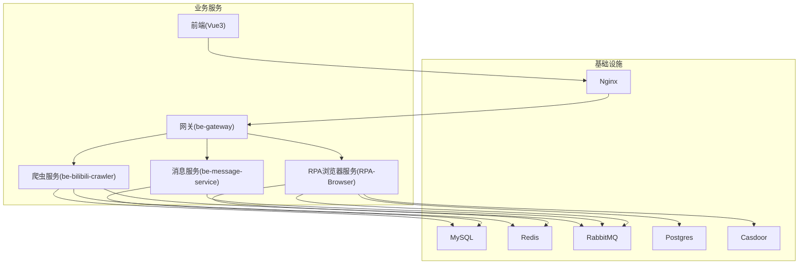
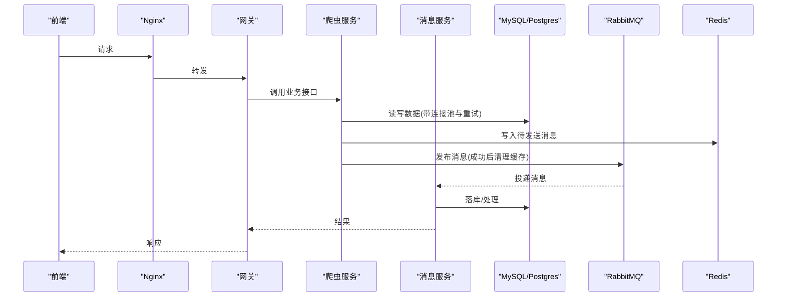
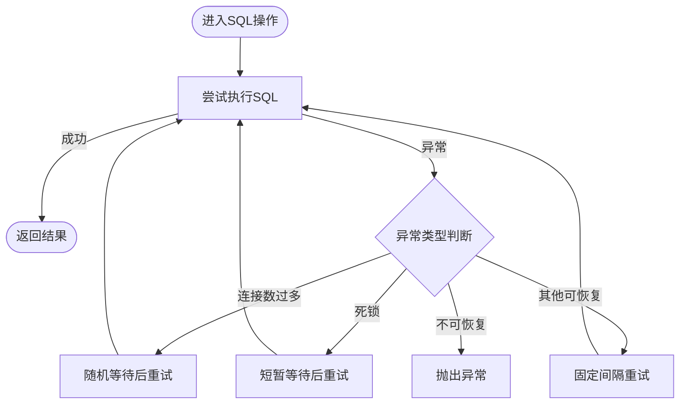
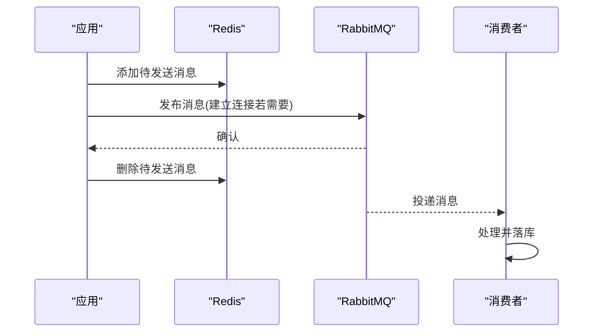
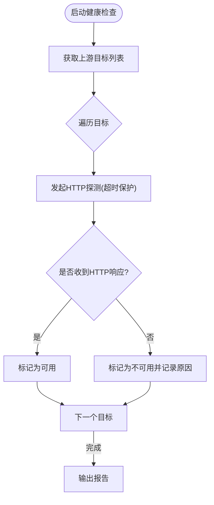
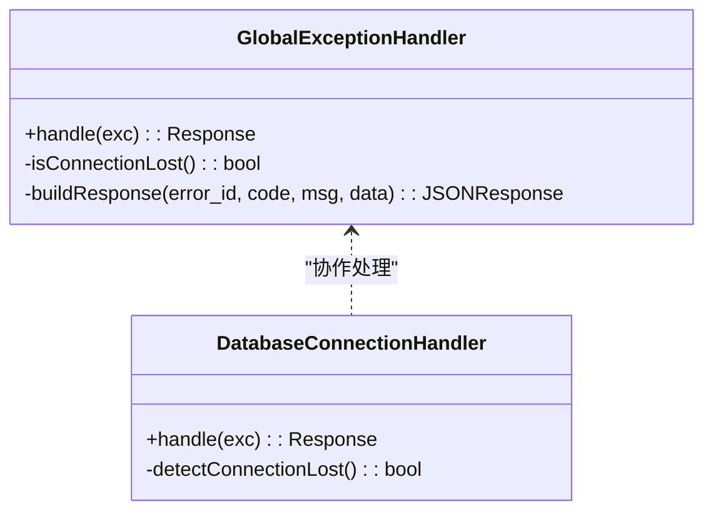
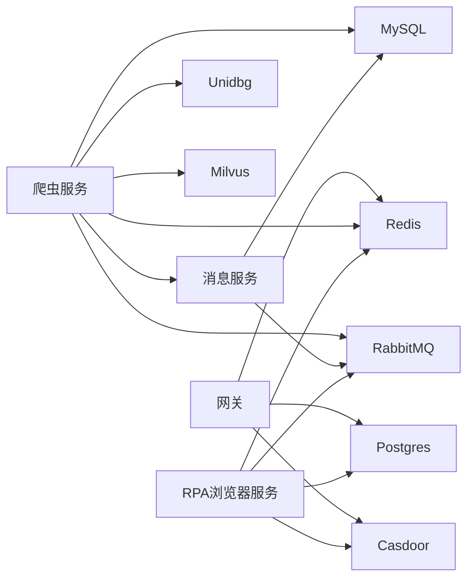
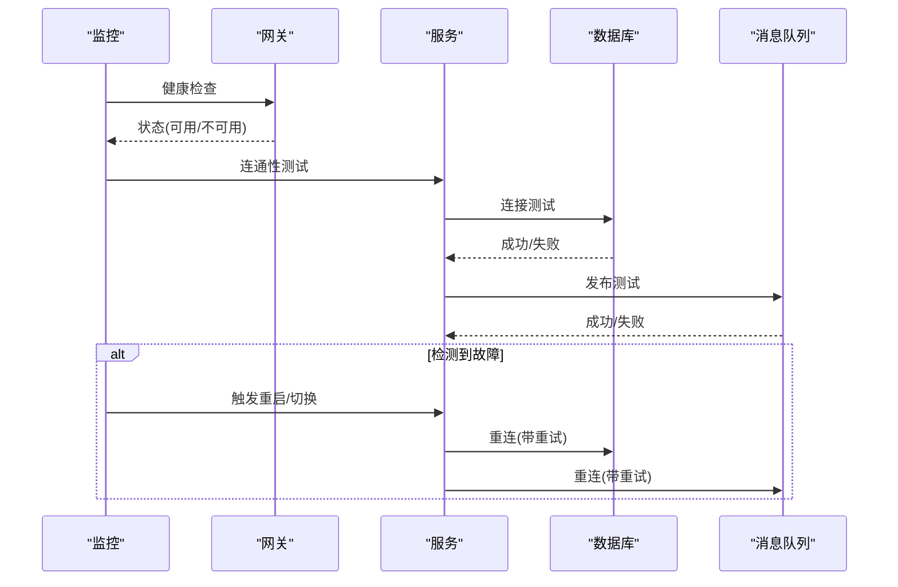

# 灾难恢复预案

<cite>
**本文引用的文件**
- [docker-compose.yml](file://docker-compose.yml)
- [CONFIG.py](file://be-bilibili-crawler/CONFIG.py)
- [Common.py](file://be-bilibili-crawler/Utils/通用/Common.py)
- [handlers.py](file://RPA-Browser/app/exceptions/handlers.py)
- [broker.py](file://be-message-service/app/core/broker.py)
- [RabbitmqPubCacheRedis.py](file://be-bilibili-crawler/Service/MQ/utils/RabbitmqPubCacheRedis.py)
- [BiliLotDataPublisher.py](file://be-bilibili-crawler/Service/MQ/base/MQClient/BiliLotDataPublisher.py)
- [upstream_health_service.js](file://be-gateway/ExpressServerEnd/Service/upstream_health_module/upstream_health_service.js)
- [FastapiLifespan.py](file://be-bilibili-crawler/Utils/FastAPI/FastapiLifespan.py)
- [DefaultService.gen.ts](file://Vue3FrontEndDemoExercise/src/api/community/hey-api/services/DefaultService.gen.ts)
- [create_database.py](file://be-bilibili-crawler/create_database.py)
</cite>

## 目录
1. [引言](#引言)
2. [项目结构](#项目结构)
3. [核心组件](#核心组件)
4. [架构总览](#架构总览)
5. [详细组件分析](#详细组件分析)
6. [依赖关系分析](#依赖关系分析)
7. [性能与容量规划](#性能与容量规划)
8. [故障分级与恢复策略](#故障分级与恢复策略)
9. [自动化检测与自动恢复流程](#自动化检测与自动恢复流程)
10. [手动恢复操作指南](#手动恢复操作指南)
11. [监控与告警](#监控与告警)
12. [演练与验证](#演练与演练)
13. [结论](#结论)

## 引言
本预案面向系统级故障、数据丢失、网络中断等极端场景，提供可执行的恢复流程与自动化机制设计。结合当前容器化部署（MySQL、Redis、RabbitMQ、Postgres、Nginx、各微服务）以及消息队列、数据库连接池、健康检查与异常处理等能力，明确 RTO（恢复时间目标）与 RPO（恢复点目标）的定义与实现方案，并给出不同级别灾难的应对策略和手动恢复步骤。

## 项目结构
系统采用多服务容器编排：
- 基础设施：MySQL、Redis、RabbitMQ、Postgres、MinIO、Etcd、Milvus、Nginx、Casdoor、LLM 服务等
- 业务服务：爬虫服务（be-bilibili-crawler）、消息服务（be-message-service）、网关（be-gateway）、RPA 浏览器服务（RPA-Browser）、前端（Vue3FrontEndDemoExercise）
- 关键能力：数据库连接池与重试、消息持久化与缓存、服务健康检查、统一异常处理、迁移脚本

**图表来源**
- [docker-compose.yml:1-380](file://docker-compose.yml#L1-L380)

**章节来源**
- [docker-compose.yml:1-380](file://docker-compose.yml#L1-L380)

## 核心组件
- 数据库层：MySQL（主业务库）、Postgres（PPTR 展示读库），具备连接池配置、预 ping、回收周期、SQL 错误分类与重试
- 缓存与缓冲：Redis（会话、缓存、待发送消息队列）、RabbitMQ（异步解耦、消息持久化）
- 服务健康检查：网关上游健康检查、服务启动时端口/HTTP 连通性测试、消息服务 /health 探活
- 异常处理：统一全局异常处理器，区分数据库连接丢失与内部错误，返回 503 并提示重试
- 迁移与重建：Alembic 迁移、批量建库与 stamp head、lifespan 启动时升级与一致性校验

**章节来源**
- [CONFIG.py:381-419](file://be-bilibili-crawler/CONFIG.py#L381-L419)
- [Common.py:173-287](file://be-bilibili-crawler/Utils/通用/Common.py#L173-L287)
- [handlers.py:70-183](file://RPA-Browser/app/exceptions/handlers.py#L70-L183)
- [broker.py:1-25](file://be-message-service/app/core/broker.py#L1-L25)
- [docker-compose.yml:68-178](file://docker-compose.yml#L68-L178)
- [create_database.py:200-218](file://be-bilibili-crawler/create_database.py#L200-L218)

## 架构总览
系统通过网关统一入口，后端服务通过消息队列进行异步解耦，数据库作为持久化存储，Redis 用于缓存与消息暂存。服务间通过 HTTP/RPC 与 MQ 通信，配合健康检查与异常处理保障可用性。

**图表来源**
- [docker-compose.yml:120-309](file://docker-compose.yml#L120-L309)
- [BiliLotDataPublisher.py:54-72](file://be-bilibili-crawler/Service/MQ/base/MQClient/BiliLotDataPublisher.py#L54-L72)
- [RabbitmqPubCacheRedis.py:21-40](file://be-bilibili-crawler/Service/MQ/utils/RabbitmqPubCacheRedis.py#L21-L40)
- [broker.py:1-25](file://be-message-service/app/core/broker.py#L1-L25)

## 详细组件分析

### 数据库连接与重试机制
- 连接池参数：pool_pre_ping、pool_recycle、pool_size/max_overflow，避免陈旧连接与资源耗尽
- SQL 错误分类：OperationalError 细分（如 1040 连接数过多、死锁 1213），按策略等待或重试
- 装饰器封装：统一捕获异常、指数退避或固定间隔重试，最终抛出或继续重试

**图表来源**
- [Common.py:173-287](file://be-bilibili-crawler/Utils/通用/Common.py#L173-L287)
- [CONFIG.py:381-419](file://be-bilibili-crawler/CONFIG.py#L381-L419)

**章节来源**
- [Common.py:173-287](file://be-bilibili-crawler/Utils/通用/Common.py#L173-L287)
- [CONFIG.py:381-419](file://be-bilibili-crawler/CONFIG.py#L381-L419)

### 消息队列与持久化
- 发布路径：先写 Redis 待发送消息，再连接 Broker 发布；发布成功后删除缓存，保证至少一次语义
- 消费者路由：统一 TOPIC exchange，按 routing_key 分流到独立队列，避免耦合
- 健康检查：/health 同时校验 broker 连通性，未连上返回 503

**图表来源**
- [BiliLotDataPublisher.py:54-72](file://be-bilibili-crawler/Service/MQ/base/MQClient/BiliLotDataPublisher.py#L54-L72)
- [RabbitmqPubCacheRedis.py:21-40](file://be-bilibili-crawler/Service/MQ/utils/RabbitmqPubCacheRedis.py#L21-L40)
- [broker.py:1-25](file://be-message-service/app/core/broker.py#L1-L25)

**章节来源**
- [BiliLotDataPublisher.py:54-72](file://be-bilibili-crawler/Service/MQ/base/MQClient/BiliLotDataPublisher.py#L54-L72)
- [RabbitmqPubCacheRedis.py:21-40](file://be-bilibili-crawler/Service/MQ/utils/RabbitmqPubCacheRedis.py#L21-L40)
- [broker.py:1-25](file://be-message-service/app/core/broker.py#L1-L25)

### 服务健康检查与故障发现
- 网关上游健康检查：对每个上游目标发起 HTTP 探测，只要返回任意 HTTP 响应即视为存活，仅连接失败视为不可用
- 服务启动连通性测试：启动时检测端口/HTTP 端点，记录失败项并告警
- 前端健康检查：调用 /health 接口，返回 204 表示服务与 MQ 正常

**图表来源**
- [upstream_health_service.js:39-124](file://be-gateway/ExpressServerEnd/Service/upstream_health_module/upstream_health_service.js#L39-L124)
- [FastapiLifespan.py:211-240](file://be-bilibili-crawler/Utils/FastAPI/FastapiLifespan.py#L211-L240)
- [DefaultService.gen.ts:8-21](file://Vue3FrontEndDemoExercise/src/api/community/hey-api/services/DefaultService.gen.ts#L8-L21)

**章节来源**
- [upstream_health_service.js:39-124](file://be-gateway/ExpressServerEnd/Service/upstream_health_module/upstream_health_service.js#L39-L124)
- [FastapiLifespan.py:211-240](file://be-bilibili-crawler/Utils/FastAPI/FastapiLifespan.py#L211-L240)
- [DefaultService.gen.ts:8-21](file://Vue3FrontEndDemoExercise/src/api/community/hey-api/services/DefaultService.gen.ts#L8-L21)

### 统一异常处理与服务降级
- 全局异常处理器：识别数据库连接丢失（DisconnectionError/OperationalError），返回 503 并提示重试
- 开发模式：返回详细错误信息便于定位；生产模式：仅返回 error_id 与重试建议
- 专用数据库连接错误处理器：进一步细化错误信息与重试时间

**图表来源**
- [handlers.py:70-183](file://RPA-Browser/app/exceptions/handlers.py#L70-L183)

**章节来源**
- [handlers.py:70-183](file://RPA-Browser/app/exceptions/handlers.py#L70-L183)

## 依赖关系分析
- 服务依赖：网关依赖 Postgres、Redis、Casdoor；爬虫服务依赖 MySQL、Redis、RabbitMQ、Unidbg、Milvus、Message Service；消息服务依赖 RabbitMQ、MySQL、Casdoor；RPA 浏览器服务依赖 Postgres、Redis、RabbitMQ、Casdoor
- 外部依赖：Nginx 反向代理、LLM 服务、向量数据库（Milvus）
- 关键链路：数据库连接池、消息队列、健康检查、异常处理

**图表来源**
- [docker-compose.yml:120-309](file://docker-compose.yml#L120-L309)

**章节来源**
- [docker-compose.yml:120-309](file://docker-compose.yml#L120-L309)

## 性能与容量规划
- 数据库连接池：根据并发与超时设置 pool_size、max_overflow、pool_recycle，避免连接泄漏与耗尽
- 消息队列：合理划分队列与路由键，避免热点与拥塞；使用 Redis 缓存待发送消息提升可靠性
- 健康检查：控制探测频率与超时，避免误判与风暴
- 日志与监控：调整日志等级，减少 I/O 压力；集中收集关键指标

[本节为通用指导，不直接分析具体文件]

## 故障分级与恢复策略
- 一级（轻微）：单节点偶发错误（如临时网络抖动、数据库瞬时拥塞）
  - 策略：自动重试与退避，观察指标，必要时限流
- 二级（一般）：单服务不可用（如某微服务进程崩溃、依赖不可达）
  - 策略：重启服务、切换备用实例、隔离故障依赖
- 三级（严重）：基础设施故障（如数据库宕机、消息队列中断、网络分区）
  - 策略：启用备份/只读模式、降级功能、数据重建、跨机房切换
- 四级（灾难）：数据中心级故障（大规模断电、硬件损坏）
  - 策略：异地容灾切换、冷备恢复、人工介入

[本节为通用指导，不直接分析具体文件]

## 自动化检测与自动恢复流程
- 自动检测：
  - 网关上游健康检查定时探测，记录不可用目标
  - 服务启动时端口/HTTP 连通性测试，记录失败项
  - 消息服务 /health 探活，未连上返回 503
- 自动恢复：
  - 数据库连接丢失：返回 503，客户端按 retry_after 重试；连接池预 ping 与回收避免陈旧连接
  - 消息发布失败：Redis 缓存待发送消息，Broker 重连后重试发布
  - 服务重启：容器编排 restart=unless-stopped，自动拉起

**图表来源**
- [upstream_health_service.js:39-124](file://be-gateway/ExpressServerEnd/Service/upstream_health_module/upstream_health_service.js#L39-L124)
- [FastapiLifespan.py:211-240](file://be-bilibili-crawler/Utils/FastAPI/FastapiLifespan.py#L211-L240)
- [handlers.py:70-183](file://RPA-Browser/app/exceptions/handlers.py#L70-L183)
- [BiliLotDataPublisher.py:54-72](file://be-bilibili-crawler/Service/MQ/base/MQClient/BiliLotDataPublisher.py#L54-L72)

**章节来源**
- [upstream_health_service.js:39-124](file://be-gateway/ExpressServerEnd/Service/upstream_health_module/upstream_health_service.js#L39-L124)
- [FastapiLifespan.py:211-240](file://be-bilibili-crawler/Utils/FastAPI/FastapiLifespan.py#L211-L240)
- [handlers.py:70-183](file://RPA-Browser/app/exceptions/handlers.py#L70-L183)
- [BiliLotDataPublisher.py:54-72](file://be-bilibili-crawler/Service/MQ/base/MQClient/BiliLotDataPublisher.py#L54-L72)

## 手动恢复操作指南
- 数据库恢复：
  - 使用 create_database.py 重建数据库并 stamp head，随后执行 alembic upgrade head
  - 检查连接池配置与 MySQL 超时设置，确保连接稳定
- 消息队列恢复：
  - 检查 RabbitMQ 服务状态与队列绑定，必要时重建队列
  - 清理 Redis 中待发送消息，重新触发发布
- 服务恢复：
  - 重启容器或服务进程，观察健康检查与日志
  - 检查环境变量与依赖服务连通性
- 前端恢复：
  - 调用 /health 接口验证服务状态，必要时刷新缓存

**章节来源**
- [create_database.py:200-218](file://be-bilibili-crawler/create_database.py#L200-L218)
- [docker-compose.yml:68-178](file://docker-compose.yml#L68-L178)
- [DefaultService.gen.ts:8-21](file://Vue3FrontEndDemoExercise/src/api/community/hey-api/services/DefaultService.gen.ts#L8-L21)

## 监控与告警
- 健康检查：网关上游健康检查、服务启动连通性测试、/health 探活
- 日志：统一异常处理器记录错误 ID 与堆栈，便于追踪
- 告警：通过消息服务推送告警，支持多渠道通知

**章节来源**
- [upstream_health_service.js:39-124](file://be-gateway/ExpressServerEnd/Service/upstream_health_module/upstream_health_service.js#L39-L124)
- [handlers.py:70-183](file://RPA-Browser/app/exceptions/handlers.py#L70-L183)
- [broker.py:1-25](file://be-message-service/app/core/broker.py#L1-L25)

## 演练与验证
- 定期演练：模拟数据库宕机、消息队列中断、网络分区等场景，验证自动恢复与手动恢复流程
- 验证指标：RTO、RPO、恢复成功率、数据一致性
- 改进优化：根据演练结果调整配置与流程

[本节为通用指导，不直接分析具体文件]

## 结论
本预案基于现有系统的容器化部署、消息队列、数据库连接池与健康检查能力，构建了从自动检测到自动恢复的完整链条。通过明确的故障分级与恢复策略，结合手动操作指南，确保在极端情况下能够快速恢复服务与数据。建议持续演练与优化，以提升系统的韧性与可靠性。

[本节为总结，不直接分析具体文件]