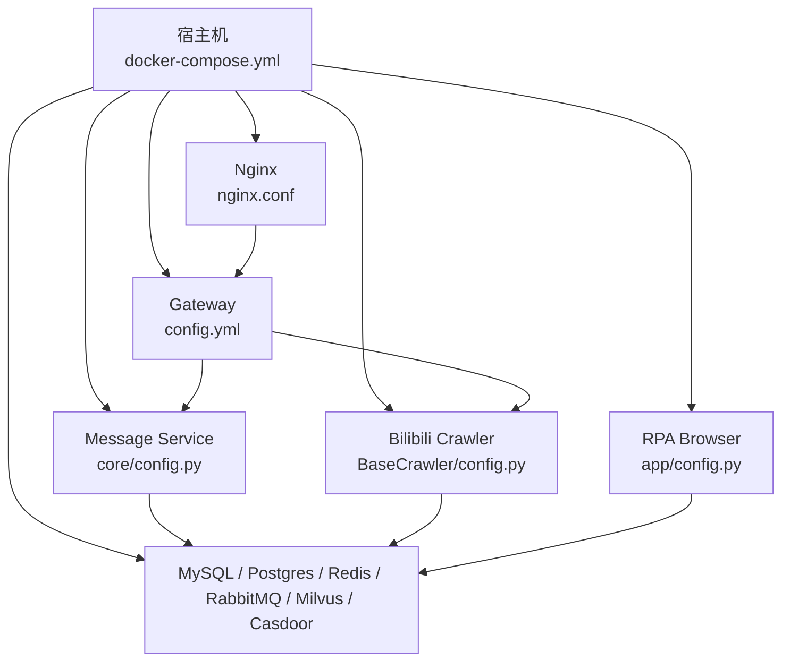
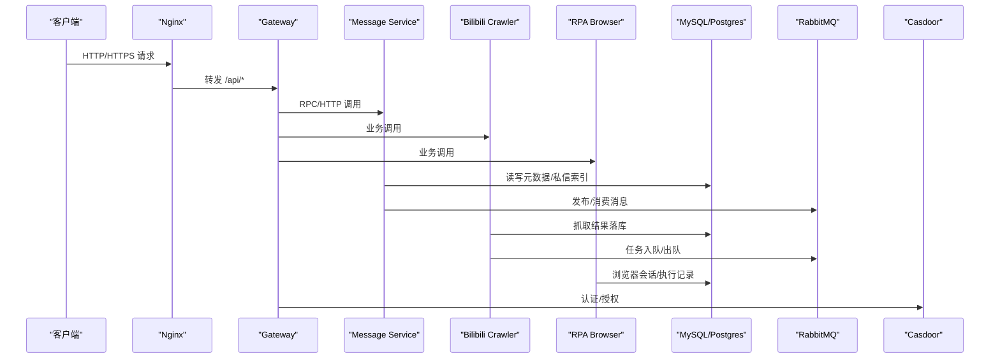
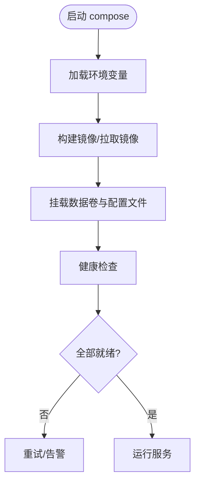
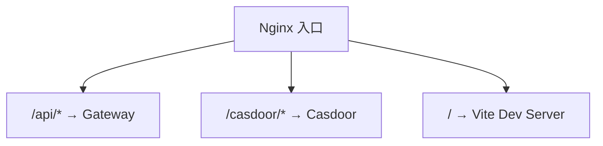
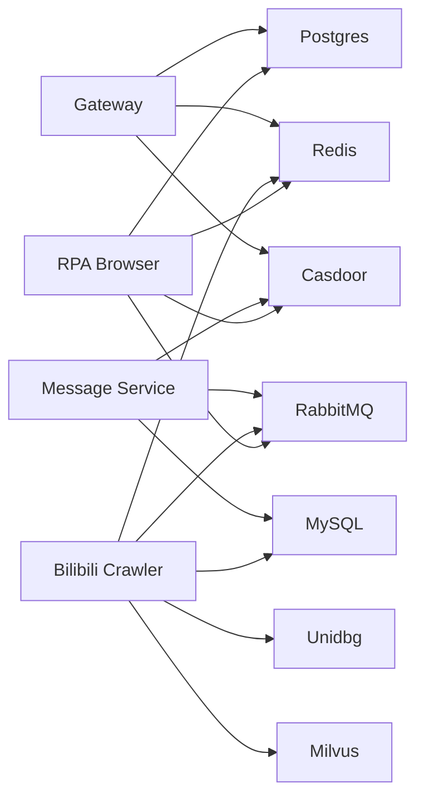

# 配置备份管理

<cite>
**本文引用的文件**
- [docker-compose.yml](file://docker-compose.yml)
- [dc-dev.yml](file://dc-dev.yml)
- [nginx.conf](file://docker_vol/nginx/conf/nginx.conf)
- [RPA-Browser/app/config.py](file://RPA-Browser/app/config.py)
- [be-bilibili-crawler/Service/BaseCrawler/config.py](file://be-bilibili-crawler/Service/BaseCrawler/config.py)
- [be-gateway/ExpressServerEnd/config/config.yml](file://be-gateway/ExpressServerEnd/config/config.yml)
- [be-message-service/app/core/config.py](file://be-message-service/app/core/config.py)
- [Makefile](file://Makefile)
</cite>

## 目录
1. [简介](#简介)
2. [项目结构](#项目结构)
3. [核心组件](#核心组件)
4. [架构总览](#架构总览)
5. [详细组件分析](#详细组件分析)
6. [依赖关系分析](#依赖关系分析)
7. [性能与容量考虑](#性能与容量考虑)
8. [故障排查指南](#故障排查指南)
9. [结论](#结论)
10. [附录：操作清单与回滚流程](#附录操作清单与回滚流程)

## 简介
本文件面向多服务（Python/Node/Go/数据库/缓存/消息队列/Nginx）项目的“配置备份与恢复”主题，覆盖应用配置、环境变量、服务间通信配置等关键项的备份策略与恢复方案。重点包括：
- Docker Compose 编排配置
- 环境变量与敏感信息
- Nginx 反向代理配置
- 数据库连接与迁移配置
- 服务间通信（RabbitMQ、Casdoor、Postgres、MySQL、Redis、Milvus 等）
- 配置版本控制、热更新与回滚机制
- 配置安全加密与权限控制最佳实践

## 项目结构
本项目通过 docker-compose 统一编排多个服务，关键配置集中在以下位置：
- 容器编排与环境变量：docker-compose.yml、dc-dev.yml
- 网关与反向代理：docker_vol/nginx/conf/nginx.conf
- 各服务运行时配置：
  - RPA-Browser：RPA-Browser/app/config.py
  - be-bilibili-crawler：be-bilibili-crawler/Service/BaseCrawler/config.py
  - be-gateway：be-gateway/ExpressServerEnd/config/config.yml
  - be-message-service：be-message-service/app/core/config.py
- 运维脚本：Makefile

**图表来源**
- [docker-compose.yml:1-380](file://docker-compose.yml#L1-L380)
- [nginx.conf:1-71](file://docker_vol/nginx/conf/nginx.conf#L1-L71)
- [be-gateway/ExpressServerEnd/config/config.yml:1-29](file://be-gateway/ExpressServerEnd/config/config.yml#L1-L29)
- [be-message-service/app/core/config.py:1-375](file://be-message-service/app/core/config.py#L1-L375)
- [be-bilibili-crawler/Service/BaseCrawler/config.py:1-244](file://be-bilibili-crawler/Service/BaseCrawler/config.py#L1-L244)
- [RPA-Browser/app/config.py:1-235](file://RPA-Browser/app/config.py#L1-L235)

**章节来源**
- [docker-compose.yml:1-380](file://docker-compose.yml#L1-L380)
- [dc-dev.yml:1-213](file://dc-dev.yml#L1-L213)
- [nginx.conf:1-71](file://docker_vol/nginx/conf/nginx.conf#L1-L71)
- [Makefile:1-71](file://Makefile#L1-L71)

## 核心组件
- 容器编排与环境变量
  - 所有服务通过 docker-compose.yml 定义，服务间通过环境变量互联（如 MySQL、Redis、RabbitMQ、Postgres、Casdoor、Milvus）。
  - 敏感信息通过 ${VAR} 注入，避免硬编码；持久化数据通过 volumes 挂载到宿主机目录。
- Nginx 反向代理
  - 对外暴露 80/443/81，将 /api 转发至 Gateway，静态资源与前端开发服务器由 Vite 提供，Casdoor 控制台通过 81 端口代理。
- 各服务配置
  - Message Service：集中管理日志级别、数据库连接池、分库分表、EdgeRank、JWT、Casdoor、推送渠道等。
  - Bilibili Crawler：按爬虫类型维护独立配置类，并通过注册表集中加载。
  - RPA Browser：基于 pydantic-settings 从 .env 与环境变量加载运行参数，包含推送渠道全局配置。
  - Gateway：集中密码盐、JWT secret、等级经验值、RabbitMQ RPC 超时等。
- 运维脚本
  - Makefile 封装常用启动、停止、重启、日志查看命令，便于快速回滚或重建环境。

**章节来源**
- [docker-compose.yml:68-178](file://docker-compose.yml#L68-L178)
- [docker-compose.yml:179-371](file://docker-compose.yml#L179-L371)
- [nginx.conf:1-71](file://docker_vol/nginx/conf/nginx.conf#L1-L71)
- [be-message-service/app/core/config.py:1-375](file://be-message-service/app/core/config.py#L1-L375)
- [be-bilibili-crawler/Service/BaseCrawler/config.py:1-244](file://be-bilibili-crawler/Service/BaseCrawler/config.py#L1-L244)
- [RPA-Browser/app/config.py:1-235](file://RPA-Browser/app/config.py#L1-L235)
- [be-gateway/ExpressServerEnd/config/config.yml:1-29](file://be-gateway/ExpressServerEnd/config/config.yml#L1-L29)
- [Makefile:1-71](file://Makefile#L1-L71)

## 架构总览
下图展示请求从外部进入，经 Nginx 路由到 Gateway，再由 Gateway 调用后端服务（Message/Crawler/RPA），并访问共享基础设施（DB/Cache/MQ/IDP）。

**图表来源**
- [docker-compose.yml:179-371](file://docker-compose.yml#L179-L371)
- [nginx.conf:1-71](file://docker_vol/nginx/conf/nginx.conf#L1-L71)
- [be-message-service/app/core/config.py:1-375](file://be-message-service/app/core/config.py#L1-L375)
- [be-bilibili-crawler/Service/BaseCrawler/config.py:1-244](file://be-bilibili-crawler/Service/BaseCrawler/config.py#L1-L244)
- [RPA-Browser/app/config.py:1-235](file://RPA-Browser/app/config.py#L1-L235)
- [be-gateway/ExpressServerEnd/config/config.yml:1-29](file://be-gateway/ExpressServerEnd/config/config.yml#L1-L29)

## 详细组件分析

### 容器编排与环境变量（Docker Compose）
- 关键服务与数据卷
  - etcd/minio/milvus：向量检索与元数据存储，数据卷位于 docker_vol/milvus/*
  - mysql/postgres：业务与用户数据，数据卷位于 docker_vol/mysql_data、postgres/data
  - redis/rabbitmq：缓存与消息队列，数据卷位于 docker_vol/redis/data、rabbitmq/*
  - casdoor：身份认证，配置文件挂载于 docker_vol/casdoor/conf/app.conf
  - nginx：反向代理，配置与证书挂载于 docker_vol/nginx/*
- 环境变量注入
  - 服务间通过环境变量互联（如 MYSQL_HOST、REDIS_HOST、RABBITMQ_URL、POSTGRES_*、CASDOOR_*、MESSAGE_CONFIG 等）
  - 敏感字段（密码、密钥）通过 ${VAR} 引用，避免明文入库
- 健康检查与重启策略
  - 多数服务配置 healthcheck 与 restart=unless-stopped，提升可用性

**图表来源**
- [docker-compose.yml:1-380](file://docker-compose.yml#L1-L380)

**章节来源**
- [docker-compose.yml:1-380](file://docker-compose.yml#L1-L380)
- [dc-dev.yml:1-213](file://dc-dev.yml#L1-L213)

### Nginx 反向代理配置
- 监听端口：80/443/81
- 路由规则：
  - /casdoor/* → Casdoor 控制台
  - /api/* → Gateway（Node.js）
  - / → 前端开发服务器（Vite 5173）
- 头信息透传：Host、X-Forwarded-*、x-bili-* 等
- 证书与静态资源：cert 与 html 目录通过 volumes 挂载

**图表来源**
- [nginx.conf:1-71](file://docker_vol/nginx/conf/nginx.conf#L1-L71)

**章节来源**
- [nginx.conf:1-71](file://docker_vol/nginx/conf/nginx.conf#L1-L71)

### 应用配置：Message Service
- 配置要点
  - 日志级别、运行环境、日志文件目录
  - MySQL/Postgres 连接串与连接池大小、是否打印 SQL
  - Alembic 自动迁移开关与目标版本
  - EdgeRank 推荐算法权重、召回路开关、个性化开关
  - JWT 与 Casdoor 集成配置
  - 推送渠道全局配置（JSON 环境变量）
- 备份建议
  - 将 core/config.py 中默认值视为“基线配置”，变更需走版本控制
  - 环境变量（含敏感信息）单独备份，不纳入代码仓库
  - 数据库连接串、JWT Secret、Casdoor 密钥等必须加密存储

**章节来源**
- [be-message-service/app/core/config.py:1-375](file://be-message-service/app/core/config.py#L1-L375)

### 应用配置：Bilibili Crawler
- 配置要点
  - 每个爬虫拥有独立的 CrawlerConfig 子类，集中管理并发、超时、重试、日志与插件
  - 通过注册表 CRAWLER_CONFIG_REGISTRY 集中加载，新增爬虫只需登记
- 备份建议
  - 爬虫行为参数（max_sem、worker_max_timeout、requeue_on_timeout 等）应纳入配置版本管理
  - 日志对象与插件列表变更需评估对吞吐与稳定性的影响

**章节来源**
- [be-bilibili-crawler/Service/BaseCrawler/config.py:1-244](file://be-bilibili-crawler/Service/BaseCrawler/config.py#L1-L244)

### 应用配置：RPA Browser
- 配置要点
  - 使用 pydantic-settings 从 .env.prod/.env.dev 与环境变量加载
  - 支持全局推送渠道配置（PushChannelConfig），与 message-service 共用同一份 JSON 环境变量
  - 浏览器会话清理、WebRTC 超时、Alembic 迁移开关等运行参数
- 备份建议
  - .env 文件严格权限控制，仅管理员可读写
  - 推送渠道密钥（如 Bark、PushPlus、SMTP 等）加密保存

**章节来源**
- [RPA-Browser/app/config.py:1-235](file://RPA-Browser/app/config.py#L1-L235)

### 应用配置：Gateway
- 配置要点
  - 密码盐、JWT Secret、等级经验值、每日登录奖励
  - RabbitMQ RPC 超时时间（毫秒）
- 备份建议
  - 敏感字段（salt、jwt_secret）必须加密存储，禁止提交到代码库
  - 等级与经验值属于业务策略，变更需灰度验证

**章节来源**
- [be-gateway/ExpressServerEnd/config/config.yml:1-29](file://be-gateway/ExpressServerEnd/config/config.yml#L1-L29)

### 配置版本控制与热更新
- 版本控制
  - 代码级配置（config.py、config.yml）纳入 Git 管理，遵循分支与 PR 评审流程
  - 环境变量与敏感信息采用密钥管理服务或加密文件，不在仓库中明文存放
- 热更新
  - 非敏感配置可通过环境变量动态调整（如日志级别、EdgeRank 权重、RabbitMQ 心跳等）
  - 涉及连接串、JWT Secret、Casdoor 密钥等敏感项，建议重启服务生效
- 回滚机制
  - 使用 Makefile 提供的 stop/restart/down 命令快速回滚到上一版本
  - 结合 Git 标签与镜像版本，确保可追溯

**章节来源**
- [Makefile:1-71](file://Makefile#L1-L71)
- [be-message-service/app/core/config.py:1-375](file://be-message-service/app/core/config.py#L1-L375)
- [RPA-Browser/app/config.py:1-235](file://RPA-Browser/app/config.py#L1-L235)

### 配置安全与权限控制
- 敏感信息最小化暴露
  - 通过环境变量注入密码、密钥，避免写入镜像与源码
  - Nginx 证书与私钥置于只读挂载目录，限制写权限
- 权限控制
  - 生产环境对 docker_vol 目录设置严格的文件系统权限（仅 root 或特定用户可写）
  - 对 .env 文件实施最小权限原则，仅运维与 CI 可访问
- 加密与审计
  - 建议使用密钥管理服务（如 Vault、KMS）托管敏感配置
  - 对配置变更进行审计（Git 提交记录、CI 流水线日志）

[本节为通用安全建议，不直接分析具体文件]

## 依赖关系分析
- 服务间依赖
  - Gateway 依赖 Postgres、Redis、Casdoor
  - Message Service 依赖 RabbitMQ、MySQL、Casdoor
  - Bilibili Crawler 依赖 MySQL、Redis、RabbitMQ、Unidbg、Milvus
  - RPA Browser 依赖 Postgres、Redis、RabbitMQ、Casdoor
- 配置耦合点
  - MESSAGE_CONFIG 在多个服务间共享（RPA Browser、Message Service、Crawler）
  - Casdoor 配置在 Gateway、Message Service、RPA Browser 中保持一致
  - RabbitMQ URL 在各服务中需一致（用户名、密码、host、port）

**图表来源**
- [docker-compose.yml:120-371](file://docker-compose.yml#L120-L371)

**章节来源**
- [docker-compose.yml:120-371](file://docker-compose.yml#L120-L371)

## 性能与容量考虑
- 连接池与超时
  - Message Service 的 MySQL/Postgres 连接池大小与溢出上限需根据实例规格调优
  - RabbitMQ heartbeat 与服务端保持一致，避免长耗时任务被误判断开
- 日志级别
  - 生产环境默认 WARNING，降低 I/O 压力；开发环境可设为 DEBUG
- 推荐算法
  - EdgeRank 权重与召回路开关可按流量与延迟指标灰度调整
- 存储容量
  - 数据库与缓存数据卷需监控磁盘使用率，定期归档与清理

[本节为通用性能建议，不直接分析具体文件]

## 故障排查指南
- 常见问题定位
  - 服务健康检查失败：检查 healthcheck 配置与依赖服务状态
  - 数据库连接失败：核对连接串、用户名、密码、端口与网络连通性
  - 消息队列异常：确认 RabbitMQ 用户、密码、URL 与心跳配置
  - Nginx 代理失败：检查 /api 与 /casdoor 路由与上游地址
- 日志收集
  - 使用 Makefile logs 命令查看指定服务日志
  - Message Service 日志输出到 stderr，容器日志由 docker logs 收集

**章节来源**
- [docker-compose.yml:14-67](file://docker-compose.yml#L14-L67)
- [docker-compose.yml:310-322](file://docker-compose.yml#L310-L322)
- [Makefile:42-48](file://Makefile#L42-L48)

## 结论
本项目通过 Docker Compose 统一管理多服务配置，关键配置集中于各服务的配置模块与 docker_vol 下的挂载目录。建议：
- 将代码级配置纳入版本控制，环境变量与敏感信息采用加密与最小权限管理
- 建立配置变更审批与灰度发布流程，结合健康检查与回滚机制保障稳定性
- 定期备份数据卷与配置文件，制定灾难恢复演练计划

[本节为总结性内容，不直接分析具体文件]

## 附录：操作清单与回滚流程
- 备份清单
  - 代码级配置：各服务的 config.py、config.yml
  - 环境变量：.env.* 与 CI/CD 中的密钥（加密存储）
  - 数据卷：docker_vol 下所有子目录（mysql_data、postgres/data、redis/data、rabbitmq/*、milvus/*、nginx/*、casdoor/conf）
- 恢复步骤
  - 停止服务：make stop 或 docker-compose down
  - 恢复数据卷与配置文件
  - 启动服务：make start 或 docker-compose up -d
  - 验证健康检查与关键接口
- 回滚流程
  - 切换镜像版本或 Git 标签
  - 恢复对应版本的配置与数据卷快照
  - 重启服务并观察日志与健康检查

[本节为通用操作建议，不直接分析具体文件]