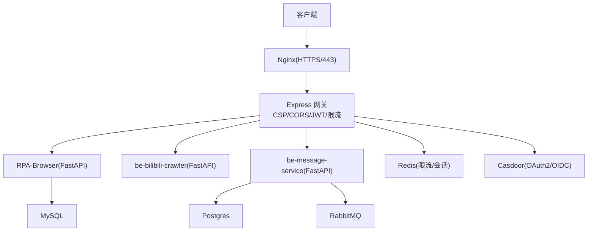
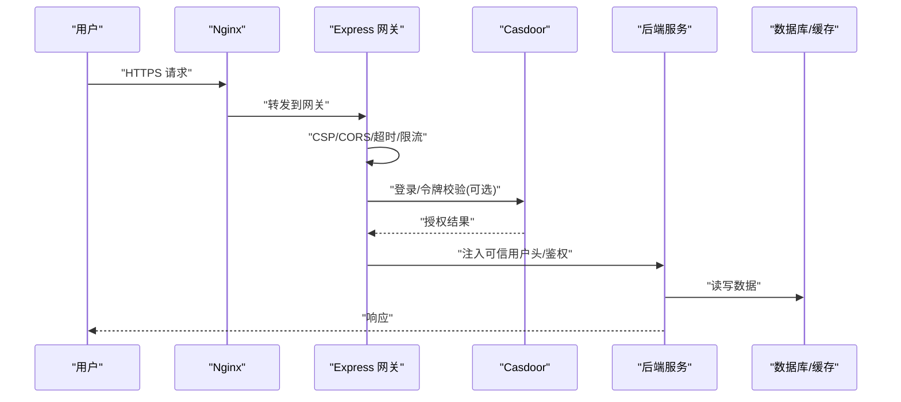
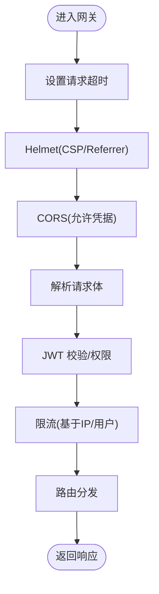
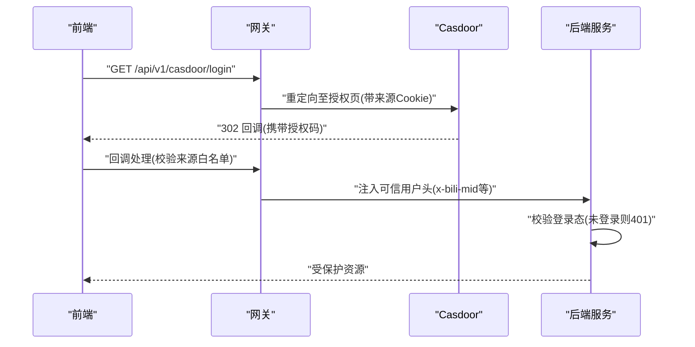
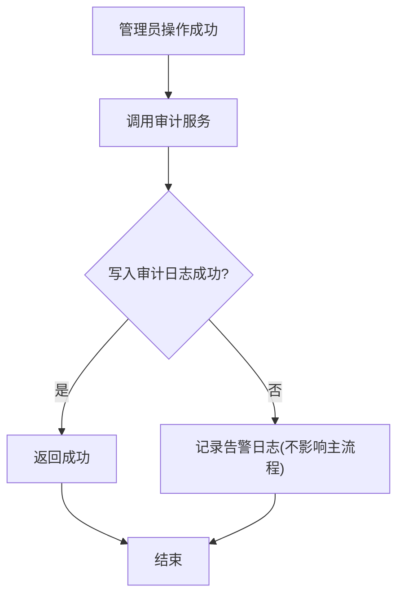
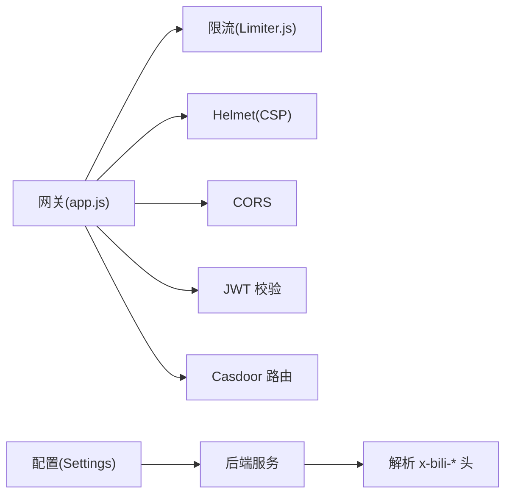

# 安全加固措施

<cite>
**本文引用的文件**
- [be-gateway/ExpressServerEnd/app.js](file://be-gateway/ExpressServerEnd/app.js)
- [be-gateway/ExpressServerEnd/MiddleWare/Limiter.js](file://be-gateway/ExpressServerEnd/MiddleWare/Limiter.js)
- [be-gateway/ExpressServerEnd/routes/casdoor.js](file://be-gateway/ExpressServerEnd/routes/casdoor.js)
- [RPA-Browser/app/config.py](file://RPA-Browser/app/config.py)
- [RPA-Browser/app/services/admin_audit.py](file://RPA-Browser/app/services/admin_audit.py)
- [RPA-Browser/app/controller/v1/admin/audit_router.py](file://RPA-Browser/app/controller/v1/admin/audit_router.py)
- [be-bilibili-crawler/Utils/网关/gateway_auth.py](file://be-bilibili-crawler/Utils/网关/gateway_auth.py)
- [be-message-service/app/core/config.py](file://be-message-service/app/core/config.py)
- [docker-compose.yml](file://docker-compose.yml)
</cite>

## 目录
1. [简介](#简介)
2. [项目结构](#项目结构)
3. [核心组件](#核心组件)
4. [架构总览](#架构总览)
5. [详细组件分析](#详细组件分析)
6. [依赖关系分析](#依赖关系分析)
7. [性能与安全权衡](#性能与安全权衡)
8. [故障排查指南](#故障排查指南)
9. [结论](#结论)
10. [附录](#附录)

## 简介
本指南面向本项目（多服务、前后端分离、容器化部署）的安全加固，覆盖网络安全配置、访问控制策略与数据安全防护。重点包括：
- 防火墙与反向代理（Nginx）安全基线、SSL/TLS 证书管理
- API 接口安全认证（JWT、Casdoor OAuth2）、跨域与请求头治理
- SQL 注入、XSS、CSRF 防护方案与落地建议
- 安全审计日志、入侵检测机制与安全事件响应流程
- 常见漏洞修复、安全配置检查清单与合规性要求

## 项目结构
本项目采用微服务架构，关键安全边界如下：
- 入口层：Nginx 作为反向代理与 TLS 终止点，统一暴露 80/443
- 网关层：Express 网关负责鉴权、限流、CORS、CSP、超时等
- 业务层：RPA-Browser、be-bilibili-crawler、be-message-service 等后端服务
- 数据层：MySQL、Postgres、Redis、RabbitMQ、Milvus 等
- 认证中心：Casdoor（OAuth2/OIDC）

**图示来源**
- [docker-compose.yml:357-371](file://docker-compose.yml#L357-L371)
- [be-gateway/ExpressServerEnd/app.js:82-111](file://be-gateway/ExpressServerEnd/app.js#L82-L111)
- [be-gateway/ExpressServerEnd/MiddleWare/Limiter.js:20-50](file://be-gateway/ExpressServerEnd/MiddleWare/Limiter.js#L20-L50)
- [be-gateway/ExpressServerEnd/routes/casdoor.js:31-67](file://be-gateway/ExpressServerEnd/routes/casdoor.js#L31-L67)

**章节来源**
- [docker-compose.yml:1-380](file://docker-compose.yml#L1-L380)
- [be-gateway/ExpressServerEnd/app.js:68-117](file://be-gateway/ExpressServerEnd/app.js#L68-L117)

## 核心组件
- 网关安全中间件：超时保护、CSP、CORS、JWT 校验、限流
- 认证集成：Casdoor 登录发起与回调、前端来源白名单校验
- 网关注入用户信息：后端通过可信请求头识别登录态
- 配置与密钥：JWT 算法/过期、消息服务 JWT Secret、Casdoor 证书
- 审计日志：管理员操作审计写入数据库，失败不阻断主流程
- 容器网络与端口：仅对外暴露必要端口，敏感服务内网互通

**章节来源**
- [be-gateway/ExpressServerEnd/app.js:82-111](file://be-gateway/ExpressServerEnd/app.js#L82-L111)
- [be-gateway/ExpressServerEnd/MiddleWare/Limiter.js:20-69](file://be-gateway/ExpressServerEnd/MiddleWare/Limiter.js#L20-L69)
- [be-gateway/ExpressServerEnd/routes/casdoor.js:31-67](file://be-gateway/ExpressServerEnd/routes/casdoor.js#L31-L67)
- [be-bilibili-crawler/Utils/网关/gateway_auth.py:26-122](file://be-bilibili-crawler/Utils/网关/gateway_auth.py#L26-L122)
- [RPA-Browser/app/config.py:140-174](file://RPA-Browser/app/config.py#L140-L174)
- [be-message-service/app/core/config.py:301-328](file://be-message-service/app/core/config.py#L301-L328)
- [RPA-Browser/app/services/admin_audit.py:1-43](file://RPA-Browser/app/services/admin_audit.py#L1-L43)

## 架构总览
下图展示从浏览器到后端的完整安全链路：Nginx 终止 HTTPS，网关进行 CSP/CORS/JWT/限流，Casdoor 负责身份认证，后端服务基于网关注入的可信头或内部鉴权逻辑处理请求，并记录审计日志。

**图示来源**
- [docker-compose.yml:357-371](file://docker-compose.yml#L357-L371)
- [be-gateway/ExpressServerEnd/app.js:82-111](file://be-gateway/ExpressServerEnd/app.js#L82-L111)
- [be-gateway/ExpressServerEnd/routes/casdoor.js:31-67](file://be-gateway/ExpressServerEnd/routes/casdoor.js#L31-L67)
- [be-bilibili-crawler/Utils/网关/gateway_auth.py:64-122](file://be-bilibili-crawler/Utils/网关/gateway_auth.py#L64-L122)

## 详细组件分析

### 网络安全与反代配置（Nginx + 网关）
- Nginx 作为 HTTPS 入口，挂载证书目录与配置文件，仅暴露 80/443/81
- 网关启用 Helmet 设置 CSP、Referrer-Policy；开启 CORS 允许携带凭证；设置请求超时
- 使用 express-rate-limit + Redis 实现分布式限流，支持自定义 key 生成与跳过策略
- 开发环境开启请求耗时日志便于排查

**图示来源**
- [be-gateway/ExpressServerEnd/app.js:82-111](file://be-gateway/ExpressServerEnd/app.js#L82-L111)
- [be-gateway/ExpressServerEnd/MiddleWare/Limiter.js:20-50](file://be-gateway/ExpressServerEnd/MiddleWare/Limiter.js#L20-L50)

**章节来源**
- [docker-compose.yml:357-371](file://docker-compose.yml#L357-L371)
- [be-gateway/ExpressServerEnd/app.js:68-117](file://be-gateway/ExpressServerEnd/app.js#L68-L117)
- [be-gateway/ExpressServerEnd/MiddleWare/Limiter.js:1-69](file://be-gateway/ExpressServerEnd/MiddleWare/Limiter.js#L1-L69)

### 访问控制与认证（JWT + Casdoor + 网关注入头）
- 网关侧使用 JWT 校验，结合 Casdoor 完成 OAuth2/OIDC 登录流程
- 登录发起时记录前端来源 Cookie，并在回调前校验 Origin 白名单，防止开放重定向
- 后端服务信任网关注入的 x-bili-* 请求头判断登录态，未登录直接拒绝
- RPA-Browser 与 message-service 均提供 JWT 相关配置项（算法、过期时间、Secret）

**图示来源**
- [be-gateway/ExpressServerEnd/routes/casdoor.js:31-67](file://be-gateway/ExpressServerEnd/routes/casdoor.js#L31-L67)
- [be-bilibili-crawler/Utils/网关/gateway_auth.py:64-122](file://be-bilibili-crawler/Utils/网关/gateway_auth.py#L64-L122)
- [RPA-Browser/app/config.py:140-174](file://RPA-Browser/app/config.py#L140-L174)
- [be-message-service/app/core/config.py:301-328](file://be-message-service/app/core/config.py#L301-L328)

**章节来源**
- [be-gateway/ExpressServerEnd/routes/casdoor.js:1-67](file://be-gateway/ExpressServerEnd/routes/casdoor.js#L1-L67)
- [be-bilibili-crawler/Utils/网关/gateway_auth.py:1-122](file://be-bilibili-crawler/Utils/网关/gateway_auth.py#L1-L122)
- [RPA-Browser/app/config.py:140-174](file://RPA-Browser/app/config.py#L140-L174)
- [be-message-service/app/core/config.py:301-328](file://be-message-service/app/core/config.py#L301-L328)

### 数据安全防护（SQL 注入/XSS/CSRF）
- SQL 注入防护
  - 所有数据库访问应使用参数化查询（ORM/预编译语句），禁止拼接用户输入
  - 对输入进行严格类型校验与长度限制，最小权限原则配置数据库账号
  - 建议引入输入校验框架（如 Pydantic/JSON Schema）在入口处过滤非法值
- XSS 防护
  - 网关已启用 Helmet CSP，限制脚本/样式/媒体等资源来源
  - 前端渲染需对用户输入进行转义，避免插入不可信 HTML
  - 对富文本内容采用白名单过滤（如 DOMPurify）后再输出
- CSRF 防护
  - 若使用 Cookie 传递 Token，确保 SameSite=Strict/Lax、HttpOnly、Secure
  - 对状态变更接口增加 CSRF Token 校验或使用双提交 Cookie 模式
  - 网关 CORS 已允许凭据，需配合严格的 Referer/Origin 校验

[本节为通用安全实践说明，不直接引用具体代码文件]

### 安全审计日志与事件响应
- 管理员操作审计：成功执行后异步写入审计表，失败仅告警不影响主流程
- 审计字段包含操作者、动作类型、目标类型/ID、详情与时间戳
- 审计查询支持按动作、目标类型、管理员 ID 分页检索
- 建议将审计日志同步至集中式日志系统（如 ELK/Splunk），并建立告警规则

**图示来源**
- [RPA-Browser/app/services/admin_audit.py:13-43](file://RPA-Browser/app/services/admin_audit.py#L13-L43)
- [RPA-Browser/app/controller/v1/admin/audit_router.py:68-93](file://RPA-Browser/app/controller/v1/admin/audit_router.py#L68-L93)

**章节来源**
- [RPA-Browser/app/services/admin_audit.py:1-43](file://RPA-Browser/app/services/admin_audit.py#L1-L43)
- [RPA-Browser/app/controller/v1/admin/audit_router.py:68-93](file://RPA-Browser/app/controller/v1/admin/audit_router.py#L68-L93)

### SSL/TLS 证书管理与合规
- Nginx 挂载证书目录与配置文件，生产环境强制 HTTPS
- 建议使用自动化证书管理（如 Let’s Encrypt/Certbot）定期续期
- 禁用弱加密套件与过时协议（TLS1.0/1.1），启用 HSTS、OCSP Stapling
- 对敏感配置（JWT Secret、Casdoor 证书）使用环境变量或密钥管理服务

[本节为通用安全实践说明，不直接引用具体代码文件]

## 依赖关系分析
- 网关依赖：express-rate-limit、helmet、cors、body-parser、jwt 校验中间件
- 认证依赖：Casdoor（OAuth2/OIDC），用于统一身份认证与回调
- 后端依赖：网关注入的可信用户头（x-bili-*），用于快速判定登录态
- 配置依赖：各服务的 Settings/BaseSettings 读取环境变量，集中管理密钥与开关

**图示来源**
- [be-gateway/ExpressServerEnd/app.js:82-111](file://be-gateway/ExpressServerEnd/app.js#L82-L111)
- [be-gateway/ExpressServerEnd/MiddleWare/Limiter.js:20-50](file://be-gateway/ExpressServerEnd/MiddleWare/Limiter.js#L20-L50)
- [be-gateway/ExpressServerEnd/routes/casdoor.js:31-67](file://be-gateway/ExpressServerEnd/routes/casdoor.js#L31-L67)
- [be-bilibili-crawler/Utils/网关/gateway_auth.py:64-122](file://be-bilibili-crawler/Utils/网关/gateway_auth.py#L64-L122)
- [RPA-Browser/app/config.py:140-174](file://RPA-Browser/app/config.py#L140-L174)
- [be-message-service/app/core/config.py:301-328](file://be-message-service/app/core/config.py#L301-L328)

**章节来源**
- [be-gateway/ExpressServerEnd/app.js:68-117](file://be-gateway/ExpressServerEnd/app.js#L68-L117)
- [be-gateway/ExpressServerEnd/MiddleWare/Limiter.js:1-69](file://be-gateway/ExpressServerEnd/MiddleWare/Limiter.js#L1-L69)
- [be-gateway/ExpressServerEnd/routes/casdoor.js:1-67](file://be-gateway/ExpressServerEnd/routes/casdoor.js#L1-L67)
- [be-bilibili-crawler/Utils/网关/gateway_auth.py:1-122](file://be-bilibili-crawler/Utils/网关/gateway_auth.py#L1-L122)
- [RPA-Browser/app/config.py:140-174](file://RPA-Browser/app/config.py#L140-L174)
- [be-message-service/app/core/config.py:301-328](file://be-message-service/app/core/config.py#L301-L328)

## 性能与安全权衡
- 限流策略：基于 Redis 的分布式限流可防刷，但需合理设置窗口与阈值，避免误伤正常流量
- CSP 策略：严格 CSP 可防 XSS，但可能影响第三方脚本加载，需按需放宽并记录违规报告
- CORS 配置：允许凭据提升用户体验，但必须严格限制 origin，避免跨站泄露
- 审计日志：异步写入降低主流程延迟，但需考虑存储容量与归档策略

[本节为通用性能与安全讨论，不直接引用具体代码文件]

## 故障排查指南
- 网关 401/403：检查 JWT 是否有效、CORS 是否放行、限流是否触发
- 登录回调异常：确认 Casdoor 配置、前端来源白名单、Cookie 是否正确设置
- 审计日志缺失：检查数据库连接、写入异常告警、事务提交是否成功
- 数据库连接池过大：参考 message-service 配置中的防御逻辑，避免 pool_size + max_overflow 超限

**章节来源**
- [be-gateway/ExpressServerEnd/MiddleWare/Limiter.js:53-69](file://be-gateway/ExpressServerEnd/MiddleWare/Limiter.js#L53-L69)
- [be-gateway/ExpressServerEnd/routes/casdoor.js:31-67](file://be-gateway/ExpressServerEnd/routes/casdoor.js#L31-L67)
- [RPA-Browser/app/services/admin_audit.py:29-43](file://RPA-Browser/app/services/admin_audit.py#L29-L43)
- [be-message-service/app/core/config.py:351-360](file://be-message-service/app/core/config.py#L351-L360)

## 结论
本项目已在网关层实现了基础的安全能力（CSP、CORS、JWT、限流、超时），并通过 Casdoor 统一认证。后端服务依赖网关注入的可信头进行鉴权，具备较好的解耦性与安全性。建议进一步：
- 强化 Nginx 安全基线与证书管理
- 完善输入校验与输出编码，落实 SQL 注入/XSS/CSRF 防护
- 建立集中式审计日志与告警体系，完善事件响应流程
- 定期进行安全扫描与渗透测试，持续改进

[本节为总结性内容，不直接引用具体代码文件]

## 附录
- 安全配置检查清单
  - 是否启用 HTTPS 且证书有效
  - 是否配置 CSP 与 Referrer-Policy
  - 是否启用 CORS 并限制 origin
  - 是否启用限流与请求超时
  - 是否使用参数化查询与输入校验
  - 是否对敏感配置使用环境变量/密钥管理
  - 是否记录并归档审计日志
  - 是否定期更新依赖与补丁

[本节为通用实践清单，不直接引用具体代码文件]