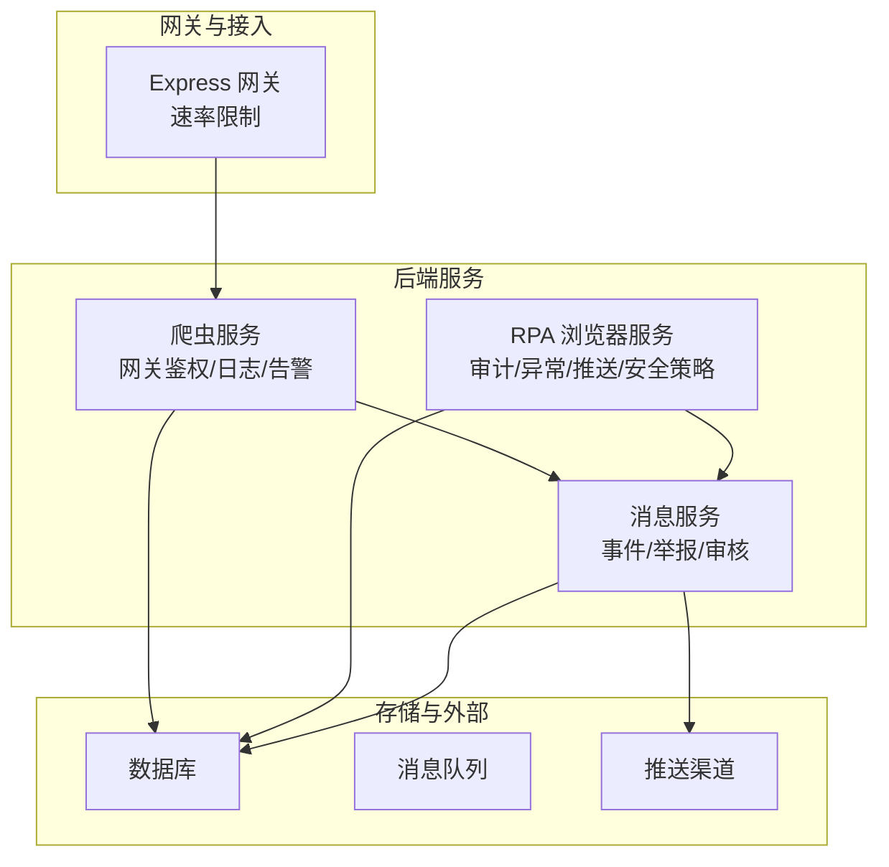
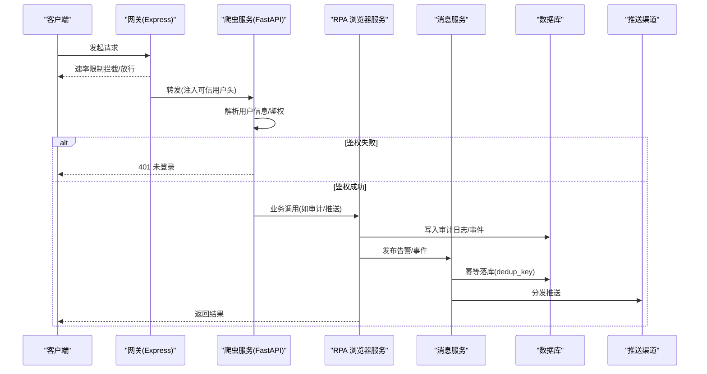
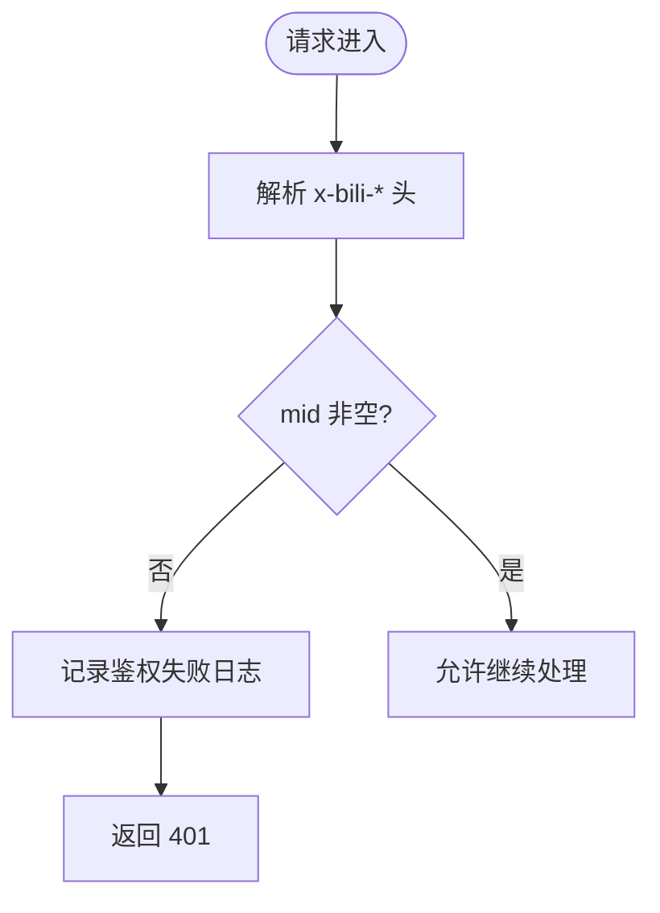
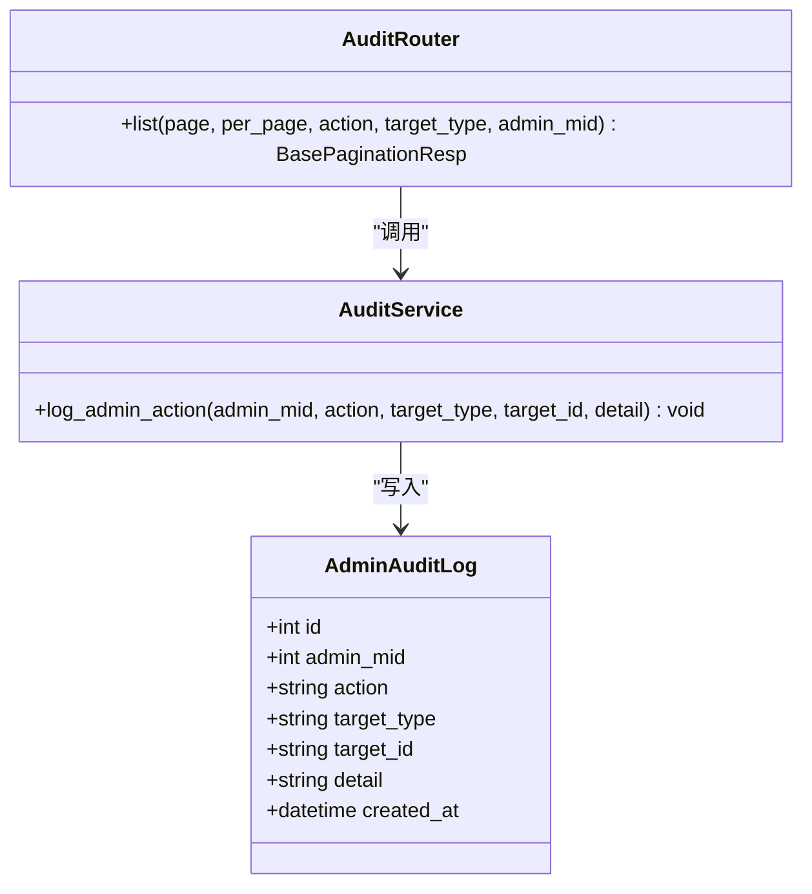
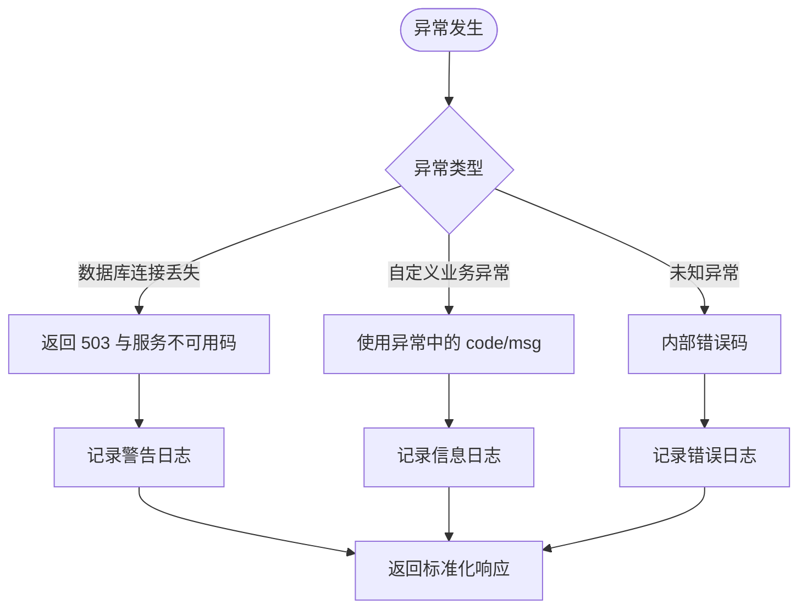
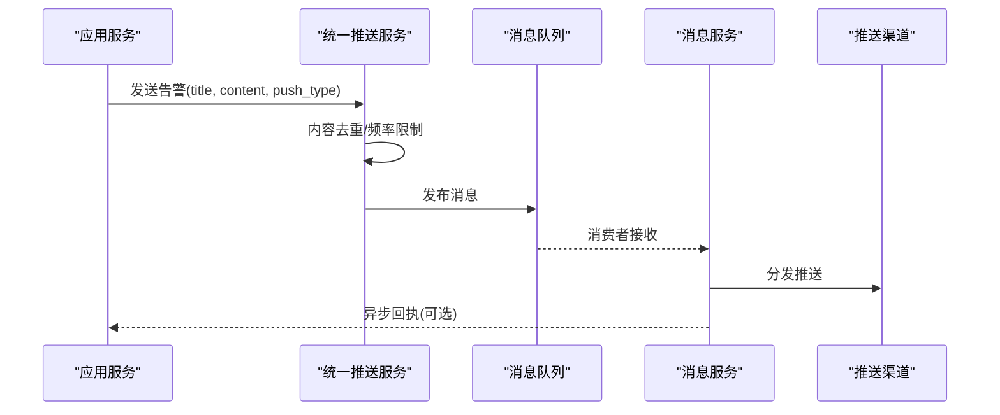
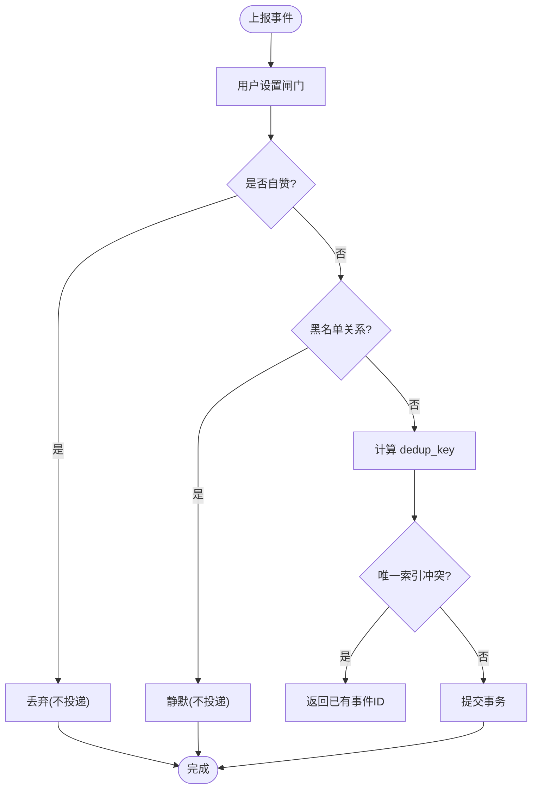
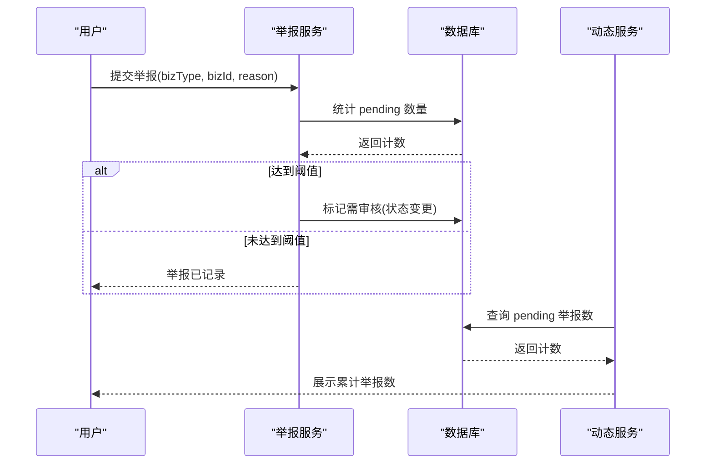
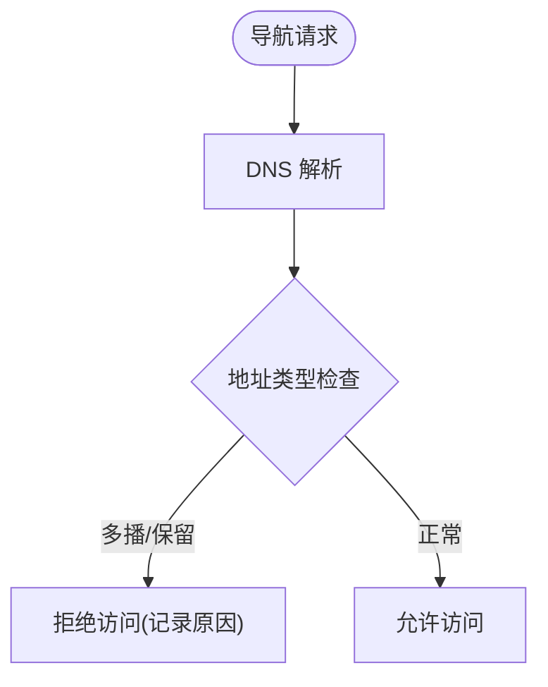
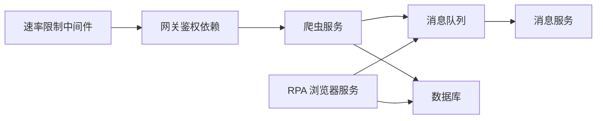

# 安全监控与审计

<cite>
**本文引用的文件**
- [RPA-Browser/app/controller/v1/admin/audit_router.py](file://RPA-Browser/app/controller/v1/admin/audit_router.py)
- [RPA-Browser/app/services/admin_audit.py](file://RPA-Browser/app/services/admin_audit.py)
- [RPA-Browser/app/models/database/admin/models.py](file://RPA-Browser/app/models/database/admin/models.py)
- [RPA-Browser/app/exceptions/handlers.py](file://RPA-Browser/app/exceptions/handlers.py)
- [be-bilibili-crawler/Utils/网关/gateway_auth.py](file://be-bilibili-crawler/Utils/网关/gateway_auth.py)
- [be-bilibili-crawler/log/base_log.py](file://be-bilibili-crawler/log/base_log.py)
- [be-bilibili-crawler/controller/common/CommonRouter.py](file://be-bilibili-crawler/controller/common/CommonRouter.py)
- [be-message-service/app/services/message/insite/events/base.py](file://be-message-service/app/services/message/insite/events/base.py)
- [be-message-service/app/services/moment/moment_feed.py](file://be-message-service/app/services/moment/moment_feed.py)
- [be-message-service/app/services/admin/report.py](file://be-message-service/app/services/admin/report.py)
- [be-message-service/tests/test_report.py](file://be-message-service/tests/test_report.py)
- [RPA-Browser/app/models/core/browser/security.py](file://RPA-Browser/app/models/core/browser/security.py)
- [RPA-Browser/app/services/execution/actions/navigation.py](file://RPA-Browser/app/services/execution/actions/navigation.py)
- [RPA-Browser/app/services/message/push_msg.py](file://RPA-Browser/app/services/message/push_msg.py)
- [be-gateway/ExpressServerEnd/MiddleWare/Limiter.js](file://be-gateway/ExpressServerEnd/MiddleWare/Limiter.js)
</cite>

## 目录
1. [简介](#简介)
2. [项目结构](#项目结构)
3. [核心组件](#核心组件)
4. [架构总览](#架构总览)
5. [详细组件分析](#详细组件分析)
6. [依赖关系分析](#依赖关系分析)
7. [性能考量](#性能考量)
8. [故障排查指南](#故障排查指南)
9. [结论](#结论)
10. [附录](#附录)

## 简介
本文件面向“安全监控与审计”目标，系统化梳理本项目在以下方面的实现与能力：
- 安全日志记录：统一日志框架、分类日志、错误日志归档与轮转。
- 异常行为检测：登录态校验、访问控制、浏览器导航安全策略、举报阈值联动。
- 安全事件告警：消息队列驱动的推送链路、限流去重、测试告警接口。
- 审计追踪机制：管理员操作审计、资源审核审计、举报处理审计。
- 指标收集与安全态势感知：通过事件聚合、举报计数、系统健康检查等维度形成可观测性。
- 安全事件响应与合规报告：基于审计日志与审核队列的闭环处置与查询。

## 项目结构
围绕安全与审计的关键代码分布在多个服务中：
- RPA-Browser：提供管理员操作审计日志写入与查询、全局异常处理、浏览器导航安全检查、统一推送消息封装。
- be-bilibili-crawler：提供网关注入的用户鉴权依赖、统一日志工厂、测试告警接口（通过消息队列触发 message-service）。
- be-message-service：提供事件上报幂等落库、举报阈值判定与审核队列联动、动态举报数聚合展示。
- be-gateway：提供速率限制中间件，作为前端入口的安全防护层。

图表来源
- [be-gateway/ExpressServerEnd/MiddleWare/Limiter.js:1-35](file://be-gateway/ExpressServerEnd/MiddleWare/Limiter.js#L1-L35)
- [be-bilibili-crawler/Utils/网关/gateway_auth.py:1-122](file://be-bilibili-crawler/Utils/网关/gateway_auth.py#L1-L122)
- [RPA-Browser/app/controller/v1/admin/audit_router.py:1-93](file://RPA-Browser/app/controller/v1/admin/audit_router.py#L1-L93)
- [be-message-service/app/services/message/insite/events/base.py:295-438](file://be-message-service/app/services/message/insite/events/base.py#L295-L438)

章节来源
- [be-gateway/ExpressServerEnd/MiddleWare/Limiter.js:1-35](file://be-gateway/ExpressServerEnd/MiddleWare/Limiter.js#L1-L35)
- [be-bilibili-crawler/Utils/网关/gateway_auth.py:1-122](file://be-bilibili-crawler/Utils/网关/gateway_auth.py#L1-L122)
- [RPA-Browser/app/controller/v1/admin/audit_router.py:1-93](file://RPA-Browser/app/controller/v1/admin/audit_router.py#L1-L93)
- [be-message-service/app/services/message/insite/events/base.py:295-438](file://be-message-service/app/services/message/insite/events/base.py#L295-L438)

## 核心组件
- 网关注册用户信息校验：从可信请求头解析用户身份，未登录拒绝访问并记录告警日志。
- 管理员操作审计：成功治理操作后写入审计表，提供分页查询接口用于后台审计界面。
- 全局异常处理：区分数据库连接丢失、自定义业务异常与未知异常，输出结构化错误与日志。
- 事件上报与幂等：事件写路径包含设置闸门、自赞过滤、黑名单静默、去重键唯一索引落库。
- 举报阈值联动：达到阈值时加入审核队列，不直接下架资源，由管理员在队列中决定处置。
- 浏览器导航安全：DNS 解析与地址段检查，阻止多播/保留地址访问。
- 统一推送与限流：通过消息队列将告警分发至 message-service，内置内容去重与频率限制。

章节来源
- [be-bilibili-crawler/Utils/网关/gateway_auth.py:88-122](file://be-bilibili-crawler/Utils/网关/gateway_auth.py#L88-L122)
- [RPA-Browser/app/services/admin_audit.py:13-43](file://RPA-Browser/app/services/admin_audit.py#L13-L43)
- [RPA-Browser/app/exceptions/handlers.py:70-147](file://RPA-Browser/app/exceptions/handlers.py#L70-L147)
- [be-message-service/app/services/message/insite/events/base.py:376-438](file://be-message-service/app/services/message/insite/events/base.py#L376-L438)
- [be-message-service/app/services/admin/report.py:233-255](file://be-message-service/app/services/admin/report.py#L233-L255)
- [RPA-Browser/app/services/execution/actions/navigation.py:68-96](file://RPA-Browser/app/services/execution/actions/navigation.py#L68-L96)
- [be-bilibili-crawler/controller/common/CommonRouter.py:67-94](file://be-bilibili-crawler/controller/common/CommonRouter.py#L67-L94)

## 架构总览
安全监控与审计的整体流程如下：
- 接入层：网关进行速率限制与请求预处理；后端服务通过网关注入的可信用户头完成鉴权。
- 业务层：管理员治理操作成功后调用审计服务写入审计日志；异常统一捕获并记录；浏览器导航执行前进行安全检查。
- 事件与告警：用户互动或系统异常通过消息队列投递到 message-service，进行幂等落库与后续分发；告警经限流去重后统一推送。
- 数据层：审计日志、事件明细、举报记录持久化至数据库，支持分页查询与聚合统计。

图表来源
- [be-gateway/ExpressServerEnd/MiddleWare/Limiter.js:1-35](file://be-gateway/ExpressServerEnd/MiddleWare/Limiter.js#L1-L35)
- [be-bilibili-crawler/Utils/网关/gateway_auth.py:88-122](file://be-bilibili-crawler/Utils/网关/gateway_auth.py#L88-L122)
- [RPA-Browser/app/services/admin_audit.py:13-43](file://RPA-Browser/app/services/admin_audit.py#L13-L43)
- [be-message-service/app/services/message/insite/events/base.py:376-438](file://be-message-service/app/services/message/insite/events/base.py#L376-L438)

## 详细组件分析

### 登录审计与访问控制
- 网关注入可信用户信息头，后端依赖函数校验登录态，未登录记录警告日志并返回 401。
- 该机制确保所有受保护接口具备统一的登录态校验，避免伪造头绕过。

图表来源
- [be-bilibili-crawler/Utils/网关/gateway_auth.py:64-122](file://be-bilibili-crawler/Utils/网关/gateway_auth.py#L64-L122)

章节来源
- [be-bilibili-crawler/Utils/网关/gateway_auth.py:88-122](file://be-bilibili-crawler/Utils/网关/gateway_auth.py#L88-L122)

### 管理员操作审计
- 审计写入：治理操作成功后调用审计服务写入 admin_audit_log，字段包括操作者 mid、动作类型、目标类型与 ID、详情与时间戳。
- 审计查询：提供分页查询接口，支持按 action、target_type、admin_mid 筛选，便于后台审计界面展示。
- 容错设计：审计写入失败仅告警，不影响主业务流程。

图表来源
- [RPA-Browser/app/models/database/admin/models.py:114-132](file://RPA-Browser/app/models/database/admin/models.py#L114-L132)
- [RPA-Browser/app/services/admin_audit.py:13-43](file://RPA-Browser/app/services/admin_audit.py#L13-L43)
- [RPA-Browser/app/controller/v1/admin/audit_router.py:19-93](file://RPA-Browser/app/controller/v1/admin/audit_router.py#L19-L93)

章节来源
- [RPA-Browser/app/services/admin_audit.py:13-43](file://RPA-Browser/app/services/admin_audit.py#L13-L43)
- [RPA-Browser/app/controller/v1/admin/audit_router.py:68-93](file://RPA-Browser/app/controller/v1/admin/audit_router.py#L68-L93)
- [RPA-Browser/app/models/database/admin/models.py:114-132](file://RPA-Browser/app/models/database/admin/models.py#L114-L132)

### API 调用审计与异常处理
- 全局异常处理器对数据库连接丢失、自定义业务异常与未知异常进行分类处理，生成错误 ID 并记录堆栈。
- 开发模式下可在响应体中附带错误详情，生产模式仅返回必要信息。

图表来源
- [RPA-Browser/app/exceptions/handlers.py:70-147](file://RPA-Browser/app/exceptions/handlers.py#L70-L147)

章节来源
- [RPA-Browser/app/exceptions/handlers.py:70-147](file://RPA-Browser/app/exceptions/handlers.py#L70-L147)

### 安全事件告警与消息链路
- 告警发布：通过 publish_message 将告警投递到消息队列，绕过第三方推送限流，保证每次测试告警可靠触发。
- 推送限流与去重：统一推送服务维护内容去重集合与最近推送时间，防止短时间大量推送打爆渠道。
- 主题标识：推送标题采用主题前缀，便于区分信息、成功、警告、失败等告警性质。

图表来源
- [be-bilibili-crawler/controller/common/CommonRouter.py:67-94](file://be-bilibili-crawler/controller/common/CommonRouter.py#L67-L94)
- [RPA-Browser/app/services/message/push_msg.py:23-53](file://RPA-Browser/app/services/message/push_msg.py#L23-L53)
- [be-bilibili-crawler/Utils/推送/PushMe.py:116-136](file://be-bilibili-crawler/Utils/推送/PushMe.py#L116-L136)

章节来源
- [be-bilibili-crawler/controller/common/CommonRouter.py:67-94](file://be-bilibili-crawler/controller/common/CommonRouter.py#L67-L94)
- [RPA-Browser/app/services/message/push_msg.py:23-53](file://RPA-Browser/app/services/message/push_msg.py#L23-L53)
- [be-bilibili-crawler/Utils/推送/PushMe.py:116-136](file://be-bilibili-crawler/Utils/推送/PushMe.py#L116-L136)

### 事件上报与幂等落库
- 写路径：先过用户设置闸门、自赞过滤、黑名单静默，再计算 dedup_key 进行唯一索引落库，重复上报直接返回既有事件。
- 读路径：支持聚合与明细查询，批量回捞资源快照与评论楼层关系，构建 msgfeed 内容。

图表来源
- [be-message-service/app/services/message/insite/events/base.py:376-438](file://be-message-service/app/services/message/insite/events/base.py#L376-L438)

章节来源
- [be-message-service/app/services/message/insite/events/base.py:376-438](file://be-message-service/app/services/message/insite/events/base.py#L376-L438)

### 举报阈值联动与审核队列
- 阈值判定：按 (bizType, bizId) 统计 pending 举报数，达到配置阈值则标记为需审核（不直接下架资源）。
- 审核队列：管理端举报列表即审核队列，按 status 过滤待处理项；是否下架由管理员在举报审核中决定。
- 动态展示：动态 feed 中聚合 pending 举报数，供前端展示“已积累 N 次举报”。

图表来源
- [be-message-service/app/services/admin/report.py:233-255](file://be-message-service/app/services/admin/report.py#L233-L255)
- [be-message-service/app/services/moment/moment_feed.py:912-930](file://be-message-service/app/services/moment/moment_feed.py#L912-L930)
- [be-message-service/tests/test_report.py:579-607](file://be-message-service/tests/test_report.py#L579-L607)

章节来源
- [be-message-service/app/services/admin/report.py:233-255](file://be-message-service/app/services/admin/report.py#L233-L255)
- [be-message-service/app/services/moment/moment_feed.py:912-930](file://be-message-service/app/services/moment/moment_feed.py#L912-L930)
- [be-message-service/tests/test_report.py:579-607](file://be-message-service/tests/test_report.py#L579-L607)

### 浏览器导航安全策略
- 安全检查：解析域名后进行 DNS 解析，检查是否为多播或保留地址，禁止访问并返回拒绝原因。
- 模型定义：SecurityCheckResult 表示是否允许访问及原因，便于上层统一处理。

图表来源
- [RPA-Browser/app/models/core/browser/security.py:7-10](file://RPA-Browser/app/models/core/browser/security.py#L7-L10)
- [RPA-Browser/app/services/execution/actions/navigation.py:68-96](file://RPA-Browser/app/services/execution/actions/navigation.py#L68-L96)

章节来源
- [RPA-Browser/app/models/core/browser/security.py:7-10](file://RPA-Browser/app/models/core/browser/security.py#L7-L10)
- [RPA-Browser/app/services/execution/actions/navigation.py:68-96](file://RPA-Browser/app/services/execution/actions/navigation.py#L68-L96)

### 日志体系与指标收集
- 日志工厂：按模块创建独立 Logger，支持异步写入、文件轮转与压缩、保留周期，便于集中采集与分析。
- 指标维度：通过事件聚合、举报计数、系统健康检查等形成可观测性指标，支撑安全态势感知。

章节来源
- [be-bilibili-crawler/log/base_log.py:44-96](file://be-bilibili-crawler/log/base_log.py#L44-L96)
- [RPA-Browser/app/models/runtime/control.py:344-351](file://RPA-Browser/app/models/runtime/control.py#L344-L351)

## 依赖关系分析
- 网关依赖速率限制中间件，作为第一道安全防线。
- 爬虫服务依赖网关注入的可信用户头进行鉴权，并通过消息队列与 message-service 交互。
- RPA 浏览器服务依赖数据库写入审计日志，依赖消息队列发布告警。
- message-service 依赖数据库进行事件与举报记录的幂等落库与查询。

图表来源
- [be-gateway/ExpressServerEnd/MiddleWare/Limiter.js:1-35](file://be-gateway/ExpressServerEnd/MiddleWare/Limiter.js#L1-L35)
- [be-bilibili-crawler/Utils/网关/gateway_auth.py:88-122](file://be-bilibili-crawler/Utils/网关/gateway_auth.py#L88-L122)
- [RPA-Browser/app/services/admin_audit.py:13-43](file://RPA-Browser/app/services/admin_audit.py#L13-L43)
- [be-message-service/app/services/message/insite/events/base.py:376-438](file://be-message-service/app/services/message/insite/events/base.py#L376-L438)

章节来源
- [be-gateway/ExpressServerEnd/MiddleWare/Limiter.js:1-35](file://be-gateway/ExpressServerEnd/MiddleWare/Limiter.js#L1-L35)
- [be-bilibili-crawler/Utils/网关/gateway_auth.py:88-122](file://be-bilibili-crawler/Utils/网关/gateway_auth.py#L88-L122)
- [RPA-Browser/app/services/admin_audit.py:13-43](file://RPA-Browser/app/services/admin_audit.py#L13-L43)
- [be-message-service/app/services/message/insite/events/base.py:376-438](file://be-message-service/app/services/message/insite/events/base.py#L376-L438)

## 性能考量
- 幂等落库：通过 dedup_key 唯一索引避免重复上报，减少冗余写入与下游压力。
- 批量回捞：msgfeed 构建时对资源快照、评论索引等进行批量回捞，降低多次查询开销。
- 推送限流与去重：统一推送服务维护内容去重集合与最近推送时间，防止短时间大量推送打爆渠道。
- 日志轮转：按文件大小轮转与压缩，保留固定周期，平衡存储成本与可追溯性。

[本节为通用指导，无需特定文件引用]

## 故障排查指南
- 登录态校验失败：检查网关注入的 x-bili-* 头是否正确，确认 require_gateway_login 是否被正确依赖。
- 审计写入失败：查看审计服务日志，确认数据库会话与权限；审计失败不应阻断主流程。
- 事件上报重复：检查 dedup_key 计算逻辑与唯一索引，确认上游是否存在重复投递。
- 举报阈值未生效：核对 pending 举报计数逻辑与配置阈值，确认管理端审核队列状态。
- 推送告警未到达：检查推送限流与去重逻辑，确认消息队列消费者是否正常消费。

章节来源
- [be-bilibili-crawler/Utils/网关/gateway_auth.py:88-122](file://be-bilibili-crawler/Utils/网关/gateway_auth.py#L88-L122)
- [RPA-Browser/app/services/admin_audit.py:13-43](file://RPA-Browser/app/services/admin_audit.py#L13-L43)
- [be-message-service/app/services/message/insite/events/base.py:376-438](file://be-message-service/app/services/message/insite/events/base.py#L376-L438)
- [be-message-service/app/services/admin/report.py:233-255](file://be-message-service/app/services/admin/report.py#L233-L255)
- [be-bilibili-crawler/Utils/推送/PushMe.py:116-136](file://be-bilibili-crawler/Utils/推送/PushMe.py#L116-L136)

## 结论
本项目在安全监控与审计方面形成了较为完整的闭环：
- 接入层通过速率限制与可信用户头注入保障基础安全。
- 业务层提供管理员操作审计、异常统一处理与浏览器导航安全检查。
- 事件与告警通过消息队列与统一推送服务实现可靠分发与限流去重。
- 数据层以幂等落库与聚合查询支撑可观测性与合规审计。
建议持续完善威胁情报分析与自动化响应策略，结合日志与指标构建更强大的安全态势感知平台。

[本节为总结性内容，无需特定文件引用]

## 附录
- 关键模型与接口路径参考：
  - 管理员操作审计日志模型：AdminAuditLog
  - 审计日志查询接口：/api/admin/audit（示例）
  - 事件上报与幂等：BaseEvent.report
  - 举报阈值判定：ReportService._check_threshold
  - 动态举报数聚合：moment_feed 中的 pending 计数

[本节为补充说明，无需特定文件引用]