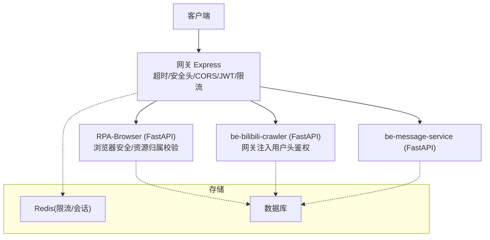
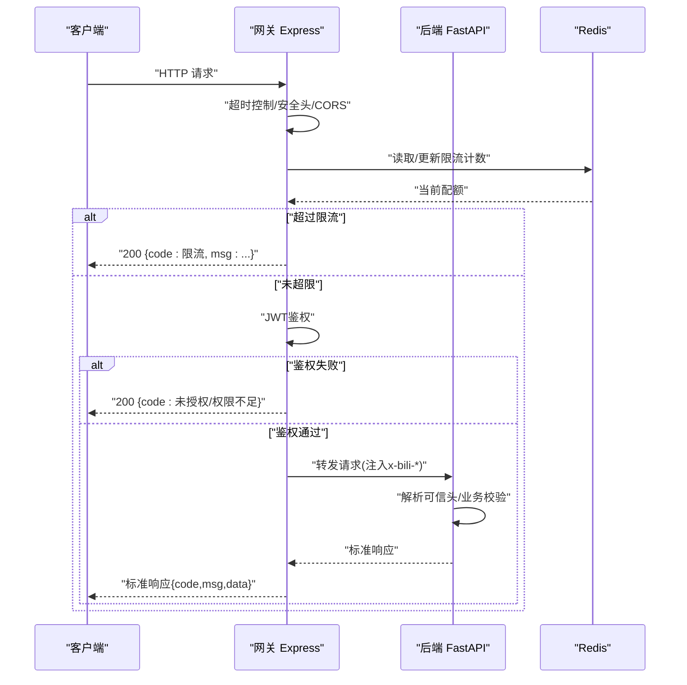
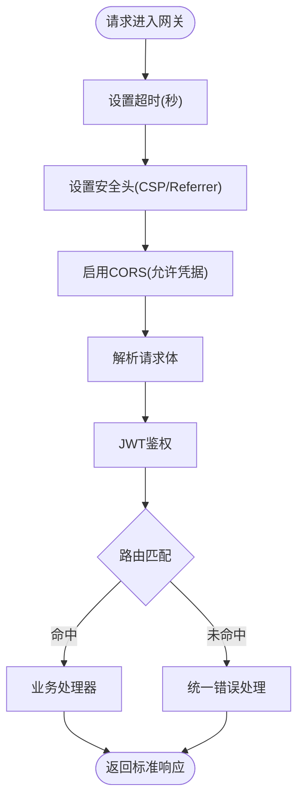
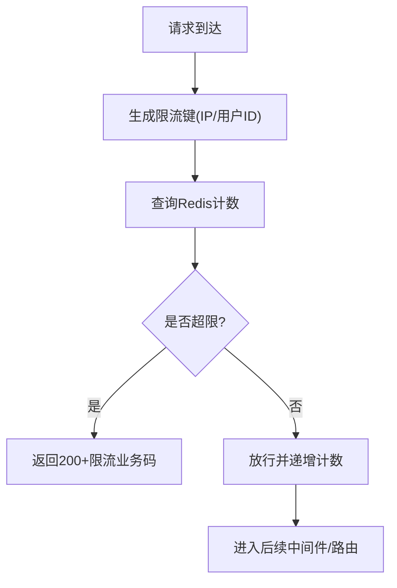
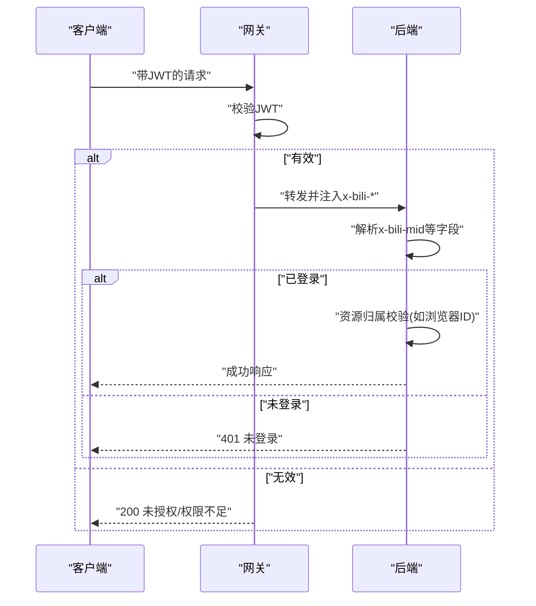
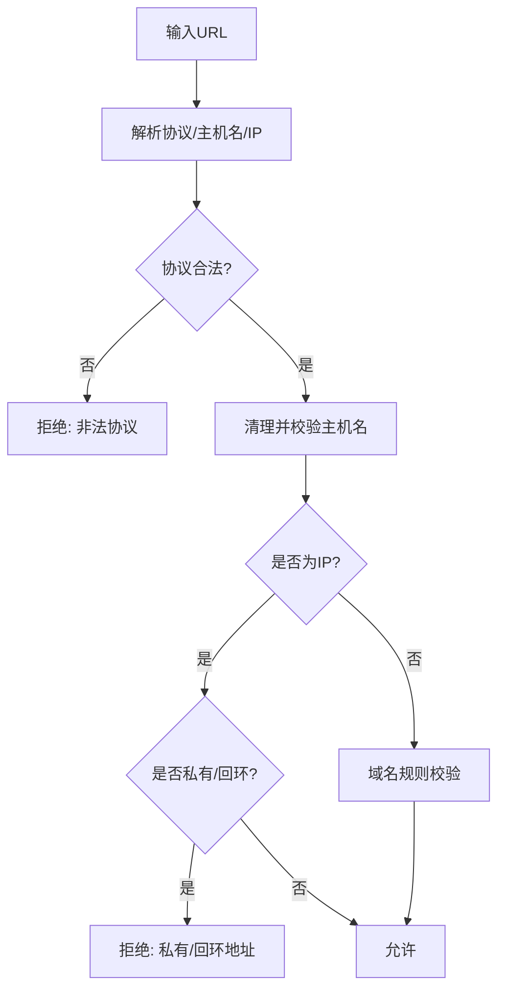
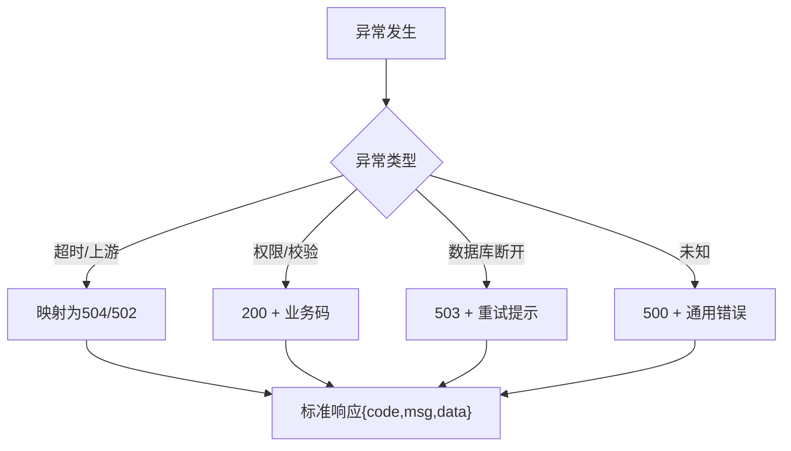
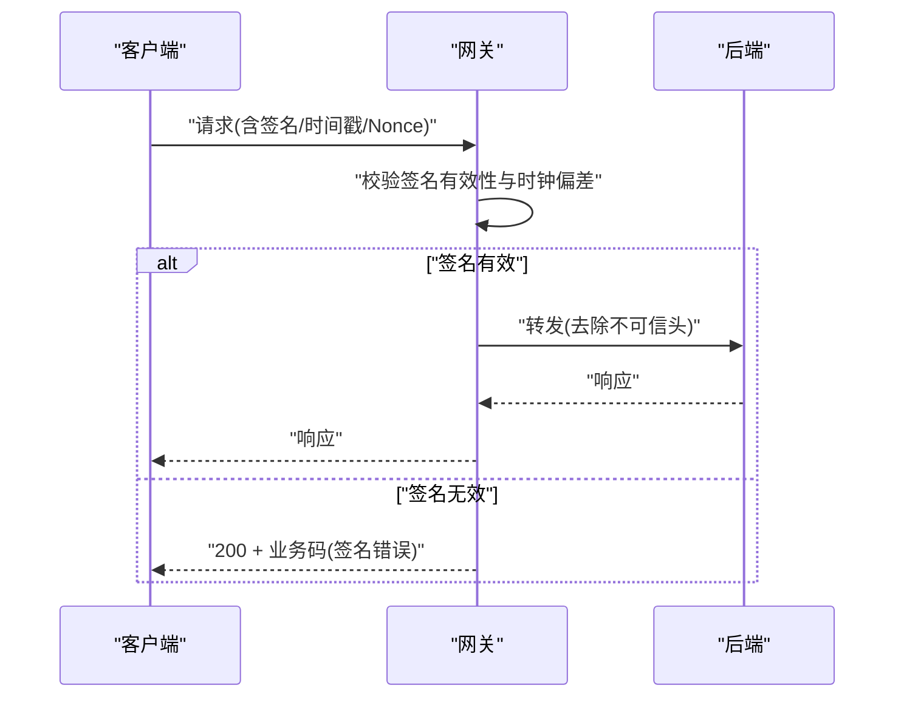
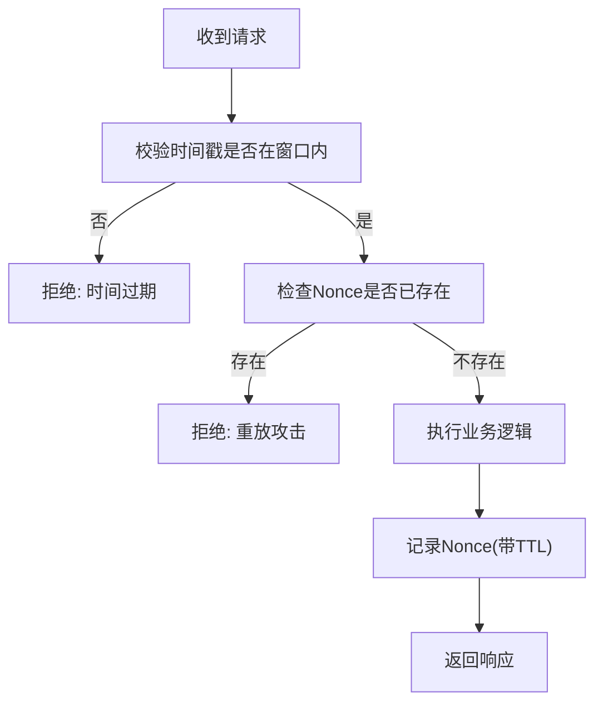
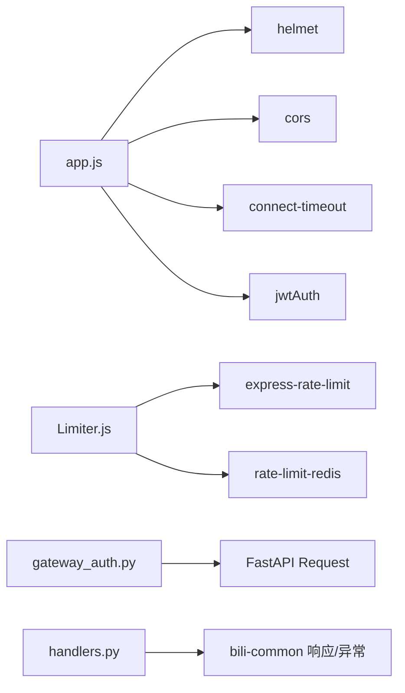

# API接口安全

<cite>
**本文引用的文件**
- [app.js](file://be-gateway/ExpressServerEnd/app.js)
- [Limiter.js](file://be-gateway/ExpressServerEnd/MiddleWare/Limiter.js)
- [casdoor.js](file://be-gateway/ExpressServerEnd/routes/casdoor.js)
- [gateway_auth.py](file://be-bilibili-crawler/Utils/网关/gateway_auth.py)
- [handlers.py](file://RPA-Browser/app/exceptions/handlers.py)
- [security_depends.py](file://RPA-Browser/app/utils/depends/security_depends.py)
- [security.py](file://RPA-Browser/app/models/core/browser/security.py)
- [response-code-design.md](file://docs/_archive/response-code-design.md)
</cite>

## 目录
1. [简介](#简介)
2. [项目结构](#项目结构)
3. [核心组件](#核心组件)
4. [架构总览](#架构总览)
5. [详细组件分析](#详细组件分析)
6. [依赖关系分析](#依赖关系分析)
7. [性能与限流](#性能与限流)
8. [故障排查指南](#故障排查指南)
9. [结论](#结论)
10. [附录](#附录)

## 简介
本安全文档围绕API接口的请求限流、防重放攻击、CORS配置与安全头设置、API版本管理、请求签名验证、IP白名单与速率限制机制展开，结合网关层（Express）与后端服务（FastAPI/RPA-Browser、be-bilibili-crawler）的实际实现，提供可落地的安全中间件配置、异常处理与安全响应格式规范，并给出DDoS防护、接口滥用检测与敏感信息泄露防护的落地建议。

## 项目结构
本项目采用“网关 + 多后端”的分层架构：
- 网关层（be-gateway/ExpressServerEnd）：统一入口，负责超时控制、安全头（Helmet）、跨域（CORS）、JWT鉴权、限流（express-rate-limit + Redis）、错误码映射与统一响应。
- 业务后端（RPA-Browser、be-bilibili-crawler、be-message-service）：基于FastAPI，通过网关注入的可信用户头进行鉴权，并提供统一的异常处理与标准响应体。
- 浏览器安全（RPA-Browser）：对浏览器访问目标URL进行协议、主机名、私有地址等安全检查，防止SSRF与内网探测。

图示来源
- [app.js:82-117](file://be-gateway/ExpressServerEnd/app.js#L82-L117)
- [Limiter.js:20-51](file://be-gateway/ExpressServerEnd/MiddleWare/Limiter.js#L20-L51)
- [gateway_auth.py:64-122](file://be-bilibili-crawler/Utils/网关/gateway_auth.py#L64-L122)

章节来源
- [app.js:1-188](file://be-gateway/ExpressServerEnd/app.js#L1-L188)
- [Limiter.js:1-69](file://be-gateway/ExpressServerEnd/MiddleWare/Limiter.js#L1-L69)
- [gateway_auth.py:1-122](file://be-bilibili-crawler/Utils/网关/gateway_auth.py#L1-L122)

## 核心组件
- 安全头与CORS：使用Helmet设置严格的安全头与内容安全策略；启用CORS并允许携带凭证以支持HttpOnly JWT Cookie跨域。
- 超时与上游错误映射：统一将超时与上游网络错误映射为HTTP 504/502，避免暴露内部细节。
- 限流与IP白名单：基于express-rate-limit + RedisStore实现分布式限流；提供本地连接限制中间件用于特定场景。
- 认证与授权：网关层JWT鉴权；后端通过解析网关注入的x-bili-*可信头完成登录态校验。
- 浏览器安全：对导航URL进行协议、主机名、IP段检查，禁止访问私有地址与回环地址，防范SSRF。
- 异常与响应：统一标准响应体与错误码，区分业务异常与系统异常，屏蔽敏感堆栈。

章节来源
- [app.js:82-117](file://be-gateway/ExpressServerEnd/app.js#L82-L117)
- [app.js:119-185](file://be-gateway/ExpressServerEnd/app.js#L119-L185)
- [Limiter.js:20-69](file://be-gateway/ExpressServerEnd/MiddleWare/Limiter.js#L20-L69)
- [gateway_auth.py:64-122](file://be-bilibili-crawler/Utils/网关/gateway_auth.py#L64-L122)
- [handlers.py:17-183](file://RPA-Browser/app/exceptions/handlers.py#L17-L183)

## 架构总览
下图展示从客户端到网关再到后端的完整安全链路，包括限流、鉴权、安全头、CORS与异常处理。

图示来源
- [app.js:82-117](file://be-gateway/ExpressServerEnd/app.js#L82-L117)
- [Limiter.js:20-51](file://be-gateway/ExpressServerEnd/MiddleWare/Limiter.js#L20-L51)
- [gateway_auth.py:64-122](file://be-bilibili-crawler/Utils/网关/gateway_auth.py#L64-L122)

## 详细组件分析

### 网关安全中间件与CORS
- 超时控制：全局设置请求超时，避免长连接占用资源。
- 安全头：通过Helmet设置Referrer Policy与Content Security Policy，限制脚本、样式、媒体等加载来源，降低XSS与注入风险。
- CORS：开启credentials与动态origin，使跨域时能携带HttpOnly Cookie。
- 解析与鉴权：JSON/表单解析后执行JWT鉴权，再进入路由。

图示来源
- [app.js:82-117](file://be-gateway/ExpressServerEnd/app.js#L82-L117)

章节来源
- [app.js:82-117](file://be-gateway/ExpressServerEnd/app.js#L82-L117)

### 请求限流与IP白名单
- 分布式限流：基于express-rate-limit + RedisStore，按时间窗口与次数限制，支持自定义key生成器（默认按IP）。
- 本地访问限制：针对某些接口仅允许内网或本地IP访问，非本地直接拒绝。
- 限流响应：统一返回HTTP 200与业务码，便于前端一致处理。

图示来源
- [Limiter.js:20-51](file://be-gateway/ExpressServerEnd/MiddleWare/Limiter.js#L20-L51)
- [Limiter.js:53-64](file://be-gateway/ExpressServerEnd/MiddleWare/Limiter.js#L53-L64)

章节来源
- [Limiter.js:20-69](file://be-gateway/ExpressServerEnd/MiddleWare/Limiter.js#L20-L69)

### 认证与授权（网关JWT + 后端可信头）
- 网关层：在应用启动时挂载JWT中间件，对所有受保护路由进行令牌校验。
- 后端层：通过解析网关注入的x-bili-*可信头获取用户信息，若mid为空则视为未登录，返回401。
- 资源归属校验：RPA-Browser中通过依赖注入校验浏览器ID是否属于当前用户MID，防止越权访问。

图示来源
- [app.js:108-117](file://be-gateway/ExpressServerEnd/app.js#L108-L117)
- [gateway_auth.py:64-122](file://be-bilibili-crawler/Utils/网关/gateway_auth.py#L64-L122)
- [security_depends.py:20-72](file://RPA-Browser/app/utils/depends/security_depends.py#L20-L72)

章节来源
- [app.js:108-117](file://be-gateway/ExpressServerEnd/app.js#L108-L117)
- [gateway_auth.py:64-122](file://be-bilibili-crawler/Utils/网关/gateway_auth.py#L64-L122)
- [security_depends.py:20-105](file://RPA-Browser/app/utils/depends/security_depends.py#L20-L105)

### 浏览器安全与SSRF防护
- URL安全检查：禁止访问私有地址、回环地址，限制协议白名单，清理并校验主机名。
- 结果模型：统一返回允许与否及原因，便于上层拦截与审计。

图示来源
- [security.py:7-11](file://RPA-Browser/app/models/core/browser/security.py#L7-L11)
- [navigation.py:134-166](file://RPA-Browser/app/services/execution/actions/navigation.py#L134-L166)

章节来源
- [security.py:1-11](file://RPA-Browser/app/models/core/browser/security.py#L1-L11)
- [navigation.py:134-166](file://RPA-Browser/app/services/execution/actions/navigation.py#L134-L166)

### 异常处理与安全响应格式
- 网关层：统一错误映射，将超时与上游错误转换为504/502；权限与校验错误以200+业务码返回，保持前端一致性。
- 后端层：注册统一异常处理器，区分数据库连接丢失、自定义业务异常与未知异常，输出标准响应体，屏蔽敏感堆栈。
- 公共响应码：遵循bili-common约定，对外HTTP状态始终为200，业务码落在body.code。

图示来源
- [app.js:119-185](file://be-gateway/ExpressServerEnd/app.js#L119-L185)
- [handlers.py:17-183](file://RPA-Browser/app/exceptions/handlers.py#L17-L183)
- [response-code-design.md:35-72](file://docs/_archive/response-code-design.md#L35-L72)

章节来源
- [app.js:119-185](file://be-gateway/ExpressServerEnd/app.js#L119-L185)
- [handlers.py:17-183](file://RPA-Browser/app/exceptions/handlers.py#L17-L183)
- [response-code-design.md:35-72](file://docs/_archive/response-code-design.md#L35-L72)

### API版本管理与签名验证
- 版本管理：路由前缀包含版本号（如/api/v1），便于向后兼容与灰度发布。
- 签名验证：建议在网关层增加请求签名校验（时间戳+随机数+签名），并在后端对关键参数做二次校验，防止篡改与重放。

说明：签名与防重放的具体实现需结合网关扩展与后端校验逻辑，此处为推荐流程。

### 防重放攻击
- 时间戳与有效期：请求携带时间戳，服务端校验时间窗（如±5分钟）。
- Nonce与去重：每次请求携带唯一随机数，服务端缓存最近N分钟的Nonce，重复即拒绝。
- 幂等性：对写操作接口设计幂等键（如订单号/事务ID），避免重复提交造成副作用。

说明：该流程可在网关或后端统一实现，确保所有敏感接口均受保护。

### 敏感信息泄露防护
- 安全头：通过Helmet设置Referrer Policy与CSP，减少信息泄露面。
- 日志脱敏：对请求体中的敏感字段（密码、Token、手机号等）进行脱敏后再记录。
- 最小化响应：仅返回必要字段，避免在错误消息中泄露内部路径、SQL语句或堆栈。

章节来源
- [app.js:82-106](file://be-gateway/ExpressServerEnd/app.js#L82-L106)
- [handlers.py:128-147](file://RPA-Browser/app/exceptions/handlers.py#L128-L147)

## 依赖关系分析
- 网关依赖：helmet、cors、connect-timeout、body-parser、jwt中间件、express-rate-limit、rate-limit-redis。
- 后端依赖：FastAPI、SQLModel、bili-common（统一异常与响应码）、Redis（限流/会话）。
- 浏览器安全依赖：ipaddress、上下文安全策略。

图示来源
- [app.js:12-30](file://be-gateway/ExpressServerEnd/app.js#L12-L30)
- [Limiter.js:1-6](file://be-gateway/ExpressServerEnd/MiddleWare/Limiter.js#L1-L6)
- [gateway_auth.py:16-24](file://be-bilibili-crawler/Utils/网关/gateway_auth.py#L16-L24)
- [handlers.py:1-14](file://RPA-Browser/app/exceptions/handlers.py#L1-L14)

章节来源
- [app.js:12-30](file://be-gateway/ExpressServerEnd/app.js#L12-L30)
- [Limiter.js:1-6](file://be-gateway/ExpressServerEnd/MiddleWare/Limiter.js#L1-L6)
- [gateway_auth.py:16-24](file://be-bilibili-crawler/Utils/网关/gateway_auth.py#L16-L24)
- [handlers.py:1-14](file://RPA-Browser/app/exceptions/handlers.py#L1-L14)

## 性能与限流
- 限流粒度：可按IP、用户ID、接口路径组合维度设置不同窗口与上限，平衡用户体验与安全性。
- 存储选择：Redis作为分布式计数器，保证多实例一致性；合理设置TTL与内存容量。
- 超时策略：网关层统一超时，避免慢请求拖垮服务；对上游调用设置独立超时与重试策略。
- 监控告警：统计限流触发率、401/403比例、5xx错误率，设置阈值告警。

[本节为通用指导，不直接分析具体文件]

## 故障排查指南
- 鉴权失败：检查网关JWT中间件配置与后端x-bili-*头注入是否正确；确认用户是否已登录。
- 限流触发：查看Redis限流键与计数，确认是否被恶意刷量；调整窗口与上限。
- 上游错误：根据错误码映射判断是超时还是上游不可达；检查DNS、网络连通性与上游健康。
- 数据库连接丢失：后端统一返回503并提示重试；检查数据库连接池与负载。

章节来源
- [app.js:119-185](file://be-gateway/ExpressServerEnd/app.js#L119-L185)
- [handlers.py:70-183](file://RPA-Browser/app/exceptions/handlers.py#L70-L183)

## 结论
本项目在网关层实现了超时控制、安全头、CORS、JWT鉴权与分布式限流；在后端通过网关注入的可信头完成鉴权与资源归属校验，并对浏览器访问进行严格的协议与地址检查。统一异常处理与标准响应体确保了前后端交互的一致性与安全性。建议在此基础上补充请求签名与防重放机制，进一步完善DDoS防护与接口滥用检测能力。

## 附录
- 安全头建议：Referrer-Policy: no-referrer；CSP严格模式；禁用危险指令。
- 限流建议：按接口敏感度分级设置；对登录、支付等高危接口更严格。
- 签名与防重放：时间戳+Nonce+签名；服务端校验与缓存；幂等设计。
- 日志与审计：记录关键操作与异常，脱敏敏感字段；保留足够审计周期。

[本节为通用指导，不直接分析具体文件]