# 安全监控与审计

<cite>
**本文引用的文件**
- [RPA-Browser/app/services/admin_audit.py](file://RPA-Browser/app/services/admin_audit.py)
- [RPA-Browser/app/models/database/admin/models.py](file://RPA-Browser/app/models/database/admin/models.py)
- [RPA-Browser/app/controller/v1/admin/audit_router.py](file://RPA-Browser/app/controller/v1/admin/audit_router.py)
- [RPA-Browser/app/utils/depends/security_depends.py](file://RPA-Browser/app/utils/depends/security_depends.py)
- [RPA-Browser/app/models/core/browser/security.py](file://RPA-Browser/app/models/core/browser/security.py)
- [RPA-Browser/app/exceptions/handlers.py](file://RPA-Browser/app/exceptions/handlers.py)
- [be-bilibili-crawler/Utils/网关/gateway_auth.py](file://be-bilibili-crawler/Utils/网关/gateway_auth.py)
- [be-gateway/ExpressServerEnd/MiddleWare/Limiter.js](file://be-gateway/ExpressServerEnd/MiddleWare/Limiter.js)
- [be-gateway/ExpressServerEnd/Service/user_permission_module/JwtModule.js](file://be-gateway/ExpressServerEnd/Service/user_permission_module/JwtModule.js)
- [be-gateway/ExpressServerEnd/Service/user_permission_module/user_permission_service.js](file://be-gateway/ExpressServerEnd/Service/user_permission_module/user_permission_service.js)
- [RPA-Browser/app/services/execution/action_logger.py](file://RPA-Browser/app/services/execution/action_logger.py)
- [RPA-Browser/app/services/execution/actions/control_flow.py](file://RPA-Browser/app/services/execution/actions/control_flow.py)
- [RPA-Browser/app/services/execution/crud_service/community_crud.py](file://RPA-Browser/app/services/execution/crud_service/community_crud.py)
- [be-message-service/app/services/message/insite/events/base.py](file://be-message-service/app/services/message/insite/events/base.py)
</cite>

## 目录
1. [简介](#简介)
2. [项目结构](#项目结构)
3. [核心组件](#核心组件)
4. [架构总览](#架构总览)
5. [详细组件分析](#详细组件分析)
6. [依赖关系分析](#依赖关系分析)
7. [性能考虑](#性能考虑)
8. [故障排查指南](#故障排查指南)
9. [结论](#结论)
10. [附录](#附录)

## 简介
本文件面向“安全监控与审计”，覆盖以下能力：
- 安全事件日志：统一记录异常、鉴权失败、数据库连接异常等，便于追踪与取证。
- 操作审计追踪：管理员关键操作的不可抵赖记录（谁在何时对何目标做了什么）。
- 异常行为检测：基于限流、权限校验、浏览器资源归属校验等机制识别越权与滥用。
- 告警机制：通过结构化日志与错误处理器输出可被外部系统采集的告警信号。
- 日志收集与分析：提供分页查询接口与标准化响应，便于接入日志平台。
- 入侵检测与安全指标：结合网关限流、JWT 鉴权、资源访问控制形成基础入侵检测面。
- 合规报告生成：基于审计日志与封禁记录的查询能力，支撑合规报表导出。

## 项目结构
本项目在多服务中实现安全与审计能力：
- RPA-Browser：提供管理员操作审计写入、审计日志查询、浏览器资源归属校验、执行动作日志配置解析、社区举报数据查询等。
- be-bilibili-crawler：提供网关注入用户信息的解析与登录态校验依赖。
- be-gateway：提供 JWT 鉴权、细粒度权限匹配、请求限流等前置安全能力。
- be-message-service：提供事件上报去重与持久化，可用于安全事件埋点。

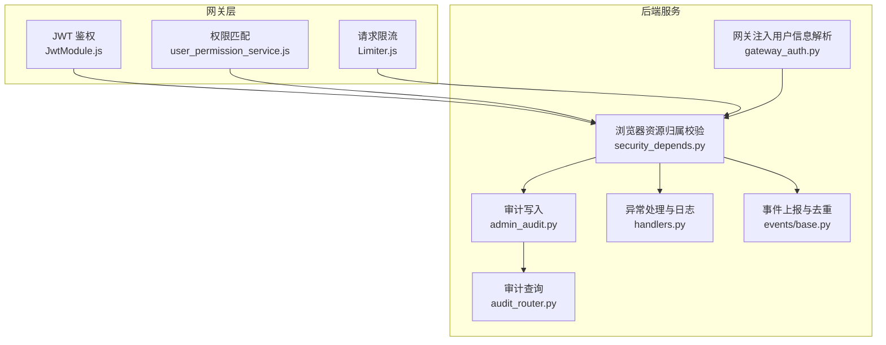

**图表来源**
- [be-gateway/ExpressServerEnd/Service/user_permission_module/JwtModule.js:133-155](file://be-gateway/ExpressServerEnd/Service/user_permission_module/JwtModule.js#L133-L155)
- [be-gateway/ExpressServerEnd/Service/user_permission_module/user_permission_service.js:1-46](file://be-gateway/ExpressServerEnd/Service/user_permission_module/user_permission_service.js#L1-L46)
- [be-gateway/ExpressServerEnd/MiddleWare/Limiter.js:1-35](file://be-gateway/ExpressServerEnd/MiddleWare/Limiter.js#L1-L35)
- [RPA-Browser/app/utils/depends/security_depends.py:20-105](file://RPA-Browser/app/utils/depends/security_depends.py#L20-L105)
- [RPA-Browser/app/services/admin_audit.py:13-43](file://RPA-Browser/app/services/admin_audit.py#L13-L43)
- [RPA-Browser/app/controller/v1/admin/audit_router.py:42-94](file://RPA-Browser/app/controller/v1/admin/audit_router.py#L42-L94)
- [RPA-Browser/app/exceptions/handlers.py:83-164](file://RPA-Browser/app/exceptions/handlers.py#L83-L164)
- [be-bilibili-crawler/Utils/网关/gateway_auth.py:64-122](file://be-bilibili-crawler/Utils/网关/gateway_auth.py#L64-L122)
- [be-message-service/app/services/message/insite/events/base.py:403-438](file://be-message-service/app/services/message/insite/events/base.py#L403-L438)

**章节来源**
- [RPA-Browser/app/utils/depends/security_depends.py:20-105](file://RPA-Browser/app/utils/depends/security_depends.py#L20-L105)
- [RPA-Browser/app/services/admin_audit.py:13-43](file://RPA-Browser/app/services/admin_audit.py#L13-L43)
- [RPA-Browser/app/controller/v1/admin/audit_router.py:42-94](file://RPA-Browser/app/controller/v1/admin/audit_router.py#L42-L94)
- [be-gateway/ExpressServerEnd/Service/user_permission_module/JwtModule.js:133-155](file://be-gateway/ExpressServerEnd/Service/user_permission_module/JwtModule.js#L133-L155)
- [be-gateway/ExpressServerEnd/Service/user_permission_module/user_permission_service.js:1-46](file://be-gateway/ExpressServerEnd/Service/user_permission_module/user_permission_service.js#L1-L46)
- [be-gateway/ExpressServerEnd/MiddleWare/Limiter.js:1-35](file://be-gateway/ExpressServerEnd/MiddleWare/Limiter.js#L1-L35)
- [be-bilibili-crawler/Utils/网关/gateway_auth.py:64-122](file://be-bilibili-crawler/Utils/网关/gateway_auth.py#L64-L122)
- [be-message-service/app/services/message/insite/events/base.py:403-438](file://be-message-service/app/services/message/insite/events/base.py#L403-L438)

## 核心组件
- 管理员操作审计写入：将管理端关键操作落库，支持按操作类型、目标类型、管理员ID过滤查询。
- 审计日志查询API：仅管理员/root可访问，返回分页结果。
- 浏览器资源归属校验：确保浏览器实例属于当前用户，防止越权访问。
- 网关注入用户信息解析：从可信头解析登录态，未登录拒绝访问。
- 请求限流与权限匹配：在网关层限制高频请求并校验路径级权限。
- 异常处理与日志：统一捕获异常，区分数据库连接丢失、自定义业务异常与未知异常，输出结构化日志。
- 事件上报与去重：以去重键保证同一事件幂等落地，便于后续安全分析。

**章节来源**
- [RPA-Browser/app/services/admin_audit.py:13-43](file://RPA-Browser/app/services/admin_audit.py#L13-L43)
- [RPA-Browser/app/controller/v1/admin/audit_router.py:42-94](file://RPA-Browser/app/controller/v1/admin/audit_router.py#L42-L94)
- [RPA-Browser/app/utils/depends/security_depends.py:20-105](file://RPA-Browser/app/utils/depends/security_depends.py#L20-L105)
- [be-bilibili-crawler/Utils/网关/gateway_auth.py:64-122](file://be-bilibili-crawler/Utils/网关/gateway_auth.py#L64-L122)
- [be-gateway/ExpressServerEnd/MiddleWare/Limiter.js:1-35](file://be-gateway/ExpressServerEnd/MiddleWare/Limiter.js#L1-L35)
- [RPA-Browser/app/exceptions/handlers.py:83-164](file://RPA-Browser/app/exceptions/handlers.py#L83-L164)
- [be-message-service/app/services/message/insite/events/base.py:403-438](file://be-message-service/app/services/message/insite/events/base.py#L403-L438)

## 架构总览
下图展示从网关到后端的安全链路：网关完成JWT校验、权限匹配与限流；后端进行资源归属校验、审计写入与异常处理；消息服务用于事件上报与去重。

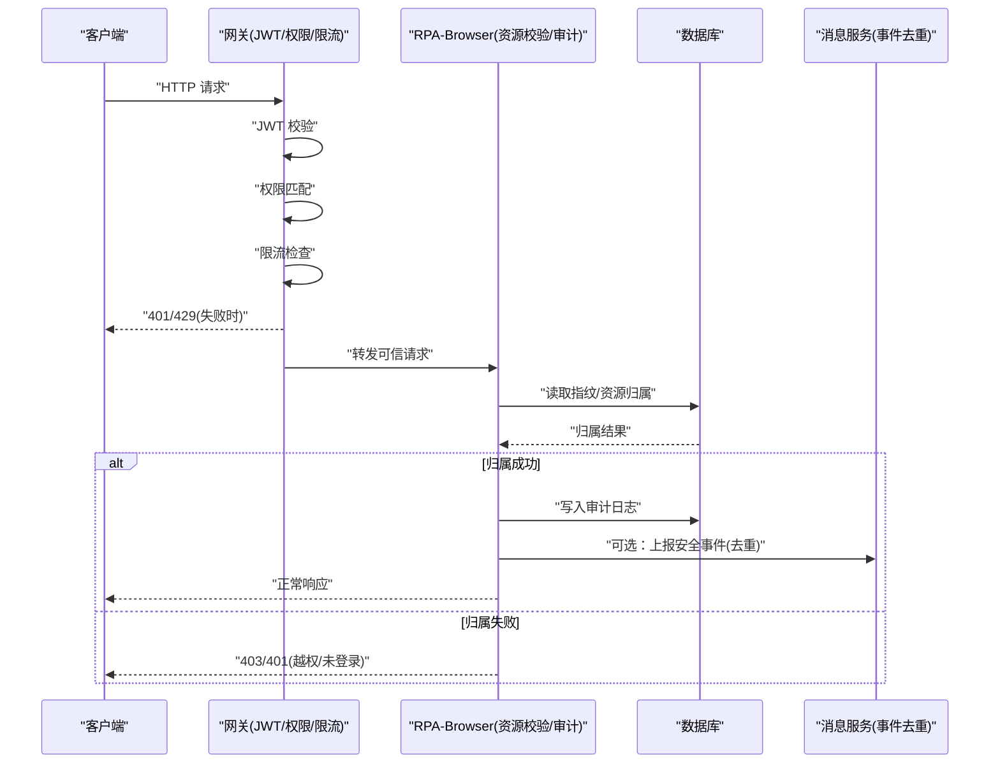

**图表来源**
- [be-gateway/ExpressServerEnd/Service/user_permission_module/JwtModule.js:133-155](file://be-gateway/ExpressServerEnd/Service/user_permission_module/JwtModule.js#L133-L155)
- [be-gateway/ExpressServerEnd/Service/user_permission_module/user_permission_service.js:1-46](file://be-gateway/ExpressServerEnd/Service/user_permission_module/user_permission_service.js#L1-L46)
- [be-gateway/ExpressServerEnd/MiddleWare/Limiter.js:1-35](file://be-gateway/ExpressServerEnd/MiddleWare/Limiter.js#L1-L35)
- [RPA-Browser/app/utils/depends/security_depends.py:20-105](file://RPA-Browser/app/utils/depends/security_depends.py#L20-L105)
- [RPA-Browser/app/services/admin_audit.py:13-43](file://RPA-Browser/app/services/admin_audit.py#L13-L43)
- [be-message-service/app/services/message/insite/events/base.py:403-438](file://be-message-service/app/services/message/insite/events/base.py#L403-L438)

## 详细组件分析

### 管理员操作审计
- 审计写入：在服务层封装 log_admin_action，成功后写入 admin_audit_log 表；写入失败仅告警，不阻断主流程。
- 审计模型：包含管理员ID、操作类型、目标类型、目标ID、详情、创建时间等字段。
- 审计查询：提供 /audit/list 接口，支持按 action、target_type、admin_mid 过滤，分页返回。

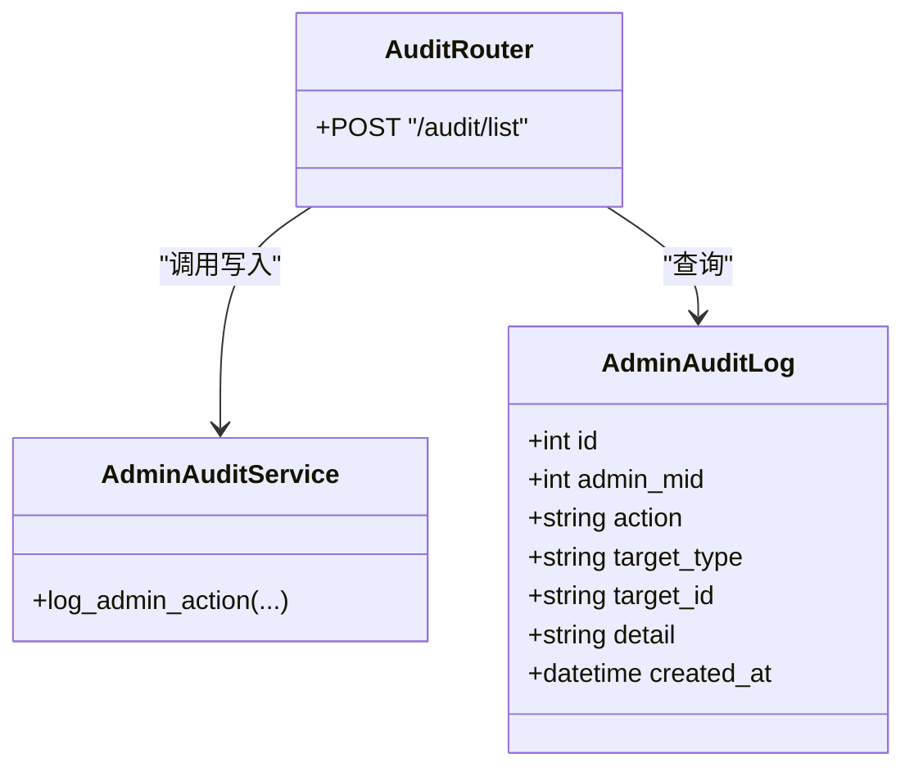

**图表来源**
- [RPA-Browser/app/models/database/admin/models.py:120-132](file://RPA-Browser/app/models/database/admin/models.py#L120-L132)
- [RPA-Browser/app/controller/v1/admin/audit_router.py:42-94](file://RPA-Browser/app/controller/v1/admin/audit_router.py#L42-L94)
- [RPA-Browser/app/services/admin_audit.py:13-43](file://RPA-Browser/app/services/admin_audit.py#L13-L43)

**章节来源**
- [RPA-Browser/app/services/admin_audit.py:13-43](file://RPA-Browser/app/services/admin_audit.py#L13-L43)
- [RPA-Browser/app/models/database/admin/models.py:120-132](file://RPA-Browser/app/models/database/admin/models.py#L120-L132)
- [RPA-Browser/app/controller/v1/admin/audit_router.py:42-94](file://RPA-Browser/app/controller/v1/admin/audit_router.py#L42-L94)

### 浏览器资源归属与访问控制
- 资源归属校验：verify_browser_ownership 通过 BrowserFingerprintService 验证浏览器ID是否属于当前用户MID，否则抛出异常。
- 指纹数量限制：verify_fingerprint_limit 根据用户等级/角色限制最大指纹数，超限抛出异常。
- 安全模型：SecurityCheckResult 表示URL安全检查结果（允许/拒绝及原因），供上层扩展使用。

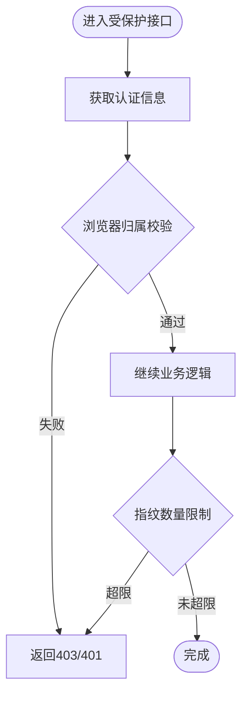

**图表来源**
- [RPA-Browser/app/utils/depends/security_depends.py:20-105](file://RPA-Browser/app/utils/depends/security_depends.py#L20-L105)
- [RPA-Browser/app/models/core/browser/security.py:7-10](file://RPA-Browser/app/models/core/browser/security.py#L7-L10)

**章节来源**
- [RPA-Browser/app/utils/depends/security_depends.py:20-105](file://RPA-Browser/app/utils/depends/security_depends.py#L20-L105)
- [RPA-Browser/app/models/core/browser/security.py:7-10](file://RPA-Browser/app/models/core/browser/security.py#L7-L10)

### 网关鉴权与限流
- JWT 鉴权：中间件从 HttpOnly Cookie 读取令牌，校验算法与过期状态，注入 req.auth。
- 权限匹配：基于 Trie 树构建路径模式与权限映射，支持通配符匹配。
- 请求限流：使用 express-rate-limit 与 Redis 存储，按窗口与阈值限制请求频率。

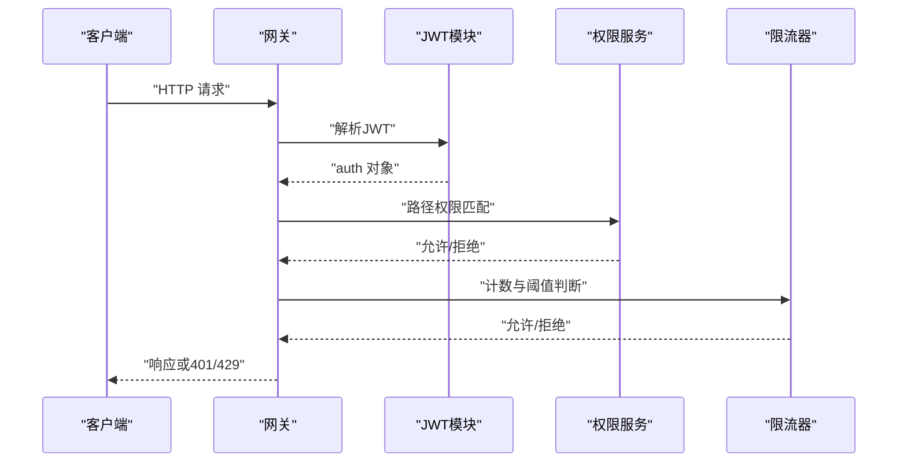

**图表来源**
- [be-gateway/ExpressServerEnd/Service/user_permission_module/JwtModule.js:133-155](file://be-gateway/ExpressServerEnd/Service/user_permission_module/JwtModule.js#L133-L155)
- [be-gateway/ExpressServerEnd/Service/user_permission_module/user_permission_service.js:1-46](file://be-gateway/ExpressServerEnd/Service/user_permission_module/user_permission_service.js#L1-L46)
- [be-gateway/ExpressServerEnd/MiddleWare/Limiter.js:1-35](file://be-gateway/ExpressServerEnd/MiddleWare/Limiter.js#L1-L35)

**章节来源**
- [be-gateway/ExpressServerEnd/Service/user_permission_module/JwtModule.js:133-155](file://be-gateway/ExpressServerEnd/Service/user_permission_module/JwtModule.js#L133-L155)
- [be-gateway/ExpressServerEnd/Service/user_permission_module/user_permission_service.js:1-46](file://be-gateway/ExpressServerEnd/Service/user_permission_module/user_permission_service.js#L1-L46)
- [be-gateway/ExpressServerEnd/MiddleWare/Limiter.js:1-35](file://be-gateway/ExpressServerEnd/MiddleWare/Limiter.js#L1-L35)

### 网关注入用户信息与登录态校验
- 解析可信头：从 x-bili-* 头解析 mid、用户名、角色等信息，并对部分字段解码。
- 登录态校验：mid 为空视为未登录，直接返回401并记录警告日志。

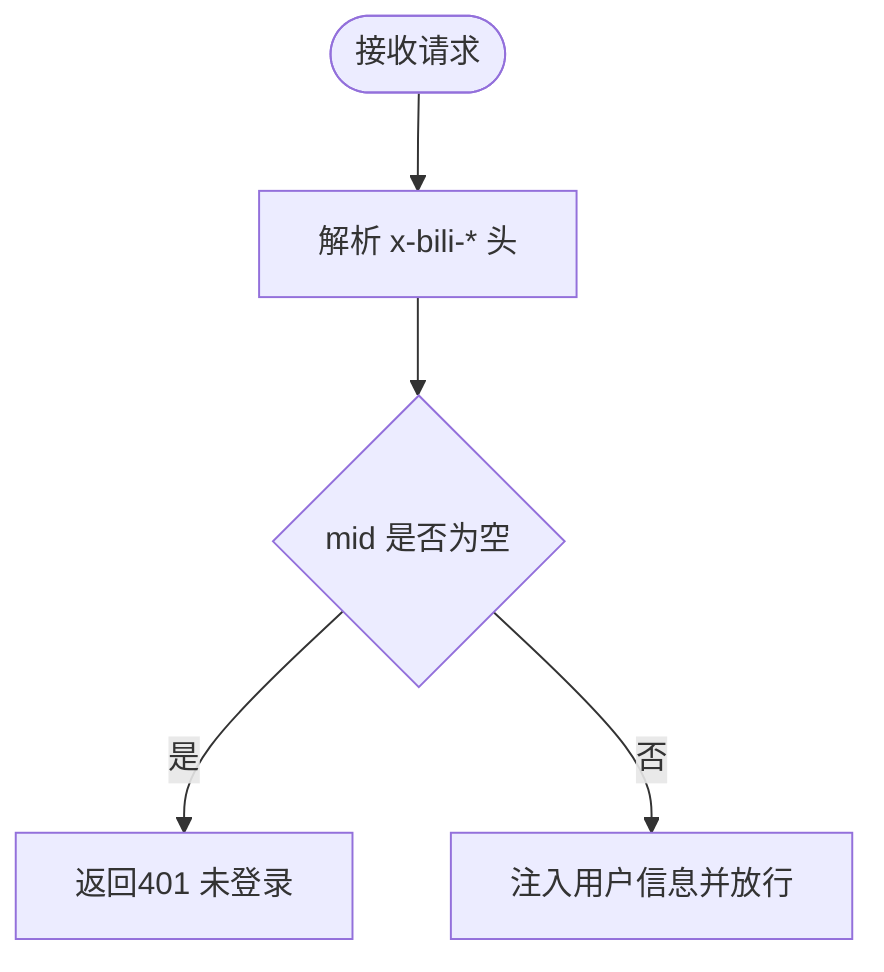

**图表来源**
- [be-bilibili-crawler/Utils/网关/gateway_auth.py:64-122](file://be-bilibili-crawler/Utils/网关/gateway_auth.py#L64-L122)

**章节来源**
- [be-bilibili-crawler/Utils/网关/gateway_auth.py:64-122](file://be-bilibili-crawler/Utils/网关/gateway_auth.py#L64-L122)

### 异常处理与日志
- 统一异常处理：区分数据库连接丢失、自定义业务异常与未知异常，设置不同状态码与响应码，输出结构化日志。
- 数据库连接错误专用处理器：识别常见连接丢失错误，建议重试时间。

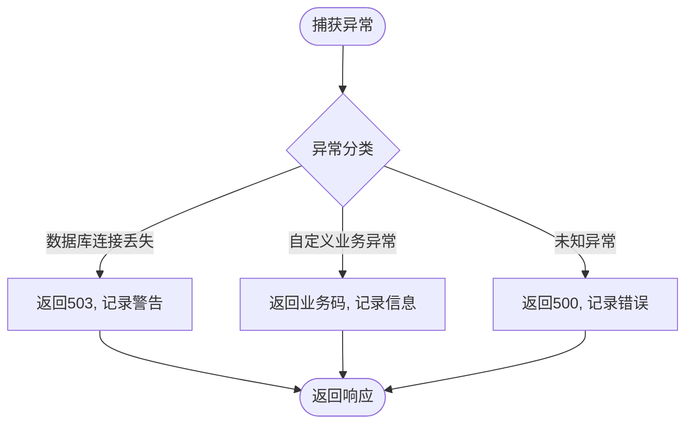

**图表来源**
- [RPA-Browser/app/exceptions/handlers.py:83-164](file://RPA-Browser/app/exceptions/handlers.py#L83-L164)

**章节来源**
- [RPA-Browser/app/exceptions/handlers.py:83-164](file://RPA-Browser/app/exceptions/handlers.py#L83-L164)

### 执行动作日志与采集策略
- 采集策略：优先使用参数中的 log 选项，其次继承父操作透传的配置，再次回落到服务端兜底配置。
- 上下文：为每次 action 执行建立采集上下文，便于后续分析与审计。

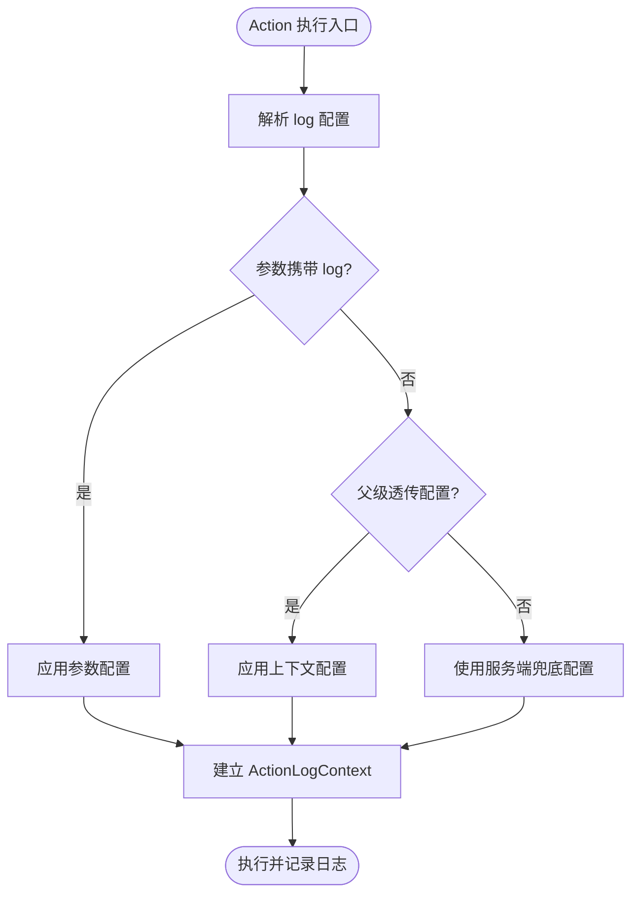

**图表来源**
- [RPA-Browser/app/services/execution/action_logger.py:98-123](file://RPA-Browser/app/services/execution/action_logger.py#L98-L123)
- [RPA-Browser/app/services/execution/actions/control_flow.py:257-274](file://RPA-Browser/app/services/execution/actions/control_flow.py#L257-L274)

**章节来源**
- [RPA-Browser/app/services/execution/action_logger.py:98-123](file://RPA-Browser/app/services/execution/action_logger.py#L98-L123)
- [RPA-Browser/app/services/execution/actions/control_flow.py:257-274](file://RPA-Browser/app/services/execution/actions/control_flow.py#L257-L274)

### 社区举报与异常行为检测
- 举报列表查询：支持按有效性、资源类型过滤，按创建时间倒序分页。
- 统计计数：支持按条件统计举报数量，用于指标监控与告警阈值判断。

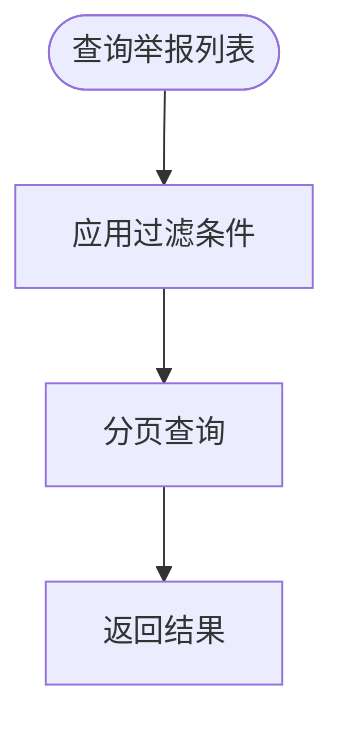

**图表来源**
- [RPA-Browser/app/services/execution/crud_service/community_crud.py:169-204](file://RPA-Browser/app/services/execution/crud_service/community_crud.py#L169-L204)

**章节来源**
- [RPA-Browser/app/services/execution/crud_service/community_crud.py:169-204](file://RPA-Browser/app/services/execution/crud_service/community_crud.py#L169-L204)

### 事件上报与去重
- 去重键：以 dedup_key 唯一索引保证重复上报幂等，避免重复记录。
- 返回结构：接受后返回事件ID与是否重复标志，便于上游确认。

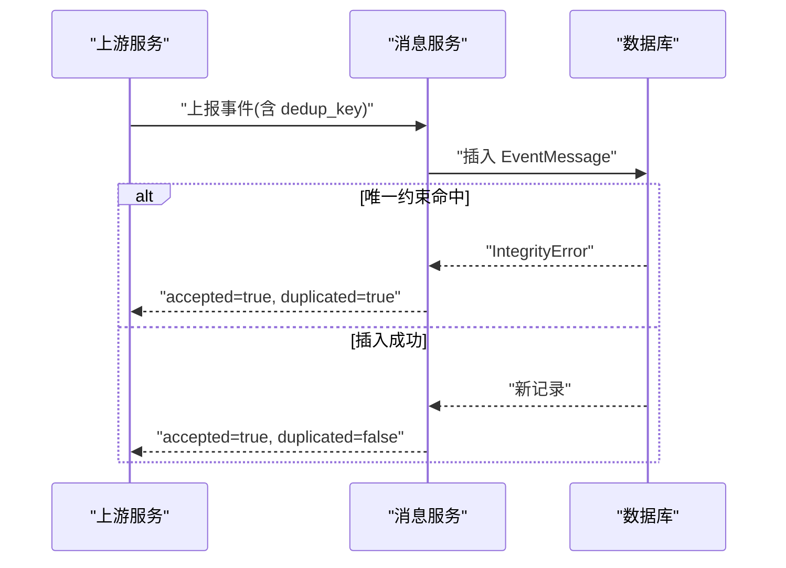

**图表来源**
- [be-message-service/app/services/message/insite/events/base.py:403-438](file://be-message-service/app/services/message/insite/events/base.py#L403-L438)

**章节来源**
- [be-message-service/app/services/message/insite/events/base.py:403-438](file://be-message-service/app/services/message/insite/events/base.py#L403-L438)

## 依赖关系分析
- 网关依赖：JWT 模块、权限服务、限流中间件共同构成前置安全防线。
- 后端依赖：资源归属校验依赖指纹服务与权限配置；审计写入依赖数据库会话；异常处理依赖日志框架。
- 事件服务依赖：去重键与唯一索引保障幂等性。

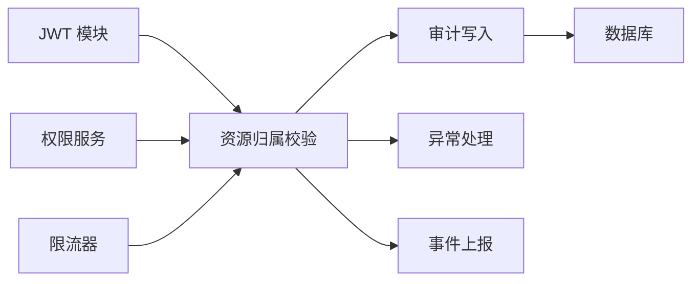

**图表来源**
- [be-gateway/ExpressServerEnd/Service/user_permission_module/JwtModule.js:133-155](file://be-gateway/ExpressServerEnd/Service/user_permission_module/JwtModule.js#L133-L155)
- [be-gateway/ExpressServerEnd/Service/user_permission_module/user_permission_service.js:1-46](file://be-gateway/ExpressServerEnd/Service/user_permission_module/user_permission_service.js#L1-L46)
- [be-gateway/ExpressServerEnd/MiddleWare/Limiter.js:1-35](file://be-gateway/ExpressServerEnd/MiddleWare/Limiter.js#L1-L35)
- [RPA-Browser/app/utils/depends/security_depends.py:20-105](file://RPA-Browser/app/utils/depends/security_depends.py#L20-L105)
- [RPA-Browser/app/services/admin_audit.py:13-43](file://RPA-Browser/app/services/admin_audit.py#L13-L43)
- [RPA-Browser/app/exceptions/handlers.py:83-164](file://RPA-Browser/app/exceptions/handlers.py#L83-L164)
- [be-message-service/app/services/message/insite/events/base.py:403-438](file://be-message-service/app/services/message/insite/events/base.py#L403-L438)

**章节来源**
- [RPA-Browser/app/utils/depends/security_depends.py:20-105](file://RPA-Browser/app/utils/depends/security_depends.py#L20-L105)
- [RPA-Browser/app/services/admin_audit.py:13-43](file://RPA-Browser/app/services/admin_audit.py#L13-L43)
- [RPA-Browser/app/exceptions/handlers.py:83-164](file://RPA-Browser/app/exceptions/handlers.py#L83-L164)
- [be-gateway/ExpressServerEnd/Service/user_permission_module/JwtModule.js:133-155](file://be-gateway/ExpressServerEnd/Service/user_permission_module/JwtModule.js#L133-L155)
- [be-gateway/ExpressServerEnd/Service/user_permission_module/user_permission_service.js:1-46](file://be-gateway/ExpressServerEnd/Service/user_permission_module/user_permission_service.js#L1-L46)
- [be-gateway/ExpressServerEnd/MiddleWare/Limiter.js:1-35](file://be-gateway/ExpressServerEnd/MiddleWare/Limiter.js#L1-L35)
- [be-message-service/app/services/message/insite/events/base.py:403-438](file://be-message-service/app/services/message/insite/events/base.py#L403-L438)

## 性能考虑
- 审计写入失败不阻断业务：采用 try/except 包裹，仅记录警告日志，降低对主流程的影响。
- 事件上报去重：利用数据库唯一索引减少重复写入，提升吞吐与一致性。
- 网关限流：基于 Redis 的分布式限流，避免单点瓶颈，保护后端资源。
- 分页查询：审计列表与举报列表均支持分页，避免大结果集导致的性能问题。

[本节为通用性能指导，无需特定文件引用]

## 故障排查指南
- 鉴权失败：检查网关 JWT 配置与 Cookie 传递；确认 x-bili-* 头是否被正确注入与解码。
- 资源越权：核对浏览器ID与用户MID归属关系；检查指纹数量限制配置。
- 审计缺失：确认审计写入是否被调用；查看日志中是否有写入失败的警告。
- 数据库连接异常：关注503响应与连接丢失日志；必要时调整重试策略与连接池参数。
- 限流触发：检查速率限制窗口与阈值；评估业务峰值并调优限流策略。

**章节来源**
- [be-bilibili-crawler/Utils/网关/gateway_auth.py:64-122](file://be-bilibili-crawler/Utils/网关/gateway_auth.py#L64-L122)
- [RPA-Browser/app/utils/depends/security_depends.py:20-105](file://RPA-Browser/app/utils/depends/security_depends.py#L20-L105)
- [RPA-Browser/app/services/admin_audit.py:13-43](file://RPA-Browser/app/services/admin_audit.py#L13-L43)
- [RPA-Browser/app/exceptions/handlers.py:83-164](file://RPA-Browser/app/exceptions/handlers.py#L83-L164)
- [be-gateway/ExpressServerEnd/MiddleWare/Limiter.js:1-35](file://be-gateway/ExpressServerEnd/MiddleWare/Limiter.js#L1-L35)

## 结论
本项目通过网关层的前置安全能力（JWT、权限、限流）与后端的服务级控制（资源归属、审计、异常处理）构建了完整的安全监控与审计体系。借助事件上报与去重机制，可实现安全事件的可靠采集与分析；通过审计日志与举报数据的查询能力，可支撑合规报告生成与异常行为检测。建议在现有基础上进一步引入集中式日志平台与告警规则引擎，以提升威胁发现与响应效率。

[本节为总结性内容，无需特定文件引用]

## 附录
- 审计日志格式：包含管理员ID、操作类型、目标类型、目标ID、详情、创建时间。
- 事件分类：支持按 action、target_type、is_valid、resource_type 等维度分类与统计。
- 响应流程：鉴权失败返回401；越权访问返回403；限流触发返回429；数据库连接丢失返回503；其他异常返回500。

[本节为补充说明，无需特定文件引用]