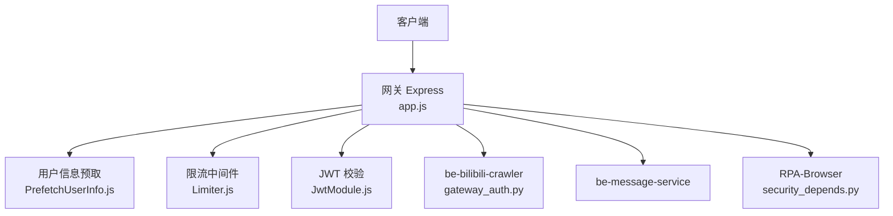
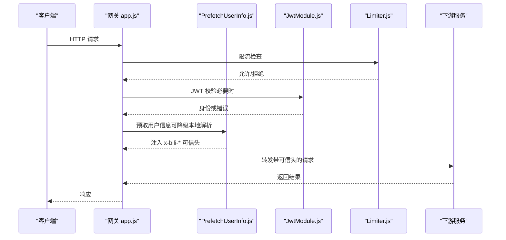
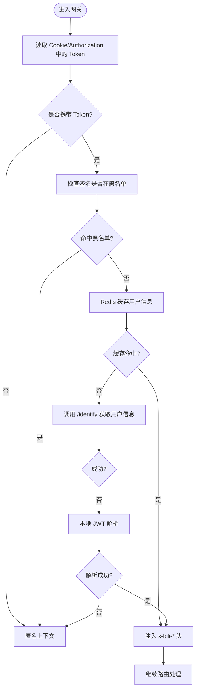
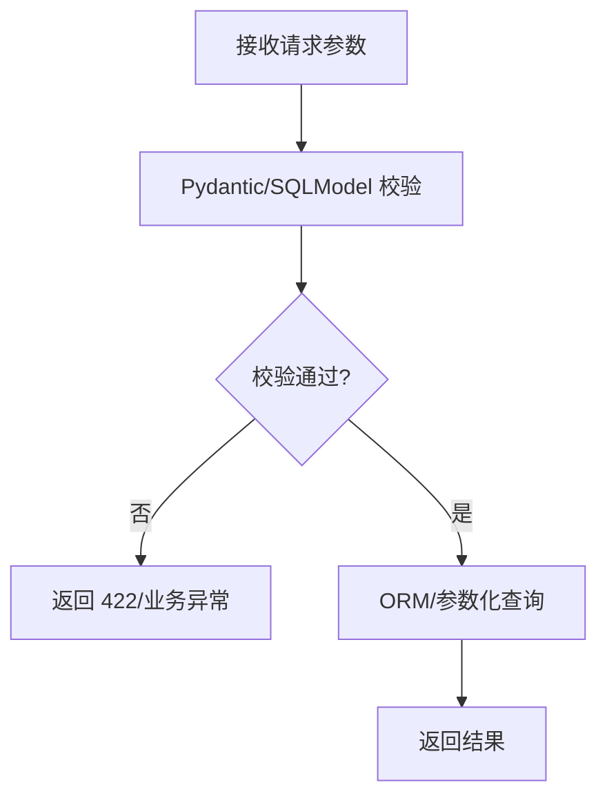
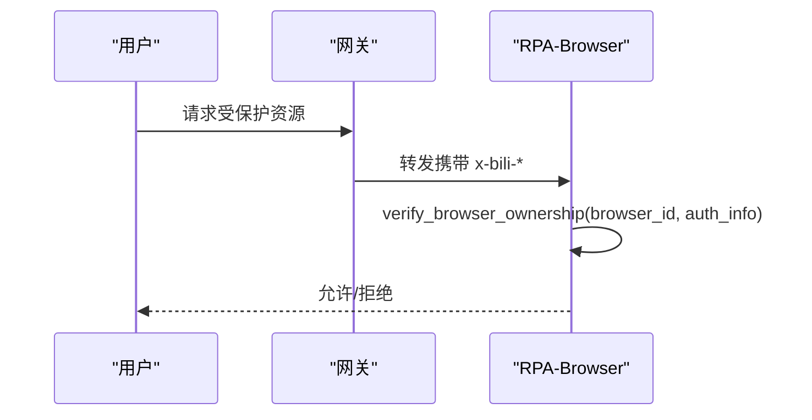
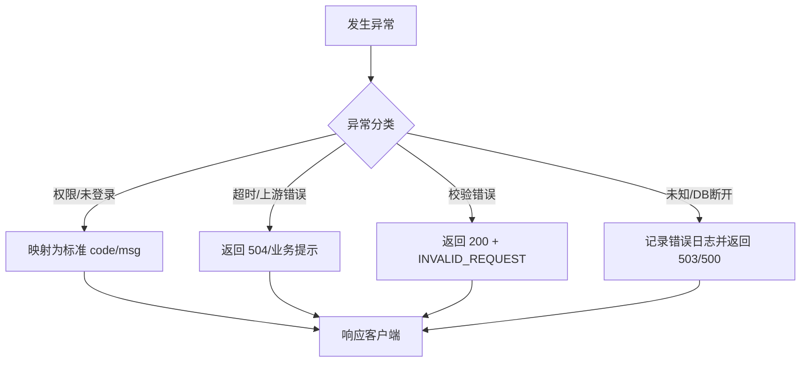
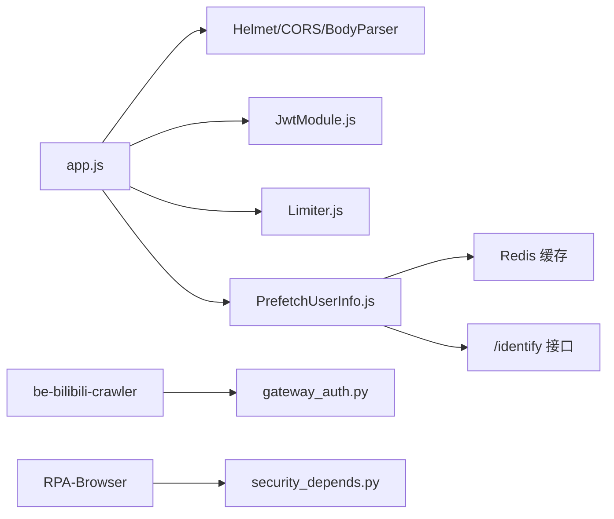

# 应用安全防护

<cite>
**本文引用的文件**
- [be-gateway/ExpressServerEnd/app.js](file://be-gateway/ExpressServerEnd/app.js)
- [be-gateway/ExpressServerEnd/MiddleWare/PrefetchUserInfo.js](file://be-gateway/ExpressServerEnd/MiddleWare/PrefetchUserInfo.js)
- [be-gateway/ExpressServerEnd/MiddleWare/Limiter.js](file://be-gateway/ExpressServerEnd/MiddleWare/Limiter.js)
- [be-gateway/ExpressServerEnd/Service/user_permission_module/JwtModule.js](file://be-gateway/ExpressServerEnd/Service/user_permission_module/JwtModule.js)
- [be-bilibili-crawler/Utils/网关/gateway_auth.py](file://be-bilibili-crawler/Utils/网关/gateway_auth.py)
- [RPA-Browser/app/utils/depends/security_depends.py](file://RPA-Browser/app/utils/depends/security_depends.py)
- [RPA-Browser/app/models/core/browser/security.py](file://RPA-Browser/app/models/core/browser/security.py)
- [RPA-Browser/app/exceptions/handlers.py](file://RPA-Browser/app/exceptions/handlers.py)
- [be-message-service/tests/test_comment_crud.py](file://be-message-service/tests/test_comment_crud.py)
</cite>

## 目录
1. [简介](#简介)
2. [项目结构](#项目结构)
3. [核心组件](#核心组件)
4. [架构总览](#架构总览)
5. [详细组件分析](#详细组件分析)
6. [依赖关系分析](#依赖关系分析)
7. [性能与安全权衡](#性能与安全权衡)
8. [故障排查指南](#故障排查指南)
9. [结论](#结论)
10. [附录：安全编码规范与审查清单](#附录安全编码规范与审查清单)

## 简介
本文件面向本仓库的应用层安全，覆盖以下主题：SQL 注入防护、XSS 攻击防护、CSRF 攻击防护、输入验证机制；认证授权实现、会话管理、API 接口安全认证与权限控制策略；错误处理机制、日志审计与安全事件监控；以及常见漏洞治理、代码安全审查与安全编码规范的落地执行。文档基于仓库中网关（Express）、后端服务（FastAPI）及前端工程中的实际实现进行说明，并提供可视化流程图与时序图帮助理解。

## 项目结构
本项目采用多服务架构：
- be-gateway：Express 网关，负责统一入口、CORS、限流、JWT 校验、用户信息预取并注入可信头到上游服务。
- be-bilibili-crawler / be-message-service / RPA-Browser：业务服务，使用 FastAPI，通过网关注入的 x-bili-* 头进行鉴权与上下文传递。
- Vue3FrontEndDemoExercise：前端工程，配合网关设置 HttpOnly Cookie 完成无状态会话。

**图示来源**
- [be-gateway/ExpressServerEnd/app.js:82-117](file://be-gateway/ExpressServerEnd/app.js#L82-L117)
- [be-gateway/ExpressServerEnd/MiddleWare/PrefetchUserInfo.js:75-189](file://be-gateway/ExpressServerEnd/MiddleWare/PrefetchUserInfo.js#L75-L189)
- [be-gateway/ExpressServerEnd/MiddleWare/Limiter.js:20-50](file://be-gateway/ExpressServerEnd/MiddleWare/Limiter.js#L20-L50)
- [be-gateway/ExpressServerEnd/Service/user_permission_module/JwtModule.js:85-131](file://be-gateway/ExpressServerEnd/Service/user_permission_module/JwtModule.js#L85-L131)
- [be-bilibili-crawler/Utils/网关/gateway_auth.py:88-121](file://be-bilibili-crawler/Utils/网关/gateway_auth.py#L88-L121)
- [RPA-Browser/app/utils/depends/security_depends.py:53-104](file://RPA-Browser/app/utils/depends/security_depends.py#L53-L104)

**章节来源**
- [be-gateway/ExpressServerEnd/app.js:82-117](file://be-gateway/ExpressServerEnd/app.js#L82-L117)

## 核心组件
- 网关安全中间件：CSP、超时、CORS、请求体解析、JWT 校验、限流、全局错误处理。
- 认证与会话：HS256 签名的 JWT，HttpOnly Cookie 存储，黑名单撤销，可选登录模式。
- 用户上下文透传：网关预取用户信息并注入 x-bili-* 可信头，下游服务据此判断登录态与权限。
- 资源级鉴权：按浏览器指纹归属、等级/角色限制等维度进行细粒度访问控制。
- 输入验证与异常：Pydantic/SQLModel 强类型校验，统一异常处理器与结构化响应。

**章节来源**
- [be-gateway/ExpressServerEnd/Service/user_permission_module/JwtModule.js:35-83](file://be-gateway/ExpressServerEnd/Service/user_permission_module/JwtModule.js#L35-L83)
- [be-gateway/ExpressServerEnd/MiddleWare/PrefetchUserInfo.js:75-189](file://be-gateway/ExpressServerEnd/MiddleWare/PrefetchUserInfo.js#L75-L189)
- [be-bilibili-crawler/Utils/网关/gateway_auth.py:26-85](file://be-bilibili-crawler/Utils/网关/gateway_auth.py#L26-L85)
- [RPA-Browser/app/utils/depends/security_depends.py:20-104](file://RPA-Browser/app/utils/depends/security_depends.py#L20-L104)

## 架构总览
下图展示一次受保护 API 请求在网关与下游服务之间的安全流转过程，包括限流、JWT 校验、用户信息预取、可信头注入与下游鉴权。

**图示来源**
- [be-gateway/ExpressServerEnd/app.js:82-117](file://be-gateway/ExpressServerEnd/app.js#L82-L117)
- [be-gateway/ExpressServerEnd/MiddleWare/Limiter.js:20-50](file://be-gateway/ExpressServerEnd/MiddleWare/Limiter.js#L20-L50)
- [be-gateway/ExpressServerEnd/Service/user_permission_module/JwtModule.js:85-131](file://be-gateway/ExpressServerEnd/Service/user_permission_module/JwtModule.js#L85-L131)
- [be-gateway/ExpressServerEnd/MiddleWare/PrefetchUserInfo.js:75-189](file://be-gateway/ExpressServerEnd/MiddleWare/PrefetchUserInfo.js#L75-L189)

## 详细组件分析

### 认证与会话管理（JWT + HttpOnly Cookie）
- 令牌生成与校验：使用 HS256 算法签发与验签，支持“必须登录”和“可选登录”两种模式，并通过白名单路径豁免部分公开接口。
- 会话存储：将 JWT 写入 HttpOnly Cookie，避免 XSS 窃取；生产环境启用 Secure，SameSite 设为 lax；支持环境变量覆盖 secure 行为。
- 令牌撤销：通过 Redis 黑名单检查签名，登出后立即失效；预取阶段也进行黑名单检查，确保一致性。
- 用户上下文：网关从 Cookie 或 Authorization 头提取 Token，优先调用上游识别接口获取最新用户信息，失败时降级为本地解析，并将 x-bili-* 头注入下游。

**图示来源**
- [be-gateway/ExpressServerEnd/Service/user_permission_module/JwtModule.js:20-83](file://be-gateway/ExpressServerEnd/Service/user_permission_module/JwtModule.js#L20-L83)
- [be-gateway/ExpressServerEnd/MiddleWare/PrefetchUserInfo.js:75-189](file://be-gateway/ExpressServerEnd/MiddleWare/PrefetchUserInfo.js#L75-L189)

**章节来源**
- [be-gateway/ExpressServerEnd/Service/user_permission_module/JwtModule.js:35-83](file://be-gateway/ExpressServerEnd/Service/user_permission_module/JwtModule.js#L35-L83)
- [be-gateway/ExpressServerEnd/Service/user_permission_module/JwtModule.js:85-131](file://be-gateway/ExpressServerEnd/Service/user_permission_module/JwtModule.js#L85-L131)
- [be-gateway/ExpressServerEnd/MiddleWare/PrefetchUserInfo.js:75-189](file://be-gateway/ExpressServerEnd/MiddleWare/PrefetchUserInfo.js#L75-L189)

### 输入验证与 SQL 注入防护
- 强类型参数模型：后端强制使用 Pydantic/SQLModel 定义复杂参数，禁止使用任意 dict，从而在入口处完成类型与格式校验，降低 SQL 注入风险。
- 参数校验测试：针对评论等写接口，非法输入会抛出明确异常，保证数据入库前被拦截。
- 建议实践：所有数据库操作均通过 ORM/参数化查询，严禁拼接 SQL；对枚举、范围、长度等进行严格约束。

**图示来源**
- [be-message-service/tests/test_comment_crud.py:427-452](file://be-message-service/tests/test_comment_crud.py#L427-L452)

**章节来源**
- [be-message-service/tests/test_comment_crud.py:427-452](file://be-message-service/tests/test_comment_crud.py#L427-L452)

### XSS 攻击防护
- CSP 策略：网关通过 helmet 配置内容安全策略，限制脚本、样式、媒体等来源，减少内联脚本与不受信源加载。
- 会话安全：JWT 存储在 HttpOnly Cookie，避免前端脚本读取，降低 XSS 窃取令牌的风险。
- 建议实践：前端渲染用户输入时使用安全的转义函数；服务端输出侧避免直接拼接 HTML；对富文本输入进行白名单过滤。

**章节来源**
- [be-gateway/ExpressServerEnd/app.js:82-104](file://be-gateway/ExpressServerEnd/app.js#L82-L104)
- [be-gateway/ExpressServerEnd/Service/user_permission_module/JwtModule.js:43-61](file://be-gateway/ExpressServerEnd/Service/user_permission_module/JwtModule.js#L43-L61)

### CSRF 攻击防护
- SameSite Cookie：网关将 bili_jwt 设置为 SameSite=lax，结合 CORS 配置，降低跨站请求伪造风险。
- 建议实践：对写接口增加 CSRF Token 校验或使用双提交 Cookie；敏感操作要求二次确认；仅在同域或受信域名下启用 credentials。

**章节来源**
- [be-gateway/ExpressServerEnd/Service/user_permission_module/JwtModule.js:43-61](file://be-gateway/ExpressServerEnd/Service/user_permission_module/JwtModule.js#L43-L61)
- [be-gateway/ExpressServerEnd/app.js:105-111](file://be-gateway/ExpressServerEnd/app.js#L105-L111)

### 权限控制与资源级鉴权
- 网关层：提供“必须登录”和“可选登录”两种 JWT 校验中间件，并对公开读接口进行白名单豁免。
- 下游服务：通过 require_gateway_login 依赖校验 x-bili-mid 是否为空，未登录即拒绝访问。
- 资源级：RPA-Browser 通过 verify_browser_ownership 校验浏览器 ID 归属当前用户 MID，并结合等级/角色限制最大指纹数量。

**图示来源**
- [be-gateway/ExpressServerEnd/Service/user_permission_module/JwtModule.js:85-131](file://be-gateway/ExpressServerEnd/Service/user_permission_module/JwtModule.js#L85-L131)
- [be-bilibili-crawler/Utils/网关/gateway_auth.py:88-121](file://be-bilibili-crawler/Utils/网关/gateway_auth.py#L88-L121)
- [RPA-Browser/app/utils/depends/security_depends.py:53-104](file://RPA-Browser/app/utils/depends/security_depends.py#L53-L104)

**章节来源**
- [be-gateway/ExpressServerEnd/Service/user_permission_module/JwtModule.js:85-131](file://be-gateway/ExpressServerEnd/Service/user_permission_module/JwtModule.js#L85-L131)
- [be-bilibili-crawler/Utils/网关/gateway_auth.py:88-121](file://be-bilibili-crawler/Utils/网关/gateway_auth.py#L88-L121)
- [RPA-Browser/app/utils/depends/security_depends.py:53-104](file://RPA-Browser/app/utils/depends/security_depends.py#L53-L104)

### 错误处理、日志审计与安全事件监控
- 网关错误处理：统一捕获权限、未登录、超时等异常，并以标准化 JSON 返回；校验错误以 200+code 形式返回，便于前端统一处理。
- 下游异常处理：RPA-Browser 根据异常类型区分数据库连接丢失、自定义业务异常与未知异常，记录不同级别日志并返回合适状态码。
- 日志与审计：网关开发环境记录请求耗时与参数；下游服务在鉴权失败时记录警告日志，便于追踪未授权访问尝试。

**图示来源**
- [be-gateway/ExpressServerEnd/app.js:119-161](file://be-gateway/ExpressServerEnd/app.js#L119-L161)
- [RPA-Browser/app/exceptions/handlers.py:99-126](file://RPA-Browser/app/exceptions/handlers.py#L99-L126)

**章节来源**
- [be-gateway/ExpressServerEnd/app.js:119-161](file://be-gateway/ExpressServerEnd/app.js#L119-L161)
- [RPA-Browser/app/exceptions/handlers.py:99-126](file://RPA-Browser/app/exceptions/handlers.py#L99-L126)

## 依赖关系分析
- 网关依赖：helmet（CSP）、cors（跨域）、body-parser（请求体解析）、express-jwt（JWT 校验）、express-rate-limit（限流）。
- 用户上下文：PrefetchUserInfo 依赖 Redis 缓存与上游 /identify 接口，失败时降级本地 JWT 解析。
- 下游鉴权：be-bilibili-crawler 通过 gateway_auth 解析 x-bili-* 头；RPA-Browser 通过 security_depends 进行资源级权限校验。

**图示来源**
- [be-gateway/ExpressServerEnd/app.js:82-117](file://be-gateway/ExpressServerEnd/app.js#L82-L117)
- [be-gateway/ExpressServerEnd/MiddleWare/PrefetchUserInfo.js:75-189](file://be-gateway/ExpressServerEnd/MiddleWare/PrefetchUserInfo.js#L75-L189)
- [be-bilibili-crawler/Utils/网关/gateway_auth.py:26-85](file://be-bilibili-crawler/Utils/网关/gateway_auth.py#L26-L85)
- [RPA-Browser/app/utils/depends/security_depends.py:53-104](file://RPA-Browser/app/utils/depends/security_depends.py#L53-L104)

**章节来源**
- [be-gateway/ExpressServerEnd/app.js:82-117](file://be-gateway/ExpressServerEnd/app.js#L82-L117)
- [be-gateway/ExpressServerEnd/MiddleWare/Limiter.js:20-50](file://be-gateway/ExpressServerEnd/MiddleWare/Limiter.js#L20-L50)

## 性能与安全权衡
- 限流策略：基于 Redis 的分布式限流，按 IP 维度统计，避免暴力破解与滥用；可根据接口敏感度调整窗口与阈值。
- 用户信息缓存：以 JWT 签名为键缓存用户信息，TTL 较短以减少不一致；同时兼顾可用性，当上游不可用时快速降级。
- 安全与体验：CSP 严格策略可能影响第三方资源加载，需按需放宽；SameSite=lax 在跨站场景下可能阻止部分 Cookie 发送，需评估业务需求。

[本节为通用指导，不直接分析具体文件]

## 故障排查指南
- 未登录/权限不足：检查网关白名单与 jwtAuth 配置，确认接口是否需要登录；查看下游 require_gateway_login 是否生效。
- 令牌无效/过期：确认 JwtModule 的密钥与算法一致；检查 Redis 黑名单是否误加入；观察 PrefetchUserInfo 的降级逻辑。
- 限流触发：检查 Limiter 的 windowMs 与 limit 配置；确认 keyGenerator 是否按预期生成键（如 IP）。
- 输入校验失败：定位 Pydantic/SQLModel 字段约束；参考测试用例确认非法输入的处理路径。

**章节来源**
- [be-gateway/ExpressServerEnd/Service/user_permission_module/JwtModule.js:85-131](file://be-gateway/ExpressServerEnd/Service/user_permission_module/JwtModule.js#L85-L131)
- [be-gateway/ExpressServerEnd/MiddleWare/PrefetchUserInfo.js:75-189](file://be-gateway/ExpressServerEnd/MiddleWare/PrefetchUserInfo.js#L75-L189)
- [be-gateway/ExpressServerEnd/MiddleWare/Limiter.js:20-50](file://be-gateway/ExpressServerEnd/MiddleWare/Limiter.js#L20-L50)
- [be-message-service/tests/test_comment_crud.py:427-452](file://be-message-service/tests/test_comment_crud.py#L427-L452)

## 结论
本项目在网关层实现了较为完善的安全基线：CSP、CORS、限流、JWT 校验与用户上下文透传；下游服务通过可信头与资源级鉴权保障数据安全。输入验证采用强类型模型，有效降低 SQL 注入风险；错误处理与日志审计有助于问题定位与安全事件追踪。建议在后续迭代中持续强化输入白名单、细化权限模型、完善审计指标与告警机制。

[本节为总结性内容，不直接分析具体文件]

## 附录：安全编码规范与审查清单
- 输入验证
  - 所有复杂参数使用 Pydantic/SQLModel 定义，禁止使用任意 dict。
  - 对枚举、范围、长度、格式进行严格约束；写接口需有单元测试覆盖非法输入。
- SQL 注入防护
  - 全部使用 ORM/参数化查询；禁止字符串拼接 SQL。
  - 对动态表名/列名进行白名单校验。
- XSS 防护
  - 前端对用户输入进行安全转义；服务端输出侧避免直接拼接 HTML。
  - 网关 CSP 策略按业务最小化开放；谨慎使用 unsafe-inline/unsafe-eval。
- CSRF 防护
  - 写接口增加 CSRF Token 或双提交 Cookie；仅受信域名启用 credentials。
- 认证与授权
  - 统一使用 HS256 JWT；敏感接口强制登录；公开读接口白名单管理。
  - 资源级鉴权：按用户、角色、资源归属进行细粒度控制。
- 会话管理
  - JWT 存于 HttpOnly Cookie；生产环境启用 Secure；SameSite 合理配置。
  - 登出立即加入黑名单；预取阶段同步检查。
- 错误处理与审计
  - 统一异常映射与响应格式；记录关键安全事件（未登录、权限拒绝、限流触发）。
  - 定期审计日志，建立告警规则。

[本节为通用指导，不直接分析具体文件]