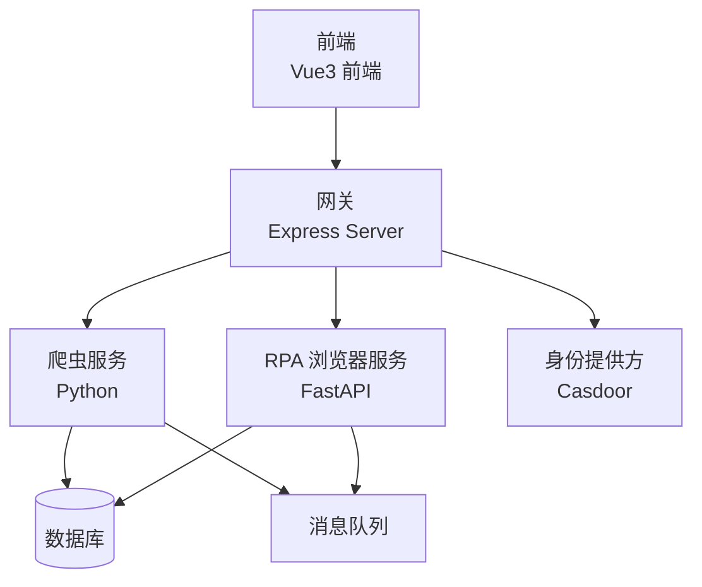
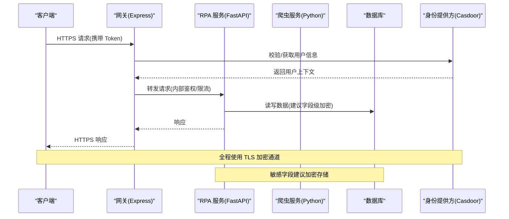
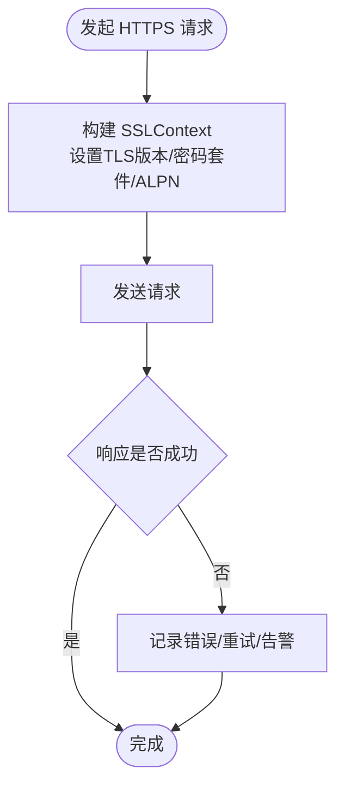
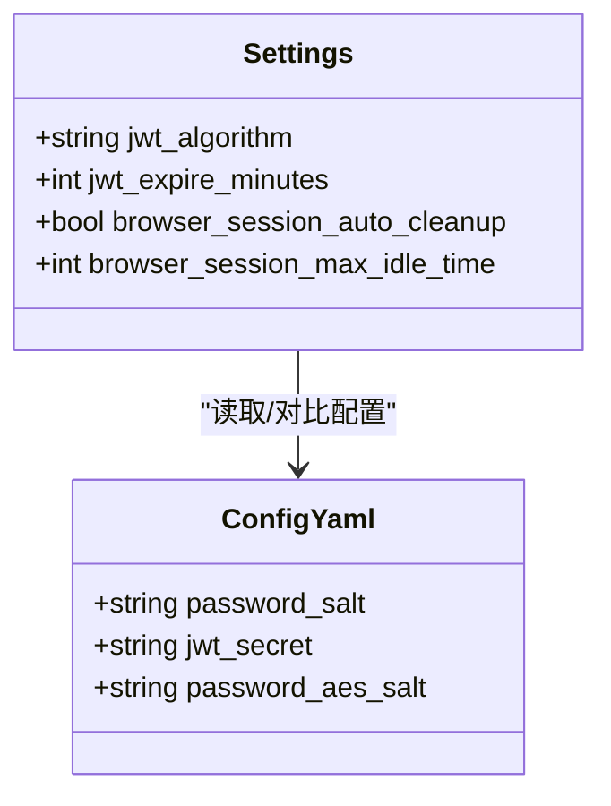
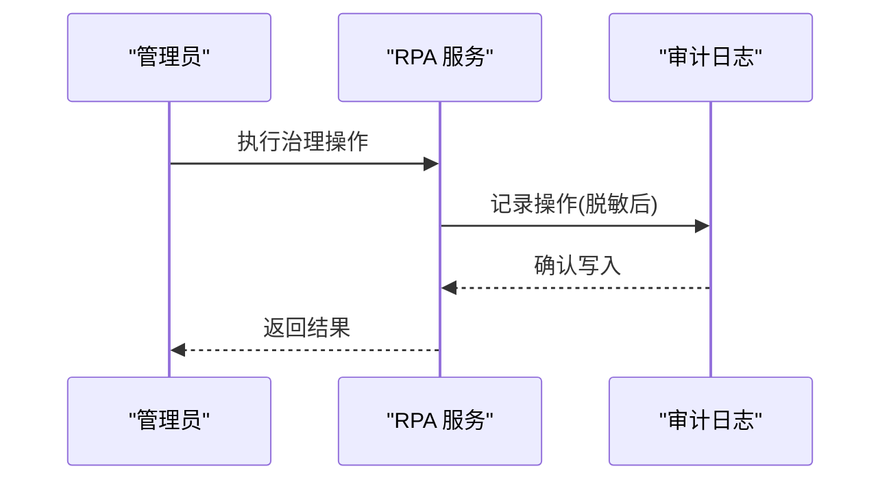
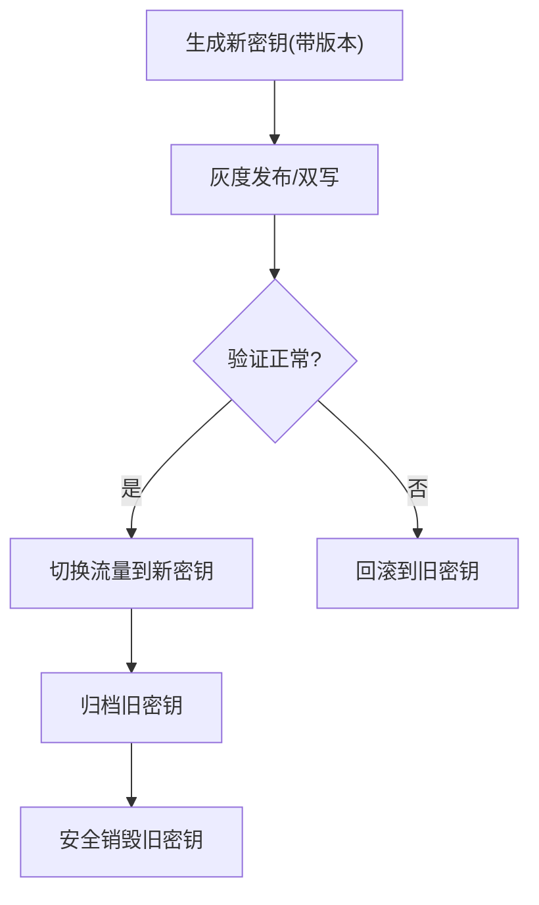
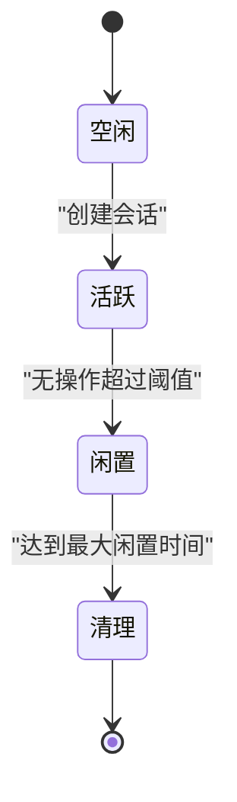
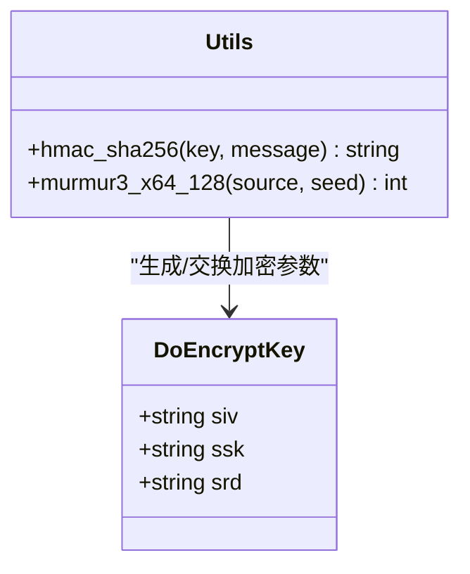
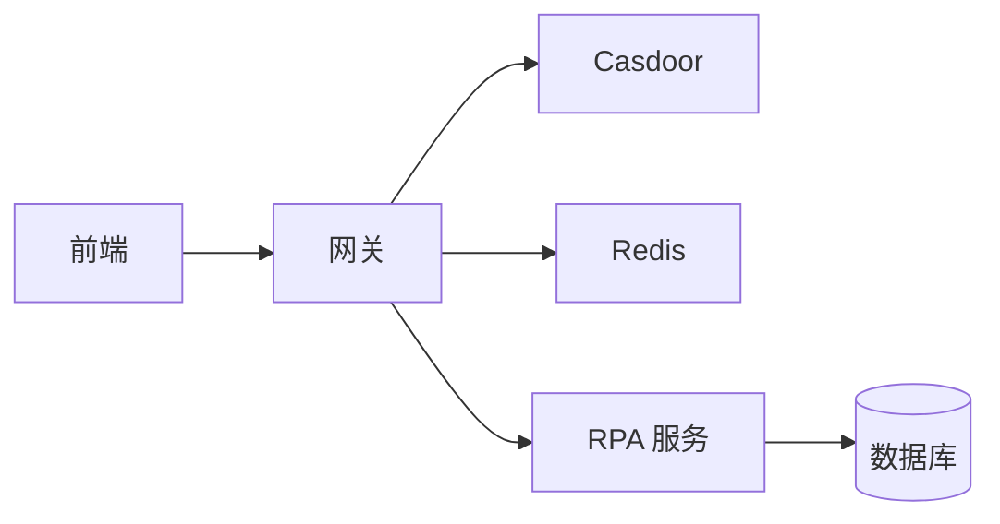

# 数据安全保护

<cite>
**本文引用的文件**
- [be-bilibili-crawler/Utils/加密/utils.py](file://be-bilibili-crawler/Utils/加密/utils.py)
- [be-bilibili-crawler/Utils/代理/SealedRequests.py](file://be-bilibili-crawler/Utils/代理/SealedRequests.py)
- [be-bilibili-crawler/Service/samsclub/tools/headers_gen.py](file://be-bilibili-crawler/Service/samsclub/tools/headers_gen.py)
- [unidbgSpringBoot/src/main/java/guanzhujiaran/unidbgspringboot/Model/api/app/samsclub/DoEncryptKey.java](file://unidbgSpringBoot/src/main/java/guanzhujiaran/unidbgspringboot/Model/api/app/samsclub/DoEncryptKey.java)
- [RPA-Browser/app/config.py](file://RPA-Browser/app/config.py)
- [be-gateway/ExpressServerEnd/config/config.yml](file://be-gateway/ExpressServerEnd/config/config.yml)
- [be-gateway/ExpressServerEnd/config/casdoor_config.js](file://be-gateway/ExpressServerEnd/config/casdoor_config.js)
- [Vue3FrontEndDemoExercise/src/api/bili_lottery_data/hey-api/core/auth.gen.ts](file://Vue3FrontEndDemoExercise/src/api/bili_lottery_data/hey-api/core/auth.gen.ts)
- [Vue3FrontEndDemoExercise/src/api/browser/hey-api/core/auth.gen.ts](file://Vue3FrontEndDemoExercise/src/api/browser/hey-api/core/auth.gen.ts)
- [Vue3FrontEndDemoExercise/src/api/community/hey-api/core/auth.gen.ts](file://Vue3FrontEndDemoExercise/src/api/community/hey-api/core/auth.gen.ts)
- [RPA-Browser/app/services/admin_audit.py](file://RPA-Browser/app/services/admin_audit.py)
- [RPA-Browser/app/models/database/log/models.py](file://RPA-Browser/app/models/database/log/models.py)
- [be-gateway/ExpressServerEnd/DAO/Redis/RedisManager.js](file://be-gateway/ExpressServerEnd/DAO/Redis/RedisManager.js)
</cite>

## 目录
1. [简介](#简介)
2. [项目结构](#项目结构)
3. [核心组件](#核心组件)
4. [架构总览](#架构总览)
5. [详细组件分析](#详细组件分析)
6. [依赖关系分析](#依赖关系分析)
7. [性能考虑](#性能考虑)
8. [故障排查指南](#故障排查指南)
9. [结论](#结论)
10. [附录](#附录)

## 简介
本文件面向本项目的数据安全保护，覆盖传输加密、存储加密、敏感信息脱敏与密钥管理四大主题，并结合现有代码给出落地方案与改进建议。重点包括：
- 传输层：HTTPS/TLS 配置、HTTP 客户端密码套件限制、认证令牌传递方式
- 存储层：数据库字段级加密、配置文件与密钥保护、日志与审计数据脱敏
- 内存安全：会话与临时数据清理策略
- 密钥管理：算法选择、轮换策略与生命周期管理
- 合规与销毁：隐私合规要点、数据销毁流程与可观测性

## 项目结构
从安全视角看，本项目涉及多语言服务（Python、Node.js、Java）与前端工程，关键安全能力分布如下：
- Python 爬虫与服务：提供 HTTP 客户端 TLS 加固、加解密工具、WBI 签名相关逻辑
- RPA 浏览器服务：JWT 配置、会话清理策略、管理员操作审计
- 网关（Node.js）：集中式配置（含盐值、JWT Secret）、第三方身份集成（Casdoor）
- 前端：统一生成鉴权头注入逻辑（Bearer/Basic）
- Java 子模块：定义加密密钥数据结构（siv/ssk/srd），用于与上游系统对接

**图示来源**
- [be-gateway/ExpressServerEnd/config/config.yml:1-29](file://be-gateway/ExpressServerEnd/config/config.yml#L1-L29)
- [be-gateway/ExpressServerEnd/config/casdoor_config.js:1-18](file://be-gateway/ExpressServerEnd/config/casdoor_config.js#L1-L18)
- [RPA-Browser/app/config.py:140-174](file://RPA-Browser/app/config.py#L140-L174)
- [be-bilibili-crawler/Utils/代理/SealedRequests.py:76-82](file://be-bilibili-crawler/Utils/代理/SealedRequests.py#L76-L82)

**章节来源**
- [be-gateway/ExpressServerEnd/config/config.yml:1-29](file://be-gateway/ExpressServerEnd/config/config.yml#L1-L29)
- [RPA-Browser/app/config.py:140-174](file://RPA-Browser/app/config.py#L140-L174)
- [be-bilibili-crawler/Utils/代理/SealedRequests.py:76-82](file://be-bilibili-crawler/Utils/代理/SealedRequests.py#L76-L82)

## 核心组件
- 传输加密与协议控制
  - Python HTTP 客户端通过自定义 SSLContext 限定 TLS 版本与密码套件，并启用 ALPN h2
  - 前端统一使用 Bearer/Basic 鉴权头注入
- 存储加密与配置保护
  - 网关配置包含密码盐、JWT 密钥等敏感项；需迁移至外部密钥管理服务
  - RPA 服务 JWT 算法与过期时间可配置
- 敏感信息脱敏与审计
  - 管理员操作审计日志记录，便于追溯与合规
  - 日志采集长度与保留天数可配置，避免过度留存
- 内存数据清理
  - RPA 服务支持浏览器会话自动清理与闲置超时控制

**章节来源**
- [be-bilibili-crawler/Utils/代理/SealedRequests.py:76-82](file://be-bilibili-crawler/Utils/代理/SealedRequests.py#L76-L82)
- [Vue3FrontEndDemoExercise/src/api/bili_lottery_data/hey-api/core/auth.gen.ts:29-48](file://Vue3FrontEndDemoExercise/src/api/bili_lottery_data/hey-api/core/auth.gen.ts#L29-L48)
- [be-gateway/ExpressServerEnd/config/config.yml:1-29](file://be-gateway/ExpressServerEnd/config/config.yml#L1-L29)
- [RPA-Browser/app/config.py:140-174](file://RPA-Browser/app/config.py#L140-L174)
- [RPA-Browser/app/services/admin_audit.py:13-43](file://RPA-Browser/app/services/admin_audit.py#L13-L43)

## 架构总览
下图展示请求在网关、后端服务与外部依赖之间的流转，以及安全控制点（TLS、鉴权、审计）。

**图示来源**
- [be-gateway/ExpressServerEnd/config/casdoor_config.js:1-18](file://be-gateway/ExpressServerEnd/config/casdoor_config.js#L1-L18)
- [RPA-Browser/app/config.py:140-174](file://RPA-Browser/app/config.py#L140-L174)
- [be-bilibili-crawler/Utils/代理/SealedRequests.py:76-82](file://be-bilibili-crawler/Utils/代理/SealedRequests.py#L76-L82)

## 详细组件分析

### 传输加密与协议控制
- Python 客户端 TLS 加固
  - 通过 SSLContext 设置最小/最大 TLS 版本，限定密码套件，禁用不安全算法，启用 ALPN h2
  - 适用于对外部服务的 HTTPS 调用，降低降级攻击风险
- 前端鉴权头注入
  - 自动生成 Authorization 头，支持 Bearer/Basic 两种方案
  - 确保所有 API 调用均携带必要凭据，减少未授权访问面

**图示来源**
- [be-bilibili-crawler/Utils/代理/SealedRequests.py:76-82](file://be-bilibili-crawler/Utils/代理/SealedRequests.py#L76-L82)
- [Vue3FrontEndDemoExercise/src/api/browser/hey-api/core/auth.gen.ts:29-48](file://Vue3FrontEndDemoExercise/src/api/browser/hey-api/core/auth.gen.ts#L29-L48)

**章节来源**
- [be-bilibili-crawler/Utils/代理/SealedRequests.py:76-82](file://be-bilibili-crawler/Utils/代理/SealedRequests.py#L76-L82)
- [Vue3FrontEndDemoExercise/src/api/bili_lottery_data/hey-api/core/auth.gen.ts:29-48](file://Vue3FrontEndDemoExercise/src/api/bili_lottery_data/hey-api/core/auth.gen.ts#L29-L48)
- [Vue3FrontEndDemoExercise/src/api/community/hey-api/core/auth.gen.ts:29-48](file://Vue3FrontEndDemoExercise/src/api/community/hey-api/core/auth.gen.ts#L29-L48)

### 存储加密与配置保护
- 配置中的敏感项
  - 网关配置包含密码盐、JWT 密钥等，当前以明文形式存在配置文件
  - 建议迁移至环境变量或密钥管理服务（如 KMS/Secrets Manager），并在启动时动态加载
- JWT 配置
  - RPA 服务支持配置 JWT 算法与过期时间，应结合业务需求选择合适的算法与有效期
- 数据库字段加密
  - 建议在模型层对敏感字段进行加密后再持久化，读取时再解密
  - 可参考现有加解密工具类，扩展为统一的字段级加密中间件

**图示来源**
- [RPA-Browser/app/config.py:140-174](file://RPA-Browser/app/config.py#L140-L174)
- [be-gateway/ExpressServerEnd/config/config.yml:1-29](file://be-gateway/ExpressServerEnd/config/config.yml#L1-L29)

**章节来源**
- [be-gateway/ExpressServerEnd/config/config.yml:1-29](file://be-gateway/ExpressServerEnd/config/config.yml#L1-L29)
- [RPA-Browser/app/config.py:140-174](file://RPA-Browser/app/config.py#L140-L174)

### 敏感信息脱敏与审计
- 管理员操作审计
  - 记录管理员动作、目标类型、目标 ID 与详情，便于追踪与合规审查
  - 写入失败仅告警，不影响主业务流程，保证可用性
- 日志采集与保留
  - 可配置日志载荷长度与默认保留天数，避免长期留存敏感信息
- Redis 连接配置
  - 网关侧 Redis 连接信息通过环境变量注入，避免硬编码

**图示来源**
- [RPA-Browser/app/services/admin_audit.py:13-43](file://RPA-Browser/app/services/admin_audit.py#L13-L43)
- [RPA-Browser/app/models/database/log/models.py](file://RPA-Browser/app/models/database/log/models.py)
- [be-gateway/ExpressServerEnd/DAO/Redis/RedisManager.js:1-21](file://be-gateway/ExpressServerEnd/DAO/Redis/RedisManager.js#L1-L21)

**章节来源**
- [RPA-Browser/app/services/admin_audit.py:13-43](file://RPA-Browser/app/services/admin_audit.py#L13-L43)
- [RPA-Browser/app/models/database/log/models.py](file://RPA-Browser/app/models/database/log/models.py)
- [be-gateway/ExpressServerEnd/DAO/Redis/RedisManager.js:1-21](file://be-gateway/ExpressServerEnd/DAO/Redis/RedisManager.js#L1-L21)

### 密钥管理与轮换
- 算法选择
  - JWT 算法与过期时间在 RPA 服务中可配置，建议采用强算法（如 RS256/ES256）并合理设置有效期
  - 对外部 HTTPS 调用强制高版本 TLS 与强密码套件
- 密钥轮换
  - 建议引入密钥版本标识（如 key_id），支持多版本并存与平滑切换
  - 对于对称加密（如 AES-GCM），实现“读旧写新”的过渡期策略
- 生命周期管理
  - 密钥生成、分发、轮换、归档与销毁应有明确流程与审计记录
  - 配置文件中的敏感项应从静态文件迁移至运行时注入

**章节来源**
- [RPA-Browser/app/config.py:140-174](file://RPA-Browser/app/config.py#L140-L174)
- [be-bilibili-crawler/Utils/代理/SealedRequests.py:76-82](file://be-bilibili-crawler/Utils/代理/SealedRequests.py#L76-L82)

### 内存数据清理与会话管理
- 浏览器会话清理
  - RPA 服务支持自动清理闲置会话、设置最大闲置时间与检查间隔，防止内存泄漏与敏感数据残留
- 临时数据清理
  - 建议在处理完成后立即释放临时对象，避免在内存中长期驻留敏感信息

**图示来源**
- [RPA-Browser/app/config.py:190-194](file://RPA-Browser/app/config.py#L190-L194)

**章节来源**
- [RPA-Browser/app/config.py:190-194](file://RPA-Browser/app/config.py#L190-L194)

### 加密算法与第三方对接
- WBI 签名与指纹
  - 提供 HMAC-SHA256、MurmurHash3 等工具函数，用于生成签名与指纹
- DoEncryptKey 结构
  - Java 端定义了 siv/ssk/srd 字段，用于与上游系统对接加密参数

**图示来源**
- [be-bilibili-crawler/Utils/加密/utils.py:124-144](file://be-bilibili-crawler/Utils/加密/utils.py#L124-L144)
- [be-bilibili-crawler/Utils/加密/utils.py:39-121](file://be-bilibili-crawler/Utils/加密/utils.py#L39-L121)
- [unidbgSpringBoot/src/main/java/guanzhujiaran/unidbgspringboot/Model/api/app/samsclub/DoEncryptKey.java:1-10](file://unidbgSpringBoot/src/main/java/guanzhujiaran/unidbgspringboot/Model/api/app/samsclub/DoEncryptKey.java#L1-L10)

**章节来源**
- [be-bilibili-crawler/Utils/加密/utils.py:39-121](file://be-bilibili-crawler/Utils/加密/utils.py#L39-L121)
- [be-bilibili-crawler/Utils/加密/utils.py:124-144](file://be-bilibili-crawler/Utils/加密/utils.py#L124-L144)
- [unidbgSpringBoot/src/main/java/guanzhujiaran/unidbgspringboot/Model/api/app/samsclub/DoEncryptKey.java:1-10](file://unidbgSpringBoot/src/main/java/guanzhujiaran/unidbgspringboot/Model/api/app/samsclub/DoEncryptKey.java#L1-L10)

## 依赖关系分析
- 网关与身份提供方
  - Casdoor 配置通过环境变量注入，支持证书与组织/应用名等参数
- 网关与缓存
  - Redis 连接通过环境变量注入，避免硬编码敏感信息
- 前端与后端
  - 前端统一注入 Authorization 头，后端基于 JWT 进行鉴权

**图示来源**
- [be-gateway/ExpressServerEnd/config/casdoor_config.js:1-18](file://be-gateway/ExpressServerEnd/config/casdoor_config.js#L1-L18)
- [be-gateway/ExpressServerEnd/DAO/Redis/RedisManager.js:1-21](file://be-gateway/ExpressServerEnd/DAO/Redis/RedisManager.js#L1-L21)
- [Vue3FrontEndDemoExercise/src/api/browser/hey-api/core/auth.gen.ts:29-48](file://Vue3FrontEndDemoExercise/src/api/browser/hey-api/core/auth.gen.ts#L29-L48)

**章节来源**
- [be-gateway/ExpressServerEnd/config/casdoor_config.js:1-18](file://be-gateway/ExpressServerEnd/config/casdoor_config.js#L1-L18)
- [be-gateway/ExpressServerEnd/DAO/Redis/RedisManager.js:1-21](file://be-gateway/ExpressServerEnd/DAO/Redis/RedisManager.js#L1-L21)
- [Vue3FrontEndDemoExercise/src/api/browser/hey-api/core/auth.gen.ts:29-48](file://Vue3FrontEndDemoExercise/src/api/browser/hey-api/core/auth.gen.ts#L29-L48)

## 性能考虑
- TLS 握手开销
  - 在高并发场景下，合理复用连接池与会话缓存可降低握手成本
- 加密计算
  - 字段级加密应在 I/O 密集路径之外执行，避免阻塞主线程
- 日志与审计
  - 控制日志粒度与保留周期，避免磁盘与查询压力过大

## 故障排查指南
- 传输层问题
  - 检查 TLS 版本与密码套件是否匹配，确认 ALPN 协商成功
- 鉴权失败
  - 核对前端 Authorization 头是否正确注入，后端 JWT 算法与密钥是否一致
- 配置问题
  - 确认环境变量已正确注入（如 Redis、Casdoor），避免空值导致异常
- 审计写入失败
  - 审计写入失败仅告警，不影响主流程；检查数据库连接与权限

**章节来源**
- [be-bilibili-crawler/Utils/代理/SealedRequests.py:76-82](file://be-bilibili-crawler/Utils/代理/SealedRequests.py#L76-L82)
- [Vue3FrontEndDemoExercise/src/api/bili_lottery_data/hey-api/core/auth.gen.ts:29-48](file://Vue3FrontEndDemoExercise/src/api/bili_lottery_data/hey-api/core/auth.gen.ts#L29-L48)
- [be-gateway/ExpressServerEnd/DAO/Redis/RedisManager.js:1-21](file://be-gateway/ExpressServerEnd/DAO/Redis/RedisManager.js#L1-L21)
- [RPA-Browser/app/services/admin_audit.py:13-43](file://RPA-Browser/app/services/admin_audit.py#L13-L43)

## 结论
本项目在传输加密、鉴权注入、会话清理与审计方面已有基础实现。下一步建议：
- 将配置文件中的敏感项迁移至环境变量或密钥管理服务，实现密钥轮换与生命周期管理
- 在模型层引入字段级加密，统一加解密入口，确保敏感数据落库前加密
- 完善日志脱敏策略，严格控制日志留存周期
- 建立密钥轮换流程与审计机制，满足隐私合规要求

## 附录
- 术语
  - TLS：传输层安全协议
  - JWT：JSON Web Token
  - KMS：密钥管理服务
- 参考实现位置
  - 传输加密：[be-bilibili-crawler/Utils/代理/SealedRequests.py](file://be-bilibili-crawler/Utils/代理/SealedRequests.py)
  - 鉴权头注入：[Vue3FrontEndDemoExercise/src/api/*/hey-api/core/auth.gen.ts](file://Vue3FrontEndDemoExercise/src/api/browser/hey-api/core/auth.gen.ts)
  - 配置与密钥：[be-gateway/ExpressServerEnd/config/config.yml](file://be-gateway/ExpressServerEnd/config/config.yml)、[RPA-Browser/app/config.py](file://RPA-Browser/app/config.py)
  - 审计日志：[RPA-Browser/app/services/admin_audit.py](file://RPA-Browser/app/services/admin_audit.py)