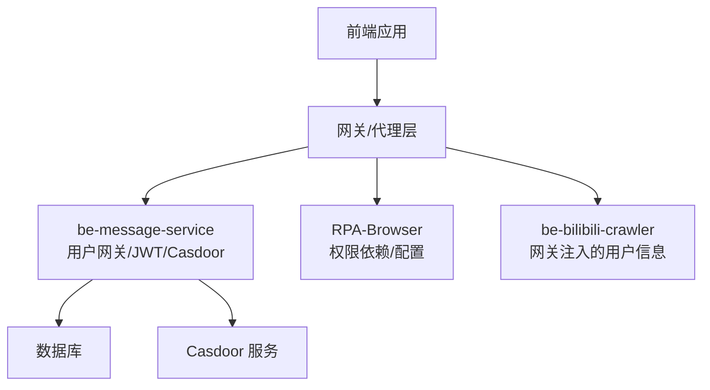
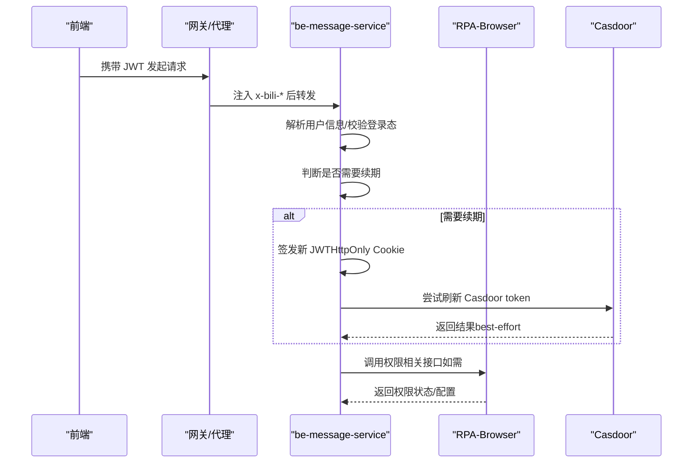
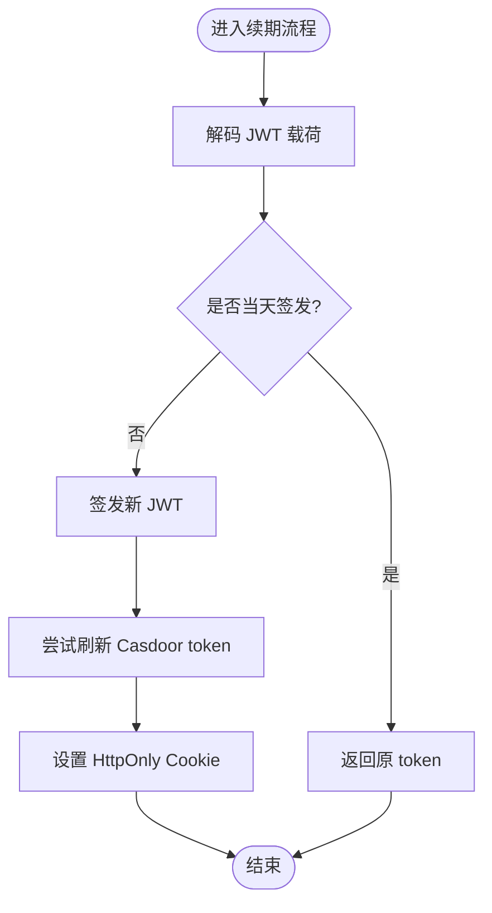
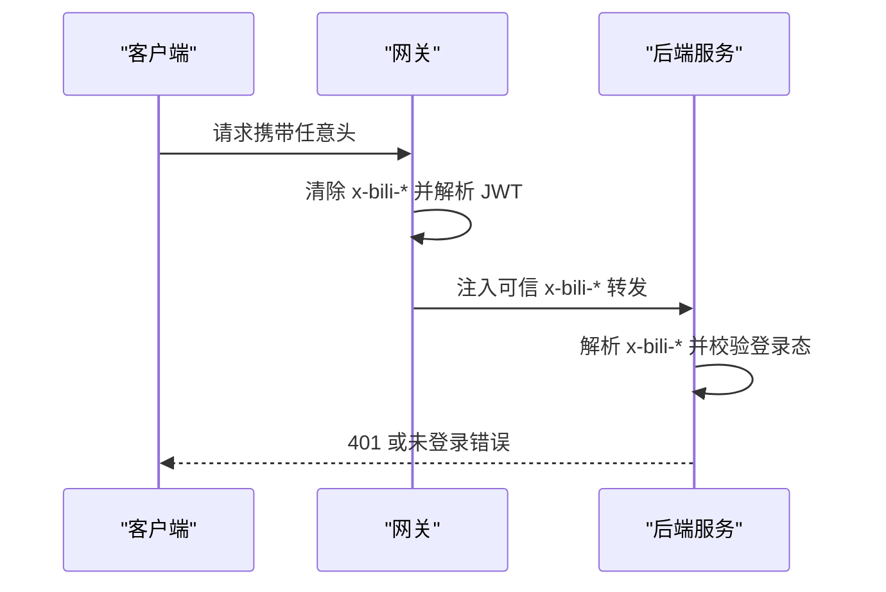
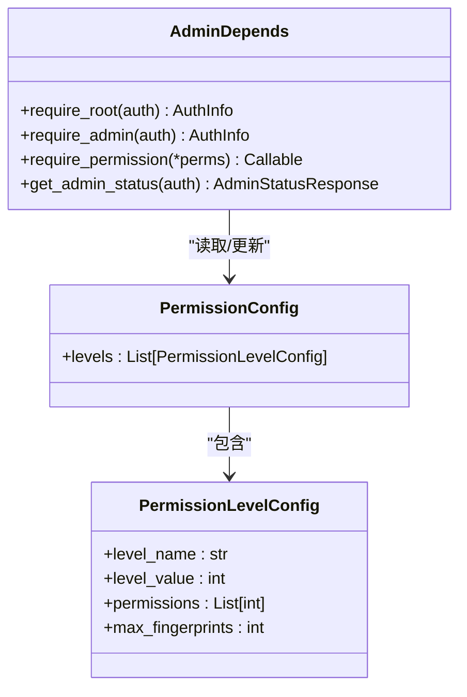
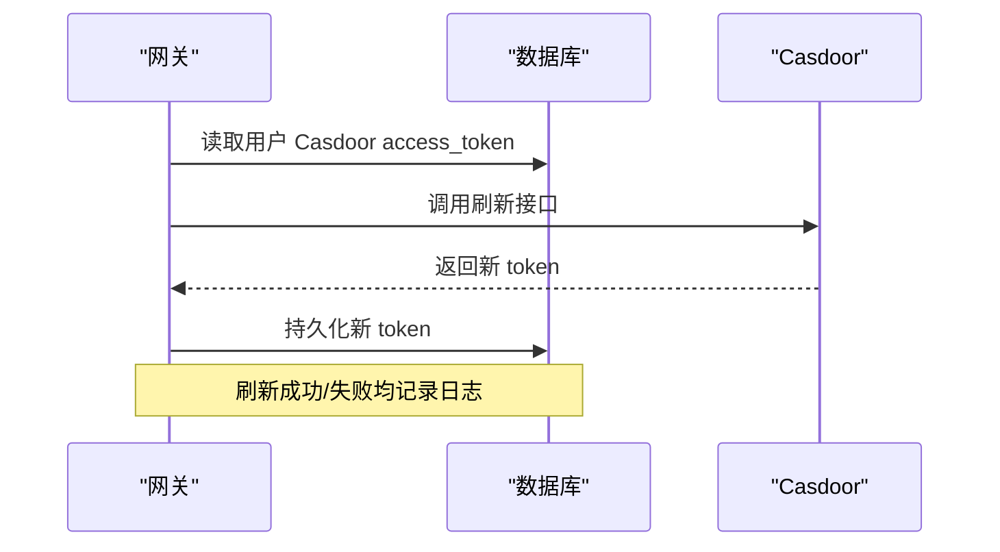
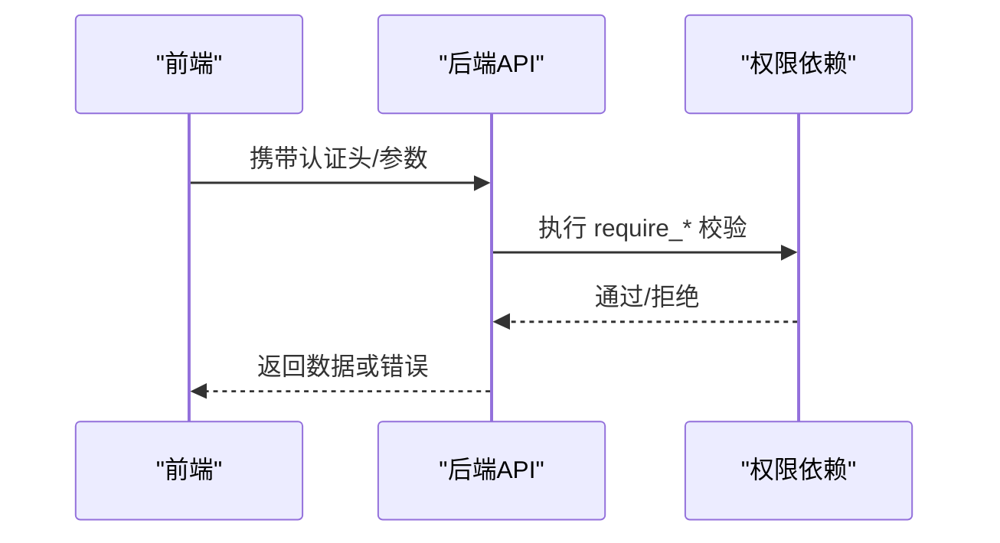
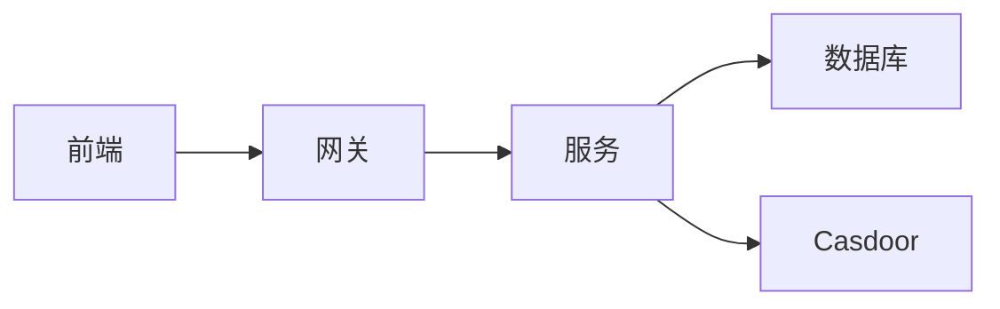

# 认证授权机制

<cite>
**本文引用的文件**
- [be-message-service/app/api/pptr_user_gateway.py](file://be-message-service/app/api/pptr_user_gateway.py)
- [be-message-service/app/services/infrastructure/jwt_service.py](file://be-message-service/app/services/infrastructure/jwt_service.py)
- [RPA-Browser/app/utils/depends/admin_depends.py](file://RPA-Browser/app/utils/depends/admin_depends.py)
- [RPA-Browser/app/controller/v1/admin/permission_router.py](file://RPA-Browser/app/controller/v1/admin/permission_router.py)
- [RPA-Browser/app/models/system/permission.py](file://RPA-Browser/app/models/system/permission.py)
- [be-bilibili-crawler/Utils/网关/gateway_auth.py](file://be-bilibili-crawler/Utils/网关/gateway_auth.py)
- [be-gateway/ExpressServerEnd/Service/casdoor_module/CasdoorService.js](file://be-gateway/ExpressServerEnd/Service/casdoor_module/CasdoorService.js)
- [Vue3FrontEndDemoExercise/src/api/community/hey-api/core/auth.gen.ts](file://Vue3FrontEndDemoExercise/src/api/community/hey-api/core/auth.gen.ts)
</cite>

## 目录
1. [简介](#简介)
2. [项目结构](#项目结构)
3. [核心组件](#核心组件)
4. [架构总览](#架构总览)
5. [详细组件分析](#详细组件分析)
6. [依赖关系分析](#依赖关系分析)
7. [性能考虑](#性能考虑)
8. [故障排查指南](#故障排查指南)
9. [结论](#结论)
10. [附录](#附录)

## 简介
本文件面向多服务、前后端分离的认证与授权体系，覆盖以下主题：
- JWT 令牌签发、续期与刷新
- 用户身份验证（网关可信头注入）
- 权限控制模型（角色、细粒度权限、RBAC/ABAC 结合）
- 会话管理（浏览器会话生命周期与清理策略）
- Casdoor 集成（OAuth token 同步刷新）
- API 访问控制（网关前置校验 + 服务内依赖）
- 审计日志记录（通过统一异常与日志输出）
- 多租户隔离、权限继承与动态权限分配的实现思路

## 项目结构
本项目在多个子服务中实现认证授权能力：
- be-message-service：承载用户网关接口、JWT 签发与续期、Casdoor token 同步刷新。
- RPA-Browser：提供管理员权限配置与细粒度权限检查依赖。
- be-bilibili-crawler：提供网关侧可信用户信息解析依赖（x-bili-*）。
- be-gateway：负责 Casdoor OAuth 流程与 token 刷新。
- Vue3 前端：OpenAPI 生成的鉴权工具，用于携带 Bearer 或 Cookie 等认证信息。

图表来源
- [be-message-service/app/api/pptr_user_gateway.py:744-784](file://be-message-service/app/api/pptr_user_gateway.py#L744-L784)
- [RPA-Browser/app/utils/depends/admin_depends.py:39-92](file://RPA-Browser/app/utils/depends/admin_depends.py#L39-L92)
- [be-bilibili-crawler/Utils/网关/gateway_auth.py:64-122](file://be-bilibili-crawler/Utils/网关/gateway_auth.py#L64-L122)
- [be-gateway/ExpressServerEnd/Service/casdoor_module/CasdoorService.js:349-415](file://be-gateway/ExpressServerEnd/Service/casdoor_module/CasdoorService.js#L349-L415)

章节来源
- [be-message-service/app/api/pptr_user_gateway.py:744-784](file://be-message-service/app/api/pptr_user_gateway.py#L744-L784)
- [RPA-Browser/app/utils/depends/admin_depends.py:39-92](file://RPA-Browser/app/utils/depends/admin_depends.py#L39-L92)
- [be-bilibili-crawler/Utils/网关/gateway_auth.py:64-122](file://be-bilibili-crawler/Utils/网关/gateway_auth.py#L64-L122)
- [be-gateway/ExpressServerEnd/Service/casdoor_module/CasdoorService.js:349-415](file://be-gateway/ExpressServerEnd/Service/casdoor_module/CasdoorService.js#L349-L415)

## 核心组件
- JWT 服务：负责签发、解码与“是否需续期”的判断逻辑，载荷包含用户名、UID、等级、角色及时间戳。
- 用户网关：提供 JWT 续期与刷新接口，并在续期时尝试同步刷新 Casdoor OAuth token。
- 网关注入用户信息：后端通过 x-bili-* 请求头获取可信登录态，未登录返回 401。
- 权限依赖：提供 require_root、require_admin、require_permission 等依赖，支持 root 与数据库中的细粒度权限。
- 权限配置：管理员可获取/更新/重置权限配置，定义等级与权限映射。
- Casdoor 集成：网关侧刷新并持久化用户级 access_token，服务侧按需读取以“用户调用”方式查询 Casdoor 信息。
- 前端鉴权：OpenAPI 生成器提供 Bearer/Basic/ApiKey 等方案封装，便于统一携带认证信息。

章节来源
- [be-message-service/app/services/infrastructure/jwt_service.py:20-89](file://be-message-service/app/services/infrastructure/jwt_service.py#L20-L89)
- [be-message-service/app/api/pptr_user_gateway.py:744-825](file://be-message-service/app/api/pptr_user_gateway.py#L744-L825)
- [be-bilibili-crawler/Utils/网关/gateway_auth.py:64-122](file://be-bilibili-crawler/Utils/网关/gateway_auth.py#L64-L122)
- [RPA-Browser/app/utils/depends/admin_depends.py:39-92](file://RPA-Browser/app/utils/depends/admin_depends.py#L39-L92)
- [RPA-Browser/app/controller/v1/admin/permission_router.py:14-77](file://RPA-Browser/app/controller/v1/admin/permission_router.py#L14-L77)
- [RPA-Browser/app/models/system/permission.py:9-30](file://RPA-Browser/app/models/system/permission.py#L9-L30)
- [be-gateway/ExpressServerEnd/Service/casdoor_module/CasdoorService.js:349-415](file://be-gateway/ExpressServerEnd/Service/casdoor_module/CasdoorService.js#L349-L415)
- [Vue3FrontEndDemoExercise/src/api/community/hey-api/core/auth.gen.ts:1-48](file://Vue3FrontEndDemoExercise/src/api/community/hey-api/core/auth.gen.ts#L1-L48)

## 架构总览
整体认证授权链路如下：
- 前端登录后获得 JWT，后续请求由网关校验并注入可信 x-bili-* 头。
- 后端服务从请求头解析用户身份；受保护接口使用依赖进行角色/权限校验。
- 当 JWT 非当天签发时，触发续期流程；同时尝试刷新 Casdoor OAuth token。
- 管理员权限通过数据库中的细粒度权限列表控制，支持 root 全量权限。
- 浏览器会话具备过期时间与自动清理策略，确保资源回收。

图表来源
- [be-message-service/app/api/pptr_user_gateway.py:744-825](file://be-message-service/app/api/pptr_user_gateway.py#L744-L825)
- [be-message-service/app/services/infrastructure/jwt_service.py:20-89](file://be-message-service/app/services/infrastructure/jwt_service.py#L20-L89)
- [be-gateway/ExpressServerEnd/Service/casdoor_module/CasdoorService.js:349-415](file://be-gateway/ExpressServerEnd/Service/casdoor_module/CasdoorService.js#L349-L415)

## 详细组件分析

### JWT 令牌管理与续期
- 签发：使用 HS256 算法，载荷包含 user_name、uid、level、role、iat、exp，有效期由配置决定。
- 解码：仅解析载荷，验签由网关 jwtAuth 中间件完成；允许对过期 token 读取 iat 做续期判断。
- 续期：若 token 非当天签发则签发新 token，并通过 HttpOnly Cookie 下发，避免 XSS 风险。
- 刷新：刷新接口会重新读取用户最新信息（含 level/role），签发新 token 并尝试刷新 Casdoor token。

图表来源
- [be-message-service/app/services/infrastructure/jwt_service.py:20-89](file://be-message-service/app/services/infrastructure/jwt_service.py#L20-L89)
- [be-message-service/app/api/pptr_user_gateway.py:744-784](file://be-message-service/app/api/pptr_user_gateway.py#L744-L784)

章节来源
- [be-message-service/app/services/infrastructure/jwt_service.py:20-89](file://be-message-service/app/services/infrastructure/jwt_service.py#L20-L89)
- [be-message-service/app/api/pptr_user_gateway.py:744-784](file://be-message-service/app/api/pptr_user_gateway.py#L744-L784)

### 用户身份验证（网关可信头）
- 网关清除客户端不可信头，根据 JWT 解析出的身份重新注入 x-bili-* 头。
- 后端依赖解析这些头，mid 为空表示未登录，抛出 401。
- 该机制确保后端只信任网关注入的身份信息，防止伪造。

图表来源
- [be-bilibili-crawler/Utils/网关/gateway_auth.py:64-122](file://be-bilibili-crawler/Utils/网关/gateway_auth.py#L64-L122)

章节来源
- [be-bilibili-crawler/Utils/网关/gateway_auth.py:64-122](file://be-bilibili-crawler/Utils/网关/gateway_auth.py#L64-L122)

### 权限控制模型（角色与细粒度权限）
- 角色模型：root 拥有最高权限；普通管理员需满足数据库中的细粒度权限。
- 依赖工厂：require_root、require_admin、require_permission 提供声明式权限校验。
- 权限配置：管理员可通过 API 获取/更新/重置权限配置，定义等级与权限映射。
- 权限继承：root 直接视为拥有全部权限；管理员按数据库 permissions 列表判定。

图表来源
- [RPA-Browser/app/utils/depends/admin_depends.py:39-92](file://RPA-Browser/app/utils/depends/admin_depends.py#L39-L92)
- [RPA-Browser/app/models/system/permission.py:9-30](file://RPA-Browser/app/models/system/permission.py#L9-L30)
- [RPA-Browser/app/controller/v1/admin/permission_router.py:14-77](file://RPA-Browser/app/controller/v1/admin/permission_router.py#L14-L77)

章节来源
- [RPA-Browser/app/utils/depends/admin_depends.py:39-92](file://RPA-Browser/app/utils/depends/admin_depends.py#L39-L92)
- [RPA-Browser/app/controller/v1/admin/permission_router.py:14-77](file://RPA-Browser/app/controller/v1/admin/permission_router.py#L14-L77)
- [RPA-Browser/app/models/system/permission.py:9-30](file://RPA-Browser/app/models/system/permission.py#L9-L30)

### Casdoor 集成与会话管理
- 网关侧刷新 Casdoor token：从数据库取出用户级 access_token，调用 Casdoor 刷新接口并持久化。
- 服务侧获取 Casdoor 用户信息：优先以“用户调用”方式携带用户自己的 token 查询；若无有效 token 则回退为 service 调用。
- 会话管理：浏览器会话具备过期时间与自动清理策略，支持最大空闲时间与清理间隔配置。

图表来源
- [be-gateway/ExpressServerEnd/Service/casdoor_module/CasdoorService.js:349-415](file://be-gateway/ExpressServerEnd/Service/casdoor_module/CasdoorService.js#L349-L415)

章节来源
- [be-gateway/ExpressServerEnd/Service/casdoor_module/CasdoorService.js:349-415](file://be-gateway/ExpressServerEnd/Service/casdoor_module/CasdoorService.js#L349-L415)
- [be-message-service/app/api/pptr_user_gateway.py:744-825](file://be-message-service/app/api/pptr_user_gateway.py#L744-L825)

### API 访问控制与前端鉴权
- 前端 OpenAPI 生成器提供 getAuthToken，支持 Bearer/Basic/ApiKey 等方案，便于统一携带认证信息。
- 后端通过依赖注入进行访问控制，未通过校验返回 401/403。
- 管理员权限配置接口提供权限的动态调整能力。

图表来源
- [Vue3FrontEndDemoExercise/src/api/community/hey-api/core/auth.gen.ts:1-48](file://Vue3FrontEndDemoExercise/src/api/community/hey-api/core/auth.gen.ts#L1-L48)
- [RPA-Browser/app/utils/depends/admin_depends.py:39-92](file://RPA-Browser/app/utils/depends/admin_depends.py#L39-L92)

章节来源
- [Vue3FrontEndDemoExercise/src/api/community/hey-api/core/auth.gen.ts:1-48](file://Vue3FrontEndDemoExercise/src/api/community/hey-api/core/auth.gen.ts#L1-L48)
- [RPA-Browser/app/utils/depends/admin_depends.py:39-92](file://RPA-Browser/app/utils/depends/admin_depends.py#L39-L92)

## 依赖关系分析
- 网关到服务：网关负责 JWT 验签与 x-bili-* 注入；服务依赖这些头进行身份识别。
- 服务到数据库：权限配置、管理员信息、浏览器会话状态等存储在数据库中。
- 服务到 Casdoor：刷新与查询用户信息，采用 best-effort 策略，不影响主流程。
- 前端到网关/服务：通过 OpenAPI 生成器统一携带认证信息。

图表来源
- [be-bilibili-crawler/Utils/网关/gateway_auth.py:64-122](file://be-bilibili-crawler/Utils/网关/gateway_auth.py#L64-L122)
- [be-message-service/app/api/pptr_user_gateway.py:744-825](file://be-message-service/app/api/pptr_user_gateway.py#L744-L825)
- [be-gateway/ExpressServerEnd/Service/casdoor_module/CasdoorService.js:349-415](file://be-gateway/ExpressServerEnd/Service/casdoor_module/CasdoorService.js#L349-L415)

章节来源
- [be-bilibili-crawler/Utils/网关/gateway_auth.py:64-122](file://be-bilibili-crawler/Utils/网关/gateway_auth.py#L64-L122)
- [be-message-service/app/api/pptr_user_gateway.py:744-825](file://be-message-service/app/api/pptr_user_gateway.py#L744-L825)
- [be-gateway/ExpressServerEnd/Service/casdoor_module/CasdoorService.js:349-415](file://be-gateway/ExpressServerEnd/Service/casdoor_module/CasdoorService.js#L349-L415)

## 性能考虑
- JWT 续期仅在非当天签发时触发，减少不必要的签发开销。
- Casdoor token 刷新采用 best-effort，失败不影响 JWT 续期主流程。
- 浏览器会话具备过期时间与自动清理策略，避免资源长期占用。
- 权限检查基于内存中的依赖与数据库查询，建议缓存高频权限配置以降低数据库压力。

## 故障排查指南
- 401 未登录：检查网关是否正确注入 x-bili-* 头，确认 mid 是否为空。
- 403 权限不足：确认当前用户角色与数据库中的细粒度权限是否匹配。
- JWT 续期失败：检查 jwt_secret 与算法配置是否与网关一致；查看 iat/exp 字段。
- Casdoor 刷新失败：查看网关日志，确认 access_token 是否存在且有效；必要时回退为 service 调用。
- 浏览器会话未清理：检查自动清理配置与过期时间设置，确认清理任务是否执行。

章节来源
- [be-bilibili-crawler/Utils/网关/gateway_auth.py:88-122](file://be-bilibili-crawler/Utils/网关/gateway_auth.py#L88-L122)
- [RPA-Browser/app/utils/depends/admin_depends.py:39-92](file://RPA-Browser/app/utils/depends/admin_depends.py#L39-L92)
- [be-message-service/app/services/infrastructure/jwt_service.py:51-89](file://be-message-service/app/services/infrastructure/jwt_service.py#L51-L89)
- [be-gateway/ExpressServerEnd/Service/casdoor_module/CasdoorService.js:349-415](file://be-gateway/ExpressServerEnd/Service/casdoor_module/CasdoorService.js#L349-L415)

## 结论
本认证授权机制通过网关前置校验与服务内依赖组合，实现了安全的身份验证与灵活的权限控制。JWT 续期与 Casdoor token 同步刷新提升了用户体验与外部系统集成稳定性。管理员权限配置与浏览器会话管理提供了可扩展性与资源治理能力。未来可进一步引入更细粒度的 ABAC 策略与审计日志增强，以满足复杂业务场景需求。

## 附录
- 多租户隔离：建议在网关或服务层增加租户标识（如 x-bili-tenant），并在权限模型中扩展租户维度，确保数据与权限按租户隔离。
- 权限继承：root 拥有全部权限；管理员权限通过数据库 permissions 列表动态分配，支持继承与覆盖。
- 动态权限分配：通过管理员权限配置接口实时更新权限，前端根据权限状态动态展示功能入口。
- 审计日志：所有权限校验失败与关键操作均记录日志，便于追踪与分析。