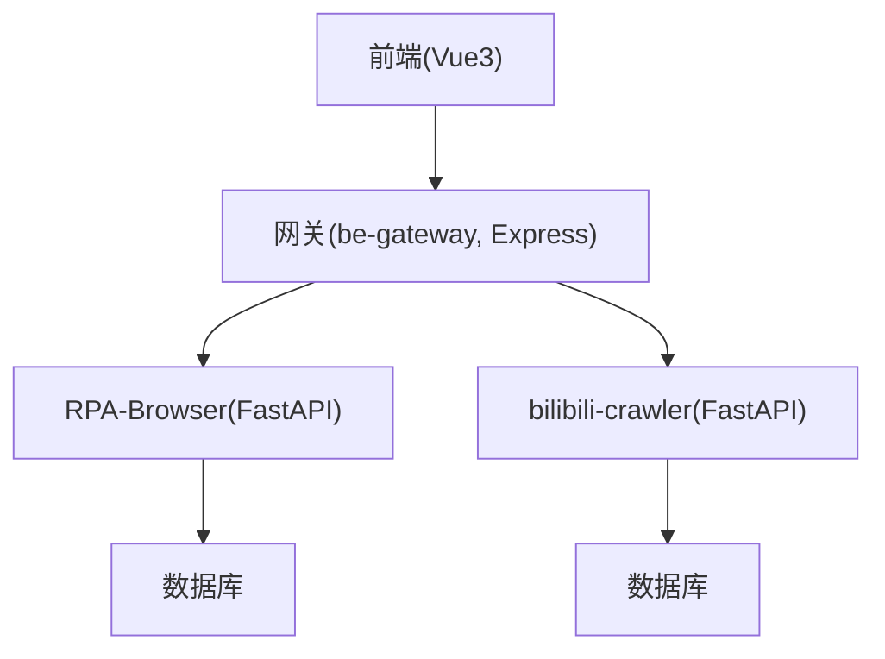
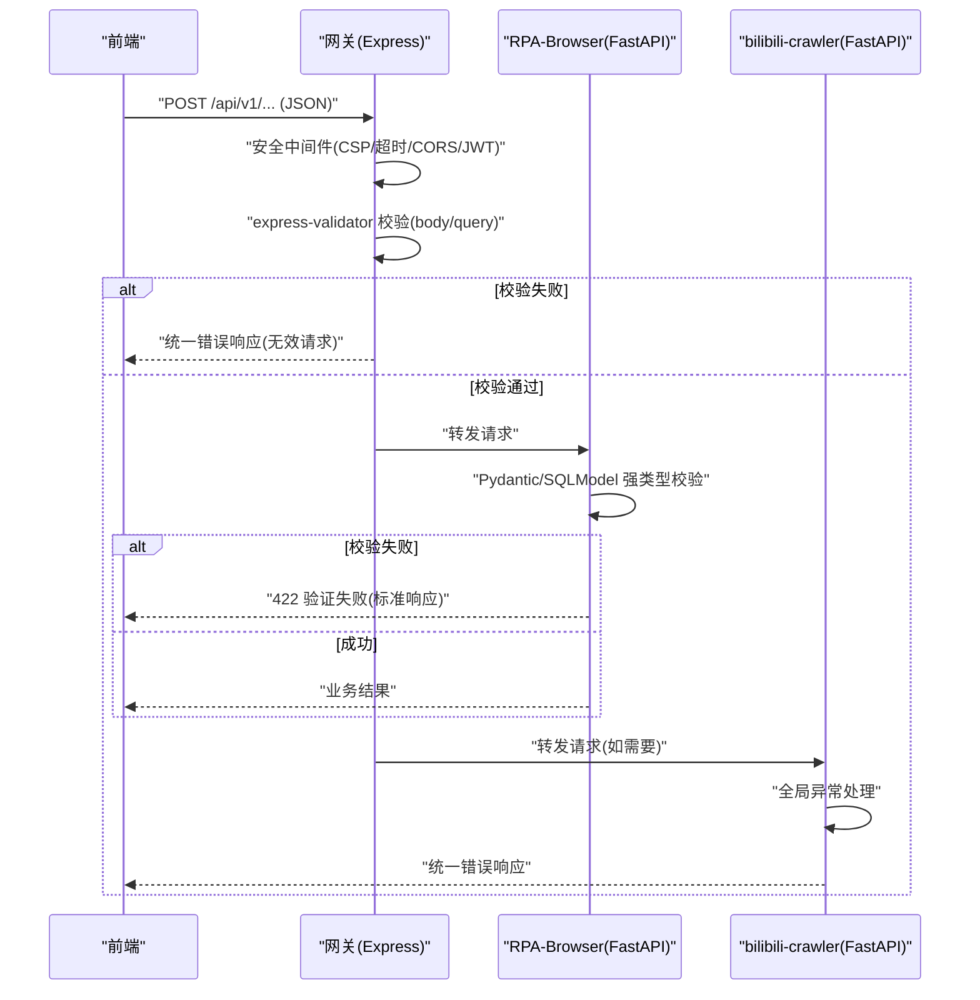
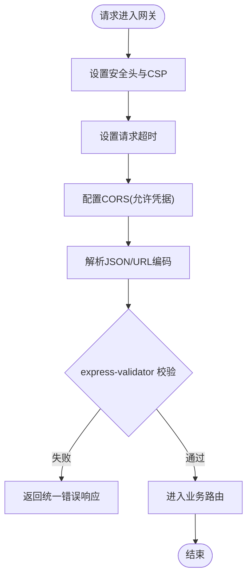
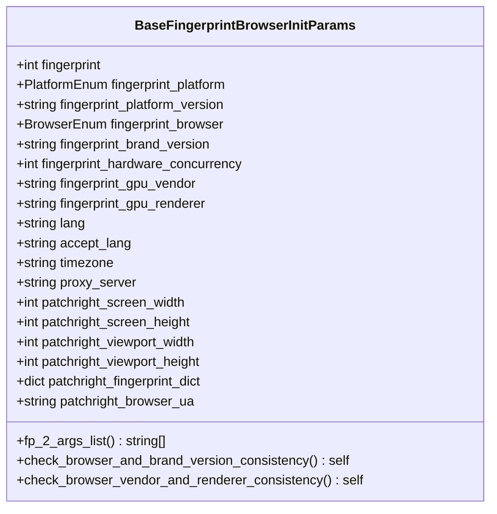
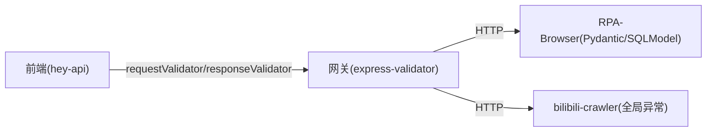

# 输入验证与过滤

<cite>
**本文引用的文件**
- [be-gateway/ExpressServerEnd/app.js](file://be-gateway/ExpressServerEnd/app.js)
- [be-gateway/ExpressServerEnd/Controller/api/v1/do_lottery/DoLotteryController.js](file://be-gateway/ExpressServerEnd/Controller/api/v1/do_lottery/DoLotteryController.js)
- [be-gateway/ExpressServerEnd/routes/casdoor.js](file://be-gateway/ExpressServerEnd/routes/casdoor.js)
- [RPA-Browser/app/models/core/browser/fingerprint.py](file://RPA-Browser/app/models/core/browser/fingerprint.py)
- [RPA-Browser/app/exceptions/handlers.py](file://RPA-Browser/app/exceptions/handlers.py)
- [be-bilibili-crawler/main.py](file://be-bilibili-crawler/main.py)
- [be-bilibili-crawler/dev_env_main.py](file://be-bilibili-crawler/dev_env_main.py)
- [Vue3FrontEndDemoExercise/src/api/browser/hey-api/core/types.gen.ts](file://Vue3FrontEndDemoExercise/src/api/browser/hey-api/core/types.gen.ts)
- [Vue3FrontEndDemoExercise/src/api/bili_lottery_data/hey-api/core/types.gen.ts](file://Vue3FrontEndDemoExercise/src/api/bili_lottery_data/hey-api/core/types.gen.ts)
- [Vue3FrontEndDemoExercise/src/api/community/hey-api/core/types.gen.ts](file://Vue3FrontEndDemoExercise/src/api/community/hey-api/core/types.gen.ts)
</cite>

## 目录
1. [简介](#简介)
2. [项目结构](#项目结构)
3. [核心组件](#核心组件)
4. [架构总览](#架构总览)
5. [详细组件分析](#详细组件分析)
6. [依赖关系分析](#依赖关系分析)
7. [性能考虑](#性能考虑)
8. [故障排查指南](#故障排查指南)
9. [结论](#结论)
10. [附录](#附录)

## 简介
本文件聚焦于本仓库中的“输入验证与过滤”能力，覆盖表单数据验证、API参数校验、SQL注入防护、XSS攻击防护机制，以及输入清洗、特殊字符处理、正则表达式验证、白名单机制等。文档同时给出常见输入验证模式、错误消息处理策略与性能优化建议，并针对恶意输入检测、数据格式验证和边界条件处理提供可操作方案。

## 项目结构
本项目包含多个子系统：
- be-gateway（Node/Express）：网关层，负责安全中间件、请求解析、鉴权、统一错误处理与路由级参数校验。
- RPA-Browser（Python/FastAPI）：浏览器控制服务，使用Pydantic/SQLModel进行强类型入参校验与模型约束，并提供统一的异常处理器。
- be-bilibili-crawler（Python/FastAPI）：爬虫服务，提供全局异常处理器与开发环境异常捕获。
- Vue3FrontEndDemoExercise（前端）：通过hey-api生成客户端类型与可选的requestValidator/responseValidator，用于前后端契约式校验。

[本图为概念性结构图，不直接映射具体源码文件]

## 核心组件
- 网关安全与校验
  - 安全头与CSP配置、超时、CORS、JSON/URL编码解析、JWT鉴权。
  - express-validator 在路由级别进行字段非空等校验，并将错误以统一格式返回。
  - 开放重定向防护：对登录回调来源进行严格校验与白名单匹配。
- FastAPI 参数校验
  - 使用 Pydantic/SQLModel 定义强类型模型，内置范围、枚举、必填等约束；自定义字段校验器实现类型归一化与一致性检查。
  - 统一异常处理器将验证失败、业务异常、未知异常分别包装为标准响应。
- 前端契约校验
  - hey-api 生成的客户端支持 requestValidator/responseValidator，可在调用前/后做二次校验，确保前后端一致。

**章节来源**
- [be-gateway/ExpressServerEnd/app.js:82-111](file://be-gateway/ExpressServerEnd/app.js#L82-L111)
- [be-gateway/ExpressServerEnd/Controller/api/v1/do_lottery/DoLotteryController.js:12-29](file://be-gateway/ExpressServerEnd/Controller/api/v1/do_lottery/DoLotteryController.js#L12-L29)
- [be-gateway/ExpressServerEnd/routes/casdoor.js:31-53](file://be-gateway/ExpressServerEnd/routes/casdoor.js#L31-L53)
- [RPA-Browser/app/models/core/browser/fingerprint.py:101-252](file://RPA-Browser/app/models/core/browser/fingerprint.py#L101-L252)
- [RPA-Browser/app/exceptions/handlers.py:43-67](file://RPA-Browser/app/exceptions/handlers.py#L43-L67)
- [Vue3FrontEndDemoExercise/src/api/browser/hey-api/core/types.gen.ts:75-91](file://Vue3FrontEndDemoExercise/src/api/browser/hey-api/core/types.gen.ts#L75-L91)

## 架构总览
下图展示从前端到后端各层的输入验证与过滤流程，包括网关安全中间件、路由级校验、FastAPI模型校验与统一异常处理。

**图表来源**
- [be-gateway/ExpressServerEnd/app.js:82-111](file://be-gateway/ExpressServerEnd/app.js#L82-L111)
- [be-gateway/ExpressServerEnd/Controller/api/v1/do_lottery/DoLotteryController.js:12-29](file://be-gateway/ExpressServerEnd/Controller/api/v1/do_lottery/DoLotteryController.js#L12-L29)
- [RPA-Browser/app/exceptions/handlers.py:43-67](file://RPA-Browser/app/exceptions/handlers.py#L43-L67)
- [be-bilibili-crawler/main.py:94-112](file://be-bilibili-crawler/main.py#L94-L112)

## 详细组件分析

### 网关层：安全中间件与参数校验
- 安全中间件
  - 设置CSP限制脚本、样式、媒体等来源，降低XSS风险。
  - 设置超时防止慢请求占用资源。
  - CORS允许携带凭证，便于跨域场景下的Cookie/JWT传递。
  - 解析JSON与URL编码请求体，便于后续校验。
- 路由级参数校验
  - 使用 express-validator 对 body/query 进行非空等规则校验，并通过 validationResult 收集错误，统一返回。
- 开放重定向防护
  - 对Casdoor登录回调的 Origin 进行协议校验与白名单匹配，避免开放重定向漏洞。

**图表来源**
- [be-gateway/ExpressServerEnd/app.js:82-111](file://be-gateway/ExpressServerEnd/app.js#L82-L111)
- [be-gateway/ExpressServerEnd/Controller/api/v1/do_lottery/DoLotteryController.js:12-29](file://be-gateway/ExpressServerEnd/Controller/api/v1/do_lottery/DoLotteryController.js#L12-L29)
- [be-gateway/ExpressServerEnd/routes/casdoor.js:31-53](file://be-gateway/ExpressServerEnd/routes/casdoor.js#L31-L53)

**章节来源**
- [be-gateway/ExpressServerEnd/app.js:82-111](file://be-gateway/ExpressServerEnd/app.js#L82-L111)
- [be-gateway/ExpressServerEnd/Controller/api/v1/do_lottery/DoLotteryController.js:12-29](file://be-gateway/ExpressServerEnd/Controller/api/v1/do_lottery/DoLotteryController.js#L12-L29)
- [be-gateway/ExpressServerEnd/routes/casdoor.js:31-53](file://be-gateway/ExpressServerEnd/routes/casdoor.js#L31-L53)

### FastAPI 层：强类型模型与统一异常处理
- 强类型模型校验
  - 使用 Pydantic/SQLModel 定义复杂参数模型，包含枚举、范围、必填、别名等约束。
  - 自定义字段校验器实现类型归一化（如字符串ID转整型）与字段一致性检查（如浏览器与品牌版本必须同时设置）。
- 统一异常处理
  - 验证异常：返回422，附带标准化错误信息。
  - 业务异常：按自定义code/msg返回统一响应。
  - 全局异常：区分数据库连接丢失、未知异常，记录追踪ID与堆栈，并在开发模式下输出详细调试信息。

**图表来源**
- [RPA-Browser/app/models/core/browser/fingerprint.py:101-252](file://RPA-Browser/app/models/core/browser/fingerprint.py#L101-L252)

**章节来源**
- [RPA-Browser/app/models/core/browser/fingerprint.py:101-252](file://RPA-Browser/app/models/core/browser/fingerprint.py#L101-L252)
- [RPA-Browser/app/exceptions/handlers.py:43-67](file://RPA-Browser/app/exceptions/handlers.py#L43-L67)
- [RPA-Browser/app/exceptions/handlers.py:70-147](file://RPA-Browser/app/exceptions/handlers.py#L70-L147)

### 爬虫服务：全局异常处理
- 全局异常处理器统一捕获未处理异常，记录请求上下文（URL、方法、客户端IP），推送告警，并返回标准错误响应。
- 开发环境异常捕获：在启动入口中捕获异常并返回友好提示。

**章节来源**
- [be-bilibili-crawler/main.py:94-112](file://be-bilibili-crawler/main.py#L94-L112)
- [be-bilibili-crawler/dev_env_main.py:91-108](file://be-bilibili-crawler/dev_env_main.py#L91-L108)

### 前端：契约式校验
- hey-api 生成的客户端支持 requestValidator/responseValidator，可在发送前/接收后进行数据形状校验，确保前后端契约一致。
- 建议在关键接口启用该能力，减少无效请求与后端校验压力。

**章节来源**
- [Vue3FrontEndDemoExercise/src/api/browser/hey-api/core/types.gen.ts:75-91](file://Vue3FrontEndDemoExercise/src/api/browser/hey-api/core/types.gen.ts#L75-L91)
- [Vue3FrontEndDemoExercise/src/api/bili_lottery_data/hey-api/core/types.gen.ts:75-91](file://Vue3FrontEndDemoExercise/src/api/bili_lottery_data/hey-api/core/types.gen.ts#L75-L91)
- [Vue3FrontEndDemoExercise/src/api/community/hey-api/core/types.gen.ts:75-91](file://Vue3FrontEndDemoExercise/src/api/community/hey-api/core/types.gen.ts#L75-L91)

## 依赖关系分析
- 网关依赖 express-validator 进行请求体与查询参数校验，并通过统一错误中间件返回标准化错误。
- FastAPI 服务依赖 Pydantic/SQLModel 完成强类型校验，并通过自定义异常处理器统一封装错误。
- 前端通过 hey-api 生成客户端类型与可选校验函数，增强前后端一致性。

**图表来源**
- [be-gateway/ExpressServerEnd/Controller/api/v1/do_lottery/DoLotteryController.js:12-29](file://be-gateway/ExpressServerEnd/Controller/api/v1/do_lottery/DoLotteryController.js#L12-L29)
- [RPA-Browser/app/models/core/browser/fingerprint.py:101-252](file://RPA-Browser/app/models/core/browser/fingerprint.py#L101-L252)
- [be-bilibili-crawler/main.py:94-112](file://be-bilibili-crawler/main.py#L94-L112)
- [Vue3FrontEndDemoExercise/src/api/browser/hey-api/core/types.gen.ts:75-91](file://Vue3FrontEndDemoExercise/src/api/browser/hey-api/core/types.gen.ts#L75-L91)

**章节来源**
- [be-gateway/ExpressServerEnd/Controller/api/v1/do_lottery/DoLotteryController.js:12-29](file://be-gateway/ExpressServerEnd/Controller/api/v1/do_lottery/DoLotteryController.js#L12-L29)
- [RPA-Browser/app/models/core/browser/fingerprint.py:101-252](file://RPA-Browser/app/models/core/browser/fingerprint.py#L101-L252)
- [be-bilibili-crawler/main.py:94-112](file://be-bilibili-crawler/main.py#L94-L112)
- [Vue3FrontEndDemoExercise/src/api/browser/hey-api/core/types.gen.ts:75-91](file://Vue3FrontEndDemoExercise/src/api/browser/hey-api/core/types.gen.ts#L75-L91)

## 性能考虑
- 网关层
  - 合理设置超时，避免长尾请求阻塞。
  - 仅在必要路由启用 express-validator，减少不必要的校验开销。
- FastAPI 层
  - 使用强类型模型可减少运行时类型转换成本，提升校验效率。
  - 自定义校验器尽量轻量，避免复杂计算放在高频路径。
- 前端层
  - 合理使用 requestValidator/responseValidator，避免重复校验造成性能损耗。
- 通用建议
  - 对大体积请求体进行分片或分页上传。
  - 对敏感字段进行最小化传输，减少网络与序列化开销。

[本节为通用指导，不直接分析具体文件]

## 故障排查指南
- 网关层错误
  - 校验失败：检查 express-validator 规则与请求体结构，确认字段是否缺失或类型不符。
  - 权限错误：检查JWT与权限中间件配置。
  - 超时错误：检查上游服务响应时间与网关超时配置。
- FastAPI 层错误
  - 验证失败：查看 RequestValidationError 的错误详情，定位具体字段问题。
  - 数据库连接丢失：关注全局异常处理器中的连接丢失分支，必要时增加重试与退避策略。
  - 未知异常：根据错误ID与堆栈信息定位问题。
- 爬虫服务错误
  - 全局异常处理器会记录请求上下文与堆栈，结合日志定位问题。

**章节来源**
- [be-gateway/ExpressServerEnd/app.js:119-161](file://be-gateway/ExpressServerEnd/app.js#L119-L161)
- [RPA-Browser/app/exceptions/handlers.py:43-67](file://RPA-Browser/app/exceptions/handlers.py#L43-L67)
- [RPA-Browser/app/exceptions/handlers.py:70-147](file://RPA-Browser/app/exceptions/handlers.py#L70-L147)
- [be-bilibili-crawler/main.py:94-112](file://be-bilibili-crawler/main.py#L94-L112)

## 结论
本仓库在网关层、FastAPI服务层与前端均实现了较为完善的输入验证与过滤机制：
- 网关层通过安全中间件与路由级校验保障基础安全与参数合法性。
- FastAPI层通过强类型模型与统一异常处理确保数据契约与错误一致性。
- 前端通过契约式校验增强前后端一致性，减少无效请求。
建议在生产环境中持续完善白名单机制、正则表达式校验与输入清洗策略，并结合监控与告警提升可观测性与稳定性。

[本节为总结，不直接分析具体文件]

## 附录
- 常见输入验证模式
  - 白名单：仅允许预定义的枚举值或域名列表（如Casdoor来源白名单）。
  - 正则表达式：对邮箱、手机号、URL等进行格式校验。
  - 长度与范围：限制字符串长度、数值范围。
  - 必填与非空：确保关键字段存在且非空。
- SQL注入防护
  - 使用ORM或参数化查询，避免拼接用户输入到SQL语句。
  - 对查询参数进行严格类型与范围校验。
- XSS攻击防护
  - 设置CSP限制脚本来源。
  - 对用户输入进行转义与渲染时采用安全的模板引擎。
- 输入清洗与特殊字符处理
  - 去除首尾空白、限制字符集、转义HTML标签。
- 错误消息处理
  - 统一错误响应格式，区分业务错误与系统错误。
  - 在开发环境输出详细调试信息，生产环境隐藏敏感细节。
- 性能优化策略
  - 分层校验：前端快速失败，网关基础校验，后端深度校验。
  - 缓存校验规则与白名单，减少重复计算。
  - 对高频接口进行限流与熔断保护。

[本节为通用指导，不直接分析具体文件]