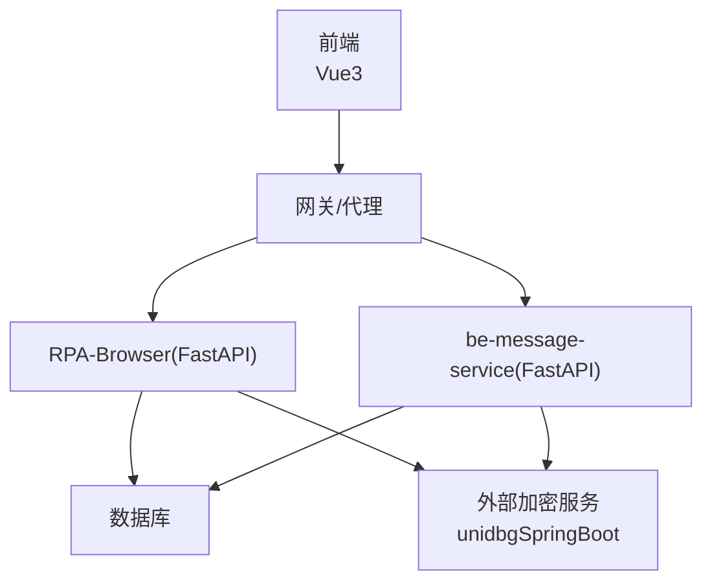
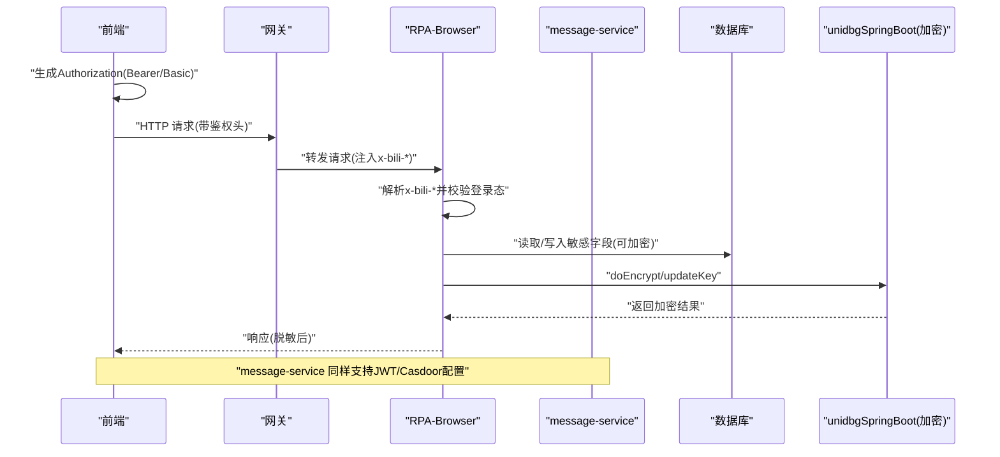
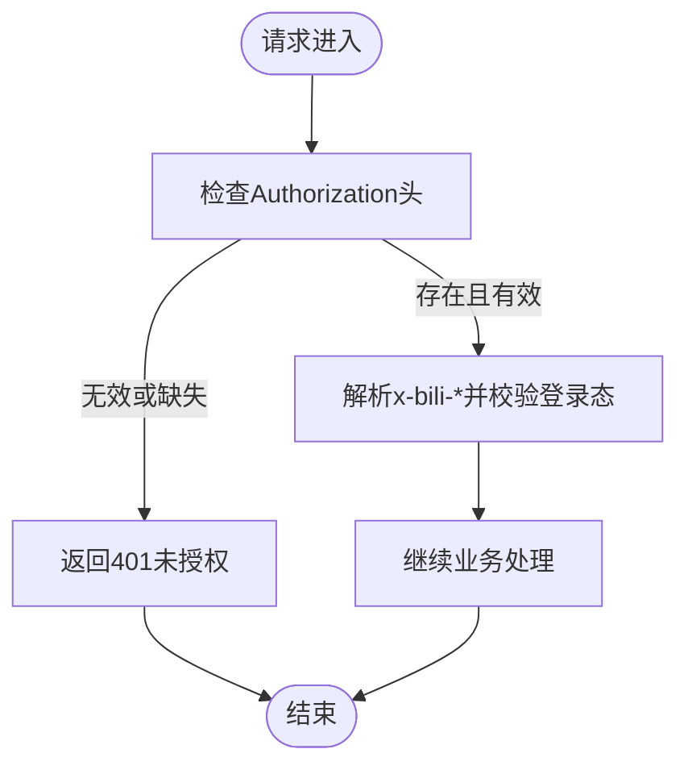
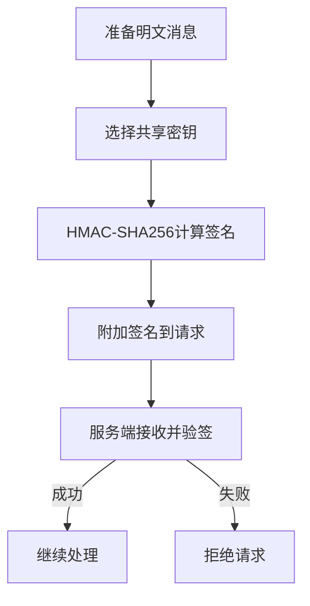
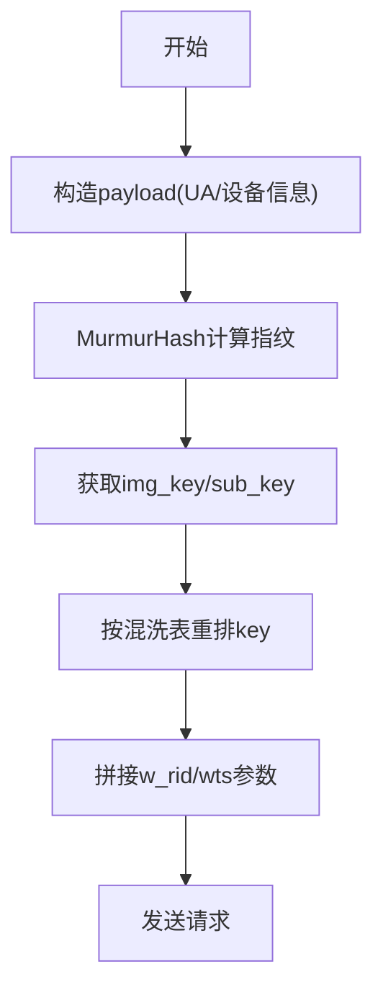
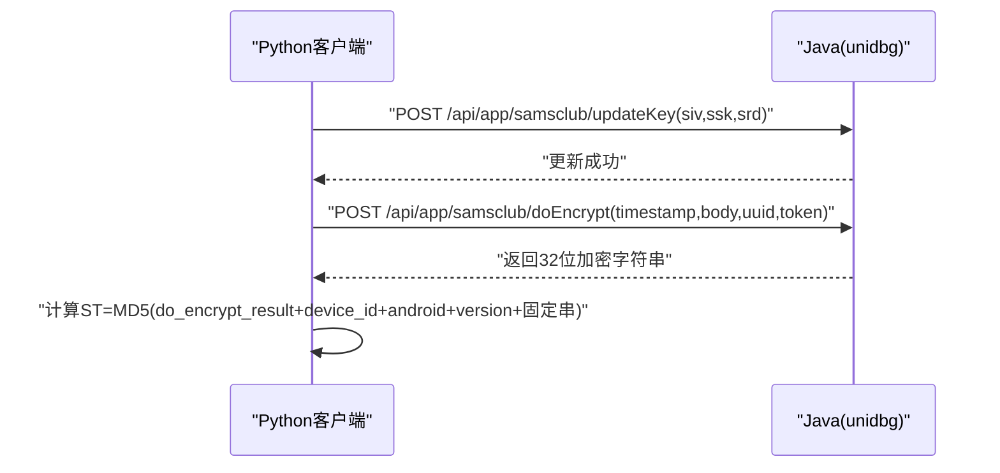
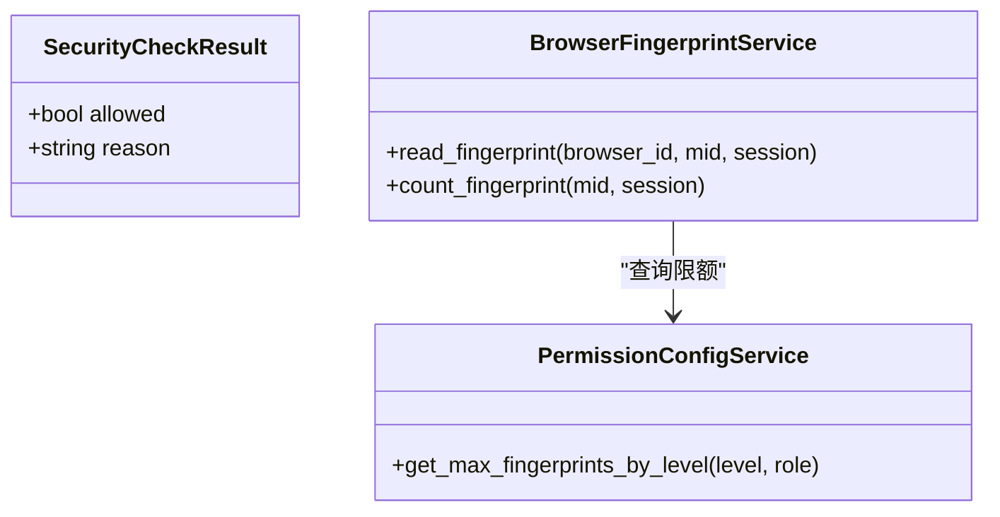
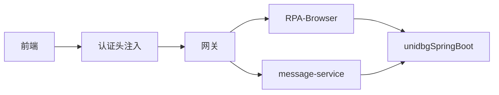

# 敏感数据加密

<cite>
**本文引用的文件**
- [RPA-Browser/app/config.py](file://RPA-Browser/app/config.py)
- [be-message-service/app/core/config.py](file://be-message-service/app/core/config.py)
- [be-bilibili-crawler/Utils/网关/gateway_auth.py](file://be-bilibili-crawler/Utils/网关/gateway_auth.py)
- [be-bilibili-crawler/Utils/加密/utils.py](file://be-bilibili-crawler/Utils/加密/utils.py)
- [be-bilibili-crawler/Service/samsclub/tools/do_samsclub_encryptor.py](file://be-bilibili-crawler/Service/samsclub/tools/do_samsclub_encryptor.py)
- [unidbgSpringBoot/src/main/java/guanzhujiaran/unidbgspringboot/Service/app/samsclub/SamClubEncrypt.java](file://unidbgSpringBoot/src/main/java/guanzhujiaran/unidbgspringboot/Service/app/samsclub/SamClubEncrypt.java)
- [Vue3FrontEndDemoExercise/src/api/community/hey-api/core/auth.gen.ts](file://Vue3FrontEndDemoExercise/src/api/community/hey-api/core/auth.gen.ts)
- [Vue3FrontEndDemoExercise/src/api/browser/hey-api/core/auth.gen.ts](file://Vue3FrontEndDemoExercise/src/api/browser/hey-api/core/auth.gen.ts)
- [Vue3FrontEndDemoExercise/src/api/bili_lottery_data/hey-api/core/auth.gen.ts](file://Vue3FrontEndDemoExercise/src/api/bili_lottery_data/hey-api/core/auth.gen.ts)
- [RPA-Browser/app/utils/depends/security_depends.py](file://RPA-Browser/app/utils/depends/security_depends.py)
- [RPA-Browser/app/models/core/browser/security.py](file://RPA-Browser/app/models/core/browser/security.py)
</cite>

## 目录
1. [简介](#简介)
2. [项目结构](#项目结构)
3. [核心组件](#核心组件)
4. [架构总览](#架构总览)
5. [详细组件分析](#详细组件分析)
6. [依赖关系分析](#依赖关系分析)
7. [性能考量](#性能考量)
8. [故障排查指南](#故障排查指南)
9. [结论](#结论)
10. [附录](#附录)

## 简介
本文件面向本项目中的“敏感数据加密”主题，覆盖以下方面：
- 数据传输加密：HTTPS/TLS、API 请求签名与鉴权、前端认证头注入。
- 存储加密：数据库字段级加密（含密钥轮换策略建议）、敏感信息脱敏输出。
- 密钥管理：JWT 配置、外部加密服务密钥同步、密钥轮换与兼容性处理。
- 算法与实践：AES/RSA 使用建议、HMAC 签名、WBI 参数签名、第三方 SDK 调用封装。
- 性能与可靠性：加密开销评估、降级与重试、解密失败处理。

## 项目结构
仓库包含多个子服务，涉及安全与加密的关键位置如下：
- RPA-Browser：FastAPI 应用，提供 JWT 配置、浏览器安全校验依赖、推送渠道等配置。
- be-message-service：消息服务，集中管理 JWT、Casdoor 等认证相关配置。
- be-bilibili-crawler：爬虫与工具集，包含 HMAC-SHA256、WBI 签名、SAMS Club 加密客户端。
- unidbgSpringBoot：Java 服务，封装 JNI 调用进行 SAMS Club 的 doEncrypt/updateKey。
- Vue 前端：OpenAPI 生成的认证头注入逻辑（Bearer/Basic）。

图表来源
- [RPA-Browser/app/config.py:140-174](file://RPA-Browser/app/config.py#L140-L174)
- [be-message-service/app/core/config.py:301-318](file://be-message-service/app/core/config.py#L301-L318)
- [be-bilibili-crawler/Service/samsclub/tools/do_samsclub_encryptor.py:25-55](file://be-bilibili-crawler/Service/samsclub/tools/do_samsclub_encryptor.py#L25-L55)
- [unidbgSpringBoot/src/main/java/guanzhujiaran/unidbgspringboot/Service/app/samsclub/SamClubEncrypt.java:84-110](file://unidbgSpringBoot/src/main/java/guanzhujiaran/unidbgspringboot/Service/app/samsclub/SamClubEncrypt.java#L84-L110)

章节来源
- [RPA-Browser/app/config.py:140-174](file://RPA-Browser/app/config.py#L140-L174)
- [be-message-service/app/core/config.py:301-318](file://be-message-service/app/core/config.py#L301-L318)

## 核心组件
- 传输层安全与鉴权
  - JWT 算法与过期时间：RPA-Browser 与 message-service 分别维护 jwt_algorithm、jwt_expire_minutes/jwt_expires_seconds。
  - 网关注入用户信息：后端通过 x-bili-* 可信头解析登录态，避免客户端伪造。
  - 前端认证头注入：自动为 Bearer/Basic 方案生成 Authorization 头。
- 请求签名与防篡改
  - HMAC-SHA256：用于对外请求或内部消息的签名计算。
  - WBI 参数签名：B站接口所需的 img_key/sub_key 混洗与签名流程。
- 第三方加密能力
  - SAMS Club 加密：Python 客户端调用 Java unidbg 服务的 doEncrypt/updateKey，实现设备指纹与 token 相关的加密。
- 安全校验依赖
  - 浏览器资源归属校验：验证浏览器 ID 是否属于当前用户 MID，并限制指纹数量。
  - URL 安全检查结果模型：用于记录允许/拒绝原因。

章节来源
- [RPA-Browser/app/config.py:140-174](file://RPA-Browser/app/config.py#L140-L174)
- [be-message-service/app/core/config.py:301-318](file://be-message-service/app/core/config.py#L301-L318)
- [be-bilibili-crawler/Utils/网关/gateway_auth.py:26-122](file://be-bilibili-crawler/Utils/网关/gateway_auth.py#L26-L122)
- [Vue3FrontEndDemoExercise/src/api/community/hey-api/core/auth.gen.ts:29-48](file://Vue3FrontEndDemoExercise/src/api/community/hey-api/core/auth.gen.ts#L29-L48)
- [Vue3FrontEndDemoExercise/src/api/browser/hey-api/core/auth.gen.ts:29-48](file://Vue3FrontEndDemoExercise/src/api/browser/hey-api/core/auth.gen.ts#L29-L48)
- [Vue3FrontEndDemoExercise/src/api/bili_lottery_data/hey-api/core/auth.gen.ts:29-48](file://Vue3FrontEndDemoExercise/src/api/bili_lottery_data/hey-api/core/auth.gen.ts#L29-L48)
- [be-bilibili-crawler/Utils/加密/utils.py:124-144](file://be-bilibili-crawler/Utils/加密/utils.py#L124-L144)
- [be-bilibili-crawler/Utils/加密/utils.py:36-121](file://be-bilibili-crawler/Utils/加密/utils.py#L36-L121)
- [be-bilibili-crawler/Service/samsclub/tools/do_samsclub_encryptor.py:25-55](file://be-bilibili-crawler/Service/samsclub/tools/do_samsclub_encryptor.py#L25-L55)
- [unidbgSpringBoot/src/main/java/guanzhujiaran/unidbgspringboot/Service/app/samsclub/SamClubEncrypt.java:84-110](file://unidbgSpringBoot/src/main/java/guanzhujiaran/unidbgspringboot/Service/app/samsclub/SamClubEncrypt.java#L84-L110)
- [RPA-Browser/app/utils/depends/security_depends.py:20-105](file://RPA-Browser/app/utils/depends/security_depends.py#L20-L105)
- [RPA-Browser/app/models/core/browser/security.py:7-11](file://RPA-Browser/app/models/core/browser/security.py#L7-L11)

## 架构总览
下图展示从前端到后端再到外部加密服务的完整链路，包括认证头注入、网关注入用户信息、JWT 校验、以及第三方加密调用。

图表来源
- [Vue3FrontEndDemoExercise/src/api/community/hey-api/core/auth.gen.ts:29-48](file://Vue3FrontEndDemoExercise/src/api/community/hey-api/core/auth.gen.ts#L29-L48)
- [be-bilibili-crawler/Utils/网关/gateway_auth.py:64-122](file://be-bilibili-crawler/Utils/网关/gateway_auth.py#L64-L122)
- [be-bilibili-crawler/Service/samsclub/tools/do_samsclub_encryptor.py:25-55](file://be-bilibili-crawler/Service/samsclub/tools/do_samsclub_encryptor.py#L25-L55)
- [unidbgSpringBoot/src/main/java/guanzhujiaran/unidbgspringboot/Service/app/samsclub/SamClubEncrypt.java:84-110](file://unidbgSpringBoot/src/main/java/guanzhujiaran/unidbgspringboot/Service/app/samsclub/SamClubEncrypt.java#L84-L110)

## 详细组件分析

### 组件A：JWT与认证头注入
- 后端配置
  - RPA-Browser：jwt_algorithm、jwt_expire_minutes。
  - message-service：jwt_secret、jwt_algorithm、jwt_expires_seconds、Casdoor 集成开关与证书处理。
- 前端注入
  - 自动生成 Authorization 头，支持 Bearer 与 Basic 两种方案。
- 网关注入
  - 后端信任 x-bili-* 头，解析 mid/user_name/uname 等字段，未登录时拒绝访问。

图表来源
- [RPA-Browser/app/config.py:140-174](file://RPA-Browser/app/config.py#L140-L174)
- [be-message-service/app/core/config.py:301-318](file://be-message-service/app/core/config.py#L301-L318)
- [Vue3FrontEndDemoExercise/src/api/community/hey-api/core/auth.gen.ts:29-48](file://Vue3FrontEndDemoExercise/src/api/community/hey-api/core/auth.gen.ts#L29-L48)
- [be-bilibili-crawler/Utils/网关/gateway_auth.py:64-122](file://be-bilibili-crawler/Utils/网关/gateway_auth.py#L64-L122)

章节来源
- [RPA-Browser/app/config.py:140-174](file://RPA-Browser/app/config.py#L140-L174)
- [be-message-service/app/core/config.py:301-318](file://be-message-service/app/core/config.py#L301-L318)
- [Vue3FrontEndDemoExercise/src/api/community/hey-api/core/auth.gen.ts:29-48](file://Vue3FrontEndDemoExercise/src/api/community/hey-api/core/auth.gen.ts#L29-L48)
- [be-bilibili-crawler/Utils/网关/gateway_auth.py:64-122](file://be-bilibili-crawler/Utils/网关/gateway_auth.py#L64-L122)

### 组件B：请求签名与防篡改（HMAC-SHA256）
- 使用场景
  - 对外部 API 的请求签名，防止请求被篡改。
  - 内部消息体签名，确保消息完整性。
- 实现要点
  - 使用标准库 hmac + sha256，对 key 与 message 进行 UTF-8 编码后计算哈希。
  - 将签名附加到请求头或查询参数中，服务端按相同规则验签。

图表来源
- [be-bilibili-crawler/Utils/加密/utils.py:124-144](file://be-bilibili-crawler/Utils/加密/utils.py#L124-L144)

章节来源
- [be-bilibili-crawler/Utils/加密/utils.py:124-144](file://be-bilibili-crawler/Utils/加密/utils.py#L124-L144)

### 组件C：WBI 参数签名（B站接口）
- 关键要素
  - img_key 与 sub_key 混洗表（mixinKeyEncTab）。
  - 基于时间戳与随机数生成 payload，再通过 MurmurHash 生成指纹。
- 流程说明
  - 构造 payload（包含 UA、屏幕分辨率、WebGL 信息等）。
  - 使用 Murmur3_x64_128 计算布隆指纹。
  - 将 img_key/sub_key 按规则混洗后拼接至查询参数。

图表来源
- [be-bilibili-crawler/Utils/加密/utils.py:36-121](file://be-bilibili-crawler/Utils/加密/utils.py#L36-L121)
- [be-bilibili-crawler/Utils/加密/utils.py:161-210](file://be-bilibili-crawler/Utils/加密/utils.py#L161-L210)
- [be-bilibili-crawler/Utils/加密/utils.py:234-422](file://be-bilibili-crawler/Utils/加密/utils.py#L234-L422)

章节来源
- [be-bilibili-crawler/Utils/加密/utils.py:36-121](file://be-bilibili-crawler/Utils/加密/utils.py#L36-L121)
- [be-bilibili-crawler/Utils/加密/utils.py:161-210](file://be-bilibili-crawler/Utils/加密/utils.py#L161-L210)
- [be-bilibili-crawler/Utils/加密/utils.py:234-422](file://be-bilibili-crawler/Utils/加密/utils.py#L234-L422)

### 组件D：SAMS Club 加密（Python客户端 + Java服务端）
- Python 客户端
  - 调用 /api/app/samsclub/doEncrypt 获取加密字符串。
  - 调用 /api/app/samsclub/updateKey 更新密钥（siv/ssk/srd）。
  - 根据 do_encrypt_result_str、device_id_str、version_str 计算 ST。
- Java 服务端
  - 通过 unidbg 加载 native 类 com/srm/security/SecurityTools。
  - 调用 update 设置密钥，再执行 doEncrypt 返回加密结果。

图表来源
- [be-bilibili-crawler/Service/samsclub/tools/do_samsclub_encryptor.py:25-55](file://be-bilibili-crawler/Service/samsclub/tools/do_samsclub_encryptor.py#L25-L55)
- [unidbgSpringBoot/src/main/java/guanzhujiaran/unidbgspringboot/Service/app/samsclub/SamClubEncrypt.java:84-110](file://unidbgSpringBoot/src/main/java/guanzhujiaran/unidbgspringboot/Service/app/samsclub/SamClubEncrypt.java#L84-L110)

章节来源
- [be-bilibili-crawler/Service/samsclub/tools/do_samsclub_encryptor.py:25-55](file://be-bilibili-crawler/Service/samsclub/tools/do_samsclub_encryptor.py#L25-L55)
- [unidbgSpringBoot/src/main/java/guanzhujiaran/unidbgspringboot/Service/app/samsclub/SamClubEncrypt.java:84-110](file://unidbgSpringBoot/src/main/java/guanzhujiaran/unidbgspringboot/Service/app/samsclub/SamClubEncrypt.java#L84-L110)

### 组件E：浏览器资源归属与安全校验
- 归属校验
  - 验证浏览器 ID 是否属于当前用户 MID，否则抛出异常。
- 指纹限制
  - 根据用户等级与角色限制最大指纹数量，超出则拒绝。
- URL 安全检查
  - 记录允许/拒绝原因，便于审计与告警。

图表来源
- [RPA-Browser/app/utils/depends/security_depends.py:20-105](file://RPA-Browser/app/utils/depends/security_depends.py#L20-L105)
- [RPA-Browser/app/models/core/browser/security.py:7-11](file://RPA-Browser/app/models/core/browser/security.py#L7-L11)

章节来源
- [RPA-Browser/app/utils/depends/security_depends.py:20-105](file://RPA-Browser/app/utils/depends/security_depends.py#L20-L105)
- [RPA-Browser/app/models/core/browser/security.py:7-11](file://RPA-Browser/app/models/core/browser/security.py#L7-L11)

## 依赖关系分析
- 前端依赖 OpenAPI 生成的认证头注入逻辑，统一处理 Bearer/Basic。
- 后端依赖网关注入的可信用户信息头，避免客户端伪造。
- 加密能力依赖外部 Java 服务，Python 侧负责组装请求与结果处理。
- JWT 配置在两个 FastAPI 服务中独立维护，需保持一致性。

图表来源
- [Vue3FrontEndDemoExercise/src/api/community/hey-api/core/auth.gen.ts:29-48](file://Vue3FrontEndDemoExercise/src/api/community/hey-api/core/auth.gen.ts#L29-L48)
- [be-bilibili-crawler/Service/samsclub/tools/do_samsclub_encryptor.py:25-55](file://be-bilibili-crawler/Service/samsclub/tools/do_samsclub_encryptor.py#L25-L55)

章节来源
- [Vue3FrontEndDemoExercise/src/api/community/hey-api/core/auth.gen.ts:29-48](file://Vue3FrontEndDemoExercise/src/api/community/hey-api/core/auth.gen.ts#L29-L48)
- [be-bilibili-crawler/Service/samsclub/tools/do_samsclub_encryptor.py:25-55](file://be-bilibili-crawler/Service/samsclub/tools/do_samsclub_encryptor.py#L25-L55)

## 性能考量
- 加密算法选择
  - AES-GCM 适合批量数据加密，兼顾性能与完整性校验。
  - RSA 仅用于小数据或密钥交换，避免大对象直接 RSA 加密导致性能瓶颈。
- 缓存与复用
  - 对频繁使用的密钥派生结果（如 WBI 混洗后的 key）进行短期缓存。
  - 外部加密服务调用应连接池化，减少握手与序列化开销。
- 降级策略
  - 当外部加密服务不可用时，回退为本地轻量签名（如 HMAC），并记录告警。
- 日志与监控
  - 记录加密/解密耗时、失败率，设置阈值告警。

[本节为通用指导，不直接引用具体文件]

## 故障排查指南
- 解密失败
  - 检查外部加密服务是否可用，确认 updateKey 已正确调用。
  - 核对 timestamp、body、uuid、token 是否与服务器一致。
- 签名校验失败
  - 确认客户端与服务端使用相同的密钥与算法。
  - 检查消息体是否被篡改或编码不一致。
- 登录态失效
  - 检查 JWT 是否过期，确认网关是否正确注入 x-bili-* 头。
- 浏览器资源归属错误
  - 确认浏览器 ID 与用户 MID 匹配，检查权限配置与限额。

章节来源
- [be-bilibili-crawler/Service/samsclub/tools/do_samsclub_encryptor.py:25-55](file://be-bilibili-crawler/Service/samsclub/tools/do_samsclub_encryptor.py#L25-L55)
- [be-bilibili-crawler/Utils/网关/gateway_auth.py:88-122](file://be-bilibili-crawler/Utils/网关/gateway_auth.py#L88-L122)
- [RPA-Browser/app/utils/depends/security_depends.py:20-105](file://RPA-Browser/app/utils/depends/security_depends.py#L20-L105)

## 结论
本项目在传输层、应用层与存储层均具备基础的安全与加密能力：
- 传输层：通过 HTTPS/TLS、JWT、网关注入可信头保障通信安全。
- 应用层：HMAC 签名、WBI 参数签名、第三方加密服务封装。
- 存储层：建议采用字段级加密与密钥轮换，结合脱敏输出降低泄露风险。
后续可进一步完善：
- 引入统一的密钥管理服务（KMS），实现自动化轮换与版本兼容。
- 增加加密性能监控与降级策略，提升系统韧性。
- 完善审计与告警，覆盖所有敏感操作路径。

[本节为总结性内容，不直接引用具体文件]

## 附录
- 推荐实践
  - 使用 AES-GCM 进行数据加密，RSA 仅用于密钥交换。
  - 对所有敏感输入输出进行脱敏处理，避免日志泄露。
  - 定期轮换密钥，保持向后兼容（多版本密钥并存）。
  - 对第三方加密服务进行健康检查与熔断保护。

[本节为通用指导，不直接引用具体文件]