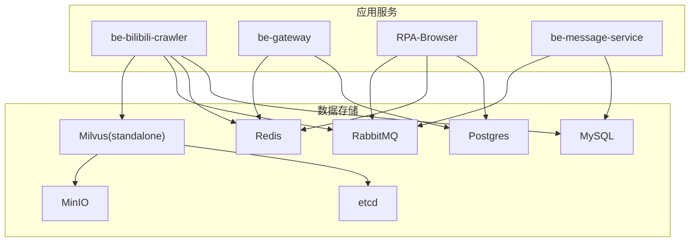
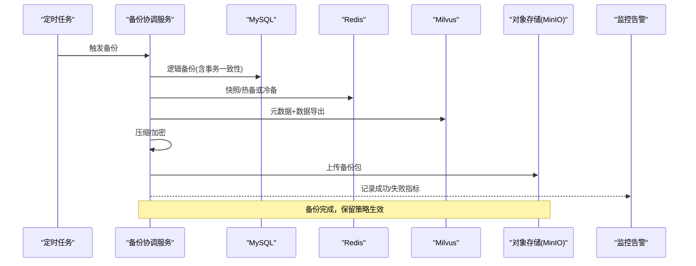
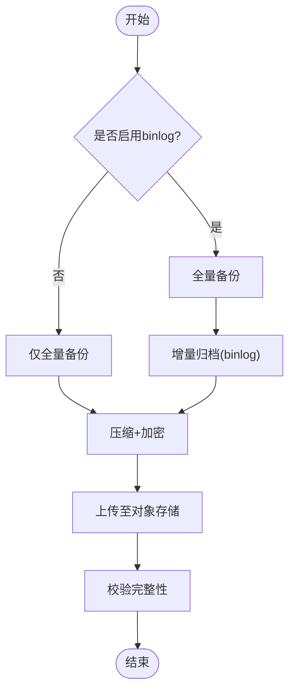
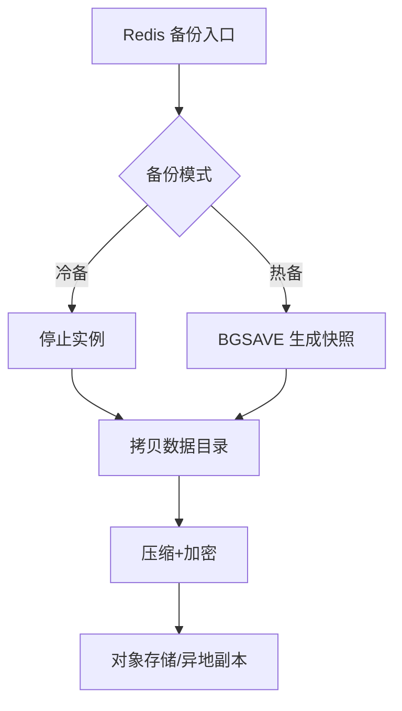
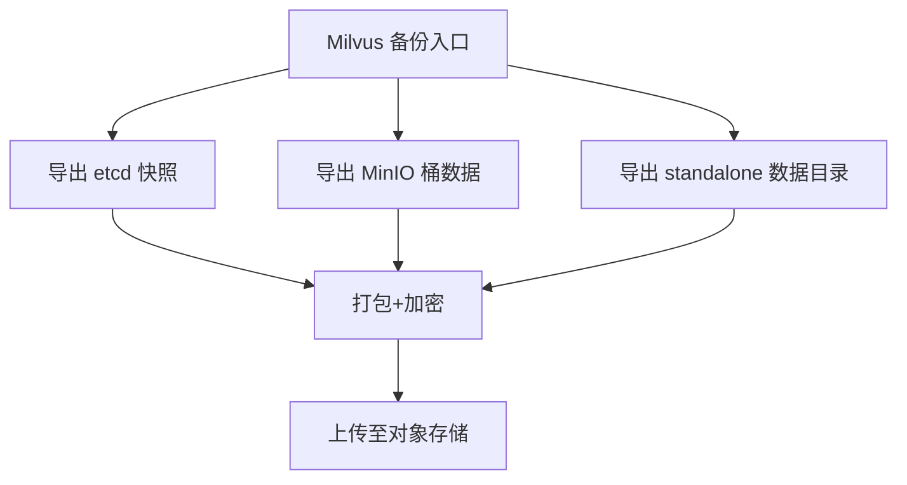
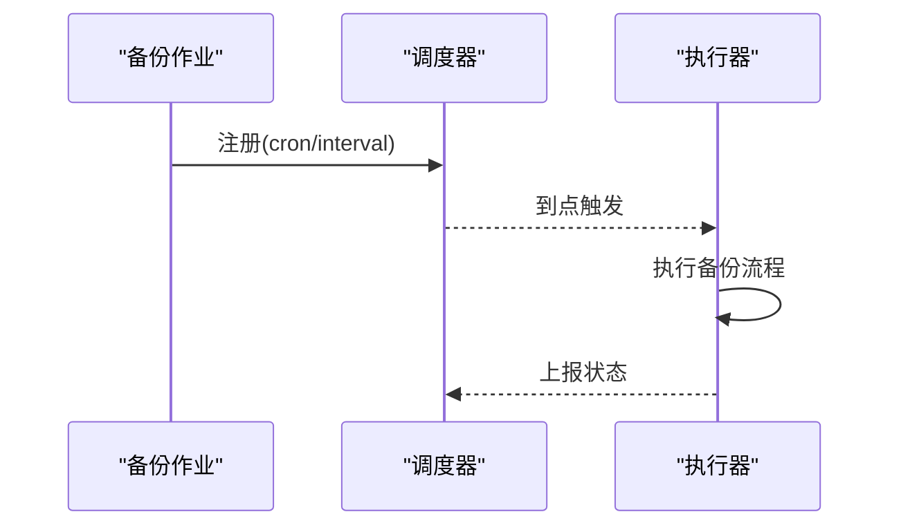
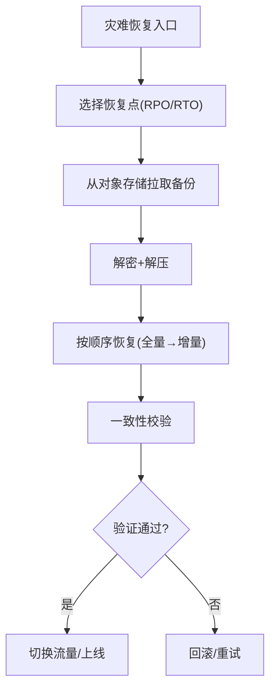
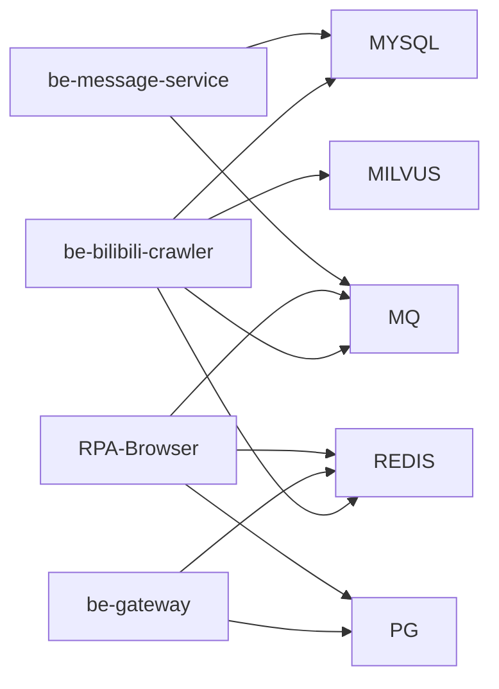

# 数据备份恢复

<cite>
**本文引用的文件**
- [docker-compose.yml](file://docker-compose.yml)
- [CONFIG.py](file://be-bilibili-crawler/CONFIG.py)
- [RedisManager.js](file://be-gateway/ExpressServerEnd/DAO/Redis/RedisManager.js)
- [getLotDynSortByDate.py](file://be-bilibili-crawler/Service/GrpcModule/Models/getLotDynSortByDate.py)
- [scheduler_manager.py](file://RPA-Browser/app/scheduler_manager.py)
- [scheduler_launcher.py](file://be-bilibili-crawler/Service/BaseCrawler/launcher/scheduler_launcher.py)
- [BackgroundServiceController.py](file://be-bilibili-crawler/controller/v1/background_service/BackgroundServiceController.py)
</cite>

## 目录
1. [简介](#简介)
2. [项目结构](#项目结构)
3. [核心组件](#核心组件)
4. [架构总览](#架构总览)
5. [详细组件分析](#详细组件分析)
6. [依赖关系分析](#依赖关系分析)
7. [性能与容量规划](#性能与容量规划)
8. [故障排查指南](#故障排查指南)
9. [结论](#结论)
10. [附录：脚本与配置清单](#附录脚本与配置清单)

## 简介
本文件面向生产环境的数据备份与恢复，覆盖 MySQL、Redis、向量数据库（Milvus）等关键数据的备份策略、增量机制、定时任务、加密存储、跨地域复制与灾难恢复流程。文档同时给出可落地的脚本思路、验证与恢复测试方法、监控告警建议，并针对“备份空间不足”“恢复时间过长”“数据一致性”等常见问题提供解决方案。

## 项目结构
本项目通过 docker-compose 编排多服务与中间件，关键持久化数据包括：
- MySQL：业务主库（多个 schema），数据目录挂载于 ./docker_vol/mysql_data/data
- Redis：缓存与会话，数据目录挂载于 ./docker_vol/redis/data
- Milvus（etcd + MinIO + standalone）：向量检索，数据分别挂载于 etcd、minio、milvus data
- Postgres：网关侧只读展示数据（可选纳入备份范围）

图表来源
- [docker-compose.yml:68-109](file://docker-compose.yml#L68-L109)
- [docker-compose.yml:120-164](file://docker-compose.yml#L120-L164)
- [docker-compose.yml:179-226](file://docker-compose.yml#L179-L226)
- [docker-compose.yml:227-309](file://docker-compose.yml#L227-L309)
- [docker-compose.yml:2-67](file://docker-compose.yml#L2-L67)

章节来源
- [docker-compose.yml:68-109](file://docker-compose.yml#L68-L109)
- [docker-compose.yml:120-164](file://docker-compose.yml#L120-L164)
- [docker-compose.yml:179-226](file://docker-compose.yml#L179-L226)
- [docker-compose.yml:227-309](file://docker-compose.yml#L227-L309)
- [docker-compose.yml:2-67](file://docker-compose.yml#L2-L67)

## 核心组件
- 数据库连接与实例
  - MySQL：多库 URI 由配置类集中生成，便于统一备份目标识别
  - Redis：按 db 隔离不同用途，便于分库备份
  - Milvus：etcd 元数据、MinIO 对象存储、standalone 数据目录需分别处理
- 调度器
  - 通用爬虫调度器支持 cron/interval 触发，可用于定时备份任务
  - RPA 服务内置异步调度器，可作为统一备份任务入口
- 外部存储
  - MinIO 作为对象存储，可用于存放加密后的备份产物与异地副本

章节来源
- [CONFIG.py:330-379](file://be-bilibili-crawler/CONFIG.py#L330-L379)
- [RedisManager.js:1-21](file://be-gateway/ExpressServerEnd/DAO/Redis/RedisManager.js#L1-L21)
- [scheduler_launcher.py:219-268](file://be-bilibili-crawler/Service/BaseCrawler/launcher/scheduler_launcher.py#L219-L268)
- [scheduler_manager.py:1-36](file://RPA-Browser/app/scheduler_manager.py#L1-L36)
- [docker-compose.yml:21-67](file://docker-compose.yml#L21-L67)

## 架构总览
下图展示备份与恢复的整体流程：定时任务触发 → 各组件导出快照 → 压缩与加密 → 落盘与上传至对象存储 → 健康检查与告警 → 恢复时从对象存储拉取并校验导入。

图表来源
- [scheduler_launcher.py:219-268](file://be-bilibili-crawler/Service/BaseCrawler/launcher/scheduler_launcher.py#L219-L268)
- [scheduler_manager.py:1-36](file://RPA-Browser/app/scheduler_manager.py#L1-L36)
- [docker-compose.yml:21-67](file://docker-compose.yml#L21-L67)

## 详细组件分析

### MySQL 备份策略与增量机制
- 全量备份
  - 使用逻辑备份工具对多库进行一致性导出，建议在低峰期执行
  - 导出前可短暂锁表或使用一致性参数保证事务一致
- 增量备份
  - 开启 binlog 后，基于时间点或位置点进行增量归档
  - 结合全量基线，可实现任意时间点恢复（PITR）
- 备份内容
  - 所有业务库（proxy_db、bilidb、bili_reserve、biliopusdb、dyndetail、samsclub、BiliMessageDB 等）
- 安全与合规
  - 备份文件本地压缩并加密后再上传至对象存储
  - 密钥管理采用独立密钥管理服务或环境变量注入

章节来源
- [CONFIG.py:330-379](file://be-bilibili-crawler/CONFIG.py#L330-L379)
- [docker-compose.yml:68-81](file://docker-compose.yml#L68-L81)

### Redis 备份策略
- 持久化模式
  - AOF 用于高可靠写入，RDB 用于快速恢复；根据场景选择其一或组合
- 备份方式
  - 冷备：停止实例后拷贝数据目录
  - 热备：利用 BGSAVE 生成 RDB 快照，再拷贝最新快照
- 分库备份
  - 按 db 维度组织备份目录，便于选择性恢复

章节来源
- [docker-compose.yml:82-93](file://docker-compose.yml#L82-L93)
- [RedisManager.js:1-21](file://be-gateway/ExpressServerEnd/DAO/Redis/RedisManager.js#L1-L21)

### Milvus 备份策略
- 组件拆分
  - etcd：元数据快照
  - MinIO：对象存储中的向量数据
  - standalone：运行时数据目录
- 备份要点
  - 先停写或进入只读模式（如可行），确保一致性
  - 分别导出 etcd snapshot、MinIO 桶数据、standalone 数据目录
  - 打包、加密、上传至对象存储

章节来源
- [docker-compose.yml:2-67](file://docker-compose.yml#L2-L67)

### 定时备份任务与调度
- 复用现有调度能力
  - 通用爬虫调度器支持 cron/interval，适合注册备份作业
  - RPA 服务的 AsyncIOScheduler 也可作为统一调度入口
- 任务设计
  - 每日全量 + 每小时增量（MySQL binlog）
  - Redis 每日快照 + 按需热备
  - Milvus 每周全量 + 变更日志归档（若支持）
- 任务状态查询
  - 可通过后台服务接口获取调度器状态与最近执行信息

图表来源
- [scheduler_launcher.py:219-268](file://be-bilibili-crawler/Service/BaseCrawler/launcher/scheduler_launcher.py#L219-L268)
- [scheduler_manager.py:1-36](file://RPA-Browser/app/scheduler_manager.py#L1-L36)
- [BackgroundServiceController.py:245-273](file://be-bilibili-crawler/controller/v1/background_service/BackgroundServiceController.py#L245-L273)

章节来源
- [scheduler_launcher.py:219-268](file://be-bilibili-crawler/Service/BaseCrawler/launcher/scheduler_launcher.py#L219-L268)
- [scheduler_manager.py:1-36](file://RPA-Browser/app/scheduler_manager.py#L1-L36)
- [BackgroundServiceController.py:245-273](file://be-bilibili-crawler/controller/v1/background_service/BackgroundServiceController.py#L245-L273)

### 备份文件加密与存储
- 加密
  - 使用强对称算法对备份包进行加密，密钥由独立密钥管理服务或受控环境变量注入
- 存储
  - 本地磁盘临时落盘后，立即上传至对象存储（MinIO）
  - 设置生命周期策略，自动清理过期备份
- 访问控制
  - 对象存储桶最小权限原则，仅备份服务账号具备读写权限

章节来源
- [docker-compose.yml:21-67](file://docker-compose.yml#L21-L67)

### 跨地域备份与灾难恢复
- 跨地域复制
  - 将对象存储的备份包同步至异地桶（借助对象存储提供的跨区域复制功能）
- 灾难恢复流程
  - 评估影响范围（单库/全量）
  - 选择合适的全量基线与增量序列
  - 在隔离环境先行演练恢复，验证数据一致性与业务可用性
  - 切换流量或回滚策略

### 备份验证、恢复测试与监控告警
- 备份验证
  - 校验压缩包完整性（哈希校验）
  - 随机抽样恢复至测试库，比对关键指标与数据行数
- 恢复测试
  - 定期演练 PITR、单库恢复、全量恢复
  - 记录恢复耗时与资源占用，优化 RTO
- 监控告警
  - 监控备份任务成功率、时长、大小
  - 监控对象存储容量与增长趋势
  - 失败即时告警（多渠道通知）

章节来源
- [scheduler_manager.py:1-36](file://RPA-Browser/app/scheduler_manager.py#L1-L36)
- [docker-compose.yml:21-67](file://docker-compose.yml#L21-L67)

## 依赖关系分析
- 服务与存储耦合
  - be-bilibili-crawler 依赖 MySQL、Redis、RabbitMQ、Milvus
  - be-gateway 依赖 Postgres、Redis
  - RPA-Browser 依赖 Postgres、Redis、RabbitMQ
  - be-message-service 依赖 MySQL、RabbitMQ
- 备份边界
  - 以容器卷为边界进行数据捕获，避免直接操作运行中进程

图表来源
- [docker-compose.yml:120-164](file://docker-compose.yml#L120-L164)
- [docker-compose.yml:179-226](file://docker-compose.yml#L179-L226)
- [docker-compose.yml:227-309](file://docker-compose.yml#L227-L309)

章节来源
- [docker-compose.yml:120-164](file://docker-compose.yml#L120-L164)
- [docker-compose.yml:179-226](file://docker-compose.yml#L179-L226)
- [docker-compose.yml:227-309](file://docker-compose.yml#L227-L309)

## 性能与容量规划
- 备份窗口
  - 全量备份安排在业务低峰期，增量备份高频短小
- I/O 与 CPU
  - 限制备份并发度，避免影响在线服务
  - 使用 SSD 或高性能云盘承载临时备份目录
- 容量规划
  - 估算日增量与保留周期，预留至少 30% 冗余空间
  - 对象存储分层存储（标准/低频/归档）降低成本
- 网络
  - 跨地域复制走专线或内网通道，减少公网带宽占用

## 故障排查指南
- 备份空间不足
  - 现象：磁盘使用率告警、备份失败
  - 处置：清理过期备份、调整保留策略、扩容磁盘或迁移至对象存储
- 恢复时间过长
  - 现象：RTO 不达标
  - 处置：并行恢复、预热缓存、优化索引重建、拆分大库恢复
- 数据不一致
  - 现象：恢复后校验失败
  - 处置：确认 binlog 连续性、校验哈希、重放增量、回退至上一稳定基线
- 监控缺失
  - 现象：问题发现滞后
  - 处置：完善备份成功率、时长、大小、对象存储容量等指标与告警

## 结论
通过统一的调度入口、标准化的备份流程、加密与对象存储、跨地域复制与演练化的恢复流程，可在保障数据一致性的前提下，显著降低 RPO/RTO，提升系统韧性。建议持续迭代备份策略与容量规划，并结合监控告警实现闭环治理。

## 附录：脚本与配置清单
以下为可直接落地执行的脚本与配置要点（示例路径与命令名，具体参数按实际环境替换）：

- MySQL
  - 全量逻辑备份：mysqldump（多库、事务一致性）
  - 增量归档：基于 binlog 的时间点归档
  - 恢复：先全量基线，再回放增量
  - 参考：[CONFIG.py:330-379](file://be-bilibili-crawler/CONFIG.py#L330-L379)

- Redis
  - 冷备：停止实例后拷贝数据目录
  - 热备：BGSAVE 生成快照后拷贝最新 RDB
  - 参考：[docker-compose.yml:82-93](file://docker-compose.yml#L82-L93)

- Milvus
  - etcd 快照导出、MinIO 桶数据导出、standalone 数据目录导出
  - 参考：[docker-compose.yml:2-67](file://docker-compose.yml#L2-L67)

- 对象存储（MinIO）
  - 上传/下载、生命周期策略、跨区域复制
  - 参考：[docker-compose.yml:21-67](file://docker-compose.yml#L21-L67)

- 定时任务
  - 使用调度器注册备份作业（cron/interval）
  - 参考：[scheduler_launcher.py:219-268](file://be-bilibili-crawler/Service/BaseCrawler/launcher/scheduler_launcher.py#L219-L268)、[scheduler_manager.py:1-36](file://RPA-Browser/app/scheduler_manager.py#L1-L36)

- 动态数据归档（示例）
  - 动态数据 zip 输出路径配置
  - 参考：[getLotDynSortByDate.py:8-16](file://be-bilibili-crawler/Service/GrpcModule/Models/getLotDynSortByDate.py#L8-L16)

- 监控告警
  - 接入统一推送渠道（钉钉/飞书/企业微信等）
  - 参考：[CONFIG.py:14-139](file://be-bilibili-crawler/CONFIG.py#L14-L139)