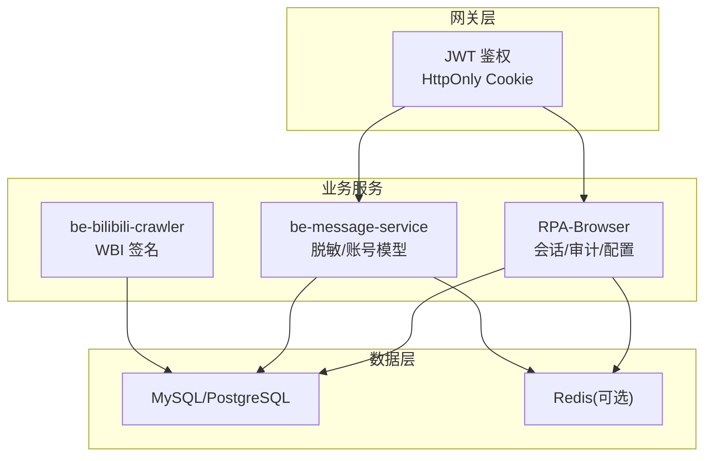
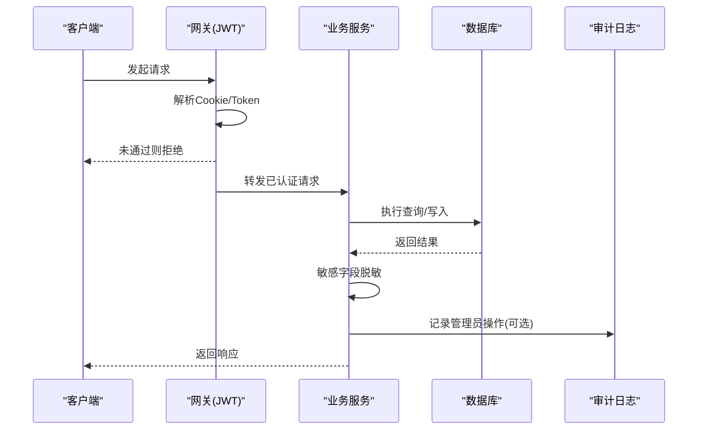
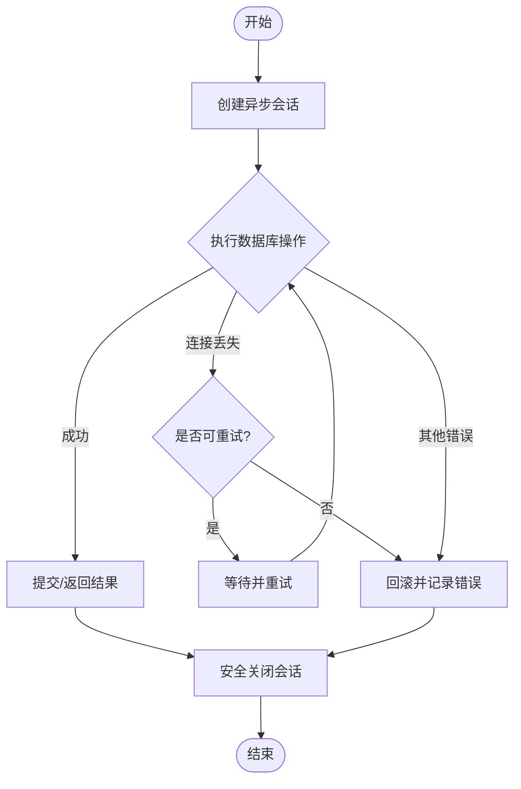
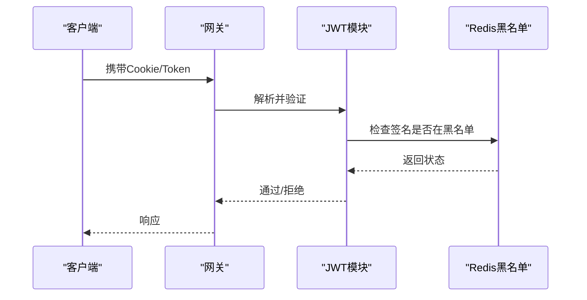
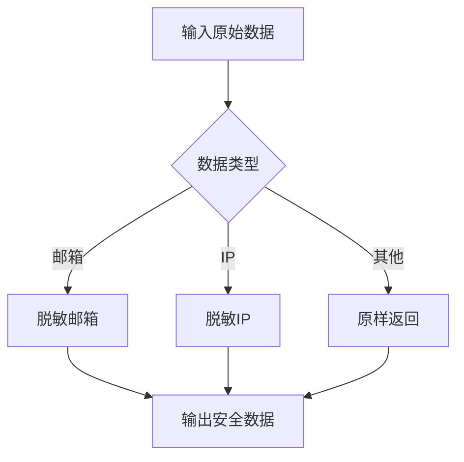
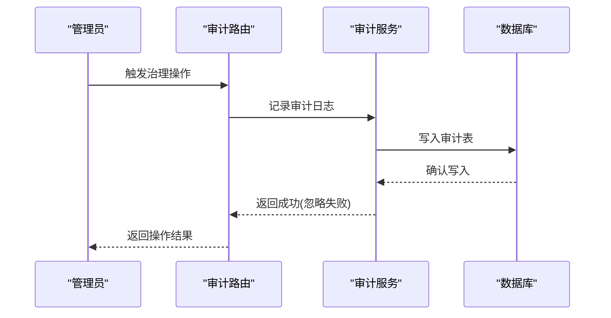
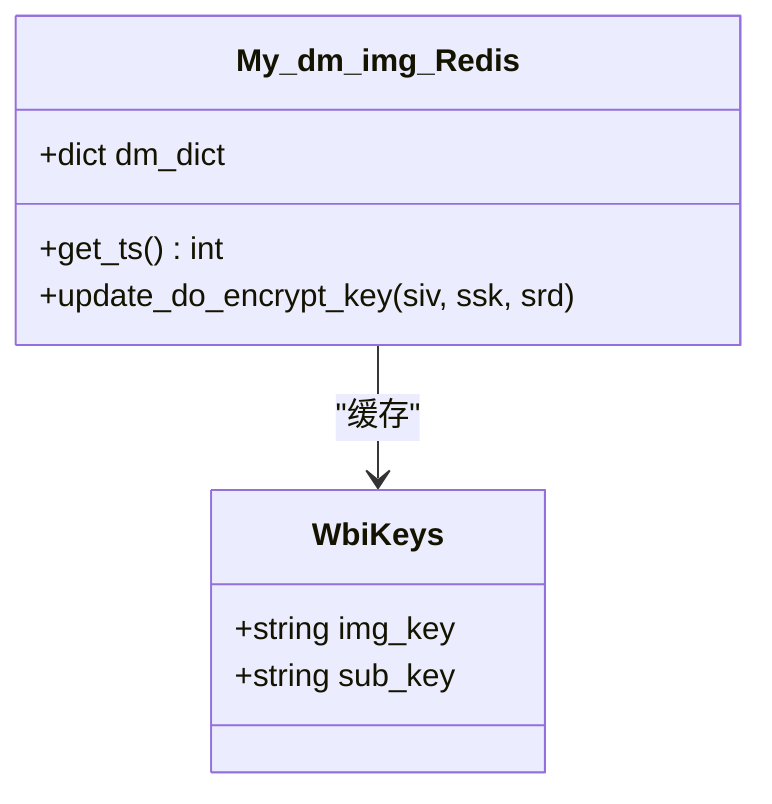
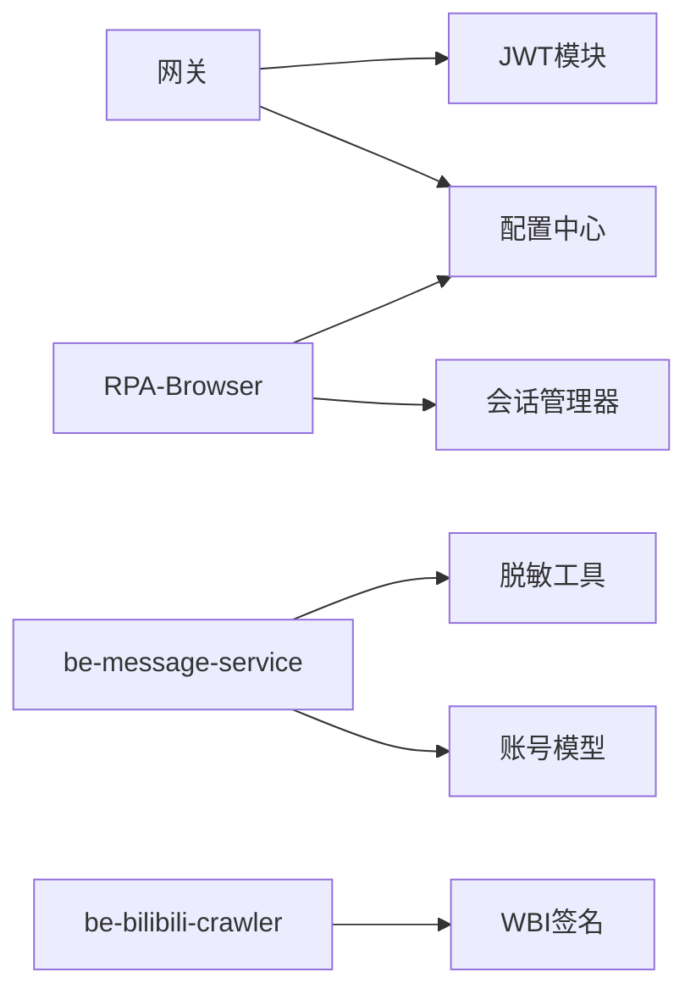

# 数据安全防护

<cite>
**本文引用的文件**
- [session_manager.py](file://RPA-Browser/app/utils/depends/session_manager.py)
- [config.py](file://RPA-Browser/app/config.py)
- [JwtModule.js](file://be-gateway/ExpressServerEnd/Service/user_permission_module/JwtModule.js)
- [index.js](file://be-gateway/ExpressServerEnd/config/index.js)
- [base.py](file://be-message-service/app/services/user/account/base.py)
- [__init__.py](file://be-message-service/app/utils/__init__.py)
- [audit_router.py](file://RPA-Browser/app/controller/v1/admin/audit_router.py)
- [admin_audit.py](file://RPA-Browser/app/services/admin_audit.py)
- [wbi加密.py](file://be-bilibili-crawler/Utils/加密/wbi加密.py)
</cite>

## 目录
1. [简介](#简介)
2. [项目结构](#项目结构)
3. [核心组件](#核心组件)
4. [架构总览](#架构总览)
5. [详细组件分析](#详细组件分析)
6. [依赖关系分析](#依赖关系分析)
7. [性能与可用性考量](#性能与可用性考量)
8. [故障排查指南](#故障排查指南)
9. [结论](#结论)
10. [附录](#附录)

## 简介
本文件面向本项目中的数据安全防护，覆盖数据库安全配置、敏感数据加密存储、数据传输加密、备份恢复机制、访问控制、SQL 查询安全、缓存数据安全、个人信息保护、数据脱敏、数据审计与生命周期管理，以及数据泄露防护、完整性校验与合规性要求。文档基于仓库中实际代码实现进行说明，并提供可视化图示帮助理解。

## 项目结构
本项目包含多个服务：RPA-Browser（FastAPI）、be-gateway（Express）、be-message-service（FastAPI）、be-bilibili-crawler（Python）等。数据安全防护涉及以下关键位置：
- 数据库连接与会话管理：RPA-Browser 的会话管理器负责连接池、重试与回滚策略。
- 认证授权：be-gateway 的 JWT 模块负责令牌签发、校验、Cookie 安全属性与黑名单撤销。
- 敏感数据处理：be-message-service 提供邮箱/IP 脱敏工具；RPA-Browser 提供管理员操作审计日志。
- 请求签名与传输安全：be-bilibili-crawler 提供 WBI 参数签名能力，用于对外部接口调用的请求签名。

**图表来源**
- [JwtModule.js:20-61](file://be-gateway/ExpressServerEnd/Service/user_permission_module/JwtModule.js#L20-L61)
- [session_manager.py:21-37](file://RPA-Browser/app/utils/depends/session_manager.py#L21-L37)
- [base.py:74-95](file://be-message-service/app/services/user/account/base.py#L74-L95)
- [wbi加密.py:104-117](file://be-bilibili-crawler/Utils/加密/wbi加密.py#L104-L117)

**章节来源**
- [session_manager.py:21-37](file://RPA-Browser/app/utils/depends/session_manager.py#L21-L37)
- [JwtModule.js:20-61](file://be-gateway/ExpressServerEnd/Service/user_permission_module/JwtModule.js#L20-L61)
- [base.py:74-95](file://be-message-service/app/services/user/account/base.py#L74-L95)
- [wbi加密.py:104-117](file://be-bilibili-crawler/Utils/加密/wbi加密.py#L104-L117)

## 核心组件
- 数据库会话与连接稳定性：通过异步引擎与连接池参数、pre_ping、pool_recycle、异常重试与回滚保障连接可靠性。
- 认证与权限：JWT 使用 HS256，Cookie 设置 httpOnly、secure、sameSite，支持黑名单撤销与可选登录中间件。
- 敏感数据脱敏：邮箱与 IP 脱敏函数，输出时避免泄露原始信息。
- 管理员操作审计：统一记录管理员动作，失败不影响主流程但会告警。
- 请求签名：WBI 密钥管理与缓存，用于对外部接口的请求签名。

**章节来源**
- [session_manager.py:50-131](file://RPA-Browser/app/utils/depends/session_manager.py#L50-L131)
- [JwtModule.js:79-153](file://be-gateway/ExpressServerEnd/Service/user_permission_module/JwtModule.js#L79-L153)
- [base.py:74-95](file://be-message-service/app/services/user/account/base.py#L74-L95)
- [admin_audit.py:13-43](file://RPA-Browser/app/services/admin_audit.py#L13-L43)
- [wbi加密.py:104-117](file://be-bilibili-crawler/Utils/加密/wbi加密.py#L104-L117)

## 架构总览
下图展示从网关到服务再到数据层的请求流与安全控制点：
- 网关层通过 JWT 中间件校验身份，必要时走白名单放行。
- 业务服务通过会话管理器访问数据库，执行事务并处理异常。
- 敏感数据在返回前进行脱敏。
- 管理员操作写入审计日志。
- 爬虫侧对第三方接口调用进行签名。

**图表来源**
- [JwtModule.js:85-131](file://be-gateway/ExpressServerEnd/Service/user_permission_module/JwtModule.js#L85-L131)
- [session_manager.py:78-131](file://RPA-Browser/app/utils/depends/session_manager.py#L78-L131)
- [admin_audit.py:13-43](file://RPA-Browser/app/services/admin_audit.py#L13-L43)
- [base.py:74-95](file://be-message-service/app/services/user/account/base.py#L74-L95)

## 详细组件分析

### 数据库安全配置与会话管理
- 连接池与稳定性：
  - 使用异步引擎创建连接池，设置 pool_size、max_overflow、pool_pre_ping、pool_recycle、pool_timeout，确保连接健康与回收。
  - 针对 MySQL 设置 utf8mb4 字符集。
- 会话异常处理：
  - 捕获连接丢失与操作错误，进行指数退避重试与回滚。
  - 安全关闭会话，避免连接丢失导致的关闭异常。
- 配置来源：
  - 数据库 URL 来自配置中心，便于环境隔离与密钥管理。

**图表来源**
- [session_manager.py:21-37](file://RPA-Browser/app/utils/depends/session_manager.py#L21-L37)
- [session_manager.py:50-131](file://RPA-Browser/app/utils/depends/session_manager.py#L50-L131)

**章节来源**
- [session_manager.py:21-37](file://RPA-Browser/app/utils/depends/session_manager.py#L21-L37)
- [session_manager.py:50-131](file://RPA-Browser/app/utils/depends/session_manager.py#L50-L131)
- [config.py:140-174](file://RPA-Browser/app/config.py#L140-L174)

### 认证授权与令牌安全
- 令牌算法与有效期：HS256，固定过期时间。
- Cookie 安全属性：httpOnly、secure（按环境或环境变量控制）、sameSite=lax，防止 XSS 与 CSRF。
- 令牌撤销：通过 Redis 黑名单检查签名，支持即时失效。
- 可选登录：提供可选校验中间件，部分读接口允许匿名访问。

**图表来源**
- [JwtModule.js:20-61](file://be-gateway/ExpressServerEnd/Service/user_permission_module/JwtModule.js#L20-L61)
- [JwtModule.js:79-153](file://be-gateway/ExpressServerEnd/Service/user_permission_module/JwtModule.js#L79-L153)

**章节来源**
- [JwtModule.js:20-61](file://be-gateway/ExpressServerEnd/Service/user_permission_module/JwtModule.js#L20-L61)
- [JwtModule.js:79-153](file://be-gateway/ExpressServerEnd/Service/user_permission_module/JwtModule.js#L79-L153)
- [index.js:1-7](file://be-gateway/ExpressServerEnd/config/index.js#L1-L7)

### 敏感数据脱敏与个人信息保护
- 邮箱脱敏：保留 @ 前若干位与完整域名，中间以星号填充。
- IP 脱敏：IPv4 显示为 a.b.*.*，IPv6 显示为 a:b:*，非法输入回退为空串。
- 应用范围：用户档案、搜索列表、导航信息等对外返回的数据装配阶段进行脱敏。

**图表来源**
- [base.py:74-95](file://be-message-service/app/services/user/account/base.py#L74-L95)
- [__init__.py:1-15](file://be-message-service/app/utils/__init__.py#L1-L15)

**章节来源**
- [base.py:74-95](file://be-message-service/app/services/user/account/base.py#L74-L95)
- [__init__.py:1-15](file://be-message-service/app/utils/__init__.py#L1-L15)

### 管理员操作审计
- 审计写入：统一记录管理员动作、目标类型、目标 ID 与详情，失败仅告警不阻断业务。
- 审计查询：支持按动作、目标类型、管理员 mid 过滤分页查询。

**图表来源**
- [admin_audit.py:13-43](file://RPA-Browser/app/services/admin_audit.py#L13-L43)
- [audit_router.py:68-93](file://RPA-Browser/app/controller/v1/admin/audit_router.py#L68-L93)

**章节来源**
- [admin_audit.py:13-43](file://RPA-Browser/app/services/admin_audit.py#L13-L43)
- [audit_router.py:68-93](file://RPA-Browser/app/controller/v1/admin/audit_router.py#L68-L93)

### 数据传输加密与请求签名
- WBI 密钥管理：封装密钥对象并缓存于 Redis，减少重复获取开销。
- 外部接口调用：通过签名生成器对请求参数进行签名，增强防篡改能力。

**图表来源**
- [wbi加密.py:104-117](file://be-bilibili-crawler/Utils/加密/wbi加密.py#L104-L117)

**章节来源**
- [wbi加密.py:104-117](file://be-bilibili-crawler/Utils/加密/wbi加密.py#L104-L117)

## 依赖关系分析
- 网关依赖 JWT 模块与配置中心，负责身份校验与路径白名单。
- 业务服务依赖会话管理器与配置中心，负责数据库访问与连接稳定性。
- 消息服务依赖脱敏工具与账号领域模型，负责敏感数据输出安全。
- 爬虫依赖 WBI 签名模块，负责对外部接口的请求签名。

**图表来源**
- [JwtModule.js:10-15](file://be-gateway/ExpressServerEnd/Service/user_permission_module/JwtModule.js#L10-L15)
- [index.js:1-7](file://be-gateway/ExpressServerEnd/config/index.js#L1-L7)
- [session_manager.py:1-10](file://RPA-Browser/app/utils/depends/session_manager.py#L1-L10)
- [config.py:140-174](file://RPA-Browser/app/config.py#L140-L174)
- [base.py:74-95](file://be-message-service/app/services/user/account/base.py#L74-L95)
- [__init__.py:1-15](file://be-message-service/app/utils/__init__.py#L1-L15)
- [wbi加密.py:104-117](file://be-bilibili-crawler/Utils/加密/wbi加密.py#L104-L117)

**章节来源**
- [JwtModule.js:10-15](file://be-gateway/ExpressServerEnd/Service/user_permission_module/JwtModule.js#L10-L15)
- [index.js:1-7](file://be-gateway/ExpressServerEnd/config/index.js#L1-L7)
- [session_manager.py:1-10](file://RPA-Browser/app/utils/depends/session_manager.py#L1-L10)
- [config.py:140-174](file://RPA-Browser/app/config.py#L140-L174)
- [base.py:74-95](file://be-message-service/app/services/user/account/base.py#L74-L95)
- [__init__.py:1-15](file://be-message-service/app/utils/__init__.py#L1-L15)
- [wbi加密.py:104-117](file://be-bilibili-crawler/Utils/加密/wbi加密.py#L104-L117)

## 性能与可用性考量
- 连接池与预检查：启用 pre_ping 与合理回收周期，降低陈旧连接带来的失败率。
- 重试与退避：连接丢失时采用指数退避重试，提升鲁棒性。
- 会话安全关闭：在连接丢失场景下安全关闭会话，避免资源泄漏。
- 令牌校验优化：网关层集中校验，减少下游重复鉴权成本。
- 脱敏计算轻量：脱敏逻辑简单高效，适合高频返回场景。

[本节为通用指导，无需特定文件引用]

## 故障排查指南
- 数据库连接丢失：
  - 观察会话管理器日志中的连接丢失与重试记录。
  - 检查连接池参数与数据库 wait_timeout 配置是否匹配。
- 令牌无效或过期：
  - 检查网关 JWT 配置与 Cookie 安全属性。
  - 确认 Redis 黑名单是否误加入有效签名。
- 脱敏异常：
  - 检查输入是否为空或格式非法，确保脱敏函数有回退逻辑。
- 审计写入失败：
  - 关注审计服务日志告警，确认数据库写入权限与连接正常。

**章节来源**
- [session_manager.py:50-131](file://RPA-Browser/app/utils/depends/session_manager.py#L50-L131)
- [JwtModule.js:63-70](file://be-gateway/ExpressServerEnd/Service/user_permission_module/JwtModule.js#L63-L70)
- [base.py:74-95](file://be-message-service/app/services/user/account/base.py#L74-L95)
- [admin_audit.py:29-43](file://RPA-Browser/app/services/admin_audit.py#L29-L43)

## 结论
本项目在数据安全防护方面具备较为完善的实践：数据库连接稳定、认证授权严格、敏感数据脱敏到位、管理员操作可审计、对外请求具备签名能力。建议在生产环境中持续强化密钥管理、网络传输加密（如 TLS）、备份恢复演练与合规性审查，以确保长期安全与稳定。

[本节为总结性内容，无需特定文件引用]

## 附录
- 配置项建议：
  - 数据库 URL 与环境变量分离，生产环境启用强密码与最小权限账户。
  - JWT 密钥定期轮换，Cookie secure 强制开启。
  - 连接池参数根据负载调整，监控连接使用率与慢查询。
- 合规性要点：
  - 个人信息脱敏与最小化采集。
  - 审计日志不可篡改且保留足够时长。
  - 备份恢复策略明确，定期演练。

[本节为补充建议，无需特定文件引用]