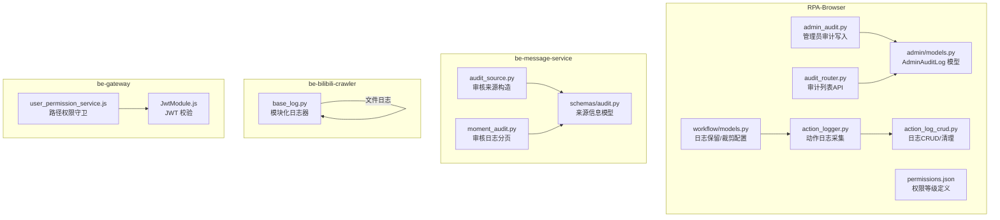
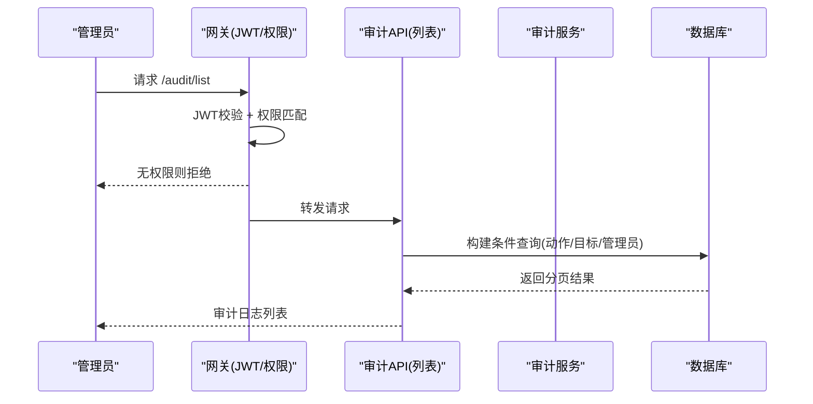
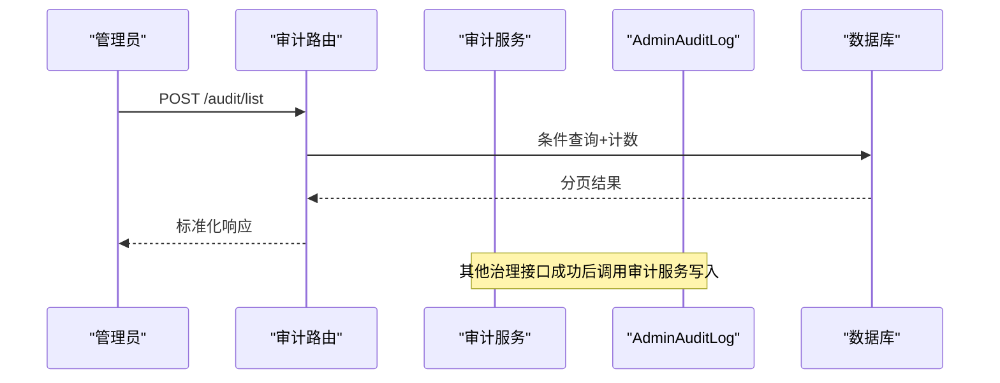
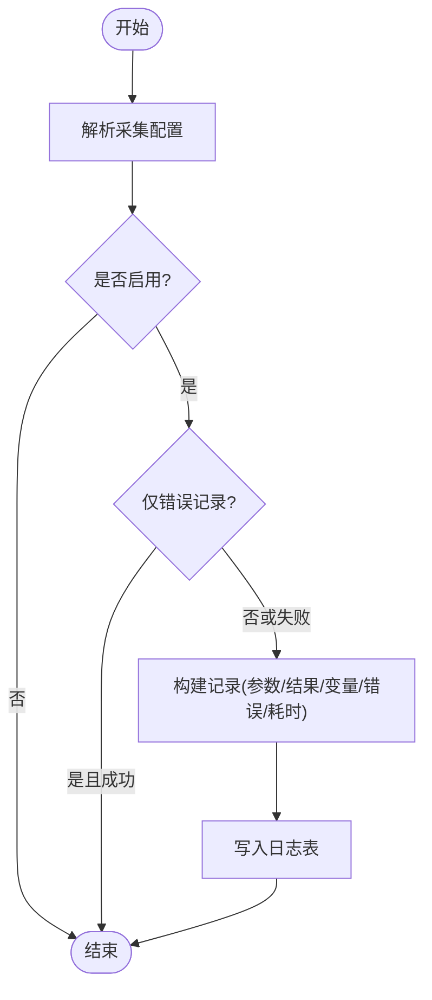
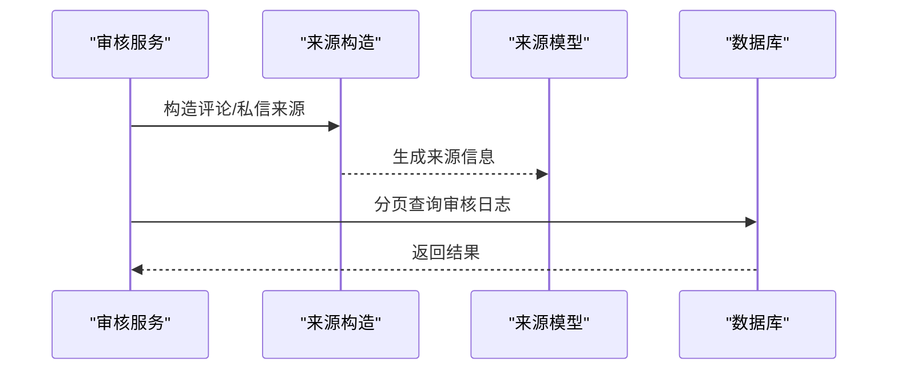
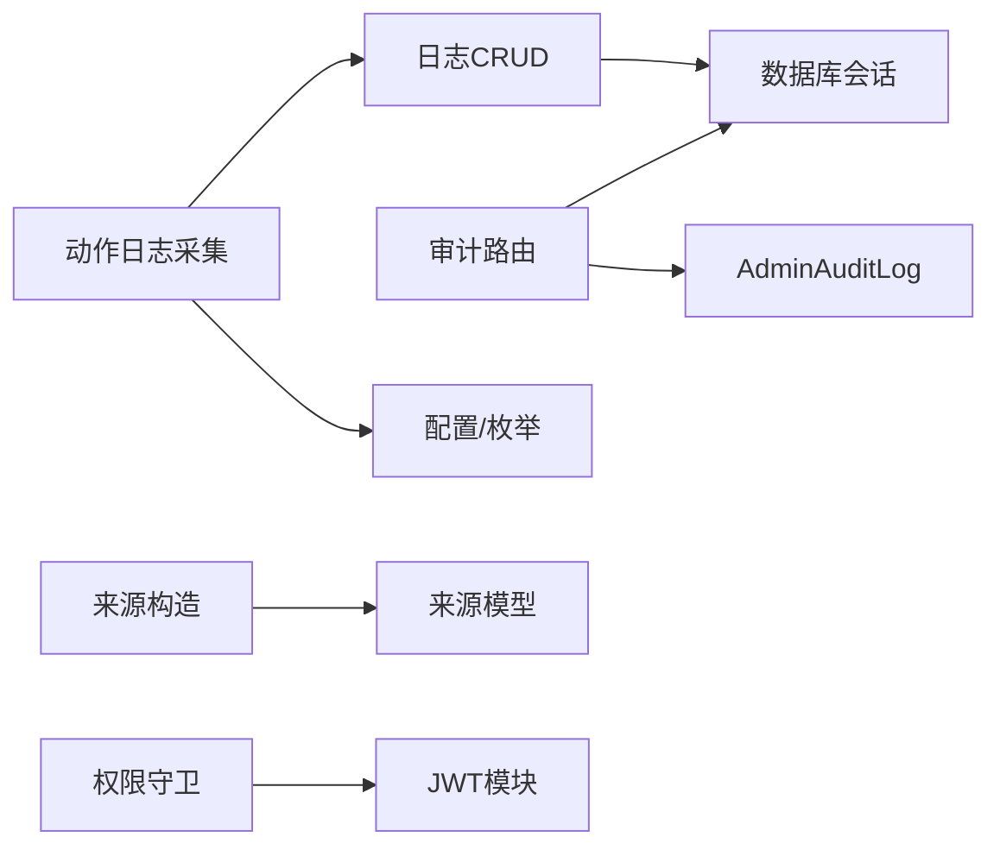

# 数据审计合规

<cite>
**本文引用的文件**
- [RPA-Browser/app/services/admin_audit.py](file://RPA-Browser/app/services/admin_audit.py)
- [RPA-Browser/app/models/database/admin/models.py](file://RPA-Browser/app/models/database/admin/models.py)
- [RPA-Browser/app/controller/v1/admin/audit_router.py](file://RPA-Browser/app/controller/v1/admin/audit_router.py)
- [RPA-Browser/app/data/permissions.json](file://RPA-Browser/app/data/permissions.json)
- [RPA-Browser/app/services/execution/action_logger.py](file://RPA-Browser/app/services/execution/action_logger.py)
- [RPA-Browser/app/services/execution/crud_service/action_log_crud.py](file://RPA-Browser/app/services/execution/crud_service/action_log_crud.py)
- [RPA-Browser/app/models/workflow/models.py](file://RPA-Browser/app/models/workflow/models.py)
- [be-message-service/app/utils/audit_source.py](file://be-message-service/app/utils/audit_source.py)
- [be-message-service/app/models/schemas/audit.py](file://be-message-service/app/models/schemas/audit.py)
- [be-message-service/app/services/moment/moment_audit.py](file://be-message-service/app/services/moment/moment_audit.py)
- [be-bilibili-crawler/log/base_log.py](file://be-bilibili-crawler/log/base_log.py)
- [be-gateway/ExpressServerEnd/Service/user_permission_module/user_permission_service.js](file://be-gateway/ExpressServerEnd/Service/user_permission_module/user_permission_service.js)
- [be-gateway/ExpressServerEnd/Service/user_permission_module/JwtModule.js](file://be-gateway/ExpressServerEnd/Service/user_permission_module/JwtModule.js)
</cite>

## 目录
1. [简介](#简介)
2. [项目结构](#项目结构)
3. [核心组件](#核心组件)
4. [架构总览](#架构总览)
5. [详细组件分析](#详细组件分析)
6. [依赖关系分析](#依赖关系分析)
7. [性能与容量规划](#性能与容量规划)
8. [故障排查指南](#故障排查指南)
9. [结论](#结论)
10. [附录：合规检查清单与日志规范](#附录：合规检查清单与日志规范)

## 简介
本文件面向“数据审计合规”目标，覆盖以下方面：
- 数据操作审计追踪：管理员治理操作、内容审核、浏览器自动化执行日志。
- 访问日志记录：服务侧结构化日志、按模块分片、保留策略。
- 数据生命周期管理：日志采集开关、字段裁剪、过期清理、归档策略。
- 敏感操作审计追踪：权限控制、最小化记录、不可篡改存储。
- 数据访问权限审计：基于角色与路径的鉴权、越权拦截。
- 数据保留策略与隐私合规：保留天数、脱敏、最小必要原则。
- 审计日志格式规范、日志分析工具建议、合规性检查清单。
- 问题定位：审计数据量过大、查询性能、合规验证。

## 项目结构
本项目在多个子系统中实现了审计与日志能力：
- RPA-Browser：管理员操作审计、浏览器动作执行日志、工作流日志配置。
- be-message-service：内容审核来源构造、审核日志分页查询。
- be-bilibili-crawler：通用日志器封装（按模块落盘、轮转与保留）。
- be-gateway：JWT 鉴权与基于路径的权限守卫。

图表来源
- [RPA-Browser/app/services/admin_audit.py:1-43](file://RPA-Browser/app/services/admin_audit.py#L1-L43)
- [RPA-Browser/app/models/database/admin/models.py:114-132](file://RPA-Browser/app/models/database/admin/models.py#L114-L132)
- [RPA-Browser/app/controller/v1/admin/audit_router.py:1-94](file://RPA-Browser/app/controller/v1/admin/audit_router.py#L1-L94)
- [RPA-Browser/app/services/execution/action_logger.py:1-295](file://RPA-Browser/app/services/execution/action_logger.py#L1-L295)
- [RPA-Browser/app/services/execution/crud_service/action_log_crud.py:1-229](file://RPA-Browser/app/services/execution/crud_service/action_log_crud.py#L1-L229)
- [RPA-Browser/app/models/workflow/models.py:255-289](file://RPA-Browser/app/models/workflow/models.py#L255-L289)
- [be-message-service/app/utils/audit_source.py:1-90](file://be-message-service/app/utils/audit_source.py#L1-L90)
- [be-message-service/app/models/schemas/audit.py:1-41](file://be-message-service/app/models/schemas/audit.py#L1-L41)
- [be-message-service/app/services/moment/moment_audit.py:320-355](file://be-message-service/app/services/moment/moment_audit.py#L320-L355)
- [be-bilibili-crawler/log/base_log.py:1-96](file://be-bilibili-crawler/log/base_log.py#L1-L96)
- [be-gateway/ExpressServerEnd/Service/user_permission_module/user_permission_service.js:1-104](file://be-gateway/ExpressServerEnd/Service/user_permission_module/user_permission_service.js#L1-L104)
- [be-gateway/ExpressServerEnd/Service/user_permission_module/JwtModule.js:133-155](file://be-gateway/ExpressServerEnd/Service/user_permission_module/JwtModule.js#L133-L155)

章节来源
- [RPA-Browser/app/services/admin_audit.py:1-43](file://RPA-Browser/app/services/admin_audit.py#L1-L43)
- [RPA-Browser/app/controller/v1/admin/audit_router.py:1-94](file://RPA-Browser/app/controller/v1/admin/audit_router.py#L1-L94)
- [RPA-Browser/app/services/execution/action_logger.py:1-295](file://RPA-Browser/app/services/execution/action_logger.py#L1-L295)
- [RPA-Browser/app/services/execution/crud_service/action_log_crud.py:1-229](file://RPA-Browser/app/services/execution/crud_service/action_log_crud.py#L1-L229)
- [be-message-service/app/utils/audit_source.py:1-90](file://be-message-service/app/utils/audit_source.py#L1-L90)
- [be-message-service/app/models/schemas/audit.py:1-41](file://be-message-service/app/models/schemas/audit.py#L1-L41)
- [be-message-service/app/services/moment/moment_audit.py:320-355](file://be-message-service/app/services/moment/moment_audit.py#L320-L355)
- [be-bilibili-crawler/log/base_log.py:1-96](file://be-bilibili-crawler/log/base_log.py#L1-L96)
- [be-gateway/ExpressServerEnd/Service/user_permission_module/user_permission_service.js:1-104](file://be-gateway/ExpressServerEnd/Service/user_permission_module/user_permission_service.js#L1-L104)
- [be-gateway/ExpressServerEnd/Service/user_permission_module/JwtModule.js:133-155](file://be-gateway/ExpressServerEnd/Service/user_permission_module/JwtModule.js#L133-L155)

## 核心组件
- 管理员操作审计
  - 写入：通过统一服务函数记录管理员治理行为，失败仅告警不影响业务。
  - 模型：包含操作者、动作类型、目标类型/ID、详情、时间戳等。
  - 查询：提供分页接口，支持按动作、目标类型、管理员ID过滤。
- 浏览器动作执行日志
  - 采集：按优先级解析是否采集、采集哪些字段（参数/结果/变量）、仅错误时记录、负载长度限制、保留天数。
  - 持久化：统一CRUD服务，支持删除、清空、统计、过期清理。
  - 容错：采集失败不阻断业务，异常兜底写入“保存失败”记录。
- 内容审核来源与审计
  - 来源构造：将评论/私信等审核项转换为可点击的来源信息（站内路由或外部链接）。
  - 审核日志：支持按业务ID、操作人、时间范围分页查询。
- 系统日志器
  - 模块化日志：按业务域输出到独立文件，支持轮转与保留期。
- 权限与鉴权
  - JWT 校验：从 Cookie 读取令牌，可选校验模式。
  - 路径级权限守卫：基于路径匹配与权限等级进行授权拦截。
  - 权限等级表：集中定义不同等级的权限集合与资源上限。

章节来源
- [RPA-Browser/app/services/admin_audit.py:1-43](file://RPA-Browser/app/services/admin_audit.py#L1-L43)
- [RPA-Browser/app/models/database/admin/models.py:114-132](file://RPA-Browser/app/models/database/admin/models.py#L114-L132)
- [RPA-Browser/app/controller/v1/admin/audit_router.py:1-94](file://RPA-Browser/app/controller/v1/admin/audit_router.py#L1-L94)
- [RPA-Browser/app/services/execution/action_logger.py:1-295](file://RPA-Browser/app/services/execution/action_logger.py#L1-L295)
- [RPA-Browser/app/services/execution/crud_service/action_log_crud.py:1-229](file://RPA-Browser/app/services/execution/crud_service/action_log_crud.py#L1-L229)
- [be-message-service/app/utils/audit_source.py:1-90](file://be-message-service/app/utils/audit_source.py#L1-L90)
- [be-message-service/app/models/schemas/audit.py:1-41](file://be-message-service/app/models/schemas/audit.py#L1-L41)
- [be-message-service/app/services/moment/moment_audit.py:320-355](file://be-message-service/app/services/moment/moment_audit.py#L320-L355)
- [be-bilibili-crawler/log/base_log.py:1-96](file://be-bilibili-crawler/log/base_log.py#L1-L96)
- [be-gateway/ExpressServerEnd/Service/user_permission_module/user_permission_service.js:1-104](file://be-gateway/ExpressServerEnd/Service/user_permission_module/user_permission_service.js#L1-L104)
- [be-gateway/ExpressServerEnd/Service/user_permission_module/JwtModule.js:133-155](file://be-gateway/ExpressServerEnd/Service/user_permission_module/JwtModule.js#L133-L155)
- [RPA-Browser/app/data/permissions.json:1-89](file://RPA-Browser/app/data/permissions.json#L1-L89)

## 架构总览
审计与日志在系统中的交互如下：
- 管理员治理操作触发审计写入；审计日志提供分页查询。
- 浏览器动作在执行过程中按配置采集上下文与结果，持久化至日志表并支持清理。
- 内容审核流程生成“来源信息”，便于管理端跳转原始内容。
- 网关层对请求进行JWT校验与路径级权限控制，确保只有具备权限的管理员才能访问审计接口。
- 各子系统使用统一的日志器输出结构化日志，便于集中分析与合规审查。

图表来源
- [be-gateway/ExpressServerEnd/Service/user_permission_module/JwtModule.js:133-155](file://be-gateway/ExpressServerEnd/Service/user_permission_module/JwtModule.js#L133-L155)
- [be-gateway/ExpressServerEnd/Service/user_permission_module/user_permission_service.js:1-104](file://be-gateway/ExpressServerEnd/Service/user_permission_module/user_permission_service.js#L1-L104)
- [RPA-Browser/app/controller/v1/admin/audit_router.py:1-94](file://RPA-Browser/app/controller/v1/admin/audit_router.py#L1-L94)

## 详细组件分析

### 管理员操作审计
- 写入流程
  - 调用统一服务函数记录管理员操作，包含操作者、动作类型、目标类型/ID、详情、时间戳。
  - 写入失败仅告警，不阻断主业务流程。
- 数据模型
  - 审计日志表包含管理员mid、动作、目标类型/ID、详情、创建时间等字段。
- 查询接口
  - 提供分页查询，支持按动作、目标类型、管理员ID过滤，返回标准化分页响应。

图表来源
- [RPA-Browser/app/controller/v1/admin/audit_router.py:1-94](file://RPA-Browser/app/controller/v1/admin/audit_router.py#L1-L94)
- [RPA-Browser/app/services/admin_audit.py:1-43](file://RPA-Browser/app/services/admin_audit.py#L1-L43)
- [RPA-Browser/app/models/database/admin/models.py:114-132](file://RPA-Browser/app/models/database/admin/models.py#L114-L132)

章节来源
- [RPA-Browser/app/services/admin_audit.py:1-43](file://RPA-Browser/app/services/admin_audit.py#L1-L43)
- [RPA-Browser/app/models/database/admin/models.py:114-132](file://RPA-Browser/app/models/database/admin/models.py#L114-L132)
- [RPA-Browser/app/controller/v1/admin/audit_router.py:1-94](file://RPA-Browser/app/controller/v1/admin/audit_router.py#L1-L94)

### 浏览器动作执行日志
- 采集配置解析
  - 优先级：执行参数显式配置 > 父操作透传 > 自定义操作DB配置 > 服务端默认配置。
  - 支持仅错误时记录、负载长度限制、保留天数。
- 持久化与容错
  - 统一CRUD服务负责写入、删除、清空、统计、过期清理。
  - 采集失败不阻断业务，异常兜底写入“保存失败”记录。
- 工作流日志配置
  - 工作流/自定义操作可配置是否采集、采集字段、仅错误记录、负载长度、保留天数。

图表来源
- [RPA-Browser/app/services/execution/action_logger.py:90-119](file://RPA-Browser/app/services/execution/action_logger.py#L90-L119)
- [RPA-Browser/app/services/execution/action_logger.py:144-214](file://RPA-Browser/app/services/execution/action_logger.py#L144-L214)
- [RPA-Browser/app/models/workflow/models.py:255-289](file://RPA-Browser/app/models/workflow/models.py#L255-L289)

章节来源
- [RPA-Browser/app/services/execution/action_logger.py:1-295](file://RPA-Browser/app/services/execution/action_logger.py#L1-L295)
- [RPA-Browser/app/services/execution/crud_service/action_log_crud.py:1-229](file://RPA-Browser/app/services/execution/crud_service/action_log_crud.py#L1-L229)
- [RPA-Browser/app/models/workflow/models.py:255-289](file://RPA-Browser/app/models/workflow/models.py#L255-L289)

### 内容审核来源与审计
- 来源构造
  - 将评论/私信等审核项转换为统一的结构体，包含展示文案、站内路由、外部链接、定位参数。
- 审核日志查询
  - 支持按业务ID、操作人、时间范围分页查询，返回标准化列表。

图表来源
- [be-message-service/app/utils/audit_source.py:1-90](file://be-message-service/app/utils/audit_source.py#L1-L90)
- [be-message-service/app/models/schemas/audit.py:1-41](file://be-message-service/app/models/schemas/audit.py#L1-L41)
- [be-message-service/app/services/moment/moment_audit.py:320-355](file://be-message-service/app/services/moment/moment_audit.py#L320-L355)

章节来源
- [be-message-service/app/utils/audit_source.py:1-90](file://be-message-service/app/utils/audit_source.py#L1-L90)
- [be-message-service/app/models/schemas/audit.py:1-41](file://be-message-service/app/models/schemas/audit.py#L1-L41)
- [be-message-service/app/services/moment/moment_audit.py:320-355](file://be-message-service/app/services/moment/moment_audit.py#L320-L355)

### 系统日志器（模块化）
- 按业务域创建独立日志器，输出到独立文件，支持轮转与保留期。
- 为不同模块提供预置日志器实例，便于统一管理与审计。

章节来源
- [be-bilibili-crawler/log/base_log.py:1-96](file://be-bilibili-crawler/log/base_log.py#L1-L96)

### 权限与鉴权
- JWT 校验
  - 支持可选校验模式，从Cookie读取令牌，统一注入请求对象。
- 路径级权限守卫
  - 基于路径匹配与权限等级进行授权拦截，未匹配路径默认放行或执行其他逻辑。
- 权限等级表
  - 集中定义不同等级的权限集合与资源上限。

章节来源
- [be-gateway/ExpressServerEnd/Service/user_permission_module/JwtModule.js:133-155](file://be-gateway/ExpressServerEnd/Service/user_permission_module/JwtModule.js#L133-L155)
- [be-gateway/ExpressServerEnd/Service/user_permission_module/user_permission_service.js:1-104](file://be-gateway/ExpressServerEnd/Service/user_permission_module/user_permission_service.js#L1-L104)
- [RPA-Browser/app/data/permissions.json:1-89](file://RPA-Browser/app/data/permissions.json#L1-L89)

## 依赖关系分析
- 管理员审计
  - 路由依赖认证依赖与数据库会话管理器；服务依赖数据库会话与审计模型。
- 动作日志
  - 采集器依赖配置、模型枚举、CRUD服务；CRUD服务依赖会话管理器与配置。
- 审核来源
  - 来源构造依赖业务类型枚举、前端路由枚举、来源模型。
- 网关鉴权
  - 权限守卫依赖JWT模块与权限映射；JWT模块负责令牌解析与注入。

图表来源
- [RPA-Browser/app/controller/v1/admin/audit_router.py:1-94](file://RPA-Browser/app/controller/v1/admin/audit_router.py#L1-L94)
- [RPA-Browser/app/services/execution/action_logger.py:1-295](file://RPA-Browser/app/services/execution/action_logger.py#L1-L295)
- [RPA-Browser/app/services/execution/crud_service/action_log_crud.py:1-229](file://RPA-Browser/app/services/execution/crud_service/action_log_crud.py#L1-L229)
- [be-message-service/app/utils/audit_source.py:1-90](file://be-message-service/app/utils/audit_source.py#L1-L90)
- [be-gateway/ExpressServerEnd/Service/user_permission_module/user_permission_service.js:1-104](file://be-gateway/ExpressServerEnd/Service/user_permission_module/user_permission_service.js#L1-L104)
- [be-gateway/ExpressServerEnd/Service/user_permission_module/JwtModule.js:133-155](file://be-gateway/ExpressServerEnd/Service/user_permission_module/JwtModule.js#L133-L155)

章节来源
- [RPA-Browser/app/controller/v1/admin/audit_router.py:1-94](file://RPA-Browser/app/controller/v1/admin/audit_router.py#L1-L94)
- [RPA-Browser/app/services/execution/action_logger.py:1-295](file://RPA-Browser/app/services/execution/action_logger.py#L1-L295)
- [RPA-Browser/app/services/execution/crud_service/action_log_crud.py:1-229](file://RPA-Browser/app/services/execution/crud_service/action_log_crud.py#L1-L229)
- [be-message-service/app/utils/audit_source.py:1-90](file://be-message-service/app/utils/audit_source.py#L1-L90)
- [be-gateway/ExpressServerEnd/Service/user_permission_module/user_permission_service.js:1-104](file://be-gateway/ExpressServerEnd/Service/user_permission_module/user_permission_service.js#L1-L104)
- [be-gateway/ExpressServerEnd/Service/user_permission_module/JwtModule.js:133-155](file://be-gateway/ExpressServerEnd/Service/user_permission_module/JwtModule.js#L133-L155)

## 性能与容量规划
- 日志采集开销控制
  - 通过“仅错误记录”、“负载长度限制”、“变量快照关闭”降低写入压力。
  - 自定义操作可在DB配置中精细化控制采集粒度。
- 查询性能优化
  - 审计列表与审核日志均支持分页与多条件过滤，建议在数据库层面建立索引（如 admin_mid、action、target_type、created_at）。
  - 避免全表扫描，合理设置 per_page 与 skip。
- 数据保留策略
  - 动作日志与服务日志均支持保留天数配置；定期清理过期日志，释放存储空间。
  - 对于高增长场景，考虑冷热分层与归档策略。
- 容量规划建议
  - 根据峰值QPS与平均日志大小估算日增量，评估磁盘与备份成本。
  - 对高频动作日志采用采样或降级策略（例如仅在错误时记录完整上下文）。

[本节为通用指导，无需特定文件引用]

## 故障排查指南
- 审计写入失败
  - 现象：审计写入异常但业务继续。
  - 处理：检查数据库连接、事务提交、字段约束；查看告警日志定位具体异常。
- 动作日志未记录
  - 现象：执行成功但无日志。
  - 处理：确认采集配置是否启用、是否命中“仅错误记录”、负载长度是否被截断；检查CRUD写入是否成功。
- 审核日志查询慢
  - 现象：分页查询延迟高。
  - 处理：检查过滤条件是否命中索引；减少不必要字段；调整分页大小。
- 权限拦截
  - 现象：访问审计接口被拒绝。
  - 处理：检查JWT是否有效、权限等级是否满足、路径是否在权限映射中。

章节来源
- [RPA-Browser/app/services/admin_audit.py:29-43](file://RPA-Browser/app/services/admin_audit.py#L29-L43)
- [RPA-Browser/app/services/execution/action_logger.py:144-162](file://RPA-Browser/app/services/execution/action_logger.py#L144-L162)
- [RPA-Browser/app/services/execution/crud_service/action_log_crud.py:155-226](file://RPA-Browser/app/services/execution/crud_service/action_log_crud.py#L155-L226)
- [be-gateway/ExpressServerEnd/Service/user_permission_module/user_permission_service.js:75-100](file://be-gateway/ExpressServerEnd/Service/user_permission_module/user_permission_service.js#L75-L100)

## 结论
本项目在多子系统实现了较为完善的审计与日志能力：
- 管理员操作审计提供可追溯的治理痕迹与查询能力。
- 浏览器动作执行日志支持灵活采集与生命周期管理。
- 内容审核来源构造提升管理端效率与可审计性。
- 网关层提供JWT与路径级权限控制，保障审计接口安全。
- 日志器模块化输出便于集中分析与合规审查。
建议结合索引优化、保留策略与容量规划，持续改进查询性能与存储成本。

[本节为总结，无需特定文件引用]

## 附录：合规检查清单与日志规范

### 合规检查清单
- 敏感操作审计
  - 所有管理员治理操作是否调用审计写入？
  - 审计记录是否包含操作者、动作、目标、详情、时间？
  - 审计写入失败是否仅告警且不阻断业务？
- 访问权限审计
  - 审计接口是否受JWT与路径级权限保护？
  - 权限等级是否与职责分离一致？
- 数据保留与隐私
  - 是否配置了合理的保留天数？
  - 是否对敏感字段进行最小化记录或脱敏？
  - 是否定期清理过期日志？
- 日志质量
  - 是否按模块输出结构化日志？
  - 是否支持轮转与压缩？
  - 是否具备异常兜底记录？

### 审计日志格式规范（建议）
- 管理员审计日志
  - 字段：id、admin_mid、action、target_type、target_id、detail、created_at
  - 说明：action建议使用“领域:动作”命名（如 role:grant），detail可为人类可读文本或JSON字符串。
- 动作执行日志
  - 字段：log_id、mid、execution_id、parent_execution_id、depth、action_id、action_name、action_type、source、workflow_id、browser_id、session_id、page_url、status、success、params、result_data、variables、logs、error_message、execution_time、started_at、finished_at
  - 说明：params/result_data/variables需可JSON序列化；仅错误记录时可关闭非必需字段。
- 审核来源信息
  - 字段：kind、biz_type、label、oid、up_mid、url、external_url、params
  - 说明：url与external_url至少一个非空时渲染为可点击链接。

章节来源
- [RPA-Browser/app/models/database/admin/models.py:114-132](file://RPA-Browser/app/models/database/admin/models.py#L114-L132)
- [RPA-Browser/app/services/execution/action_logger.py:144-214](file://RPA-Browser/app/services/execution/action_logger.py#L144-L214)
- [be-message-service/app/models/schemas/audit.py:1-41](file://be-message-service/app/models/schemas/audit.py#L1-L41)