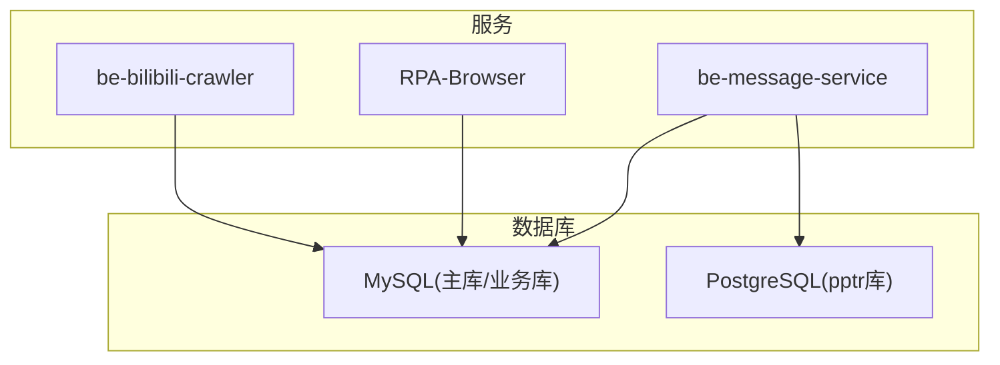
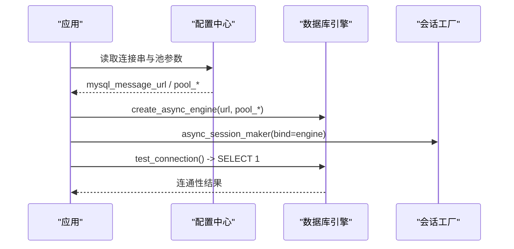
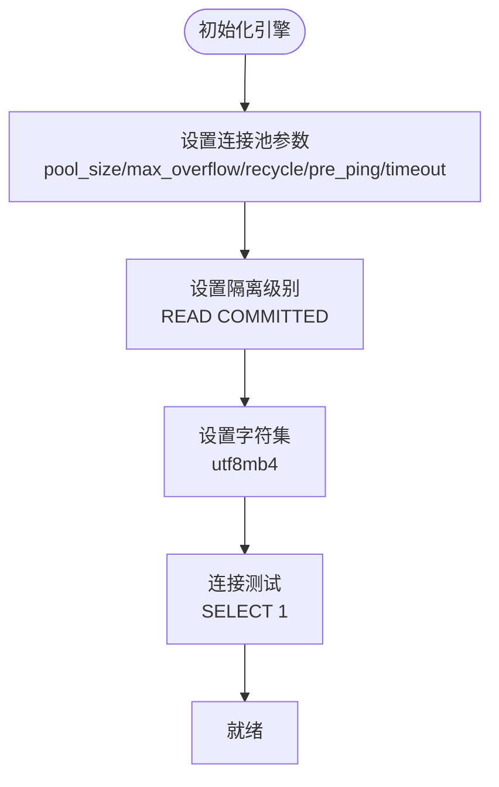
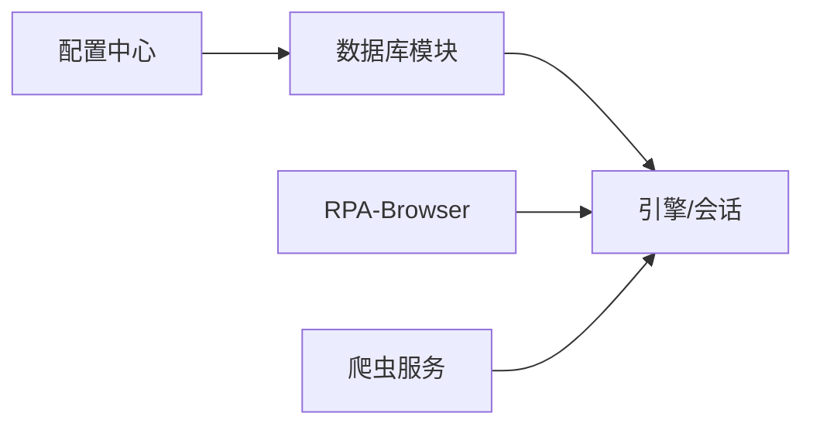

# 数据库安全配置

<cite>
**本文引用的文件**
- [be-message-service/app/core/config.py](file://be-message-service/app/core/config.py)
- [be-message-service/app/core/database.py](file://be-message-service/app/core/database.py)
- [RPA-Browser/app/utils/depends/session_manager.py](file://RPA-Browser/app/utils/depends/session_manager.py)
- [RPA-Browser/app/config.py](file://RPA-Browser/app/config.py)
- [be-bilibili-crawler/CONFIG.py](file://be-bilibili-crawler/CONFIG.py)
- [RPA-Browser/app/services/admin_audit.py](file://RPA-Browser/app/services/admin_audit.py)
- [be-message-service/app/models/pptr_db.py](file://be-message-service/app/models/pptr_db.py)
</cite>

## 目录
1. [简介](#简介)
2. [项目结构](#项目结构)
3. [核心组件](#核心组件)
4. [架构总览](#架构总览)
5. [详细组件分析](#详细组件分析)
6. [依赖关系分析](#依赖关系分析)
7. [性能与安全注意事项](#性能与安全注意事项)
8. [故障排查指南](#故障排查指南)
9. [结论](#结论)
10. [附录：各数据库安全配置示例](#附录各数据库安全配置示例)

## 简介
本文件面向本项目中的数据库安全配置，覆盖连接安全、访问控制与权限最小化、连接池安全、SQL注入防护、审计日志以及常见问题定位。文档基于仓库中实际代码实现进行说明，并提供可落地的最佳实践建议。

## 项目结构
本项目包含多个服务，均涉及数据库访问与配置：
- be-message-service：消息系统，统一使用 MySQL（主库）与 Postgres（pptr 库），集中管理连接池与会话。
- RPA-Browser：浏览器自动化服务，通过会话管理器创建 SQLAlchemy 引擎与会话。
- be-bilibili-crawler：爬虫服务，集中维护多套 MySQL 连接串与连接池参数。
- 审计与模型：管理员操作审计日志写入、用户表模型等。

图表来源
- [be-message-service/app/core/config.py:41-75](file://be-message-service/app/core/config.py#L41-L75)
- [be-message-service/app/core/database.py:28-46](file://be-message-service/app/core/database.py#L28-L46)
- [RPA-Browser/app/utils/depends/session_manager.py:18-31](file://RPA-Browser/app/utils/depends/session_manager.py#L18-L31)
- [be-bilibili-crawler/CONFIG.py:350-414](file://be-bilibili-crawler/CONFIG.py#L350-L414)

章节来源
- [be-message-service/app/core/config.py:41-75](file://be-message-service/app/core/config.py#L41-L75)
- [be-message-service/app/core/database.py:28-46](file://be-message-service/app/core/database.py#L28-L46)
- [RPA-Browser/app/utils/depends/session_manager.py:18-31](file://RPA-Browser/app/utils/depends/session_manager.py#L18-L31)
- [be-bilibili-crawler/CONFIG.py:350-414](file://be-bilibili-crawler/CONFIG.py#L350-L414)

## 核心组件
- 配置中心（be-message-service）：集中定义 MySQL/Postgres 连接串、连接池大小、回收周期、回显开关、自动迁移开关等。
- 数据库引擎与会话（be-message-service）：创建异步引擎、会话工厂、健康检查、库存在性保障。
- RPA-Browser 会话管理：根据配置创建引擎与会话，设置连接池大小、溢出、回收周期。
- 爬虫服务连接：集中构造多套 MySQL 连接串与连接池参数。
- 审计日志：管理员操作审计写入，失败不阻断业务。
- 用户模型：用户表字段包含密码相关列，需关注存储与传输安全。

章节来源
- [be-message-service/app/core/config.py:41-75](file://be-message-service/app/core/config.py#L41-L75)
- [be-message-service/app/core/database.py:28-46](file://be-message-service/app/core/database.py#L28-L46)
- [RPA-Browser/app/utils/depends/session_manager.py:18-31](file://RPA-Browser/app/utils/depends/session_manager.py#L18-L31)
- [be-bilibili-crawler/CONFIG.py:350-414](file://be-bilibili-crawler/CONFIG.py#L350-L414)
- [RPA-Browser/app/services/admin_audit.py:13-43](file://RPA-Browser/app/services/admin_audit.py#L13-L43)
- [be-message-service/app/models/pptr_db.py:41-63](file://be-message-service/app/models/pptr_db.py#L41-L63)

## 架构总览
下图展示了消息服务对 MySQL 与 Postgres 的连接、会话管理与健康检查流程，以及与配置中心的依赖关系。

图表来源
- [be-message-service/app/core/config.py:41-75](file://be-message-service/app/core/config.py#L41-L75)
- [be-message-service/app/core/database.py:28-46](file://be-message-service/app/core/database.py#L28-L46)
- [be-message-service/app/core/database.py:164-172](file://be-message-service/app/core/database.py#L164-L172)

## 详细组件分析

### 连接池与隔离级别（MySQL）
- 连接池参数：pool_size、max_overflow、pool_recycle、pool_pre_ping、pool_timeout。
- 隔离级别：设置为 READ COMMITTED，降低高并发写场景下的死锁概率。
- 字符集：utf8mb4，避免表情符号等字符异常。
- 连接测试：启动时执行 SELECT 1 验证连通性。

图表来源
- [be-message-service/app/core/database.py:28-46](file://be-message-service/app/core/database.py#L28-L46)
- [be-message-service/app/core/database.py:164-172](file://be-message-service/app/core/database.py#L164-L172)

章节来源
- [be-message-service/app/core/database.py:28-46](file://be-message-service/app/core/database.py#L28-L46)
- [be-message-service/app/core/config.py:55-58](file://be-message-service/app/core/config.py#L55-L58)

### 连接池与隔离级别（PostgreSQL）
- 连接池参数：pool_size、max_overflow、pool_recycle、pool_pre_ping、pool_timeout。
- 用于 pptr 库的只读/读写混合场景，提供独立的会话工厂与健康检查。

章节来源
- [be-message-service/app/core/config.py:65-75](file://be-message-service/app/core/config.py#L65-L75)
- [be-message-service/app/core/database.py:86-102](file://be-message-service/app/core/database.py#L86-L102)
- [be-message-service/app/core/database.py:175-183](file://be-message-service/app/core/database.py#L175-L183)

### RPA-Browser 会话管理
- 根据配置动态创建引擎与会话，设置连接池大小、溢出、回收周期。
- 适用于浏览器信息库等场景。

章节来源
- [RPA-Browser/app/utils/depends/session_manager.py:18-31](file://RPA-Browser/app/utils/depends/session_manager.py#L18-L31)
- [RPA-Browser/app/config.py:140-174](file://RPA-Browser/app/config.py#L140-L174)

### 爬虫服务连接与池化
- 集中构造多套 MySQL 连接串，分别对应不同业务库。
- 为每个连接设置池大小、溢出与回收周期，避免资源耗尽。

章节来源
- [be-bilibili-crawler/CONFIG.py:350-358](file://be-bilibili-crawler/CONFIG.py#L350-L358)
- [be-bilibili-crawler/CONFIG.py:385-391](file://be-bilibili-crawler/CONFIG.py#L385-L391)
- [be-bilibili-crawler/CONFIG.py:408-414](file://be-bilibili-crawler/CONFIG.py#L408-L414)

### 权限与访问控制（最小权限原则）
- 建议为每个服务/模块分配独立数据库账号，仅授予必要的最小权限（如只读、指定表的增删改）。
- 在 be-message-service 中，主库与 pptr 库分离，便于按库粒度授权。
- 在 RPA-Browser 与爬虫服务中，也应遵循“一库一账号”或“一模块一账号”的原则，限制跨库访问。

章节来源
- [be-message-service/app/core/config.py:41-75](file://be-message-service/app/core/config.py#L41-L75)
- [be-bilibili-crawler/CONFIG.py:350-358](file://be-bilibili-crawler/CONFIG.py#L350-L358)

### SQL 注入防护
- 使用 ORM/SQLAlchemy 的参数化查询，避免字符串拼接 SQL。
- 对输入进行严格校验与白名单过滤。
- 在业务层对敏感字段进行长度与格式限制。

[本节为通用安全实践说明，不直接引用具体代码文件]

### 审计日志配置
- 管理员操作审计：成功执行后记录操作痕迹；写入失败仅告警，不影响主业务流程。
- 建议在关键写操作前后增加审计点，并保证审计数据落库的幂等性与不可篡改性。

章节来源
- [RPA-Browser/app/services/admin_audit.py:13-43](file://RPA-Browser/app/services/admin_audit.py#L13-L43)

### 密码与敏感数据存储
- 用户表包含密码相关字段，应确保：
  - 密码以强哈希算法存储（如 bcrypt/argon2），禁止明文。
  - 传输过程使用 TLS 加密。
  - 日志中脱敏输出，避免泄露。
- 建议定期轮换密钥与凭据，并使用安全的密钥管理服务。

章节来源
- [be-message-service/app/models/pptr_db.py:41-63](file://be-message-service/app/models/pptr_db.py#L41-L63)

## 依赖关系分析
- 配置中心被数据库模块引用，提供连接串与池参数。
- 数据库模块负责创建引擎与会话，暴露健康检查能力。
- RPA-Browser 与爬虫服务各自维护连接与池化策略，但都应遵循统一的配置与安全管理规范。

图表来源
- [be-message-service/app/core/config.py:41-75](file://be-message-service/app/core/config.py#L41-L75)
- [be-message-service/app/core/database.py:28-46](file://be-message-service/app/core/database.py#L28-L46)
- [RPA-Browser/app/utils/depends/session_manager.py:18-31](file://RPA-Browser/app/utils/depends/session_manager.py#L18-L31)
- [be-bilibili-crawler/CONFIG.py:350-414](file://be-bilibili-crawler/CONFIG.py#L350-L414)

章节来源
- [be-message-service/app/core/config.py:41-75](file://be-message-service/app/core/config.py#L41-L75)
- [be-message-service/app/core/database.py:28-46](file://be-message-service/app/core/database.py#L28-L46)
- [RPA-Browser/app/utils/depends/session_manager.py:18-31](file://RPA-Browser/app/utils/depends/session_manager.py#L18-L31)
- [be-bilibili-crawler/CONFIG.py:350-414](file://be-bilibili-crawler/CONFIG.py#L350-L414)

## 性能与安全注意事项
- 连接池容量：避免过大导致数据库连接耗尽；message-service 内置防御逻辑，防止误配引发 Too many connections。
- 回收周期：pool_recycle 必须小于数据库 wait_timeout，避免陈旧连接。
- 预检测：启用 pool_pre_ping 减少拿到断开连接的概率。
- 隔离级别：在高并发写场景下，READ COMMITTED 可降低死锁风险。
- 字符集：统一 utf8mb4，避免编码问题。
- 超时与重试：合理设置 pool_timeout 与业务层重试策略，避免雪崩。
- 审计与监控：开启必要的审计日志与指标采集，及时发现异常。

章节来源
- [be-message-service/app/core/config.py:55-58](file://be-message-service/app/core/config.py#L55-L58)
- [be-message-service/app/core/config.py:355-359](file://be-message-service/app/core/config.py#L355-L359)
- [be-message-service/app/core/database.py:28-46](file://be-message-service/app/core/database.py#L28-L46)

## 故障排查指南
- 连接失败：检查连接串、用户名/密码、网络可达性与防火墙规则；使用 test_connection 进行自检。
- 连接泄漏：确认会话生命周期管理，确保在请求结束后释放；在非请求上下文中手动管理会话。
- 性能瓶颈：调整连接池大小与溢出；检查慢查询与索引；评估隔离级别与事务范围。
- 死锁与锁竞争：在高并发写场景下考虑调整为 READ COMMITTED；优化事务粒度与更新顺序。
- 审计缺失：检查审计写入是否失败；确保失败不阻断业务的同时记录告警。

章节来源
- [be-message-service/app/core/database.py:164-183](file://be-message-service/app/core/database.py#L164-L183)
- [RPA-Browser/app/services/admin_audit.py:13-43](file://RPA-Browser/app/services/admin_audit.py#L13-L43)

## 结论
本项目在多服务环境下实现了较为完善的数据库连接与会话管理，具备连接池调优、健康检查与基础的安全措施。建议进一步强化以下方面：
- 统一凭据管理（环境变量/密钥服务），避免硬编码。
- 强制 TLS/SSL 加密连接（数据库驱动支持时）。
- 细化权限最小化与分库分账号策略。
- 完善审计与监控，覆盖关键写操作与异常事件。
- 持续压测与容量规划，确保连接池与数据库资源匹配。

## 附录：各数据库安全配置示例
以下为基于仓库配置的示例要点（不展示具体代码内容）：

- MySQL（消息服务主库）
  - 连接串：包含驱动、用户名、密码、主机、端口、数据库名与字符集。
  - 连接池：pool_size、max_overflow、pool_recycle、pool_pre_ping、pool_timeout。
  - 隔离级别：READ COMMITTED。
  - 健康检查：启动时执行 SELECT 1。

  章节来源
  - [be-message-service/app/core/config.py:41-58](file://be-message-service/app/core/config.py#L41-L58)
  - [be-message-service/app/core/database.py:28-46](file://be-message-service/app/core/database.py#L28-L46)
  - [be-message-service/app/core/database.py:164-172](file://be-message-service/app/core/database.py#L164-L172)

- PostgreSQL（pptr 库）
  - 连接串：包含驱动、用户名、密码、主机、端口、数据库名。
  - 连接池：pool_size、max_overflow、pool_recycle、pool_pre_ping、pool_timeout。
  - 健康检查：启动时执行 SELECT 1。

  章节来源
  - [be-message-service/app/core/config.py:65-75](file://be-message-service/app/core/config.py#L65-L75)
  - [be-message-service/app/core/database.py:86-102](file://be-message-service/app/core/database.py#L86-L102)
  - [be-message-service/app/core/database.py:175-183](file://be-message-service/app/core/database.py#L175-L183)

- RPA-Browser 会话管理
  - 连接池：pool_size、max_overflow、pool_recycle。
  - 依据配置动态创建引擎与会话。

  章节来源
  - [RPA-Browser/app/utils/depends/session_manager.py:18-31](file://RPA-Browser/app/utils/depends/session_manager.py#L18-L31)
  - [RPA-Browser/app/config.py:140-174](file://RPA-Browser/app/config.py#L140-L174)

- 爬虫服务连接
  - 多套 MySQL 连接串：针对不同业务库。
  - 连接池：pool_size、max_overflow、pool_recycle。

  章节来源
  - [be-bilibili-crawler/CONFIG.py:350-358](file://be-bilibili-crawler/CONFIG.py#L350-L358)
  - [be-bilibili-crawler/CONFIG.py:385-391](file://be-bilibili-crawler/CONFIG.py#L385-L391)
  - [be-bilibili-crawler/CONFIG.py:408-414](file://be-bilibili-crawler/CONFIG.py#L408-L414)

- 审计日志
  - 管理员操作审计：记录操作类型、目标类型、目标 ID、详情；失败仅告警。

  章节来源
  - [RPA-Browser/app/services/admin_audit.py:13-43](file://RPA-Browser/app/services/admin_audit.py#L13-L43)

- 密码存储
  - 用户表包含密码字段；建议使用强哈希存储，传输使用 TLS，日志脱敏。

  章节来源
  - [be-message-service/app/models/pptr_db.py:41-63](file://be-message-service/app/models/pptr_db.py#L41-L63)